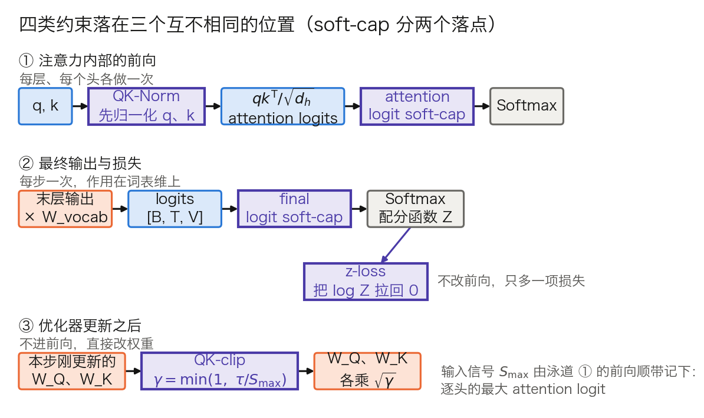

## 6.3 正则化策略：防止过拟合的多重手段

上一节的三条曲线规定的是每一步该走多远，却不对梯度本身的量级作任何假设——峰值学习率调得再准，一个异常放大的梯度照样能让单个批次毁掉整个训练过程。本节管的是两件不同的事，读的时候值得分开记：**泛化侧**（Dropout、权重衰减）压的是模型对训练集的过度贴合，**稳定性侧**（梯度裁剪、初始化与残差缩放、对 logits 的动态约束）压的是训练过程本身的发散。单轮预训练里前者几乎不构成主要矛盾，后者才是真正会让一次长达数月的训练前功尽弃的东西。

### 6.3.1 Dropout

**Dropout** 在训练时随机将一定比例的神经元输出置零，推理时恒等通过。为了让两个阶段的期望一致，实现上用的是 **inverted dropout**：训练时把保留下来的值乘以 $$1/(1-p)$$，$$p = 0.1$$ 即乘 1.111，$$p = 0.5$$ 即乘 2。这样推理端不需要任何改动。

原始 Transformer 论文正文写明的 Dropout 只有两处（率 $$P_{\text{drop}} = 0.1$$）：

- 每个子层的输出，在与子层输入相加并归一化之前（残差 Dropout）
- 词嵌入与位置编码相加之后

常被一并列出的“注意力权重 Dropout”不在论文正文里：该段落在论文的排版源码中被注释掉了，这种写法见于其参考实现与后来的复现。引用这一条时值得区分论文与实现。

Dropout 的工作原理是**防止神经元之间的共适应**——当某些神经元随时可能被关闭时，模型被迫学习更鲁棒的、分布式的特征表示，而非依赖特定的少数神经元。

现代超大规模语言模型预训练时通常**不使用 Dropout**——PaLM 论文明确说明训练未用 Dropout，仅微调时使用 0.1。这是因为在极大规模数据上训练时，模型远未过拟合，Dropout 反而可能减慢收敛。但它偶尔会以稳定性工具的身份回来：Chameleon 报告 7B 模型需要 Dropout 与 z-loss 并用才稳定，34B 则只需 z-loss——同一个开关在不同规模上的角色可以完全不同。

### 6.3.2 梯度裁剪与梯度爆炸防止

**梯度爆炸问题**：在深度网络中，梯度通过链式法则逐层反向传播。如果各层雅可比矩阵的奇异值（谱范数）普遍大于 1，多层连乘后梯度范数就会指数级放大。在极端情况下，梯度可能溢出为 NaN 或 Inf，完全破坏模型参数。这在层数很深的模型上更容易出现——注意这里的深度指的是**层数**，而不是序列长度：Transformer 里任意两个位置之间是 O(1) 的注意力路径（[2.5 节](../02_attention/2.5_complexity_limits.md)），反传路径的长度由 $$L$$ 决定，序列变长并不会拉长它。

**梯度裁剪**（Gradient Clipping）是最直接的防护手段。常见的实现是按**全局范数**裁剪：

$$\|g\| = \sqrt{\sum_{p}\|g_p\|_2^2},\qquad \text{若 } \|g\| > \text{max\_norm}，\text{则所有 } g_p \leftarrow g_p\cdot\frac{\text{max\_norm}}{\|g\|}$$

要点在于平方和跨**全部参数**求，不是逐张量各裁各的：这样缩放对所有参数统一，梯度的整体方向完全保留。常用阈值为 1.0，GPT-3、PaLM、DeepSeek-V3 都取这个值（表 6-3）。一次算例：某步全局范数 $$\|g\| = 7.3$$、阈值 1.0，则所有梯度统一乘 `1.0 / 7.3 = 0.137`；若 $$\|g\| = 0.4$$，则这一步什么也不做。

**在 Adam 下，裁剪保护的不是这一步。** 6.1.3 已经算过：把梯度整体乘上任何常数，Adam 的更新一位数字都不变。那么把一次大梯度缩小 0.137 倍，为什么还有用？因为裁剪只改**这一步**，而 $$m$$ 与 $$v$$ 是跨步的移动平均，比例关系被打破了。真正被保护的是这两个状态。

把它算出来。设某参数梯度长期在 0.02 附近，稳态 $$v \approx 4\times10^{-4}$$。某一步来了一个 20 倍的梯度 0.4，按 $$\beta_2 = 0.95$$ 更新：$$v \leftarrow 0.95\times4\times10^{-4} + 0.05\times0.16 = 8.38\times10^{-3}$$，一步抬高 21 倍。此后梯度恢复正常，但更新要除以 $$\sqrt{v}$$，于是被压小 $$\sqrt{21} = 4.58$$ 倍。衰回去的不是 $$v$$ 本身，而是它**超出稳态的那一部分**，按 $$\beta_2^{\,k}$$ 递减：

$$v_k = v_{\infty} + (v_0 - v_{\infty})\,\beta_2^{\,k}$$

代入 $$v_{\infty} = 4\times10^{-4}$$、$$v_0 = 8.38\times10^{-3}$$、$$\beta_2 = 0.95$$，下面三个倍数都由这一式算出：

- 再过 20 步，$$v$$ 仍是稳态的 8.2 倍，更新被压小 2.9 倍；
- 再过 45 步，3.0 倍，压小 1.7 倍；
- 再过 60 步，1.9 倍，压小 1.4 倍。

**一次尖峰梯度，会让相关参数在随后几十步里近乎停止学习。** 一阶矩同样被污染，只是窗口短一些（$$1/(1-\beta_1) = 10$$ 步）。这就是梯度裁剪对 Adam 系优化器仍然必要的原因，也是它和 6.3.6 那几种手段的分工：裁剪按住的是**参数更新的幅度**，那几种按住的是**前向计算中 logits 的量级**。

**实现与监控。** PyTorch 的 `torch.nn.utils.clip_grad_norm_()` 返回裁剪**之前**的总范数，可以直接当成监控量记下来。分布式下要当心：参数被张量并行、流水线并行或 FSDP 切开后，各分片只持有梯度的一部分，全局范数必须把各分片的平方和先归约再开方，否则每个 rank 算出的“全局范数”都是偏小的，缩放系数也就各不相同。FSDP 为此提供了自己的 `clip_grad_norm_` 方法，Megatron-LM 用 `--clip-grad` 指定阈值（默认 1.0）并在其分布式优化器内部完成跨组归约。

比损失曲线更早的健康度信号是**裁剪触发比例**：记录每步 $$\|g\|$$ 是否超过阈值。一个稳定的训练里这个比例通常很低且平稳；它先开始上升、然后损失才出问题，是最常见的顺序。

**梯度消失问题**虽然在现代 Transformer 中不如梯度爆炸严重（得益于残差连接和层归一化），但在极其深的模型中仍可能出现。梯度消失时，某些参数的梯度接近零，导致这些参数几乎停止更新。相比梯度爆炸的灾难性，梯度消失的危害是隐性的——模型可能能够训练，但某些早期层学习效率极低。

### 6.3.3 权重衰减

**权重衰减**（Weight Decay）在每次参数更新时对参数施加微小的收缩，AdamW 下的形式见 6.1.4：

$$\theta \leftarrow \theta - \eta\lambda\theta - \eta\cdot(\text{优化器给出的更新})$$

在 LLM 单轮预训练里，它的作用与“防止过拟合”这个教科书说法已经不太一样。15 万亿词元只过一遍，模型远谈不上记住训练集；权重衰减实际起作用的地方在**优化动力学**：它给参数范数设了一个平衡点，抵消更新带来的范数增长。6.1.4 给出的时间尺度 $$1/(\eta\lambda)$$ 说明这种收缩贯穿整个训练，不是收尾的修饰。Moonlight 的实验给出了反面例子：Muon 不加权重衰减时，权重与层输出的 RMS 会一路涨到超出 bf16 的高精度区间，加上之后才稳住并取得更低的验证损失。

常见取值是 $$\lambda = 0.1$$（GPT-3、DeepSeek-V3），也有把它定义成当前学习率倍数的动态写法（PaLM 取 $$\text{lr}^2$$，Llama 3 的 scaling-law 实验取 $$0.1\times\text{lr}$$）。哪些参数不做衰减见 6.1.4 的 no-decay 组。

### 6.3.4 梯度累积

**梯度累积**（Gradient Accumulation）是在显存有限时扩大有效批次大小的重要技术。其基本思想是：不在每个小批次后更新参数，而是累积多个小批次的梯度后统一更新。有效批次大小该定到多大，由 6.4.1 的临界批量决定；这里只讲怎样把它凑出来。

```python
import contextlib

accumulation_steps = 4
optimizer.zero_grad()
for i in range(accumulation_steps):
    batch = get_batch(size=64)
    sync = (i == accumulation_steps - 1)          # 只在最后一次同步梯度
    with contextlib.nullcontext() if sync else model.no_sync():
        loss = model(batch)
        (loss / accumulation_steps).backward()    # 梯度累积到各参数的 param.grad
torch.nn.utils.clip_grad_norm_(model.parameters(), 1.0)   # 裁剪在累积之后
optimizer.step()
```

三处细节决定这段代码对不对。

**其一，归一化的分母。** 上面假设 `loss` 已是小批次内按样本平均的标量，除以 `accumulation_steps` 才与一次性使用大批次匹配。对按词元计损失的语言模型，如果各小批的有效词元数不同，这样做是错的。算例：两个小批，一个有 1,000 个有效词元、平均损失 2.0，另一个有 100 个、平均损失 3.0。先各自取均值再平均得 `(2.0 + 3.0) / 2 = 2.50`；按词元加权得 `(2000 + 300) / 1100 = 2.09`。相差 0.41，比很多消融实验的效应还大。稳妥的做法是对累积窗口内所有非填充词元的交叉熵求和，再除以该窗口的非填充词元总数。

**其二，通信。** DDP 在每次 `backward()` 结束时触发 AllReduce。不加处理时，累积 N 步就要通信 N 次，而其中前 N−1 次的结果马上会被下一次覆盖。`model.no_sync()` 把前 N−1 次的同步关掉，只在最后一次归约累积好的梯度，通信量因此降到 1/N。

**其三，裁剪的位置。** 全局范数要在**累积完成之后**、更新之前算一次。逐个小批裁剪等于改变了各小批在合成梯度里的权重，与大批次不再对应。

**等价性到什么程度。** 若归一化正确，累积 N 个小批得到的梯度**等于**在 N 倍大的批次上算出的梯度，依据只是求导的线性，与用哪种优化器无关。但这条等价只在精确算术下成立：浮点累加顺序不同会带来舍入差异；含 Dropout 时两边只是分布相同而非逐值相同；依赖批内统计量的层（BatchNorm）则根本不等价——Transformer 用的是逐样本归一化的 LayerNorm/RMSNorm，不受此影响。

**对学习率的影响。** 学习率通常按有效批次大小调整。SGD 场景常用**线性缩放法则**（批次扩大 $$k$$ 倍，学习率乘 $$k$$，出自[大批次训练的经典实践](https://arxiv.org/abs/1706.02677)），Adam 等自适应优化器则常用更保守的**平方根法则**（乘 $$\sqrt{k}$$）。两条都是经验规则，并且都假定批量仍在临界批量以内。

### 6.3.5 训练稳定性的实践建议

大规模 Transformer 训练中的稳定性问题是一个持续的工程挑战。

**损失尖峰的机制与处置。** 训练中偶尔出现的损失突然飙升，直接诱因通常是一批梯度异常大，随后由 6.3.2 的 $$v$$ 污染机制把影响拖长几十步。但“坏数据”不是完整解释。PaLM 报告其最大的模型在训练中出现约 20 次尖峰，出现时机高度不规律，小模型上则没有；他们的处置是**从尖峰前约 100 步的检查点重启，并跳过约 200 到 500 个数据批次**。关键在于同一篇论文做的对照：把尖峰附近的那些批次单独拿到另一个更早的检查点上重放，**不会**再触发尖峰。所以尖峰来自“特定数据批次”与“特定参数状态”的组合，不是数据本身有毒。这也解释了为什么训练框架必须能定位并跳过指定批次，以及为什么要保留多个历史检查点（[7.7 节](../07_distributed_training/7.7_checkpoint.md)）。

相反的一面是，尖峰并非不可避免。Llama 3 405B 报告“很少观察到损失尖峰，也不需要人工干预来纠正发散”；Kimi K2 报告用 MuonClip 训完 15.5 万亿词元零损失尖峰。前者靠的是保守的批量与学习率配方，后者靠的是 6.3.6 的 QK-clip。

**参数初始化与残差分支缩放。** 合理的初始化确保各层激活值与梯度处于合理范围。多数 Transformer 实现采用较小的初始化标准差（如 $$\mathcal{N}(0,\,0.02^2)$$）；更关键的是 **GPT-2／Megatron 的残差缩放**——把每个子层中直接写入残差流的输出投影（注意力的 $$W_O$$、FFN 的 $$W_2$$）额外乘以 $$1/\sqrt{2L}$$。[GPT-2 原文](https://cdn.openai.com/better-language-models/language_models_are_unsupervised_multitask_learners.pdf)的写法是“把残差层的权重在初始化时按 $$1/\sqrt{N}$$ 缩放，$$N$$ 为残差层数”，$$N$$ 即残差子层总数 $$2L$$。

动机可以一行算出来。设残差流入口方差为 1，每个子层输出的方差为 $$\sigma^2$$，各子层输出近似互不相关，则 $$2L$$ 次累加后残差流的方差是 $$1 + 2L\sigma^2$$。取 $$\sigma^2 = 1$$：

| 层数 $$L$$ | 12 | 32 | 48 | 96 |
| --- | ---: | ---: | ---: | ---: |
| 不缩放时的残差流方差 | 25 | 65 | 97 | 193 |
| 乘 $$1/\sqrt{2L}$$ 之后 | 2 | 2 | 2 | 2 |
| 对应的初始化标准差 $$0.02/\sqrt{2L}$$ | 0.00408 | 0.00250 | 0.00204 | 0.00144 |

表 6-8：残差分支缩放把残差流方差的深度依赖抵消掉。缩放使每个子层的方差贡献变成 $$\sigma^2/(2L)$$，$$2L$$ 次累加后合计恰为 $$\sigma^2$$，与层数无关。

不缩放的后果不是“把信号推入饱和区”——Pre-LN 结构里子层输入先归一化，不存在饱和。后果是**残差流的方差随深度线性增长**，于是每个子层的输出相对残差流越来越小（后层对输出的影响被稀释），同时最终 logits 的尺度随深度失控，直接喂给 6.3.6 要治的那个问题。这正是“残差让梯度流过百层”（[3.5 节](../03_components/3.5_residual.md)）在前向方向上的对偶保障：3.5 节关心的是梯度能不能传回去，这里关心的是激活会不会在前向上越滚越大。

**监控哪些量，看到什么算有问题。** 6.3.2 的裁剪触发率与这里的几项一起，构成一份可操作的清单：

| 监控量 | 正常时的样子 | 异常信号 |
| --- | --- | --- |
| 首步损失 | 约 $$\ln n_{\text{vocab}}$$（6.1.1） | 明显偏低多为标签泄漏，明显偏高多为初始化或 logits 缩放有误 |
| 全局梯度范数 | 平稳，缓慢下降 | 突刺，或整体台阶式抬升 |
| 裁剪触发比例 | 低且平稳 | 持续上升，通常早于损失异常 |
| 最后一层输出的范数 | 缓慢增长 | 失控增长，与未来的损失发散强相关 |
| 逐头最大 attention logit | 有界 | 持续攀升（6.3.6） |

表 6-9：训练过程中值得长期记录的几个量。第四行出自 Chameleon 的观察：训练发散可能迟至训练进度的 20% 到 30% 才在损失上显现，而监控最后一层输出范数的失控增长与预测未来的损失发散高度相关。这份清单的价值在于，除第一行是一次性自检外，其余四项都在损失曲线之前先动。

### 6.3.6 注意力 logits 的动态约束：QK-Norm、z-loss 与 logit soft-cap

[2.2 节](../02_attention/2.2_scaled_dot_product.md)已经解释了为什么点积要除以 $$\sqrt{d_h}$$（$$d_h$$ 是每头宽度，第 2 章记作 $$d_k$$，本节沿用 [3.8 节](../03_components/3.8_gpt_inference_flow.md)表 3-18 的记法）：当 $$q$$ 与 $$k$$ 的分量独立同分布于 $$\mathcal{N}(0,1)$$ 时，点积方差等于 $$d_h$$，除以 $$\sqrt{d_h}$$ 把它拉回 1，Softmax 因而落在梯度活跃区。但这个论证有一个容易被忽略的前提：**那个分布假设只在初始化时刻成立**。训练一旦开始，$$W_Q$$ 与 $$W_K$$ 的范数会持续增长，而 $$\sqrt{d_h}$$ 是个常数，它不会跟着一起长。于是 attention logits 可以在训练中途重新爆炸，缩放因子对此无能为力——**$$\sqrt{d_h}$$ 是静态修正，管不住动态漂移**。

这不是理论担忧。Google 把 ViT 扩到 220 亿参数时观察到：约 80 亿参数规模上训练损失会在几千步后发散，[原因是 attention logits 出现极大值](https://arxiv.org/abs/2302.05442)，导致注意力权重几乎变成 one-hot、熵接近零；论文附录给出的量级是——不加归一化时，attention logits 会迅速涨到 **50000 以上**。熵接近零意味着每个查询只盯住一个键，梯度几乎不再流向其他位置，模型实际上失去了继续学习注意力分布的能力。

那么范数为什么会一路涨？[Chameleon 报告给出的机制解释很有说服力](https://arxiv.org/abs/2405.09818)：它把发散的根源归到 Softmax 的**平移不变性**（$$\text{softmax}(z) = \text{softmax}(z+c)$$）。整体抬高 logits 不改变输出，于是模型要让分布更尖锐时，除了拉开 logits 之间的相对差距，还可以简单地把整体范数抬上去，而后者**没有任何回压**。在多模态共享权重的设定下，各模态会靠略微抬高自身范数互相「竞争」，起初无害，直到超出 bf16 的有效表示范围就发散。单模态下的同一现象被称为 **logit drift**。

三种手段被用来给 logits 加上动态约束，它们作用在**不同的位置**，理解这一点比记住名字更重要——Chameleon 报告的提法很清楚：Transformer 里的 Softmax 出现在两个地方，**注意力内部**和**最终输出**。本节末还会补上第四类，它落在前向之外。图 6-2 把四类手段的落点画在一起。



图 6-2：四类约束落在三个互不相同的位置，soft-cap 按落点拆成两个框，共五个框（[生成脚本](https://github.com/yeasy/llm_internals/blob/main/tools/figures/ch06_logit_guards.py)）。泳道 ① 是注意力内部的前向，每层每头各做一次；泳道 ② 是最终输出与损失，每步一次；泳道 ③ 在优化器更新之后，不进前向。z-loss 从最终 Softmax 的配分函数分叉出去，只多加一项损失。

**QK-Norm**：在点积**之前**先归一化 $$Q$$ 与 $$K$$：

$$\text{softmax}\left(\frac{1}{\sqrt{d_h}}\,\text{LN}(XW^Q)\big(\text{LN}(XW^K)\big)^{\top}\right)$$

这是 ViT-22B 给出的 LayerNorm 版本。LLM 里更常见的是 RMSNorm 版本，逐头在 $$d_h$$ 维上做：Gemma 3 在 Hugging Face 中的实现就是两个形状为 `head_dim` 的 `q_norm`、`k_norm`，插在把 Q/K 拆成头之后、施加 RoPE 之前。归一化把 $$q$$、$$k$$ 的范数钉在固定尺度上，logits 的量级于是不再随权重范数漂移——Chameleon 的措辞是它「直接控制送入 Softmax 的输入的范数增长」。它补上的正是 $$\sqrt{d_h}$$ 缺的那一半：静态修正管初始化，QK-Norm 管整个训练过程。

它到底把 logits 钉得多紧，可以算出来。若归一化后取单位增益，则 $$\|q\| = \|k\| = \sqrt{d_h}$$，由柯西—施瓦茨不等式 $$|q\cdot k| \le d_h$$，除以 $$\sqrt{d_h}$$ 后 attention logit 的绝对上界恰是 $$\sqrt{d_h}$$：$$d_h = 64$$ 时 8，$$d_h = 128$$ 时 11.3。对照两个量级——Kimi K2 给 QK-clip 设的阈值是 100，ViT-22B 观察到的失控值是 50000——可见这是本节四种手段里最硬的一条约束。真实实现里的 RMSNorm 带一个可学习的逐维增益，上界因此是 $$\sqrt{d_h}$$ 乘以增益的量级。这正是 QK-Norm 的实质：它换来的不是“绝对有界”，而是“尺度由一组显式的、会被权重衰减和梯度共同约束的参数决定，不再由 $$W_Q$$、$$W_K$$ 的范数自由漂移决定”。

**但它只管注意力内部那个 Softmax**——同一份报告明确写道，QK-Norm 有助于 Transformer 内部的 Softmax，**并不解决最终 Softmax 上的 logit 漂移**。这就引出了第二种手段。

**z-loss**：约束的正是**最终 Softmax 的归一化项本身**。PaLM 在标准语言建模损失之外加了一项[辅助损失 $$z_{\text{loss}} = 10^{-4}\cdot\log^2 Z$$](https://arxiv.org/abs/2204.02311)（$$Z=\sum_i e^{x_i}$$ 即 Softmax 的配分函数），把 $$\log Z$$ 往 0 上拉。它拴住的就是上面那个平移自由度：损失本身不管整行 logits 偏移多少，于是它可以自由漂到很大的绝对值上，而 $$e^{z}$$ 在低精度下会立刻失去精度。

系数为什么能取到 $$10^{-4}$$ 这么小而仍然有效？把这一项的取值代出来：$$\log Z = 1$$ 时是 $$10^{-4}$$，$$\log Z = 5$$ 时 $$2.5\times10^{-3}$$，$$\log Z = 10$$ 时 0.01，$$\log Z = 50$$ 时 0.25。主损失本身在 2 上下，所以 $$\log Z$$ 正常时这一项完全无感；一旦漂到几十，它才开始有可比的分量。平方项加小系数，等于一个只在远处才收紧的软约束。

它对相对差距的影响则是**主要约束平移、但不完全中立**：$$\partial(\log^2 Z)/\partial z_i = 2\log Z\cdot\hat p_i$$，对各 logit 的下压与其概率成正比，概率高的被压得多一点。这与模型真正要学的相对差距并不正交，只是量级上被系数压得很小。Chameleon 沿用了这一项但把系数取为 $$10^{-5}$$，并报告 7B 需要 Dropout 与 z-loss 并用才稳定，34B 则只需 z-loss。MoE 的路由器有完全相同的问题，[ST-MoE 因此引入了 router z-loss](https://arxiv.org/abs/2202.08906)，并说明它是最终 Softmax 上那个 z-loss 的改编。

**logit soft-cap**：用 $$\tanh$$ 做软截断，把 logits 压进有界区间：

$$\text{logits} \leftarrow c\cdot\tanh(\text{logits}/c)$$

[Gemma 2 在每个注意力层和最后一层都做了这个截断](https://arxiv.org/abs/2408.00118)，注意力层取 $$c=50.0$$、最后一层取 $$c=30.0$$；Hugging Face 的 Gemma 2 配置里对应 `attn_logit_softcapping` 与 `final_logit_softcapping` 两个字段，默认值正是 50.0 与 30.0。这个函数的形状值得代几个数：$$c = 50$$ 时，输入 1 出 1.000，输入 10 出 9.869，输入 50 出 38.08，输入 100 出 48.20，输入 1000 出 50.00。小值近似恒等，大值平滑饱和——与硬截断不同，它处处可导，不会把梯度直接截成 0。

它的代价在工程侧：截断插在 Softmax 之前，融合注意力核（FlashAttention 一类，见 [10.3 节](../10_inference_optimization/10.3_flash_attention.md)）必须为它单独适配——FlashAttention 的 Python 接口为此带了一个 `softcap` 参数。这也是为什么下一代直接换了方案：[Gemma 3 写明把 Gemma 2 的 soft-capping 换成了 QK-norm](https://arxiv.org/abs/2503.19786)。该报告只陈述了这一替换，并未声称两者的稳定性收益相当。

**QK-clip：为什么还需要第四条路**。[6.1 节](6.1_loss_optimizer.md)提到 Kimi K2 用 MuonClip 训完 15.5 万亿词元零损失尖峰，其中的 Clip 指的就是 QK-clip。[K2 报告把选它的理由写得很直接](https://arxiv.org/abs/2507.20534)：他们发现 attention logits 爆炸在用 Muon 时比用 AdamW 更频繁，而现有手段都不够——**logit soft-cap 虽然直接裁剪 attention logits，但 Q 与 K 的点积在被裁剪之前就已经可以涨得过大**；而 **QK-Norm 不适用于 MLA，因为 MLA 的 Key 矩阵在推理时并不完整物化**（[10.2 节](../10_inference_optimization/10.2_kv_cache.md)解释了 MLA 为何要把 K 留在压缩域）。

QK-clip 的落点因此完全不同：不改前向结构、也不加损失项，而是在**优化器更新之后**按实测的逐头最大 logit 反过来缩放 $$W_Q$$ 与 $$W_K$$。前向时顺带记下每个头在本批次上的最大 logit

$$S_{\max}^{h} = \frac{1}{\sqrt{d_h}}\max_{X\in B}\max_{i,j} Q_i^{h}K_j^{h\top}$$

更新完参数后，对超出阈值 $$\tau$$ 的头取 $$\gamma_h = \min(1, \tau/S_{\max}^{h})$$，把该头的 $$W_Q$$ 与 $$W_K$$ 各乘 $$\sqrt{\gamma_h}$$，两者相乘后 logit 恰好缩小 $$\gamma_h$$ 倍。代两个数：$$\tau = 100$$、$$S_{\max} = 200$$ 时 $$\gamma = 0.5$$，两个矩阵各乘 0.707；$$S_{\max} = 1000$$ 时 $$\gamma = 0.1$$，各乘 0.316。逐头而不是整层统一做，是因为实测中只有少数头会爆，对其余头的干预应当为零。MLA 下共享的旋转分量不能这样拆，K2 的做法是只对逐头独有的分量做：$$q^C$$ 与 $$k^C$$ 各乘 $$\sqrt{\gamma_h}$$，逐头的旋转分量 $$q^R$$ 乘 $$\gamma_h$$。

K2 取 $$\tau = 100$$ 训练完整个 1 万亿参数模型，并报告最大 logit 先被压在 100 这条线上，约 30% 的训练步之后自行回落到正常区间，全程不需要调整 $$\tau$$。这说明 QK-clip 更像一副**训练早期的护具**，而不是一个永久生效的约束。

表 6-10 把四类手段放在一起对照。

| 手段 | 作用位置 | 改前向 | 加损失项 | 对融合注意力核 | 与 MLA 兼容 | 代表模型 |
| --- | --- | --- | --- | --- | --- | --- |
| QK-Norm | 点积之前，注意力内部 | 是 | 否 | 友好 | 不适用（K 不完整物化） | ViT-22B、Chameleon、Gemma 3 |
| attention logit soft-cap | Softmax 之前，注意力内部 | 是 | 否 | 须专门适配 `softcap` | 可 | Gemma 2 |
| final logit soft-cap | 末层 Softmax 之前 | 是 | 否 | 无关 | 可 | Gemma 2 |
| z-loss | 最终 Softmax 的 $$\log Z$$ | 否 | 是 | 无关 | 可 | PaLM、Chameleon、ST-MoE（路由器） |
| QK-clip | 优化器更新之后 | 否 | 否 | 无关 | 可（只缩逐头分量） | Kimi K2（MuonClip） |

表 6-10：四类约束的对照，soft-cap 按落点拆成两行，共五行。“改前向”一栏决定它是否需要重新适配推理路径：改前向的三种在推理时也必须原样执行，z-loss 与 QK-clip 则只影响训练。“与 MLA 兼容”一栏解释了 K2 为什么不能直接用前两种。

把这一小节接回 6.3.5 的清单：**梯度裁剪管的是参数更新的幅度，这几种手段管的是前向计算中 logits 的量级**。两者拦的是不同环节的失控，实践中通常同时开启；只有梯度裁剪而不管 logits，正是很多“裁剪已经开了、尖峰照来”的排查会卡住的地方。
