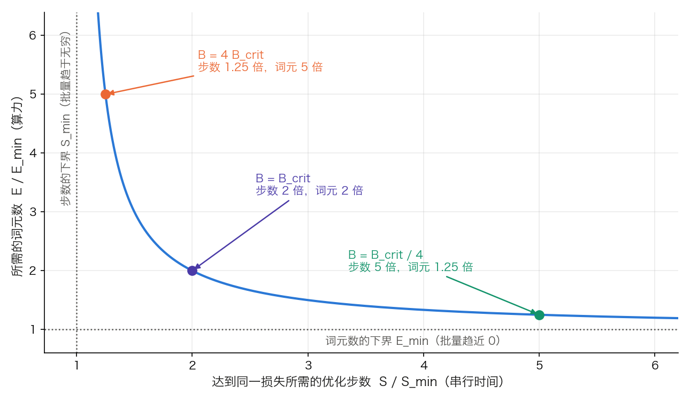
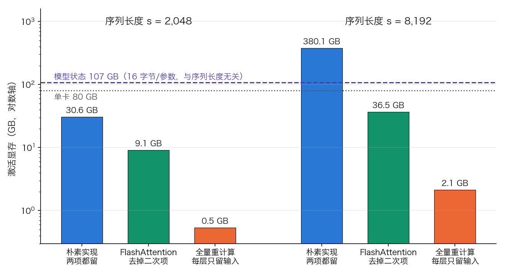

## 6.4 批次与序列长度：效率与质量的平衡

批次大小（Batch Size）和序列长度（Sequence Length）是影响训练效率、模型质量和显存占用的两个关键变量。6.3.4 节讲梯度累积时，把有效批次大小当成一个已经定好的目标——显存放不下就多累积几步凑上去；至于这个目标该定到多大，那一节没有回答。本节先给这个数字划出上界，再转向与它一起吃掉显存的另一个变量：序列长度，最后把两者合并成一笔可以复核的显存账。

### 6.4.1 批次大小的影响

**大批次的优势**：

- 更稳定的梯度估计：批量扩大 $$k$$ 倍，梯度估计的方差降到 $$1/k$$
- 更高的 GPU 利用率：矩阵乘法的 $$M$$、$$N$$ 维更大，算术强度更高，更容易把运算单元喂饱
- 更少的串行步数：同样的词元预算下参数更新次数更少，通信与优化器开销被摊薄

**大批次的风险**：

- **样本效率下降**：越过临界批量后，再扩大批量几乎不再减少步数，词元却照样多花——这是 LLM 单轮预训练里最实际的代价，下文会把它算成一张表
- **内存瓶颈**：直接增大物理批次会线性增加激活显存，很快达到硬件限制
- **学习率的敏感性增加**：大批次通常需要重调学习率，增加超参调优的复杂度

教科书上还有一条“大批次陷入尖锐极小、泛化差”的说法，它来自多轮训练的视觉任务，在只过一遍数据的 LLM 预训练里并不是主要矛盾，学界对“尖锐即泛化差”本身也有争议。真正把批量上限压住的是下面这条。

**实践中的折中**：现代训练通常使用**梯度累积**（见 [6.3.4](6.3_regularization.md)）来在显存约束下达成大的有效批次大小。物理批次大小主要受单卡显存、序列长度和并行策略约束；梯度噪声与学习率调度则由全局有效批次决定。

原始 Transformer 每个训练批次包含源、目标各约 25,000 个词元。现代大语言模型的批次规模要大得多——GPT-3 使用 320 万词元/批次，Llama 3 从初始阶段的 400 万词元/批次逐步增大到 1600 万，DeepSeek-V3 从 3,072 条序列升到 15,360 条（序列长 4K，即 1,258 万到 6,291 万词元）。这些是全局训练批次，通常由数据并行、张量并行、流水线并行、上下文并行、micro-batch 调度和必要的梯度累积共同实现，而不是靠单节点显存直接承载。

**全局批量是怎样凑出来的。** 一条恒等式把 6.3.4 与这里接上：

$$\text{全局批量（词元）} = \text{micro-batch} \times \text{序列长度} \times \text{累积步数} \times \text{数据并行度}$$

代入 Llama 3 405B 后期的 1,600 万词元、序列长度 8,192：`16e6 / 8192 = 1,953` 条序列/步。若数据并行度为 128、每卡 micro-batch 为 1，则需要 `1953 / 128 = 15.3` 步累积。反过来，初期的 400 万词元配 4,096 的序列长度是 977 条序列/步，同样的并行配置只需累积 8 步。这条式子里任何一项翻倍，其余三项就要相应地减半才能维持同一个全局批量——它是第七章各种并行度取值的硬约束（[7.4 节](../07_distributed_training/7.4_pipeline_hybrid.md)）。

#### 临界批量：为什么不能靠加卡无限扩数据并行

上面那些数字看起来像是「显存和工程能力允许多大就多大」，但其实存在一个与硬件无关的上界。[McCandlish 等人提出的**梯度噪声尺度**](https://arxiv.org/abs/1812.06162)可以预测「最大有用批量」。它最简形式的定义是

$$\mathcal{B}_{\text{simple}} = \frac{\operatorname{tr}(\Sigma)}{|G|^2}$$

分子是梯度各分量方差之和，分母是真实梯度模长的平方——本质上就是梯度在样本之间的信噪比的倒数。这个量可以实测：用大小为 $$B$$ 的批量估计梯度时，相对误差恰为 $$\mathcal{B}_{\text{simple}}/B$$，于是取两个不同的批量各算一次梯度模长，就能同时解出 $$|G|^2$$ 与 $$\operatorname{tr}(\Sigma)$$。

**取舍是一条双曲线。** 该文的核心结果是：达到同一目标损失所需的优化步数 $$S$$ 与样本数 $$E$$ 满足

$$\left(\frac{S}{S_{\min}}-1\right)\left(\frac{E}{E_{\min}}-1\right) = 1$$

其中 $$S_{\min}$$ 是批量趋于无穷时的步数下界，$$E_{\min}$$ 是批量趋近 0 时的样本数下界，而**临界批量**（critical batch size）正是二者之比 $$\mathcal{B}_{\text{crit}} = E_{\min}/S_{\min}$$。把 $$B/\mathcal{B}_{\text{crit}} = r$$ 代进去可以解出一组干净的关系：$$S/S_{\min} = 1 + 1/r$$，$$E/E_{\min} = 1 + r$$。

| $$B / \mathcal{B}_{\text{crit}}$$ | 1/4 | 1 | 4 | 16 |
| --- | ---: | ---: | ---: | ---: |
| 步数 $$S/S_{\min}$$ | 5 | 2 | 1.25 | 1.06 |
| 词元 $$E/E_{\min}$$ | 1.25 | 2 | 5 | 17 |

表 6-11：批量偏离临界批量的代价，由取舍式直接解出。在 $$\mathcal{B}_{\text{crit}}$$ 上，步数和词元都恰好是各自下界的两倍——这是两项开销的折中点。往右每翻一倍批量，步数的改善迅速趋零而词元开销线性上涨：从 4 倍到 16 倍，步数只从 1.25 降到 1.06，词元却从 5 涨到 17。图 6-3 把这条双曲线和表里的三个点画在一起。

图 6-3：批量在「步数」与「词元数」之间的取舍（[生成脚本](https://github.com/yeasy/llm_internals/blob/main/tools/figures/ch06_batch_tradeoff.py)）。横轴是达到同一损失所需的优化步数（串行时间），纵轴是所需的词元数（算力），两条虚线是各自的下界。曲线的两端都很陡：靠近任一渐近线时，为了再换一点点都要付出成倍的另一项。

**临界批量有多大。** Kaplan 等人在 Transformer 语言模型上把它拟合成损失的幂律：

$$\mathcal{B}_{\text{crit}}(L) \approx \frac{B_*}{L^{1/\alpha_B}},\qquad B_*\approx 2\times10^{8}\ \text{词元},\ \alpha_B \approx 0.21$$

代入几个损失值：`L = 3.0 → 107 万词元`，`L = 2.5 → 255 万`，`L = 2.0 → 737 万`，`L = 1.8 → 1,217 万`。论文自己的概括是“损失每降 13%，临界批量约翻一倍”（代入验算：$$(1/0.87)^{1/0.21} = 1.94$$）。这些数与 GPT-3 的 320 万、Llama 3 的 400 万到 1,600 万落在同一量级。两条使用前提：损失以该文自己分词器下的 nats 计，换分词器不能直接套用；该文的 $$\mathcal{B}_{\text{crit}}$$ 是从训练曲线直接测出的，噪声尺度只是它的一个预测器。

这条公式有两个反直觉之处，恰恰是它有用的地方。**其一，临界批量随训练推进而增大**：$$\operatorname{tr}(\Sigma)$$ 大致不变而 $$|G|$$ 随接近极小点而下降，信噪比因此升高——这正是「批量预热」（batch size warmup）的依据。需要注意归因的分寸：PaLM 在解释自己的批量日程时直接引用了噪声尺度这项工作，写明“早期小批量的样本效率更高，后期大批量因梯度估计更准而更有利”；Llama 3 给出的理由则是“前期小批量利于训练稳定，后期增大以提高效率”，并未援引噪声尺度。两者的做法一致，论证不同。**其二，临界批量主要取决于当前损失而不直接依赖模型规模**——Kaplan 等人明确写道 $$\mathcal{B}_{\text{crit}}(L)$$ 与模型大小无关，只通过已达到的损失值发生联系。所以「模型更大就该配更大的批」这个推论并不成立；成立的是「训得更好就该配更大的批」。

对分布式训练，这个上界有一个直接后果：**数据并行的可扩展性是有天花板的**。当卡数继续增加、全局批量已经越过临界批量时，再加卡换不来收敛速度，只会摊薄每卡的计算量。此时唯一的出路是把新增的卡投到别的并行维度上——张量并行、流水线并行、上下文并行（[7.3](../07_distributed_training/7.3_model_tensor_parallel.md)、[7.4 节](../07_distributed_training/7.4_pipeline_hybrid.md)）。**「为什么大规模训练非要搞三维并行」这个问题的答案，一半在显存，另一半就在这里。**

### 6.4.2 序列长度的管理

序列长度影响两件事：注意力的计算量按 $$O(n^2)$$ 增长，以及注意力中间结果的显存。后者的 $$O(n^2)$$ 只对朴素实现成立——FlashAttention 分块计算、不物化 $$n\times n$$ 的分数矩阵（[10.3 节](../10_inference_optimization/10.3_flash_attention.md)），显存那一侧的平方项因此消失，计算量那一侧不变。6.4.3 会把这两笔账分开算。

**序列长度什么时候才真的成为瓶颈。** 按 [3.8.7 节](../03_components/3.8_gpt_inference_flow.md)的口径，一层的计算量约为 `24Td² + 2T²d`（$$d$$ 为 $$d_{\text{model}}$$，$$T$$ 为词元数，因果掩码的折半已计入），两项在 `T = 12d` 时相等。这是前向口径，但前后向把两项同乘约 3，比值不变，所以它可以直接当训练口径用。于是注意力项与权重项之比就是 $$s/(12d)$$：

| $$d_{\text{model}} = 4096$$（GPT-3 6.7B） | $$s$$ = 2K | 4K | 32K | 128K |
| --- | ---: | ---: | ---: | ---: |
| 注意力项占训练算力的比例 | 4.0% | 7.7% | 40.0% | 72.7% |

表 6-12：注意力的平方项在训练算力中的占比，由 $$\frac{s/(12d)}{1+s/(12d)}$$ 算出。4K 以内它几乎可以忽略，32K 时已与权重项相当，128K 时反客为主。同一张表换成 GPT-3 175B（$$d = 12288$$）则是 1.4%、2.7%、18.2%、47.1%——**模型越宽，同样的序列长度越不算长**。`12d` 这个门槛只对 GPT-3 式的层（普通多头注意力加 4h 的 GeLU MLP，每层矩阵参数 $$12d^2$$）成立：SwiGLU 与 GQA 把每层权重项抬到约 $$26Td^2$$，门槛相应移到 `13d = 53,248`，同样宽度的 Llama 3 8B 四个数是 3.7%、7.1%、38.1%、71.1%。

**填充与打包**：同一批次中的序列需要统一长度。传统做法是将短序列填充到最大长度，浪费的比例可能极高。取一个批次的 8 条序列，长度分别是 7800、5100、3200、2600、1900、1200、800、400，按模型的最大长度 8,192 填充：有效词元 23,000，实际占用 `8 × 8192 = 65,536`，**填充率 64.9%**——近三分之二的算力花在无意义的位置上。

**序列打包**（Sequence Packing）把多条短序列拼接起来填满一个完整的训练样本。同样这 23,000 个词元打包成 3 条 8,192 的序列，填充率降到 6.4%。打包必须配合 block-diagonal/block-triangular attention mask、FlashAttention varlen 的 `cu_seqlens`，或等价的序列边界元数据，确保不同序列之间不交互。`position_ids` 只能重置位置编号，不能阻断样本间 attention。

打包有两种口径，取舍不同。早期预训练常常**不加文档掩码**：PaLM 的做法是把样本拼接后直接切成恰好 2,048 词元的序列、完全不留填充，样本之间只用一个 `[eod]` 词元隔开，论文未提到任何文档掩码。Llama 3 则明确**使用一个阻断同一序列内不同文档之间自注意力的掩码**，并指出这在长上下文阶段尤其重要——序列越长，一条序列里塞进的文档越多，跨文档污染的机会也越多。代价在工程侧：文档掩码会让各段的计算量不均衡，Llama 3 因此在流水线并行里改用异步点对点通信来消化这种不均衡。

打包还改变了损失的统计口径：批次里不再是“每条序列等权”，而是“每个词元等权”，与 6.3.4 归一化那一节说的是同一件事。

**渐进式长度扩展**：先用短序列快速迭代，后期切到长序列学长距离依赖。真实日程比示意值有意思得多：Llama 3 405B 在预训练末段把上下文从 8K **分六个阶段**扩到 128K，共用掉约 8,000 亿词元，每一阶段都要先确认短上下文评测完全恢复、且能完美解出该长度的“大海捞针”任务才进入下一阶段；DeepSeek-V3 预训练全程用 4K，之后用 YaRN 做两个各 1,000 步的扩展阶段，4K → 32K → 128K，批量相应从 1,920 降到 480。位置编码一侧要同步调整（[4 章](../04_position_encoding/README.md)的 RoPE 基数）。

**按长度分组**：把相近长度的序列放进同一批次也能减少填充，代价是批次内容不再随机，需要额外打乱来避免引入顺序偏置。

### 6.4.3 显存占用分析

训练显存分两大块：与序列长度无关的**模型状态**，和随批量与序列长度增长的**激活**。两块的量级关系随配置变化很大，把它们各自算清楚比记一个百分比有用得多。以下按 1 GB $$= 10^9$$ 字节，算式左边是字节数。

**模型状态：16 字节/参数。** 沿用 6.1.3 表 6-2 的口径（混合精度 AdamW），其中优化器侧（FP32 主权重、$$m$$、$$v$$）占 `12 / 16 = 75%`，这正是 ZeRO 分片优先拿它开刀的原因（[7.2 节](../07_distributed_training/7.2_zero.md)）；这 16 字节怎样拆、各项分别落在什么精度上，见 [7.6 节](../07_distributed_training/7.6_mixed_precision.md)。

代入 GPT-3 6.7B（配置见 [3.8.6 节](../03_components/3.8_gpt_inference_flow.md)的表 3-25：$$L = 32$$、$$h = 4096$$、$$a = 32$$）：模型状态 `16 × 6.7e9 ≈ 107 GB`，一张 80 GB 的卡已经装不下。

**激活：有公式可算。** [7.5 节](../07_distributed_training/7.5_activation_checkpointing.md)逐项清点过一层要为反向保存哪些张量，16 位精度下合计

$$\text{每层激活} = sbh\left(34 + 5\frac{as}{h}\right)$$

$$s$$ 为序列长度、$$b$$ 为 micro-batch、$$h$$ 为隐藏维、$$a$$ 为注意力头数。34 对应与 $$s$$ 线性相关的那批张量，$$5as/h$$ 对应形状为 $$[a, s, s]$$ 的注意力中间结果。这组系数假定的是 GPT 式的层（4h 的 GeLU MLP、普通多头注意力、带 Dropout），换成别的层要按 7.5 节的清单重新数。

取 GPT-3 6.7B、$$b = 1$$，代三个序列长度：

- $$s = 2048$$：线性项 `34 × 2048 × 4096 ≈ 0.285 GB`，平方项 `5 × 32 × 2048² ≈ 0.671 GB`，每层 0.956 GB，32 层共 **30.6 GB**；
- $$s = 8192$$：线性项 1.141 GB，平方项 10.737 GB，每层 11.878 GB，32 层共 **380 GB**；
- $$s = 32768$$：每层 176 GB，32 层共 5,644 GB。

序列长度翻两番，激活涨了 12 倍：线性项按 $$s$$ 涨，平方项按 $$s^2$$ 涨，后者很快占绝对多数（$$5as/h$$ 在 $$s = 2048$$ 时是 80，$$s = 8192$$ 时是 320，都远大于 34）。

**两种手段各砍掉哪一块。** FlashAttention 不物化 $$[s, s]$$ 的分数矩阵，等于去掉 $$5as/h$$ 这一项；**全量激活重计算**每层只保留输入的 $$2sbh$$ 字节，反向时重算其余部分。图 6-4 把这三档与模型状态画在同一条对数轴上。

图 6-4：GPT-3 6.7B（micro-batch 1）在两种序列长度下的激活显存，纵轴为对数（[生成脚本](https://github.com/yeasy/llm_internals/blob/main/tools/figures/ch06_memory_stack.py)）。紫色虚线是与序列长度无关的模型状态 107 GB。$$s = 2048$$ 时激活 30.6 GB，只有模型状态的三成；$$s = 8192$$ 时朴素实现的 380 GB 已是模型状态的 3.5 倍，用 FlashAttention 压到 36.5 GB，再叠全量重计算只剩 2.1 GB。“优化器状态是最大消耗者”这句话只在短序列、小 micro-batch 下成立。

**重计算的代价。** 全量重计算相当于多做一次前向：训练每词元的浮点运算从 $$6N$$ 变成约 $$8N$$，多 33%。只重算上面那个平方项的选择性重计算便宜得多，它的取舍、分段数的选法与各框架的参数名见 [7.5 节](../07_distributed_training/7.5_activation_checkpointing.md)，本节只给账。

这几笔账和这张图合起来回答了本节开头的问题：批量的上界由临界批量给出，序列长度的上界由激活显存和注意力的平方项一起给出，而两者都不是由单卡显存直接决定的——显存只决定要用多少张卡、按哪一维切。
