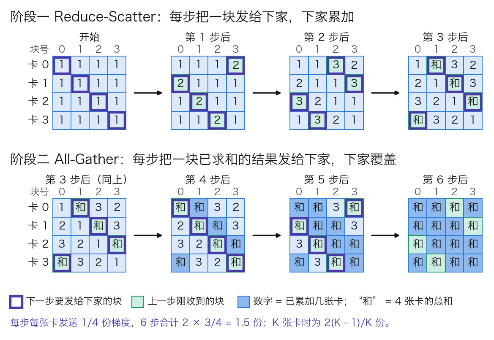

## 7.1 数据并行：为什么简单复制就能加速

**数据并行**（Data Parallelism，DP）在每张 GPU 上放一份完整的模型副本，各卡处理不同的数据，再把梯度同步成一份。本节回答三个问题：多卡平均出的梯度凭什么等于大批次的梯度，同步一次要传多少字节、花多少时间，以及这种做法在哪里到头。

本章各节共用一套算例，见表 7-1。模型配置沿用 [3.8 节](../03_components/3.8_gpt_inference_flow.md)的表 3-24，参数量由配置逐项算出；链路带宽取标称值，实际可用带宽更低，所得时间都是下界。

| 对象 | 取值 | 说明 |
| --- | --- | --- |
| Llama 3 8B | 参数量 Ψ = 80.3 亿，32 层，`d_model = 4096` | BF16 权重 16.06 GB |
| Llama 3 70B | 参数量 Ψ = 705.5 亿，80 层，`d_model = 8192` | BF16 权重 141.1 GB |
| 集群 | 64 个节点，每节点 8 张 80 GB 的 H100，共 512 卡 | 与 Llama 3 训练集群的节点形态相同 |
| 节点内链路 | 第四代 NVLink，每卡双向 900 GB/s，单向 450 GB/s | [NVIDIA H100 产品页](https://www.nvidia.com/en-us/data-center/h100/) |
| 节点间链路 | 每卡一个 400 Gb/s 端口，单向 50 GB/s | [Llama 3 论文](https://arxiv.org/abs/2407.21783)所述集群同为 400 Gb/s |
| 单卡实测算力 | 约 400 TFLOPs/s | Llama 3 论文表 4 报告 380 到 430 TFLOPs/s |

表 7-1：本章贯穿算例的模型与集群。Llama 3 的词表按发布权重的 128,256 行计，输入嵌入与输出投影各一份。每层 = Q/K/V/O 四个投影 + SwiGLU 三个矩阵 + 2 个 RMSNorm，末尾另有 1 个 RMSNorm；8B 每层 2.18 亿，70B 每层 8.56 亿。

### 7.1.1 基本流程

一步训练分五个动作：

1. 把全局批次切成 $$K$$ 份，$$K$$ 为数据并行的卡数。
2. 每张卡持有完整的参数、梯度和优化器状态。
3. 各卡用自己那份数据独立完成前向与反向，得到本地梯度。
4. 所有卡把梯度求平均，每张卡都拿到同一份平均梯度。
5. 各卡用这份梯度更新参数。初始参数相同、梯度相同，更新后的参数仍然逐位相同。

卡数增加有两种用法。每卡批量不变，全局批量随 $$K$$ 增大，称为弱扩展（weak scaling）。全局批量不变，每卡批量随 $$K$$ 减小，称为强扩展（strong scaling），单步变快而优化轨迹不变。两种用法的边界不同，见 7.1.6。

### 7.1.2 梯度平均为什么严格等价，何时不等价

**等价来自求导的线性。** 设全局批次 $$B$$ 被切成大小相等的 $$K$$ 份 $$B_1,\dots,B_K$$，损失取样本平均。求导与求和可以交换，所以

$$
\nabla_\theta \frac{1}{|B|}\sum_{x\in B}\ell(x)
= \frac{1}{K}\sum_{k=1}^{K}\nabla_\theta \frac{1}{|B_k|}\sum_{x\in B_k}\ell(x)
$$

等号两边是同一个数，不是期望意义上的近似。取 2 张卡、每卡 2 个样本，某个参数上的逐样本梯度为卡 0 的 `1, 3` 和卡 1 的 `5, −1`。各卡的均值是 `(1 + 3) ÷ 2 = 2` 和 `(5 − 1) ÷ 2 = 2`，卡间再平均得 2；4 个样本直接平均是 `(1 + 3 + 5 − 1) ÷ 4 = 2`。两种算法结果相同。

**前提是各卡的分母相等。** 语言模型的损失按有效词元取平均，变长序列和 padding 掩码会让各卡的有效词元数不同。设卡 0 有 100 个有效词元、损失和为 250，卡 1 有 300 个、损失和为 600：

- 先按卡平均再跨卡平均：`(250 ÷ 100 + 600 ÷ 300) ÷ 2 = (2.5 + 2.0) ÷ 2 = 2.25`。
- 按全局词元数平均：`(250 + 600) ÷ (100 + 300) = 2.125`。

两者相差 5.9%。前一种口径下，卡 0 每个词元的权重是 `1 ÷ (2 × 100)`，卡 1 是 `1 ÷ (2 × 300)`，短序列里的词元被放大了 3 倍。正确做法是各卡传损失和与词元数，用全局词元数做分母；梯度累积跨微批量时同理。

除了分母，工程上的逐位一致还取决于另外几项：dropout 的随机数在各卡须独立，梯度裁剪要在同步之后按全局范数做，BatchNorm 一类依赖批统计量的层要另行同步。Transformer 用的 LayerNorm 和 RMSNorm 逐样本计算，不受影响。

### 7.1.3 Ring AllReduce：一步步怎么传

第 4 步的“求平均”由集合通信 **AllReduce** 完成：每张卡交出一份数据，每张卡都拿回全体之和。设每卡的梯度共 $$M$$ 字节。

**朴素做法的瓶颈在中心。** 参数服务器（parameter server）让 $$K$$ 张卡都把梯度发给一个中心节点，中心求和后再发回。每个工作节点收发各 $$M$$，中心节点却要收 $$KM$$、发 $$KM$$。Llama 3 8B 的 BF16 梯度是 `2 × 80.3 亿 = 16.06 GB`，64 张卡时中心要搬 `2 × 64 × 16.06 ≈ 2,056 GB`，它的网口就是全局的上限。

**环形算法把负载摊平。** Ring AllReduce 把 $$K$$ 张卡排成环，每张卡只发给下家、只收上家，梯度切成 $$K$$ 块。图 7-1 以 4 张卡演示两个阶段。

图 7-1：4 张卡上的 Ring AllReduce（[生成脚本](https://github.com/yeasy/llm_internals/blob/main/tools/figures/ch07_ring_allreduce.py)）。每个方阵是一个时刻的全局状态，行是卡，列是梯度的块；数字表示这一块已累加几张卡的贡献。

- **阶段一，Reduce-Scatter。** 第 1 步，卡 $$i$$ 把自己的第 $$i$$ 块发给下家，下家加到自己的同一块上。此后每一步，各卡把上一步刚累加好的那一块继续往下传。$$K-1$$ 步后，每张卡上恰有一块累加了全部 $$K$$ 张卡，图中卡 $$i$$ 持有的是第 $$i+1$$ 块的总和。
- **阶段二，All-Gather。** 各卡把手里那块已求和的结果发给下家，下家直接覆盖。再过 $$K-1$$ 步，每张卡都有了全部 $$K$$ 块的总和。

每一步每张卡只发 $$M/K$$ 字节，两个阶段共 $$2(K-1)$$ 步，所以

$$
\text{每卡发送量} = 2\cdot\frac{K-1}{K}\cdot M
$$

`K = 4` 时是 `2 × 3/4 = 1.5` 份梯度；$$K$$ 增大时趋近 $$2M$$，与卡数无关。任何一条链路上的流量都相同，没有中心瓶颈。

这条恒等式后面各节反复用到：

$$
\text{AllReduce} = \text{Reduce-Scatter} + \text{All-Gather}
$$

Reduce-Scatter 结束时，每张卡只持有 $$1/K$$ 份求和完毕的梯度。[7.2 节](7.2_zero.md)的 ZeRO 就停在这一步：每卡只更新自己那 $$1/K$$ 的参数，后半程的 All-Gather 改为传更新后的参数，字节数不变而显存省下大半。[7.3 节](7.3_model_tensor_parallel.md)的序列并行把一次 AllReduce 拆成同样的两步，换来的主要是激活显存。

字节数相同不等于耗时相同。[Megatron 的论文实测指出](https://arxiv.org/abs/2205.05198)，搬运的数据量一样时，Reduce-Scatter 与 All-Gather 分两次执行仍慢于一次 AllReduce。原因是每次集合通信各有一份启动开销和同步点，这正是下一小节延迟项的内容。

### 7.1.4 通信要花多少时间：α–β 模型

只比字节数无法判断通信是不是瓶颈，要换算成时间。常用的 **α–β 模型**把一次点对点发送的耗时写成两项：固定开销 $$\alpha$$（内核启动、各卡对齐、链路延迟），加上字节数除以带宽 $$B$$。环形 AllReduce 有 $$2(K-1)$$ 步，每步发 $$M/K$$ 字节：

$$
T_{\text{ring}} = \underbrace{2(K-1)\,\alpha}_{\text{延迟项}} + \underbrace{2\cdot\frac{K-1}{K}\cdot\frac{M}{B}}_{\text{带宽项}}
$$

**代入 Llama 3 8B。** 梯度 `M = 16.06 GB`，64 张卡跨节点同步，瓶颈链路是单向 50 GB/s 的网口。每卡发送 `2 × 63/64 × 16.06 = 31.62 GB`，带宽项为 `31.62 ÷ 50 ≈ 0.63 s`。Llama 3 论文称其网络延迟可达几十微秒，这里取 `α = 20 μs` 作示意，延迟项是 `2 × 63 × 20 μs ≈ 2.5 ms`，可以忽略。

这 0.63 s 要与计算时间比。每卡每步处理 4 条 8,192 词元的序列，共 32,768 个词元，按 [3.7 节](../03_components/3.7_full_architecture.md)的 $$6ND$$ 估算，计算量为 `6 × 80.3 亿 × 32,768 ≈ 1.58 × 10¹⁵` 次。单卡按 400 TFLOPs/s 计，需 3.95 s。通信若排在计算之后串行执行，每步多出 `0.63 ÷ 3.95 ≈ 16%`。

表 7-2 把两项在不同卡数和消息大小下并列。

| 场景 | 延迟项 $$2(K-1)\alpha$$ | 带宽项 | 谁占主导 |
| --- | ---: | ---: | --- |
| `K = 64`，整份梯度 16.06 GB | 2.5 ms | 632 ms | 带宽 |
| `K = 64`，一个 25 MiB 的桶 | 2.5 ms | 1.0 ms | 延迟 |
| `K = 1,024`，整份梯度 | 40.9 ms | 642 ms | 带宽 |
| `K = 1,024`，一个 25 MiB 的桶 | 40.9 ms | 1.0 ms | 延迟 |

表 7-2：环形 AllReduce 的两项耗时，`α = 20 μs`（示意值），`B = 50 GB/s`。带宽项几乎不随 $$K$$ 变，延迟项随 $$K$$ 线性增长。

由此读出两点。第一，带宽项与卡数无关，这是数据并行能扩到上千张卡的原因。第二，延迟项随 $$K$$ 线性增长，消息越小越吃亏：1,024 张卡时，一个 25 MiB 的桶有 97% 的时间花在延迟上。通信库因此不只用环形算法。NCCL 的 [`NCCL_ALGO` 环境变量](https://docs.nvidia.com/deeplearning/nccl/user-guide/docs/env.html)列出 Ring、Tree 等多种算法，默认按拓扑自动选择；树形算法的步数随 $$\log K$$ 增长，适合大规模下的小消息。推理侧的同一笔账见 [11.8 节](../11_serving/11.8_multi_gpu_inference.md)。

### 7.1.5 DDP 的实现：装桶、重叠与 no_sync

PyTorch 的 **DistributedDataParallel**（DDP）是最常用的数据并行实现。它的三个机制都可以用上一小节的公式解释，细节见 [PyTorch Distributed 论文](https://arxiv.org/abs/2006.15704)。

**梯度装桶（bucketing）。** 逐个参数做 AllReduce 会产生成百上千条小消息，每条都付一次延迟项。DDP 把参数按 `model.parameters()` 的逆序装进若干个桶，逆序近似于反向传播中梯度就绪的顺序。桶的大小由 `bucket_cap_mb` 控制，[文档](https://docs.pytorch.org/docs/stable/generated/torch.nn.parallel.DistributedDataParallel.html)给出的默认值是 25 MiB；16.06 GB 的梯度约合 613 个桶。桶太小，延迟项占主导；桶太大，要等很多层的梯度算完才能发，重叠的机会变少。

**计算与通信重叠。** DDP 给每个参数的梯度累加器注册一个 autograd hook。某个桶里的梯度全部就绪，就立刻对这个桶发起异步 AllReduce，此时反向传播还在计算更靠近输入的层。反向约占一步计算的三分之二，即 `3.95 × 2/3 ≈ 2.6 s`，上面串行执行的 0.63 s 大部分可以藏在这段时间里。Megatron 的论文也提到，高效的重叠几乎可以完全消除数据并行带来的迭代时间增长。

**梯度累积要关同步。** 一步由多个微批量累积而成时，只有最后一个微批量需要同步。`no_sync()` 上下文管理器让其内部的反向只在本地累加梯度，退出后的第一次反向再统一同步。不加它，每个微批量都做一次完整的 AllReduce，通信量翻成累积步数倍。

另有两个参数与正确性和显存有关。`find_unused_parameters=True` 让 DDP 每步遍历 autograd 图，找出本步不产生梯度的参数并提前标记就绪，否则含条件分支的模型会卡在等待上；代价是每步多一次图遍历。`gradient_as_bucket_view=True` 让梯度张量直接成为桶的视图，省掉一份与梯度等大的拷贝。

### 7.1.6 局限：同步语义、临界批量、慢节点与显存

**为什么同步而不是异步。** 异步 SGD 让各卡算完就更新，不等别人。它没有同步点，代价是梯度基于过时的参数算出，卡数越多越陈旧，收敛性要重新论证。同步数据并行在数学上就是大批次训练，超参数和收敛结论可以直接沿用，大模型训练因此几乎都采用同步方式。

**弱扩展受临界批量限制。** 全局批量越过临界批量后，再加卡换不来收敛速度，见 [6.4 节](../06_training_techniques/6.4_batch_sequence.md)。

**强扩展受通信占比限制。** 全局批量固定时，每卡的计算量随 $$K$$ 减小，通信的带宽项却不变。上例若把每卡批量从 4 条减到 1 条，计算降到约 1 s，通信仍是 0.63 s，重叠也藏不住了。

**慢节点拖慢全体。** AllReduce 是同步点，一步的耗时由最慢的那张卡决定。一张卡降频、一条链路丢包，所有卡一起等。

**显存是最硬的上限。** 每张卡都要装下完整的模型状态。混合精度 Adam 训练下每个参数占 16 字节：BF16 参数 2、BF16 梯度 2、FP32 主权重 4、Adam 一阶矩与二阶矩各 4，见 [7.6 节](7.6_mixed_precision.md)。Llama 3 8B 是 `16 × 80.3 亿 ≈ 128.5 GB`，已超过 80 GB；Llama 3 70B 是 `16 × 705.5 亿 ≈ 1,129 GB`。这还没有算激活。纯数据并行连 8B 的模型都放不下，而这 128.5 GB 在每张卡上是一模一样的。
