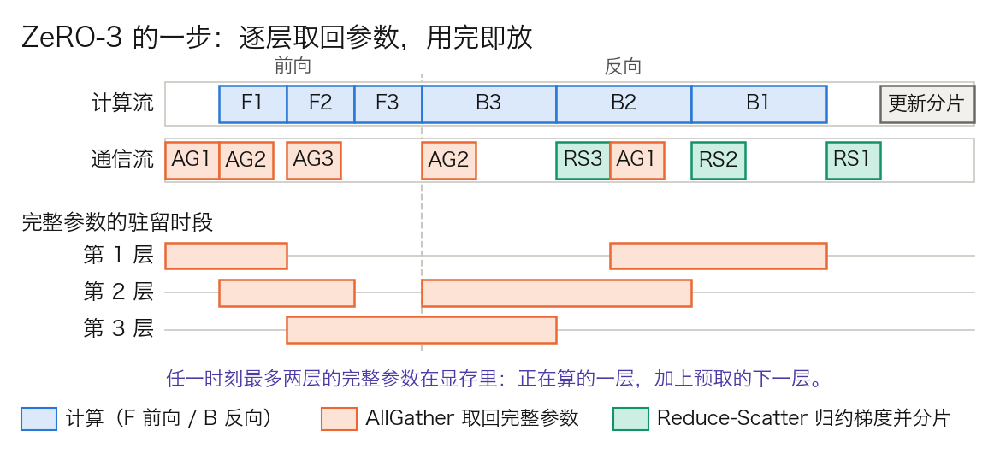

## 7.2 ZeRO 优化：如何突破单卡显存限制

**ZeRO**（Zero Redundancy Optimizer）由 Microsoft DeepSpeed 团队在 [ZeRO 论文](https://arxiv.org/abs/1910.02054)中提出，用来消除数据并行里的显存冗余。7.1 末尾算出的 128.5 GB 放不进一张卡，问题不在它大，而在每张数据并行卡上都有一模一样的一份。7.1.3 的恒等式 AllReduce = Reduce-Scatter + All-Gather 已经给出了拆掉冗余的入口。本节依次回答：冗余有多少，三个阶段各省了什么、多了什么通信，一步训练里参数何时取回、何时释放，以及什么情况下不该全分片。

### 7.2.1 冗余分析

标准数据并行中，每张卡都存着完整的**模型状态**：参数、梯度和优化器状态。冗余不在于“每张卡只需要自己数据的梯度”，每个 rank 逻辑上仍要参与完整模型的梯度同步；浪费的是这些状态在每个副本上都完整复制了一份。ZeRO 把它们按数据并行的 rank 分片保存，同时保持与数据并行等价的更新语义。

以 ZeRO 论文使用的 15 亿参数模型（GPT-2 规模）为例，混合精度训练加 Adam 优化器：

| 组成部分 | 大小 | 说明 |
| --- | --- | --- |
| FP16 参数 | 3 GB | $$1.5 \times 10^{9} \times 2$$ 字节 |
| FP16 梯度 | 3 GB | 与参数同大小 |
| FP32 优化器状态 | 18 GB | 主权重、一阶矩、二阶矩各 4 字节，共 12 字节/参数 |
| 总计 | 24 GB | 每张卡一份，16 字节/参数 |

表 7-3：15 亿参数模型在每张卡上的模型状态。

64 张卡做数据并行时，这 24 GB 在每张卡上各有一份。总计 1,536 GB 的显存中只有 24 GB 是唯一状态，其余 1,512 GB（63/64）都是冗余拷贝。

表 7-4 固定参数 3 GB、梯度 3 GB、优化器状态 18 GB，按 $$K=64$$ 逐项分片。它只核算持久的模型状态，不含激活、临时的 AllGather 缓冲、通信工作区和碎片。

<!-- numeric-claim: zero-partitions -->
| 方案 | 参数 GB | 梯度 GB | 优化器 GB | 数据并行 K | 单卡模型状态 GB | 相对 DDP |
| --- | ---: | ---: | ---: | ---: | ---: | ---: |
| DDP | 3 | 3 | 18 | 64 | 24.000000 | 1.00 |
| ZeRO-1 | 3 | 3 | 18 | 64 | 6.281250 | 3.82 |
| ZeRO-2 | 3 | 3 | 18 | 64 | 3.328125 | 7.21 |
| ZeRO-3 | 3 | 3 | 18 | 64 | 0.375000 | 64.00 |

表 7-4：64 路数据并行下的模型状态分片重算。ZeRO-1 为 $$P+G+O/K$$，ZeRO-2 为 $$P+(G+O)/K$$，ZeRO-3 为 $$(P+G+O)/K$$；“相对 DDP”是 $$24\,/\,\text{单卡模型状态}$$，不是端到端吞吐倍数。

### 7.2.2 三个阶段：各省了什么，多了什么通信

设参数量为 Ψ，每参数 16 字节拆成参数 2、梯度 2、优化器状态 12。三个阶段依次把最大的一项先分掉。

**ZeRO-1，优化器状态分片。** 每张卡只保留 $$1/K$$ 的优化器状态，负责更新对应的那 $$1/K$$ 参数。一步的流程是：反向结束后照常归约梯度；各卡用自己负责的那段梯度更新自己的主权重分片；再用一次 All-Gather 把更新后的 16 位参数收齐。每卡模型状态为 $$4\Psi + 12\Psi/K$$。

**ZeRO-2，再分梯度。** 梯度的归约从 AllReduce 改为 Reduce-Scatter：每张卡只留下自己负责的那段已求和的梯度，其余算完即丢。每卡模型状态为 $$2\Psi + 14\Psi/K$$。

**ZeRO-3，再分参数。** 每张卡只存 $$1/K$$ 的参数。前向和反向算到某一层时，用 All-Gather 临时取回这一层的完整参数，用完释放。每卡模型状态为 $$16\Psi/K$$，随卡数线性下降。

ZeRO 论文给出的“4 倍、8 倍”是 $$K$$ 很大时的极限：`16 ÷ 4 = 4`，`16 ÷ 2 = 8`。`K = 64` 时的实际值是 `16 ÷ (4 + 12/64) = 3.82` 和 `16 ÷ (2 + 14/64) = 7.21`，与表 7-4 的最后一列一致。

**通信量怎么来的。** 沿用 7.1.3 的结论，一次 Reduce-Scatter 或 All-Gather 每卡约发送一份数据，AllReduce 是两份。以参数个数为单位：

| 方案 | 一步里的集合通信 | 每卡通信量 | 相对 DDP |
| --- | --- | ---: | ---: |
| DDP | 梯度 AllReduce = Reduce-Scatter + All-Gather | 2Ψ | 1× |
| ZeRO-1 | 梯度归约，再 All-Gather 更新后的参数 | 2Ψ | 1× |
| ZeRO-2 | 梯度 Reduce-Scatter，再 All-Gather 更新后的参数 | 2Ψ | 1× |
| ZeRO-3 | 前向 All-Gather 参数，反向再 All-Gather 一次，梯度 Reduce-Scatter | 3Ψ | 1.5× |

表 7-5：各方案每步的通信量，取自 ZeRO 论文第 7 节的分析；系数 $$(K-1)/K$$ 从略。ZeRO-1 的梯度归约在实现上可用 AllReduce，也可用 Reduce-Scatter（DeepSpeed 的 `reduce_scatter` 选项默认开启），表中按后者计。

ZeRO-1 和 ZeRO-2 的通信量与 DDP 相同，原因就是那条恒等式：DDP 的 All-Gather 传的是求和后的梯度，ZeRO 把它换成传更新后的参数，字节数一样。计算与通信的重叠影响的是耗时，不改变字节数。ZeRO-3 多出的 Ψ 来自反向前的第二次 All-Gather。

### 7.2.3 ZeRO-3 的一步：逐层取回，用完即放

ZeRO-3 不会一次取回整个模型，否则峰值显存与不分片无异。参数按**分片单元**成组收发，通常一个 Transformer 层是一个单元。图 7-2 画出 3 层模型在一张卡上的一步。

图 7-2：ZeRO-3 的一步（[生成脚本](https://github.com/yeasy/llm_internals/blob/main/tools/figures/ch07_zero3_timeline.py)）。AG 是取回某层完整参数的 All-Gather，RS 是归约某层梯度的 Reduce-Scatter；时长为示意值。第 3 层前向后紧接反向，图中不重新分片、反向前不再取回；表 7-5 的 3Ψ 按每层都重新分片计。FSDP2 对根单元的默认值正是 `reshard_after_forward=False`，理由相同，见 7.2.7。

- **前向。** 算第 ℓ 层之前，All-Gather 取回该层参数；计算第 ℓ 层的同时，通信流预取第 ℓ+1 层；第 ℓ 层算完，释放它的完整参数，只留本卡分片。
- **反向。** 顺序反过来。算第 ℓ 层的反向之前再取回一次参数；算完得到该层的完整梯度，用 Reduce-Scatter 求和并只留本卡那一段，随后释放参数和完整梯度。
- **更新。** 每张卡用自己那段梯度，更新自己那段主权重和优化器状态。这一步没有通信。

预取让通信与计算重叠。重叠成立的条件是取回一层参数的时间不长于计算一层的时间，7.2.5 用数字检验这一点。

**峰值显存不只是分片。** 任一时刻，显存里除了 $$16\Psi/K$$ 的持久分片，还有正在计算的那个单元的完整参数，加上预取的下一个单元。分片单元越大，这一项越高：把整个模型当成一个单元，ZeRO-3 就退化成每步先拼出完整参数，峰值里多出一整份 2Ψ。

### 7.2.4 算例：Llama 3 70B 在 64、128、512 卡下

Llama 3 70B 的模型状态是 `16 × 705.5 亿 ≈ 1,128.9 GB`，其中参数 141.1 GB、梯度 141.1 GB、优化器状态 846.6 GB。

| 数据并行 K | ZeRO-1 | ZeRO-2 | ZeRO-3 |
| ---: | ---: | ---: | ---: |
| 64 | 295.4 GB | 156.5 GB | 17.64 GB |
| 128 | 288.8 GB | 148.8 GB | 8.82 GB |
| 512 | 283.9 GB | 143.0 GB | 2.20 GB |

表 7-6：Llama 3 70B 每卡的持久模型状态，公式同表 7-4。

ZeRO-1 和 ZeRO-2 的每卡占用不会低于完整的 16 位参数 141.1 GB，卡再多也放不进 80 GB。70B 的模型要么用 ZeRO-3，要么先用 7.3、7.4 节的模型并行把参数切开，再在数据并行维度上叠 ZeRO-1。

ZeRO-3 的峰值还要加未分片的单元。Llama 3 70B 每层 8.56 亿参数，BF16 下一层是 1.71 GB。`K = 64`、每层一个单元时，峰值约为 `17.64 + 2 × 1.71 ≈ 21.1 GB`，余下的显存留给激活。若整个模型只包成一个单元，峰值约为 `17.64 + 141.1 ≈ 158.7 GB`，分片失去意义。

### 7.2.5 什么时候不该全分片

**All-Gather 在关键路径上。** DDP 的梯度同步可以整个藏在反向后面；ZeRO-3 的参数没取回来，这一层就不能开始算。64 张卡跨节点时，取回一层要收 `63/64 × 1.71 ≈ 1.68 GB`，按 50 GB/s 需 34 ms。一层的前向按“2 × 参数量 × 词元数”估算，每卡 1 条 8,192 词元的序列时是 `2 × 8.56 亿 × 8,192 ≈ 1.4 × 10¹³` 次，约 35 ms。两者相当，预取刚好能盖住；每卡批量再小，或链路再慢，计算就要停下来等参数。同样的 All-Gather 走 NVLink 只要 3.7 ms。

这给出三条边界：

- 分片组跨过慢速链路、每卡批量又小时，ZeRO-3 的吞吐会明显下降。对策是只在节点内分片、节点间复制，即下文的 HSDP。
- ZeRO 不减少激活显存。激活随批量和序列长度增长，要靠 [7.5 节](7.5_activation_checkpointing.md)的重计算与 7.3 节的序列并行。
- 梯度累积时，ZeRO-2 和 ZeRO-3 每个微批量都要做一次 Reduce-Scatter，因为完整梯度不落地；ZeRO-1 和 DDP 可以累积到最后一个微批量再同步。

### 7.2.6 卸载到 CPU 与 NVMe

显存仍不够时，还可以把模型状态搬出 GPU。[ZeRO-Offload](https://arxiv.org/abs/2101.06840) 把梯度、FP32 主权重和优化器状态放到主机内存，Adam 更新由 CPU 执行，GPU 上只留 16 位参数和前向、反向计算。论文按数据流图论证了这种切法的通信量最小：GPU 与 CPU 之间每步只传 16 位梯度和 16 位参数。它报告可在单张 V100 上训练 130 亿参数的模型。[ZeRO-Infinity](https://arxiv.org/abs/2104.07857) 进一步把参数和优化器状态卸到 NVMe。

代价是每步都经过 PCIe 和 CPU，吞吐低于纯 GPU 方案；它解决的是“卡少也要能跑”，不是“卡多要跑得快”。DeepSpeed 中对应的配置项是 `offload_optimizer` 和 `offload_param`，后者只在 stage 3 下有效。激活的卸载是另一回事，见 7.5.5。

### 7.2.7 实现：DeepSpeed 配置与 FSDP

DeepSpeed 用 `zero_optimization.stage` 选阶段，0 到 3 分别是关闭、分优化器状态、再分梯度、再分参数。几个常调的参数都对应上文的机制，名称与默认值见其[配置文档](https://www.deepspeed.ai/docs/config-json/)：

- `overlap_comm`：梯度归约是否与反向计算重叠。
- `reduce_bucket_size`：一次归约的元素数，作用与 DDP 的桶相同。
- `stage3_prefetch_bucket_size`：参数预取缓冲的大小，调小省显存，但计算更容易等通信。
- `stage3_max_live_parameters`：每卡同时驻留的完整参数上限，就是 7.2.3 峰值公式里的第二项。

PyTorch 原生的 **FSDP**（Fully Sharded Data Parallel）实现了同一套全分片思路，设计与取舍见 [PyTorch FSDP 论文](https://arxiv.org/abs/2304.11277)；7.7 节讲分片检查点时还会用到它。

#### FSDP2：从“拍平成一维”到“逐参数分片”

FSDP 自身演进过一轮，动机不在显存，而在可组合性。第一代 FSDP 把一组参数拍平（flatten）成一个一维缓冲区再切分。这对通信高效，但原来的参数在实现里已经不存在，任何按参数区别对待的需求都变得别扭：给某几个参数单独设混合精度、只量化一部分权重、冻结其中一些，或者导出按参数组织的状态字典。

第二代实现 `fully_shard`（FSDP2）改用 **DTensor 逐参数分片**，[官方文档](https://docs.pytorch.org/docs/stable/distributed.fsdp.fully_shard.html)称其面向高性能的 eager 模式，并用逐参数分片改善易用性。每个参数沿第 0 维切给各卡。初始化时 `model.parameters()` 原地从 `torch.Tensor` 转成 `DTensor`；前向和反向之前由 pre-hook 负责 All-Gather 并转回普通张量，之后由 post-hook 释放未分片的参数。参数始终保留自己的身份，切分信息记在 DTensor 的 placement 里。

三个接口细节值得对照上文：

- **分片单元由调用方式决定。** 每调用一次 `fully_shard(module)` 就形成一个通信组，组内参数用一次 All-Gather 取回。文档要求自底向上逐层调用，不要只包最外层，理由就是 7.2.3 的峰值公式。
- **`reshard_after_forward`。** 取 `True` 是标准的 ZeRO-3；取 `False` 则前向之后不释放，省掉反向的 All-Gather，显存多占一份参数，通信量回到 2Ψ。文档对根单元默认取 `False`，因为反向一开始就要用到它。Llama 3 405B 取的就是这一档：[论文](https://arxiv.org/abs/2407.21783)说明其 FSDP 分片了优化器状态和梯度，但前向之后不重新分片参数，省掉反向的那次 All-Gather。取整数则前向之后重分片到更小的组，例如节点内的 8 张卡。
- **`MixedPrecisionPolicy`。** `param_dtype` 决定 All-Gather 与计算用的精度，`reduce_dtype` 决定梯度归约的精度。FSDP 的分片参数本身保持高精度，兼作主权重，不必另存一份。

同一套 device mesh 抽象还表达出了 **HSDP**（Hybrid Sharded Data Parallel）。mesh 是 1D 时，参数在这一维上全分片，placement 为 `(Shard(0),)`；mesh 是 2D 时，参数在第 1 维分片、在第 0 维复制，placement 为 `(Replicate(), Shard(0))`。这就是“节点内分片、节点间复制”：All-Gather 只走 NVLink，节点间只剩每步一次、可与反向重叠的梯度归约。代价是每卡的持久分片从 $$16\Psi/K$$ 升到 $$16\Psi/8$$，70B 的模型是 141 GB，仍放不下；HSDP 适合单节点装得下分片、只是跨节点全分片太慢的模型。

从 ZeRO 论文到 FSDP2，分片的数学没有变，变的是分片怎样表达。这个表达方式决定了它能否与量化、混合精度和张量并行叠在一起，而张量并行要切的是 ZeRO 没有碰的东西：一层之内的计算和激活。
