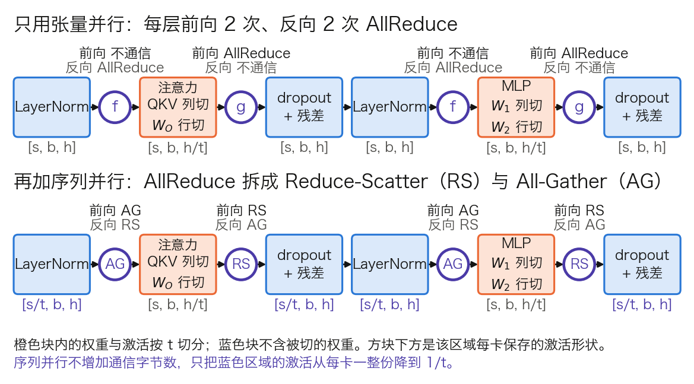

## 7.3 模型并行与张量并行：把一层切到多张卡上

**模型并行**（Model Parallelism）把模型本身切到多张卡上，每张卡只算其中一部分。7.2 的 ZeRO 分掉了模型状态，却留下两件事没有动：每张卡仍要独自算完每一层，也仍要独自存下每一层的激活；数据并行度又受临界批量限制，不能无限加大。本节讲按层内切分的**张量并行**（Tensor Parallelism，TP），回答怎样切才能让结果与单卡逐位相同，一层最少要通信几次，每次多少字节，以及为什么它通常走不出一个节点。按层间切分的流水线并行留给 [7.4 节](7.4_pipeline_hybrid.md)。

本节沿用 Megatron 论文的记号：微批量大小 $$b$$，序列长度 $$s$$，隐藏维度 $$h$$，张量并行度 $$t$$。三者依次对应 3.8 节表 3-18 的 `B`、`T`、`d_model`，形状括号里也一律写作 $$s$$、$$b$$、$$h$$。

### 7.3.1 为什么要切层内的权重

层内切分的思路更早见于 [Mesh-TensorFlow](https://arxiv.org/abs/1811.02084)，它允许沿任意张量维度切分。[Megatron-LM](https://arxiv.org/abs/1909.08053) 的贡献是给出 Transformer 上的一种具体切法：每个子层的前向只需一次 AllReduce，且几行代码就能实现。

与 ZeRO-3 对比可以看清张量并行切的是什么。ZeRO-3 切的是存储：参数平时分片存放，计算前拼回完整的矩阵，每张卡做的仍是完整的 `X × W`。张量并行切的是计算：每张卡只持有 `W` 的一片，只做 `X × W` 的一部分，中间激活也只有一部分。所以它同时减少每卡的参数、计算量和大部分激活，也不会增大全局批量。代价是通信进入了每一层的关键路径，7.3.5 给出这笔账。

### 7.3.2 列切与行切：一个两卡手算例

**要解决的问题。** 线性层 `Y = XW` 怎样分给 $$t$$ 张卡，使各卡只存 `W` 的 $$1/t$$，合起来的结果与单卡相同。有两种切法：

- **列切**（column parallel）：`W` 按列分成 $$t$$ 块，每张卡都拿完整的 `X`，算出结果的一段列。形状为 `X[s, h] × W⁽ⁱ⁾[h, h′/t] → Y⁽ⁱ⁾[s, h′/t]`，各卡结果左右拼接即为 `Y`。
- **行切**（row parallel）：`W` 按行分成 $$t$$ 块，输入也相应按列分成 $$t$$ 段。形状为 `X⁽ⁱ⁾[s, h′/t] × W⁽ⁱ⁾[h′/t, h] → Y⁽ⁱ⁾[s, h]`，各卡结果逐格相加即为 `Y`。

单独用任何一种，每个线性层后都要通信一次。MLP 由两个线性层夹一个逐格激活组成，把第一个列切、第二个行切，列切的输出恰好是行切需要的输入，中间不必通信。

**代入数字。** 取 `X[1, 2]`、`W_1[2, 4]`、逐格 ReLU、`W_2[4, 2]`，两张卡：

$$
X = [2,\ 1],\quad
W_1 = \begin{bmatrix} 1 & 0 & -1 & 2 \\ 0 & 1 & 1 & -1 \end{bmatrix},\quad
W_2 = \begin{bmatrix} 1 & 0 \\ 2 & 1 \\ 0 & 1 \\ 1 & -1 \end{bmatrix}
$$

单卡：`X × W_1 = [2, 1, −1, 3]`，ReLU 后为 `[2, 1, 0, 3]`，乘 `W_2` 得 `[2 + 2 + 0 + 3, 0 + 1 + 0 − 3] = [7, −2]`。

两卡：卡 0 持有 `W_1` 的前两列和 `W_2` 的前两行，卡 1 持有其余。

- 卡 0：`X × W_1` 的前两列得 `[2, 1]`，ReLU 不变，乘 `W_2` 的前两行得 `[2 + 2, 0 + 1] = [4, 1]`。
- 卡 1：`X × W_1` 的后两列得 `[−1, 3]`，ReLU 后为 `[0, 3]`，乘 `W_2` 的后两行得 `[0 + 3, 0 − 3] = [3, −3]`。
- AllReduce 求和：`[4 + 3, 1 − 3] = [7, −2]`，与单卡逐数相同。

**为什么必须先列后行。** 反过来先行切 `W_1`，卡 0 拿 `X` 的第 1 维和 `W_1` 的第 1 行，得 `[2, 0, −2, 4]`；卡 1 得 `[0, 1, 1, −1]`。两者要先相加才是真正的中间结果。若各自先过 ReLU 再相加，得 `[2, 0, 0, 4] + [0, 1, 1, 0] = [2, 1, 1, 4]`，而正确值是 `ReLU([2, 1, −1, 3]) = [2, 1, 0, 3]`，第 3、4 格出错。逐格非线性不能拆到部分和上，激活之前就得多通信一次。推理侧直接用这条结论，其形状与 all-reduce 的位置见 [11.8.2](../11_serving/11.8_multi_gpu_inference.md)。

### 7.3.3 反向传播与 f、g 算子：每层 4 次 AllReduce

前向的通信在子层末尾，反向的通信在子层开头。原因是列切时每张卡都用了完整的 `X`，`X` 的梯度是各卡贡献之和。

接着上例，设输出的梯度为 `dY = [1, −1]`。单卡反向：`dY × W_2ᵀ = [1, 1, −1, 2]`，ReLU 的导数在中间结果为负的第 3 格取 0，得 `[1, 1, 0, 2]`，再乘 `W_1ᵀ` 得 `dX = [1 + 0 + 0 + 4, 0 + 1 + 0 − 2] = [5, −1]`。两卡反向：行切层的每张卡都收到完整的 `dY`，不必通信；卡 0 算出自己那一路的 `[1, 1]`，乘 `W_1` 前两列的转置得 `[1, 1]`；卡 1 算出 `[0, 2]`，乘后两列的转置得 `[4, −2]`。两者相加得 `[5, −1]`，这一次相加就是反向的 AllReduce。

Megatron-LM 把这两处通信封装成一对共轭算子：

- **f**：前向恒等，反向 AllReduce。放在子层入口，即列切层之前。
- **g**：前向 AllReduce，反向恒等。放在子层出口，即行切层之后。

源码中它们是 `megatron/core/tensor_parallel/mappings.py` 里的两个 `torch.autograd.Function`：`_CopyToModelParallelRegion` 的 `forward` 直接返回输入、`backward` 调用 `_reduce`；`_ReduceFromModelParallelRegion` 反之。一层有注意力和 MLP 两个子层，所以前向 2 次、反向 2 次，共 4 次 AllReduce。图 7-3 的上半幅标出了它们的位置。

### 7.3.4 注意力、SwiGLU、嵌入与 LM head 怎么切

**注意力按头切。** 各头之间本来就独立。Q、K、V 投影列切，等价于把头分给各卡；输出投影 `W_O` 行切，末尾一次 AllReduce。以 Llama 3 70B、`t = 8` 为例，每张卡分到 64 个 Query 头中的 8 个和 8 个 K/V 头中的 1 个：

- `X[s, 8192] × W_Q⁽ⁱ⁾[8192, 1024] → Q⁽ⁱ⁾[s, 1024]`
- `X[s, 8192] × W_K⁽ⁱ⁾[8192, 128] → K⁽ⁱ⁾[s, 128]`，V 同形
- 本卡 8 个头各自做注意力，拼接为 `[s, 1024]`
- `[s, 1024] × W_O⁽ⁱ⁾[1024, 8192] → [s, 8192]`，各卡相加

由此得到两条约束：头数 `n_h` 必须被 $$t$$ 整除；GQA 下 K/V 头数 `n_kv` 小于 $$t$$ 时，K/V 头要在卡间复制。Llama 3 各规模的 `n_kv` 都是 8，`t = 8` 是不复制 K/V 的上限。

**SwiGLU 的两个上投影同为列切。** gate 与 up 两个矩阵都是 `[8192, 28672]`，每卡各持 `[8192, 3584]`，逐格相乘在分片上完成；down 矩阵行切为 `[3584, 8192]`。中间维也要被 $$t$$ 整除。

**嵌入与 LM head 按词表切。** 嵌入表 `[128256, 8192]` 沿词表维分给 8 张卡，每卡 `[16032, 8192]`；查表时不属于本卡的词元得到零向量，AllReduce 后拼齐。LM head 的输出 logits 是 `[s, 128256]`，`s = 8192` 时 BF16 下为 2.10 GB，升到 FP32 算交叉熵是 4.20 GB。把它 All-Gather 到每张卡上是浪费。Megatron 的 `VocabParallelCrossEntropy` 直接在分片的 logits 上算损失，每卡只保留 1/8，只需归约每个位置的最大值、目标词元的 logit 和指数和这几个标量。

### 7.3.5 通信账：每层多少字节，节点内外各多少时间

**每次 AllReduce 的消息是一份激活。** 形状 `[s, b, h]`，BF16 下 $$2sbh$$ 字节。按 7.1.3 的结论，每卡每次发送 $$2\frac{t-1}{t}$$ 份；每层 4 次，所以每层每卡每个微批量发送

$$
8\,\frac{t-1}{t}\,sbh \ \text{个元素}
$$

这与 [Megatron 论文](https://arxiv.org/abs/2104.04473)给出的 $$8bsh\frac{t-1}{t}$$ 一致。

**代入 Llama 3 70B，`b = 1`、`s = 8192`、`t = 8`。** 一份激活是 `8192 × 8192 × 2 ≈ 134.2 MB`。一次 AllReduce 每卡发送 `2 × 7/8 × 134.2 ≈ 234.9 MB`，每层 4 次是 939.5 MB，80 层共 75.2 GB。

| 链路 | 单向带宽 | 75.2 GB 的耗时 | 相对一个微批量的计算 1.08 s |
| --- | ---: | ---: | ---: |
| 节点内 NVLink | 450 GB/s | 0.17 s | 15% |
| 节点间 400 Gb/s 网口 | 50 GB/s | 1.50 s | 139% |

表 7-7：张量并行在一个微批量上的通信耗时下界。计算时间按 `6 × 705.5 亿 × 8,192 ÷ (8 × 400 TFLOPs/s) ≈ 1.08 s` 估算；只算带宽项，未计延迟项。

带宽相差 9 倍，落到时间上，是“可以接受的 15%”与“通信比计算还长”的区别。与数据并行不同，这些 AllReduce 无处可藏：下一层的输入就是这次 AllReduce 的输出，没有独立的计算可以与之并行。数据并行每步通信一次，张量并行每个微批量、每一层都要通信。Megatron 论文的第一条经验因此是：张量并行度不超过单节点的卡数，更大的模型交给流水线并行。

### 7.3.6 序列并行：把剩下的激活也切掉

**张量并行没有切到的部分。** 表 7-8 列出一层之内哪些量被 $$t$$ 除。

| 对象 | 是否被 $$t$$ 除 | 说明 |
| --- | --- | --- |
| Q/K/V、`W_O`、MLP 各矩阵及其梯度、优化器状态 | 是 | 每层每卡约 `8.56 亿 ÷ 8 ≈ 1.07 亿`参数 |
| 子层内部的激活（Q、K、V、注意力输出、MLP 中间层） | 是 | 形状 `[s, b, h/t]` 或 `[s, b, 4h/t]` |
| LayerNorm 的输入、子层的输入、dropout 掩码、残差流 | 否 | 形状 `[s, b, h]`，每卡一整份 |
| 归一化层的参数 | 否 | 每层只有 `2 × 8192` 个，可忽略 |

表 7-8：张量并行下一层内各对象的分摊情况，以 Llama 3 70B、`t = 8` 为例。

按 [Megatron 的逐项清点](https://arxiv.org/abs/2205.05198)（7.5.1 详述），不被切的激活每层约 $$10sbh$$ 字节。上例中是 `10 × 8192 × 8192 ≈ 0.67 GB`，80 层合 53.7 GB，是 $$t$$ 无论取多大都省不掉的一项。

**做法。** LayerNorm 和 dropout 逐位置独立计算，可以沿序列维切分。**序列并行**（Sequence Parallelism，SP）让这些区域的每张卡只处理 $$s/t$$ 个位置，如图 7-3 的下半幅。

图 7-3：一层 Transformer 内张量并行的通信位置（上），以及叠加序列并行之后的变化（下）（[生成脚本](https://github.com/yeasy/llm_internals/blob/main/tools/figures/ch07_tp_sp_layer.py)）。方块下方是该区域每卡保存的激活形状。

进入注意力或 MLP 之前，各卡用 All-Gather 把 `[s/t, b, h]` 拼回 `[s, b, h]`；子层末尾原本的 AllReduce 改为 Reduce-Scatter，求和的同时沿序列维分给各卡。反向时两者互换。一次 AllReduce 本来就等于一次 Reduce-Scatter 加一次 All-Gather，通信字节数不变，不被切的 $$10sbh$$ 变成 $$10sbh/t$$，上例从 0.67 GB 降到 0.084 GB。

Megatron 论文在 22B 模型上测得一层的前向从 7.7 ms 降到 7.2 ms，来自 LayerNorm 和 dropout 只算 $$1/t$$ 的数据。同一段也指出两次集合通信比一次 AllReduce 慢，抵消了部分收益，并说明这 6% 只是附带收益，主要收益是激活显存。

这里的序列并行只切 LayerNorm 和 dropout 区域，注意力内部每张卡仍看到完整的序列。把注意力本身沿序列维切开的是上下文并行（Context Parallelism），见 7.4.3 与 [14.7 节](../14_future_trends/14.7_long_context.md)；10.3.5 与 14.7.2 把这一类做法称为序列并行或 Ring Attention，与本节的序列并行不是一回事。

### 7.3.7 边界与实现

**失效情形。**

- 头数、K/V 头数、MLP 中间维、词表大小不被 $$t$$ 整除时无法均分，需要补齐或复制。
- $$t$$ 增大，每卡的矩阵变窄。Megatron 论文指出，层不够大时，GPU 执行这些子矩阵乘法达不到峰值效率。
- 通信在关键路径上，延迟项不可忽略。小批量、短序列时消息很小，7.1.4 的延迟项占主导。
- 跨节点时带宽降到约 1/9，表 7-7 已给出后果。

“无法重叠”并不绝对。Megatron-LM 提供 `tp_comm_overlap` 选项，把通信切碎后与同一层内的矩阵乘法交错执行；源码的检查表明它只能在序列并行开启时使用。

**实现锚点。** Megatron-LM 的层定义在 `megatron/core/tensor_parallel/layers.py`：`ColumnParallelLinear`、`RowParallelLinear`、`VocabParallelEmbedding`；并行度由 `tensor_model_parallel_size` 配置，序列并行由 `sequence_parallel` 开启。PyTorch 原生的对应物是 `torch.distributed.tensor.parallel` 中的 `parallelize_module`，配合 `ColwiseParallel`、`RowwiseParallel`、`SequenceParallel` 三种切分方式，以及在分片 logits 上算交叉熵的 `loss_parallel`，见其[文档](https://docs.pytorch.org/docs/stable/distributed.tensor.parallel.html)。

实际的大规模训练同时使用张量并行和数据并行：节点内 8 路张量并行，节点间数据并行并配合 ZeRO。这一组合有一条硬边界：张量并行被带宽锁在节点内，Llama 3 70B 切成 8 份后每卡仍有 `1,128.9 ÷ 8 ≈ 141 GB` 的模型状态要靠 ZeRO 再分；模型更大时，层数这一维还没有任何机制去切。
