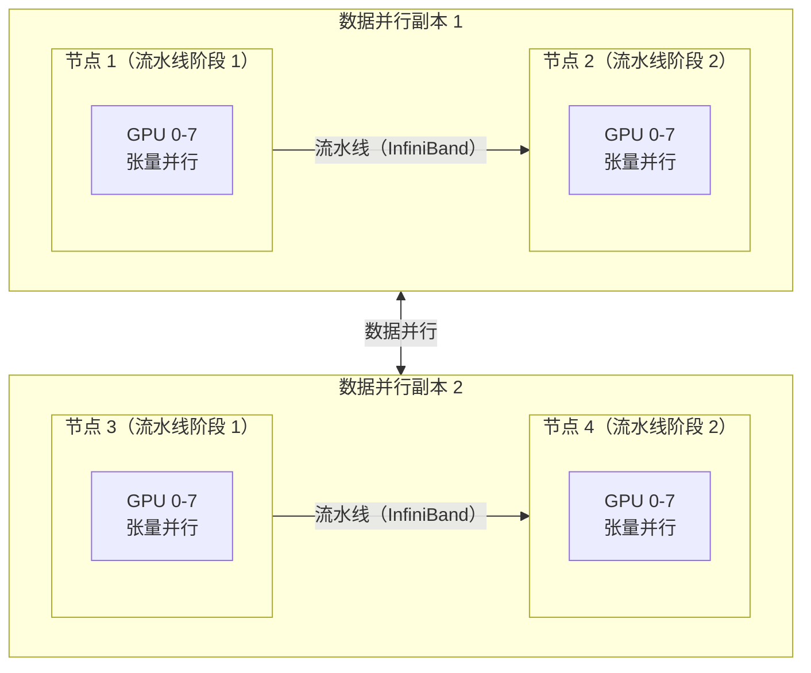

## 7.4 流水线并行与混合并行策略

### 7.4.1 流水线并行

**流水线并行**（Pipeline Parallelism，PP）将模型的不同层分配到不同的 GPU 上。例如，一个 32 层的模型可以切分为 4 个“段”，每 8 层放在一张 GPU 上。

朴素的流水线并行有严重的**气泡**（Bubble）问题：当 GPU 0 在计算前 8 层的第一个小批量时，GPU 1/2/3 都处于空闲状态，等待 GPU 0 的输出。解决方案是**微批量**（Micro-batch）调度：将一个大批量分成多个微批量，以流水线方式交错处理，减少 GPU 空闲时间。

气泡比率可以量化为：设流水线有 $$p$$ 个阶段，每个批量被切分为 $$m$$ 个微批量，则

$$\text{bubble\_ratio} \approx \frac{p - 1}{p - 1 + m}$$

当 $$m \gg p$$ 时气泡开销趋近于零，这就是为什么实践中通常选择较大的微批量数（例如 $$m \ge 4p$$）来摊薄流水线启动和排空阶段的空闲时间。

GPipe 和 PipeDream 是两种代表性的流水线调度策略。

**流水线并行与激活重计算的结合**：在流水线并行中，每个 GPU 阶段都需要保存来自前一个阶段的激活值。在 GPipe 式“先全前向、再全反向”的调度下，显存占用会随微批量数 $$m$$ 线性增长；现代框架默认的 **1F1B** 调度（PipeDream-Flush）让前向与反向交替执行，把同时“在飞”的微批量数封顶为流水线深度 $$p$$，使激活显存与 $$m$$ 解耦——这正是 1F1B 成为默认选择的主要原因。为了支持较大的微批量（以减少气泡），必须结合第 7.5 节的激活重计算技术，选择性地保存关键检查点激活值，否则显存会成为瓶颈。

### 7.4.2 三维并行

超大规模训练（如千亿到万亿参数模型）通常采用**3D 并行**——同时使用数据并行、张量并行和流水线并行：

图 7-1：3D 并行策略的典型配置

典型配置为：

- **张量并行**：同一节点内 4-8 路（NVLink 高带宽互连）
- **流水线并行**：跨节点 2-8 路（InfiniBand 互连）
- **数据并行**：剩余维度的并行，用于扩展吞吐量；可增大全局批次，也可在保持全局批次不变时缩短训练步

超长上下文训练中还常引入第四个维度——**序列/上下文并行**（如 Megatron-SP、Ring Attention），按序列维切分激活与注意力计算（详见 [10.3 节](../10_inference_optimization/10.3_flash_attention.md)与 [14.7 节](../14_future_trends/14.7_long_context.md)）。

### 7.4.3 混合并行的设计考量

选择并行策略的核心原则是**匹配硬件拓扑**：

- 节点内 GPU 通信快（NVLink ~900 GB/s）→ 适合通信密集的张量并行
- 跨节点通信较慢（InfiniBand ~100 GB/s）→ 适合通信较少的流水线并行
- 数据并行 / ZeRO 仍有 step 级梯度或状态同步，适合放在带宽足够、可重叠通信的层级；不要简单把它分配到最慢链路

框架如 Megatron-LM 和 DeepSpeed 提供了灵活的并行配置工具，用户指定各维度的并行度即可自动完成模型拆分和通信调度。
