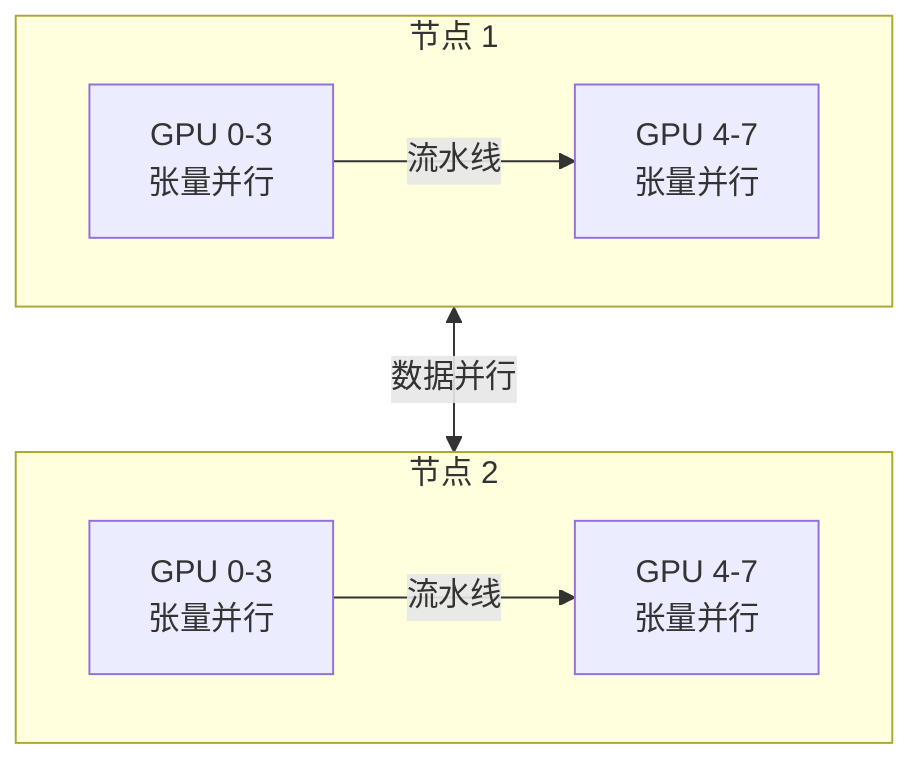

## 7.4 流水线并行与混合并行策略

### 7.4.1 流水线并行

**流水线并行**（Pipeline Parallelism，PP）将模型的不同层分配到不同的 GPU 上。例如，一个 32 层的模型可以切分为 4 个“段”，每 8 层放在一张 GPU 上。

朴素的流水线并行有严重的**气泡**（Bubble）问题：当 GPU 0 在计算前 8 层的第一个小批量时，GPU 1/2/3 都处于空闲状态，等待 GPU 0 的输出。解决方案是**微批量**（Micro-batch）调度：将一个大批量分成多个微批量，以流水线方式交错处理，减少 GPU 空闲时间。

GPipe 和 PipeDream 是两种代表性的流水线调度策略。

### 7.4.2 三维并行

超大规模训练（如千亿到万亿参数模型）通常采用**3D 并行**——同时使用数据并行、张量并行和流水线并行：

图 7-1：3D 并行策略的典型配置

典型配置为：

- **张量并行**：同一节点内 4-8 路（NVLink 高带宽互连）
- **流水线并行**：跨节点 2-8 路（InfiniBand 互连）
- **数据并行**：剩余维度的并行，扩展批量大小

### 7.4.3 混合并行的设计考量

选择并行策略的核心原则是**匹配硬件拓扑**：

- 节点内 GPU 通信快（NVLink ~900 GB/s）→ 适合通信密集的张量并行
- 跨节点通信较慢（InfiniBand ~100 GB/s）→ 适合通信较少的流水线并行
- 跨集群通信最慢 → 适合通信最少的数据并行

框架如 Megatron-LM 和 DeepSpeed 提供了灵活的并行配置工具，用户指定各维度的并行度即可自动完成模型拆分和通信调度。
