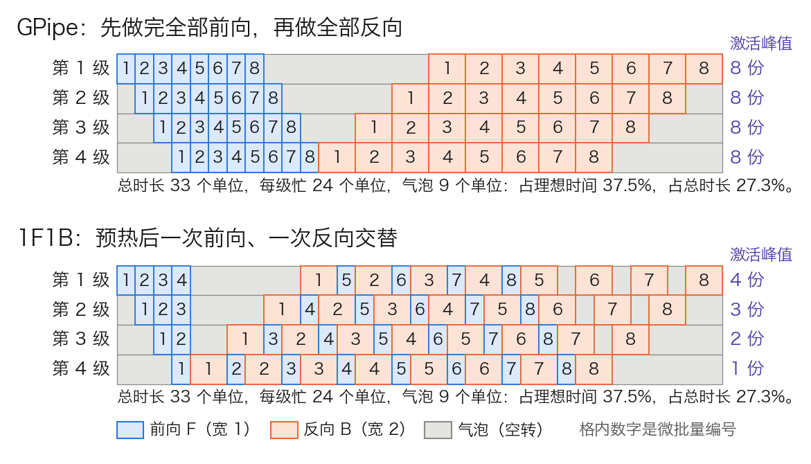
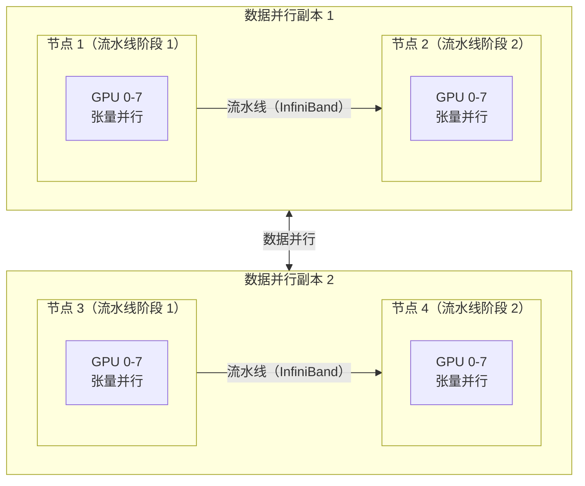

## 7.4 流水线并行与混合并行策略

**流水线并行**（Pipeline Parallelism，PP）把模型按层切成几段，每段放在不同的卡上。7.3 的张量并行把一层切开，却被带宽锁在节点内：跨节点做 AllReduce，通信比计算还长。层数这一维还没有人切。本节回答四个问题：按层切分后空转的气泡有多大，1F1B 调度省的到底是什么，几种并行怎样按通信量分配到不同的链路，以及给定模型和集群后怎样定各维的并行度。

记号沿用 Megatron 论文：流水线级数 $$p$$，一步里的微批量个数 $$m$$，张量并行度 $$t$$，数据并行度 $$d$$（即 7.1、7.2 节的 $$K$$）。

### 7.4.1 流水线的一步：气泡从哪来

切分以层为单位：80 层的模型切成 8 级，每级 10 层，各占一组卡。相邻两级之间只传一份激活，前向从第 1 级流到第 8 级，反向原路返回。

若一次只送进一个批次，任一时刻只有一级在算，其余都在等。对策是把批次切成 $$m$$ 个**微批量**（micro-batch），依次送入，让各级同时处理不同的微批量。同步训练要求一步结束时所有微批量的梯度都已算完，再统一更新参数，所以每一步的开头和结尾各有一段填充和排空，这段空转称为**气泡**（bubble）。图 7-4 画出 `p = 4`、`m = 8` 时两种调度的时间线。

图 7-4：4 级流水线、8 个微批量时 GPipe 与 1F1B 的时间线（[生成脚本](https://github.com/yeasy/llm_internals/blob/main/tools/figures/ch07_pipeline_schedules.py)）。反向按前向的 2 倍宽画；右侧是各级同时持有的微批量激活份数的峰值。

**气泡的大小。** 设一个微批量在一级上的前向、反向耗时为 $$t_f$$、$$t_b$$。第 $$i$$ 级要等前面 $$i-1$$ 级的前向传过来才能开工，做完自己的前向后，又要等后面各级的反向传回来。对任何一级，开头与结尾的等待合计都是 $$(p-1)(t_f+t_b)$$，有用的计算是 $$m(t_f+t_b)$$。气泡有两种常见口径：

$$
\frac{\text{气泡}}{\text{理想计算时间}} = \frac{p-1}{m}
\qquad
\frac{\text{气泡}}{\text{一步总时长}} = \frac{p-1}{m+p-1}
$$

前者是 [Megatron 论文](https://arxiv.org/abs/2104.04473)的口径，后者是 [GPipe 论文](https://arxiv.org/abs/1811.06965)的口径，[11.8 节](../11_serving/11.8_multi_gpu_inference.md)用的也是后者。两者分母不同，不能混着比。图 7-4 中 `p = 4`、`m = 8`：一步总长 `(8 + 3) × 3 = 33` 个单位，每级忙 24 个单位，气泡 9 个单位，占理想时间 `9 ÷ 24 = 37.5%`，占总时长 `9 ÷ 33 = 27.3%`。

| $$p$$ | $$m$$ | 占理想时间 $$(p-1)/m$$ | 占总时长 $$(p-1)/(m+p-1)$$ |
| ---: | ---: | ---: | ---: |
| 4 | 8 | 37.5% | 27.3% |
| 8 | 8 | 87.5% | 46.7% |
| 8 | 32 | 21.9% | 17.9% |
| 4 | 128 | 2.3% | 2.3% |

表 7-9：几组 $$p$$、$$m$$ 下的气泡占比。

$$m \gg p$$ 时气泡趋近于零。GPipe 论文的经验是 $$m \ge 4p$$ 时气泡开销可以忽略；反过来，$$m$$ 小于 $$p$$ 时一半以上的时间在空转。

### 7.4.2 1F1B 省的是显存，不是气泡

图 7-4 的两幅时间线总长相同，气泡相同。差别在右侧那一列。

**GPipe** 先做完全部 $$m$$ 个微批量的前向，再做反向。第一个微批量的反向开始之前，每一级都存着全部 $$m$$ 个微批量的前向激活，激活显存随 $$m$$ 线性增长。而压低气泡恰恰要求 $$m$$ 大。

**1F1B**（one forward, one backward）即 PipeDream-Flush 调度，出自[这篇论文](https://arxiv.org/abs/2006.09503)。第 $$i$$ 级先做 $$p-i$$ 个前向预热，此后每做一个前向就紧跟一个反向，最后补完剩下的反向。一个微批量的反向一做完，它的激活就可以释放。第 $$i$$ 级同时持有的激活份数因此是 $$p-i+1$$：第 1 级最多 $$p$$ 份，最后一级只有 1 份，都与 $$m$$ 无关。

以 Llama 3 70B 切成 8 级、每级 10 层为例，假设启用全量重计算（[7.5 节](7.5_activation_checkpointing.md)），每层只存 `[s, b, h]` 的层输入。`b = 1`、`s = 8192` 时，一个微批量在一级上占 `10 × 2 × 8192 × 8192 ≈ 1.34 GB`。`m = 32` 时，GPipe 的每一级要存 `32 × 1.34 ≈ 42.9 GB`；1F1B 的第 1 级存 `8 × 1.34 ≈ 10.7 GB`，第 8 级只存 1.34 GB。

由此可以读出三点。第一，1F1B 让 $$m$$ 可以放心调大，气泡随之下降，它是间接地帮了气泡。第二，各级的显存压力不均，第 1 级最重，Llama 3 论文也把预热阶段的微批量列为第 1 级显存偏高的原因之一。第三，1F1B 管的是份数，每一份有多大由 7.5 节的重计算决定，两者相乘才是流水线并行的激活显存。

### 7.4.3 三维并行：按通信量分配链路

超大规模训练同时使用数据并行、张量并行和流水线并行，称为 **3D 并行**，图 7-5 是一个典型布局。

```mermaid
graph TB
    subgraph replica1["数据并行副本 1"]
        subgraph node1["节点 1（流水线阶段 1）"]
            g1["GPU 0-7<br/>张量并行"]
        end
        subgraph node2["节点 2（流水线阶段 2）"]
            g2["GPU 0-7<br/>张量并行"]
        end
        node1 -->|"流水线（InfiniBand）"| node2
    end
    subgraph replica2["数据并行副本 2"]
        subgraph node3["节点 3（流水线阶段 1）"]
            g3["GPU 0-7<br/>张量并行"]
        end
        subgraph node4["节点 4（流水线阶段 2）"]
            g4["GPU 0-7<br/>张量并行"]
        end
        node3 -->|"流水线（InfiniBand）"| node4
    end
    replica1 <-->|"数据并行"| replica2
```

图 7-5：3D 并行策略的典型配置。

**谁走哪条链路，由通信量和能否重叠决定。** 表 7-10 用同一组数字（Llama 3 70B，`b = 1`，`s = 8192`，BF16）比较三者。

| 并行方式 | 通信原语 | 何时发生 | 每卡发送量 | 能否与计算重叠 |
| --- | --- | --- | ---: | --- |
| 张量并行 `t = 8` | AllReduce | 每个微批量、每层 4 次 | 每层 939.5 MB，一级 10 层共 9.40 GB | 基本不能，在关键路径上 |
| 流水线并行 | 点对点 | 每个微批量、每个级边界，前向反向各 1 次 | `2 × 134.2 = 268.4 MB` | 可以，与相邻微批量的计算并行 |
| 数据并行 | AllReduce，或 Reduce-Scatter 与 All-Gather | 每步 1 次 | 约为本卡所持梯度的 2 倍 | 可以，藏在反向里 |

表 7-10：三种并行的通信对比。张量并行的数字取自 7.3.5；流水线并行每次传一份 `[s, b, h]` 的激活或其梯度，即 Megatron 论文给出的 $$bsh$$。

同一个微批量，一级内的张量并行通信是级边界点对点通信的 35 倍。268.4 MB 走 50 GB/s 的网口只需约 5.4 ms。匹配硬件拓扑的原则由此而来：

- 节点内的 NVLink 每卡单向 450 GB/s，留给通信最密、又无法重叠的张量并行。
- 节点间的网口每卡单向 50 GB/s，承担通信量小得多的流水线并行。Megatron 还利用张量并行各卡上的激活相同这一点，发送前切成 $$t$$ 份、每卡各走自己的网口，接收端再经 NVLink 拼回，把每对卡之间的流量降到 $$bsh/t$$。
- 数据并行与 ZeRO 每步同步一次，量大但可以重叠，放在最外层。Llama 3 论文把顺序定为 `[TP, CP, PP, DP]`，理由是越靠内的维度对带宽和延迟的要求越高，最外层的 FSDP 可以靠异步预取参数和归约梯度来容忍多跳网络的延迟。

**另外两个维度。** 长序列训练引入**上下文并行**（Context Parallelism，CP），把注意力沿序列维切到多张卡上。机制见 [14.7 节](../14_future_trends/14.7_long_context.md)与 [10.3 节](../10_inference_optimization/10.3_flash_attention.md)的 10.3.5，两处把这类做法称为序列并行或 Ring Attention；它不同于 7.3.6 只切 LayerNorm 与 dropout 区域的序列并行。MoE 模型引入**专家并行**（Expert Parallelism，EP），把不同的专家放在不同的卡上。每层用两次 all-to-all 把词元送到专家所在的卡再取回，机制见 [14.2 节](../14_future_trends/14.2_moe.md)与 [11.8 节](../11_serving/11.8_multi_gpu_inference.md)。all-to-all 的通信量随词元数增长，也落在每层的关键路径上，对链路的要求介于张量并行与流水线并行之间。

**公开配置。** 表 7-11 列出三个公开模型的训练配置。

| 模型 | 卡数 | TP | PP | 其他 | DP | 出处 |
| --- | ---: | ---: | ---: | --- | --- | --- |
| MT-NLG 530B（105 层） | 280 | 8 | 35 | 无 | 1（评测配置，不含数据并行） | [Megatron 论文](https://arxiv.org/abs/2205.05198)表 3 |
| Llama 3 405B（126 层），序列 8K | 8,192 | 8 | 16 | CP = 1 | 64（FSDP） | [Llama 3 论文](https://arxiv.org/abs/2407.21783)表 4 |
| Llama 3 405B，序列 8K | 16,384 | 8 | 16 | CP = 1 | 128（FSDP） | 同上 |
| Llama 3 405B，序列 131K | 16,384 | 8 | 16 | CP = 16 | 8（FSDP） | 同上 |
| DeepSeek-V3（MoE） | 2,048 | 不用 | 16 | EP = 64，跨 8 个节点 | ZeRO-1 | [DeepSeek-V3 技术报告](https://arxiv.org/abs/2412.19437) |

表 7-11：三个公开模型的并行配置。前四行的卡数等于各维并行度之积，例如 `8 × 16 × 64 = 8,192`、`8 × 35 = 280`；DeepSeek-V3 的 EP 组与 DP 组重叠，`16 × 64 = 1,024` 不等于卡数，报告未单独给出 DP 度。

这些配置印证了同一条原则。稠密模型的 TP 都取 8，正好是单节点的卡数。MT-NLG 的 105 层切成 35 级，每级只有 3 层，可见 PP 的首要作用是让模型放得下。Llama 3 把序列从 8K 拉到 131K 时，卡数不变，仍是 16,384，每步的词元总数保持 1,600 万：CP 从 1 升到 16 的同时，DP 从 128 降到 8，每个 DP 组的批量仍是 16 条。DeepSeek-V3 是 MoE，报告明确说不使用代价高的张量并行，改用专家并行。Llama 3 在 DP 从 64 加到 128 时，MFU 从 43% 降到 41%，论文给出的原因是每个 DP 组分到的批量减半。

### 7.4.4 怎样定 t、p、d

三个并行度满足两条恒等式：

$$
N = t \times p \times d
\qquad
\text{全局批量（序列数）} = d \times m \times b
$$

第二条常被忽略：在流水线并行里，$$m$$ 就是梯度累积的步数。全局批量由优化决定（临界批量，见 [6.4 节](../06_training_techniques/6.4_batch_sequence.md)），给定之后 $$d$$ 与 $$m$$ 此消彼长：数据并行度越大，每条流水线分到的微批量越少，气泡越大。

一条可操作的顺序，与 Megatron 论文的前两条经验一致：

1. $$t$$ 先取到单节点的卡数以内，通常是 8，并检查头数和中间维能否整除。
2. $$p$$ 取到模型状态和激活刚好放得下为止。$$p$$ 越大气泡越大，不要多取。
3. 余下的卡给 $$d$$，并在数据并行维度上叠 ZeRO-1，把优化器状态再分一次。
4. 用全局批量反推 $$m = \text{全局批量} / (d \cdot b)$$，检查 $$m \ge 4p$$ 是否成立；不成立就减小 $$b$$，或用 7.4.5 的调度压气泡。

**代入本章的集群。** 512 张卡训练 Llama 3 70B，全局批量取 2,048 条 8,192 词元的序列，合 1,680 万词元。表 7-12 比较两种配置。

| 配置 | 每个模型分片的参数 | 每卡模型状态 | $$m$$ | 气泡 $$(p-1)/m$$ | 主要通信 |
| --- | ---: | ---: | ---: | ---: | --- |
| `t = 8`，`p = 4`，`d = 16`，ZeRO-1 | 22.0 亿 | 10.5 GB | 128 | 2.3% | NVLink 上的 TP，节点间的点对点与每步一次的梯度归约 |
| `t = 8`，`p = 1`，`d = 64`，ZeRO-3 | 88.2 亿 | 2.2 GB | 32 | 0 | NVLink 上的 TP，节点间逐层的参数 All-Gather |

表 7-12：512 卡上两种配置的对比。ZeRO-1 一行按 `参数 × (2 + 2 + 12/16)` 字节计，ZeRO-3 一行按 `参数 × 16/64` 计；两行都满足 `d × m × b = 2,048`。

两种配置都放得下。前者有 2.3% 的气泡，节点间的通信量小；后者没有气泡，但每层的参数 All-Gather 要走节点间链路，按 7.2.5 的估算刚好能被计算盖住。Llama 3 405B 选的是两者的混合：流水线并行压低每卡的参数量，FSDP 作为最外层，且前向之后不重新分片。哪一种更快取决于实测，这里的账只用来排除明显不可行的组合。

### 7.4.5 气泡的进一步压缩：交错、拆分与双向

7.4.1 的气泡公式指向一个直接的对策：把 $$m$$ 调大。但 $$m$$ 不能无限大。全局批量受临界批量约束，微批量太小又会让矩阵乘法的效率下降。另一条路线是不动 $$m$$，改调度本身。三种做法各自换掉了一样东西，以下的气泡都按“占理想计算时间”的口径。

**交错式 1F1B（interleaved 1F1B），用通信换气泡。** 不再让一组卡连续持有若干层，而是给它分配 $$v$$ 个不连续的层块。流水线在时间轴上被切得更细，气泡降为 $$\frac{1}{v}\cdot\frac{p-1}{m}$$：`p = 8`、`m = 32` 时，`v = 1` 是 21.9%，`v = 4` 是 5.5%。代价写在结构里：同一个微批量要在各组卡之间往返 $$v$$ 趟，点对点通信量变为 $$v$$ 倍。[Megatron-LM 报告这一调度在显存相当的前提下最多把吞吐提升 10%](https://arxiv.org/abs/2104.04473)。Llama 3 也采用交错调度。

**零气泡（zero bubble），用调度自由度换气泡。** 反向传播可以拆成两件事：算输入的梯度（记作 B），算参数的梯度（记作 W）。[Zero Bubble 论文指出](https://arxiv.org/abs/2401.10241)，同一微批量的 F 与 B 必须跨级保持顺序，但 W 可以放在本级对应的 B 之后的任意位置，于是 W 成了可以搬动的填充物，专门用来塞进气泡。论文报告在相近的显存约束下比 1F1B 吞吐高出至多 23%，放宽显存约束后可达 31%。要真正做到零气泡，还要绕开优化器步骤处的同步，同时保持同步训练语义。

**双向流水（DualPipe），用显存换气泡。** DeepSeek-V3 让微批量同时从流水线两端注入，前向与反向在中间相遇，从而把计算与通信充分重叠。它的代价是[必须保存两份模型参数](https://arxiv.org/abs/2412.19437)；报告的说明是，训练时用了很大的专家并行度，这份额外开销并不显著。这是“代价是否可接受取决于其他并行维度怎么切”的一个例子。

| 方案 | 换掉的是什么 | 适用前提 |
| --- | --- | --- |
| 增大 $$m$$ | 矩阵乘法的效率、全局批量预算 | 临界批量还有余量 |
| 交错式 1F1B | 点对点通信量（×$$v$$） | 互连带宽有富余 |
| 零气泡 | 调度复杂度与显存峰值 | 框架支持 B/W 拆分 |
| DualPipe | 一份额外的参数显存 | 其他维度已把参数切得足够碎 |

表 7-13：四种压缩气泡的做法各自的代价。

这四条路线都不改变同步训练语义，压缩的是等待。早期的 [PipeDream](https://arxiv.org/abs/1806.03377) 走的是另一条路：不做排空，各级算完就更新，气泡为零，但一个微批量的前向和反向会遇到不同版本的权重。它用权重暂存（weight stashing）为每个在飞的微批量保留一份前向时的权重，代价是多份权重的显存和梯度的陈旧。大模型训练普遍选择带排空的同步调度，原因与 7.1.6 选择同步数据并行相同。

### 7.4.6 边界

- **负载不均。** 第 1 级多一个嵌入表，最后一级多一个 LM head 和损失计算。Llama 3 的做法是从首尾两级各减去一层，让第 1 级的第一个层块只含嵌入，最后一级的最后一个层块只含输出投影和损失。
- **层数不整除。** 层数不被 $$p \times v$$ 整除时，各级的层数不等，最慢的一级决定整条流水线的节拍。
- **$$m < p$$。** 大规模下全局批量有上限，$$d$$ 一大，每条流水线分到的 $$m$$ 可能小于 $$p$$。Llama 3 论文提到现有实现对批量有整除约束，并为此改写了调度，使微批量个数可以任意取。
- **微批量要等长。** 气泡公式假设每格耗时相同。变长序列、文档掩码会让各微批量的计算量不同，时间线上出现额外的等待。
- **显存不均。** 如 7.4.2 所示，第 1 级的激活份数最多。

按层切、按层内切、按数据切，三者各自把模型状态和计算分了下去。每一份激活本身有多大，到这里仍是未经压缩的。
