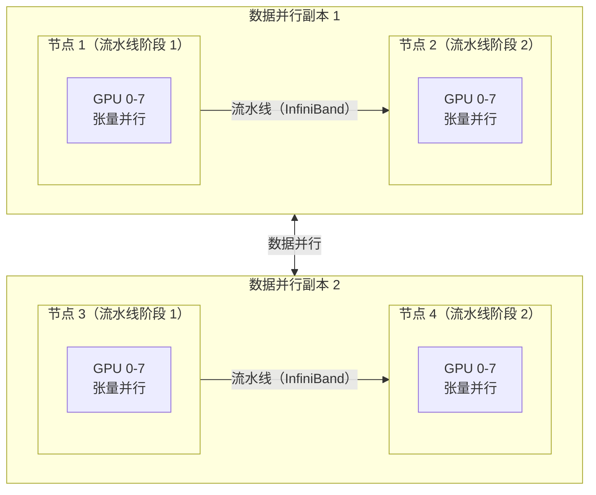

## 7.4 流水线并行与混合并行策略

**流水线并行**（Pipeline Parallelism，PP）将模型的不同层分配到不同的 GPU 上。7.3 末尾把「节点内张量并行、节点间数据并行」称作主流框架的标配，可那套标配里真正切开模型计算的只有张量并行一维，而它被节点边界钉住了——跨节点做 AllReduce，那约 1/9 的带宽差会直接压在每一层的关键路径上。

### 7.4.1 流水线并行

切分以层为单位：一个 32 层的模型可以切分为 4 个“段”，每 8 层放在一张 GPU 上。

朴素的流水线并行有严重的**气泡**（Bubble）问题：当 GPU 0 在计算前 8 层的第一个小批量时，GPU 1/2/3 都处于空闲状态，等待 GPU 0 的输出。解决方案是**微批量**（Micro-batch）调度：将一个大批量分成多个微批量，以流水线方式交错处理，减少 GPU 空闲时间。

气泡比率可以量化为：设流水线有 $$p$$ 个阶段，每个批量被切分为 $$m$$ 个微批量，则

$$\text{bubble\_ratio} \approx \frac{p - 1}{p - 1 + m}$$

当 $$m \gg p$$ 时气泡开销趋近于零，这就是为什么实践中通常选择较大的微批量数（例如 $$m \ge 4p$$）来摊薄流水线启动和排空阶段的空闲时间。

GPipe 和 PipeDream 是两种代表性的流水线调度策略。

**流水线并行与激活重计算的结合**：在流水线并行中，每个 GPU 阶段都需要保存来自前一个阶段的激活值。在 GPipe 式“先全前向、再全反向”的调度下，显存占用会随微批量数 $$m$$ 线性增长；现代框架默认的 **1F1B** 调度（PipeDream-Flush）让前向与反向交替执行，把同时“在飞”的微批量数封顶为流水线深度 $$p$$，使激活显存与 $$m$$ 解耦——这正是 1F1B 成为默认选择的主要原因。为了支持较大的微批量（以减少气泡），必须结合第 7.5 节的激活重计算技术，选择性地保存关键检查点激活值，否则显存会成为瓶颈。

### 7.4.2 三维并行

超大规模训练（如千亿到万亿参数模型）通常采用**3D 并行**——同时使用数据并行、张量并行和流水线并行：

```mermaid
graph TB
    subgraph replica1["数据并行副本 1"]
        subgraph node1["节点 1（流水线阶段 1）"]
            g1["GPU 0-7<br/>张量并行"]
        end
        subgraph node2["节点 2（流水线阶段 2）"]
            g2["GPU 0-7<br/>张量并行"]
        end
        node1 -->|"流水线（InfiniBand）"| node2
    end
    subgraph replica2["数据并行副本 2"]
        subgraph node3["节点 3（流水线阶段 1）"]
            g3["GPU 0-7<br/>张量并行"]
        end
        subgraph node4["节点 4（流水线阶段 2）"]
            g4["GPU 0-7<br/>张量并行"]
        end
        node3 -->|"流水线（InfiniBand）"| node4
    end
    replica1 <-->|"数据并行"| replica2
```

图 7-1：3D 并行策略的典型配置

典型配置为：

- **张量并行**：同一节点内 4-8 路（NVLink 高带宽互连）
- **流水线并行**：跨节点 2-8 路（InfiniBand 互连）
- **数据并行**：剩余维度的并行，用于扩展吞吐量；可增大全局批次，也可在保持全局批次不变时缩短训练步

超长上下文训练中还常引入第四个维度——**序列/上下文并行**（如 Megatron-SP、Ring Attention），按序列维切分激活与注意力计算（详见 [10.3 节](../10_inference_optimization/10.3_flash_attention.md)与 [14.7 节](../14_future_trends/14.7_long_context.md)）。

### 7.4.3 混合并行的设计考量

选择并行策略的核心原则是**匹配硬件拓扑**：

- 节点内 GPU 通信快（H100 第四代 NVLink 每 GPU 双向聚合 ~900 GB/s）→ 适合通信密集的张量并行
- 跨节点通信较慢（每 GPU 一个 NDR 400Gb/s InfiniBand 端口，双向聚合 ~100 GB/s）→ 适合通信较少的流水线并行
- 数据并行 / ZeRO 仍有 step 级梯度或状态同步，适合放在带宽足够、可重叠通信的层级；不要简单把它分配到最慢链路

框架如 Megatron-LM 和 DeepSpeed 提供了灵活的并行配置工具，用户指定各维度的并行度即可自动完成模型拆分和通信调度。

### 7.4.4 气泡的进一步压缩：交错、拆分与双向

7.4.1 给出的气泡比率 $$\frac{p-1}{p-1+m}$$ 指向一个直白的对策：把 $$m$$ 调大。但 $$m$$ 不能无限大——微批量太小会让每个核的算术效率下降，而总批量又受 6.4 节临界批量的约束。于是另一条路线出现了：**在不动 $$m$$ 的前提下改调度本身**。三种做法各自换掉了一样东西。

**交错式 1F1B（interleaved 1F1B）——用通信换气泡**。不再让一个设备连续持有若干层，而是给它分配多个**不连续**的层块（chunk）。设每个设备持有 $$v$$ 个块，则流水线的「深度」在时间轴上被切得更细，气泡比率降为约 $$\frac{1}{v}\cdot\frac{p-1}{m}$$。代价直接写在结构里：同一个微批量在设备之间要往返 $$v$$ 趟，**点对点通信次数翻 $$v$$ 倍**。[Megatron-LM 报告这一调度在显存占用相当的前提下把吞吐提升 10% 以上](https://arxiv.org/abs/2104.04473)；同一篇论文也给出了问题的量级——取决于注入的微批量数，**多达 50% 的时间可能花在流水线冲刷上**。

**零气泡（zero bubble）——用调度自由度换气泡**。它的切入点很巧：反向传播其实是两件可以分开的事，一件算**输入的梯度**（记作 B），一件算**参数的梯度**（记作 W）。[Zero Bubble 论文指出](https://arxiv.org/abs/2401.10241)，同一微批量的 F 与 B 必须跨阶段保持顺序依赖，但 **W 可以被放到本阶段对应 B 之后的任意位置**——于是 W 成了可以自由搬运的「填充物」，专门用来塞进气泡。论文报告在相近显存约束下比 1F1B 吞吐高出至多 23%，放宽显存约束后可达 31%。要真正做到零气泡，还需要绕开优化器步骤处的同步（同时保持同步训练语义）。

**双向流水（DualPipe）——用显存换气泡**。DeepSeek-V3 让微批量同时从流水线两端注入，前向与反向在中间相遇，从而把计算与通信充分重叠。它的代价是[**必须保存两份模型参数**](https://arxiv.org/abs/2412.19437)；论文自己的说明是，由于训练时用了很大的专家并行度，这份额外开销并不显著。这是一个典型的「代价是否可接受取决于其他并行维度怎么切」的例子。

三者可以放在同一张取舍表里看：

| 方案 | 换掉的是什么 | 适用前提 |
|------|------|------|
| 增大 $$m$$ | 单核算术效率、总批量预算 | 临界批量还有余量 |
| 交错式 1F1B | 点对点通信次数（×$$v$$） | 互连带宽有富余 |
| 零气泡 | 调度复杂度与显存峰值 | 框架支持 B/W 拆分 |
| DualPipe | 一份额外的参数显存 | 其他维度已把参数切得足够碎 |

值得注意的是，这四条路线都不改变**同步训练语义**——它们压缩的是等待，而不是像早期异步流水线那样放松权重更新的一致性。这也是它们能被主流框架直接采用的原因。
