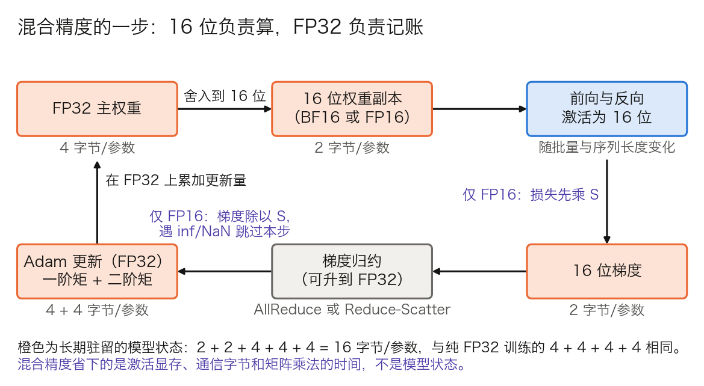

## 7.6 混合精度训练：精度与速度的权衡

**混合精度训练**（Mixed Precision Training）用 16 位浮点数完成大部分计算，只在少数地方保留 32 位。7.5 处理的是“哪些数该留下”，每个数自身的位宽没有动；本节换的正是位宽这条轴。要回答的问题是：位宽减半之后，哪些数会出错，怎样补救，补救之后到底省下了什么；再往下压到 8 位和 4 位，又多出哪些机制。

### 7.6.1 浮点格式对照：范围与间隔

浮点数由符号、指数、尾数三段组成。指数位决定能表示多大和多小的数，即动态范围；尾数位决定相邻两个可表示的数隔多远，即精度。表 7-18 列出训练中用到的几种格式。

| 格式 | 符号/指数/尾数 | 最大值 | 最小正规数 | 最小非正规数 | 1 附近的间隔 |
| --- | --- | ---: | ---: | ---: | ---: |
| FP32 | 1/8/23 | 3.4 × 10³⁸ | 1.2 × 10⁻³⁸ | 1.4 × 10⁻⁴⁵ | 1.2 × 10⁻⁷ |
| FP16 | 1/5/10 | 65,504 | 6.1 × 10⁻⁵ | 6.0 × 10⁻⁸ | 9.8 × 10⁻⁴ |
| BF16 | 1/8/7 | 3.4 × 10³⁸ | 1.2 × 10⁻³⁸ | 9.2 × 10⁻⁴¹ | 7.8 × 10⁻³ |
| FP8 E4M3 | 1/4/3 | 448 | 1.6 × 10⁻² | 2.0 × 10⁻³ | 0.125 |
| FP8 E5M2 | 1/5/2 | 57,344 | 6.1 × 10⁻⁵ | 1.5 × 10⁻⁵ | 0.25 |
| FP4 E2M1 | 1/2/1 | 6 | 1 | 0.5 | 0.5 |

表 7-18：训练中常见的浮点格式。1 附近的间隔等于 $$2^{-\text{尾数位数}}$$；各值由位宽按 IEEE 754 的规则算出。E4M3 按 [FP8 Formats for Deep Learning](https://arxiv.org/abs/2209.05433) 的定义不表示无穷大，多出的编码使最大值到 448；E2M1 能表示的绝对值只有 0、0.5、1、1.5、2、3、4、6 这 8 个。

后文用到三个数。FP16 的最大值只有 65,504，超过就变成 inf。FP16 的最小正规数是 `6.1 × 10⁻⁵`，再小就进入非正规数区间，有效位逐位减少，小于最小非正规数的一半（约 `3 × 10⁻⁸`）就舍入为 0。BF16 的指数位与 FP32 相同，范围相同，但 1 附近的间隔是 0.0078，比 FP16 粗 8 倍。

### 7.6.2 为什么用半精度：省下的是什么

半精度带来三项直接收益：

- **激活显存减半。** 7.5.1 的每层激活按 16 位存放，换成 FP32 就是两倍。
- **通信字节减半。** 梯度同步、张量并行的 AllReduce、流水线的点对点传输，消息都以 16 位发送。
- **矩阵乘法更快。** 每个数的字节减半，同样的显存带宽能送进两倍的数；A100、H100 上的 Tensor Cores 对 16 位矩阵乘法有专门的硬件支持。实际加速比取决于模型与内核，没有固定倍数。

模型状态并不减半。混合精度为了保住数值，要另存一份 FP32 的主权重和 FP32 的优化器状态，每参数仍是 16 字节，7.6.4 给出这笔账。

### 7.6.3 两个失效：梯度下溢与更新被吞

直接把所有张量换成 FP16，会在两处出错。[Mixed Precision Training 论文](https://arxiv.org/abs/1710.03740)针对它们提出了损失缩放和 FP32 主权重。

**失效一：小梯度变成 0。** 设某个梯度的真实值是 `10⁻⁸`。它小于 FP16 最小非正规数的一半，转成 FP16 后是 0，这个参数在这一步得不到任何更新。论文的说法是绝对值小于 $$2^{-24}$$ 的数在 FP16 中变为零。

**损失缩放**（loss scaling）利用链式法则的线性：反向之前把损失乘以常数 $$S$$，所有梯度都放大 $$S$$ 倍；更新之前再除以 $$S$$。`S = 1024` 时，上面的梯度变成 `1.02 × 10⁻⁵`，落在非正规数区间，可以表示但有效位不足；`S = 65,536` 时变成 `6.55 × 10⁻⁴`，是正规数，除回去得 `1.00 × 10⁻⁸`。

$$S$$ 太小救不回小梯度，太大则大梯度乘上去超过 65,504，变成 inf。**动态损失缩放**用溢出本身当信号：

1. 每步在更新之前检查梯度里有没有 inf 或 NaN。
2. 有，则跳过这一步的参数更新，并把 $$S$$ 乘以回退系数。
3. 连续若干步没有溢出，则把 $$S$$ 乘以增长系数。

PyTorch 的 `torch.amp.GradScaler` 就是这一算法：`init_scale` 默认 65,536，`backoff_factor` 默认 0.5，`growth_factor` 默认 2.0，`growth_interval` 默认 2,000 步，见其[文档](https://docs.pytorch.org/docs/stable/amp.html)。$$S$$ 因此始终贴着“刚好不溢出”的上沿。代价是偶尔丢掉一步，以及每步一次全体梯度的 inf 检查。

**失效二：更新量被权重吞掉。** 即使梯度本身可以表示，加到权重上时也可能消失。浮点加法要先对齐指数，小的一方的尾数右移，移出尾数位的部分丢失。设权重 `w = 1.0`，更新量 `ηg = 10⁻⁴`：

- FP16 在 1 附近的间隔是 `9.8 × 10⁻⁴`，`10⁻⁴` 不到半个间隔，`1.0 + 10⁻⁴` 舍入回 1.0。连加 1,000 次，结果仍是 1.0，正确值是 1.1。
- BF16 的间隔是 `7.8 × 10⁻³`，同样舍入回 1.0。
- FP32 的间隔是 `1.2 × 10⁻⁷`，得到 1.0001，连加 1,000 次得 1.1000。

论文给出的判据是：权重与更新量之比超过 2,048 时，FP16 下更新可能归零。学习率 `10⁻⁴` 量级、权重 `10⁻²` 到 1 的量级时，这个条件很容易满足。

对策是保留一份 **FP32 主权重**（master weights）：更新量在 FP32 上累加，每步再把主权重舍入成 16 位副本供前向和反向使用。转换是就近舍入，不是截断。

### 7.6.4 一步里的精度数据流与每参数字节账

图 7-6 把一步训练中各个张量的精度连成一圈。

图 7-6：混合精度训练的一步（[生成脚本](https://github.com/yeasy/llm_internals/blob/main/tools/figures/ch07_precision_flow.py)）。橙色是长期驻留的模型状态，方框下方标出每参数字节数；紫色标注只在 FP16 下需要。

**每参数 16 字节的来历。** 16 位参数 2，16 位梯度 2，FP32 主权重 4，Adam 的一阶矩和二阶矩各 4，合计 `2 + 2 + 4 + 4 + 4 = 16`。纯 FP32 训练是参数 4、梯度 4、两个矩各 4，也是 16。7.1.6 和表 7-3 用的就是这个数。FSDP 的实现略有不同：它的分片参数本身保持 FP32，兼作主权重，16 位副本只在 All-Gather 之后临时存在。

**哪些算子留在 FP32。** 不是所有计算都适合 16 位。PyTorch 的 `torch.autocast` 按算子分三类：矩阵乘法、卷积、`linear` 等转成 16 位；`softmax`、`log_softmax`、`layer_norm`、`cross_entropy`、`exp`、`log`、`pow`、`sum`、`norm` 等转成 FP32；其余算子跟随输入类型。第二类的共同点是含指数、对数或大范围求和，中间值容易溢出，或者要把很多小数加到一个大数上。

**梯度用什么精度归约。** 16 位梯度在几千张卡上求和，既可能溢出，也会丢掉小的分量。Llama 3 论文说明，为保证收敛，它跨微批量的梯度累积用 FP32，FSDP 中跨数据并行组的 Reduce-Scatter 也用 FP32。FSDP2 的 `MixedPrecisionPolicy` 里，`param_dtype` 管计算和 All-Gather 的精度，`reduce_dtype` 管梯度归约的精度，可以分别设置。代价是梯度通信的字节数翻倍。

### 7.6.5 BF16：省掉损失缩放，省不掉主权重

**BF16**（Brain Floating Point 16）把 16 位中的 8 位给指数，范围与 FP32 相同。代价是尾数只剩 7 位，比 FP16 的 10 位少。

范围相同意味着 FP32 能表示的梯度，BF16 基本都能表示，失效一不再出现，也就不需要损失缩放和它带来的跳步。这省掉了一整套动态调节的状态，调试也更简单。支持 BF16 的硬件（A100 及之后）上，大模型训练普遍使用 BF16。

失效二仍然存在，而且更严重：BF16 在 1 附近的间隔比 FP16 粗 8 倍。BF16 训练照样要保留 FP32 主权重和 FP32 优化器状态，7.6.4 的 16 字节账不变。把 BF16 理解成“不需要主权重”是常见的误解。

### 7.6.6 FP8：缩放因子怎么定

Hopper 与 Ada 架构的 GPU 引入了 FP8 的硬件支持。FP8 有两种编码：E4M3 精度较高、最大值 448；E5M2 范围更大、最大值 57,344。8 位只有 256 个编码，张量的数值必须先缩放到这个窄窗口里再量化，关键在缩放因子怎么定。

**按张量缩放。** 每个张量（权重、激活、梯度）各带一个缩放因子，使该张量的最大绝对值（amax）映射到 FP8 的最大值附近。它与 FP16 的损失缩放不同：损失缩放全局只有一个 $$S$$，FP8 是每个张量各一个。DeepSeek-V3 技术报告概括了此前框架的两种通行做法：

- **混合格式。** 前向用 E4M3，反向的输入梯度和权重梯度用 E5M2，因为梯度的动态范围更大。
- **延迟缩放**（delayed scaling）。维护最近若干步的 amax 历史，用它推断本步的缩放因子，这样不必在量化之前先扫描一遍张量。分布式训练时 amax 还要在 rank 之间同步。代价是数值突变的那一步，缩放因子是过时的，溢出的值被截到最大值。

**细粒度缩放。** 一个张量只用一个缩放因子，少数离群值会把整个窗口撑大，其余的值挤在少数几个编码上。[DeepSeek-V3](https://arxiv.org/abs/2412.19437) 把分组做细：激活按 `1 × 128` 的 tile 分组，即每个词元的每 128 个通道一个缩放因子；权重按 `128 × 128` 的 block 分组。分组之后，它在所有张量上统一用 E4M3，并改为在线计算每组的 amax，不再依赖历史。报告把可行性归因于小分组让组内元素共享了指数位，弥补了动态范围的不足。代价是内核要支持带分组缩放的矩阵乘法，当时的 GPU 并不原生支持。

**累加精度是另一个隐蔽的问题。** 低精度 GEMM 的准确性主要取决于累加精度。DeepSeek-V3 技术报告实测发现，H800 上 FP8 GEMM 的累加精度只保留约 14 位，远低于 FP32 累加；内积维度 $$K$$ 越大，误差累积越明显。用两个随机矩阵在 `K = 4096` 下测试，有限的累加精度带来接近 2% 的最大相对误差。这个量级足以损害训练，而它与缩放因子怎么设无关。

他们的对策是周期性提升累加精度：每累加 $$N_C = 128$$ 个元素，就把中间结果转到 CUDA Core 上的 FP32 寄存器做一次高精度累加，再继续。排查低精度训练问题时由此多一个检查项：在怀疑缩放策略之前，先确认累加是在哪里、以什么精度做的。

### 7.6.7 4 比特预训练：NVFP4

精度压缩的下一站是 4 比特。先分清两件常被混为一谈的事：推理侧的 4 比特量化，是把训练好的权重压到 4 位再部署，见 [10.4 节](../10_inference_optimization/10.4_quantization.md)；训练侧的 4 比特预训练，是前向、反向、梯度本身都在 4 位上算。后者难得多，到 2025 年下半年才出现可信的大规模证据。

**格式本身。** 表 7-18 的 E2M1 只有 8 个绝对值，单靠它无法表示一个张量。4 比特格式都是“元素 + 分块缩放”的组合，差别在缩放：

| 格式 | 元素 | 块大小 | 块缩放因子 | 张量级缩放 | 每元素折合位数 |
| --- | --- | ---: | --- | --- | ---: |
| MXFP4 | E2M1 | 32 | 8 位，只能取 2 的幂（UE8M0） | 无 | `4 + 8/32 = 4.25` |
| NVFP4 | E2M1 | 16 | 8 位 E4M3，带尾数 | 一个 FP32 | `4 + 8/16 = 4.5` |

表 7-19：MXFP4 与 NVFP4 的结构，取自 [NVFP4 预训练论文](https://arxiv.org/abs/2509.25149)第 2 节。

**NVFP4** 是 NVIDIA 定义、Blackwell 原生支持的格式，与 MXFP4 或泛称的“FP4”并不等同。它做了三处改动：块从 32 缩到 16，块内的动态范围更窄；块缩放因子从 2 的幂换成带尾数的 E4M3，能更贴近块内的 amax；再加一个张量级的 FP32 缩放，补回 E4M3 缩放因子损失的范围。论文指出，MXFP4 的缩放因子只能向上取到 2 的幂，最多会浪费一个二进制数量级的范围。推理侧同一格式的显存账见 [11.12 节](../11_serving/11.12_hardware.md)。

这篇论文给出了第一个关键证据：用 NVFP4 训练一个 120 亿参数的模型，消耗 10 万亿词元。论文称这是当时公开记录中最长的 4 比特精度训练。训练损失和下游任务准确率与 FP8 基线相当，例如 MMLU-Pro 为 62.58% 对 62.62%。它靠四件事把 4 位训稳：

- **随机 Hadamard 变换**（RHT）：抑制块内离群值，让数值分布更适合极低位宽。
- **二维量化方案**：保证前向与反向传播使用一致的表示。
- **随机舍入**：获得无偏的梯度估计，避免确定性舍入累积系统性偏差。
- **选择性高精度层**：一部分敏感层不做 4 位量化。

之后 NVIDIA 的 Nemotron 3 系列把它推到了前沿规模。Super（120B 总参 / 12B 激活）用 NVFP4 完成了 25T 词元量级的预训练，见其[模型卡](https://huggingface.co/nvidia/NVIDIA-Nemotron-3-Super-120B-A12B-NVFP4)；Ultra（550B / 55B 激活）沿用同一配方，预训练规模为 20T 词元。Ultra 的[技术报告](https://research.nvidia.com/labs/nemotron/files/NVIDIA-Nemotron-3-Ultra-Technical-Report.pdf)展示了“选择性高精度”在实践中的含义。网络最后 15%（16 层）、Mamba 输出投影、latent 投影、QKV 与注意力投影、MTP 层和嵌入层都保留在更高精度，其余大部分线性层才走 NVFP4。

这里有两个口径要交代清楚。第一，基线是 FP8 而非 BF16，官方措辞是“与 FP8 基线相当”（comparable），不是“无损”，实测存在可测量的差距。第二，DeepSeek-V4 不是 FP4 预训练的例子。按其[技术报告](https://arxiv.org/abs/2606.19348)，它的 FP4（MXFP4）用在后训练的量化感知训练与推理阶段，对象是 MoE 专家权重与 indexer 的 QK 路径；训练框架仍是 FP8。位宽压得越低，训练对数值扰动越敏感；一旦中途出错或硬件故障，能不能从最近的状态原样接上，取决于落盘了什么。
