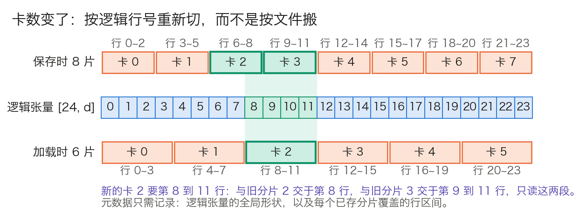

## 7.7 检查点管理与容错

大规模训练持续数周到数月，硬件故障不是意外，而是日程的一部分。前面几节留下了一串必须落盘的东西：7.2 分片后的优化器状态，7.6 的 FP32 主权重，以及 7.3、7.4 决定的它们散落在哪几张卡上。本节回答四个问题：检查点里要存什么、有多大，多久存一次才划算，怎样存才不挡住训练，以及重启后卡数变了，这些分片怎样拼回来。

### 7.7.1 检查点里有什么、有多大

**要解决的问题。** 从检查点恢复之后，训练应当与从未中断一样继续下去。凡是影响后续计算的状态都要存，漏掉任何一项，恢复后的轨迹就与原来不同。

| 状态 | 漏存的后果 |
| --- | --- |
| FP32 主权重 | 无法恢复；只存 16 位副本，则 7.6.3 被吞掉的低位更新全部丢失 |
| 优化器的一阶矩、二阶矩与步数 | Adam 的矩从零重新积累，偏差校正重置，恢复后数百步内更新幅度异常 |
| 学习率调度器状态与全局步数 | 学习率回到预热或错误的位置 |
| 数据加载器位置 | 重复训练已见过的数据，或跳过一段数据 |
| 各 rank 的随机数状态 | dropout 掩码与数据打乱的序列改变，无法逐位复现；重计算与张量并行还依赖 7.5.2 的多类随机数状态 |
| 损失缩放器的 $$S$$，FP8 的 amax 历史 | 恢复后的头几步溢出或下溢，直到重新收敛到合适的缩放 |

表 7-20：检查点应保存的状态，以及漏存各项的后果。

**大小。** 主权重 4 字节加两个矩各 4 字节，每参数 12 字节；实现上若连 16 位参数副本一起存，是 14 字节。Llama 3 70B 分别是 `12 × 705.5 亿 ≈ 847 GB` 和 `14 × 705.5 亿 ≈ 988 GB`，接近 1 TB。它与 7.1.6 的 16 字节账只差不落盘的梯度。其余各项合计不过几 MB，却决定了恢复是否正确。

一次保存要多久，取决于存储的写带宽。988 GB 以聚合 10 GB/s 写入，需 99 s；训练若同步等待，这 99 s 里全部 GPU 空转。Llama 3 论文给出一组真实的量级：存储系统可持续吞吐 2 TB/s、峰值 7 TB/s，每张卡的检查点在 1 MB 到 4 GB 之间，并指出突发的检查点写入会短时间占满存储网络。405B 按 14 字节计是 5.67 TB，分到 16,384 张卡每卡约 346 MB；全部 5.67 TB 以 2 TB/s 的聚合带宽写完要 2.8 s。

### 7.7.2 多久存一次：MTBF 与 Young/Daly 公式

**存得太勤和太疏各有代价。** 设每次保存让训练停顿 $$\delta$$ 秒，每隔 $$T$$ 秒存一次，集群的平均无故障时间（MTBF）为 $$M$$。浪费的时间占比有两项：

$$
\text{开销} \approx \underbrace{\frac{\delta}{T}}_{\text{保存}} + \underbrace{\frac{T}{2M}}_{\text{故障后重做}}
$$

第一项是保存本身的停顿。第二项是故障的代价：故障平均落在两次保存的正中间，要重做 $$T/2$$ 的工作，而故障每 $$M$$ 秒来一次。对 $$T$$ 求极小：

$$
T_{\text{opt}} = \sqrt{2\,\delta\,M}
$$

这就是 [Young 在 1974 年给出的一阶近似](https://doi.org/10.1145/361147.361115)，[Daly 在 2006 年给出了高阶修正](https://doi.org/10.1016/j.future.2004.11.016)；$$\delta \ll M$$ 时两者几乎相同。取最优间隔时，两项开销恰好相等。

**代入公开的故障数据。** Llama 3 论文报告，在 405B 预训练的 54 天里共有 466 次作业中断，其中 419 次是意外中断，规模最大到 16,384 张 H100。按意外中断计：

$$
M = \frac{54 \times 24\ \text{小时}}{419} \approx 3.09\ \text{小时} \approx 11{,}135\ \text{秒}
$$

| 每次保存的停顿 $$\delta$$ | $$T_{\text{opt}}$$ | 保存开销 | 重做开销 | 合计 |
| ---: | ---: | ---: | ---: | ---: |
| 60 s（同步写） | `√(2 × 60 × 11,135) ≈ 1,156 s`，约 19 分钟 | 5.2% | 5.2% | 10.4% |
| 5 s（异步写，见 7.7.3） | `√(2 × 5 × 11,135) ≈ 334 s`，约 5.6 分钟 | 1.5% | 1.5% | 3.0% |

表 7-21：MTBF 为 3.09 小时的集群上，两种保存停顿下的最优间隔与开销。

由此读出三点。第一，“每隔多少步存一次”不是常数，它由 MTBF 和保存停顿决定；`δ = 60 s` 时把间隔定成 1 小时，开销是 17.8%，定成 5 分钟是 21.3%，都远高于最优的 10.4%。第二，把保存的停顿从 60 s 压到 5 s，开销从 10.4% 降到 3.0%，这是异步保存值得做的定量理由。第三，集群越大，越要频繁地存。

**MTBF 随卡数反比下降。** 一张卡出故障，整个同步作业都要重启。各卡独立故障时，$$N$$ 张卡的集群 MTBF 约为单卡 MTBF 的 $$1/N$$。把上面的 3.09 小时全部折到 16,384 张卡上，单卡约 5 万小时，即 5.8 年。同样的单卡可靠性，1,024 张卡的集群 MTBF 是 49.5 小时，`δ = 60 s` 时最优间隔是 77 分钟，开销只有 2.6%；10 万张卡则只有约 30 分钟。这是粗略的折算：那 54 天并非始终满规模，故障也不全来自 GPU。

**恢复的完整账。** 每次故障除了重做 $$T/2$$，还有重启本身的代价 $$R$$：发现故障、换掉坏节点、重新建立通信、加载检查点、内核预热。它再贡献 $$R/M$$ 的开销。`R = 10 分钟`时是 `600 ÷ 11,135 ≈ 5.4%`，比最优配置下保存与重做的总和还大。三项合起来，`δ = 5 s` 时有效训练时间约占 91.6%。Llama 3 论文报告的有效训练时间占比高于 90%，并说明其手段正是缩短作业启动与检查点的时间、加快故障定位。

### 7.7.3 怎样存得不挡路：分片与两阶段异步

**分片检查点。** 不把状态汇集到某一张卡上再写，而是每张卡只写自己持有的分片。写入带宽随卡数线性扩展，也避免了在单卡上拼出一份放不下的完整状态。恢复时各卡并行读取。

**两阶段异步保存。** 写存储慢，但不必让 GPU 等它：

1. **拷出阶段（阻塞）。** 在两步训练之间，把本卡的分片从显存拷到主机的锁页内存。Llama 3 70B 在 512 张卡上每卡约 1.93 GB，按 PCIe 25 GB/s 估算不到 0.1 s。这一段必须阻塞，否则下一步的参数更新会改写正在拷贝的内容，存下的状态前后不一致。
2. **落盘阶段（后台）。** 后台线程或进程把主机内存里的这份快照写入存储，训练同时继续。

代价有两个：主机内存要多留一份检查点大小的缓冲；上一次的落盘没写完，下一次保存就不能开始，所以保存间隔的下限是落盘时间。7.7.2 的 $$\delta$$ 由此从“写完存储的时间”降为“拷到主机内存的时间”。

PyTorch 的 `torch.distributed.checkpoint`（DCP）提供这两种能力，见其[文档](https://docs.pytorch.org/docs/stable/distributed.checkpoint.html)。`save` 让每个 rank 只保存自己的本地分片，每个检查点至少每 rank 一个文件。`async_save` 先把状态拷到暂存区（默认是 CPU 内存），再在单独的线程里写入；默认的暂存实现使用锁页内存。状态对象只要实现 `state_dict` 与 `load_state_dict`，就能被一并保存，数据加载器位置和随机数状态可以照此接入。

**存储分层。** 最近的检查点放在本地 SSD 或主机内存，恢复快；定期再复制到分布式文件系统或对象存储，防止节点整体丢失。保留最近几个而非只留一个，7.7.5 的回滚要用到更早的检查点。

### 7.7.4 卡数变了怎么拼回来

故障后坏节点可能一时补不上，或者要换一种并行配置继续训练。此时每张卡应当持有的分片与保存时不同。

**思路：按逻辑张量寻址，而不是按文件寻址。** 分片只是存放方式，模型在逻辑上仍是一组形状固定的张量。检查点的元数据记两样东西：每个逻辑张量的全局形状，以及每个已存分片覆盖这个张量的哪个区间。加载时，每张卡按新的拓扑算出自己要的区间，与各个已存分片的区间求交，只读有交集的那几段。图 7-7 以一个 24 行的张量为例，保存时沿第 0 维切成 8 片，加载时要 6 片。

图 7-7：同一个逻辑张量从 8 片重切为 6 片（[生成脚本](https://github.com/yeasy/llm_internals/blob/main/tools/figures/ch07_reshard.py)）。新的卡 2 需要第 8 到 11 行，分别来自旧分片 2 的第 8 行和旧分片 3 的第 9 到 11 行。

这正是 7.2.7 中 FSDP2 改用 DTensor 逐参数分片的收益之一。DTensor 自带全局形状和 placement，每个参数沿第 0 维切分，分片与逻辑张量的对应关系一目了然。第一代 FSDP 把多个参数拍平、拼接后再切，一个分片里混着几个参数的片段，[官方文档](https://docs.pytorch.org/docs/stable/distributed.fsdp.fully_shard.html)指出这使重分片到不同的并行配置变得复杂。DCP 的文档把这一能力称为加载时重分片（load-time resharding）：在一种集群拓扑下保存，在另一种拓扑下加载。

**重分片覆盖不了的部分。**

- **张量并行与流水线并行改变时**，切分的维度和归属都变了：列切的矩阵沿第 1 维切，流水线决定某一层在哪一级。元数据仍按逻辑张量描述就能处理，前提是保存时记录的是逻辑名称和全局形状，而不是“第几级的第几个参数”。
- **优化器状态要跟着参数走。** 一阶矩、二阶矩与参数同形，用同样的方式重切。把多个参数的状态合并成一个扁平缓冲区的优化器实现，要先拆回逐参数的形式。
- **随机数状态和数据加载器位置无法逐位迁移。** 卡数变了，每张卡该用哪个随机数流、读数据的哪一段都要重新定义。常见做法是让数据位置由全局步数和全局样本序号决定，与卡数无关；随机数按新拓扑重新播种，接受恢复前后不能逐位一致。
- **全局批量要保持不变。** 数据并行度变了，要相应调整微批量个数，使 7.4.4 的 `d × m × b` 不变，否则优化轨迹会改变。

### 7.7.5 故障谱：崩溃、挂起、静默损坏与损失尖峰

Llama 3 论文的表 5 给出了 419 次意外中断的分类：约 78% 归因于确认或疑似的硬件问题，GPU 相关的占 58.7%。它们对应四类性质不同的故障：

- **崩溃。** 进程退出、节点宕机、链路中断，有明确的错误信号。对策是自动重启：调度器检测到失败，换掉坏节点，从最近的检查点恢复。419 次中断里只有 3 次需要大量人工介入。
- **挂起。** 某张卡停在集合通信里不返回，其他卡无限等待，没有任何错误。对策是给集合通信设超时，并由看门狗杀掉超时的作业；表 5 中 NCCL 看门狗超时有 7 次。定位是哪张卡、哪次通信出的问题，要靠通信记录。Llama 3 使用 PyTorch 的 NCCL flight recorder，把集合通信的元数据和调用栈记在环形缓冲区里，超时后自动导出。
- **慢节点。** 不报错，只是慢。同步训练的步时由最慢的卡决定，一张降频的卡拖慢整个作业，要靠逐卡的步时监控发现。
- **静默数据损坏**（silent data corruption，SDC）。硬件算错了数却不报错，表 5 中有 6 次。它无法由检查点机制本身发现：错误的权重会被原样存下。线索是损失或梯度范数的异常，以及各数据并行副本之间本应逐位相同的参数出现分歧。

**损失尖峰是另一类“故障”。** 它不是硬件问题，处理手段却依赖检查点。[PaLM 论文](https://arxiv.org/abs/2204.02311)报告其最大的模型在训练中出现约 20 次损失尖峰，做法是从尖峰前约 100 步的检查点重启，并跳过约 200 到 500 个数据批次。论文还验证了单独重放这些批次并不会触发尖峰，问题出在特定数据与特定参数状态的组合。稳定性手段见 [6.3 节](../06_training_techniques/6.3_regularization.md)。这解释了为什么要保留多个历史检查点，也解释了为什么数据加载器必须能定位并跳过指定的批次。

DeepSpeed、Megatron-LM、Ray Train 等框架提供了不同程度的自动重启与弹性支持。它们解决的是“重新拉起来”；上面各项状态存没存全、元数据是否按逻辑张量记录，仍要使用者自己核对。

### 7.7.6 检查点平均

保留下来的多个检查点还有一种用途。**检查点平均**（checkpoint averaging）在训练后期取若干相邻检查点，把参数逐元素求平均，有时能得到比任何单个检查点都好的模型。

它与模型集成不同。集成对多个模型的输出取平均，推理成本成倍增加；权重平均得到的仍是一个模型。它成立的前提是这些检查点位于损失曲面的同一个盆地里，盆地内近似凸，平均后的点更靠近盆地中心。相隔很远的检查点，或学习率还很大的阶段，平均的结果可能比任何一个都差。收益强依赖任务、指标、训练阶段和检查点间距，不能把某个基准上的数值外推为通用的收益。
