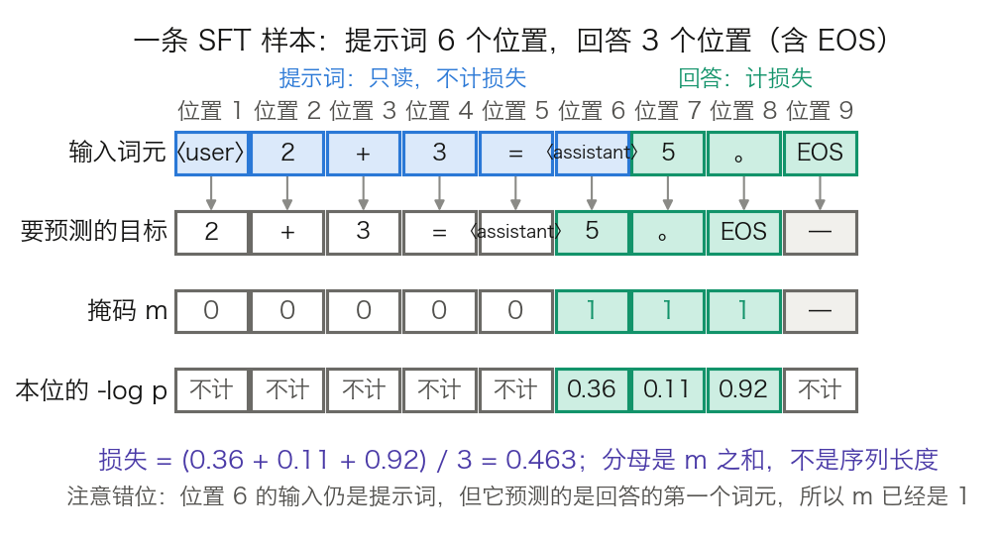

## 8.1 监督微调：教模型“怎么回答”

**监督微调**（Supervised Fine-Tuning，SFT）把只会续写的基础模型变成会应答的助手。本节回答三个问题：一条“指令-回答”样本怎样一步步变成一个损失数值；为什么学习率必须压到预训练峰值的几十分之一；数据要多少、要什么样。答得好不好、安不安全，留给 8.2 与 8.3。

### 8.1.1 从续写到对话

预训练模型只做一件事：接着给定文本往下写。给它“法国的首都是”，它会续出“巴黎，位于塞纳河畔……”。直接问“法国的首都是什么？”，它可能续出“这是一道地理题……”，而不是直接回答。

SFT 在**指令-回答对**上继续训练，把“被问就答”这个映射装进权重。训练数据的形式是一问一答：

```text
用户：法国的首都是什么？
助手：法国的首都是巴黎。
```

**真实模型用特殊词元分隔角色，不是用“用户：”这样的明文。** [3.8.2 节](../03_components/3.8_gpt_inference_flow.md)已经给出推理侧的教学模板 `⟨user⟩ 2 + 3 = ⟨assistant⟩`：服务端按聊天模板把消息列表排成一串词元，并在末尾补上“助手将开始说话”的控制标记。训练侧必须用同一套模板，否则模型在推理时见到的分隔符与训练时不同。

模板错位是 SFT 之后“答非所问、停不下来”的最常见原因。它有三种典型形态：训练时用了模板 A、推理时用了模板 B；训练样本里漏掉了结束词元，模型学不会停；系统提示词在训练里从不出现，推理时却总是出现。三者都不会让训练损失变难看。

### 8.1.2 一条样本怎样变成一个损失

**SFT 的损失函数形式与预训练相同，都是下一个词元的交叉熵。** 区别只有一条：预训练对每个位置都计损失，SFT 只对回答部分计损失。用掩码 $$m_t$$ 写出来就是：

$$
\mathcal{L} = -\frac{1}{\sum_t m_t}\sum_t m_t \log p_\theta(x_{t+1}\mid x_{\le t})
$$

$$m_t = 1$$ 表示位置 $$t$$ 预测出的那个词元要计损失，$$m_t = 0$$ 表示不计。分母是 $$\sum_t m_t$$，即真正计入的位置数，不是序列长度。

**掩码对齐的是被预测的词元，不是输入词元。** 位置 $$t$$ 预测的是位置 $$t+1$$ 的词元，所以判断 $$m_t$$ 要看位置 $$t+1$$ 属不属于回答。这个错位是实现里最容易写反的一处。

沿用 3.8 节的教学样本，把提示词 `⟨user⟩ 2 + 3 = ⟨assistant⟩` 与回答 `5 。 EOS` 接成 9 个位置。图 8-1 把三行对齐摆开：输入词元、该位置要预测的目标、掩码 $$m$$。



图 8-1：一条 SFT 样本怎样变成带掩码的损失（[生成脚本](https://github.com/yeasy/llm_internals/blob/main/tools/figures/ch08_sft_loss_mask.py)）。蓝色是提示词，青绿色是回答与计损失的位置；词元序列沿用 3.8 节的教学模板，`-log p` 的三个数值是教学示意；图内的角色标记写作 `〈user〉`，与正文的 `⟨user⟩` 是同一个标记，换形只为规避中文字体缺字形。

位置 1 到 5 预测的都还是提示词，$$m$$ 为 0。位置 6 的输入是 `⟨assistant⟩`，它预测的却是回答的第一个词元 `5`，所以 $$m_6 = 1$$。位置 7、8 同理。位置 9 是 EOS，后面没有下一个词元，不参与。于是 9 个位置里只有 3 个计损失。

设这三位的 $$-\log p$$ 分别为 0.36、0.11、0.92，对应的概率是 0.698、0.896、0.399。损失为：

$$
\mathcal{L} = \frac{0.36 + 0.11 + 0.92}{3} = 0.463
$$

**EOS 必须计入损失。** 上例里 EOS 那一位的 $$-\log p$$ 最大（0.92），正说明模型还不太会停。把它从掩码里漏掉，损失会降到 $$(0.36 + 0.11) / 2 = 0.235$$，看着更好看，代价是模型永远学不会在回答结束时停下来，推理时只能靠最大长度截断。

真实实现里这个掩码不是单独一个张量。PyTorch 的 `CrossEntropyLoss` 有一个 `ignore_index` 参数（默认 −100），标签等于该值的位置直接跳过，既不进分子也不进分母。所以通行做法是把标签数组里提示词那几位写成 −100，一步完成掩码与归一化。Hugging Face 的 `tokenizer.apply_chat_template` 负责把消息列表排成词元序列，TRL 的 `SFTTrainer` 负责把提示词位置的标签置为忽略值。

**多轮对话按同一条规则展开。** 一条多轮样本里，每个助手回合的词元都计损失，用户回合与系统提示词全部屏蔽。不是只训练最后一个回合，也不是把整段对话都算进去。同一条样本因此会产生多段不连续的计损失区间。

### 8.1.3 为什么学习率必须小

“SFT 用远小于预训练的学习率”常被当成经验值背下来。它其实可以从两个可查的数字推出来。

**第一笔账：见到的词元数差四到五个数量级。** [Llama 2 论文](https://arxiv.org/abs/2307.09288)的表 1 写明预训练用了 2.0T 词元；3.1 节写明“收集到 27,540 条标注之后我们停止了标注”，并说明微调跑 2 轮。把两者统一到词元：按每条样本 500 到 2,000 词元估算，两端分别是 $$27{,}540 \times 2 \times 500 = 2.75\times10^7$$ 与 $$27{,}540 \times 2 \times 2{,}000 = 1.10\times10^8$$ 个词元，即 SFT 全程见到的词元数。这是预训练 2.0T 的 $$1/(7.3\times10^4)$$ 到 $$1/(1.8\times10^4)$$，即差 4.3 到 4.9 个数量级。每条样本的平均长度是估算值，两端取值已经覆盖了常见区间。

换成梯度步数也是同一个结论。预训练的全局批大小是 $$4\times10^6$$ 词元，2.0T 词元合 50 万步。SFT 的批大小是 64 条、序列长 4,096，两轮下来是几百步的量级。**同一批权重，一边走几十万步，一边走几百步。**

**第二笔账：SFT 的学习率其实与预训练末端相接。** Llama 2 的预训练用余弦调度，末端降到峰值的 10%。7B 与 13B 的峰值是 $$3.0\times10^{-4}$$，末端因此是 $$3.0\times10^{-5}$$；34B 与 70B 的峰值是 $$1.5\times10^{-4}$$，末端是 $$1.5\times10^{-5}$$。而 SFT 用的是 $$2\times10^{-5}$$。

也就是说，“SFT 学习率比预训练小一到两个数量级”只对**峰值**成立（$$2\times10^{-5}$$ 是 $$3\times10^{-4}$$ 的 1/15）；对**末端**，两者是同一量级，甚至更大。这不是巧合：预训练结束时的学习率本身就是“不再大幅移动权重”的水平，SFT 接着它往下走才不会把已有能力挤掉。把 SFT 学习率理解成“从峰值降两个量级”容易在别的基座上取错值；理解成“接上余弦的末端”则换基座也成立。

**机制。** 回到 [6.1 节](../06_training_techniques/6.1_loss_optimizer.md)的更新公式：一步更新的幅度由学习率乘梯度决定，权重最终落在哪里取决于沿途所有更新的累积。预训练阶段任何一条样本的贡献都被海量其他样本稀释；SFT 阶段样本数少了几个数量级，少数几条样本就足以主导权重的移动方向。模型会飞快学会这批数据的表面模式，同时把预训练里学到的、这批数据没覆盖到的能力一起挤掉。

这就是**灾难性遗忘**（catastrophic forgetting）。小学习率不是为了训得慢，而是把每一步的位移压到足够小，让新的输入-输出映射长在旧能力之上而非覆盖它。同样的道理解释了为什么 SFT 通常只跑一到几轮：轮数越多，同一批样本被反复走过的累积位移越大。这条约束怎么被测出来、怎么缓解，见 [8.5 节](8.5_practice.md)。

### 8.1.4 打包与损失归一化：两个容易忽略的选择

**打包（packing）。** 指令数据的长度分布很散，几十到几千词元都有。一条一条填充到 4,096 会浪费大量计算。通行做法是把多条短样本首尾相接，拼成一条满长的序列。Llama 2 论文写得很直白：“我们把训练集里所有的提示词和回答拼接起来”，用一个特殊词元分隔提示与回答，“把用户提示词上的损失置零，因而只对回答词元反向传播”。

打包带来一个必须回答的问题：拼在一起的两条样本，后一条能不能读到前一条？注意力默认是因果的，只屏蔽未来，不屏蔽“上一条样本”。不加处理时，后一条样本的每个位置都会把前一条当成上下文。要避免这一点，需要一个块对角的注意力掩码，让每条样本只看见自己。实现上这叫序列内注意力隔离，FlashAttention 一类内核用变长序列接口（把各条样本的起止偏移传进去）来表达。不隔离在多数场景下影响不大，因为模型本来就要学会忽略无关前缀，但在长样本、强格式的任务上会引入可观的噪声。

**损失按什么归一化。** 上面的公式按词元平均，分母是本批次所有计损失位置之和。另一种写法是先在每条样本内部平均，再跨样本平均。两者的差别是权重分配：按词元平均时，长回答里的每个词元与短回答里的每个词元等权；按样本平均时，每条样本等权，于是长回答里单个词元的权重被摊薄。

这不是一个小细节。8.2.4 讲 GRPO 的“响应级长度偏差”时会再遇到同一个分母，那里的结论是：**不要让一个词元的权重取决于它恰好落在哪条回答里**。两处是同构的问题，SFT 侧的表现是模型偏好生成较短的回答。

### 8.1.5 数据质量的影响

SFT 的效果对数据**质量与多样性**的敏感程度，远高于对数量的敏感程度。[LIMA 论文](https://arxiv.org/abs/2305.11206)给出了一个干净的对照：同样从 LLaMa 65B 出发，用 1000 条精心编写的示例做 SFT，人类偏好评测上胜过了在 52,000 条 Alpaca 数据上微调的同规模模型。同一个基座，52 倍的数据量，输给了 1000 条。作者由此提出**表层对齐假说**（Superficial Alignment Hypothesis）：模型几乎全部的知识与能力都在预训练阶段学到，指令微调要做的只是教它选用哪一种表达格式。这被称为“少而精”原则。

**“1000 条”不是配方，读它必须连着读它的三层前提。** 其一，那 1000 条是喂给一个 65B 模型的。“知识都在预训练里”这个结论只有在预训练本身足够充分时才成立；搬到小得多的基座上，缺的知识不会因为示例精良而补上。其二，评测是单轮通用指令跟随上的人类偏好对比，不是知识密集型基准上的准确率。同一篇论文里，LIMA 相对 GPT-4、Claude、Bard 的“不差于”比例分别是 43%、46%、58%，它并没有全面胜过这三家。其三，论文给出的“数据量收益迅速衰减”是有条件的：原文说的是“在不同时扩大提示词多样性的前提下扩大数据量会出现急剧的收益递减”。那组消融在 7B 模型上做、由 ChatGPT 打分，图 6 的说法是数据量最多扩到 16 倍、分数仍然走平。论文自己的总结句把驱动量说得更清楚：对齐的标度规律“不必然只受数量支配，而更像是在保持高质量回答的前提下、提示词多样性的函数”。

所以“少而精”真正的主语是多样性，不是条数。它还有一个反向的旁证：LIMA 的训练数据里一条多轮对话都没有，而作者只补了 30 条手工编写的多轮对话链（总共 1,030 条），多轮能力就显著改善。**缺什么补什么，比再堆一万条有效得多。**

把一个外部锚点放在旁边，这层限制会更清楚。Llama 2 论文明确说自己的发现“与 Zhou 等人（即 LIMA）在精神上一致”，然而它给出的量是 27,540 条：“我们发现数万量级的 SFT 标注就足以取得高质量结果，收集到 27,540 条之后我们停止了标注”。两个团队相差 27 倍、结论却同向，说明可以照抄的从来不是条数，而是那条判据：**先问这批数据覆盖了多少种不同的提示，再问它有多少条。** 覆盖面不够时，加量只是把同一类样本重复给模型看。Llama 2 团队还顺带记了一笔：不同标注平台与供应商产出的数据，会让下游模型表现出明显差异。

### 8.1.6 对到实现：两份公开配方

表 8-1 并排放两份完整公开的 SFT 配方，一份来自 2023 年的 Llama 2，一份来自 2024 年的 Tülu 3。两者相隔一年多，量级仍然一致。

| 超参数 | Llama 2 Chat（7B 到 70B） | Tülu 3 8B | Tülu 3 70B |
| --- | --- | --- | --- |
| 学习率 | $$2\times10^{-5}$$ | $$5\times10^{-6}$$ | $$2\times10^{-6}$$ |
| 调度 | 余弦 | 线性 | 线性 |
| 权重衰减 | 0.1 | 未列出 | 未列出 |
| 批大小（有效） | 64 | 128 | 128 |
| 最大序列长度 | 4,096 | 4,096 | 4,096 |
| 训练轮数 | 2 | 2 | 2 |
| 损失掩码 | 提示词位置置零 | 同左 | 同左 |

表 8-1：两份公开 SFT 配方。Llama 2 一列取自 [Llama 2 论文](https://arxiv.org/abs/2307.09288) 3.1 节的 Fine-Tuning Details 段；Tülu 3 两列取自 [Tülu 3 论文](https://arxiv.org/abs/2411.15124)的表 11。两份配方都用 2 轮、4,096 序列长，学习率都在 $$10^{-6}$$ 到 $$10^{-5}$$ 之间，且模型越大学习率越低。

三条可迁移的判读：学习率随模型规模下降（Tülu 3 从 8B 的 $$5\times10^{-6}$$ 降到 70B 的 $$2\times10^{-6}$$）；轮数固定为 2，没有人靠多跑几轮来提分；序列长度 4,096 配合打包，说明批次是按词元数而不是按样本数填满的。

这些参数名易随框架版本变动。要点是三件事：标签掩码放在哪一层做、批次按词元还是按样本计、学习率相对预训练末端处在什么位置。名字会变，这三件事不变。

SFT 之后的模型已经能对话，但它只学会了模仿示范。示范里没有的行为它不会，示范里有而它并不真会的内容它照样模仿（[8.5.3 节](8.5_practice.md)给出这条失败的实测形态）。要把“像个助手”推进到“回答得更好”，需要一种不依赖标准答案的训练信号，这是 8.2 节的出发点。
