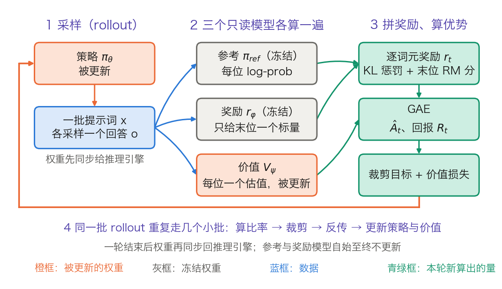
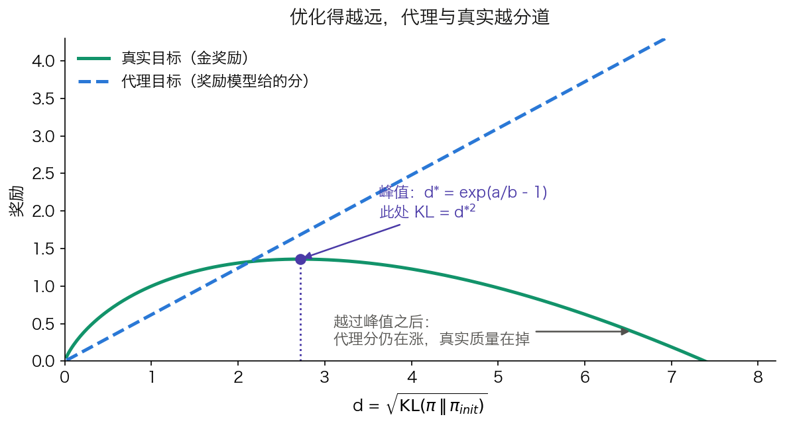

## 8.2 RLHF：为什么需要人类反馈参与训练

SFT 只能教模型模仿示范。开放性问题没有标准答案，示范也就无从写起。**基于人类反馈的强化学习**（Reinforcement Learning from Human Feedback，RLHF）换了一条路：不写答案，只让人比较两个回答谁更好，再把这份比较变成可优化的标量信号。本节把这条路径拆成可算的几步：奖励模型怎么训、逐词元奖励怎么拼、优势怎么估、裁剪目标怎么写、四个模型各占多少显存。

[InstructGPT 论文](https://arxiv.org/abs/2203.02155)给出了这条路线的第一个完整公开配方，也给出了它最常被引用的结果：标注者更偏好经这套流程训出的 1.3B 模型的输出，而不是 175B GPT-3 的输出，两者参数量差了 100 倍以上。

### 8.2.1 SFT 的局限

SFT 依赖高质量的标准答案。对于“解释量子纠缠”或“写一首关于秋天的诗”这类开放性问题，不存在唯一正确的答案。不同的回答风格、详细程度、结构方式都可能是好的，而质量判断涉及难以量化的人类偏好。

RLHF 的核心思想是：既然好坏难以用规则定义，就让人类直接评判，再让模型学习那些被偏好的回答模式。比较比书写便宜得多，也一致得多：标注者不必想出一个好答案，只需要在两个已有答案之间选一个。

### 8.2.2 三阶段流程

RLHF 分三个阶段。第一阶段是 SFT，得到一个基本能对话的模型，它同时充当后两个阶段的起点与参照。第二阶段训练一个**奖励模型**（Reward Model，RM），把人类的成对比较拟合成一个标量函数。第三阶段用**近端策略优化**（Proximal Policy Optimization，PPO）以这个标量为奖励优化生成策略，并用 KL 惩罚把策略拴在 SFT 模型附近。

下面按这个顺序逐步展开，每一步都给出形状与一格算术。

#### 奖励模型：标量头、BT 损失与一格算术

**结构。** 奖励模型不是一个新架构，而是把语言模型的 LM head 换掉。InstructGPT 的原话是：对奖励模型与价值函数，“原模型的反嵌入层被替换为一个输出标量的投影层”。形状上的区别只有最后一步：

- 语言模型：`x_T[1, d_model] × W_vocab[d_model, n_vocab] → logits[1, n_vocab]`
- 奖励模型：`x_T[1, d_model] × w_r[d_model, 1] → r[1, 1]`

取的是**最后一个位置**的隐状态，因为只有它读到了完整的提示词与回答。一次打分就是一次完整前向加一次向量点积，比生成一个回答便宜得多。

**损失。** 奖励模型拟合的是 **Bradley-Terry 模型**：人类偏好 $$y_w$$ 胜过 $$y_l$$ 的概率由奖励差经 sigmoid 给出。于是最大似然等价于最小化

$$
\mathcal{L}_{RM} = -\log\sigma\big(r_\phi(x,y_w) - r_\phi(x,y_l)\big)
$$

**一格算术。** 设某对回答上 $$r_w = 1.2$$、$$r_l = 0.4$$，差为 0.8。$$\sigma(0.8) = 0.690$$，损失 $$-\ln 0.690 = 0.371$$。若模型排反了，$$r_w = 0.4$$、$$r_l = 1.2$$，差为 −0.8，$$\sigma(-0.8) = 0.310$$，损失 $$-\ln 0.310 = 1.171$$。随机初始化时两个分数没有系统差异，奖励差的期望为 0，损失因此从 $$\ln 2 = 0.693$$ 起步。**0.693 是奖励模型损失曲线的起点**，看训练日志时可以直接对上；准确率的起点则是 50%。

损失只与奖励**差**有关，与绝对值无关。所以奖励模型的输出存在一个任意的整体平移。InstructGPT 的做法是在进入 RL 之前用一个偏置把标注者示范的平均分归零。

**排序数据怎样拆成对。** 标注者一次看 $$K$$ 个回答并排序，$$K$$ 在 4 到 9 之间。一次排序产生 $$\binom{K}{2}$$ 个成对比较：$$K=4$$ 是 6 对，$$K=9$$ 是 36 对。

拆对之后有一个陷阱。把所有对打散进数据集，一个回答会出现在 $$K-1$$ 个不同的梯度更新里，论文观察到奖励模型在一轮之内就过拟合。InstructGPT 的做法是把同一个提示的 $$\binom{K}{2}$$ 对放进同一个批次元素：$$K$$ 个回答各做一次前向，再在标量分数上两两组合，而不是做 $$\binom{K}{2}$$ 次前向。既省算力又不再过拟合。它的批大小 64 指的是提示数，因此一个批次最多含 $$64 \times 36 = 2304$$ 个比较。

**奖励模型的天花板。** 奖励模型学的是标注者的偏好，标注者之间本身并不完全一致。InstructGPT 把标注者分成五组做交叉验证：在训练所用的那几组标注者上，验证准确率是 72.4% ± 0.4%；换到留出的那一组，降到 69.6% ± 0.9%。跨组比组内低约 2.8 个百分点。这两个数值得记住，它们说明**奖励模型的准确率上限由标注一致率决定**，追求更高的验证准确率很可能只是在拟合标注噪声。

InstructGPT 的奖励模型是 6B，而策略最大到 175B。论文给出的理由是 175B 的奖励模型训练不稳定，且作为价值函数初始化时开销过大。所以“奖励模型与策略同规模”并非通例，开源实现里常见，公开配方里未必。

#### 逐词元奖励：KL 惩罚 + 末位分数

奖励模型只在回答末尾给一个标量。强化学习需要的是每一步的奖励。二者之间要有一次构造：

$$
r_t = -\beta\Big[\log\pi_\theta(y_t\mid x, y_{<t}) - \log\pi_{ref}(y_t\mid x, y_{<t})\Big] + \mathbb{1}[t = T]\cdot r_\phi(x, y)
$$

前一项是逐词元的 KL 惩罚，只要策略在某个位置比参考模型更自信，就在这一位扣分；后一项只在最后一个位置加上奖励模型的分数。InstructGPT 取 $$\beta = 0.02$$，并说明最优区间大约在 0.01 到 0.02 之间。

**一格算术。** 设一个 4 词元的回答，四位上的 $$\log\pi_\theta - \log\pi_{ref}$$ 分别是 0.5、2.0、−1.0、1.5，末位的奖励模型分数是 1.2。逐位乘 $$-0.02$$：

$$
r = [-0.010,\ -0.040,\ +0.020,\ -0.030 + 1.2] = [-0.010,\ -0.040,\ +0.020,\ +1.170]
$$

第三位的 $$r_t$$ 是正的，因为那一位策略比参考模型更**不**自信，KL 惩罚反号。这一点常被误写成“KL 惩罚总是负的”。

**KL 有两种放法。** 上面这种把它拼进奖励，是 InstructGPT 与多数 PPO 实现的做法；另一种是把 $$D_{KL}[\pi_\theta \| \pi_{ref}]$$ 直接加进损失，GRPO 用的是后者。两者的区别在于 KL 项会不会经过优势估计：放进奖励时它先进入 $$r_t$$、再被 GAE 折算；放进损失时它绕开了优势计算，梯度路径更短。

#### GAE：把四个奖励折成四个优势

有了逐词元奖励，还需要回答“这一步比平均水平好多少”。**优势函数**（Advantage）$$A_t$$ 就是这个量，最简形式是 $$A_t = R_t - V(s_t)$$，其中 $$R_t$$ 是该步之后的实际回报，$$V(s_t)$$ 是**价值模型**（Value Model，又称 Critic）对该状态预期回报的估计。

减去基线 $$V(s_t)$$ 是为了降方差。直接用绝对回报当梯度信号，容易的状态和困难的状态回报天差地别，梯度估计的方差极大。减去基线后，信号只剩“比预期更好还是更差”。

**GAE**（Generalized Advantage Estimation）在偏差与方差之间加了一个旋钮：

$$
\delta_t = r_t + \gamma V(s_{t+1}) - V(s_t),\qquad
\hat{A}_t = \sum_{l\ge 0} (\gamma\lambda)^l\,\delta_{t+l}
$$

接着上面的例子。取 $$\gamma = 1$$（InstructGPT 明确说估计广义优势时不做折扣），价值模型给出的四个估值为 0.8、0.9、1.0、1.1，末状态之后为 0：

$$
\delta = [\,-0.010 + 0.9 - 0.8,\ \ -0.040 + 1.0 - 0.9,\ \ 0.020 + 1.1 - 1.0,\ \ 1.170 + 0 - 1.1\,] = [0.09,\ 0.06,\ 0.12,\ 0.07]
$$

倒序累加，取 $$\lambda = 0.95$$（Tülu 3 公开配方里的取值）：$$\hat A_4 = 0.07$$；$$\hat A_3 = 0.12 + 0.95\times0.07 = 0.186$$；$$\hat A_2 = 0.06 + 0.95\times0.186 = 0.237$$；$$\hat A_1 = 0.09 + 0.95\times0.237 = 0.315$$。

两个端点值得单独看。$$\lambda = 1$$ 时递推退化为 $$\hat A_t = R_t - V(s_t)$$：$$R_1 = \sum r = 1.14$$，$$\hat A_1 = 1.14 - 0.8 = 0.34$$，与逐项累加得到的 0.34 一致。此时方差最大、偏差最小，因为完全依赖实际回报。$$\lambda = 0$$ 时 $$\hat A_t = \delta_t = [0.09, 0.06, 0.12, 0.07]$$，完全依赖价值模型的一步预测，偏差最大、方差最小。$$\lambda = 0.95$$ 落在两者之间。

#### 裁剪目标：四种情形

PPO 的前身 TRPO（Trust Region Policy Optimization）用一个硬性的 KL 信赖域约束限制每次更新的步长。理论上优雅，代价是每步都要解一个含 Fisher 信息矩阵的线性方程；实现上用共轭梯度配合 Fisher-向量积近似求解，不显式构造也不求逆，但仍需要反复的二阶向量积。对参数量上百亿的语言模型，这个开销不可接受。

PPO 把硬约束换成一个只用一阶梯度的裁剪目标。下面的式子要**最大化**；实现成最小化的 loss 时取负号：

$$
\max_\theta \; \mathbb{E}_t \left[\min\left(\rho_t A_t, \; \mathrm{clip}(\rho_t, 1-\epsilon, 1+\epsilon)\, A_t\right)\right],
\qquad \rho_t = \frac{\pi_\theta(y_t\mid\cdot)}{\pi_{\theta_{old}}(y_t\mid\cdot)}
$$

$$\epsilon$$ 通常取 0.2。这个 min 的行为不对称，四种情形各算一遍就清楚了（表 8-2）。

| 情形 | 比率 $$\rho_t$$ | 优势 $$A_t$$ | 未裁剪项 | 裁剪项 | min 取到 | 梯度 |
| --- | ---: | ---: | ---: | ---: | --- | --- |
| 正优势、更新过头 | 1.3 | +2 | 2.6 | 2.4 | 裁剪项 | 为零 |
| 正优势、更新不足 | 0.7 | +2 | 1.4 | 1.6 | 未裁剪项 | 保留 |
| 负优势、更新过头 | 0.7 | −2 | −1.4 | −1.6 | 裁剪项 | 为零 |
| 负优势、更新不足 | 1.3 | −2 | −2.6 | −2.4 | 未裁剪项 | 保留 |

表 8-2：$$\epsilon = 0.2$$ 时裁剪目标的四种情形。裁剪项里的 $$\mathrm{clip}(\rho_t,\,0.8,\,1.2)$$ 取到边界时是常数，对 $$\theta$$ 的梯度为零。

规律是：沿着优势方向越界时梯度被切断，反方向越界时梯度保留。第二、四两行都是“策略还没走到位”，此时不该限制它；第一、三两行是“这一步已经迈得太大”，梯度置零使它停在边界上。反方向仍能回修，这一条保证了策略不会被卡在错误的位置上。

#### 一轮迭代：四个模型谁读谁写

把上面几步串起来，一轮 PPO 迭代的顺序是固定的。图 8-2 画出四个模型各自的角色。

图 8-2：一轮 PPO 迭代里四个模型谁读谁写（[生成脚本](https://github.com/yeasy/llm_internals/blob/main/tools/figures/ch08_ppo_iteration.py)）。橙色是被更新的权重，灰色是冻结权重，蓝色是数据，青绿色是本轮新算出的量。

逐步复述一遍：

1. 把策略权重同步给推理引擎，对一批提示词各采样一个回答。
2. 参考模型对这些回答算每个位置的对数概率，只读不更新。
3. 奖励模型对每条回答的最后一个位置给一个标量，只读不更新。
4. 价值模型对每个位置给一个估值，它既参与计算也被更新。
5. 按上面的公式拼出 $$r_t$$，再用 GAE 算出 $$\hat A_t$$ 与回报 $$R_t$$。
6. 同一批 rollout 数据重复走几个小批：算比率、裁剪、反传，同时更新策略与价值。

InstructGPT 的具体取值是批大小 512、小批 64，即每批切成 8 个小批，每批只训一个内轮。回到第 1 步时权重已经变了，所以需要重新同步。

#### 四个模型的显存账

“流程复杂”是一句定性的话，算一笔账就具体了。沿用 [7.1 节](../07_distributed_training/7.1_data_parallel.md)的口径：混合精度 Adam 训练下每个参数占 16 字节；只做前向的模型按 BF16 的 2 字节算。以 7B 为例（表 8-3）。

| 方法 | 被训练的模型 | 只做前向的模型 | 合计 |
| --- | --- | --- | ---: |
| SFT | 策略 112 GB | 无 | 112 GB |
| DPO | 策略 112 GB | 参考 14 GB | 126 GB |
| GRPO 式 RL | 策略 112 GB | 参考 14 GB + 奖励 14 GB | 140 GB |
| PPO 式 RLHF | 策略 112 GB + 价值 112 GB | 参考 14 GB + 奖励 14 GB | 252 GB |

表 8-3：7B 模型上四种后训练方法的模型状态显存，按每参数 16 字节（训练）与 2 字节（推理）算出，不含激活与 rollout 阶段的 KV 缓存。$$112 = 7\times10^9 \times 16 / 10^9$$，$$14 = 7\times10^9 \times 2 / 10^9$$。

这张表把后面两节的动机都摆在了一处。PPO 式 RLHF 比 SFT 多出 140 GB，其中 112 GB 来自价值模型。**GRPO 去掉价值网络，省下的正是这 112 GB**；DPO 连奖励模型一起去掉，只留策略与参考。表里还漏掉了一笔：PPO 的 rollout 阶段要在推理引擎里再放一份策略权重与 KV 缓存，实际峰值高于 252 GB。

价值模型的规模也并非只有“与策略同规模”一种选择。InstructGPT 的策略最大 175B，价值函数固定为 6B，并由奖励模型初始化。开源 RLHF 框架多让价值模型与策略同规模，这是实现选择，不是算法要求。

### 8.2.3 RLHF 的挑战

RLHF 有效，但在实践中面临多重挑战。前三条在算法与数据层面，后三条在系统层面，而且都常被误诊为算法问题。

**复杂的训练流水线**：需要同时管理四个模型，显存账见表 8-3，此外还要维护训练与推理两套并行策略。

**奖励模型的偏差与过度优化**：奖励模型是真实目标的代理，优化得越狠，代理与真实越分道。这一条值得单独展开。

[Gao 等人的研究](https://arxiv.org/abs/2210.10760)用一个“金奖励模型”当作真值、另一个更小的模型当作代理，测出了这个分道的函数形状。把策略与初始策略的距离记作 $$d = \sqrt{D_{KL}(\pi \| \pi_{init})}$$，真实奖励随 $$d$$ 的变化拟合为：

$$
R_{\mathrm{RL}}(d) = d\,(\alpha_{\mathrm{RL}} - \beta_{\mathrm{RL}}\log d),
\qquad
R_{\mathrm{bo}n}(d) = d\,(\alpha_{\mathrm{bo}n} - \beta_{\mathrm{bo}n} d)
$$

两式分别对应 RL 优化与 best-of-$$n$$ 采样。图 8-3 画出它的形状：代理分数大致随 $$d$$ 单调上升，真实奖励先升后降。

图 8-3：优化得越远，代理与真实越分道（[生成脚本](https://github.com/yeasy/llm_internals/blob/main/tools/figures/ch08_reward_overopt.py)）。曲线用论文给出的函数形式画出形状，$$\alpha$$、$$\beta$$ 取教学值；论文的拟合系数随奖励模型规模平滑变化，不是常数。

这个形式有三条可用的推论。第一，峰值位置可以求出来：对 $$R_{\mathrm{RL}}$$ 求导并令其为零得 $$d^* = \exp(\alpha/\beta - 1)$$，对应的 KL 预算是 $$d^{*2}$$。第二，横轴是 $$\sqrt{\mathrm{KL}}$$ 而不是训练步数，所以**该监控的是 KL 而不是步数**：同样的步数在不同学习率下走出的距离完全不同。第三，论文报告 $$\alpha$$、$$\beta$$ 随奖励模型参数量平滑变化，其中 $$\alpha_{\mathrm{RL}}$$ 几乎与奖励模型规模无关，于是可以用小规模实验外推峰值。

**训练不稳定性**：PPO 的超参数调优困难，训练过程中容易出现奖励崩塌或模式坍塌。

**训练与推理的实现失配**：现代 LLM RL 系统把两件事拆给了两套不同的引擎：rollout 生成交给推理引擎（vLLM、SGLang 等），梯度计算交给分布式训练框架（FSDP、Megatron 等）。理论上，同一份权重、同一个输入，两边应当给出完全一致的词元概率；但由于模型实现与算子（kernel）实现存在差异，实际并不总是如此。这一现象被称为**训练—推理失配**（Training–Inference Mismatch，TIM）。

失配的形态很不直观：绝大多数位置上两边的对数概率是逐比特接近的，问题出在极少数位置上 **argmax 被翻转**，即两个引擎对“下一个词元最可能是哪个”给出了不同答案。ByteDance 与弗吉尼亚大学的一项诊断研究构造了零失配的对照基线，记作 VeXact，在 FSDP 训练引擎上做到与 rollout 逐比特对齐。有了这条基线，TIM 才能从其他因素里被单独隔离出来。结论是：这类微小的词元级数值分歧足以独立引发训练崩溃，它不是良性的数值噪声，应当被当作系统级扰动对待（见附录 A.4 参考文献）。

它难以排查，正是因为它和 off-policy 漂移、以及各种稳定化机制纠缠在一起。同一个技巧既可能在纠正 PPO 小步更新带来的 off-policy 偏移，也可能在压制 TIM 引入的数值离群点，还可能额外引入优化偏差。工程上的两条应对路径：算法侧用截断重要性采样（TIS）、拒绝采样等手段抑制离群更新；系统侧则要求推理与训练使用确定性的、**批次不变**（batch-invariant）的算子实现。对 MoE 模型还需要批次不变的 fused MoE 算子，因为路由本身就对数值扰动敏感（MoE 结构见 14.2）。

> 上述结论来自单篇诊断研究，实验规模有限（Qwen3-8B 量级的 BF16 权重），不宜外推成“所有 RL 训练不稳定都源于 TIM”。这里要传递的判断是：排查 RL 崩溃时，除了超参和奖励设计，还应把训练与推理两侧的对数概率直接比对一遍。这是个便宜且容易被跳过的检查。

**权重同步：同一个模型的两种切法**。TIM 讲的是两侧算出来的数值不一致，而在此之前还有一个更基础的问题：每完成一轮更新，训练侧的新权重必须传给推理侧，而两侧几乎必然用着不同的并行策略。训练侧要塞下优化器状态，倾向 FSDP/ZeRO 或大流水线；推理侧只有前向，倾向张量并行加大批。[HybridFlow（verl 的论文）把这件事定义得很清楚](https://arxiv.org/abs/2409.19256)：RLHF 数据流里不同节点通常采用不同的并行策略，节点之间的边代表**数据重分片**（resharding），而且往往是多对多的多播。它为此设计了 3D-HybridEngine，在训练与生成两个阶段之间做 actor 模型的重分片，目标是零显存冗余并显著降低通信开销。论文报告的整体吞吐提升是 1.53× 到 20.57×。

工程上因此分出两条路线。**共置**（colocate）让训练与推理共享同一批 GPU、分时切换角色，省下整机资源，代价是每次切换都要重分片，且两边的显存峰值要挤在同一张卡上。**分离**（disaggregate）让两套集群各自常驻，不必反复切换，各自的并行策略可以独立最优，代价是权重要跨集群传输。分离还必须回答一个问题：推理侧允许落后训练侧多少步。这个上限就是**陈旧度**（staleness）。

**异步 rollout 与陈旧度**。同步 RL 的时间线上有一个显眼的浪费：一个批次里最慢的那条长思维链没生成完，整批就无法进入训练，而长思维链的长度分布本身就是重尾的。异步方案让 rollout 与训练重叠：推理侧持续用稍旧的权重生成，训练侧不等齐就开始更新。代价是采样分布与当前策略之间出现了偏移，**允许的陈旧度越大，吞吐越高，而算法上离 on-policy 越远**，需要用重要性采样修正等手段把偏移拉回来。这也把话题接回了上文：一旦引入 off-policy 修正，TIM 就更难与它区分开，两者都表现为“两侧概率对不上”，而处理方式并不相同。

### 8.2.4 长思维链 RL 的典型病理与干预

8.2.3 的六条挑战描述的是哪里会出问题。当 RL 被用来训练长思维链推理能力（[14.6 节](../14_future_trends/14.6_test_time_scaling.md)）之后，这些问题呈现出几种有名字、有对策的固定形态。

#### 先换一件事：奖励从哪里来

进入具体病理之前要先划清一条界线。本小节讨论的训练里，**奖励不再来自奖励模型，而来自可自动验证的规则**：数学题是否算对、代码是否通过单元测试、格式是否合规。这条路线通常称作**可验证奖励的强化学习**（Reinforcement Learning with Verifiable Rewards，RLVR）。

与 8.2.2 的三阶段相比，换掉的只有一件事：奖励来源。算法骨架没变，仍然是采样、算优势、裁剪、更新。变化带来三个直接后果。不再需要训练奖励模型，也就没有了 8.2.3 那条“奖励模型被攻击”的路径。奖励是稀疏的 0/1，信息量远低于连续分数。验证器本身可能有漏洞，奖励黑客从攻击模型变成了攻击测试用例。

#### GRPO：用组内相对分数替掉价值网络

**GRPO**（Group Relative Policy Optimization）由 [DeepSeekMath 论文](https://arxiv.org/abs/2402.03300)提出，出发点正是表 8-3 里那 112 GB：价值模型与策略同规模，显存与算力开销都很重，而在 LLM 场景里奖励通常只在最后一个词元给出，训练一个每位都准确的价值函数本就困难。

GRPO 的替代方案是对同一个问题采样一组回答，用组内的相对得分当基线：

$$
A_i = \frac{r_i - \mathrm{mean}(\{r_1,\dots,r_G\})}{\mathrm{std}(\{r_1,\dots,r_G\})}
$$

$$
\mathcal{J}_{\mathrm{GRPO}}(\theta) = \mathbb{E}\left[\frac{1}{G}\sum_{i=1}^{G}\frac{1}{|o_i|}\sum_{t=1}^{|o_i|}\Big(\min\big(\rho_{i,t} A_i,\ \mathrm{clip}(\rho_{i,t}, 1-\epsilon, 1+\epsilon) A_i\big) - \beta D_{\mathrm{KL}}[\pi_\theta \| \pi_{\mathrm{ref}}]\Big)\right]
$$

其中 $$G$$ 是同题采样回答数，$$\rho_{i,t}$$ 是新旧策略在第 $$t$$ 个词元上的概率比。结果监督下同一条回答里所有词元共用一个 $$A_i$$。KL 项直接加在损失里而不是拼进奖励，论文用的是一个恒正的无偏估计式 $$\frac{\pi_{ref}}{\pi_\theta} - \log\frac{\pi_{ref}}{\pi_\theta} - 1$$。

这一项并非必备。DAPO 论文的 2.3 节直接删掉了它。理由是 KL 惩罚的用途在于不让模型偏离初始模型太远，而训练长思维链推理时，模型的分布本来就要显著偏离初始模型。表 8-4 的 DAPO 一列因此在 KL 系数上标为不适用。

**一格算术。** 取 $$G = 4$$。奖励为 $$[1, 0, 0, 1]$$ 时，均值 0.5、标准差 0.5，优势为 $$[+1, -1, -1, +1]$$。奖励为 $$[1, 1, 1, 0]$$ 时，均值 0.75、标准差 0.433，优势为 $$[+0.577, +0.577, +0.577, -1.732]$$：唯一那条错误回答被压得很重。奖励为 $$[1,1,1,1]$$ 或 $$[0,0,0,0]$$ 时标准差为 0，优势整组退化为 0，**这一组对梯度没有任何贡献**。

这两个式子是下面几条病理的共同来源：分母 $$|o_i|$$ 是长度偏差的来源，分母 $$\mathrm{std}$$ 是难度偏差的来源，标准差为零是零梯度组的来源。

#### 四种病理

**熵坍缩（entropy collapse）**。策略的输出熵单调下降，采样越来越集中，探索随之消失，reward 曲线过早走平。DAPO 论文报告的正是这个形态：以 Qwen2.5-32B 做 RL 时，[朴素 GRPO 基线在 AIME 上只拿到 30 分（DeepSeek 的 RL 是 47 分），分析发现基线存在熵坍缩、奖励噪声和训练不稳定等问题](https://arxiv.org/abs/2503.14476)。它给出的对策叫 **clip-higher**：把重要性比值的裁剪上界与下界解耦、单独调高上界，给“原本概率低但这次表现好”的词元留出被提升的空间。

这条对策可以用表 8-2 的算术直接验算。论文举的例子是：$$\epsilon = 0.2$$、$$A_{i,t} > 0$$ 时，旧概率 0.01 的词元上界只能升到 0.012，而旧概率 0.9 的词元上界是 1.08。**低概率词元被同一个相对上界压得更死**，而它们正是探索的来源。DAPO 的取值是 $$\epsilon_{\text{low}} = 0.2$$、$$\epsilon_{\text{high}} = 0.28$$。

**一整组样本梯度为零**。若一个提示采样出的 $$G$$ 个回答全对或全错，组内奖励相同，优势恒为 0，该组对梯度毫无贡献。更糟的是它会随训练推进而恶化：模型变强后“全对”的组越来越多，每个批次里真正有效的提示数持续减少，梯度方差反而变大。DAPO 的 **dynamic sampling** 直接对症：过采样并丢弃准确率为 1 和 0 的提示，一直采到批次被有效样本填满为止，代价是每批的采样开销变成动态的。

**响应长度爆炸而 reward 不涨**。这个形态最容易被误读成“模型学会了深思”。Dr. GRPO 论文指出它其实源于目标函数里的**优化偏差**：[GRPO 引入了两个偏差](https://arxiv.org/abs/2503.20783)。

- **响应级长度偏差**：来自除以 $$|o_i|$$。优势为正（回答正确）时，越短的回答获得越大的梯度更新，策略因而偏好简短的正确答案；优势为负（回答错误）时，越长的回答因为 $$|o_i|$$ 更大而被惩罚得越轻，策略于是偏好冗长的错误答案。两个方向合起来，正是“答错的越写越长”。
- **问题级难度偏差**：来自把中心化后的奖励除以组内标准差。标准差小的问题（太简单或太难、奖励几乎全 1 或全 0）在更新中被赋予了更高的权重。优势归一化本身是 RL 的常规技巧，但它通常在整个批次上计算；按问题归一化会让不同问题在目标函数里权重不一。

长度偏差可以给一格：同为正确回答，100 词元那条的每词元权重是 1/100，1000 词元那条是 1/1000，**相差 10 倍**。这与 8.1.4 讲 SFT 损失归一化时的分母是同一个问题。

该论文同时发现，许多开源 PPO 实现同样按响应长度归一化损失，这个偏差在 GRPO 发表之前就已存在。

两篇论文的修法角度不同，值得分清。DAPO 的 **token-level policy gradient loss** 针对的是加权粒度：原始 GRPO 先在样本内按词元求平均、再跨样本聚合，等于每个样本等权，于是长回答里的每个词元对总损失的贡献被摊薄。按 DAPO 的分析，这既妨碍模型从高质量长样本里学到推理模式，也让过长样本中的问题模式得不到足够抑制。改成词元级之后，权重按词元而非按样本分配。Dr. GRPO 则更彻底，直接把分母换成一个全局常量（训练期间固定的最大生成长度），从源头消掉“分母随样本变化”这件事。两者共同的要点是同一句：**不要让每个词元的权重取决于它恰好落在哪条回答里**。

**奖励噪声与过长截断**。超出最大生成长度而被截断的样本，其奖励并不反映回答质量，却照样进入梯度。DAPO 的第四项技术 **overlong reward shaping** 就是为此，论文的说法是它降低奖励噪声、稳定训练。具体做法在超参里看得见：期望最大长度设为 16,384 词元，另留 4,096 词元作软惩罚缓冲区，生成上限因此是 20,480 词元。四项技术合起来，把同一个 Qwen2.5-32B 从 30 分推到 AIME 2024 上的 50 分，并且只用了 DeepSeek-R1-Zero-Qwen-32B（47 分）一半的训练步数。

把这些串成一条排查顺序。**先看熵**：坍缩了就查裁剪上界。**再看有效样本比例**：全对或全错组占比高就上动态采样。**再看长度与 reward 的联合走势**：长度涨而 reward 不涨，先怀疑损失归一化，而不是模型学会了思考。**最后才怀疑数值**，即 8.2.3 那条训练—推理失配，把两侧对数概率直接比一遍。

> 需要保持的分寸：上面的数字都来自各自论文在特定模型与数据上的实验，不是普适常数。可迁移的是**形态与因果**：熵坍缩对应探索不足、零梯度组对应组内奖励无差异、长度爆炸对应归一化分母不是常量。具体阈值和收益必须在自己的任务上重测。

### 8.2.5 对到实现：几组公开超参数

RL 后训练的超参数多，框架里的参数名又随版本变动。表 8-4 只列三份论文自己写明的取值，它们跨越三年、三种奖励来源，量级却相当稳定。

| 超参数 | InstructGPT（PPO，RM 奖励） | DAPO（GRPO 式，规则奖励） | Tülu 3（PPO，RLVR） |
| --- | --- | --- | --- |
| 裁剪 $$\epsilon$$ | 0.2 | 下界 0.2 / 上界 0.28 | 0.2 |
| KL 系数 $$\beta$$ | 0.02（拼进奖励） | 不适用（论文 2.3 节删除了 KL 项） | 扫过 0.01 到 0.1 |
| 折扣 $$\gamma$$ | 1（不折扣） | 不适用（无价值网络） | 1.0 |
| GAE $$\lambda$$ | 未列出 | 不适用 | 0.95 |
| rollout 批大小 | 512 个提示 | 512 个提示 × 16 个回答 | 有效批 224 |
| 一次 rollout 切成几个小批 | 8（小批 64） | 16（小批 512） | 1 |
| 每批内轮数 | 1 | — | 1（RM 奖励）/ 4（RLVR） |
| 生成长度上限 | 1k 词元 | 20,480 词元（含 4,096 软惩罚区） | 1,024 到 2,048 词元 |

表 8-4：三份公开 RL 后训练配方。InstructGPT 一列取自其附录 C.4；DAPO 一列取自[该论文](https://arxiv.org/abs/2503.14476)的实验设置段；Tülu 3 一列取自[该论文](https://arxiv.org/abs/2411.15124)的表 21。“未列出”表示论文未在对应位置给出数值，不表示该项不存在。

三条跨配方成立的判读：裁剪下界始终是 0.2，被改动的只有上界；语言模型的 RL 一律不做折扣（$$\gamma = 1$$），因为回答长度有限且奖励在末尾；生成长度上限随任务从 1k 涨到 20k，这一项直接决定 rollout 的时间与 KV 缓存占用。

这几份配方能公开，是因为 PPO 的每个部件都要单独调，值才有意义。把部件数量从四个减到两个，就是 8.3 节的出发点。
