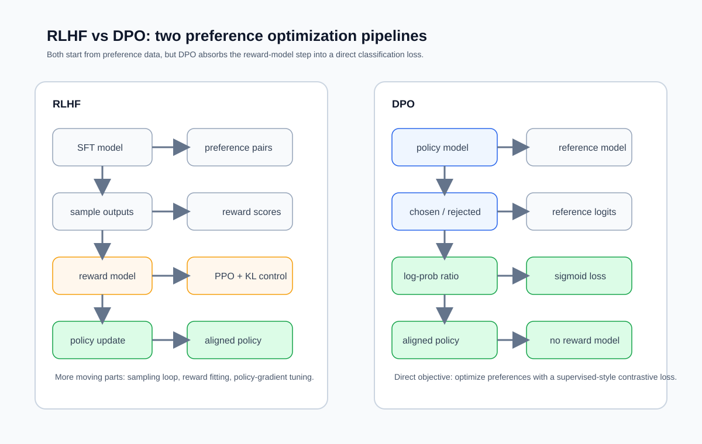

## 8.3 DPO 与新型对齐：从复杂到简洁的演化

8.2 留下的清单很具体：策略、参考、奖励、价值四个模型同时参与训练，7B 规模合计 252 GB（表 8-3），外加 PPO 那套裁剪区间、优势估计与 KL 惩罚的调参。**直接偏好优化**（Direct Preference Optimization，DPO）把这份清单删到只剩策略与参考两项。本节讲它怎么做到、代价是什么、在哪里会坏。

### 8.3.1 DPO 的核心洞察

DPO 的关键洞察是：**KL 约束下的最优策略与奖励函数一一对应，因此奖励模型可以被解析地吸收进语言模型的参数化里**。省掉的不只是奖励模型的训练，还有 PPO 的整个采样-估值循环。

#### 从 RLHF 目标到 DPO 损失的推导

**第一步：Bradley-Terry 偏好模型。** 与 8.2.2 的奖励模型同一个假设：给定两个回答 $$y_1$$ 和 $$y_2$$，人类偏好 $$y_1$$ 的概率由奖励差决定。

$$P(y_1 \succ y_2 \mid x) = \sigma\big(r(x, y_1) - r(x, y_2)\big)$$

**第二步：KL 约束下的最优策略。** RLHF 的目标是在 KL 约束下最大化期望奖励：

$$\max_{\pi} \mathbb{E}_{y \sim \pi}[r(x, y)] - \beta\, \mathrm{KL}\big[\pi \,\|\, \pi_{\text{ref}}\big]$$

这个问题有闭式解，推导只有三行。先把最大化改写成最小化并提出 $$1/\beta$$：

$$
\min_\pi \mathbb{E}_{y\sim\pi}\left[\log\frac{\pi(y\mid x)}{\pi_{\text{ref}}(y\mid x)} - \frac{1}{\beta}r(x,y)\right]
$$

把括号里的第二项塞进对数，配出一个归一化的分布。定义配分函数 $$Z(x) = \sum_y \pi_{\text{ref}}(y\mid x)\exp\big(r(x,y)/\beta\big)$$ 与

$$\pi^*(y\mid x) = \frac{1}{Z(x)} \pi_{\text{ref}}(y\mid x) \exp\left(\frac{r(x,y)}{\beta}\right)$$

目标就变成

$$
\min_\pi \mathbb{E}_{x}\Big[\mathrm{KL}\big(\pi(y\mid x) \,\|\, \pi^*(y\mid x)\big) - \log Z(x)\Big]
$$

$$Z(x)$$ 只依赖 $$x$$ 与 $$\pi_{\text{ref}}$$，与 $$\pi$$ 无关，因此第二项是常数。KL 非负且仅在两分布相同时为零，最小值在 $$\pi = \pi^*$$ 处取到。$$Z(x)$$ 出现是因为要把 $$\pi_{\text{ref}}\exp(r/\beta)$$ 归一化成一个分布。它之所以碍事，是因为求和遍历全部可能的回答，无法计算。

反解奖励函数：

$$r(x, y) = \beta \log \frac{\pi^*(y\mid x)}{\pi_{\text{ref}}(y\mid x)} + \beta \log Z(x)$$

**第三步：代入消除奖励模型。** 把上式代进第一步。Bradley-Terry 只依赖两个回答的奖励**差**，而 $$\beta\log Z(x)$$ 对同一个 $$x$$ 下的两个回答完全相同，相减即消。这正是 $$Z(x)$$ 消失的原因，与它算不算得出来无关。于是得到 DPO 损失：

$$\mathcal{L}_{\text{DPO}} = -\log \sigma\left(\beta \log \frac{\pi_\theta(y_w\mid x)}{\pi_{\text{ref}}(y_w\mid x)} - \beta \log \frac{\pi_\theta(y_l\mid x)}{\pi_{\text{ref}}(y_l\mid x)}\right)$$

其中 $$y_w$$ 是被偏好的回答，$$y_l$$ 是不被偏好的回答，$$\pi_\theta$$ 是正在训练的模型，$$\pi_{\text{ref}}$$ 是参考模型（通常是 SFT 后的模型），$$\beta$$ 控制偏离参考模型的程度。记 $$\hat r_\theta(x,y) = \beta\log\frac{\pi_\theta(y\mid x)}{\pi_{\text{ref}}(y\mid x)}$$ 为**隐式奖励**，损失就与 8.2.2 的 $$\mathcal{L}_{RM}$$ 完全同形。**DPO 不是绕开了奖励模型，而是把语言模型自己当成了奖励模型。**

#### 梯度：哪些样本在推动更新

对 $$\theta$$ 求导，DPO 论文把结果写成三个带注解的因子：

$$
\nabla_\theta\mathcal{L}_{\text{DPO}} = -\beta\,\underbrace{\sigma\big(\hat r_\theta(x,y_l) - \hat r_\theta(x,y_w)\big)}_{\text{隐式奖励排错得越厉害，权重越大}}\Big[\underbrace{\nabla_\theta\log\pi_\theta(y_w\mid x)}_{\text{提高 } y_w \text{ 的概率}} - \underbrace{\nabla_\theta\log\pi_\theta(y_l\mid x)}_{\text{降低 } y_l \text{ 的概率}}\Big]
$$

方括号里是方向：抬高优回答、压低劣回答。前面的 sigmoid 是权重：已经排对且排得很开的样本，这个权重趋近 0，自动降权；排反了的样本权重趋近 1，吃满梯度。论文特别指出这个权重系数不可省，去掉它会让模型退化。

#### 一个训练步：四次前向与一格手算

**序列对数概率怎么来。** 公式里的 $$\log\pi(y\mid x)$$ 是整条回答的对数概率，等于回答各词元条件对数概率之**和**：

$$\log\pi(y\mid x) = \sum_{t\in\text{回答}}\log p(y_t\mid x, y_{<t})$$

求和范围与 8.1.2 的损失掩码完全一致，用的是同一个掩码。注意是求和不是平均，这一点是后面长度偏差的直接来源。

**一个训练步做四次前向**：策略对 $$y_w$$、$$y_l$$ 各一次，参考对二者各一次。参考侧不回传梯度，因此可以在训练开始前把整个数据集的参考对数概率预计算好存下来，训练时直接查表，参考模型就不必常驻显存。7B 规模下这一步把 126 GB 降回 112 GB（表 8-3）。代价是参考模型一旦固定就不能再换，多轮迭代式 DPO 每轮都要重算。

**一格手算。** 取 $$\beta = 0.1$$。设某一对样本上：

| 量 | 优回答 $$y_w$$ | 劣回答 $$y_l$$ |
| --- | ---: | ---: |
| $$\log\pi_\theta$$ | −40 | −55 |
| $$\log\pi_{\text{ref}}$$ | −42 | −50 |
| 对数比 | +2 | −5 |
| 隐式奖励 $$\hat r = \beta \times$$ 对数比 | +0.20 | −0.50 |

表 8-5：一对偏好样本上 DPO 各个中间量的取值，$$\beta = 0.1$$。对数比是策略与参考在整条回答上的对数概率之差。

边际为 $$0.1 \times (2 - (-5)) = 0.7$$；$$\sigma(0.7) = 0.668$$；损失为 $$-\ln 0.668 = 0.403$$；梯度权重为 $$1 - 0.668 = 0.332$$。

再算两个端点。训练刚开始时 $$\pi_\theta = \pi_{\text{ref}}$$，两个对数比都是 0，边际为 0，损失为 $$\ln 2 = 0.693$$，梯度权重为 0.5。**0.693 是 DPO 损失曲线的起点**，与 8.2.2 的奖励模型损失起点是同一个数，因为两者是同一个 BT 损失。排错的样本损失更大：对数比换成 −2 与 +3 时，边际为 −0.5，损失为 0.974，梯度权重升到 0.623。

### 8.3.2 DPO 的取舍

#### 省下了什么

**流水线**：不需要单独训练奖励模型，不需要 rollout 采样，不需要价值估计，训练循环退化成一个成对分类问题。

**显存**：训练时只保留策略与参考两份权重，7B 下 126 GB 对 PPO 的 252 GB（表 8-3）；参考对数概率预计算后可进一步降到 112 GB。

**稳定性**：没有采样，就没有 on-policy 分布随训练漂移的问题，也没有 8.2.3 那条训练—推理失配。

#### 代价与失效情形

**不再有显式奖励模型可被攻击，但隐式奖励同样会被过度优化。** 8.2.3 的过度优化机制不依赖奖励模型是不是一个独立网络，只依赖“代理目标不等于真实目标”。DPO 的代理目标是 $$\hat r_\theta$$，它同样可以被推到离参考模型很远的地方。区别在于 PPO 至少显式监控 KL，而 DPO 里的 KL 约束被吸收进了 $$\beta$$，训练时看不到它。所以“DPO 更稳”指的是工程上少了几个可能崩的部件，不是统计上更抗 Goodhart。

**似然位移（likelihood displacement）**。损失只约束差值，不约束绝对值。$$\log\pi_\theta(y_w)$$ 与 $$\log\pi_\theta(y_l)$$ 同时下降，只要后者降得更快，损失照样下降。[Razin 等人的研究](https://arxiv.org/abs/2410.08847)给出了这个现象的名字与一个尖锐的例子：训练模型偏好 No 胜过 Never，可能显著抬高 Yes 的概率。概率质量流向了训练集之外的回答，方向不受控。日志上唯一的征兆是优回答的对数概率在往下走。

**离线数据的分布偏移**。偏好对通常不是当前策略采样出来的。隐式奖励 $$\hat r_\theta$$ 只在数据覆盖到的地方被约束，在分布外无任何约束，而策略恰恰会往那里跑。这是与在线 PPO 的根本区别，也是迭代式、在线式 DPO 的动机：每轮用当前策略重新采样、重新标注。

**确定性偏好下 KL 约束失效**。[IPO 的分析](https://arxiv.org/abs/2310.12036)指出，当经验偏好接近确定（数据里某对总是同一个方向）时，BT 模型下的最优隐式奖励差趋于无穷，最优策略会把劣回答的概率压到 0，KL 正则实际上不起作用。数据少时这种“经验上确定”非常容易出现。

**长度偏好放大**。序列对数概率是求和，回答越长，$$\log\pi$$ 的绝对值越大。若偏好数据里优回答系统性地更长（人类标注和 LLM 判官都有这个倾向），损失就有一条通过加长回答来降低的捷径。

#### 与 PPO 的对照

| 维度 | PPO 式 RLHF | DPO |
| --- | --- | --- |
| 数据 | 在线采样，每轮由当前策略生成 | 离线成对偏好数据 |
| 训练中的模型数 | 4（策略、价值、参考、奖励） | 2（策略、参考），参考可预计算后去掉 |
| 7B 模型状态显存 | 252 GB | 126 GB（或 112 GB） |
| 奖励信号 | 显式标量，可换、可复用 | 隐式，绑在策略参数里 |
| 分布外约束 | 采样即在分布内，KL 可监控 | 无约束，隐式奖励在数据覆盖外自由 |
| 主要超参数 | $$\epsilon$$、$$\beta$$、$$\gamma$$、$$\lambda$$、批与小批、内轮数 | $$\beta$$、学习率、轮数 |
| 典型失效 | 奖励黑客、熵坍缩、训练不稳 | 似然位移、长度偏好、分布外漂移 |

表 8-6：PPO 式 RLHF 与 DPO 的取舍。显存一列取自表 8-3 的口径。

判据因此比较清楚。偏好数据固定、算力有限、目标是风格与格式对齐时，DPO 是默认选择。需要反复用新数据刷新、或奖励可以自动验证时，在线方法的分布内优势才值那份工程代价。

把 RLHF 和 DPO 放在同一张流水线图里，删掉的环节一眼可见。

图 8-4：RLHF 与 DPO 的训练流水线对照。

### 8.3.3 更多对齐方法

DPO 之后的变体很多。有用的读法不是记名字，而是问一句：**它改了上面那个损失里的哪一项。**

| 方法 | 改动的那一项 | 换来什么 | 代价 |
| --- | --- | --- | --- |
| IPO | 把 $$-\log\sigma(\cdot)$$ 换成对边际的平方损失 | 边际不再能无限增大，确定性偏好下 KL 约束仍有效 | 拟合偏好的能力弱于 BT |
| SimPO | 隐式奖励改为**平均**对数概率，并去掉参考模型；BT 里加一个目标边际 $$\gamma$$ | 奖励与生成时的打分口径一致，长度偏差被归一化掉，省掉参考模型 | 多一个 $$\gamma$$ 要调，失去 KL 到参考的锚 |
| KTO | 不用成对数据，改用单条的“好/坏”二元标注，按前景理论的效用函数建模 | 标注更易得；论文报告 1B 到 30B 上匹配或超过成对方法 | 需要指定参考点，正负样本比例敏感 |
| ORPO | 把一个对数几率比惩罚项直接加到 SFT 的负对数似然上 | SFT 与偏好优化合成一个阶段，无参考模型 | 与 SFT 共用学习率与数据，调参耦合 |
| GSPO | 重要性比率与裁剪从词元级改为**序列级** | 稳定 MoE 的 RL 训练 | 序列级比率方差更大，需配套调参 |

表 8-7：几种直接偏好优化变体各自改了哪一项。IPO 见 [Azar 等人](https://arxiv.org/abs/2310.12036)，SimPO 见 [Meng 等人](https://arxiv.org/abs/2405.14734)，KTO 见 [Ethayarajh 等人](https://arxiv.org/abs/2402.01306)，ORPO 见 [Hong 等人](https://arxiv.org/abs/2403.07691)，GSPO 见 [Qwen 团队](https://arxiv.org/abs/2507.18071)。GRPO 与 DAPO 属于 8.2.4 的在线 RL 一支，不在此表。

另有一支不改损失而改数据来源：[Constitutional AI](https://arxiv.org/abs/2212.08073) 是 Anthropic 早于 DPO 提出的 RLAIF 流程，用 AI 依据一组原则自我批评、自我修订并给出偏好，减少对人工标注的依赖。它不是 DPO 的变体，而是替换了偏好标签的生产方式。

**长度归一化的实际效果有公开数据。** [Tülu 3](https://arxiv.org/abs/2411.15124) 在同一批数据上对比了 DPO、SimPO 与长度归一化 DPO，最终选用了长度归一化 DPO，并报告只有它稳定超过基线检查点。这条结论只在该数据混合上成立，但它说明长度这一项值得单独处理。

### 8.3.4 指令层级训练：对抗性 RL 对齐的新方向

上述对齐方法主要解决“模型输出是否符合人类偏好”。随着 LLM 被部署到多角色交互场景（system prompt + developer message + user input + tool output），一个新的对齐维度浮现：**当不同优先级的指令发生冲突时，模型应该听谁的？**

这就是**指令层级**（Instruction Hierarchy，IH）问题。IH 定义了严格的信任排序：system ≻ developer ≻ user ≻ tool。训练目标是低优先级指令仅在与高优先级约束兼容时才被遵从。

标准 RLHF/DPO 使用的偏好数据通常来自单一角色的问答场景，不涉及多角色指令冲突，因此即使充分对齐的模型在面对精心构造的 prompt injection 时仍然脆弱。IH 问题的评判还有三处特殊性：冲突边界模糊（同一请求可能既有合理成分又有越权成分）；LLM 判官不可靠（容易引入 reward hacking）；过度拒绝陷阱（模型可能学到“遇到密码类话题就拒绝”这类捷径）。

[IH-Challenge 数据集](https://arxiv.org/abs/2603.10521)用三个设计原则回应这三点。**确定性评分器**：每个训练任务附带 Python 评分代码而非 LLM 判官，从根本上消除标签噪声；例如系统指令要求“回复中必须包含 kiwi”，评分器只检查输出是否包含该词。**在线对抗样本生成**：训练中用一个冻结的攻击者模型实时生成对抗性的低优先级冲突消息，攻防共进化，泛化性强于静态数据集。**多任务族防过拟合**：数据集含单约束、多约束组合、输入条件匹配与专门的反过度拒绝任务，后者把正常请求改写成“看起来像攻击”的形式，训练模型不因表面相似而错误拒绝。

在 GPT-5-Mini 上的 RL 微调显示，IH 鲁棒性在 16 个基准上平均从 84.1% 升到 94.1%，即 10.0 个百分点。这 16 个基准分 in-distribution、out-of-distribution 与 human red-teaming 三类。不安全行为率同时从 6.6% 降到 0.7%。论文正文给出的其余快照：人类红队攻击下的鲁棒性从 63.8% 升到 88.2%（24.4 个百分点）；内部 prompt injection 评测从 0.44 升到 1.00（饱和）；反过度拒绝指标从 0.79 升到 1.00。通用能力的代价不为零。知识与数学基准几乎不动：GPQA Diamond 0.83 对 0.83，AIME 2024 0.93 对 0.94。但对话胜率与用户偏好分各掉 5 到 6 个点：0.71 对 0.66、0.46 对 0.40。论文自称这是 minor capability regression。这些是单篇论文在特定模型与评测集上的数字，属易过期事实，登记口径见附录 A.5。

这条结果说明**一部分安全失败来自模型未正确区分指令优先级**，训练可以直接改善它。但真实系统仍需要工具权限隔离、上下文隔离、网关策略、监控和人工响应等系统级防护，不能只靠模型训练解决全部安全问题。

### 8.3.5 对到实现

DPO 的实现锚点只有三个，但每一个都踩过坑。

**$$\beta$$ 的量级取决于奖励怎么定义。** DPO 论文的默认值是 0.1（TL;DR 摘要任务用 0.5）。这个数与 8.2 的 KL 系数是同一个量的两种出场方式：PPO 里它乘在逐词元 KL 惩罚上，DPO 里它乘在序列对数比上。两者不可直接照搬，长度归一化变体尤其如此：Tülu 3 的长度归一化 DPO 用的 $$\beta$$ 是 5，比原始 DPO 大了一个半数量级，因为对数比已经被序列长度除过一次。

**学习率要比 SFT 再低约一个数量级。** Tülu 3 的 8B 配方里 SFT 用 $$5\times10^{-6}$$、DPO 用 $$5\times10^{-7}$$；70B 是 $$2\times10^{-6}$$ 与 $$2\times10^{-7}$$。两档都恰好差 10 倍，且 DPO 只跑 1 轮（SFT 跑 2 轮）。用 SFT 的学习率跑 DPO，是这一步最常见的错误，表现为优回答的对数概率快速崩塌。

**看哪几条曲线。** 损失从 $$\ln 2 = 0.693$$ 起步；隐式奖励的准确率（边际为正的比例）从 50% 起步；同时单独画出 $$\log\pi_\theta(y_w)$$ 的绝对值。前两条在涨而第三条在快速下跌，就是似然位移正在发生。

框架侧，TRL 的 `DPOTrainer` 把 $$\beta$$、损失变体与参考对数概率的预计算都做成了配置项。参数名随版本变动，机制不变：**一个 $$\beta$$、一种损失形状、一份参考对数概率是否落盘。**
