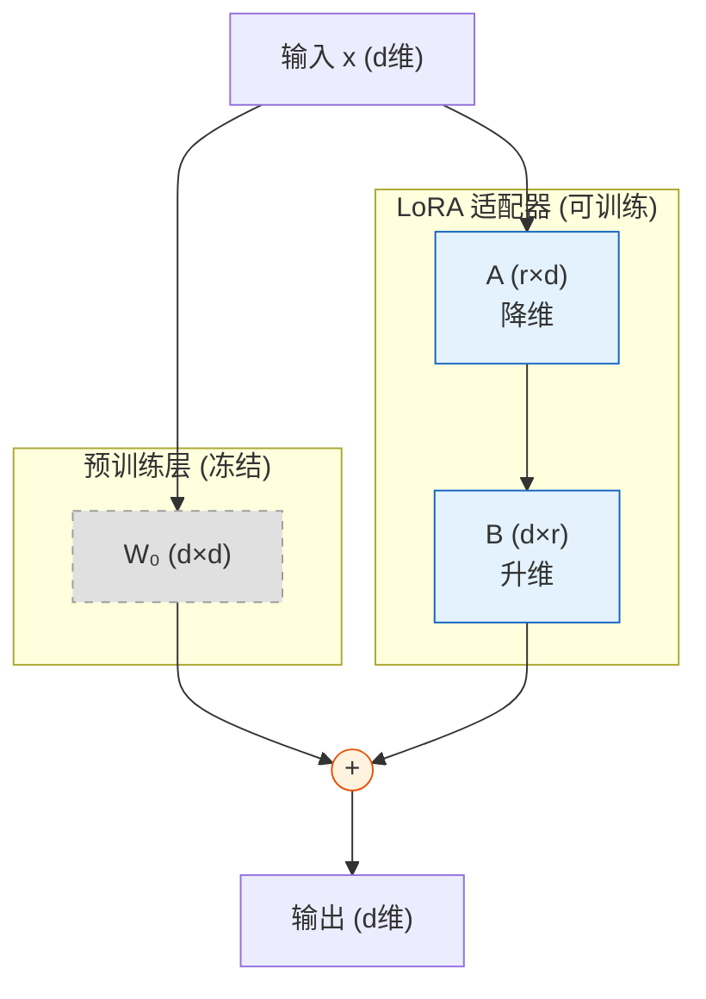

## 8.4 参数高效微调：为什么不必更新所有参数

全参数微调需要更新模型的所有参数，对于数十亿甚至数千亿参数的模型，这需要巨大的计算和显存资源。**参数高效微调**（Parameter-Efficient Fine-Tuning，PEFT）方法只训练极少量的参数，却能达到接近全参数微调的效果。本节介绍以 LoRA 为核心的 PEFT 技术，以及近年的重要变体和发展趋势。关于微调与对齐的更广泛讨论，可参见[第八章](../08_alignment/8.1_sft.md)。

### 8.4.1 LoRA：低秩适配

**LoRA**（Low-Rank Adaptation）是最广泛使用的 PEFT 方法。其核心假设是：**微调过程中的权重变化矩阵 $\Delta W$ 是低秩的**——即可以分解为两个小矩阵的乘积。

对于一个预训练权重 $W_0 \in \mathbb{R}^{d \times d}$，LoRA 将其修改为：

$$W = W_0 + \Delta W = W_0 + BA$$

其中 $B \in \mathbb{R}^{d \times r}$，$A \in \mathbb{R}^{r \times d}$，$r \ll d$ 是秩（通常 $r = 4, 8, 16$）。训练时**冻结 $W_0$，只训练 $A$ 和 $B$**，参数量从 $d^2$ 降至 $2 \times d \times r$，减少了数百倍。

下图直观地展示了 LoRA 在原始预训练权重旁路注入可训练低秩矩阵的结构：

*图 8-2：LoRA（低秩自适应）的权重旁路注入机制*

LoRA 的有效性源于一个实验观察：**大模型的微调本质上在一个低维子空间中进行**——完整的参数更新矩阵通常可以用少数几个主成分很好地近似。LoRA 直接在这个低维子空间中学习，避免了在高维空间中不必要的优化。

#### 秩的选择

秩 $r$ 是 LoRA 最重要的超参数，其选择直接影响效果和参数量的权衡：

- **$r = 4$**：适合简单的领域适配或风格调整，参数极少
- **$r = 8 \sim 16$**：最常用的配置，适合大多数指令微调场景
- **$r = 32 \sim 64$**：适合复杂任务或需要大幅调整模型行为的场景

经验法则是：**从较小的秩开始试验，逐步增大直到性能不再显著提升。** 实验表明，对于大多数任务，$r = 16$ 已能达到接近全参数微调 95% 以上的效果。

#### 应用层的选择

LoRA 可以应用在 Transformer 的不同权重矩阵上。实践中的发现：

- **注意力投影**（$W_Q, W_K, W_V, W_O$）：最常见的应用位置，效果稳定
- **FFN 层**（$W_{\text{up}}, W_{\text{down}}, W_{\text{gate}}$）：对于需要注入新知识的任务（如领域适配），同时在 FFN 层应用 LoRA 效果更好
- **全层应用**：同时在注意力和 FFN 层都应用 LoRA，能获得最接近全参数微调的效果，但可训练参数数也更多

原始 LoRA 论文建议主要应用在 $W_Q$ 和 $W_V$ 上，但后续研究发现**在所有线性层上都应用（秩更低）通常优于在少数层上应用（秩更高），即使总参数量相同**。

### 8.4.2 LoRA 的重要变体

LoRA 的成功催生了一系列改进变体，针对不同的局限进行优化。

**DoRA**（Weight-Decomposed Low-Rank Adaptation，2024）将权重矩阵分解为**方向**（direction）和**幅度**（magnitude）两个组成部分，然后仅对方向分量进行 LoRA 式的低秩适配。这种分解受到权重归一化（Weight Normalization）的启发——全参数微调主要改变权重的方向而非幅度，DoRA 通过显式分离这两者来更精确地模拟全参数微调的行为。在多个 benchmark 上，DoRA 以相同的可训练参数量超过了标准 LoRA 的效果。

**LoRA+**（2024）发现 LoRA 中矩阵 $A$ 和 $B$ 使用相同的学习率并非最优。由于 $B$ 初始化为零，$A$ 初始化为随机值，两者在训练动态上有本质差异。LoRA+ 为 $A$ 和 $B$ 设置独立的学习率（通常 $B$ 的学习率是 $A$ 的数倍），在不增加任何参数的情况下提升了微调效果。

**rsLoRA** 引入了秩依赖的缩放因子 $1/\sqrt{r}$，解决了标准 LoRA 在增大秩时性能反而下降的问题。这使得用户可以更自由地选择较大的秩，而不必担心训练不稳定。

### 8.4.3 QLoRA 与量化微调

**QLoRA** 在 LoRA 的基础上将冻结的基础模型量化到 4 位精度（使用 NF4——一种信息论最优的 4 位数据类型），进一步减少显存占用。QLoRA 的关键创新在于证明了 **4 位量化的基础模型 + LoRA 微调的效果与 16 位基础模型 + LoRA 微调几乎无差异**。这使得在单张 24GB 消费级 GPU（如 RTX 4090）上微调 65B 参数的模型成为可能。

量化微调的技术生态在 2024-2025 年间持续发展：AWQ（Activation-aware Weight Quantization）与 LoRA 的结合、GGUF 格式的量化模型微调等方案不断涌现，进一步降低了微调的硬件门槛。

### 8.4.4 其他 PEFT 方法

除 LoRA 系列外，还有多种 PEFT 方法各有特色：

- **Adapter**：在每层的注意力和 FFN 之后，插入小型瓶颈模块（降维 → 非线性 → 升维），只训练这些插入的模块
- **Prefix Tuning**：在每层的注意力中添加可学习的前缀向量，为模型提供可训练的“软提示”
- **IA3**（Infused Adapter by Inhibiting and Amplifying Inner Activations）：通过可学习的缩放向量调整激活值，参数量比 LoRA 更少

### 8.4.5 LoRA 的生产实践

在生产环境中，LoRA 不仅是一种训练技术，更是一种**模型管理范式**。

**LoRA 合并**（Merge）：训练完成后，可以将 LoRA 权重合并回基础模型（$W = W_0 + BA$），得到一个标准的模型文件，推理时无额外开销。这种“训练时解耦，部署时合并”的模式兼顾了灵活性和推理效率。

**多 LoRA 服务**（Multi-LoRA Serving）：推理引擎（如 vLLM、LoRAX）支持在同一个基础模型上动态加载和切换多个 LoRA adapter。这使得一个基础模型可以同时服务多个定制化场景（如不同行业的客服、不同风格的写作助手），每个 adapter 仅占用数十 MB 的额外显存。

**LoRA 堆叠与组合**：多个 LoRA 可以混合使用——例如，一个负责领域知识注入，另一个负责输出风格调整。通过加权组合不同 LoRA 的输出，可以灵活地调配模型行为。

### 8.4.6 PEFT 的实际影响与趋势

PEFT 方法极大地降低了大模型微调的门槛：

| 方法 | 可训练参数占比 | 显存需求 | 效果 |
|------|-------------|---------|------|
| 全参数微调 | 100% | 极高 | 最优 |
| LoRA (r=16) | ~0.1% | 低 | 接近全参数 |
| DoRA (r=16) | ~0.1% | 低 | 略优于 LoRA |
| QLoRA | ~0.1% | 极低 | 接近 LoRA |

表 8-1：不同微调方法的对比

PEFT 使得学术研究者和中小企业也能针对特定领域定制大语言模型，推动了整个生态的繁荣。以 QLoRA 为例，一块消费级 GPU 加上几小时的微调时间，就足以生产出在特定领域（如医疗问答、法律咨询、代码生成）上表现优异的定制模型。

值得注意的是，2025 年以来也出现了一股**回归全参数微调**的趋势：对于有充足计算资源的团队，全参数微调（特别是持续预训练）在新知识注入、复杂推理能力提升等场景中展现了 PEFT 难以企及的效果上限。这并不否定 PEFT 的价值——在资源受限的场景中，PEFT 仍然是最实用的选择；但对于追求最佳效果的前沿模型训练，全参数微调依然不可替代。
