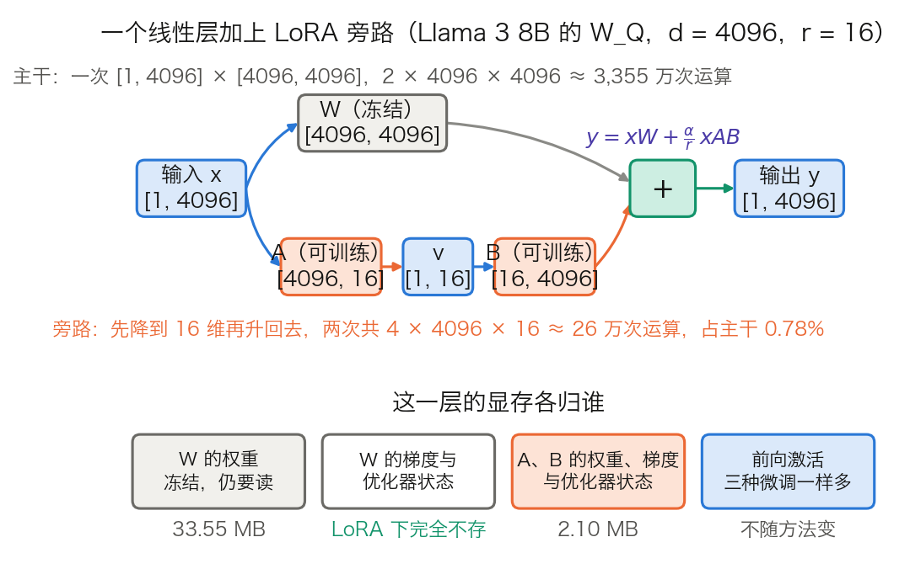

## 8.4 参数高效微调：为什么不必更新所有参数

8.1 到 8.3 换的一直是**训练目标**：从下一个词元的预测损失，到奖励模型给出的分数，再到偏好数据上的对数概率比。本节换的是另一个维度：训练目标照旧，只问**哪些参数值得更新**。

**参数高效微调**（Parameter-Efficient Fine-Tuning，PEFT）只训练极少量参数，却能达到接近全参数微调的效果。本节先把 LoRA 的形状、参数量与显存账算清楚，再讲变体、量化微调与生产实践。

### 8.4.1 LoRA：低秩适配

**LoRA**（Low-Rank Adaptation）是最广泛使用的 PEFT 方法。其核心假设是：微调过程中的权重变化矩阵 $$\Delta W$$ 是低秩的，可以分解为两个小矩阵的乘积。

对于一个预训练权重 $$W_0 \in \mathbb{R}^{d_{in} \times d_{out}}$$，LoRA 把它改写为：

$$W = W_0 + \Delta W = W_0 + \frac{\alpha}{r}AB$$

其中 $$A \in \mathbb{R}^{d_{in} \times r}$$，$$B \in \mathbb{R}^{r \times d_{out}}$$，$$r \ll \min(d_{in}, d_{out})$$ 是秩，$$\alpha$$ 是缩放系数。训练时冻结 $$W_0$$，只训练 $$A$$ 和 $$B$$，可训练参数量从 $$d_{in}d_{out}$$ 降到 $$r(d_{in} + d_{out})$$。

形状按本书一贯的“输入 × 输出”口径写（见 3.8.6 的表 3-25），激活从左边乘进来：$$xW$$。LoRA 原论文按“输出 × 输入”存放权重，同一件事写作 $$\Delta W = BA$$，两种写法互为转置，参数量相同。混用两套口径是读 LoRA 代码时最常见的卡壳点。

这里不写成 $$W_0 \in \mathbb{R}^{d\times d}$$，是因为方阵只对普通多头注意力的投影成立。Llama 3 8B 用 GQA，`W_K`、`W_V` 是 `[4096, 1024]`；FFN 的三个矩阵一边是 4,096、一边是 14,336（见 3.8.6 的表 3-24）。参数量公式必须写成 $$r(d_{in} + d_{out})$$ 才对得上。

#### 算一遍：方阵情形

先取最简单的一格。$$d = 4096$$、$$r = 8$$ 的方阵：

- 可训练参数：$$2 \times 4096 \times 8 = 65{,}536$$，约 6.5 万。
- 原矩阵：$$4096 \times 4096 = 16{,}777{,}216$$，约 1,678 万。
- 占比：$$65{,}536 / 16{,}777{,}216 = 0.39\%$$。

压缩倍数是 $$d/(2r)$$：$$r=8$$ 是 256 倍，$$r=16$$ 是 128 倍，$$r=64$$ 只有 32 倍。所以“减少数百倍”只在 $$r \le 8$$ 时成立，常用的 $$r=16$$ 已经掉到百倍出头。

#### 算一遍：Llama 3 8B 上的真实形状

沿用 3.8 节表 3-24 的 Llama 3 8B 配置：`d_model = 4096`，K/V 宽度 1,024，MLP 中间层 14,336，32 层。一层里有七个线性投影，它们的 $$d_{in} + d_{out}$$ 之和是

$$
2\times(4096{+}4096) + 2\times(4096{+}1024) + 3\times(4096{+}14336) = 81{,}920
$$

于是可训练参数量只随 $$r$$ 线性变化：

| 配置 | 每层 | 32 层合计 | 占 8.03B 基座 | BF16 下的适配器文件 |
| --- | ---: | ---: | ---: | ---: |
| $$r=16$$，全部七个线性层 | 1,310,720 | 41,943,040 | 0.52% | 83.9 MB |
| $$r=8$$，全部七个线性层 | 655,360 | 20,971,520 | 0.26% | 41.9 MB |
| $$r=8$$，只加 `W_Q`、`W_V` | 106,496 | 3,407,872 | 0.042% | 6.8 MB |

表 8-8：Llama 3 8B 上 LoRA 的可训练参数量。每层的数按 $$r \times 81{,}920$$（全部七个投影）或 $$r \times (8192 + 5120)$$（只加 `W_Q`、`W_V`）算出；基座参数量 8,030,261,248 与 [11.4 节](../11_serving/11.4_kv_memory_management.md)同口径。

第一行与第三行相差 12.3 倍。这两行的差距正是“可训练参数占比约 0.1%”这句常见说法的模糊之处：0.1% 量级对应的是只加 `W_Q`、`W_V` 的老配置，覆盖全部线性层时是 0.5% 量级。

#### 初始化与缩放

**初始化决定了起点。** LoRA 论文写明：$$A$$ 用随机高斯初始化，$$B$$ 初始化为零，因此训练开始时 $$\Delta W = AB = 0$$。模型从预训练行为精确出发，第一步不会跳变。反过来，如果两个矩阵都随机初始化，起点就是一个随机扰动。

**缩放系数 $$\alpha/r$$ 的作用是换秩时不必重调学习率。** 论文的说法是用 $$\alpha/r$$ 缩放 $$\Delta W x$$，$$\alpha$$ 是一个对 $$r$$ 而言的常数；用 Adam 优化时，调 $$\alpha$$ 与调学习率大致等价。实践中常固定 $$\alpha$$，只扫 $$r$$。

#### 为什么省显存：省的是梯度与优化器状态，不是激活

这是本节最容易算错的一笔。沿用 [7.1 节](../07_distributed_training/7.1_data_parallel.md)的口径，混合精度 Adam 下每个参数占 16 字节：BF16 参数 2、BF16 梯度 2、FP32 主权重 4、一阶矩与二阶矩各 4。冻结 $$W_0$$ 意味着后面 14 字节全部不存，只留 2 字节的 BF16 权重。

但反向传播仍然要穿过 $$W_0$$。计算对输入的梯度需要 $$W_0$$ 本身，计算 $$A$$ 的梯度需要这一层的输入激活。**所以激活必须照常保留，LoRA 一点也不省激活显存。** 图 8-5 把一层里的四份显存分开画出。

图 8-5：一个线性层加上 LoRA 旁路后的形状与显存去向（[生成脚本](https://github.com/yeasy/llm_internals/blob/main/tools/figures/ch08_lora_bypass.py)）。灰色是冻结权重，橙色是可训练权重，蓝色是数据。下半幅的两个数按 BF16 权重 2 字节、可训练参数 16 字节算出。

算总账（Llama 3 8B，不含激活）：

| 方法 | 基座 | 适配器 | 合计 |
| --- | ---: | ---: | ---: |
| 全参数微调 | $$8.03\times10^9 \times 16 = 128.5$$ GB | — | 128.5 GB |
| LoRA（$$r=16$$，全线性层） | BF16 冻结，16.1 GB | $$4.19\times10^7\times16 = 0.67$$ GB | 16.7 GB |
| QLoRA（NF4 + 双重量化） | $$8.03\times10^9 \times 4.127 / 8 = 4.14$$ GB | 0.67 GB | 4.8 GB |

表 8-9：三种微调方式的模型状态显存，Llama 3 8B，不含激活。嵌入层与 LM head 通常不量化，QLoRA 一行因此是下界。全参数与 QLoRA 相差 26.7 倍。

**三行的激活显存是同一个量级。** 序列一长，激活就会反超模型状态，此时能压下去的只有激活重计算（见 [7.5 节](../07_distributed_training/7.5_activation_checkpointing.md)）。把 LoRA 理解成“显存需求整体降到几十分之一”，是这一节最常见的误解。

#### 秩的选择

秩 $$r$$ 直接影响效果和参数量的权衡。常见取值是 4、8、16、32、64，经验法则是从较小的秩开始，逐步增大直到性能不再显著提升。

但这条经验有一个明确的反例。[QLoRA 论文](https://arxiv.org/abs/2305.14314)在 LLaMA 7B 上实测发现：最关键的超参是**一共用了多少个适配器、加在哪些层**，必须覆盖到所有线性层才追得平全参数微调；而投影维度 $$r$$ 本身对性能几乎没有影响。

这条“$$r$$ 不重要”与“从小秩起步逐步增大”并不矛盾，两者成立的条件不同。分界线正是 8.4.6 那条判据。任务是重新组织模型已有的能力时，秩很快就不再是瓶颈，QLoRA 实测的指令跟随正属这一类。任务是往里注入新领域内容时，秩才变成实实在在的容量上限。**选型时先定“加在哪些层”，再谈“秩取多少”。**

#### 应用层的选择

LoRA 可以加在 Transformer 的不同权重矩阵上。原始 LoRA 论文只研究注意力投影，明确说明“为简单和参数效率起见，本文只适配注意力权重、冻结 MLP 模块”，并把 MLP、LayerNorm 与偏置留给后续工作。后来的实测把结论推翻了一半：

- **注意力投影**（`W_Q`、`W_K`、`W_V`、`W_O`）：最早的配置，效果稳定但不足以追平全参数微调。
- **FFN 层**（`W_up`、`W_down`、`W_gate`）：承载事实的位置，注入领域内容时收益更大。
- **全部线性层**：QLoRA 的结论是只有这样才追得平全参数微调。

Thinking Machines 的 [LoRA Without Regret](https://thinkingmachines.ai/blog/lora/) 把这一条推得更远。在 Llama-3.1-8B 与 Qwen3-30B-A3B-Base 上，只加注意力显著不如只加 MLP，而且在只加 MLP 的基础上再加注意力没有额外收益。参数量对齐之后结论不变：注意力 $$r=256$$ 仍不如 MLP $$r=128$$。

### 8.4.2 LoRA 的重要变体

**DoRA**（Weight-Decomposed Low-Rank Adaptation）把权重矩阵 $$W$$ 分解为幅度 $$m$$ 和方向 $$\hat{W}$$ 两部分（$$W = m \cdot \hat{W}$$），对方向分量做 LoRA 式的低秩适配，同时把幅度 $$m$$ 也作为可训练参数。设计依据是一个观察：全参数微调中幅度与方向的更新彼此解耦，可以大改方向小改幅度或反之；而 LoRA 的两者近似成比例耦合。DoRA 通过显式分离这两者更精确地模拟全参数微调的行为，在多个基准上以相同的可训练参数量超过标准 LoRA。

**LoRA+** 指出 $$A$$ 和 $$B$$ 用同一个学习率并非最优。[论文的理论结果](https://arxiv.org/abs/2402.12354)是：要在大宽度下实现有效的特征学习，两者的学习率之比应随模型宽度 $$n$$ 线性增长，即 $$\eta_B/\eta_A = \Theta(n)$$。实践上固定一个比值、只调 $$\eta_A$$，把二维搜索降回一维。最优比值随模型与任务变化很大：论文报告 RoBERTa 在一种初始化下约 $$2^4$$、另一种初始化下约 $$2^2$$ 到 $$2^3$$，LLaMA 实验约 $$2^1$$ 到 $$2^2$$。**“$$B$$ 的学习率是 $$A$$ 的几倍”是个任务相关的经验值，不是常数。**

**rsLoRA** 把标准 LoRA 的 $$\alpha/r$$ 缩放换成 $$\alpha/\sqrt{r}$$。[论文的论证](https://arxiv.org/abs/2312.03732)是：只有 $$\gamma_r \in \Theta(1/\sqrt{r})$$ 才能在任意秩下保持梯度量级稳定；$$\alpha/r$$ 过于激进，秩增大时会造成**梯度坍缩**，学习被拖慢，于是大秩与小秩的表现看不出差别。要点在于大秩“没有收益”，而不是“性能反而下降”。论文还据此推测，LoRA 原文认为很低的秩（4、8、16）就够用，可能正是被这个缩放掩盖的。

### 8.4.3 QLoRA 与量化微调

**QLoRA** 在 LoRA 基础上把冻结的基座量化到 4 位，进一步压缩显存。它由三件事组成，每件都可以算账。

**第一件：NF4 数据类型。** 预训练权重近似零均值正态分布，于是可以用分位数量化：估计标准正态 $$N(0,1)$$ 的 $$2^k+1$$ 个分位点，取相邻分位点的中点作为 $$2^k$$ 个码值，再归一化到 $$[-1, 1]$$；权重按块内绝对最大值缩放进同一区间后查表。论文还做了一处不对称处理：负半轴取 $$2^{k-1}$$ 个、正半轴取 $$2^{k-1}+1$$ 个，合并后去掉重复的零，使零点能被精确表示。这就是 4-bit NormalFloat（NF4）。

**第二件：分块量化与双重量化的位宽账。** 4 位量化需要小块才准，块大小取 64，每块配一个 FP32 缩放常数。这笔开销是 $$32/64 = 0.5$$ 比特每参数，相对 4 比特的主体已经不小。**双重量化**把这些缩放常数再量化一次：用 FP8、块大小 256。开销降为

$$
\frac{8}{64} + \frac{32}{64\times 256} = 0.125 + 0.00195 = 0.127\ \text{比特/参数}
$$

省下 0.373 比特每参数，有效位宽 $$4 + 0.127 = 4.127$$ 比特。

**第三件：分页优化器。** 用 NVIDIA 统一内存承接梯度检查点在长序列小批次上造成的显存尖峰，避免 OOM。

这三件事合起来解释了论文摘要里那个数：65B 模型的基座是 $$65\times10^9 \times 4.127 / 8 = 33.5$$ GB，不用双重量化则是 36.6 GB。前者进得了 48 GB 单卡，后者加上适配器、激活与优化器状态就很勉强。**双重量化省下的 3.0 GB 不是锦上添花，而是决定了 65B 能不能落在一张卡上。**

**计算时并不用 4 位算。** 前向遇到一个 NF4 权重块，先按缩放常数反量化成 BF16，再做矩阵乘法。梯度只流向 $$A$$、$$B$$，不流向量化后的基座。所以 QLoRA 省的是权重的**存储**，不是计算精度，也不省激活。

**效果的成立条件要连着读。** 论文的结论是 NF4 加双重量化完全恢复了 16 位 LoRA 的 MMLU 表现，而 FP4 始终落后约 1 个百分点。这个结论同时要求适配器覆盖全部线性层。去掉任何一个条件，“4 位与 16 位无差异”都不再成立。

**LoRA 的学习率比全参数微调高约一个数量级。** 8.1 给出的印象是“微调用 $$10^{-6}$$ 到 $$10^{-5}$$”，那是全参数微调的量级。QLoRA 的公开配方对 7B 与 13B 用 $$2\times10^{-4}$$、对 33B 与 65B 用 $$1\times10^{-4}$$，并采用常数调度、$$r=64$$、$$\alpha=16$$、全部线性层。LoRA Without Regret 的学习率扫描给出了同一个比值：高秩 LoRA 的最优学习率约为全参数微调的 10 倍，并指出这与 *LoRA Learns Less and Forgets Less* 的图 S1 一致。原因在 $$B$$ 从零起步，且有效更新被 $$\alpha/r$$ 缩过一道。**用全参数微调的学习率跑 LoRA，是这一步最常见的错误。**

### 8.4.4 其他 PEFT 方法

除 LoRA 系列外还有几类方法。它们的关键区别不在参数量，而在**推理时能不能合并回权重**。

| 方法 | 改在哪里 | 可训练参数的量级 | 推理时能否合并 |
| --- | --- | --- | --- |
| LoRA | 线性层旁路加 $$AB$$ | $$r(d_{in}+d_{out})$$ 每个投影 | 能，合并后零开销 |
| Adapter | 每层注意力与 FFN 之后插入瓶颈模块（降维、非线性、升维） | 两个矩阵，宽度为瓶颈维 | 不能，中间有非线性，推理时多出串行模块 |
| Prefix Tuning | 每层注意力的 K、V 前面拼上可学习的前缀向量 | 前缀长度 × 层数 × K/V 宽度 | 不能，等价于永久占用一段上下文 |
| IA3 | 对 K、V 与 FFN 中间激活逐通道乘一个可学习缩放向量 | 每层三个向量 | 能，缩放可吸收进相邻权重 |

表 8-10：四类 PEFT 方法的改动位置与合并能力。Adapter 与 Prefix Tuning 不能合并，推理时分别多出串行模块与额外的注意力长度，这正是 LoRA 胜出的主要原因。

### 8.4.5 LoRA 的生产实践

在生产环境中，LoRA 不仅是一种训练技术，更是一种模型管理范式。

**合并**（Merge）：训练完成后把适配器合并回基座，$$W = W_0 + \frac{\alpha}{r}AB$$，得到一个标准模型文件，推理时无额外开销。对 BF16 基座，这个加法是精确的。对 NF4 基座则要作一次选择：合并后保留 BF16，就失去了量化带来的显存优势；重新量化回 NF4，则引入一次新的量化误差，且误差不会被任何训练步补偿。**QLoRA 训出来的适配器通常不合并回量化基座。**

**不合并时多出什么。** 不合并就不真正算出 $$AB$$（那是一个满尺寸矩阵，算它等于做了一次合并）。实际顺序是先降维再升维，中间只有 $$r$$ 列。以 Llama 3 8B 的 `W_Q`、$$r=16$$ 为例：

- 基座：`x[1, 4096] × W_Q[4096, 4096] → [1, 4096]`，$$2\times4096\times4096 = 33{,}554{,}432$$ 次运算
- 降维：`x[1, 4096] × A[4096, 16] → v[1, 16]`，131,072 次
- 升维：`v[1, 16] × B[16, 4096] → [1, 4096]`，131,072 次，再与基座结果逐格相加

两次小矩阵乘合计 262,144 次，占基座的 0.78%。计算开销可以忽略，真正的问题在批处理：不同请求用不同适配器时无法共用同一次大矩阵乘。

**多 LoRA 服务**：一个基座同时服务几十到几千个适配器，是推理侧的独立课题。适配器为什么不能合并、同一批里不同适配器怎样一起算、适配器显存怎样管理，见 [11.6 节](../11_serving/11.6_multi_lora_serving.md)，那里给出了完整的形状、FLOPs 与访存算例。

**堆叠与组合**：多个 LoRA 可以混合使用，例如一个负责领域知识注入、另一个负责输出风格调整。按权重组合它们的输出即可，但两个适配器各自训练时都假设基座是 $$W_0$$，叠加后的行为没有理论保证，需要实测。

### 8.4.6 PEFT 的实际影响与趋势

PEFT 把大模型微调的门槛拉低了一个到两个数量级（表 8-9）。学术研究者和中小企业也能针对特定领域定制大语言模型。以 QLoRA 为例，单张高显存消费级或工作站 GPU 加上较短时间的微调，就可能做出面向特定语料、风格或流程的领域原型。

但医疗问答、法律咨询、代码生成等高风险场景不能只凭微调成本判断“可用”：上线前必须补充数据授权、专家审查、领域评测、红队、安全边界、监控和回滚机制。**PEFT 降低的是实验和定制门槛，不等于自动获得生产级可靠性。**

#### 全参数微调与 LoRA 之争的两面

一种流行的说法是：资源充足的团队应当回到全参数微调，因为它在新知识注入与复杂推理上有更高的效果上限。另一种公开结论指向相反的方向。LoRA Without Regret 报告：在后训练常见的数据规模上，高秩 LoRA 与全参数微调的学习曲线几乎重合（损失随步数对数线性下降），低秩 LoRA 只在适配器容量被数据撑满后才掉队；而在强化学习上，即使 $$r=1$$ 也能完全追平全参数微调。

作者给出的解释与容量有关：监督学习每个片段提供的信息量是 $$O(\text{词元数})$$，而策略梯度只靠末尾的优势值，每个片段约 $$O(1)$$ 比特。当一个片段有上千个词元时，**RL 每个词元吸收的信息比监督学习少约三个数量级**，所需容量因此极低。这条论证解释了为什么 RL 后训练可以用很小的秩，也解释了为什么持续预训练这类大数据量场景 LoRA 会掉队。

两面并不矛盾，分界线是同一条：

LoRA 学的是一个秩为 $$r$$ 的低秩增量，它擅长**重新组织**模型已有的能力，而不是往里塞进新的事实。风格、语气、输出格式、任务范式的适配，本质上是在已有表示空间里换一个方向，低秩增量足够表达。注入一个模型在预训练中从未见过的知识体系则不同：要改动的是 FFN 里那些承载事实的权重（[3.4 节](../03_components/3.4_feedforward.md)把 FFN 称作“记忆层”正是这个道理），秩 $$r$$ 就成了实实在在的容量上限。

这也解释了 8.4.1 里那条经验为什么成立。需要注入新知识时把 LoRA 同时加到 FFN 层，是在同一个方法内部把适配位置挪到承载事实的地方，能缓解但不改变低秩这个根本约束。两条建议因此并不冲突：在 LoRA 内部，注入知识就往 FFN 上加；但如果注入知识本身是主要目标，就该重新考虑全参数微调或持续预训练。

无论选哪一种，微调都会在别处留下代价。下一节把这些代价一一测出来。
