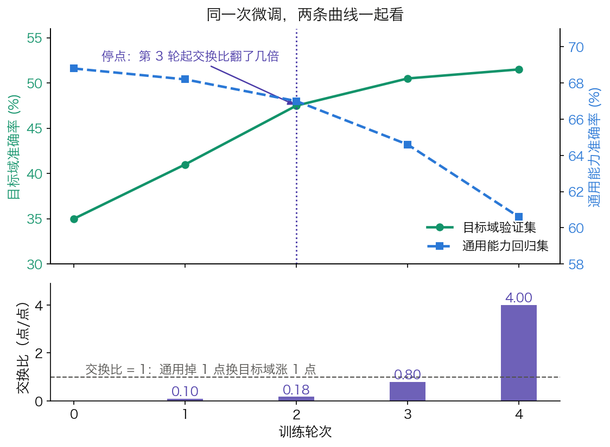

## 8.5 微调会怎么坏：四种失败模式与一条共同判据

前四节讲的都是“怎么做”：SFT 教格式、RLHF 与 DPO 教偏好、PEFT 省资源。这一节反过来问：这些做法各自会在哪里坏掉，而坏掉的征兆为什么看不见。8.2.3 与 8.2.4 已经把 RL 侧的病理拆得很细，本节只管另一半，即 SFT 与 PEFT 这条线上的失败。它们的共同特征是**训练损失曲线一路向下，问题却已经发生**。

### 8.5.1 灾难性遗忘：学得越好，忘得越多

[8.1.3 节](8.1_sft.md)从学习率的量级不对称推出了灾难性遗忘的机制：样本少了几个数量级，累积位移就容易从叠加变成覆盖。这里补上它被测量出来的形状。

#### 遗忘的标度律长什么样

[一项专门量化微调遗忘的研究](https://arxiv.org/abs/2401.05605)把“遗忘”定义为一个可测的量：拿基座模型自己的预测当标签，测微调后模型在 WikiText-103 上的交叉熵，记作 $$\mathcal{L}_{\text{f}}$$。这个定义绕开了“基准分数下降多少”这类口径问题。它也解释了论文的一个观察：某次微调前后 ARC 准确率只从 54.1% 掉到 52.0%，但微调后模型与基座在 32.8% 的题目上给出了不同答案。分数的稳定掩盖了行为的大幅漂移。

论文给出三条互相咬合的结论。**其一，用 LoRA 微调时，遗忘量与微调损失呈很强的反线性关系**：$$\mathcal{L}_{\text{f}} = -c\,\mathcal{L}_{\text{ft}} + s$$，OpenOrca 上 $$c \approx 1.7334$$、$$s \approx 2.0481$$，拟合优度 $$R^2 = 0.945$$。微调损失降得越低，遗忘越多。**其二，遗忘量随被微调的参数量 $$P$$ 与更新步数 $$N$$ 按平移幂律增长**：

$$
\mathcal{L}_{\text{f}}(P, N) = -c_{\text{ft}}c_{\text{f,ft}}\left[\Big(\frac{a_{\text{f}}}{P}\Big)^{\alpha_{\text{f}}} + \Big(\frac{b_{\text{f}}}{N}\Big)^{\beta_{\text{f}}}\right]^{\rho} + s_{\text{f,ft}} - c_{\text{f,ft}}s_{\text{ft}}
$$

**其三，早停或减少可训练参数都无法真正规避它**，因为这三个量被同一根杠杆绑在一起。

第二条可以代数验算。用论文表 1 里 OpenOrca 一列的系数（$$a_{\text{f}} = 3.88\times10^5$$、$$b_{\text{f}} = 23.64$$、$$c_{\text{ft}} = 0.0020$$、$$c_{\text{f,ft}} = 1.7334$$、$$s_{\text{ft}} = 0.6126$$、$$s_{\text{f,ft}} = 2.0481$$、$$\alpha_{\text{f}} = 0.0351$$、$$\beta_{\text{f}} = 0.1468$$、$$\rho = 7.6885$$），固定 $$P = 6.4\times10^8$$：

| 更新步数 $$N$$ | 60 | 120 | 240 | 480 |
| --- | ---: | ---: | ---: | ---: |
| $$\mathcal{L}_{\text{f}}$$ | 0.828 | 0.881 | 0.915 | 0.937 |

表 8-11：按遗忘标度律算出的遗忘量随步数的变化，系数取自论文表 1 的 OpenOrca 一列。步数增加到 8 倍（60 到 480），遗忘量只涨 13%，但一直在涨，没有平台期。

**幂律的实际含义是“没有安全区”**：曲线在对数坐标下是直线，不存在一个可以停在那里的拐点。同样固定 $$N = 120$$，把 $$P$$ 从 $$6.7\times10^7$$ 加到 $$6.4\times10^9$$（约两个数量级），遗忘量从 0.843 涨到 0.908。参数量的影响比步数更平缓，但同样不是开关。

第三条结论值得单独停一下，因为它推翻了一个很自然的期待。既然遗忘随步数增长，那少跑几步不就行了？论文的回答是不行：**减少步数确实减少遗忘，但同时也减少了学到的东西**，第一条的反线性关系正是说这两者绑在同一根杠杆上。所以“跑几个 epoch”不存在一个可以照抄的最佳值，它是一个**在目标域收益与通用能力损失之间取舍的位置**，只能靠测量来定。

同一项研究还顺手否掉了一个流行的误解：**PEFT 并不免疫遗忘**。LoRA 只是把可训练参数 $$P$$ 压小，而 $$P$$ 只是幂律里的一个自变量，不是开关。论文的外推实验印证了这一点：秩 2500 的 LoRA 有 62.5 亿可训练参数，与全模型微调的 64.8 亿接近，两者的微调与遗忘表现也几乎一样。

不过“压小”确实有效果，只是要连着代价一起读。另一项在编程与数学两个目标域上做的对照实验，论文标题本身就是结论：[*LoRA Learns Less and Forgets Less*](https://arxiv.org/abs/2405.09673)。在常规的低秩配置下，LoRA 的目标域表现明显不如全参数微调。但它对目标域之外能力的保持明显更好，缓解遗忘的效果甚至强于权重衰减、dropout 这类常规正则化手段，也更能维持生成的多样性。论文给出的解释与 [8.4.6 节](8.4_peft.md)那条判据同源，但把它量化了：**全参数微调学到的扰动，其秩比典型 LoRA 配置高出 10 到 100 倍**。学得少和忘得少，是同一个低秩约束的两面。

#### 被遗忘的首先是安全对齐

遗忘不只是能力问题。上面那项研究检查了遗忘对知识、推理以及 Llama 2 7B chat 里已训练好的安全护栏的影响：一次无关的领域微调，可能顺手削掉之前对齐进去的拒答行为。

这件事有专门的量化。[Qi 等人的红队研究](https://arxiv.org/abs/2310.03693)按风险分三级，其中第三级最值得注意：**用完全良性、纯功能导向的公开数据集微调，也会削弱安全对齐**。他们用 Alpaca、Dolly、LLaVA-Instruct 各跑一轮，Llama-2 侧用官方推荐的超参数（批大小 128、学习率 $$2\times10^{-5}$$）：

| 模型与数据 | 微调前有害率 | 微调后有害率 |
| --- | ---: | ---: |
| Llama-2-7b-Chat + Alpaca | 0.3% | 16.1% |
| Llama-2-7b-Chat + Dolly | 0.6% | 12.1% |
| Llama-2-7b-Chat + LLaVA-Instruct | 0% | 18.8% |
| GPT-3.5 Turbo + Alpaca | 5.5% | 31.8% |
| GPT-3.5 Turbo + Dolly | 4.5% | 23.9% |

表 8-12：良性数据微调一轮之后的有害率变化，取自该论文的表 3。有害率由论文自建的策略导向基准加 GPT-4 判官给出。三个数据集都不含任何有害内容，也没有任何对抗意图。

同一项研究的对照更说明问题：10 条对抗性样本就足以让 GPT-3.5 Turbo 基本越狱，代价不到 0.2 美元；而上表说明连对抗意图都不需要。论文给出的两种可能机制，一是对初始对齐的灾难性遗忘，二是有用性与无害性目标之间的固有张力。

**判据因此很直接**：任何一次微调的验收清单里都必须有安全拒答这一项，哪怕微调数据与安全毫无关系。这与 [8.4.6 节](8.4_peft.md)的结论同源：PEFT 降低的是成本，不是上线前该做的检查。

#### 起点也会影响结果

最后一条与直觉相反，它提醒“坏得多严重”不只取决于怎么微调，还取决于**从哪里开始**。一般人会假设基座预训练得越充分，微调出来的模型就越好；而 [catastrophic overtraining](https://arxiv.org/abs/2503.19206) 这项研究给出了反例：在 3T 词元上预训练的 OLMo-1B，经指令微调后在多个标准基准上反而比它 2.3T 词元的同门差了 2% 以上。论文给出的机制是，延长预训练会系统性地抬高参数对任何修改的敏感度，不限于微调。这条结论目前来自单篇研究、且实验以小模型为主，不宜外推成普适规律；但它足以说明一件事：微调的风险不是一个只由微调超参决定的量。

### 8.5.2 对齐税：把模型对齐好，别的能力会掉

遗忘的另一个观测面出现在对齐阶段，而且它有一个专门的名字。InstructGPT 论文在做完 RLHF 后观察到模型在 SQuAD、DROP、HellaSwag 与 WMT 2015 法英翻译等公开数据集上出现性能回退，并把它命名为“**对齐税**”（alignment tax）。按论文自己的措辞，这是“对齐流程以我们可能在意的某些任务上性能下降为代价”的一个例子（[InstructGPT 论文](https://arxiv.org/abs/2203.02155)）。

它的缓解方式反过来印证了 8.5.1 的机制。论文的做法是在 PPO 更新里混入提高预训练分布对数似然的更新，记作 **PPO-ptx**，目标函数是在 8.2.2 的基础上多加一项：

$$
\text{objective}(\phi) = \mathbb{E}_{(x,y)\sim D_{\pi^{RL}_\phi}}\Big[r_\theta(x,y) - \beta\log\frac{\pi^{RL}_\phi(y\mid x)}{\pi^{SFT}(y\mid x)}\Big] + \gamma\,\mathbb{E}_{x\sim D_{\text{pretrain}}}\big[\log\pi^{RL}_\phi(x)\big]
$$

$$\gamma = 0$$ 时退化为普通 PPO。论文的取值是 $$\beta = 0.02$$、$$\gamma = 27.8$$，并用的预训练样本数是 RL 片段数的 8 倍。$$\gamma$$ 这么大不是笔误：前一项是奖励的量级，后一项是对数似然的量级，两者要靠系数拉到可比。论文在 1.3B 模型上的消融显示 $$\gamma \ge 20$$ 时回退基本被修复，而标注者偏好评分并未因此受损；27.8 这一个值在 1.3B 到 175B 上都可用。

同一组消融还排除了一个直觉方案：**单纯调大 KL 系数修不好对齐税**。把 $$\beta$$ 提到 2.0（默认值的 100 倍）仍无法消除 DROP 和 SQuAD 上的回退，反而让验证奖励显著下跌。换句话说，问题不在“离参考模型太远”，而在“只在窄分布上做梯度更新”，解法只能是**把宽分布的数据重新拌回训练里**。这条思路对 SFT 同样成立，是实践中把通用语料掺进指令数据的理由。掺多少没有公认配方，InstructGPT 自己在 SFT 阶段混入了 10% 的预训练数据。

对齐税的管理含义很直接：**任何一次微调的验收，都不能只测想提升的那个能力。**

### 8.5.3 学到了风格，没学到能力

第三种失败最难被发现，因为它恰好能骗过最常用的那把尺子。

用更强模型的输出去微调较弱模型（Alpaca、Self-Instruct 一类做法）曾被寄予厚望。一项系统研究用 1.5B 到 13B 的基座、0.3M 到 150M 词元的模仿数据做了对照。结论是：模仿模型在指令跟随上看起来好得多，人类评分者认为它们的输出可与 ChatGPT 竞争；但在**模仿数据没有充分覆盖的任务上，它们与目标模型的差距几乎没有缩小**。论文点破了这种失败为什么难以察觉：模仿模型擅长的是模仿风格，而不是事实性，差距因此会从人类评分者眼皮底下溜过去（[*The False Promise of Imitating Proprietary LLMs*](https://arxiv.org/abs/2305.15717)）。

这对 [8.1.5 节](8.1_sft.md)的数据来源问题是一个直接约束：合成数据便宜、扩得快，但它天然只覆盖教师模型愿意展示的那部分行为分布。如果验收只看人类偏好对比，而这恰恰是 LIMA 那类结果所采用的评判方式，那么“风格像”与“能力到”这两件事在指标上是分不开的。区分它们需要换一把尺子，8.6 节讲的自动评测正是为此。

### 8.5.4 自己造出来的污染

预训练侧的污染已经讲过两笔：[5.4.8 节](../05_pretraining/5.4_data_scaling.md)给出近似重复怎样抬高评测成绩，[5.5.8 节](../05_pretraining/5.5_data_pipeline.md)给出“检测与防御是两件事”这条区分。微调阶段的污染有它自己的形态，而且更多是自伤：

- **用来挑模型的那个集合参与了训练。** 拿同一批数据既训又选，选出的检查点是在拟合噪声，不是在泛化。
- **蒸馏数据把评测题带了进来。** 教师模型见过的基准题，会以改写后的形式流进指令数据。
- **去污染手段本身不够。** 常用的 $$n$$-gram 与字符串匹配挡不住改写与翻译过的变体。[一项研究](https://arxiv.org/abs/2311.04850)显示，在改写后的 MMLU 测试集上训练的 Llama-2-13B 可以拿到 85.9 的 MMLU 准确率，而 $$n$$-gram 重叠检测不出任何异常。同一项研究把 LLM 判定式去污染工具用在公开语料上，发现 RedPajama-Data-1T 与 StarCoder-Data 这类预训练集里有 8% 到 18% 的 HumanEval 题目重叠。

污染的后果可以被直接测出来。研究者构造了一套与 GSM8k 同风格、同难度、且保证未进入任何训练数据的新题 GSM1k，在其上评测领先模型时观察到**最高 8% 的准确率下降**，并发现模型“生成出 GSM8k 原题的概率”与它在两个基准之间的分差呈正相关（Spearman $$r^2 = 0.36$$）。这里要连口径一起读：同一项研究也明确指出，许多模型、尤其是前沿模型几乎没有表现出过拟合迹象，而且所有模型都对未见过的新题展现了泛化能力（[GSM1k](https://arxiv.org/abs/2405.00332)）。所以这条证据支持的是“基准分数必须配污染检查才可信”，而不是“基准分数都是假的”。具体怎么查，见 [8.6.4 节](8.6_evaluation.md)。

### 8.5.5 共同判据：训练损失看不见上面任何一条

回头看这四种失败，它们有一个共同的性质：**没有一条会体现在训练损失曲线上**。遗忘掉的是训练集之外的能力，对齐税掉在别的数据集上，风格模仿在目标分布上拟合得很好，而污染让评测分数偏高而不是偏低。所以“loss 下降得很漂亮”对这四件事没有任何信息量。

要看见它们，至少需要把数据分成三份，而不是两份：

| 集合 | 回答什么问题 | 缺了它会怎样 |
| --- | --- | --- |
| 训练集 | 模型在拟合什么 | —— |
| 目标域验证集 | 想提升的能力提升了吗 | 分不清学会与背下 |
| 通用能力回归集 | 没想动的能力掉了多少 | 遗忘与对齐税全部不可见 |

表 8-13：微调至少需要的三份数据。第三份是最常被省略、也最不该省略的一份。

第三份必须在微调开始之前就固定下来，覆盖基座原本就会的那些事：常识问答、多步推理、代码，以及安全拒答（8.5.1 给出了最后一项不可省的理由）。

#### 回归集要多大

“回归集不需要很大”是一句要加条件的话。把它算一遍就清楚了。

**独立评测的情形。** 设回归集上的准确率在 0.7 附近，题数为 $$n$$。单次评测的标准误是 $$\sqrt{p(1-p)/n}$$，微调前后两次独立评测之差的标准误再乘 $$\sqrt{2}$$：

| 题数 $$n$$ | 单次标准误 | 差值的标准误 | 差值的 95% 区间 |
| ---: | ---: | ---: | ---: |
| 200 | 3.24 pp | 4.58 pp | ±8.98 pp |
| 500 | 2.05 pp | 2.90 pp | ±5.68 pp |
| 1,000 | 1.45 pp | 2.05 pp | ±4.02 pp |
| 4,200 | 0.71 pp | 1.00 pp | ±1.96 pp |

表 8-14：$$p = 0.7$$ 时不同题数下的评测噪声，pp 表示百分点。要把两次评测之差的标准误压到 1 个百分点，需要 $$n = 2 \times 0.7 \times 0.3 / 0.01^2 = 4{,}200$$ 题。

8.5.1 引的那项研究里，过训练基座带来的回退是 2 个百分点量级。按上表，500 题的回归集根本分辨不出这个量级的变化，**看到的“掉了 2 个点”与随机波动无法区分**。

**配对评测的情形。** 前后两次跑的是同一批题，逐题比对就能把大部分噪声消掉。设 500 题里有 40 题由对变错、20 题由错变对，净降 $$(40-20)/500 = 4$$ 个百分点。McNemar 检验量为

$$
\frac{(40 - 20)^2}{40 + 20} = \frac{400}{60} = 6.67 > 3.84
$$

在 0.05 水平上显著。配对下差值的标准误约为 $$\sqrt{b+c}/n = \sqrt{60}/500 = 1.55$$ 个百分点。按表 8-14 的公式反解，独立评测要达到同样的 1.55 pp 需要 $$n = 2\times0.7\times0.3/0.0155^2 \approx 1{,}750$$ 题。也就是说，500 题配对相当于约 1,750 题独立评测，是同样 500 题独立评测（2.90 pp）的近两倍精度。

所以那句话的完整版是：回归集不需要很大，前提是前后两次用同一批题、同一套提示模板、同一个解码设置，并按配对方式比较。任何一条不满足，就要按表 8-14 的量级重新估算题数。

#### 停在哪里：交换比

有了三份数据，8.5.1 那个“跑几个 epoch”的问题才有了可操作的答法：不是查一个推荐值，而是沿着训练过程同时画两条曲线，在两者的**交换比**变得不划算的地方停下。交换比定义为“回归集掉几个百分点，换来目标域涨一个百分点”。

图 8-6：同一次微调里两条曲线与每轮的交换比（[生成脚本](https://github.com/yeasy/llm_internals/blob/main/tools/figures/ch08_tradeoff_curves.py)）。数值为教学示意，不来自任何公开实验。

| 轮次 | 目标域 | 本轮增量 | 回归集 | 本轮增量 | 交换比 |
| ---: | ---: | ---: | ---: | ---: | ---: |
| 0 | 35.0 | — | 68.8 | — | — |
| 1 | 41.0 | +6.0 | 68.2 | −0.6 | 0.10 |
| 2 | 47.5 | +6.5 | 67.0 | −1.2 | 0.18 |
| 3 | 50.5 | +3.0 | 64.6 | −2.4 | 0.80 |
| 4 | 51.5 | +1.0 | 60.6 | −4.0 | 4.00 |

表 8-15：一组教学示意数据上的交换比。数值不来自任何公开实验，只用来演示算法：交换比 = 回归集本轮跌幅 ÷ 目标域本轮涨幅。

前两轮的交换比在 0.1 到 0.2 之间，很划算。第 3 轮跳到 0.80，第 4 轮到 4.00：目标域只再涨 1 个百分点，通用能力掉了 4 个。**停点在第 2 轮之后**，这与 8.1.6 两份公开配方都取 2 轮吻合。

要让这张表可信，每一格都必须满足配对评测的三个前提。这也把评测本身变成了一个需要单独讲清楚的题目：提示模板怎么固定、答案怎么抽取、分数怎么算才可比。这是 [8.6 节](8.6_evaluation.md)的内容。

这套判据本身并不新鲜，它就是把机器学习里“训练集、验证集、测试集”的老规矩放回一个容易忘掉它的场景。之所以容易忘，是因为微调的起点是一个**已经会很多事**的模型：从零训练时，没学会就是没学会，一测便知；而微调时带进来的是一份看不见的存量资产，损失曲线不会替它记账。
