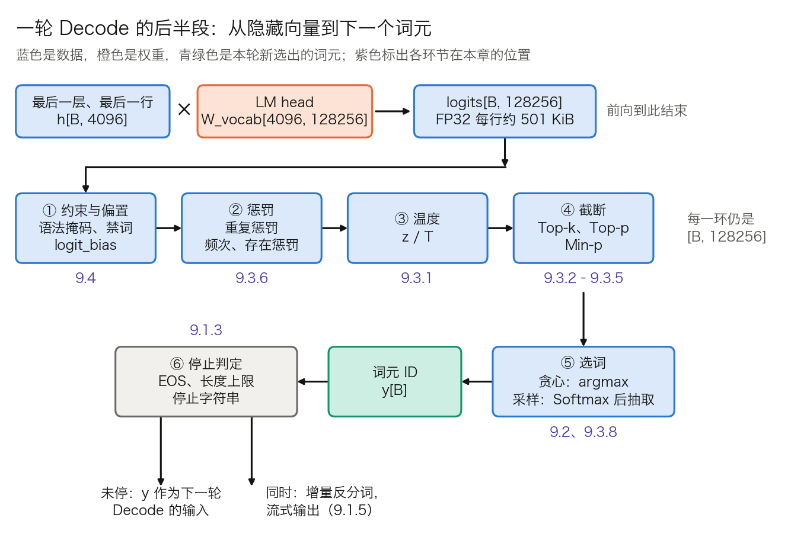
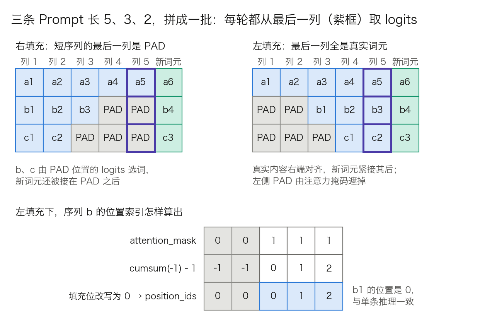

## 9.1 自回归解码：逐词生成的机制

[3.8 节](../03_components/3.8_gpt_inference_flow.md)跟踪的是一次前向的内部：6 个词元怎样流过一层 Transformer，变成一行 logits。本节讲前向与前向之间的那个循环：每一轮送进什么、logits 怎样变成一个词元、何时停下、多条序列怎样拼成一批、选出的词元怎样变回文字。9.2 到 9.4 节各自展开这条链上的一环，本节先把整条链摆出来。

### 9.1.1 解码循环：每一轮送进什么、读什么、写什么

**自回归解码**（autoregressive decoding）来自对序列概率的链式分解：

$$
p(y_1,\dots,y_n \mid x) = \prod_{k=1}^{n} p(y_k \mid x,\ y_{<k})
$$

模型一次前向只给出右边的一个因子，即“下一个词元”的分布。选定 $$y_k$$ 之后，它才能成为第 $$k+1$$ 个因子的条件，所以同一条回答里的词元只能一个接一个产生。

带 KV 缓存（见 [10.2 节](../10_inference_optimization/10.2_kv_cache.md)）时，循环分两种前向。第 1 轮是 Prefill：一次送入整个 Prompt，为每个位置算出 K、V 写入缓存，并由最后一个位置选出 $$y_1$$。此后每一轮是 Decode：只送入上一轮选出的那一个词元，它的 Query 对着缓存里的全部 K、V 打分。表 9-1 以 Prompt 长 `P = 1,000`、共选出 `n = 500` 个词元（最后一个是 EOS）为例，列出各轮的输入与缓存。

| 轮次 | 前向类型 | 送入的词元 | 送入行数 | 读缓存行数 | 本轮后缓存行数 | 产出 |
| ---: | --- | --- | ---: | ---: | ---: | --- |
| 1 | Prefill | Prompt 全部 | 1,000 | 0 | 1,000 | $$y_1$$ |
| 2 | Decode | $$y_1$$ | 1 | 1,000 | 1,001 | $$y_2$$ |
| 3 | Decode | $$y_2$$ | 1 | 1,001 | 1,002 | $$y_3$$ |
| k | Decode | $$y_{k-1}$$ | 1 | `P + k − 2` | `P + k − 1` | $$y_k$$ |
| 500 | Decode | $$y_{499}$$ | 1 | 1,498 | 1,499 | $$y_{500}$$ = EOS |

表 9-1：带 KV 缓存的解码循环。每轮的注意力还要读本轮新写入的那一行，表中“读缓存行数”只数此前已有的行。

从表中读出三个数：

- **前向次数。** 选出 n 个词元需要 1 次 Prefill 加 `n − 1` 次 Decode，本例是 `1 + 499`。最后选出的 EOS 不再送入模型，缓存停在 `P + n − 1 = 1,499` 行。
- **缓存省掉的计算。** 不用缓存时，第 k 轮要把此前的 `P + k − 1` 行全部重算，总行数是 `nP + n(n − 1)/2 = 500,000 + 124,750 = 624,750`；用缓存只算 `1,000 + 499 = 1,499` 行，相差约 417 倍。
- **每轮的成本不是常数。** Decode 每轮读的缓存行数随 k 增长，第 500 轮要读第 2 轮的约 1.5 倍；与权重相乘的部分则每轮相同（算法见 3.8.7）。

逐词生成的代价在 3.8.7 已经算过：Decode 每轮要把全部权重读一遍，却只算一行，瓶颈在显存带宽。绕开“一轮一个词元”的办法有两类：投机解码让一次前向确认多个词元（见 [10.6 节](../10_inference_optimization/10.6_speculative_decoding.md)），扩散语言模型改掉从左到右的分解本身（见 [9.6 节](9.6_diffusion_lm.md)）。两者都没有取消“已选词元成为后续条件”这一点。

这一点还带来一个后果：词元一经选出就不能修改，早期的一个坏选择会成为此后所有轮次的条件。束搜索（[9.2 节](9.2_greedy_beam.md)）和多路采样（[9.5 节](9.5_test_time_scaling.md)）都是为了减轻这个后果，办法是同时保留几条路径。

### 9.1.2 从 logits 到词元：一条处理链

**问题。** 前向交出的是一行分数，不是一个词元。中间还隔着若干步处理，API 里的 `temperature`、`top_p`、`presence_penalty`、`response_format` 各自作用在其中一步。不知道它们的先后，就无法解释参数之间的相互影响。

**形状。** 每条序列只取最后一层、最后一个位置的隐藏向量，经 LM head 得到 logits：

- GPT-3 Small：`h[B, 768] × W_vocab[768, 50257] → logits[B, 50257]`
- Llama 3 8B：`h[B, 4096] × W_vocab[4096, 128256] → logits[B, 128256]`

`B` 是批内序列数。此后直到选出词元，每一步的输入输出都是这个形状。

**大小。** 采样通常在 FP32 下做（原因见 9.3.8）。Llama 3 8B 的一行 logits 是 `128,256 × 4 = 513,024` 字节，约 501 KiB；`B = 256` 时为 `256 × 513,024` 字节，约 125 MiB。GPT-3 Small 的一行是 `50,257 × 4 = 201,028` 字节，约 196 KiB。

**LM head 占多少计算。** 沿用 3.8.7 的数法，一次 `[a, b] × [b, c]` 的乘法约 `2abc` 次运算。Llama 3 8B 每层的矩阵参数是 Q、O 各 `4096 × 4096`，K、V 各 `4096 × 1024`，MLP 三个 `4096 × 14336`，合计 218,103,808 个；32 层共约 69.8 亿个。LM head 是 `4096 × 128,256 = 525,336,576` 个，约 5.25 亿。一轮 Decode 的矩阵乘法约 `2 × (69.8 + 5.25) 亿 ≈ 150 亿` 次运算，LM head 占 `5.25 ÷ 75.05 ≈ 7.0%`。词表越大、模型越小，这个比例越高。

LM head 之后的各步都是对 12.8 万个数的逐元素运算或规约，每一遍的运算量比前向低约五个数量级（`150 亿 ÷ 12.8 万 ≈ 1.2 × 10⁵`）。它们的开销来自别处：逐请求不同的参数要整理成张量，Top-p 要排序，约束掩码在 CPU 上生成（见 [11.7 节](../11_serving/11.7_constrained_decoding.md)）。

图 9-1：一轮 Decode 的后半段（[生成脚本](https://github.com/yeasy/llm_internals/blob/main/tools/figures/ch09_logits_pipeline.py)）。形状按 Llama 3 8B；环节的先后取 vLLM 采样器的顺序，其他引擎的差异见 9.3.7。

表 9-2 逐环节列出作用与常见参数名。

| 环节 | 对 logits 做什么 | OpenAI 风格 API 与 vLLM `SamplingParams` 中的参数 | 会改变 argmax 吗 | 本章位置 |
| --- | --- | --- | --- | --- |
| ① 约束与偏置 | 不合法词元置 −∞；指定词元加常数 | `response_format`、`allowed_token_ids`、`bad_words`、`logit_bias`、`min_tokens` | 会 | 9.4 |
| ② 惩罚 | 已出现词元的 logit 调低 | `repetition_penalty`、`frequency_penalty`、`presence_penalty` | 会 | 9.3.6 |
| ③ 温度 | 整行除以温度 $$\tau$$ | `temperature` | 不会 | 9.3.1 |
| ④ 截断 | 低概率词元置 −∞ | `top_k`、`top_p`、`min_p` | 不会 | 9.3.2 到 9.3.5 |
| ⑤ 选词 | argmax，或 Softmax 后按概率抽取 | `temperature = 0` 即贪心；`seed` | | 9.2、9.3.8 |
| ⑥ 停止判定 | 检查选出的词元与已生成文本 | `max_tokens`、`stop`、`stop_token_ids`、`ignore_eos` | | 9.1.3 |

表 9-2：logits 处理链的各环节。参数名取自 vLLM 的 [`sampling_params.py`](https://github.com/vllm-project/vllm/blob/main/vllm/sampling_params.py)；`response_format` 是 OpenAI 风格接口的写法。

“会改变 argmax 吗”一列有实际用途。温度和截断都保留 logit 最高的那个词元，贪心解码可以整段跳过③④，直接在②的输出上取 argmax。vLLM 的采样器据此把处理器分成两组，先执行会影响贪心结果的，再按请求分出贪心与随机两条路径。

链上还有一条旁路：返回给调用方的 `logprobs`。vLLM 默认在语法掩码之后、①的其余处理与②③④之前就算好对数概率。无约束请求拿到的是模型的原始分布；约束请求拿到的是已遮掉不合法词元的分布。两者都不是实际抽样所用的分布，用 `logprobs` 做置信度估计时要先弄清拿到的是哪一个。

### 9.1.3 何时停止

循环有四种出口，见表 9-3。前两种看词元 ID，第三种看文本，第四种看长度。

| 出口 | 判定对象 | 典型参数 | 结束原因 | 常见故障 |
| --- | --- | --- | --- | --- |
| 选中结束词元 | 本轮选出的 ID 是否在停止集合内 | `eos_token_id`（可为列表）、`stop_token_ids` | `stop` | 集合配漏，停不下来 |
| 达到生成上限 | 已生成词元数 | `max_tokens`、`max_new_tokens` | `length` | 输出被截断，JSON 不完整 |
| 命中停止字符串 | 已生成文本的尾部 | `stop`、`stop_strings` | `stop` | 按词元 ID 匹配而漏判 |
| 上下文用尽 | `P + 已生成数` 与模型上限 | 引擎的最大序列长度 | `length` | 长 Prompt 留给输出的余量不足 |

表 9-3：解码循环的四种出口。

**结束词元可以不止一个。** Llama 3 的[官方分词器](https://github.com/meta-llama/llama3/blob/main/llama/tokenizer.py)定义 `stop_tokens = {<|end_of_text|>, <|eot_id|>}`。特殊词元排在 128,000 个基础词元之后，前者是第 2 个，ID 为 128001；后者是第 10 个，ID 为 128009。`<|end_of_text|>` 表示整段文本结束，`<|eot_id|>` 表示一轮对话结束，对话模板在每条消息末尾写的是后者。对话模型答完一轮时选出的是 `<|eot_id|>`；若停止集合里只配了 `<|end_of_text|>`，循环不会停，模型继续往下写，直到撞上长度上限。“模型停不下来”多数是这类配置问题，不是模型问题。

**下限与忽略。** `min_tokens` 在生成数不足时把停止集合内的词元置为 −∞，属于表 9-2 的环节①。`ignore_eos` 让循环无视结束词元、跑满 `max_tokens`，用于压测时固定输出长度。

**停止字符串要在文本上匹配。** 同一个字符串可以有多种切法，也可以只是某个更长词元的一部分，按 ID 序列匹配会漏判。实现是每轮把新词元反分词，在已生成文本的尾部查找。流式输出时还要多一步：尾部若是某个停止字符串的前缀，这几个字符先扣住不发，等下一轮确认；否则调用方会先收到半个停止串。

**结束原因要检查。** `length` 表示输出是被截断的，内容不完整。约束解码（9.4 节）保证每个前缀合乎语法，但不保证输出在截断之前写完。

**批内先结束的序列。** 静态批处理中，先结束的序列不能离开，只能继续占位。Hugging Face `generate()` 用一个 `unfinished_sequences` 向量标记，已结束的行此后每轮填入 `pad_token_id`，整批要等最长的一条。连续批处理让结束的序列立即退出、新请求补位（见 [11.2 节](../11_serving/11.2_continuous_batching.md)）。

### 9.1.4 批量生成：左填充、位置索引与不填充的方案

**问题。** 同一批里的 Prompt 长度不同，张量却要求等长。训练时的惯例是右填充，把 `[PAD]` 补在末尾，损失用掩码排除填充位即可。生成不同：每轮取的是最后一列的 logits。右填充时，短序列的最后一列是 `[PAD]`，模型从填充符之后续写，输出立刻跑偏，新词元还被接在填充之后。

**左填充。** 把 `[PAD]` 补在开头，真实内容右端对齐，最后一列对每条序列都是真实词元。配套要做两件事：

1. 注意力掩码把左侧填充位标为不可见。
2. 位置索引从真实内容起算。Hugging Face `generate()` 的算法是 `position_ids = attention_mask.cumsum(-1) - 1`，再把填充位改写为 0。

图 9-2 画出两种填充，以及序列 b 的位置索引怎样算出。

图 9-2：批量生成时的右填充与左填充，下半幅是左填充下位置索引的算法（[生成脚本](https://github.com/yeasy/llm_internals/blob/main/tools/figures/ch09_padding_sides.py)）。

位置索引为什么必须跳过填充，要分两种位置编码说。学习式绝对位置下，位置 0 和位置 2 查到的是两个不同的向量，错位直接改变输入。RoPE 下，注意力分数只依赖两个位置之差（见[第四章](../04_position_encoding/README.md)），整条序列统一平移在精确算术下不改变结果；但平移量随同批的最长 Prompt 变化，同一请求在不同批里会得到不同的浮点结果，也无法与单条推理逐位对照。两种情形的结论相同，理由不同。

实现上，Hugging Face 的分词器用 `padding_side="left"` 设置；`generate()` 发现仅解码器模型的输入是右填充时会给出警告。“单条推理正常、批量推理胡言乱语”这类故障，多半错在填充方向，模型和权重没有问题。

**另外两种方案。** 左填充不是唯一做法，表 9-4 列出三种方案的取舍。

| 方案 | 做法 | 代价 |
| --- | --- | --- |
| 左填充 | Prompt 右端对齐，Prefill 一次算完整批 | 填充位白占计算与 KV 缓存；批内长度差越大浪费越多 |
| 左对齐、从最短处起步 | 缓冲区左对齐，从最短 Prompt 的长度开始逐列前进；该列若仍属于某条 Prompt，用原词元覆盖采样结果 | 无填充；长 Prompt 超出最短长度的部分被逐词元处理，失去 Prefill 的并行 |
| 不填充 | 各序列的词元首尾相接，拼成一维批，注意力内核按每条序列的起止位置计算 | 需要专门的内核与调度器；连续批处理引擎的标准做法 |

表 9-4：批量生成对齐长度的三种方案。第二种是 Llama 3 官方参考实现 [`generation.py`](https://github.com/meta-llama/llama3/blob/main/llama/generation.py) 的做法，其中 `input_text_mask` 标记哪些格子属于 Prompt；第三种见 11.2 节和 [11.3 节](../11_serving/11.3_scheduler_loop.md)。

### 9.1.5 流式输出与增量反分词

**问题。** 流式输出要求每选出一个词元就把对应的文字发给用户。但词元与字符不是一一对应的，逐个词元单独反分词会出错。

**原因。** 字节级 BPE 的词元是字节串（见 [3.1 节](../03_components/3.1_tokenization.md)）。UTF-8 下一个汉字占 3 个字节，例如“智”是 `E6 99 BA`；表情符号多为 4 个字节。词表里没有整字对应的词元时，一个字的几个字节会分属相邻的两三个词元。只拿到前一个词元时，手里是一段不完整的 UTF-8，解码器只能输出替换字符 U+FFFD，显示为乱码。另一类问题是空格：许多分词器把词前空格并入词元，单独解码一个词元与放在上下文里解码，得到的空格可能不同。

**做法。** 增量反分词不解码单个词元，而是解码一个窗口。vLLM 的 [`detokenize_incrementally`](https://github.com/vllm-project/vllm/blob/main/vllm/tokenizers/detokenizer_utils.py) 维护两个下标 `prefix_offset` 和 `read_offset`：

1. 把 `prefix_offset` 到 `read_offset` 的词元解码成前缀文本。
2. 把 `prefix_offset` 到末尾的词元解码成新文本。
3. 新文本若以 U+FFFD 结尾，说明末尾的字节序列尚未完整，本轮不输出，两个下标不动。
4. 否则输出新文本比前缀文本多出的部分，并把两个下标前移。

窗口带上几个已输出的词元，是为了让空格和合并规则在正确的上下文里生效。

**代价与边界。** 用户看到的字符会比词元晚一到两轮。延迟指标按词元计，例如每词元输出时间（Time Per Output Token，TPOT，定义见 [11.13 节](../11_serving/11.13_best_practices.md)）；用户的体感按字符计，两者因此略有出入。非流式输出没有这个问题，结束后一次性解码全部词元即可。
