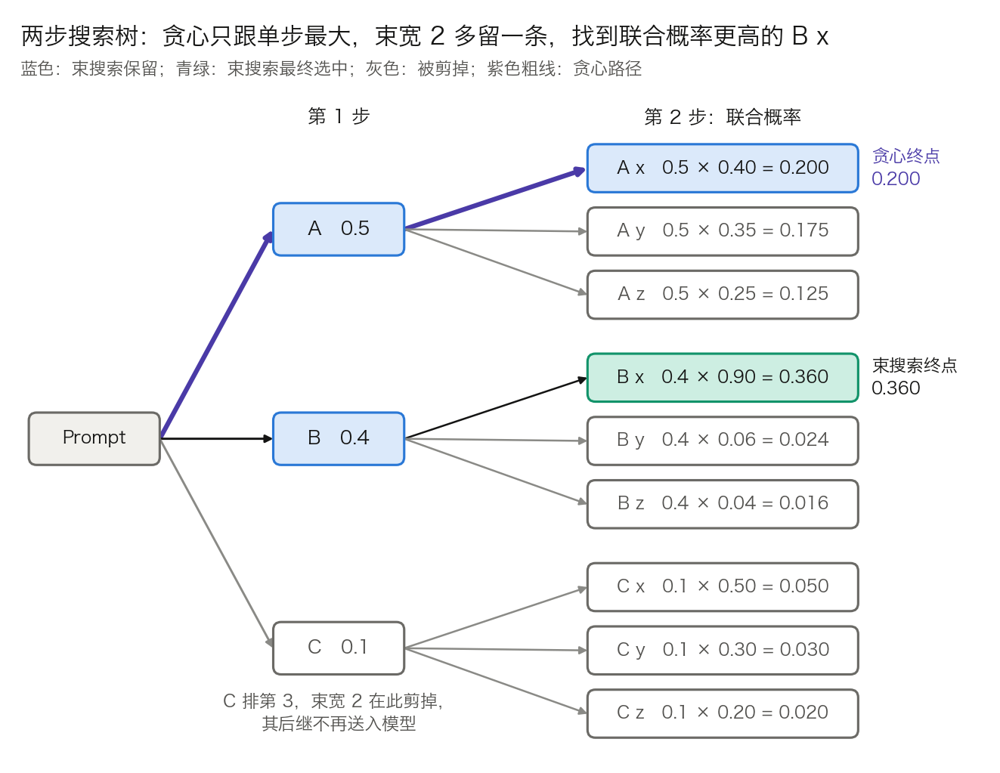

## 9.2 贪心搜索与束搜索：确定性与近似搜索

本节讨论图 9-1 第⑤环的确定性一侧：不引入随机数，选哪个词元完全由分数决定。贪心搜索按单步最高概率选；束搜索同时保留多条候选，用更大的搜索范围逼近整句最优。本节回答四个问题：单步最优为什么不等于整句最优，束搜索的一步具体做什么，它偏好短输出该怎样修正，以及束宽为什么不是越大越好。最后一问的答案引出 9.3 节的采样。

### 9.2.1 贪心搜索：单步最优不等于整句最优

**贪心搜索**（greedy search）每一轮取概率最高的词元：

$$
y_k = \arg\max_{v}\ p(v \mid x,\ y_{<k})
$$

实现上不必做 Softmax，直接对 logits 取 argmax 即可，因为 Softmax 保持大小顺序。它不需要随机数，延迟最低；多数 API 里 `temperature = 0` 就是走这条分支。

缺陷用一棵两步的树就能算清。设第 1 步有三个候选，概率是 A 0.5、B 0.4、C 0.1；第 2 步的条件分布见图 9-3。贪心在第 1 步选 A，第 2 步选 A 之后最高的 x，整条路径的联合概率是 `0.5 × 0.40 = 0.200`。而 B 之后的 x 概率高达 0.90，路径 B x 的联合概率是 `0.4 × 0.90 = 0.360`，是贪心结果的 1.8 倍。9 条路径的联合概率加起来是 1，B x 才是其中最大的。

图 9-3：两步搜索树（[生成脚本](https://github.com/yeasy/llm_internals/blob/main/tools/figures/ch09_beam_tree.py)）。贪心路径 A x 的联合概率是 0.200；束宽 2 多保留了 B，找到 0.360 的 B x。

原因在于第 1 步选 A 时，看不到 A 之后的分布很平、B 之后的分布很尖。要找到整句最优，理论上得比较全部 $$|V|^n$$ 条路径；Llama 3 的词表下，仅两步就有 `128,256² ≈ 1.6 × 10¹⁰` 条。束搜索是介于两者之间的折中。

### 9.2.2 束搜索的一步：扩展、打分、剪枝、收束

**束搜索**（beam search）始终保留 W 条得分最高的部分序列，W 称为**束宽**（beam width）。本节用 W 而不是 B 记它，因为 B 在全书其余各处表示批大小。得分是累积对数概率：

$$
s(y_{1:k}) = \sum_{i=1}^{k} \log p(y_i \mid x,\ y_{<i})
$$

用对数是为了把连乘变成连加，避免长序列的概率下溢。每一轮做四件事。

**第 1 步：扩展。** W 条序列作为一批送入模型，得到 `logits[W, n_vocab]`，逐行做 log-softmax 得到 `logp[W, n_vocab]`。

**第 2 步：打分。** 把每条序列已有的得分加到它那一行上：`s[W, 1] + logp[W, n_vocab] → cand[W, n_vocab]`。这张表的第 b 行第 v 列，是“第 b 条序列后接词元 v”的得分。

**第 3 步：剪枝。** 把 `cand` 展平成 `W × n_vocab` 个数，取最大的 W 个。Llama 3 8B 取 `W = 4` 时是从 `4 × 128,256 = 513,024` 个候选里取 4 个。设某个入选者在展平后的下标是 j，则它的父序列是 `j ÷ n_vocab` 的整数商（记作 `beam_idx`），新词元是余数。

**第 4 步：收束。** 入选者若以 EOS 结尾，就移入已完成集合，不再扩展；其余的成为下一轮的 W 条序列。

沿用图 9-3 的树，取 `W = 2`。第 1 轮保留 A（`ln 0.5 = −0.693`）和 B（`ln 0.4 = −0.916`），C 被剪掉。第 2 轮的 `cand[2, 3]` 共 6 个候选，见表 9-5。以 B x 为例：`−0.916 + ln 0.90 = −0.916 − 0.105 = −1.022`（末位因舍入差 1）。

| 候选 | 父序列得分 | 本步对数概率 | 累积得分 | 联合概率 | 是否保留 |
| --- | ---: | ---: | ---: | ---: | --- |
| B x | −0.916 | −0.105 | −1.022 | 0.360 | 是 |
| A x | −0.693 | −0.916 | −1.609 | 0.200 | 是 |
| A y | −0.693 | −1.050 | −1.743 | 0.175 | 否 |
| A z | −0.693 | −1.386 | −2.079 | 0.125 | 否 |
| B y | −0.916 | −2.813 | −3.730 | 0.024 | 否 |
| B z | −0.916 | −3.219 | −4.135 | 0.016 | 否 |

表 9-5：束宽 2 在第 2 轮的 6 个候选，按累积得分排序。保留的两条分别来自父序列 B 和 A，`beam_idx = [B, A]`。

**KV 缓存要跟着重排。** 新一轮的第 1 条序列来自旧的第 2 条，它要读的是旧第 2 条的缓存。朴素实现每轮按 `beam_idx` 把各层的 K、V 重新收集一遍，Hugging Face 里对应 `_reorder_cache` 或缓存对象的 `reorder_cache(beam_idx)`。若两条新序列来自同一个父序列，父序列的缓存还要复制一份。分页 KV 缓存把这件事变成改块表里的指针，只在写入共享块时才复制（见 [11.4 节](../11_serving/11.4_kv_memory_management.md)的写时复制）。

**何时结束。** 已完成集合攒够 W 条并不一定能停：仍在扩展的序列可能在归一化之后反超。Hugging Face 用 `early_stopping` 控制：取 `True` 时攒够 `num_beams` 条即停；取 `False` 时用启发式判断继续搜索是否还可能更优；取 `"never"` 时只有确认不可能更优才停。结束后按归一化得分返回前 `num_return_sequences` 条。

**边界。** 束搜索仍是启发式：早期被剪掉的序列不会再回来。它的输出对束宽、长度归一化和停止规则都敏感，三者任一不同，结果就可能不同。

### 9.2.3 长度偏置与长度惩罚

**问题。** 每个词元的对数概率都是负数，序列越长，累积得分越低。不加处理的束搜索因此偏好短输出，极端情形是直接输出 EOS。

**对策。** 选优时把得分除以一个随长度增长的量。常见两种形式：直接除以 $$|y|^{\alpha}$$，或用 [GNMT](https://arxiv.org/abs/1609.08144) 的长度惩罚

$$
lp(y) = \left(\frac{5 + |y|}{6}\right)^{\alpha},\qquad \text{score}(y) = \frac{\log P(y)}{lp(y)}
$$

$$\alpha = 0$$ 时不归一化，$$\alpha$$ 越大越偏向长序列；GNMT 常取 0.6 到 0.7。

**算例。** 比较两条候选：短序列 5 个词元、每个词元概率 0.8，累积得分 `5 × ln 0.8 = −1.116`；长序列 10 个词元、每个词元概率 0.85，得分 `10 × ln 0.85 = −1.625`。长序列每一步都比短序列更有把握，未归一化时却输了。以 GNMT、$$\alpha = 0.6$$ 为例：`lp(5) = (10/6)^0.6 = 1.359`，`lp(10) = (15/6)^0.6 = 1.733`，归一化后是 `−1.116 ÷ 1.359 = −0.821` 对 `−1.625 ÷ 1.733 = −0.938`。表 9-6 给出各种取法的结果。

| 归一化方式 | 短序列得分 | 长序列得分 | 胜者 |
| --- | ---: | ---: | --- |
| 不归一化（$$\alpha = 0$$） | −1.116 | −1.625 | 短 |
| GNMT，$$\alpha = 0.6$$ | −0.821 | −0.938 | 短 |
| GNMT，$$\alpha = 1.0$$ | −0.669 | −0.650 | 长 |
| 除以 $$\lvert y\rvert^{0.6}$$ | −0.425 | −0.408 | 长 |
| 除以 $$\lvert y\rvert^{1.0}$$（每词元平均） | −0.223 | −0.163 | 长 |

表 9-6：同一对候选在五种长度归一化下的得分。GNMT 式分子里的常数 5 让短序列的惩罚涨得慢，同样的 $$\alpha$$ 下比直接除以长度更保守。

表 9-6 说明 $$\alpha$$ 是一个要按任务调的旋钮：同一对候选，换一种归一化，胜负就翻转。取得过大，又会反过来奖励冗长。

**实现中的参数名容易读反。** Hugging Face 的 `length_penalty` 是上面第二种形式里的指数：得分除以 `长度 ** length_penalty`，默认 1.0。得分是负数，所以取正值偏向更长的序列，取负值偏向更短。名字叫“惩罚”，调大却得到更长的输出。

### 9.2.4 代价：计算、KV 缓存与延迟

常见的说法是“束搜索的计算量和 KV 缓存约为贪心的 W 倍”。这只对 Decode、且不共享前缀的朴素实现成立，分三项看。

**计算。** Prompt 对 W 条序列是同一份，Prefill 只需做一次。Decode 每轮送入 W 行，与权重相乘的部分是贪心的 W 倍。

**KV 缓存。** 设 Prompt 长 P、已生成 t 个词元。朴素实现每条序列各存一份，占用正比于 `W × (P + t)`。共享 Prompt 之后上限是 `P + W × t`；各序列已生成部分的公共前缀还能继续共享，实际更低。以 Llama 3 8B 为例，每个词元的 K、V 是 `2 × 8 × 128 × 32 = 65,536` 个数（见 3.8.7），BF16 下 128 KiB。取 `P = 1,000`、`t = 200`、`W = 4`：朴素实现是 `4 × 1,200 = 4,800` 个词元，合 600 MiB；共享 Prompt 后至多 `1,000 + 4 × 200 = 1,800` 个词元，合 225 MiB，约为前者的八分之三。分页缓存下束搜索的实测节省量见 11.4.4。

**延迟。** W 条序列作为一批并行前向。Decode 受显存带宽限制，批内多几行几乎不增加单轮耗时（见 3.8.7），所以单请求延迟的增幅远小于 W 倍。代价落在吞吐上：这 W 行本可以服务 W 个不同的请求。

**不能流式输出。** 得分最高的序列在结束前随时可能换成另一条，已经发给用户的前缀无法收回。对话场景要求边生成边显示，这是束搜索在对话产品中少见的直接原因，与成本无关。

### 9.2.5 束宽不是越大越好

束搜索的目标是找概率更高的序列。机器翻译的经验却是：束宽超过某个值之后，译文质量反而下降。

- [Koehn 与 Knowles](https://arxiv.org/abs/1706.03872) 在 8 个语言对上观察到，几乎所有情形下，束宽超过某个最优值后译文都会变差，主要原因是束越宽、译文越短。
- [Stahlberg 与 Byrne](https://arxiv.org/abs/1908.10090) 为 Transformer 翻译模型实现了精确搜索，在整个 WMT15 英德测试集上找出模型真正的最高分输出。结果是 51.8% 的句子，最高分输出是空译文，即只有一个结束符；精确搜索的 BLEU 只有 2.1，束宽 10 的束搜索却有 30.3。束宽加到 100，仍有 53.62% 的句子没有找到最高分输出。

第二项结果的含义是：束搜索之所以管用，恰恰因为它搜得不彻底。模型把最高概率给了一个明显错误的输出，窄束的搜索误差碰巧避开了它。“概率最高的序列”与“最好的序列”不是一回事，这一点不因搜索更强而改变。

开放式生成里同样如此。[Holtzman 等人](https://arxiv.org/abs/1904.09751)指出，以似然为解码目标会得到平淡而且反复重复的文本；人写的文本逐词元看并不总是落在高概率区，而是不时出现低概率的词。一旦进入重复，模型给“继续重复”的概率会越来越高，最大化类方法就此锁死在循环里。9.3 节的采样从这里出发：不再追求最高概率，而是从分布里抽取，同时截掉不可靠的尾部。

**束搜索今天用在哪里。** 输出由输入基本确定、长度适中的任务仍是它的主场：机器翻译、语音识别、摘要。开放式对话和长文写作改用采样。它的骨架还以另一种形式出现：把“词元”换成“推理步骤”、把对数概率换成过程奖励模型的打分，就是 [9.5 节](9.5_test_time_scaling.md)的按步骤搜索。若要同一批候选彼此不同，可用[多样束搜索](https://arxiv.org/abs/1610.02424)，它把束分成若干组，并在打分时惩罚与前面各组重复的选择。
