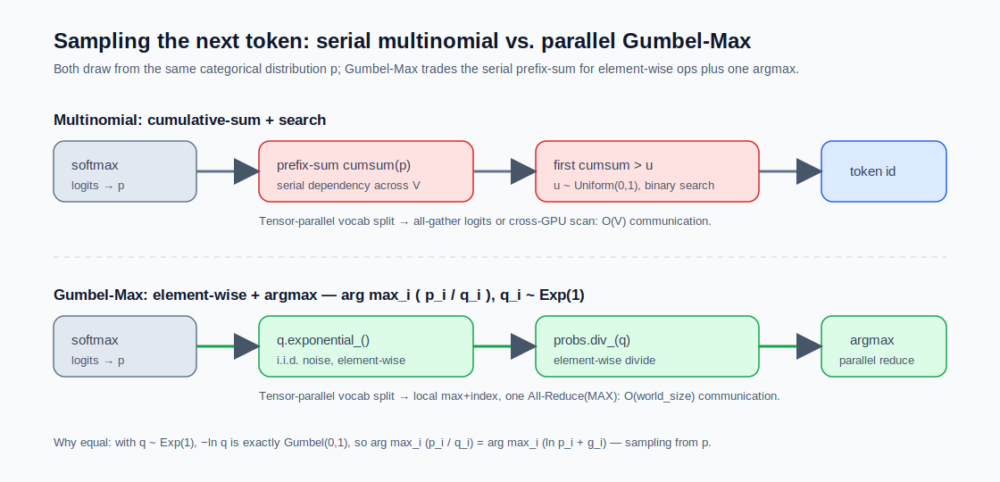

## 9.3 采样策略：温度、Top-k 与 Top-p 的设计直觉

确定性的解码方法（贪心和束搜索）无法生成多样化的输出。**采样策略**通过引入随机性来解决这个问题——从概率分布中随机抽取下一个词元，而非总是选择概率最高的那个。

### 9.3.1 温度采样

**温度**（Temperature）$$T$$ 通过在 Softmax 前对 logits 进行缩放来控制分布的“锐度”：

$$P(x_i) = \frac{\exp(z_i / T)}{\sum_j \exp(z_j / T)}$$

- **$$T < 1$$**：分布变得更尖锐，高概率词元更突出，输出更确定、聚焦
- **$$T = 1$$**：保持原始分布
- **$$T > 1$$**：分布变得更均匀，低概率词元获得更多机会，输出更多样、随机

直觉上，温度控制的是模型的“创造力”：低温度适合事实性问答（需要精确），高温度适合创意写作（需要新颖）。

### 9.3.2 Top-k 采样

**Top-k 采样**将采样范围限制在概率最高的 $$k$$ 个词元中，将其他词元的概率置零后重新归一化：

$$P_{\text{top-k}}(x_i) = \begin{cases} \frac{P(x_i)}{\sum_{j \in \text{Top-k}} P(x_j)} & \text{if } x_i \in \text{Top-k} \\ 0 & \text{otherwise} \end{cases}$$

然后从 $$P_{\text{top-k}}$$ 中采样。

这解决了从完整分布中采样可能选中极低概率词元（导致“胡说八道”）的问题。常用 $$k = 50$$。

Top-k 的局限在于 $$k$$ 是固定的。有些位置可能只有 2-3 个合理选择（如“中华人民____”后只能接“共和国”），固定的 $$k = 50$$ 会引入太多噪声。另一些位置可能有很多合理选择（如句子开头），固定 $$k$$ 可能不够。

### 9.3.3 Top-p 采样

**Top-p 采样**（Nucleus Sampling）解决了 Top-k 的固定阈值问题。设将词元按概率从高到低排序为 $$(x_{(1)}, x_{(2)}, \ldots)$$，其中 $$P(x_{(i)}) \geq P(x_{(i+1)})$$。Top-p 采样选择最小的集合 $$S$$：

$$S = \{x_{(1)}, x_{(2)}, \ldots, x_{(m)}\} \text{ 使得 } \sum_{i=1}^{m} P(x_{(i)}) \geq p$$

然后从归一化后的分布中采样：

$$P_{\text{top-p}}(x_i) = \begin{cases} \frac{P(x_i)}{\sum_{j \in S} P(x_j)} & \text{if } x_i \in S \\ 0 & \text{otherwise} \end{cases}$$

常用 $$p = 0.9 \sim 0.95$$。

这意味着采样范围是**自适应的**：

- 在模型非常确定时（概率集中在少数词元上），集合很小
- 在模型不确定时（概率分散），集合自动扩大

从信息论的角度看，Top-p 的优势在于它**根据分布的熵自适应调整采样范围**。当模型输出的条件熵低（分布集中、确定性高）时，累积概率快速达到阈值 $$p$$，采样集合自动收缩；当条件熵高（分布分散、不确定性大）时，集合自动扩大。换言之，Top-p 本质上是在用一个固定的累积概率预算来自适应地匹配分布的“有效支撑集”大小——这比 Top-k 的固定大小截断在信息论意义上更合理，因为它保留了与当前上下文熵相匹配的恰当随机性。

Top-p 采样因此在多样性和质量之间取得了更好的平衡，是当前大语言模型最常用的采样策略。

### 9.3.4 Min-p 采样

**Min-p 采样**把截断阈值绑定到当前最可能词元的概率上：若最高概率为 $$p_{\max}$$，则只保留满足 $$P(x_i) \geq \alpha p_{\max}$$ 的词元，其中 $$\alpha$$ 是较小的比例阈值。它与 Top-p 的差别在于：Top-p 固定累计概率预算，而 Min-p 根据当前分布的峰值动态收缩或放宽候选集合，在高温采样时常比固定 Top-k/Top-p 更稳（详见 [Min-p 采样提案](https://arxiv.org/abs/2407.01082)）。

### 9.3.5 策略的组合使用

在实际应用中，这些策略通常**组合使用**：先用温度调整分布，再用 Top-p 或 Top-k 截断尾部，最后从截断后的分布中采样。例如，典型的对话模型配置为 $$T = 0.7$$、$$\text{Top-p} = 0.9$$。

### 9.3.6 Gumbel-Max 采样：GPU 友好的等价方案

前面介绍的采样策略都需要从概率分布中按权重抽取下一个词元。最直接的实现是**多项式采样**（multinomial sampling）：生成均匀随机数 $$u \sim \text{Uniform}(0, 1)$$，对概率数组做前缀和（cumulative sum），返回第一个累积概率超过 $$u$$ 的位置。这种方法逻辑直观，但前缀和是一个**串行依赖**的操作，对动辄 128K~256K 大小的现代词表（如 Llama 3 的 128,256 词表），在 GPU 上无法充分利用并行算力。

**Gumbel-Max Trick** 提供了一个数学等价但 GPU 极度友好的替代方案。其核心定理是：对每个类别的对数概率 $$\ln p_i$$ 加上一组独立同分布的 Gumbel 噪声 $$g_i$$，然后直接取最大值的索引，所得的分布与按 $$p$$ 进行多项式采样**完全等价**：

$$\text{sample}(p) \;\overset{d}{=}\; \arg\max_i \big(\ln p_i + g_i\big), \quad g_i \overset{\text{iid}}{\sim} \text{Gumbel}(0, 1)$$

标准 Gumbel(0,1) 噪声可由均匀分布 $$U \sim \text{Uniform}(0, 1)$$ 通过 $$g = -\ln(-\ln U)$$ 生成。

#### vLLM 的工程实现

vLLM 主仓库 [`vllm/v1/sample/ops/topk_topp_sampler.py`](https://github.com/vllm-project/vllm/blob/main/vllm/v1/sample/ops/topk_topp_sampler.py) 的 `random_sample` 函数采用了一个数学上等价、但更利于硬件执行的形式（下面的片段省略了上游末尾纯展平的 `.view(-1)`）：

```python
probs = logits.softmax(dim=-1, dtype=torch.float32)
q = torch.empty_like(probs)
q.exponential_()
return probs.div_(q).argmax(dim=-1)
```

这段代码的数学推导是：令 $$q_i \sim \text{Exp}(1)$$ 为标准指数分布噪声。由于对数函数单调递增，求 $$\arg\max_i (p_i / q_i)$$ 等价于求 $$\arg\max_i (\ln p_i - \ln q_i)$$。当 $$q_i \sim \text{Exp}(1)$$ 时，可以证明 $$-\ln q_i$$ 恰好服从标准 Gumbel(0, 1) 分布，因此两种形式数学等价。

#### GPU 视角下的优势

这种实现把整个采样过程拆分成了三个完全并行的 element-wise 操作：

1. `q.exponential_()`：独立同分布的随机数生成，跨元素无依赖
2. `probs.div_(q)`：逐元素除法，跨元素无依赖
3. `argmax(dim=-1)`：标准并行规约（reduction）

完全避开了多项式采样所需的前缀和串行依赖。这在词表沿**张量并行**维度切分到多张 GPU 的场景下尤为重要：传统多项式采样需要 all-gather 整张 logits 或跨卡前缀和加二分查找，通信量为 $$O(V)$$；而 Gumbel-Max 形式只需在每卡本地算出局部最大值与索引，再做一次 `All-Reduce(MAX with index)`，通信量降到 $$O(\text{world\_size})$$。

更进一步，贪心采样（直接 argmax）和随机采样（Gumbel-Max）在 kernel 执行流上被完全统一——随机采样只是比贪心多做了一步“除以噪声”，最终都汇合到 argmax 规约，消除了底层 kernel 的分支发散。



图 9-1：采样下一个词元——串行多项式采样 vs. 并行 Gumbel-Max（后者把前缀和换成 element-wise 运算加一次 argmax）

> [!NOTE]
> Gumbel-Max 与本节前面的 Top-k / Top-p / 温度策略并不互斥。在 vLLM 中，温度、Top-k、Top-p 截断先作用在 logits 上得到稀疏化后的概率，然后用 Gumbel-Max 完成最终采样——前者决定**采样空间的形状**，后者决定**如何从中抽取**。
