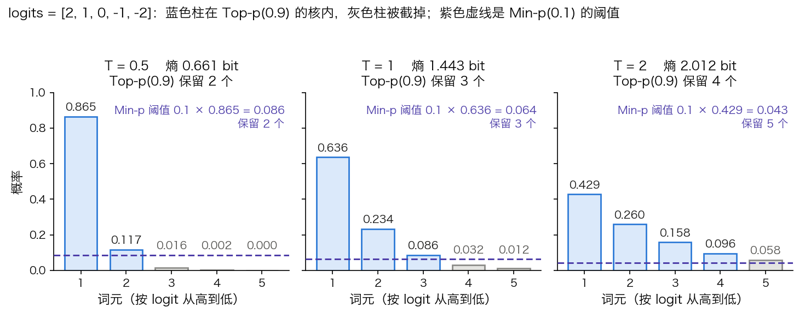
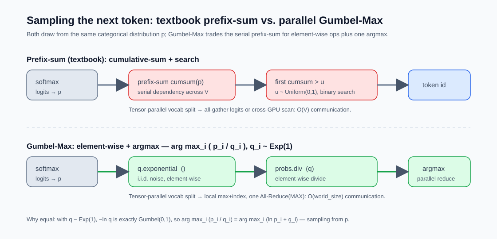

## 9.3 采样策略：温度、Top-k 与 Top-p 的设计直觉

9.2.5 的结论是概率最高的序列未必最好，最大化类方法在开放式生成里还会陷入重复。**采样**（sampling）换一个目标：不找最高概率，而是按模型给出的分布随机抽取下一个词元。直接从完整分布抽取也有问题，词表有十几万项，尾部每一项概率极小，合起来却不可忽略，抽中其中任何一个都可能让后文跑偏。本节的各种策略都在回答同一个问题：抽取之前，怎样改造这个分布。

对照图 9-1，温度是第③环，Top-k、Top-p、Min-p 是第④环，惩罚类参数是第②环，最后的抽取是第⑤环。全节用同一组 logits `[2, 1, 0, −1, −2]` 作算例，5 个词元按 logit 从高到低编号。

### 9.3.1 温度：调分布的熵

**温度**（temperature）$$\tau$$ 在 Softmax 之前把整行 logits 除以同一个正数：

$$
p_i = \frac{\exp(z_i / \tau)}{\sum_j \exp(z_j / \tau)}
$$

形状上是把 `logits[B, n_vocab]` 逐行除以该行请求自己的温度，结果仍是 `[B, n_vocab]`，批内每个请求可以有自己的温度。

**一格的算术。** 取 $$\tau = 1$$：五个指数是 `e² = 7.389`、`e¹ = 2.718`、`e⁰ = 1`、`e⁻¹ = 0.368`、`e⁻² = 0.135`，和为 11.611，第 1 个词元的概率是 `7.389 ÷ 11.611 = 0.636`。取 $$\tau = 0.5$$ 相当于 logits 变成 `[4, 2, 0, −2, −4]`，取 $$\tau = 2$$ 相当于 `[1, 0.5, 0, −0.5, −1]`。表 9-7 是三种温度下的完整结果。

| $$\tau$$ | $$p_1$$ | $$p_2$$ | $$p_3$$ | $$p_4$$ | $$p_5$$ | 熵（bit） | $$2^{H}$$ | Top-p(0.9) 保留 | Min-p(0.1) 保留 |
| ---: | ---: | ---: | ---: | ---: | ---: | ---: | ---: | ---: | ---: |
| 0.5 | 0.8647 | 0.1170 | 0.0158 | 0.0021 | 0.0003 | 0.661 | 1.58 | 2 个 | 2 个 |
| 1.0 | 0.6364 | 0.2341 | 0.0861 | 0.0317 | 0.0117 | 1.443 | 2.72 | 3 个 | 3 个 |
| 2.0 | 0.4287 | 0.2600 | 0.1577 | 0.0956 | 0.0580 | 2.012 | 4.03 | 4 个 | 5 个 |

表 9-7：同一组 logits 在三种温度下的概率、熵与截断结果。熵 $$H = -\sum_i p_i \log_2 p_i$$；$$2^{H}$$ 可读作“等效候选数”，5 个词元均匀分布时为 5。后两列在 9.3.3 和 9.3.4 用到。



图 9-4：表 9-7 的图示（[生成脚本](https://github.com/yeasy/llm_internals/blob/main/tools/figures/ch09_temperature_truncation.py)）。温度升高，分布变平，Top-p 的核随之变大；Min-p 的阈值随峰值一起下降。

**为什么除在 logits 上。** 它等价于对原概率取 $$1/\tau$$ 次幂再归一化：$$p_i^{(\tau)} \propto p_i^{1/\tau}$$。$$\tau = 0.5$$ 就是把 $$\tau = 1$$ 的概率逐项平方后归一化，`0.6364² ÷ (0.6364² + 0.2341² + …) = 0.8647`，与表中一致。幂运算保持大小顺序，所以温度不改变 argmax，只改变大小之间的差距。若改为把概率乘一个常数再归一化，结果原样返回，起不到调节作用。

**两个极限。** $$\tau \to 0$$ 时最大项的指数压倒其余各项，分布收缩到 argmax，等同贪心。实现里不会真的除以 0：vLLM 把温度低于 `1e-5` 的请求直接送入贪心分支；Hugging Face 要求温度严格为正，贪心由 `do_sample=False` 指定。$$\tau \to \infty$$ 时各项趋于相等，分布趋于均匀，Llama 3 词表下每个词元约 `1 ÷ 128,256 ≈ 7.8 × 10⁻⁶`。

**边界。** 温度对整行一视同仁。调高它，头部几个合理候选之间更均衡，尾部十几万个不合理候选的总质量也一起上涨。只靠温度无法同时得到“头部多样”和“尾部干净”，这是需要截断的原因。

### 9.3.2 Top-k：只留前 k 名

**Top-k 采样**只保留概率最高的 k 个词元，其余置零后重新归一化：

$$
p^{\text{top-}k}_i =
\begin{cases}
p_i \Big/ \sum_{j \in \text{Top-}k} p_j & i \in \text{Top-}k \\
0 & \text{其他}
\end{cases}
$$

[Fan 等人](https://arxiv.org/abs/1805.04833)在故事生成中用的是 `k = 10`。算例取 $$\tau = 1$$、`k = 2`：保留 0.6364 和 0.2341，和为 0.8705，归一化后是 `[0.7311, 0.2689]`。实现上不必真的算概率，把第 k 大的 logit 当阈值，低于它的置为 −∞ 即可；取前 k 大用部分选择，不需要对整张词表排序。

**边界。** k 是固定的，而合理候选的个数随上下文变化。“中华人民”之后几乎只有“共和国”一个合理续写，`k = 50` 会放进 49 个噪声；一句话的开头可能有上百种合理写法，`k = 50` 又砍掉了一半。

### 9.3.3 Top-p：只留累积概率达到 p 的核

**Top-p 采样**（nucleus sampling）由 [Holtzman 等人](https://arxiv.org/abs/1904.09751)提出。把词元按概率从高到低排列，取最短的前缀使累积概率达到 p：

$$
S = \{x_{(1)},\dots,x_{(m)}\},\qquad m = \min\Big\{m' : \sum_{i=1}^{m'} p_{(i)} \ge p\Big\}
$$

再在 S 内重新归一化。算例取 $$\tau = 1$$、`p = 0.9`：累积概率依次是 0.6364、0.8705、0.9567，第 3 个词元使它越过 0.9，故 `m = 3`；归一化后是 `[0.6652, 0.2447, 0.0900]`。

**集合大小跟着熵走。** 表 9-7 里同样的 `p = 0.9`，熵为 0.661 bit 时留 2 个，1.443 bit 时留 3 个，2.012 bit 时留 4 个。模型有把握时核小，没把握时核大，不需要像 k 那样按场景重调。常用取值是 0.9 到 0.95。

**失效情形：分布被拉平时，核里装满尾部。** Top-p 花的是一份固定的累积概率预算，不看买进来的每一项有多小。设某一步头部只有 1 个词元、概率 0.3，其余 0.7 均摊给 10,000 个尾部词元，每个 `7 × 10⁻⁵`。`p = 0.9` 要求再凑 0.6，需要 `0.6 ÷ (7 × 10⁻⁵) ≈ 8,572` 个尾部词元。归一化后，抽中尾部的概率是 `0.6 ÷ 0.9 = 2/3`。高温采样恰恰会制造这种分布。

**成本。** 求核需要按概率排序。Llama 3 的 logits 有 128,256 列，即 128,000 个基础词元加 256 个保留的特殊词元（见 9.1.3）。对这么多项做比较排序约 `n log₂ n ≈ 2.2 × 10⁶` 次比较，每行每轮一次，是采样阶段最贵的一步。vLLM 的 PyTorch 原生路径 `apply_top_k_top_p_pytorch` 在文档字符串里直接写明“排序在大批量下可能很慢”；9.3.8 会看到免排序的替代做法。

### 9.3.4 Min-p：阈值跟着峰值走

**Min-p 采样**（见 [Min-p 论文](https://arxiv.org/abs/2407.01082)）保留所有满足 $$p_i \ge \alpha \cdot p_{\max}$$ 的词元，$$\alpha$$ 是一个较小的比例。它逐个词元判断“相对峰值够不够格”，不看累积质量。

**长尾例。** 沿用上一小节的分布，取 $$\alpha = 0.1$$：阈值是 `0.1 × 0.3 = 0.03`，10,000 个尾部词元每个只有 `7 × 10⁻⁵`，全部淘汰，只剩头部 1 个。Top-p 在这里放进 8,572 个尾部词元，Min-p 一个不留，这就是“高温下更稳”的来源。

**边界。** 同一个例子也暴露了 Min-p 的另一面：

- 只剩 1 个候选时，采样退化为贪心，多样性归零。若那 10,000 个尾部词元其实是同样合理的续写（例如随机取一个名字），Min-p 会把它们全部丢掉。要留住它们需要 $$\alpha \le 7 \times 10^{-5} \div 0.3 \approx 2.3 \times 10^{-4}$$。
- $$\alpha$$ 与 Top-p 的 p 量纲不同，不能互相换算。
- 它并不总比 Top-p 严：表 9-7 中 $$\tau = 2$$ 时阈值是 `0.1 × 0.4287 = 0.0429`，5 个词元全部保留，Top-p(0.9) 只留 4 个。

Min-p 依赖 $$p_{\max}$$，因此与温度的先后有关。Hugging Face 把它排在温度之后，源码注释专门说明了这一点。

### 9.3.5 同一类方法：按某个判据截尾

Top-k、Top-p、Min-p 以及另外几种方法，做的都是同一件事：定一个判据，把不满足的词元置为 −∞。区别只在判据看什么，见表 9-8。

| 方法 | 保留条件 | 参数 | 判据看什么 |
| --- | --- | --- | --- |
| Top-k | 排名不超过 k | `top_k` | 名次 |
| Top-p | 落在累积概率达到 p 的最短前缀内 | `top_p` | 累积质量 |
| Min-p | $$p_i \ge \alpha\, p_{\max}$$ | `min_p` | 相对峰值的比例 |
| ε 采样 | $$p_i \ge \varepsilon$$ | `epsilon_cutoff` | 绝对概率 |
| η 采样 | $$p_i \ge \eta,\ \eta = \min(\varepsilon,\ \sqrt{\varepsilon}\, e^{-H})$$ | `eta_cutoff` | 绝对概率，阈值随熵下降 |
| 典型采样 | 信息量 $$-\log p_i$$ 最接近熵 H 的词元，累积到质量 τ | `typical_p` | 与熵的距离 |

表 9-8：几种截断方法的判据。参数名取自 Hugging Face 的 `GenerationConfig`；ε 与 η 采样出自 [Hewitt 等人](https://arxiv.org/abs/2210.15191)，典型采样出自 [Meister 等人](https://arxiv.org/abs/2202.00666)。

典型采样可能丢掉概率最高的词元，是表中唯一会改变 argmax 的方法。表中各方法只看当前这一行分布；[Mirostat](https://arxiv.org/abs/2007.14966) 走另一条路，它是带反馈的自适应 Top-k，每一步按已生成文本的实际困惑度调整 k，使困惑度维持在预设值附近。

### 9.3.6 直接改 logits：惩罚、偏置与水印

前面的方法不看历史，只看当前这一行分布。另一类参数根据已经生成的内容，直接改动个别词元的 logit，位于图 9-1 的第②环。

**重复惩罚。** `repetition_penalty` 源自 [CTRL 论文](https://arxiv.org/abs/1909.05858)。设系数 $$\theta > 1$$，对出现过的词元：

$$
z_i \leftarrow
\begin{cases}
z_i / \theta & z_i > 0 \\
z_i \cdot \theta & z_i \le 0
\end{cases}
$$

分符号处理是为了让正负 logit 都朝降低概率的方向变。算例：把第 1 个词元的 `z = 2` 除以 1.2 得 1.667，它的概率从 0.6364 降到 0.5564。

**频次惩罚与存在惩罚。** OpenAI 风格的 API 提供两个加性参数。设词元 j 已出现 $$c_j$$ 次：

$$
z_j \leftarrow z_j - c_j \cdot \alpha_{\text{freq}} - \mathbb{1}[c_j > 0] \cdot \alpha_{\text{pres}}
$$

`frequency_penalty` 按次数累加，重复越多扣得越多；`presence_penalty` 只要出现过就扣一个固定值。一个出现过 3 次的词元，在 $$\alpha_{\text{freq}} = 0.2$$、$$\alpha_{\text{pres}} = 0.5$$ 下被扣 `3 × 0.2 + 0.5 = 1.1`。vLLM 的 `apply_penalties` 逐字实现了这条公式，两个参数的取值范围是 −2 到 2。

**乘性与加性的差别。** 乘性惩罚的力度取决于 logit 自身的大小：$$\theta = 1.2$$ 时，`z = 5` 被减去 0.833，`z = 0.5` 只被减去 0.083，相差十倍；加性惩罚对两者都减同一个数。logit 的绝对尺度因模型而异，同一个 $$\theta$$ 换一个模型，效果可能差很多。

**统计范围不同。** Hugging Face 的重复惩罚默认把 Prompt 里的词元也算作“出现过”，要排除须传 `prompt_ignore_length`。vLLM 的重复惩罚同样统计 Prompt 加输出，频次与存在惩罚则只统计输出。迁移参数时要先确认范围。

**失效情形。**

- 惩罚分不清“复读”与“正当重复”。代码里的变量名、抽取任务里要原样照抄的实体、标点和虚词，都会被压低。Prompt 也计入时，模型被推着回避问题里出现过的词。
- 频次惩罚随长度累积。一篇长文里“的”出现 50 次并不异常，$$\alpha_{\text{freq}} = 0.2$$ 时它已被扣 `50 × 0.2 = 10`，相当于概率乘以 `e⁻¹⁰ ≈ 4.5 × 10⁻⁵`。输出越长，越容易在后半段变得不通顺。

**偏置。** `logit_bias` 给指定词元 ID 加一个常数，取很大的负值相当于禁用，很大的正值相当于强制。它与 9.4 的约束掩码同属第①环，区别是偏置表固定不变，掩码每一轮按语法状态重算。

**水印。** 文本水印也是对 logits 的偏置。[Kirchenbauer 等人](https://arxiv.org/abs/2301.10226)的做法是：每一步用前一个词元的哈希作随机种子。按它把词表分成占比 $$\gamma$$ 的绿名单和其余的红名单，给绿名单的 logit 统一加 $$\delta$$，再照常采样。检测方不需要模型，只需同一个哈希函数，数出文本里的绿词元个数 $$|s|_G$$，做单侧 z 检验：

$$
z = \frac{|s|_G - \gamma T}{\sqrt{T\,\gamma\,(1-\gamma)}}
$$

算例：$$\gamma = 0.5$$、长度 `T = 200`。无水印时绿词元的期望是 100，标准差 `√(200 × 0.25) = 7.07`；若数出 140 个，`z = 40 ÷ 7.07 = 5.66`。论文取 `z > 4` 为阈值，对应约 $$3 \times 10^{-5}$$ 的误报率。代价有两条：分布被人为扭曲；低熵文本（代码、事实性短答）里几乎每一步都只有一个合理词元，偏置插不进去，信号很弱。Hugging Face 把水印处理器排在所有其他处理之后。

### 9.3.7 组合与顺序：同一组参数，不同的分布

实际使用时这些策略叠在一起，例如 $$\tau = 0.7$$ 配 `top_p = 0.9`。处理的先后本身就是结果的一部分，而各引擎的默认顺序并不相同，见表 9-9。

| 引擎 | 默认顺序 | 依据 |
| --- | --- | --- |
| Hugging Face `generate()` | 重复惩罚 → 温度 → Top-k → Top-p → Min-p → 典型 → ε → η → 水印 | `_get_logits_processor` 中 `processors.append` 的先后 |
| vLLM | 白名单、禁词、`min_tokens`、`logit_bias` → 三种惩罚 → 温度 → Min-p → Top-k 与 Top-p | `Sampler` 类的文档字符串 |
| llama.cpp | 惩罚 → DRY → Top-nσ → Top-k → 典型 → Top-p → Min-p → XTC → 温度 | `common.h` 中 `samplers` 的默认值 |

表 9-9：三个引擎的默认采样顺序，均读自各自主干源码（[transformers](https://github.com/huggingface/transformers/blob/main/src/transformers/generation/utils.py)、[vLLM](https://github.com/vllm-project/vllm/blob/main/vllm/v1/sample/sampler.py)、[llama.cpp](https://github.com/ggml-org/llama.cpp/blob/master/common/common.h)）。表中只列本节讲到的处理器。前两者先调温度再截断；llama.cpp 把温度放在最后，顺序可用 `--samplers` 重排。

**先后差多少。** 取 $$\tau = 2$$、`top_p = 0.9`：

- 先温度后截断：分布先变成表 9-7 的第 3 行，累积到第 4 个词元才越过 0.9，保留 4 个，归一化为 `[0.4551, 0.2760, 0.1674, 0.1015]`。
- 先截断后温度：在 $$\tau = 1$$ 的分布上保留 3 个，再对这 3 个 logit 除以 2 后归一化，得 `[0.5065, 0.3072, 0.1863]`。

第 4 个词元的概率，一边是 0.10，一边是 0。先调温度时，温度会把尾部抬进核里；先截断时，温度只在已经选定的候选之间调整。“同一组参数换引擎后效果变了”，先查这张表。

### 9.3.8 从分布中抽取：Gumbel-Max 与指数竞赛

前面各步只是改造分布，最后仍要按概率抽出一个词元。

**教科书做法：前缀和加查找。** 取均匀随机数 $$u \sim \text{Uniform}(0,1)$$，对概率做前缀和，返回第一个累积值超过 u 的位置。它逻辑直观，但每个位置的累积值依赖前面所有位置，是“扫描加查找”的多趟、相互依赖的计算，不如逐元素运算适合 GPU。

**Gumbel-Max 技巧。** 给每个类别的对数概率加一份独立的 Gumbel 噪声，再取 argmax，所得的分布与按 p 抽样完全相同：

$$
\text{sample}(p) \;\overset{d}{=}\; \arg\max_i \big(\ln p_i + g_i\big), \quad g_i \overset{\text{iid}}{\sim} \text{Gumbel}(0, 1)
$$

标准 Gumbel 噪声可由均匀分布生成：$$g = -\ln(-\ln U)$$。

**实现用的是它的等价形式：指数竞赛。** vLLM 的 [`topk_topp_sampler.py`](https://github.com/vllm-project/vllm/blob/main/vllm/v1/sample/ops/topk_topp_sampler.py) 里，`random_sample` 对每个词元抽一个指数噪声，用概率除以噪声，再取 argmax。略去逐请求随机数发生器等分支，核心是：

```python
def sample_with_exponential_noise(logits):
    probs = logits.softmax(dim=-1, dtype=torch.float32)
    q = torch.empty_like(probs)
    q.exponential_()
    return probs.div_(q).argmax(dim=-1)
```

**为什么等价，三步即可证明。**

1. 令 $$q_i \sim \text{Exp}(1)$$。$$p_i / q_i$$ 最大，等价于 $$q_i / p_i$$ 最小。
2. 速率为 1 的指数变量除以 $$p_i$$，得到速率为 $$p_i$$ 的指数变量：$$q_i / p_i \sim \text{Exp}(p_i)$$。
3. 一组独立的指数变量里，第 i 个取得最小值的概率是它的速率占总速率的比例：$$p_i / \sum_j p_j = p_i$$。

与 Gumbel 形式的联系是取对数：$$\ln(p_i/q_i) = \ln p_i - \ln q_i$$，而 $$-\ln q_i$$ 恰好服从 Gumbel(0, 1)。用本节的 5 个概率做 100 万次模拟，各词元被选中的频率是 `[0.6362, 0.2345, 0.0860, 0.0317, 0.0116]`，与表 9-7 第 2 行吻合到小数点后第 3 位。

**GPU 视角。** 整个过程只有三步：

1. `q.exponential_()`：独立随机数，逐元素，无依赖。
2. `probs.div_(q)`：逐元素除法，无依赖。
3. `argmax(dim=-1)`：一次标准的并行规约。

贪心解码是直接 argmax，随机采样只多了一步“除以噪声”，两者在内核层面汇合到同一个规约。



图 9-5：教科书式前缀和抽样与 Gumbel-Max（指数竞赛）抽样的执行流对比。后者把带依赖的前缀和换成逐元素运算加一次 argmax。图中的 prefix-sum 指教科书式实现，不指 `torch.multinomial`。

**几个实现细节。**

- PyTorch 自己也这样做。`torch.multinomial` 在只抽 1 个样本或无放回抽样时，走的正是 `q = empty_like(p).exponential_(1)`、相除、argmax 这条快速路径，源码注释写明它来自 Gumbel-Softmax。vLLM 仍然自己实现一遍，文档字符串给的理由是 `torch.multinomial` 会引入 CPU 与 GPU 的同步；自己实现还便于给个别请求换上独立的随机数发生器。
- Softmax 强制用 FP32。FP16 能表示的最小正数约 `6 × 10⁻⁸`，比它小的概率直接变成 0；BF16 只有 7 位尾数，相对精度约 0.8%。12.8 万项的长尾在半精度下会整段失真，vLLM 在处理链一开始就把 logits 转成 FP32，另有 `use_fp64_gumbel` 选项让噪声用 FP64。
- 指定了 Top-k 或 Top-p 时，默认路径并不是上面这段代码。CUDA 上若 FlashInfer 可用，`TopKTopPSampler` 走 `forward_cuda`，由 FlashInfer 的拒绝采样内核一步完成截断与抽样，免去 9.3.3 的整表排序。源码注明它与 `random_sample` 只是统计等价，同一个种子下两条路径的输出不保证相同。指数竞赛用于未指定 Top-k 与 Top-p 的请求，以及 `forward_native` 回退路径；带 `seed` 的请求（FlashInfer 不支持逐请求随机数发生器）和开启 `use_fp64_gumbel` 时也回到这条路径。
- 词表沿张量并行切分时，裸的全词表抽样可以用“每卡局部最大值加一次全局带下标的 max 规约”完成。一旦有 Top-p、禁词表或约束掩码，就需要全局的候选集合或概率质量，实际通信收益取决于框架的实现。

> [!NOTE]
> 指数竞赛与前面的温度、截断并不互斥。前者决定怎样从分布中抽取，后者决定分布的形状。

### 9.3.9 可复现性：种子、批组成与并列

**种子。** 采样的随机性来自噪声 q。vLLM 的 `seed` 参数为该请求单独建一个随机数发生器，只改写 q 中属于它的那一行；源码里的 TODO 写明这条路径逐请求处理、较慢。同一个种子只在同一引擎、同一条代码路径下可复现，换引擎或换路径都不保证。

**`temperature = 0` 也可能不确定。** 贪心解码不用随机数，输出却仍可能因运行而异。[Thinking Machines 的实验](https://thinkingmachines.ai/blog/defeating-nondeterminism-in-llm-inference/)用 Qwen3-235B-A22B-Instruct-2507 在温度 0 下对同一提示生成 1,000 次、每次 1,000 个词元。结果有 80 种不同的输出，最常见的一种出现 78 次。各输出的前 102 个词元完全相同，此后才分叉。

机制分三环：

1. 浮点加法不满足结合律，规约的先后不同，结果的末位就不同。
2. 多数矩阵乘法与注意力内核会按批大小选择不同的分块与规约方式，同一个请求与不同的请求拼批，logits 的末位不同。批大小由服务器当时的负载决定，对单个用户而言是随机的。
3. 两个候选的 logit 几乎并列时，末位的差异足以翻转 argmax。一个词元不同，它就成为后续所有轮次的条件（9.1.1），两条输出从此分道。

对策是让内核的结果与批大小无关，即**批不变**（batch-invariant）内核，代价是放弃一部分按批优化的性能。强化学习训练对这一点格外敏感，见 [8.2 节](../08_alignment/8.2_rlhf.md)的训练与推理失配。工程上的结论是：不要把 `temperature = 0` 当作可复现的保证；需要逐位复现时，固定批组成或启用引擎的确定性模式。
