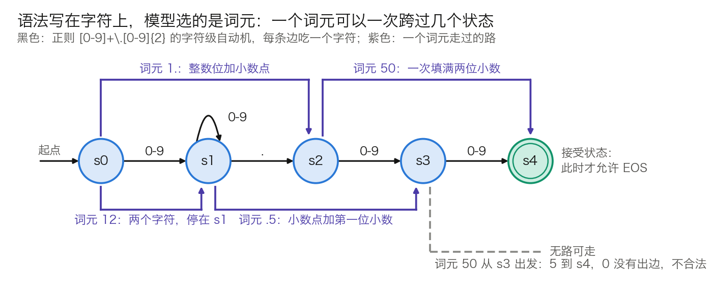

## 9.4 结构化输出与约束解码

9.3 节的采样只看概率。输出若要交给程序解析，例如一个 JSON 对象、一条 SQL、一次函数调用，概率再高也不等于格式合法：少一个引号、多一个逗号，下游就解析失败。本节讲**约束解码**（constrained decoding）：在图 9-1 的第①环按语法遮掉不合法的词元，使输出必然可解析。先比较三种拿到结构化输出的办法，再讲一步约束解码怎样进行、难点在哪里、它保证什么、又付出什么代价。引擎怎样在几十微秒内为十几万词元的词表算出掩码，放在 [11.7 节](../11_serving/11.7_constrained_decoding.md)。

### 9.4.1 三种拿到结构化输出的办法

| 办法 | 做法 | 保证强度 | 成本 | 对输出分布的影响 |
| --- | --- | --- | --- | --- |
| Prompt 加校验重试 | 在 Prompt 里描述格式，解析失败就重新生成 | 无保证，只有成功率 | 失败时整条重来，尾延迟高 | 无 |
| 微调 | 用目标格式的数据训练 | 成功率更高，仍无保证 | 训练成本；格式一变就要重训 | 改变模型本身 |
| 约束解码 | 每一轮按语法遮掉不合法词元 | 语法层面必然合法 | 每轮在 CPU 上算掩码 | 逐步归一化会扭曲分布，见 9.4.5 |

表 9-10：三种办法的取舍。三者可以叠加，生产系统里常见的组合是 Prompt 写明格式，再加约束解码兜底。

“只有成功率”在多步流程里会被放大。设单次输出的格式错误率是 5%，期望的生成次数是 `1 ÷ 0.95 ≈ 1.05`，看上去无关紧要；但一个 10 步的智能体流程，每一步都要产出一次合法的工具调用，10 步全部一次通过的概率只有 `0.95¹⁰ ≈ 0.60`，四成的流程至少要重试一次。错误率降到 1%，这个数是 `0.99¹⁰ ≈ 0.90`，仍有一成。约束解码把这一项直接变成 1。

### 9.4.2 一步约束解码：状态、掩码、采样、转移

约束解码给解码循环加了一个随输出前进的**语法状态** $$s_t$$。每一轮做四件事：

1. **取合法集合。** 由当前状态得到 $$V_{\text{valid}}(s_t)$$，即“接上去之后仍是某个合法字符串的前缀”的全部词元。
2. **加掩码。** 合法词元加 0，其余加 −∞：`logits[B, n_vocab] + M[B, n_vocab] → [B, n_vocab]`。批内每个请求有自己的语法和自己的状态，`M` 的各行互不相同。
3. **照常选词。** 后面的惩罚、温度、截断、抽取都不变。Softmax 之后，−∞ 变成概率 0，其余词元自动重新归一化：

$$
P_{\text{constrained}}(x) =
\begin{cases}
P(x) \Big/ \sum_{x' \in V_{\text{valid}}(s_t)} P(x') & x \in V_{\text{valid}}(s_t) \\
0 & \text{其他}
\end{cases}
$$

4. **状态转移。** 用选中的词元更新状态：$$s_{t+1} = \delta(s_t, x)$$。

两条细则决定了它能否正常工作。EOS 只在接受状态合法，否则输出会停在半截。掩码必须排在 Top-k、Top-p、Min-p 之前：若先截断，合法词元可能已被全部丢掉，加上掩码后整行都是 −∞（算例见 11.7.6）。

模型本身不受影响。权重、注意力、KV 缓存都照旧，改动只在 LM head 之后。

### 9.4.3 难点：语法写在字符上，模型选的是词元

**问题。** 正则表达式和 JSON Schema 描述的是字符序列，模型的字母表却是词元。一个词元可以是某个语法成分的一部分，也可以横跨两三个成分。所以不能拿字符级的“下一个合法字符”直接筛词表，而要问：从当前状态出发，把这个词元的字符逐个走完，中途会不会无路可走。

**一个可手算的例子。** 要求输出两位小数的金额，正则是 `[0-9]+\.[0-9]{2}`。它编译成 5 个状态的字符级自动机：`s0` 是起点；读到数字进入 `s1`，并可继续读数字；读到小数点进入 `s2`；再读两个数字，经 `s3` 到达接受状态 `s4`。教学词表取 10 个词元：`0`、`1`、`5`、`12`、`50`、`.`、`.5`、`1.`、`a` 和 EOS。

图 9-6：正则 `[0-9]+\.[0-9]{2}` 的字符级自动机，以及几个多字符词元走过的路（[生成脚本](https://github.com/yeasy/llm_internals/blob/main/tools/figures/ch09_token_vs_char.py)）。

对每个状态、每个词元各试走一遍，得到表 9-11。以 `s2` 为例：词元 `50` 的 `5` 到 `s3`、`0` 到 `s4`，合法，落点 `s4`；词元 `.5` 的第一个字符是小数点，`s2` 没有读小数点的出边，不合法。

| 状态 | 合法词元与落点 | 合法数 |
| --- | --- | ---: |
| `s0` | `0`、`1`、`5`、`12`、`50` → `s1`；`1.` → `s2` | 6 |
| `s1` | `0`、`1`、`5`、`12`、`50` → `s1`；`.`、`1.` → `s2`；`.5` → `s3` | 8 |
| `s2` | `0`、`1`、`5` → `s3`；`12`、`50` → `s4` | 5 |
| `s3` | `0`、`1`、`5` → `s4` | 3 |
| `s4` | EOS | 1 |

表 9-11：各状态下的合法词元。词元 `a` 在任何状态都不合法；EOS 只在 `s4` 合法。

从这张表读出三件事：

- **词元横跨语法成分。** `.5` 既含小数点又含第一位小数，从 `s1` 直达 `s3`；`1.` 从 `s0` 直达 `s2`。按“一个词元对应一个语法成分”来实现，会把它们误判为不合法。
- **合不合法取决于状态。** `50` 在 `s2` 合法，在 `s3` 不合法，因为它会写出第三位小数。掩码因此必须每一轮重算。
- **同一字符串有多种切法。** “12.50” 可以是 `12`、`.5`、`0`，也可以是 `12`、`.`、`50`。掩码不偏向分词器的规范切法，后果见 11.7.7。

**真实规模下不能每轮试走。** 表 9-11 只有 `5 × 10` 格。真实词表是 128,256 项，每轮把每个词元试走一遍，按 11.7.4 的假设值约需 3.2 ms，与一轮 Decode 的 4.8 ms 同量级。批内请求一多，它就成了瓶颈。引擎的做法是把表 9-11 这样的“状态到合法词元”的索引在请求开始前算好并缓存，运行时只查表，见 11.7.2。

### 9.4.4 从正则到嵌套结构

正则表达式对应有限状态自动机，状态数有限，上一小节的索引可以整表预计算。JSON 一般情形不行：`[[[1]]]` 要求左右括号数目相等，层数不设上限时，有限个状态数不过来。这类语法要用上下文无关文法描述，对应的机器在有限状态之外还带一个栈。

后果有两条。不含递归、嵌套层数固定的 JSON Schema 可以先展开成正则，仍走有限状态的路。含递归引用或要求“任意合法 JSON”时，合法集合依赖整个栈，状态无法枚举，整表预计算做不下去。XGrammar 的办法是把词元分成“只看栈顶就能判定”和“要看整个栈”两类，前者预计算，后者运行时再判，后者只占词表的不到 1%（机制与数字见 11.7.3）。

### 9.4.5 代价：逐步归一化改变了分布

约束解码保证输出属于语法定义的语言，不保证它是模型在这个语言里最想说的那一句。

**理想目标。** 应当得到的是原分布在合法输出上的条件分布。写成逐步的形式：

$$
p(y_t \mid y_{<t},\ \text{合法}) \;\propto\; p(y_t \mid y_{<t}) \cdot F(y_{\le t})
$$

其中 $$F(y_{\le t})$$ 是“沿这个前缀继续生成，最终落在语法内”的总概率。

**实际做法。** 逐步掩码只检查“这一步能否走通”，相当于把所有尚未走死的前缀的 F 一律当成 1。

**算例。** 设某一步有两个合法词元 a 和 b，模型给的概率是 0.7 和 0.3。选 a 之后，模型想写的后续大多不合语法，$$F = 0.2$$；选 b 之后 $$F = 0.9$$。理想的条件分布是 `0.7 × 0.2 = 0.14` 对 `0.3 × 0.9 = 0.27`，归一化后 a 为 0.34、b 为 0.66。逐步掩码仍按 0.7 对 0.3 抽取，a 被高估约 2 倍。选中 a 之后，模型原本想写的内容被遮掉，只能在剩下的 20% 里挑一个，输出合法，但不是它原本要说的。

[Grammar-Aligned Decoding](https://arxiv.org/abs/2405.21047) 一文把这个偏差形式化，并指出精确修正需要估计每个前缀的 F，一般情形下只能靠多次采样逐步逼近。工程上的对策是让掩码尽量少出手：把格式同时写进 Prompt，让语法贴合模型要说的话，把推理字段排在答案字段之前。11.7.7 逐条展开。

### 9.4.6 保证什么，不保证什么

- **保证的是前缀合法，不是输出完整。** 触到 `max_tokens` 被截断的 JSON 照样解析失败，调用方要检查结束原因（见 9.1.3）。
- **语法合法不等于语义正确。** 字段齐全、类型正确，取值仍可能是编的。字段含义、业务约束、安全权限都不在语法里，生产系统仍需要 Schema 校验之外的语义校验、超时控制和失败回退。
- **语法过松时模型可能不停。** 语法允许任意多的空白时，模型可以一直输出空格或换行直到长度上限。
- **各后端支持的 JSON Schema 只是子集。** 不支持的关键字有的报错，有的被静默忽略；后一种情形下，实际约束比预期弱。
- **Prompt 与语法冲突时，质量下降。** Prompt 要求 Markdown、语法要求 JSON，模型的首选词元每一轮都被遮掉，9.4.5 的偏差最大。

**工具调用通常只约束一段。** 模型先自由作答，写出某个触发标记之后才进入受约束的参数段，结束后回到自由文本。vLLM 的 `structural_tag` 和 llama.cpp 的惰性语法（`grammar_lazy` 与 `grammar_triggers`）都是这种用法。全程约束会连模型“是否调用工具”的决定一起限制住。

### 9.4.7 对到 API 与引擎

OpenAI 风格的接口用 `response_format` 表达约束：`{"type": "json_object"}` 只要求输出是合法 JSON；`{"type": "json_schema", "json_schema": {...}}` 要求符合给定的 Schema。

vLLM 把约束放在 `SamplingParams.structured_outputs` 里，类型是 `StructuredOutputsParams`，字段 `json`、`regex`、`choice`、`grammar`、`json_object`、`structural_tag` 各对应一种约束；后端由 `StructuredOutputsConfig.backend` 选择，可取 `auto`、`xgrammar`、`guidance`、`outlines`、`lm-format-enforcer`，默认 `auto`。旧版本把这项功能称作引导解码（guided decoding），参数名为 `guided_json`、`guided_regex` 等，这些字段已在 v0.12.0 移除。读旧文档和旧代码时两套名字指的是同一件事。

各后端的构造方式（Outlines 的有限状态索引、XGrammar 的下推自动机、llguidance 的运行时解析）见 11.7 节。掩码与前向的重叠执行、确定性片段的跳跃前进、与投机解码的配合也在那里。
