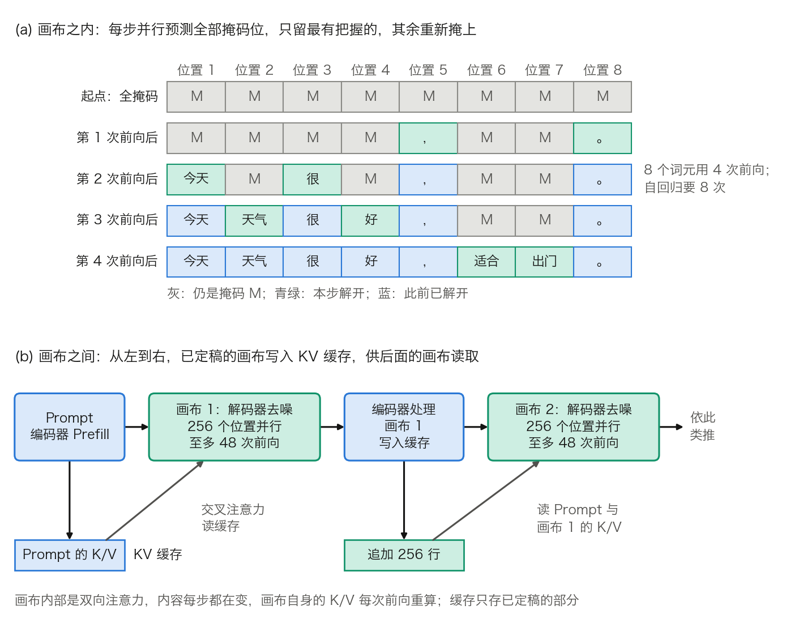

## 9.6 扩散语言模型：另一种生成范式

本章到这里讨论的所有策略，贪心、束搜索、采样、约束解码、推理时扩展，都建立在 9.1.1 的那条链式分解上：文本从左到右、一次一个词元地生成。这个前提很自然，容易被当成语言建模的唯一形态。本节介绍一条不同的路线，**扩散语言模型**（diffusion language model，dLLM）。它今天并未取代自回归，但它把“生成必须串行”这个假设摆上了台面，由此可以分清自回归的哪些代价是生成任务固有的，哪些只是这种分解方式带来的。

### 9.6.1 从掩码去噪到生成

**加噪方式。** 图像扩散模型在连续空间里逐步加噪、再学习去噪。文本是离散的，需要另一种加噪。离散扩散（[D3PM](https://arxiv.org/abs/2107.03006)）给出的构造是吸收态：把“加噪”定义为将词元替换成特殊的 `[MASK]`，“去噪”就是把掩码位置还原成真实词元。这条线经 [SEDD](https://arxiv.org/abs/2310.16834)、[MDLM](https://arxiv.org/abs/2406.07524) 发展，[LLaDA](https://arxiv.org/abs/2502.09992) 把它做到 8B 规模，并与同量级的自回归模型正面比较。

**训练目标。** 每个训练样本先抽一个掩码比例 $$t \sim U[0,1]$$，再让每个词元以概率 t 独立地被掩掉，得到 $$x_t$$。模型是一个不带因果掩码的 Transformer，输入 $$x_t$$，同时预测所有被掩位置。LLaDA 的损失是只在被掩位置上计算的交叉熵，再乘以 `1/t`：

$$
\mathcal{L}(\theta) = -\,\mathbb{E}_{t,\,x_0,\,x_t}\left[\frac{1}{t}\sum_{i=1}^{L} \mathbb{1}[x_t^i = \text{M}]\,\log p_\theta(x_0^i \mid x_t)\right]
$$

L 是序列长度，M 表示掩码。权重 `1/t` 的作用可以这样看：长度 `L = 8`、`t = 0.25` 时，期望只有 `8 × 0.25 = 2` 个位置被掩，求和只有 2 项；除以 t 之后量级回到 8，不同掩码比例的样本对损失的贡献才可比。带上这个权重，该损失是模型负对数似然的上界，MDLM 等工作给出了证明。最小化它等于最大化似然的一个下界，训练目标因此与最大似然有明确的联系。

**与 BERT 的差别。** 两者的输入输出形式几乎一样，差在掩码比例。BERT 用固定比例（约 15%），只学会了在“少量空缺”这一种损坏程度上填空。掩码扩散的 t 在 0 到 1 之间均匀取值，模型必须在所有损坏程度上都学会还原，包括 t 接近 1、几乎什么都看不见的情形，而那正是生成的起点。

**推理：迭代去噪。** 从一段全掩码的序列出发，每一步做三件事：

1. 一次前向，同时预测所有掩码位置的分布。
2. 每个位置各自选出一个词元，并得到一个置信度（例如所选词元的概率，或该位置分布的熵）。
3. 保留最有把握的若干个位置，其余重新掩上，进入下一步。

表 9-13 用一个 8 位置的教学例走一遍：目标句是“今天 天气 很 好 ， 适合 出门 。”，共 4 步，每步解开置信度最高的 2 个位置。词元与置信度均为手工设定，只为显示流程。

| 步 | 仍被掩的位置 | 各掩码位置的预测与置信度 | 本步解开 |
| ---: | --- | --- | --- |
| 1 | 1 到 8 | 今天 0.41、天气 0.35、很 0.52、好 0.30、， 0.88、适合 0.22、出门 0.19、。 0.97 | 位置 8、5 |
| 2 | 1、2、3、4、6、7 | 今天 0.81、天气 0.62、很 0.79、好 0.58、适合 0.33、出门 0.27 | 位置 1、3 |
| 3 | 2、4、6、7 | 天气 0.93、好 0.90、适合 0.47、出门 0.40 | 位置 2、4 |
| 4 | 6、7 | 适合 0.86、出门 0.84 | 位置 6、7 |

表 9-13：8 个位置、4 步的去噪过程。先定下来的是句末标点这类几乎不依赖上下文的位置；已解开的位置成为后续步骤的条件，其余位置的置信度随之上升。

8 个词元用了 4 次前向，自回归需要 8 次。步数是一个可以直接设定的超参数：步数少则快，步数多则每步解开得少、更稳。朴素自回归的前向次数被生成长度锁死；投机解码（[10.6 节](../10_inference_optimization/10.6_speculative_decoding.md)）松动了这一点，但能松多少取决于接受率，不能预先设定。

**并行的代价：同一步内的位置是独立采样的。** 模型给出的是每个位置各自的边缘分布，同一步解开的几个位置之间没有联合约束。设两个位置的真实联合分布只有两种等概率的组合：“北京 烤鸭”和“上海 小笼”。两个位置的边缘分布都是一半对一半，独立采样会以 `0.5 × 0.5 = 0.25` 的概率得到“北京 小笼”，以同样的概率得到“上海 烤鸭”，合计一半的样本在联合分布下概率为 0。自回归没有这个问题：第二个位置以已选定的第一个位置为条件。

这就是“步数少则质量降”的机制：每步解开的位置越多，被忽略的相关性越多。对策也由此而来。只解开置信度高的位置，是因为分布接近确定时，独立采样与联合采样几乎没有差别；[Fast-dLLM](https://arxiv.org/abs/2505.22618) 把质量下降的根源归结为条件独立假设破坏了词元间的依赖，并据此提出按置信度阈值选择并行解开的位置。

### 9.6.2 为什么这可能更快：换掉瓶颈的性质

**自回归 Decode 浪费了什么。** 按 [10.1 节](../10_inference_optimization/10.1_bottleneck.md)的口径，BF16 的稠密模型每读 2 字节权重只做约 2 次运算，算术强度约为 1；H100 的拐点约为 295。单请求 Decode 时，算力有两个多数量级是闲着的，每轮耗时约等于把权重读一遍的时间。

**扩散解码用掉了这份闲置。** 一次前向处理整个画布。画布长 256 时，同一遍权重读取换来 256 个位置的计算，算术强度约为 256，接近而未超过拐点。于是一次画布前向的耗时与自回归的一轮 Decode 大致相当，却能定下十几个词元。前向次数降下来，延迟就降下来。

**红利的作用域。** 这份闲置算力只在低并发下存在。

- 两个请求拼批，每次前向就是 `2 × 256 = 512` 个位置，已经越过 295，进入算力受限区，耗时开始随批大小线性增长。
- 自回归也可以靠拼批把工作点推到拐点，批大小约 295 时同样吃满算力。到那时比的是每个词元的计算量，而扩散每个词元要多算十几遍（见 9.6.3 的表 9-14），吞吐反而更低。

所以这类模型目前定位在本地、单用户或低并发的场景。官方的 vLLM 部署示例把 `--max-num-seqs` 设为 4，与这个判断一致。

这也是本书反复出现的一条主线：很多优化的本质，是把工作改写成硬件更擅长的形状，而不是让工作变少。10.6 节的并行块草稿是同一个思路在投机解码上的体现，那里的草稿器用的正是块扩散。

### 9.6.3 现实中的折中：块内扩散，块间自回归

**全序列扩散的两个工程难题。** 一是生成长度要预先确定。二是 KV 缓存难以复用：注意力是双向的，任何一个位置改变，所有位置的 K、V 都跟着变，精确计算下每一步都要整段重算。近似的缓存方案已经出现，例如 Fast-dLLM 的分块近似缓存和 [dKV-Cache](https://arxiv.org/abs/2505.15781) 的延迟缓存，代价是引入近似误差。

**块扩散。** [Block Diffusion](https://arxiv.org/abs/2503.09573) 给出折中方案：块内扩散，块间自回归。Google 的 DiffusionGemma 是一个公开可查的实例。按其[官方模型卡](https://ai.google.dev/gemma/docs/diffusiongemma/model_card)，它基于 Gemma 4 架构，是一个 MoE 模型，总参数 25.2B、激活 3.8B。128 个专家中激活 8 个，另有 1 个共享专家；生成被划分为长 256 个词元的“画布”（canvas）。

**怎样落到缓存上。** 模型卡写明它是编码器-解码器结构，图 9-7 的下半幅画出了这个流程：

1. 自回归的编码器以 Prefill 的方式处理 Prompt，写出 KV 缓存。
2. 解码器在画布的 256 个位置上做双向注意力，并通过交叉注意力读取缓存里的上下文。画布内容每步都在变，画布自身的 K、V 每次前向重算。
3. 一个画布去噪完成后，由编码器处理一遍，把它的 K、V 追加到缓存里，再开始下一个画布。

已定稿的部分只算一次、长期复用，与自回归的 KV 缓存相同；反复重算的只有当前这 256 个位置。

图 9-7：(a) 表 9-13 的去噪过程；(b) DiffusionGemma 模型卡描述的块间流程（[生成脚本](https://github.com/yeasy/llm_internals/blob/main/tools/figures/ch09_block_diffusion.py)）。

**采样器。** 模型卡给出的配置把 9.6.1 的“保留最有把握的”落到了可操作的判据上：去噪步数上限 48；logits 的温度从 0.8 线性降到 0.4；每一步选出熵最低的一批位置，未选中的位置全部重新掩上；当画布上的平均熵低于阈值、且各位置的最高概率词元连续两步不变时，提前停止。

**把乘积算出来。** 前向次数少了，每次前向却大了，净效果要看乘积，见表 9-14。

| 方案 | 每画布前向次数 | 每次前向的位置数 | 位置·前向 | 相对自回归的计算量 |
| --- | ---: | ---: | ---: | ---: |
| 自回归 | 256 | 1 | 256 | 1 倍 |
| 扩散，跑满 48 步 | 48 | 256 | 12,288 | 48 倍 |
| 扩散，每次前向定下 20 个词元 | 12.8 | 256 | 约 3,277 | 约 13 倍 |
| 扩散，每次前向定下 15 个词元 | 17.1 | 256 | 约 4,369 | 约 17 倍 |

表 9-14：生成 256 个词元的前向次数与计算量。后两行由模型卡给出的“每次前向产出 15 到 20 个词元”换算：`256 ÷ 20 = 12.8`，`256 ÷ 15 ≈ 17.1`。每个画布另有一次编码器前向，未计入。

计算量是自回归的 13 到 17 倍，前向次数是它的 1/15 到 1/20。在单请求、带宽受限的条件下，决定延迟的是前向次数，多出来的计算用的是本来闲置的算力；并发一高，这 13 到 17 倍就成了实打实的成本。模型卡给出的速度是低批量下每用户超过 1,100 词元/秒（H100，FP8），同样限定了低批量。

**MoE 让账再打一个折扣。** 自回归 Decode 每轮每层只读被激活的 8 个专家。画布的 256 个位置各选 8 个专家，若路由近似均匀，某个专家没有被任何位置选中的概率是 `(1 − 8/128)²⁵⁶ ≈ 7 × 10⁻⁸`，即每次前向几乎要读全部 128 个专家。按带宽受限粗估，FP8 下画布前向要读 25.2 GB，约 `25.2 ÷ 3,350 ≈ 7.5 ms`；同一个模型做自回归只读 3.8 GB，约 1.1 ms。每次前向贵了约 6.6 倍，换来 15 到 20 个词元，净收益约为 `15 ÷ 6.6` 到 `20 ÷ 6.6`，即 2.3 到 3 倍。这笔账忽略了 KV 读取、编码器前向和内核开销，只用来说明量级：稀疏模型的权重读取本来就省，留给扩散去套利的空间比稠密模型小。

**宣传倍数要带着基线读。** Google 的[开发者博客](https://developers.googleblog.com/diffusiongemma-the-developer-guide/)称 GPU 上的词元生成“最高快 4 倍”，同一句话里没有说明作为基线的自回归模型和批大小。缺少基线的倍数不宜作为可比较的结论引用；模型卡里带硬件和精度条件的绝对吞吐更有用，实际收益仍要在自己的负载上测。

### 9.6.4 与本章其他环节的接口

**采样参数。** 自回归下，温度和截断作用于“下一个词元”的一行分布。扩散解码每步有 256 行分布，温度逐行作用；另外多出一个自回归没有的选择，即这一步解开哪些位置。DiffusionGemma 的温度随步数下降，早期的高温维持多样性，后期的低温让结果收敛。9.3 节的参数因此不能原样照搬，调参的对象从“一个分布”变成了“一条去噪轨迹”。

**约束解码。** 9.4 节的语法状态是沿着前缀从左到右推进的。画布内的位置不按顺序解开，某个位置要填什么，取决于它左边还没定下来的内容，前缀自动机无从查起。块与块之间仍可按前缀约束，块内则需要别的办法。扩散模型在结构化输出上的表现仍是开放问题，原因就在这里。

### 9.6.5 如何看待这条路线

1. **自回归是一种分解方式，不是语言建模的定义。** 链式法则的从左到右只是可行的分解之一。把它当作前提，就会把它带来的代价误认成生成本身的代价。
2. **它把“生成长度”与“前向次数”解耦了。** 朴素自回归中两者严格相等；投机解码把比值压到 1 以下，压多少取决于接受率；扩散把前向次数变成一个可以直接设定的质量与速度旋钮，代价是 9.6.1 的条件独立近似。
3. **它的收益来自瓶颈转换，不是计算量下降。** 总计算量是自回归的十几倍，只是更贴合硬件的并行结构。这与 FlashAttention、投机解码是同一个模式。它套利的是低并发时闲置的算力，收益随并发升高而消退。

它能否在质量上全面追平自回归，以及在长上下文下的表现，目前仍无定论。
