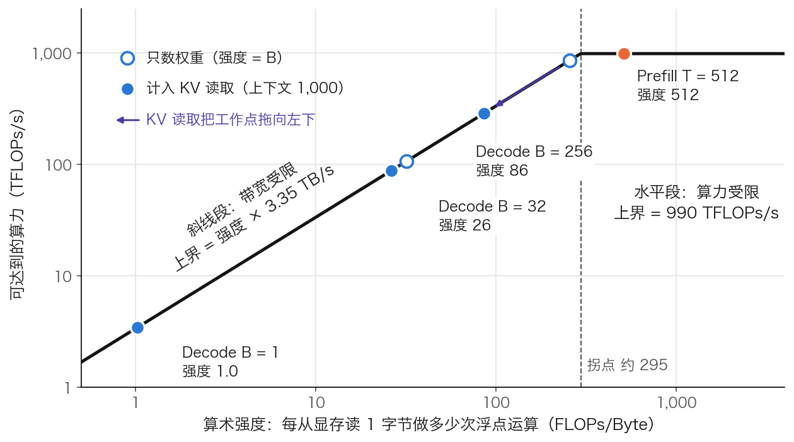

## 10.1 推理瓶颈分析：计算密集还是访存密集

推理优化要先回答一个问题：时间花在计算上，还是花在搬数据上。本节把 prefill 与 decode 分开算账，用 Roofline 模型把“访存密集”变成一个可以代数判断的条件，再由它推出批大小能推多远、各类优化分别移动哪个量。第九章末尾把扩散语言模型的收益归结为“瓶颈转换，而不是计算量下降”；判断一次优化转换了什么瓶颈，需要的就是这把尺子。算例沿用 [3.8 节](../03_components/3.8_gpt_inference_flow.md)表 3-3 的 Llama 3 8B，硬件取 H100 SXM 80 GB。

### 10.1.1 两个阶段的不同特性

一次请求的推理分成两个阶段（逐步手算见 3.8.4 与 3.8.5）。

**预填充阶段**（Prefill）一次处理 Prompt 的全部 T 个词元，产出首词元并写好 KV 缓存。每个线性层做的是矩阵乘矩阵：`X[T, d_model] × W[d_model, d_out] → [T, d_out]`。读一遍权重，换来 T 行结果，算力是瓶颈，因此是**计算密集型**（compute-bound）。

**生成阶段**（Decode）每轮只送进一个新词元，读取此前全部 K/V，产出下一个词元。每个线性层退化为向量乘矩阵：`x[1, d_model] × W[d_model, d_out] → [1, d_out]`。同样读一遍权重，只换来一行结果，显存带宽是瓶颈，因此是**访存密集型**（memory-bound）。

两个阶段各对应一个延迟指标。TTFT（Time To First Token，首词元时间）是从请求到达到首词元产出的时间，由排队时间加 prefill 时间决定。TPOT（Time Per Output Token，每输出词元时间）是相邻两个输出词元的间隔，等于 decode 的单步时间。吞吐是单位时间内所有请求产出的词元总数，批大小为 B 时约为 `B ÷ TPOT`。表 10-1 把两个阶段并排。

| 项目 | Prefill | Decode |
| --- | --- | --- |
| 一次前向送入的词元数 | T（整个 Prompt） | 每个请求 1 个 |
| 线性层的形状 | `[T, d] × [d, d_out]` | `[1, d] × [d, d_out]` |
| 注意力分数的形状（每头） | `[T, T]` | `[1, t]`，t 为已有长度 |
| 从显存读什么 | 全部权重 | 全部权重，加本请求全部 K/V |
| 往显存写什么 | 每层 T 行 K/V | 每层 1 行 K/V |
| 瓶颈 | 算力 | 显存带宽 |
| 决定的指标 | TTFT | TPOT 与吞吐 |

表 10-1：Prefill 与 Decode 的形状、访存与瓶颈对照。

### 10.1.2 访存瓶颈的数学解释

**Decode 一步读什么。** 一轮 decode 逐层执行。第 ℓ 层先把本层的注意力权重和 MLP 权重从显存读到计算单元，再读本层缓存的 t 行 K/V，算出新位置的表示，并向缓存追加一行 K/V。32 层走完，全部权重恰好被读过一遍，KV 缓存也被读过一遍。嵌入表是例外：每步只取一行。

**一格算术。** Llama 3 8B 的参数量 N 约为 8.03 B，BF16 下权重 `8.03 B × 2 = 16.06 GB`。H100 的显存带宽为 3.35 TB/s，BF16 稠密峰值约 990 TFLOPs/s。单请求、暂不计 KV：

- 访存：`16.06 GB ÷ 3,350 GB/s ≈ 4.8 ms`，单请求的速度上限约 209 词元/秒。
- 计算：每个参数参与一次乘加，约 `2N = 16.06 GFLOPs`，`16.06 G ÷ 990 T ≈ 0.016 ms`。

990 取 [NVIDIA 规格表](https://www.nvidia.com/en-us/data-center/h100/) BF16 Tensor Core 一栏 1,979 TFLOPs/s 的一半：该栏标注含稀疏加速，稠密口径折半，与 10.3.4 引用的“740 TFLOPs/s 为 75% 利用率”一致。

访存时间是计算时间的约 295 倍。计算单元有 99% 以上的时间在等数据，这就是“访存密集”的含义。嵌入表 1.05 GB 每步并不整张读，把它扣掉，访存时间只缩短 6.5%，不改变结论。

单卡放不下的模型同理。70B 的 BF16 权重约 140 GB，超过单张 H100 的 80 GB；H100 NVL 的 94 GB 同样放不下，H200 的 141 GB 只够放权重而放不下 KV 缓存，所以都要配合量化或多卡。即使不受容量限制，`140 GB ÷ 3.35 TB/s ≈ 42 ms` 也把单请求速度压到约 24 词元/秒。多卡张量并行把每张卡要读的权重降为 `1/p`，代价是每层两次 all-reduce，通信账见 [11.8 节](../11_serving/11.8_multi_gpu_inference.md)。

#### 把算术强度放进 Roofline 图

上面的比值 295 不是巧合，它是硬件的一个常数。**算术强度**（arithmetic intensity）记作 $$I$$，定义为一段计算的 FLOPs 除以它从显存读取的字节数。**Roofline 模型**把硬件抽象成两条上界：$$I$$ 小时，可达到的算力被带宽卡住，上界是斜线 $$I \times B_{\text{peak}}$$；$$I$$ 大时被算力卡住，上界是水平线 $$F_{\text{peak}}$$。两线的交点称为**拐点**（ridge point）：

$$
I_{\text{ridge}} = \frac{F_{\text{peak}}}{B_{\text{peak}}} = \frac{990\ \text{TFLOPs/s}}{3.35\ \text{TB/s}} \approx 295\ \text{FLOPs/Byte}
$$

工作点在拐点左侧，瓶颈是带宽；在右侧，瓶颈是算力。单请求 decode 每读 2 字节的 BF16 权重做约 2 次浮点运算，$$I \approx 1$$，比拐点低两个多数量级。图 10-1 画出这条 Roofline 和四个工作点。

图 10-1：H100 的 Roofline 与 Llama 3 8B 的四个工作点（[生成脚本](https://github.com/yeasy/llm_internals/blob/main/tools/figures/ch10_roofline.py)）。空心点只数权重读取，实心点计入上下文 1,000 个词元的 KV 读取。

**Prefill 为什么在水平段。** T 个词元共用一次权重读取，FLOPs 约 `2N × T`，读取字节约 `2N`，所以 $$I \approx T$$。T 超过约 300，工作点就越过拐点。这也说明分块 prefill（见 [11.2 节](../11_serving/11.2_continuous_batching.md)）的块为什么取几百到几千个词元：再小就掉回带宽受限的斜线段，白读一遍权重。

#### 批大小能推多远

**批处理为什么有效。** B 个请求的当前一步合进同一次前向，权重只读一遍，FLOPs 变为 `B × 2N`。只数权重时 $$I \approx B$$，工作点沿斜线向右移动，这是连续批处理提高吞吐的根本原因。令计算时间等于访存时间，得到临界批大小：

$$
\frac{B^{*}\cdot 2N}{F_{\text{peak}}} = \frac{N s}{B_{\text{peak}}}
\quad\Longrightarrow\quad
B^{*} = \frac{F_{\text{peak}}}{B_{\text{peak}}}\cdot\frac{s}{2}
$$

其中 s 是每个参数的字节数。BF16 下 `s = 2`，$$B^{*} \approx 295$$，就是拐点换了单位。权重量化到 4 比特时 `s ≈ 0.5`，$$B^{*}$$ 降到约 74：量化省下的访存时间，使算力更早成为瓶颈。

**KV 读取不被摊薄。** 权重是 B 个请求共用的，K/V 是每个请求各读各的。Llama 3 8B 每个词元的 KV 为 `2 × 32 × 8 × 128 × 2 = 131,072 B = 128 KiB`（算法见 [10.2 节](10.2_kv_cache.md)）。每步读取的字节数是 `16.06 GB + B × t × 128 KiB`，第二项随 B 线性增长。表 10-2 取上下文 1,000 个词元，把注意力的 `4tdL` 次运算也计入。

| 批大小 B | 每步 FLOPs | 每步读取 | 算术强度 | 步时下界 | 吞吐上限 |
| ---: | ---: | ---: | ---: | ---: | ---: |
| 1 | 16.6 G | 16.19 GB | 1.0 | 4.8 ms | 约 207 词元/秒 |
| 32 | 530.7 G | 20.25 GB | 26 | 6.0 ms | 约 5,300 词元/秒 |
| 256 | 4,245.7 G | 49.61 GB | 86 | 14.8 ms | 约 17,300 词元/秒 |

表 10-2：Llama 3 8B 在 H100 上的 decode 工作点，上下文 1,000 个词元。步时下界取访存时间与计算时间中较大者，三行都由访存决定。

B 从 1 增到 256，算术强度只到 86，而不是 256；步时从 4.8 ms 升到 14.8 ms。批处理摊薄的只是权重读取，注意力部分的算术强度不随 B 改善。由此得到两个临界量：

- **KV 读取追平权重读取**：`B × t = 16.06 GB ÷ 128 KiB ≈ 12.3 万`个词元。`B = 32` 时对应 `t ≈ 3,800`。超过这条线，每步时间主要花在读 KV 上。
- **显存容量先见顶**：80 GB 去掉权重剩 `80 − 16.06 = 63.94 GB`。上下文 4,096 时每个请求占 `4,096 × 128 KiB = 0.5 GiB`，即 0.537 GB，并发上限 `63.94 ÷ 0.537 ≈ 119`，低于 $$B^{*} \approx 295$$。长上下文下，工作点到不了拐点，显存就满了。

**延迟的代价。** 连续批处理下请求不必等待凑批，TPOT 变差的原因是单步时间随 B 增大。远离拐点时增幅很小：表中 B 从 1 到 32，吞吐提高约 26 倍，TPOT 只从 4.8 ms 升到 6.0 ms。吞吐与延迟的取舍，在 Roofline 图上就是工作点向右推多远。Prefill 本来就在水平段，加大批只会按比例拉长时间；两个阶段对批大小的敏感度不同，是把它们拆开调度的依据（见 [11.9 节](../11_serving/11.9_disaggregated_serving.md)）。

### 10.1.3 优化方向

按“动的是哪个量”分类，本章与第 11 章的优化技术落在四类里，见表 10-3。

| 类别 | 改变的量 | 技术 | 位置 |
| --- | --- | --- | --- |
| 减少每步读取的字节 | 权重字节 `N × s`，或每词元 KV 字节 | 量化、剪枝、蒸馏出的小模型；GQA、MLA、KV 量化 | 10.4、10.5、10.2 |
| 让一次读取服务更多词元 | 算术强度的分子 | 批处理、投机解码 | 11.2、10.6 |
| 减少片上与显存之间的往返 | 中间结果的读写字节 | FlashAttention、算子融合 | 10.3 |
| 避免重复计算 | FLOPs 总量 | KV 缓存、前缀缓存 | 10.2 |

表 10-3：推理优化技术按所改变的量分类。

前两类针对 decode 的斜线段：要么缩小分母，要么放大分子。第三类针对 prefill 和训练里 `[T, T]` 矩阵的读写。第四类用显存换计算，它省下的 FLOPs 最多，同时制造了 KV 读取这项新开销。

#### 怎样量出来

`nvidia-smi` 的 GPU-Util 不能区分两类瓶颈。NVIDIA 文档对它的定义是采样周期内“有一个或多个内核在执行”的时间占比；计算单元在等数据时，它同样显示接近 100%。可用的是两个比值。

**MBU**（Model Bandwidth Utilization，模型带宽利用率）由 Databricks 提出，定义为实际达到的带宽除以峰值带宽，实际带宽取 `(权重字节 + KV 字节) ÷ TPOT`。假设单请求实测 150 词元/秒、上下文 1,000，则 TPOT 为 6.67 ms，`MBU = (16.06 + 0.13) GB ÷ 6.67 ms ÷ 3,350 GB/s ≈ 72%`。MBU 接近 100%，说明 decode 已贴近斜线，继续优化内核没有空间，只能换类别。

**MFU**（Model FLOPs Utilization）是实际 FLOPs/s 除以峰值算力，用在水平段，即 prefill 和训练。Decode 的 MFU 天然很低：单请求时只有 `1 ÷ 295 ≈ 0.3%`，这不代表实现差。

### 10.1.4 另一层瓶颈：执行中的空转

前面讨论的是单卡内部的瓶颈：计算单元等显存送数据。真实集群里还有一层性质不同的浪费：GPU 处在“执行中”，功耗很高，可见的活动却接近零。一项对学术 AI 集群的实测研究（[Lei 等，2026](https://arxiv.org/abs/2604.04745)）把这个状态命名为 **execution-idle**（执行时空转）。它与 CPU 的差异在于，GPU 在可见活动几乎为零时仍可能维持高功耗，这段时间既不产出，也不省电。

该研究对一个学术 AI 集群做了逐秒遥测，覆盖 756 张 NVIDIA GPU（200 张 A6000、52 张 RTX 6000 Ada、408 张 L40(S)、64 张 A100、24 张 H100、8 张 B200），历时 31 天。总体口径是：execution-idle 占在执行时间的 19.7%、能耗的 10.7%。论文另在单张 L40S 上回放五组公开 trace，采用 replay-specific accounting，与上面的集群遥测是两组实验，见表 10-4。

| 负载 | 时间占比 | 能耗占比 |
|------|---------:|---------:|
| Azure Chat | 29% | 17% |
| BurstGPT Chat | 72% | 52% |
| Azure Code | 76% | 65% |
| Qwen Reason | 18% | 8% |
| Qwen Chat | 14% | 7% |

表 10-4：五组回放 trace 中 execution-idle 的时间与能耗占比。

分化的主因是请求到达模式，而不是任务类别：Azure Code（76%/65%）远高于 Qwen Chat（14%/7%），同为 chat 的 BurstGPT 也高达 72%/52%。空转的成因与 10.1.1 的阶段划分直接相关：prefill 和 decode 交替越频繁、请求间隔越不规则，GPU 越常回到“通电但没活干”的状态。

这一层瓶颈的解法不在本章。本章的量化、剪枝、KV 缓存优化的是单次计算的成本，空转要靠调度消除：让请求之间不留空隙（连续批处理，[11.2 节](../11_serving/11.2_continuous_batching.md)），让 prefill 和 decode 不互相拖累（分离式服务，[11.9 节](../11_serving/11.9_disaggregated_serving.md)）。两层合起来才完整：单卡把每次计算做到硬件上界，调度层保证卡不空转。

> 上表是该研究在其特定集群与回放 trace 下的快照，不是所有部署的通用比例；论文本身也报告了跨五组回放 7%–65% 的能耗区间。引用时应连同集群构成和负载类型一起说明（见附录 A.4 参考文献，以及附录 A.5 对新近论文快照数字的记录要求）。

### 10.1.5 前提与失效情形

10.1.2 的账建立在几个前提上。前提不成立时，结论要相应修正。

**稠密模型。** MoE 模型每个词元只激活部分专家。DeepSeek-V3 总参数 671B，每词元激活 37B，单请求 decode 每步要读的权重按 37B 算。批变大后，不同词元路由到不同专家，被读到的专家数随之增加。V3 每层 256 个路由专家、每词元选 8 个；假设路由均匀，B 个词元后某个专家至少被选中一次的概率是 $$1-(1-8/256)^{B}$$，`B = 32` 时为 64%，`B = 128` 时为 98%。批足够大时，MoE 每步的读取量趋近全量权重，批处理对它的摊薄效果弱于稠密模型。

**上下文不长。** 上下文增长时，KV 读取先追平、再超过权重读取，见 10.1.2 的两个临界量。此时压缩 KV（10.2 节）比压缩权重更有效。

**GPU 内核时间占主导。** 小模型、小批的单步 GPU 时间只有几毫秒，而一步要启动数百到上千个内核。CPU 侧的调度和内核启动开销此时可与 GPU 时间相当，瓶颈既不在算力也不在带宽，见 [11.1 节](../11_serving/11.1_engines_overview.md)对 CPU 段的讨论。CUDA Graph 把一步的内核启动合并成一次提交，见 [11.10 节](../11_serving/11.10_vllm_internals.md)的 11.10.5。

**只数权重和 KV。** 上面的访存账没有计入中间激活的读写。Decode 的激活很小，可以忽略；prefill 的标准注意力要把 `[T, T]` 的分数矩阵写进显存再读回，这笔开销会把工作点从水平段拖回斜线段。[10.3 节](10.3_flash_attention.md)处理这个问题，在此之前先看 KV 缓存的账（[10.2 节](10.2_kv_cache.md)）。
