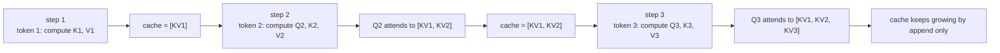
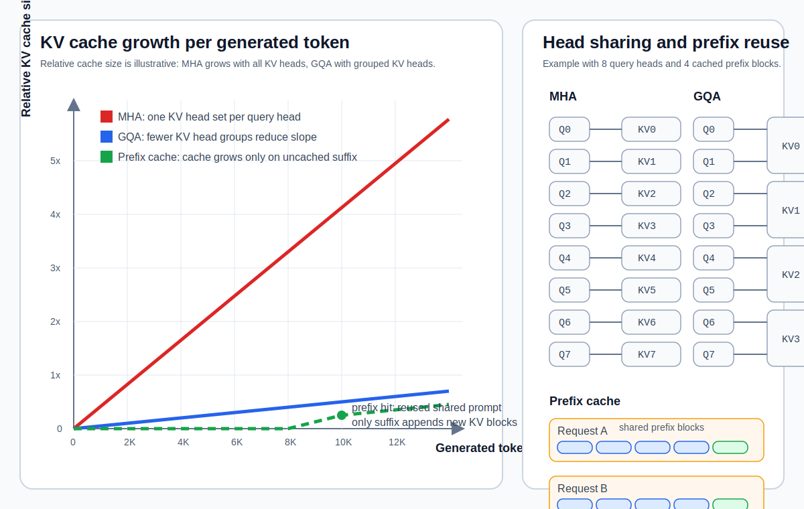

## 10.2 KV 缓存：为什么能避免重复计算

### 10.2.1 重复计算的问题

在自回归解码中，生成第 $$t$$ 个词元时，需要计算它与之前所有 $$t-1$$ 个词元的注意力。如果每次都从头计算所有词元的 Key 和 Value，计算量将随生成长度**呈平方增长**。

### 10.2.2 KV 缓存的原理

KV 缓存的核心观察是：**之前词元的 Key 和 Value 在后续步骤中不会改变**（因为因果掩码确保它们不受未来词元的影响）。因此，只需在首次计算后将它们缓存到显存中，后续步骤直接复用即可。

每生成一个新词元，只需：

1. 计算新词元的 Q、K、V
2. 将新的 K、V 追加到缓存
3. 用新的 Q 与所有缓存的 K 计算注意力权重
4. 用权重对所有缓存的 V 加权求和

如果只看“历史 K/V 重新计算和新查询关注历史”的注意力子问题，KV 缓存把每步从按完整前缀重算降为新词元查询缓存，复杂度约从 $$O(t^2 \cdot d)$$ 降至 $$O(t \cdot d)$$。完整 decoder layer 仍要为新词元计算 QKV 投影、MLP 和输出投影，因此每步不是常数成本。

下面这张流程图强调了 KV 缓存的关键点：历史词元的 K、V 只计算一次，之后每步只追加新块。

图 10-1：KV 缓存随解码步追加增长，历史 K/V 只需计算一次

### 10.2.3 KV 缓存的显存代价

KV 缓存虽然节省了计算，但引入了显著的**显存开销**。对于一个具有 $$L$$ 层、$$H_{kv}$$ 个 KV 头、head 维度 $$d_h$$、并发序列数为 $$B$$ 的模型，缓存 $$t$$ 个词元需要：

$$\text{KV 缓存大小} = 2 \times B \times L \times H_{kv} \times d_h \times t \times \text{bytes/element}$$

对于 Llama 2-70B（80 层、8 个 KV 头、128 维，使用 GQA），在 $$B=1$$、4096 个词元、FP16 下，KV 缓存约 1.25 GiB。若使用标准 MHA（64 个独立 KV 头），则约 10 GiB。GQA 将 KV 缓存斜率减小了 8 倍。即便如此，在高并发场景下，多个用户请求的 KV 缓存仍会迅速填满显存。这正是 PagedAttention 等技术的优化目标。

### 10.2.4 GQA 如何减小 KV 缓存

[第二章](../02_attention/2.3_multi_head.md)介绍了多头注意力中每个头有独立的 Q、K、V 投影。**分组查询注意力**（Grouped-Query Attention，GQA）让多个查询头共享同一组 K 和 V 头。

例如，Llama 2-70B 使用 64 个查询头但只有 8 个 KV 头（每 8 个查询头共享一组 KV）。这将 KV 缓存减小为原始多头注意力的 1/8，且对模型质量的影响极小。

#### 多头共享为什么不损性能

直觉上，减少 KV 头数量似乎必然导致表达能力下降。但实际上，GQA 之所以能够“几乎无损”，核心原因在于：

1. **KV 表征的冗余性**：在标准 MHA 中，多个注意力头的 K 和 V 投影所承载的信息存在大量重叠。GQA 原论文的做法印证了这一点：把已训练模型的多个 KV 头做均值池化（mean-pooling）合并，再用约 5% 的预训练计算量稍加续训（uptrain），就能基本恢复原模型质量。这意味着独立的 KV 头之间存在大量冗余，共享并不会丢失太多独立信息。

2. **查询的多样性足以补偿**：GQA 保留了每个查询头的独立 Q 投影。即使多个查询头共享同一组 K 和 V，不同的 Q 投影仍然可以从共享的 KV 中“提取”不同的注意力模式。换言之，注意力机制的表达多样性主要由 Q 驱动，而非 KV。

3. **实验验证**：Google 在 GQA 的原论文中展示，在 T5-XXL（110 亿参数）上，使用 GQA（8 组）相比标准 MHA 在多个基准测试上的性能差距不到 0.5%，而推理速度接近仅保留单个 KV 头的 MQA。在主流解码器架构的实际部署中，GQA 通常能带来约 1.5-2 倍的端到端吞吐提升（见下表）。后续 Llama 2-70B、Mistral 等模型进一步印证了这一权衡。

| 方案 | KV 头数 | KV 缓存大小（相对 MHA） | 模型质量（相对 MHA） | 推理吞吐量（相对 MHA） |
|------|---------|----------------------|---------------------|---------------------|
| MHA | $$H$$（如 64） | 1× | 基准 | 1× |
| GQA | $$G$$（如 8） | $$G/H$$（如 1/8） | $$\approx$$ 99.5%+ | $$\approx$$ 1.5-2× |
| MQA | 1 | $$1/H$$（如 1/64） | $$\approx$$ 97-99% | $$\approx$$ 2-3× |

GQA 是介于多头注意力（MHA，每个查询头一组独立 KV）和多查询注意力（MQA，所有查询头共享一组 KV）之间的折中方案。它在推理效率和模型质量之间取得了很好的平衡，成为现代大语言模型的标准配置。

### 10.2.5 前缀缓存：跨请求复用 KV 缓存

默认情况下，推理引擎仅在单个请求内部使用 KV 缓存——每个新请求都必须从头执行 Prefill。但如果两个请求共享相同的前缀（如相同的系统提示词），则第二个请求可以直接复用第一个请求已计算好的 KV 缓存，跳过共享前缀部分的 Prefill 计算。

这就是**前缀缓存**（Prefix Caching）的核心思想。商业 API（如 Anthropic、OpenAI）对缓存命中的输入词元收取更低的费用，正是因为复用缓存词元几乎不消耗计算资源。

前缀缓存在以下场景中收益显著：

- **复杂系统提示词**：智能体、RAG 管道、工具调用等场景通常在每次请求中携带相同的长系统提示词
- **代码补全**：代码生成和补全功能需要将相同的数千行代码作为共享上下文
- **文档问答**：文档摘要和检索问答在用户提问前反复传入相同的文档内容
- **多轮对话**：聊天模板会在每轮中重复之前的所有消息历史，随对话进行缓存收益递增

需要注意的是，前缀缓存从输入序列的起始位置开始匹配，直到遇到第一个不同的词元就终止。这意味着**上下文的排列顺序直接决定了缓存效率**——应将变化的内容（如用户输入）放在提示词的末尾，将不变的内容（如系统提示词、文档）放在前面，以最大化共享前缀的长度。

此外，对 KV 缓存进行量化（如使用 FP8 格式）可以在内存中存储更多的缓存条目，并加快缓存的读取速度，从而进一步提升前缀缓存和分离式推理架构的效果。

把 KV 缓存的线性增长、GQA 的斜率下降，以及前缀缓存的跨请求复用放在一张图里，会更容易看到三者解决的是不同层次的问题。

图 10-2：KV 缓存增长，以及 MHA、GQA 与前缀缓存的对比

### 10.2.6 PagedAttention：解决显存碎片化

虽然 GQA 降低了 KV 缓存的大小，但在高并发场景下，仍需更激进的显存管理策略。传统做法为每个请求预分配足够容纳最大生成长度的**连续显存块**。由于实际生成长度通常远小于最大值，这导致严重的**内存浪费和碎片化**——vLLM 论文和博客将既有系统中的碎片化与过度预留浪费估计为 60-80%。

**PagedAttention**（Kwon et al., 2023）借鉴操作系统**虚拟内存**的页式管理思想，将显存管理模型转变为：

1. **固定分页**：将物理显存划分为固定大小的“页”（通常容纳 16 个词元的 KV 缓存）
2. **按需分配**：每个请求维护一个逻辑-物理页面映射表，请求需要更多 KV 空间时动态分配新页
3. **高效共享**：多个请求可通过共享物理页面（写时复制，Copy-on-Write）共享相同前缀的 KV 缓存

关键收益是把 KV 缓存浪费压低到最后一个块内的少量空洞，vLLM 报告实践中浪费低于约 4%，等价于显著提高可用于批处理的有效显存。它不是“扩大缓存池”，而是用逻辑块表把每个请求的连续 KV 视图映射到非连续物理页，从而提升可同时服务的并发请求数。

### 10.2.7 新型 KV 缓存压缩：MLA（多头隐向量注意力）

随着模型规模增长，KV 缓存成本快速恶化。**多头隐向量注意力**（Multi-head Latent Attention，MLA）是 DeepSeek-V2/V3 等新模型的创新方向：与其为每个注意力头独立存储 K、V，MLA 将它们压缩为一个低维的隐向量，并在计算图中尽量保持压缩表示。

具体做法：

- **压缩**：将所有注意力头的 K、V 投影到一个紧凑的隐向量（DeepSeek-V2/V3 中该隐向量为 512 维，加上 64 维共享的 RoPE 键分量后共 576 维，约为全部注意力头 K、V 总维度 32768 的 1/57，相当于仅 2.25 组的 GQA）
- **存储**：在缓存中仅保存该隐向量，而非完整的 K、V 矩阵
- **吸收投影**：推理实现并不一定显式解压完整 K、V；DeepSeek 的 MLA 可把 key/value 的上投影分别吸收到 query 投影和输出投影中，在压缩域完成主要注意力计算，仅对需要 RoPE 的键分量单独处理

实际对比显示，DeepSeek-V3（671B）的单词元 KV 缓存仅需 70KB，而基于 GQA 的 Llama-3.1-405B 需 516KB、Qwen-2.5-72B 需 327KB（这两个模型本身已经用 8 KV 头 GQA 而非完整 MHA；若按完整 MHA 配置则会再放大约一个数量级），**压缩比约为 5-7 倍**。MLA 的收益不只是“少存再解压”，而是通过低维 KV 缓存和投影吸收减少生成阶段的显存带宽压力；在访存密集型的 decode 阶段，这通常比额外矩阵变换更关键。
