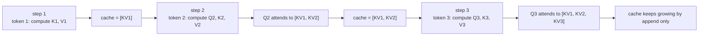
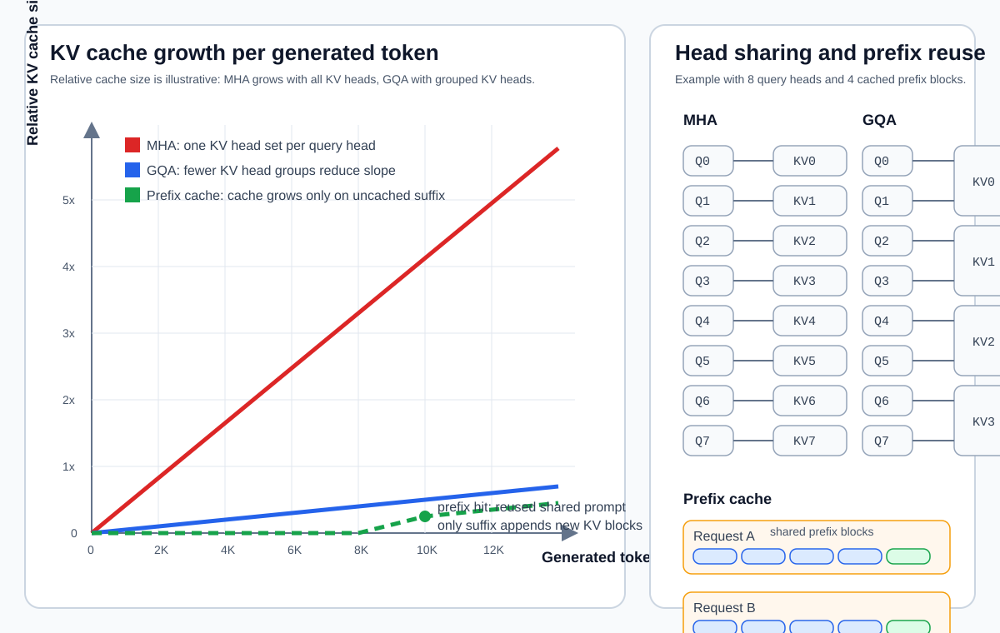
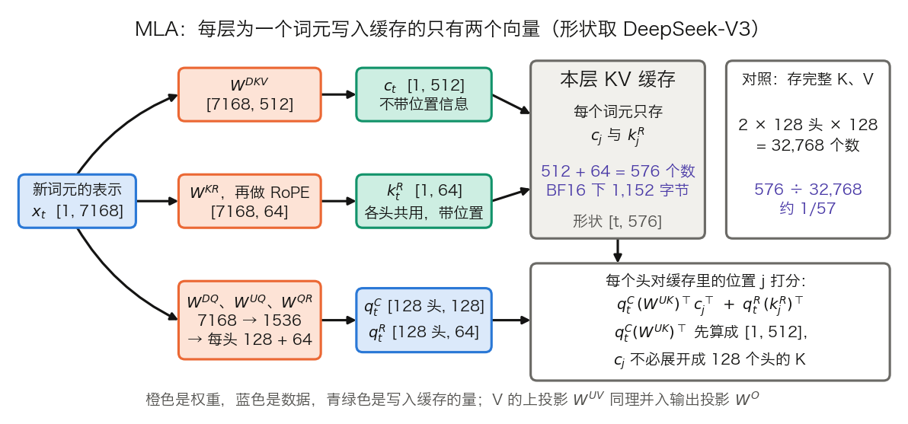

## 10.2 KV 缓存：为什么能避免重复计算

KV 缓存把已经算过的 Key 和 Value 留在显存里，后续每步只追加、不重算。10.1.2 算 decode 的访存账时，“读本请求全部 K/V”是直接列出的一项：它为什么随长度线性增长、每个词元占多少字节、凭什么值得占这份带宽，都还没有交代。本节先算它省下的计算，再算它换来的显存账，然后沿账里的各个因子看五条压缩路线。逐行手算见 [3.8.5](../03_components/3.8_gpt_inference_flow.md)。本节沿用全书的 $$n_{kv}$$ 记 KV 头数，用 $$t$$ 记前缀已有的位置数（3.8.5 把这个量记作 `s`），用 $$b_{\text{elem}}$$ 记每个数的字节数。

### 10.2.1 重复计算的问题

自回归解码每产出一个新词元，都要用到前缀中全部位置的 K 和 V。不缓存，就得把整个前缀重新送进模型：每层的 QKV 投影、注意力、MLP 都对前缀的 t 个位置重算一遍。

**算一步。** 线性层的计算量约为每个词元 `2N` FLOPs（N 为参数量）。以 Llama 3 8B、前缀已有 `t = 1,000` 个位置为例：

- 不缓存：`2N × 1,000 = 16.06 TFLOPs`；注意力按 3.8.7 的 `2t²dL` 计，另有 262 GFLOPs。
- 缓存：只算新位置，线性层 `2N = 16.06 GFLOPs`；注意力为 `4tdL ≈ 0.5 GFLOPs`。

线性层差 1,000 倍，注意力差 500 倍。大头在线性层，不在注意力：重复的主要是“把旧词元再过一遍所有权重”。

**算累计。** 连续生成 T 个词元，不缓存时线性层合计 $$2N\sum_{k=1}^{T}k \approx N T^{2}$$，随 T 平方增长；缓存后为 `2NT`，线性增长。`T = 1,000` 时两者相差约 500 倍。注意力部分则从累计 $$O(T^{3}d)$$ 降到 $$O(T^{2}d)$$。

### 10.2.2 KV 缓存的原理

缓存成立的依据是因果掩码：位置 i 的 K、V 只依赖位置 1 到 i 的输入，后来的词元不会改变它们。因此每层的 K、V 算出一次即可保留，形状为 `K_cache[B, n_kv, t, d_h]`，V 同形。每生成一个新词元，每层做四件事：

1. 为新位置算 Q、K、V：`x[1, d_model] × W_K[d_model, n_kv·d_h] → k[1, n_kv·d_h]`，Q、V 同理。
2. 把新的 K、V 追加到缓存：`K_cache[B, n_kv, t, d_h] → [B, n_kv, t+1, d_h]`。
3. 用新位置的 Q 对缓存里全部 K 打分：`q[1, d_h] × Kᵀ[d_h, t+1] → 分数[1, t+1]`。
4. Softmax 后对缓存里全部 V 加权求和：`权重[1, t+1] × V[t+1, d_h] → context[1, d_h]`。

旧位置的 Q 用不到，所以不缓存。完整的一层仍要为新词元计算 QKV 投影、输出投影和 MLP，每步成本不是常数，只是不再随 t 重复线性层。

```mermaid
flowchart LR
    s1["step 1<br/>token 1: compute K1, V1"] --> c1["cache = [KV1]"]
    c1 --> s2["step 2<br/>token 2: compute Q2, K2, V2"]
    s2 --> a2["Q2 attends to [KV1, KV2]"]
    a2 --> c2["cache = [KV1, KV2]"]
    c2 --> s3["step 3<br/>token 3: compute Q3, K3, V3"]
    s3 --> a3["Q3 attends to [KV1, KV2, KV3]"]
    a3 --> c3["cache keeps growing by append only"]
```

图 10-2：KV 缓存随解码步追加增长，历史 K/V 只需计算一次。

### 10.2.3 KV 缓存的显存代价

省下的计算换成了显存。对 $$L$$ 层、$$n_{kv}$$ 个 KV 头、每头宽度 $$d_h$$、每个数 $$b_{\text{elem}}$$ 字节的模型，$$B$$ 个并发序列各缓存 $$t$$ 个词元需要：

$$
\text{KV 缓存大小} = 2 \times B \times L \times n_{kv} \times d_h \times t \times b_{\text{elem}}
$$

**先算每词元字节数。** 去掉 B 和 t，剩下的 $$2Ln_{kv}d_hb_{\text{elem}}$$ 是一个词元占的字节，有了它就能心算任意长度。Llama 2-70B（80 层、8 个 KV 头、每头 128 维、FP16）为 `2 × 80 × 8 × 128 × 2 = 327,680 B = 320 KiB`；4,096 个词元是 `320 KiB × 4,096 = 1.25 GiB`。若它用标准 MHA（64 个 KV 头），每词元 2.5 MiB，同样长度要 10 GiB。表 10-5 逐列给出。

<!-- numeric-claim: kv-cache -->
| 配置 | B | 层数 L | KV 头 Hkv | 头维 dh | 词元 t | 字节 | KV 缓存 GiB |
| --- | ---: | ---: | ---: | ---: | ---: | ---: | ---: |
| Llama 2-70B GQA | 1 | 80 | 8 | 128 | 4096 | 2 | 1.25 |
| Llama 2-70B MHA | 1 | 80 | 64 | 128 | 4096 | 2 | 10.00 |

表 10-5：按 $$2BLn_{kv}d_htb_{\text{elem}}$$ 逐列重算的 FP16 KV 缓存（GiB，$$b_{\text{elem}}=2$$ 字节；表头的 Hkv 即 $$n_{kv}$$）。这里使用二进制 GiB；批量、层数、KV 头数、头维和上下文长度中的任一项翻倍，缓存也线性翻倍。

**再算并发。** 8 张 80 GB 的卡放 70B 的 BF16 权重，权重占 140 GB，剩约 500 GB。上下文 4,096 时每个请求占 1.25 GiB，即 1.34 GB，并发上限 `500 ÷ 1.34 ≈ 372`；换成 MHA 只有约 46。KV 缓存的大小直接决定一组卡能同时服务多少请求，这是它值得压缩的原因。带宽一侧的账见 10.1.2：每步要把 `B × t` 个词元的 KV 读一遍，不被批处理摊薄。

公式里有五个可压缩的因子：$$n_{kv}$$、$$L$$、每词元的表示宽度（$$n_{kv}d_h$$ 整体）、$$t$$ 和 $$b_{\text{elem}}$$。后面各小节各对应一个。

### 10.2.4 GQA 如何减小 KV 缓存

[2.3 节](../02_attention/2.3_multi_head.md)的多头注意力中，每个头有独立的 Q、K、V 投影。**分组查询注意力**（Grouped-Query Attention，GQA）让多个查询头共用一组 K、V 头；所有查询头共用一组时称**多查询注意力**（Multi-Query Attention，MQA）。Llama 2-70B 有 64 个查询头、8 个 KV 头，每 8 个查询头共用一组，KV 缓存是 MHA 的 1/8。Hugging Face 的模型配置里，这两个数是 `num_attention_heads` 与 `num_key_value_heads`；计算时把每组 K、V 沿头维复制或广播给组内各查询头，缓存只存 $$n_{kv}$$ 份。

#### 多头共享为什么不损性能

[GQA 原论文](https://arxiv.org/abs/2305.13245)给了两方面的证据。

**KV 头之间有冗余。** 论文把已训练 MHA 模型的多个 KV 头做均值池化（mean pooling）合并，再用原预训练计算量的 5% 续训（uptrain），质量基本恢复。独立的 KV 头若各自携带不可替代的信息，池化后不可能用这么少的计算补回来。

**实测的取舍。** 表 10-6 摘自该论文表 1，模型是 T5-XXL，MQA 与 GQA 只用在解码器的自注意力和交叉注意力上。

| 方案 | KV 头数 | KV 缓存（相对 MHA） | 每样本推理时间 | 七项任务平均分 |
| --- | ---: | ---: | ---: | ---: |
| MHA | 64 | 1× | 1.51 s | 47.2 |
| GQA-8 | 8 | 1/8 | 0.28 s | 47.1 |
| MQA | 1 | 1/64 | 0.24 s | 46.6 |

表 10-6：T5-XXL 上 MHA、GQA-8、MQA 的推理时间与质量，取自 GQA 论文表 1。推理时间为每个 TPUv4 芯片上的每样本耗时。MHA 的 64 取自该论文图 6 的横轴：分组数从 1 到 64，64 组即 MHA。

GQA-8 的质量与 MHA 相差 0.1 分，耗时接近 MQA；MQA 的耗时再少 14%，质量多掉 0.5 分。查询头各自保留独立的 Q 投影，仍能从共享的 K、V 里读出不同的模式，这一点可作为直觉，论文没有单独验证。这组数字来自编码器-解码器模型和 TPU，解码器模型上的幅度随负载与实现变化，方向一致。

GQA 只减少了 KV 头数。10.2.3 的乘积里，层数、每词元宽度、词元数量和字节数它都没有碰。

### 10.2.5 前缀缓存：跨请求复用 KV 缓存

默认情况下，KV 缓存只在单个请求内部使用，每个新请求都要从头执行 prefill。若两个请求的开头相同（如同一段系统提示词），后一个请求可以直接复用前一个请求已算好的 KV，跳过这段 prefill。这就是**前缀缓存**（Prefix Caching）。商业 API 对缓存命中的输入词元收取更低的费用，原因是这部分省掉了 prefill 计算；缓存本身仍占显存或下层存储，命中后仍要被每步 decode 读取。

**能复用的只有从头开始的相同前缀。** 位置 i 的 K、V 依赖位置 1 到 i 的全部输入和位置编号。两个请求只要在某个位置出现不同词元，此后的 K、V 就都不同。一段文档出现在两个 Prompt 的不同位置，它的 KV 不能复用。匹配因此从序列起点开始，到第一个不同的词元为止。编排 Prompt 时应把不变的内容（系统提示词、文档）放前面，变化的内容（用户输入）放末尾。

**怎样匹配。** 两种主流做法都以块为单位。vLLM 的自动前缀缓存把词元序列切成定长块，对“父块哈希 + 本块词元”做链式哈希，哈希相同即命中同一个物理块。SGLang 的 RadixAttention 把已缓存的序列组织成基数树，沿树匹配最长公共前缀。显存不足时，两者都按最近最少使用（LRU）淘汰没有请求引用的块。两条路线的细节与命中率的账见 [11.5 节](../11_serving/11.5_prefix_reuse.md)。

收益显著的场景有四类：

- **长系统提示词**：智能体、RAG 管道、工具调用每次请求都携带相同的长前缀。
- **代码补全**：相同的数千行代码作为共享上下文反复传入。
- **文档问答**：用户提问之前的文档内容不变。
- **多轮对话**：每轮都重复此前的全部消息，对话越长，命中的前缀越长。

KV 量化（如 FP8）让同样的显存存下更多缓存条目，读取也更快，前缀缓存和分离式架构都因此受益。图 10-3 把线性增长、GQA 的斜率下降和前缀复用画在一起。

图 10-3：KV 缓存增长，以及 MHA、GQA 与前缀缓存的对比。

### 10.2.6 PagedAttention：解决显存碎片化

GQA 缩小了每个词元的 KV，高并发下还要解决怎样分配的问题。传统做法为每个请求预留一段能容纳最大生成长度的连续显存，实际长度通常远小于最大值。[vLLM 团队的测量](https://blog.vllm.ai/2023/06/20/vllm.html)是，现有系统因碎片和过度预留浪费 60%–80% 的 KV 显存。

**PagedAttention**（[Kwon 等，2023](https://arxiv.org/abs/2309.06180)）借用操作系统的分页：

- **物理块池**：每层一个大张量，形如 `[num_blocks, block_size, n_kv, d_h]`，K、V 各一份。块按需分配，物理上不必相邻。
- **块表**（block table）：每个请求一张，形如 `[max_num_blocks_per_seq]` 的整数数组，第 k 项是逻辑第 k 块对应的物理块号。位置 i 的 K/V 在物理块 `block_table[i // block_size]` 的第 `i % block_size` 个槽里。
- **内核**：注意力内核按块表间接寻址，逐块读出 K、V 完成打分，逻辑上仍是一段连续的 `[t, d_h]`。

浪费只出现在每个请求的最后一块，最多 `block_size − 1` 个槽，平均是它的一半。`block_size = 16` 时每条序列平均浪费 7.5 个槽，平均长度 200 时占 `7.5 ÷ 207.5 = 3.6%`，平均长度 2,000 时降到 0.37%，与 vLLM 报告的“低于 4%”一致；逐格见 [11.4 节](../11_serving/11.4_kv_memory_management.md)表 11-12。块表还让多个请求共享同一物理块（前缀缓存、并行采样），写入时再复制。块大小的取舍、写时复制与换出见 [11.4 节](../11_serving/11.4_kv_memory_management.md)，调度见 [11.2 节](../11_serving/11.2_continuous_batching.md)。

### 10.2.7 新型 KV 缓存压缩：MLA（多头隐向量注意力）

GQA 让若干头共用 K、V，头数一减，可用的 K、V 表示也跟着变少。**多头隐向量注意力**（Multi-head Latent Attention，MLA）换一个思路：不减头数，而是把所有头的 K、V 压成一个低维隐向量，缓存里只存这个隐向量。它出自 [DeepSeek-V2](https://arxiv.org/abs/2405.04434)，V3 沿用。

**缓存里存什么。** 以 DeepSeek-V3 的公开配置为例（`hidden_size = 7168`、`num_attention_heads = 128`、`kv_lora_rank = 512`、`qk_nope_head_dim = 128`、`qk_rope_head_dim = 64`、`v_head_dim = 128`），按本书的行向量写法，新词元的表示 $$x_t$$ 经两条路写入缓存：

$$
\begin{aligned}
c_t &= x_t W^{DKV} && [1, 7168] \times [7168, 512] \to [1, 512] \\
k^{R}_t &= \operatorname{RoPE}\left(x_t W^{KR}\right) && [1, 7168] \times [7168, 64] \to [1, 64]
\end{aligned}
$$

$$c_t$$ 是不带位置信息的压缩隐向量；$$k^{R}_t$$ 是带 RoPE 的键分量，128 个头共用。完整的 K、V 由上投影得到：$$k^{C}_t = c_t W^{UK}$$、$$v^{C}_t = c_t W^{UV}$$，各为 `[1, 128 × 128]`。它们不进缓存。每层每个词元只存 `512 + 64 = 576` 个数，而全部头的 K、V 共 `2 × 128 × 128 = 32,768` 个数，约为 1/57，相当于只有 2.25 组的 GQA（`576 ÷ (2 × 128)`）。图 10-4 画出这条数据流。

图 10-4：MLA 中一个词元的数据流，写入缓存的只有 $$c_t$$ 与 $$k^R_t$$（[生成脚本](https://github.com/yeasy/llm_internals/blob/main/tools/figures/ch10_mla_dataflow.py)）。形状取 DeepSeek-V3 的配置。

**吸收投影。** 推理时不必把 $$c_j$$ 解压回完整的 K。某个头对位置 j 的打分是：

$$
q^{C}_t \left(k^{C}_j\right)^{\top} = \left(x_t W^{Q}\right)\left(c_j W^{UK}\right)^{\top} = x_t\, W^{Q}\left(W^{UK}\right)^{\top} c_j^{\top}
$$

$$W^{Q}(W^{UK})^{\top}$$ 可以预先合并成一个矩阵，查询直接与 512 维的 $$c_j$$ 做点积。$$W^{UV}$$ 同理并入输出投影 $$W^{O}$$。

**那 64 维从哪来。** RoPE 是与位置相关的旋转，必须作用在 q 与 k 之间。对键施加 RoPE 后，打分式里 $$W^{Q}$$ 与 $$W^{UK}$$ 之间多出一个随位置变化的旋转矩阵；矩阵乘法不可交换，两者无法再合并。[DeepSeek-V2 论文](https://arxiv.org/abs/2405.04434)指出，这样一来推理时必须为所有前缀词元重算键，压缩的收益被抵消。解法是解耦：位置信息走一条单独的、不压缩的旁路，即每头一份的查询 $$q^{R}_{t}$$ 配一个所有头共用的键 $$k^{R}_t$$；压缩的那一路完全不带位置。576 里的 64 就是这条旁路的宽度。为保住吸收投影，必须多存一份不压缩的键；让它只有 64 维且各头共用，是把这笔开销压到最小。

**每词元字节数。** 表 10-7 的三个数出自 DeepSeek 的 [ISCA 2025 论文](https://arxiv.org/abs/2505.09343)表 1，均可由公开配置复算。

| 模型 | 注意力 | 每词元 KV（BF16） | 算式 | 相对 V3 |
| --- | --- | ---: | --- | ---: |
| DeepSeek-V3（671B） | MLA | 70,272 B | `61 × 576 × 2` | 1× |
| Qwen-2.5 72B | GQA，8 个 KV 头 | 327,680 B | `2 × 80 × 8 × 128 × 2` | 4.66× |
| Llama-3.1 405B | GQA，8 个 KV 头 | 516,096 B | `2 × 126 × 8 × 128 × 2` | 7.34× |

表 10-7：三个模型的每词元 KV 缓存。后两个模型本身已用 GQA；V3 若用标准 MHA，每词元为 `61 × 32,768 × 2 ≈ 3.8 MiB`。最后一列由前一列相除得到；论文表 1 把 Llama-3.1 405B 一行记作 7.28×，与它自己给出的字节数相除所得的 7.34× 略有出入。

**代价。** MLA 是用计算换带宽。吸收之后，decode 时每个头对每个缓存位置的点积宽度是 `512 + 64 = 576`，是 128 维 GQA 头的 4.5 倍，头数还是完整的 128 个。Decode 在访存受限的斜线段（10.1.2），多出的计算有空闲算力承担，少读的字节直接缩短单步时间，这笔交换划算。Prefill 和训练在算力受限一侧，实现上通常把 K、V 展开成完整形状，走普通的多头注意力内核。同一个模型因此有两种计算形态，推理引擎要各写一套内核。vLLM 的 MLA 后端在源码注释里把它们称为两条路径：compute friendly 用于 prefill，data-movement friendly 用于 decode。

### 10.2.8 沿时间轴压缩：面向百万词元的混合注意力

MLA 压缩的是每个词元的宽度，词元数量不变。上下文到百万词元时这条轴不够用：每词元 70,272 B，一百万词元仍是约 70 GB。另一条正交的思路是沿时间轴压缩词元数量，再叠加稀疏选择。

DeepSeek-V4（见 [13.3 节](../13_decoder_models/13.3_deepseek_gemini.md)）的混合注意力是这条路线的代表，由两个部件组成：

- **压缩稀疏注意力**（Compressed Sparse Attention，CSA）：先把每 $$m$$ 个词元的 KV 合并成一个条目，再在压缩条目上做稀疏的 Top-k 选择，内部使用 DeepSeek 稀疏注意力 DSA 加速。
- **高度压缩注意力**（Heavily Compressed Attention，HCA）：使用远大于 $$m$$ 的压缩率 $$m'$$，把每 $$m'$$ 个词元的 KV 合并为一个条目，在合并后的条目上保持稠密注意力。

CSA 以适中的压缩率保留细节，靠稀疏选择省算力；HCA 以极高的压缩率提供粗粒度的全局视野。官方技术报告给出的效果是：百万词元上下文下，DeepSeek-V4-Pro 相比 DeepSeek-V3.2 只需 27% 的单词元推理浮点运算量（以等效 FP8 计）和 10% 的 KV 缓存。滑动窗口与注意力汇等只保留部分词元的做法见 [14.7 节](../14_future_trends/14.7_long_context.md)。

### 10.2.9 沿层轴共享：跨层复用 KV

还剩层数 $$L$$ 这个因子。**跨层注意力**（Cross-Layer Attention，CLA）只让一部分层计算并缓存 K、V，其余层复用前面某个产出层的 K、V；每一层仍计算自己的 Q，各层的注意力模式依旧不同。公式中的 $$L$$ 换成“实际产出 KV 的层数”，每两层共享一份，缓存减半。

这与 GQA 是同一个想法用在不同维度上：GQA 是头间共享，CLA 是层间共享，两者可以叠加。代价也同源：被共享的层失去独立的 KV 投影，模型容量下降。[CLA 的原始论文](https://arxiv.org/abs/2405.12981)（Brandon 等，2024）在 MQA 基础上共享相邻层的 K、V，在 1B 与 3B 规模从零训练的实验中报告：KV 缓存再降 2 倍，准确率与未修改的 MQA 基本持平，在显存与准确率的权衡上取得帕累托改进。

这条轴的部署成熟度低于其他几条。GQA 在现代解码器中普遍采用，MLA 有 DeepSeek 系列的规模化生产验证，层间共享目前主要见于研究与端侧小模型。各家对“共享 KV”的措辞也不统一：某些厂商所称的 unified 或 shared Keys and Values 指同一层内部的合并，不是跨层复用。判断某个模型是否采用层间共享，应以技术报告或模型卡的架构描述为准。

### 10.2.10 五个因子与失效情形

把各条路线放回 10.2.3 的乘积，每条路线各压一个因子：

- GQA/MQA 减少头数 $$n_{kv}$$。
- CLA 减少产出 KV 的层数 $$L$$。
- MLA 把每层每词元的 $$2n_{kv}d_h$$ 整体换成 $$d_c + d^{R}$$，V3 为 576。
- CSA/HCA 压缩词元数量 $$t$$。
- KV 量化减少每个数的字节 $$b_{\text{elem}}$$，见 [10.4 节](10.4_quantization.md)与 11.4.6。

作用在不同因子上，倍数可以相乘。

KV 缓存不是在所有情形下都划算，也不是总能复用：

- **短输出、短上下文**：缓存很小，收益也小，但没有理由关掉它；真正的问题出现在另一端。上下文足够长时，KV 超过权重成为显存和带宽的大头，Llama 3 8B 在 `B × t` 约 12.3 万词元时两者相等（10.1.2）。
- **前缀不是从头相同**：模板里先放时间戳或用户名，再放长文档，前缀缓存一个词元都命中不了。
- **结构性压缩要在训练时定下**：GQA、MLA、CLA 改的是模型结构，已发布的 MHA 模型只能靠续训转换或改用 KV 量化。
- **量化误差长期存在**：K/V 的量化误差写进缓存后，被此后每一步读取，上下文越长影响越大。

这些路线压缩的都是留在显存里的那份 K 和 V。算一次注意力要在显存上来回搬多少中间结果，不在这个乘积里，[10.3 节](10.3_flash_attention.md)处理它。
