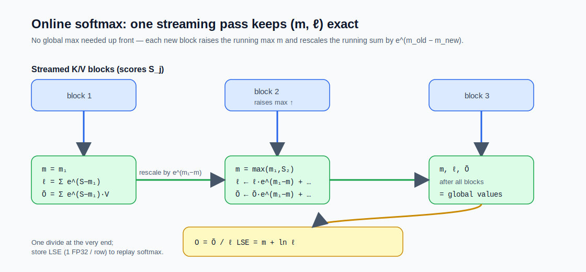
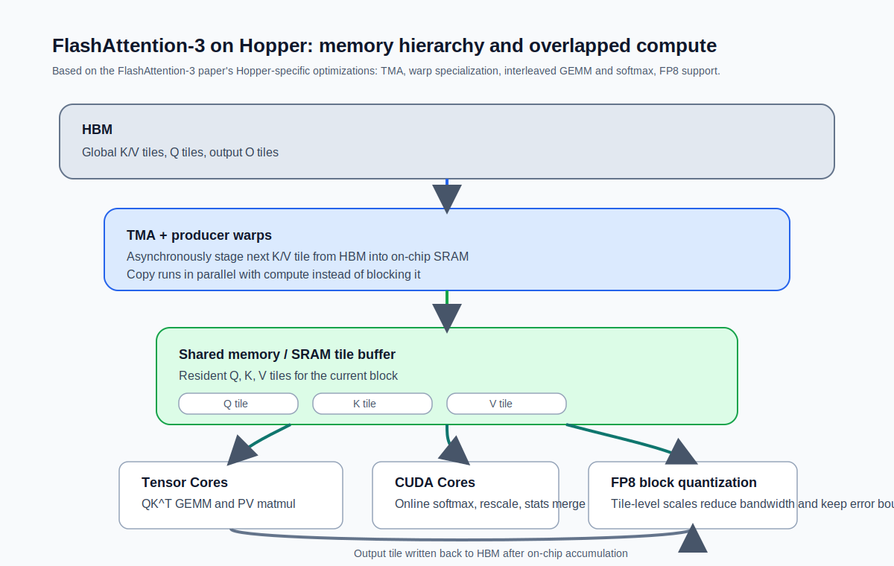
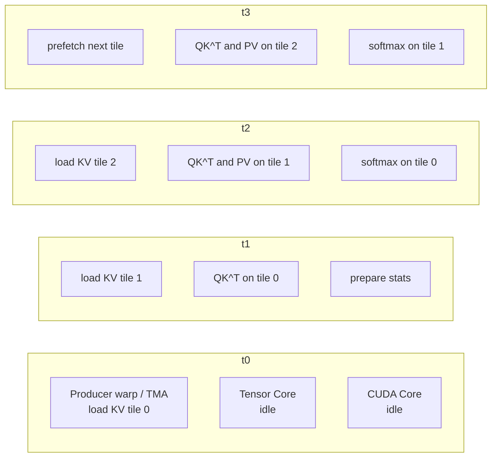

## 10.3 Flash Attention：IO 感知的算法设计

### 10.3.1 为什么标准注意力慢

标准注意力实现的瓶颈不在于浮点计算量，而在于**内存访问模式**。计算 $$QK^T$$ 会在 GPU 的高带宽内存（HBM）中生成一个 $$n \times n$$ 的注意力矩阵。这个矩阵的读写构成了大量的非必要内存访问。

### 10.3.2 Flash Attention 的核心思想

Flash Attention 由 Dao 等人提出，通过**分块计算**（Tiling）和**核内重计算**（Recomputation）避免将完整的注意力矩阵写入 HBM：

1. 将 Q、K、V 分成小块，适配 GPU 的片上 SRAM
2. 在 SRAM 中完成注意力计算（块级 Softmax）
3. 直接输出结果到 HBM，**从不在 HBM 中存储完整的 $$n \times n$$ 注意力矩阵**

这使得 Flash Attention 的 IO 复杂度从 $$O(n^2)$$ 降至 $$O(n^2 d^2 / M)$$（$$M$$ 为 SRAM 大小），在实践中带来 2-4 倍的速度提升和显著的显存节省。

#### 关键支撑：Online Softmax 的增量计算

“块级 Softmax”看似简单，但有一个数学障碍：标准 Safe Softmax 需要**先得到整行的全局最大值**才能计算分母 $$\sum_j e^{x_j - m}$$，分块计算时每块只能看到局部信息，如何保证最终结果与全局 Softmax 完全等价？

Flash Attention 的解法依靠 **Online Softmax** 算法（Milakov & Gimelshein, NVIDIA, 2018，[arxiv:1805.02867](https://arxiv.org/abs/1805.02867)）。算法在遍历过程中维护两个状态：当前已遍历部分的最大值 $$m$$ 和指数和 $$\ell$$（基于当前 $$m$$ 计算）。每读入一个新元素 $$x_i$$ 时，状态按如下规则更新：

$$m_{\text{new}} = \max(m_{\text{old}},\; x_i)$$

$$\ell_{\text{new}} = \ell_{\text{old}} \cdot e^{m_{\text{old}} - m_{\text{new}}} + e^{x_i - m_{\text{new}}}$$

关键是修正因子 $$e^{m_{\text{old}} - m_{\text{new}}}$$：当新元素 $$x_i$$ 刷新最大值时（$$m_{\text{new}} > m_{\text{old}}$$），这个小于 1 的因子会把基于旧最大值算出的历史累积量“重新缩放”到新最大值的基准下；当新元素没有刷新最大值时，因子为 $$e^0 = 1$$，直接累加即可。这一修正保证了无论分块顺序如何，最终的 $$m$$ 和 $$\ell$$ 都与全局 Safe Softmax 完全一致。

Flash Attention 把这个“边走边修正”的思想从单纯的 Softmax 扩展到了整条 attention 流水线：每读入一个 K/V 块，就同步更新最大值 $$m$$、指数和 $$\ell$$、以及未归一化的输出累积量 $$\tilde O = \sum_j e^{S_j - m} V_j$$。整个 attention 不需要把中间矩阵 $$S$$ 或 $$P$$ 写回 HBM——最终只在循环结束时做一次 $$O = \tilde O / \ell$$ 即可。

图 10-3：Online Softmax 单遍流式维护 $$(m, \ell, \tilde O)$$，每遇更大的最大值就用 $$e^{m_{\text{old}} - m_{\text{new}}}$$ 重缩放历史累积量，结尾一次除法得到 $$O$$ 并存下 LSE

#### LSE：进一步压缩的状态变量

在反向传播、长序列 Split-K 解码、跨卡序列并行等场景下，Flash Attention 需要把每个 Q 行的 softmax 状态写回 HBM 以便后续使用。如果直接存 $$(m, \ell)$$，每行需要 2 个 FP32 标量。Flash Attention 采用了一个数学等价的压缩：

$$\text{LSE} \;=\; m + \ln \ell$$

由此 softmax 输出可以恢复为 $$P_i = e^{S_i - \text{LSE}}$$——把“减最大值再除以分母”两步合并成一次“减 LSE 再取指数”，化除法为减法，且每行只需写回 1 个 FP32 标量，HBM 写带宽减半。LSE 是后续几个关键机制的共同基石：反向传播时无需保留完整的 $$P$$ 矩阵即可精准重算、Flash-Decoding 的 Split-K 局部归约可以无损合并、Ring Attention 的跨卡 K/V 流转可以增量更新输出（见 10.3.5 节）。

### 10.3.3 Flash Attention 2：并行度与效率的提升

Flash Attention 2 在 Flash Attention 的基础上进行了多项关键优化：

1. **减少非矩阵乘 FLOPs**：重新组织了在线 Softmax 的计算流程，消除了大量缩放和边界检查等非矩阵乘操作，使更多的计算时间花在 GPU Tensor Core 擅长的矩阵乘法上
2. **优化 Warp 间工作划分**：在同一线程块内改为让每个 Warp 处理 Q 的不同行块、K/V 对所有 Warp 共享（split-Q），取代了 FA1 中把 K/V 切分给各 Warp（split-K）后需经共享内存交换中间结果并同步求和的做法，消除了 Warp 间的同步和通信开销
3. **序列长度维度并行**：在 Q 的序列长度维度上增加并行度，使得长序列场景下 GPU 的 SM 占用率更高

这些优化使 Flash Attention 2 在 A100 上达到了理论 FLOPs 的 50-73% 利用率（取决于序列长度），相比 Flash Attention 1 提升约 2 倍，并已成为所有主流推理和训练框架的标准组件。

### 10.3.4 Flash Attention 3：面向 Hopper 架构的深度优化

尽管 Flash Attention 2 表现出色，但在 NVIDIA H100（Hopper 架构）上的利用率却仅约 35%。这说明 Hopper 引入的新硬件特性没有被充分利用。Flash Attention 3 由 Tri Dao 等人于 2024 年提出，通过三项关键技术实现了对 Hopper 架构的深度适配。

#### 异步流水线

Hopper 架构引入了**张量内存加速器**（Tensor Memory Accelerator，TMA），可以独立于计算单元进行异步数据搬运。Flash Attention 3 利用 **Warp 特化**（Warp Specialization）技术，将 Warp 分为“生产者”和“消费者”两个角色：

- **生产者 Warp**：通过 TMA 将下一块 K、V 数据从 HBM 异步加载到 SRAM
- **消费者 Warp**：同时在 SRAM 中对当前数据块执行矩阵乘法

这种流水线设计使计算和数据搬运全程重叠，消除了 Flash Attention 2 中“加载-计算-加载-计算”的串行等待。

#### GEMM-Softmax 交错执行

在标准实现中，每个数据块的处理遵循严格的顺序：先执行 $$QK^T$$ 矩阵乘（GEMM），然后计算 Softmax，最后执行与 $$V$$ 的矩阵乘。Softmax 中的指数和归一化操作无法利用 Tensor Core，成为流水线的瓶颈。

Flash Attention 3 将**当前块的 Softmax 与下一块的 GEMM 交错执行**。当 Tensor Core 忙于计算下一块的矩阵乘时，CUDA Core 同步处理上一块的 Softmax——两种不同类型的计算单元并行工作，进一步提升了吞吐量。

#### FP8 低精度支持

Flash Attention 3 利用 Hopper 的第四代 Tensor Core 原生支持 FP8 精度。通过以下技术在性能翻倍的同时控制精度损失：

- **块级量化**（Block Quantization）：对每个小块独立计算缩放因子，避免全局量化带来的动态范围问题
- **非相干处理**（Incoherent Processing）：在量化前对输入施加随机正交变换，使异常值分散到更多维度，减少最大量化误差

如果把这些优化映射到 Hopper 的硬件层次，可以看到 Flash Attention 3 的真正重点并不是“多做一步优化”，而是让数据搬运和不同类型的计算单元持续并行。

图 10-4：Flash Attention 3 在 Hopper 上的分层内存与异步数据路径

对应到执行顺序，Flash Attention 3 不是简单的“先搬运，再计算，再 Softmax”，而是把三条流水线错开重叠。

图 10-5：Flash Attention 3 将 TMA 搬运、Tensor Core GEMM 与 CUDA Core Softmax 交错执行

#### 性能表现

在 NVIDIA H100 上，Flash Attention 3 取得了显著的性能提升：

| 精度 | 吞吐量 | H100 利用率 | 相比 FA2 |
|------|--------|------------|---------|
| FP16 | ~740 TFLOPS | ~75% | 1.5-2.0× |
| FP8 | ~1.2 PFLOPS | — | 吞吐量约为 FA2 FP16 的 3-4×；数值误差降至朴素 FP8 实现的 1/2.6 |

Flash Attention 3 的演进揭示了一个重要趋势：**算法设计必须与硬件架构协同演化**。每一代新硬件都会引入新的计算原语和内存层级，只有深入理解这些硬件特性，才能充分释放算力。这一思想在 Blackwell 架构的 FP4 支持中得到了进一步延伸（详见 [11.4 节](../11_serving/11.4_hardware.md)）。

### 10.3.5 序列并行：超长上下文的分布式注意力

当单张 GPU 的显存无法容纳超长序列的 KV 缓存时（如处理 1M+ 词元的上下文），需要采用**序列并行**（Sequence Parallelism）将注意力计算分散到多张 GPU 上。

**Ring Attention**（Liu et al., 2023）是一种优雅的序列并行方案：
- 将序列 Q、K、V 在序列维度分割，分配给不同 GPU
- 每个 GPU 只常驻本地序列分片的状态，并在块级注意力计算中接收其他分片的 K/V 块
- 通过**环形拓扑**异步传输 K/V 块，把通信与块级注意力计算重叠起来
- 可处理的序列长度近似随设备数线性扩展；精确稠密注意力的总计算量仍随序列长度平方增长，并没有把注意力本身变成线性复杂度

相比把超长序列完整塞进单设备，Ring Attention 通过序列维度的分割提高了显存可扩展性；在高速网络（InfiniBand、RoCEv2）环境下，通信可被部分隐藏，从而让百万级上下文训练或推理成为可工程化探索的方向。实际延迟仍取决于模型结构、设备数、网络带宽和批量大小。

### 10.3.6 Flash Attention 4：面向 Blackwell 的协同设计

Flash Attention 4（[arxiv:2603.05451](https://arxiv.org/abs/2603.05451)，Zadouri、Hoehnerbach、Shah、Liu、Thakkar、Dao，2026 年 3 月）针对 NVIDIA Blackwell 架构（SM100/SM110）做了端到端重设计，在 B200 上相比 cuDNN 9.13 实现约 1.3× 加速。

#### 不对称扩展的工程挑战

每一代新 GPU，Tensor Core（矩阵乘）的算力提升幅度往往远大于 SFU（特殊函数单元，负责 $$e^x$$、$$\ln x$$ 等超越函数）和 HBM 带宽的提升幅度。这种“不对称扩展”导致沿用 FA3 设计在 Blackwell 上跑时，原本不起眼的 Softmax 中 $$e^x$$ 计算成为新的瓶颈——Tensor Core 在等待 SFU。FA4 的核心思路是从算法层和 kernel 层协同地缓解这种不对称。

#### Tensor Memory 与新的存储层级

Blackwell 引入了一种新型片上存储 **Tensor Memory（TMEM）**，与寄存器、共享内存并列。FA4 把未归一化的输出累积量 $$\tilde O$$ 长驻在 TMEM 中，使矩阵乘的输出可以直接作为下一次矩阵乘的输入，省去寄存器与共享内存之间的中转。这与 FA3 把 $$\tilde O$$ 累积在寄存器中（受 register file 容量制约）形成对比。

#### 更细粒度的角色分工

FA3 已经引入了 Warp Group 级的生产者-消费者分工，FA4 把这种分工进一步细化：把 K/V 加载、矩阵乘、Softmax 计算、累积修正、输出写出等职责分配给不同的 warp 角色，通过异步原语（TMA、tcgen05.mma 等）让流水线持续饱满。具体的角色数量和分配在不同硬件配置下会调整，但思想是统一的——**让每类硬件单元都能在自己的最大吞吐下工作**。

#### 软硬协同的超越函数计算

当 SFU 仍然不够用时，FA4 把一部分 $$e^x$$ 计算用通用 CUDA Core 通过多项式逼近来分担（FMA 指令模拟），让 SFU 和 ALU 并行处理超越函数。这种“部分软件模拟”是一个精细的工程平衡：100% 软件模拟会消耗过多寄存器导致 spill，而保留一定比例硬件 SFU 调用既能维持精度又能避免寄存器压力。

#### 演进规律

从 FA1 到 FA4，每一代的设计变化都与硬件新原语强相关：

| 版本 | 目标架构 | 主要瓶颈 | 关键新原语 |
|:-----|:---------|:---------|:-----------|
| FA1 | SM75-80 (Turing–Ampere) | HBM 反复读写 n×n 注意力矩阵 | `mma.sync` 矩阵乘 |
| FA2 | SM80 (Ampere) | 非矩阵乘 FLOPs 占比、SM 并行度不足 | `cp.async` 异步加载 |
| FA3 | SM90 (Hopper) | 加载与计算串行、异步单元闲置 | TMA、WGMMA、Warp Group 专门化 |
| FA4 | SM100-110 (Blackwell) | SFU 的 e^x 吞吐跟不上张量核 | TMEM、`tcgen05.mma`、更细粒度异步 |

这一规律印证了 Flash Attention 系列的核心方法论：**算法设计必须与硬件架构协同演化**——每一代新硬件引入的新原语都不是即插即用的优化，而是需要把整条计算流水线推倒重设，才能释放出来。
