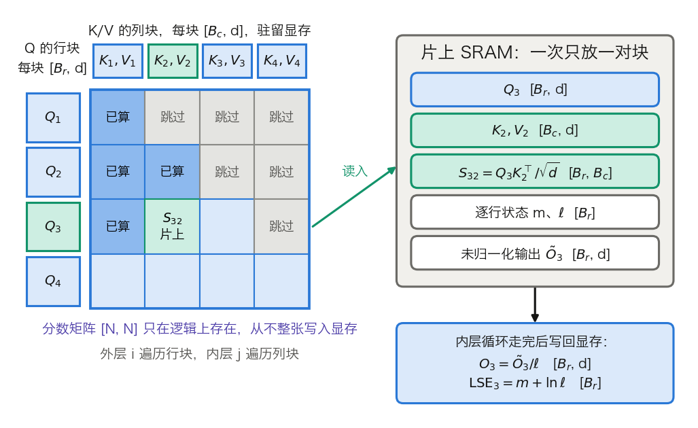
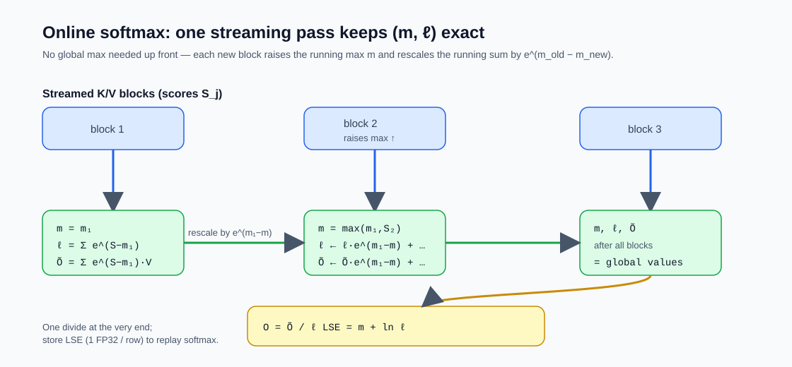
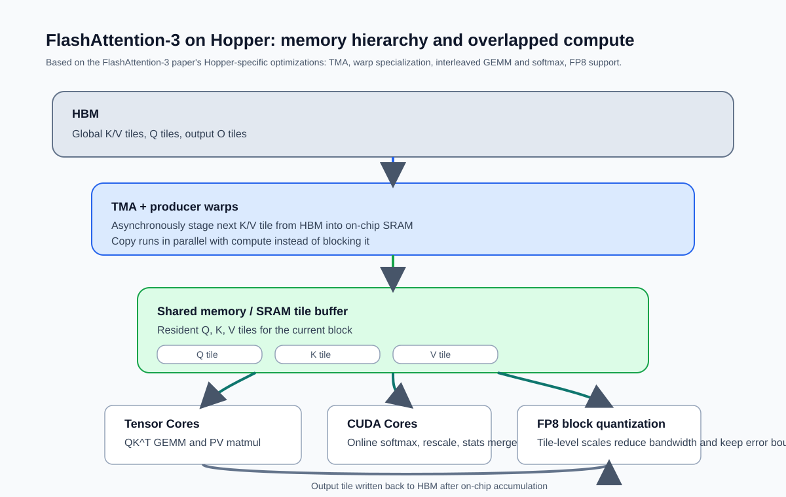
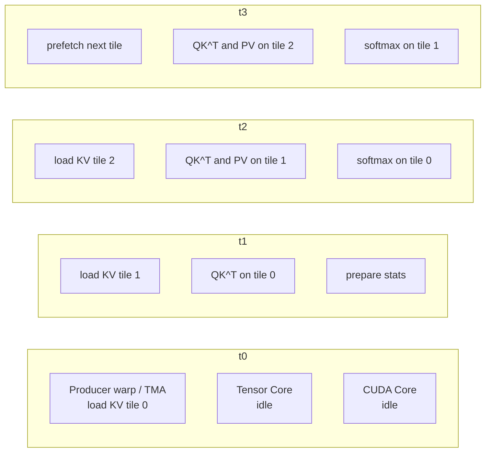

## 10.3 FlashAttention：IO 感知的算法设计

标准注意力实现的瓶颈不在浮点计算量，而在访存模式。上一节压缩的都是留在显存里的那份 K 和 V；算一次注意力要在显存上来回搬多少中间结果，不在 10.2.3 的那个乘积里。本节先算标准实现搬了多少，再写出 FlashAttention 的分块循环、在线 Softmax 与反向重算，然后看它从 FA2 到 FA4 怎样随硬件重写，最后对到 decode 形态与框架入口。

### 10.3.1 为什么标准注意力慢

标准实现分三步，每一步都把一个 `[T, T]` 的矩阵写进显存（HBM），下一步再读回来（T 为序列长度，$$d_h$$ 为每头宽度；FlashAttention 系列论文把这两个量记作 N 与 d，与全书 N 表示非嵌入参数量、d 表示 $$d_{\text{model}}$$ 冲突，本节按全书记号写）：

1. `Q[T, d_h] × Kᵀ[d_h, T] → S[T, T]`，写 S。
2. 读 S，逐行 Softmax 得 `P[T, T]`，写 P。
3. 读 P，`P[T, T] × V[T, d_h] → O[T, d_h]`，写 O。

**这张矩阵有多大。** `T = 8,192`、32 个头、每头 128 维、FP16 时，单层的 S 为 `8,192² × 32 × 2 B = 4 GiB`，P 同样大。同一层的 Q 只有 `8,192 × 32 × 128 × 2 B = 64 MiB`，K、V、O 同。`T = 32,768` 时 S 是 64 GiB，单卡放不下。训练时 P 还要留到反向传播。

Softmax、掩码、dropout 都是逐元素运算，每读 1 字节只做几次浮点运算，算术强度远低于 10.1.2 的拐点，时间全花在读写这两张矩阵上。FlashAttention 论文的图 1 给出 A100 上两级存储的差距：片上 SRAM 约 20 MB、带宽 19 TB/s，HBM 40 GB、带宽 1.5 TB/s。

### 10.3.2 FlashAttention 的核心思想

[FlashAttention](https://arxiv.org/abs/2205.14135)（Dao 等，2022）用两个办法让 `[T, T]` 的矩阵不落显存。**分块计算**（tiling）：把 Q、K、V 切成能放进 SRAM 的小块，逐对块在片上算完。**重计算**（recomputation）：前向不保存 P，反向时按块重算。结果与标准注意力逐位等价，不是近似。

**分块前向。** 下面按 FlashAttention-2 的循环次序写出单个头的前向，方括号里标出每个量驻留的位置。

```text
输入：Q、K、V [T, d_h]，驻留 HBM；块大小 B_r（行）、B_c（列）
把 Q 切成 n_r = ⌈T / B_r⌉ 个行块，把 K、V 各切成 n_c = ⌈T / B_c⌉ 个列块
for i = 1 .. n_r:                               # 外层：Q 的行块
    读入 Q_i [B_r, d_h]                          # HBM → SRAM
    初始化 m = −∞ [B_r]，ℓ = 0 [B_r]，Õ = 0 [B_r, d_h]  # SRAM
    for j = 1 .. n_c:                           # 内层：K/V 的列块
        若第 j 块整块被因果掩码遮住：跳过
        读入 K_j、V_j [B_c, d_h]                 # HBM → SRAM
        S = Q_i × K_jᵀ / √d_h                    # [B_r, B_c]，只在 SRAM
        m_new = max(m, rowmax(S))
        ℓ = ℓ · e^(m − m_new) + rowsum(e^(S − m_new))
        Õ = Õ · e^(m − m_new) + e^(S − m_new) × V_j
        m = m_new
    写回 O_i = Õ / ℓ [B_r, d_h]，LSE_i = m + ln ℓ [B_r]  # SRAM → HBM
```

图 10-5 画出某一时刻的状态：第 3 个行块与第 2 个列块在片上，其余都在显存。



图 10-5：FlashAttention 分块前向的循环结构与各变量的驻留位置（[生成脚本](https://github.com/yeasy/llm_internals/blob/main/tools/figures/ch10_flash_tiling.py)）。示意取 4 × 4 个块与因果掩码。

**块多大。** 设 SRAM 能放 M 个数；FA1 论文称 M 的典型值约 100 KB，下面取 `M = 10⁵`。片上要同时放下 Q、K、V、O 各一块，每块约 `B × d_h` 个数，所以 FA1 取 $$B_c = \lceil M/(4d_h) \rceil$$、$$B_r = \min(B_c, d_h)$$。`d_h = 64` 时，$$B_c = 391$$，$$B_r = 64$$；分数块 `[64, 391]` 只有约 2.5 万个数。

**省了多少访存。** FA1 论文的定理 2 给出 HBM 访问量：标准注意力为 $$\Theta(Td_h + T^{2})$$，FlashAttention 为 $$\Theta(T^{2}d_h^{2}/M)$$。直观推导：每个列块约 M 个数，K、V 共切成 $$\Theta(Td_h/M)$$ 块；每处理一块要把 Q 和 O 过一遍，读写 $$\Theta(Td_h)$$ 个数；相乘得 $$\Theta(T^{2}d_h^{2}/M)$$。与 $$T^{2}$$ 相比少了约 $$M/d_h^{2}$$ 倍：`d_h = 64`、`M = 10⁵` 时约 24 倍，`d_h = 128` 时约 6 倍。论文还证明，M 在 $$d_h$$ 与 $$Td_h$$ 之间时，任何精确注意力算法都无法在渐近意义上做得更好。

**FLOPs 反而更多。** 表 10-8 是 FA1 论文图 2 对 GPT-2 medium 前向加反向的实测。

| 指标 | 标准注意力 | FlashAttention | 变化 |
| --- | ---: | ---: | --- |
| 计算量 | 66.6 GFLOPs | 75.2 GFLOPs | 多 13%（反向重算） |
| HBM 读写 | 40.3 GB | 4.4 GB | 少到约 1/9 |
| 运行时间 | 41.7 ms | 7.3 ms | 快 5.7 倍 |

表 10-8：标准注意力与 FlashAttention 的计算量、HBM 读写与运行时间，取自 FlashAttention 论文图 2（GPT-2 medium，序列长 1,024，头宽 64，16 头，批 64，A100）。

计算量多了 13%，时间少到 1/5.7：决定运行时间的是 HBM 读写量，不是 FLOPs。FlashAttention 降低的是 IO 和中间矩阵的显存占用，稠密注意力的 FLOPs 仍随序列长度平方增长。论文报告相对优化过的基线通常快 2–4 倍。

#### 关键支撑：Online Softmax 的增量计算

分块有一个数学障碍：Safe Softmax 要先得到整行的最大值 m，才能算分母 $$\sum_j e^{x_j - m}$$，而每个块只看得到局部。**Online Softmax**（[Milakov 与 Gimelshein，2018](https://arxiv.org/abs/1805.02867)）在遍历中维护两个状态：已见部分的最大值 $$m$$，以及以 $$m$$ 为基准的指数和 $$\ell$$。读入新元素 $$x_i$$ 时：

$$m_{\text{new}} = \max(m_{\text{old}},\; x_i)$$

$$\ell_{\text{new}} = \ell_{\text{old}} \cdot e^{m_{\text{old}} - m_{\text{new}}} + e^{x_i - m_{\text{new}}}$$

修正因子 $$e^{m_{\text{old}} - m_{\text{new}}}$$ 把以旧最大值为基准的累积量换算到新基准下。最大值没被刷新时因子为 1，直接累加。FlashAttention 对未归一化的输出 $$\tilde O = \sum_j e^{S_j - m} V_j$$ 做同样的修正，循环结束时只需一次 $$O = \tilde O / \ell$$。

**手算：最大值不刷新。** 一行分数 `[1, 3, 2]`，对应的 V 取标量 `[10, 20, 30]`，分两块 `[1, 3]` 与 `[2]`。用到的常数是 `e⁻² ≈ 0.1353`、`e⁻¹ ≈ 0.3679`。

- 第一块：`m = 3`，`ℓ = e⁻² + e⁰ = 1.1353`，`Õ = 0.1353 × 10 + 1 × 20 = 21.353`。
- 第二块：最大值仍是 3，修正因子为 1。`ℓ = 1.1353 + e⁻¹ = 1.5032`，`Õ = 21.353 + 0.3679 × 30 = 32.390`。
- 结果：`O = 32.390 ÷ 1.5032 = 21.547`。

**手算：最大值被刷新。** 把分块换成 `[1, 2]` 与 `[3]`。

- 第一块：`m = 2`，`ℓ = e⁻¹ + e⁰ = 1.3679`，`Õ = 0.3679 × 10 + 1 × 30 = 33.679`。
- 第二块：最大值从 2 升到 3，修正因子 `e^(2−3) = 0.3679`，同时乘到 ℓ 和 Õ 上。`ℓ = 1.3679 × 0.3679 + e⁰ = 1.5032`，`Õ = 33.679 × 0.3679 + 1 × 20 = 32.390`。
- 结果：`O = 21.547`，与上一种分块相同。

一次性计算的 Softmax 权重是 `[0.090, 0.665, 0.245]`，加权和同为 21.547。分块次序不影响结果。



图 10-6：Online Softmax 单遍流式维护 $$(m, \ell, \tilde O)$$，每遇更大的最大值就用 $$e^{m_{\text{old}} - m_{\text{new}}}$$ 重缩放历史累积量，结尾一次除法得到 $$O$$ 并存下 LSE

#### LSE：进一步压缩的状态变量

每个 Q 行的 Softmax 状态要写回显存留给后续使用。FlashAttention-2 指出不必同时存 $$m$$ 与 $$\ell$$，只存一个数：

$$\text{LSE} \;=\; m + \ln \ell$$

由它可恢复 $$P_i = e^{S_i - \text{LSE}}$$，“减最大值再除以分母”合成一次“减 LSE 再取指数”。上例的 `LSE = 3 + ln 1.5032 = 3.4076`。LSE 的价值在可合并：两段 K 各自算出的 $$\text{LSE}_1$$、$$\text{LSE}_2$$ 满足 $$\text{LSE} = \ln(e^{\text{LSE}_1} + e^{\text{LSE}_2})$$，两段的输出按 $$e^{\text{LSE}_k - \text{LSE}}$$ 加权即得整体输出。反向重算、沿 K 方向切分的 decode 内核（10.3.7）、跨卡的 Ring Attention（10.3.5）都靠这条性质。

#### 反向与重计算

标准实现为反向保存 `P[T, T]`。FlashAttention 前向只保存 `O[T, d_h]` 和每行一个 LSE。`T = 8,192`、32 头时，LSE（FP32）共 `8,192 × 32 × 4 B = 1 MiB`，对比 P 的 4 GiB，激活显存从 $$O(T^{2})$$ 降到 $$O(T)$$。反向时再按同样的分块读入 $$Q_i$$、$$K_j$$、$$V_j$$，在片上重算 $$S_{ij}$$ 与 $$P_{ij} = e^{S_{ij} - \text{LSE}_i}$$，用完即弃。代价是多做一遍前向的注意力 FLOPs，即表 10-8 里多出的 13%；换来的是不读写 `[T, T]` 的矩阵，总时间更短。这与 [7.5 节](../07_distributed_training/7.5_activation_checkpointing.md)的激活检查点是同一种取舍，只是粒度在内核内部。

### 10.3.3 FlashAttention 2：并行度与效率的提升

FA1 只达到 A100 理论最大 FLOPs/s 的 25–40%。[FlashAttention-2](https://arxiv.org/abs/2307.08691) 论文把原因归结为线程块与 warp 之间的工作划分不佳。读 FA2 到 FA4 的论文需要表 10-9 的词汇，取自 FlashAttention-3 论文 2.2 节对 H100 的描述。

| 层级 | 并行单位 | 对应的存储 | 容量与带宽（H100） |
| --- | --- | --- | --- |
| 芯片 | grid | GMEM，即 HBM | 80 GiB，3.35 TB/s |
| GPC | threadblock cluster | L2 缓存 | 50 MiB，12 TB/s |
| SM（streaming multiprocessor） | threadblock，即 CTA | SMEM，片上共享内存 | 每 SM 228 KiB，全卡 31 TB/s |
| 线程 | thread | RMEM，寄存器 | 每线程至多 256 个寄存器 |

表 10-9：GPU 的线程层级与存储层级，取自 FlashAttention-3 论文表 1 与 2.2 节。32 个线程组成一个 warp，4 个相邻 warp 组成一个 warpgroup；同一 CTA 内的线程可直接寻址 SMEM。

执行单元分两类：Tensor Core 专做矩阵乘（论文称 MMA 指令），CUDA Core 负责其余的逻辑、整数与浮点运算。前文的“片上 SRAM”对应 SMEM。FA2 的三项改动都落在这套层级上：

1. **减少非矩阵乘 FLOPs**：调整在线 Softmax 的计算次序，去掉中途多余的缩放，只在行块结束时除一次 ℓ，让更多时间花在 Tensor Core 擅长的矩阵乘上。
2. **沿序列长度并行**：单个头的注意力也分到不同线程块上，10.3.2 的外层循环各行块互不依赖，可以同时执行，长序列下 SM 的占用率更高。
3. **调整 warp 间的工作划分**：FA1 把 K/V 切给同一线程块内的各 warp，各 warp 的中间结果要经共享内存交换再求和。FA2 改为让每个 warp 处理 Q 的不同行块，K/V 由各 warp 共用，省掉这部分共享内存读写。

FA2 在 A100 上达到理论最大 FLOPs/s 的 50–73%，约为 FA1 的 2 倍；端到端训练 GPT 类模型时每张 A100 达到 225 TFLOPs/s（72% 的模型 FLOPs 利用率）。此后它成为主流训练与推理框架的默认注意力实现之一，但这组利用率只对 Ampere 成立。

### 10.3.4 FlashAttention 3：面向 Hopper 架构的深度优化

同一份 FA2 内核搬到 H100（Hopper）上，利用率只有 35%。[FlashAttention-3](https://arxiv.org/abs/2407.08608)（Shah 等，2024）用三项技术适配 Hopper。

#### 异步流水线

Hopper 有独立于计算单元的**张量内存加速器**（Tensor Memory Accelerator，TMA），可在 GMEM 与 SMEM 之间异步搬运数据。它的 Tensor Core 经 warpgroup 级的 `WGMMA` 指令调用，同样是异步的，并能直接从共享内存取输入。FA3 据此做 **warp 特化**（warp specialization），把一个 CTA 内的 warp 分成两种角色：

- **生产者 warp**：只发数据搬运指令，经 TMA 把下一块 K、V 从 HBM 装入 SMEM 的环形缓冲。
- **消费者 warp**：只发计算指令，对已就位的块做矩阵乘。

计算与搬运因此全程重叠，FA2 里“加载、计算、加载、计算”的串行等待消失。Hopper 还允许用 `setmaxnreg` 在 warpgroup 之间重新分配寄存器，让做矩阵乘的 warp 分到更多。

#### GEMM-Softmax 交错执行

每个块的处理本有严格次序：先做 $$QK^{\top}$$ 的矩阵乘（GEMM），再做 Softmax，最后乘 V。Softmax 的指数与归一化用不上 Tensor Core。FA3 把当前块的 Softmax 与下一块的 GEMM 交错：Tensor Core 算下一块矩阵乘时，CUDA Core 处理上一块的 Softmax，两类单元并行工作。

#### FP8 低精度支持

Hopper 的 Tensor Core 支持 FP8，每个 SM 的吞吐是 FP16 或 BF16 的 2 倍。FA3 用两项技术控制精度损失：

- **块级量化**（block quantization）：对每个小块的 Q、K、V 激活独立计算缩放因子，避免整张量共用一个缩放带来的动态范围问题。
- **非相干处理**（incoherent processing）：量化前对 Q、K 乘一个随机正交矩阵（随机 ±1 对角阵与 Hadamard 矩阵之积），把异常值分散到更多维度。因为 $$(QM)(KM)^{\top} = QK^{\top}$$，结果不变。



图 10-7：FlashAttention 3 在 Hopper 上的分层内存与异步数据路径

三条流水线在时间上错开重叠，见图 10-8。


```mermaid
flowchart LR
    subgraph t0["t0"]
        p0["Producer warp / TMA<br/>load KV tile 0"]
        tc0["Tensor Core<br/>idle"]
        cc0["CUDA Core<br/>idle"]
    end
    subgraph t1["t1"]
        p1["load KV tile 1"]
        tc1["QK^T on tile 0"]
        cc1["prepare stats"]
    end
    subgraph t2["t2"]
        p2["load KV tile 2"]
        tc2["QK^T and PV on tile 1"]
        cc2["softmax on tile 0"]
    end
    subgraph t3["t3"]
        p3["prefetch next tile"]
        tc3["QK^T and PV on tile 2"]
        cc3["softmax on tile 1"]
    end
```

图 10-8：FlashAttention 3 将 TMA 搬运、Tensor Core GEMM 与 CUDA Core Softmax 交错执行

#### 性能表现

| 精度 | 吞吐量 | H100 利用率 | 论文给出的对比 |
|------|--------|------------|---------|
| FP16 | 最高约 740 TFLOPs/s | 约 75% | 比 FA2 快 1.5–2.0× |
| FP8 | 接近 1.2 PFLOPs/s | 未给出 | 数值误差降到基线 FP8 注意力的 1/2.6 |

表 10-10：FlashAttention-3 在 H100 上的性能，取自该论文摘要。

由 FA3 的 740 TFLOPs/s 对应 75% 可反推 H100 的稠密峰值约为 `740 ÷ 0.75 ≈ 990 TFLOPs/s`，即 10.1.2 所用的数。FP8 的 1.2 PFLOPs/s 约为 FA2 FP16 吞吐（`0.35 × 990 ≈ 350 TFLOPs/s`）的 3–4 倍，这个比值是推算，论文没有直接给出。Blackwell 的 FP4 支持见 [11.12 节](../11_serving/11.12_hardware.md)。

### 10.3.5 序列并行：超长上下文的分布式注意力

单卡显存放不下超长序列的 KV 时，要把注意力沿序列维分到多张卡上，称**序列并行**（sequence parallelism）。第七章称这条路线为上下文并行（[7.4 节](../07_distributed_training/7.4_pipeline_hybrid.md)），与 7.3.6 只切 LayerNorm 与 dropout 区域的序列并行不是一回事。Llama 3 8B 的 100 万词元上下文，KV 为 `10⁶ × 128 KiB ≈ 131 GB`，超过单张 80 GB 的卡。

**Ring Attention**（[Liu 等，2023](https://arxiv.org/abs/2310.01889)）就是 10.3.2 那个分块循环的跨卡版本，循环本身一行没改：Q、K、V 沿序列维切成 P 段，第 p 张卡常驻第 p 段；内层循环的“读入下一个 K/V 块”换成从环上的前一张卡接收，算完再把手里的块传给下一张卡，P − 1 轮后每段 Q 都见过全部 K/V；各轮的部分结果用 LSE 合并（10.3.2），与单卡结果逐位等价。片上换成卡间，SRAM 换成显存，HBM 读写换成网络传输，重叠的对象从“加载与计算”变成“收发与计算”。

这条路线的完整账归 [14.7.2 节](../14_future_trends/14.7_long_context.md)：通信与计算的重叠条件能解出一个块长下界，因果掩码下连续切分让各卡工作量相差几倍（[Striped Attention](https://arxiv.org/abs/2311.09431) 与 Llama 3 的首尾配对各给出一种配平办法），按头切分的 [DeepSpeed-Ulysses](https://arxiv.org/abs/2309.14509) 用两次 all-to-all 换掉环传、代价是并行度不能超过 KV 头数。

序列并行解决的是放不下的问题。精确稠密注意力的总计算量仍随序列长度平方增长，实际延迟还取决于设备数、网络带宽和批大小。

### 10.3.6 FlashAttention 4：面向 Blackwell 的协同设计

[FlashAttention-4](https://arxiv.org/abs/2603.05451)（Zadouri、Hoehnerbach、Shah、Liu、Thakkar、Dao，2026 年 3 月）面向 NVIDIA Blackwell 重新设计。论文报告：B200 上 BF16 相比 cuDNN 9.13 最高快 1.3 倍，相比 Triton 实现最高快 2.7 倍，最高达到 1,613 TFLOPs/s，约为理论峰值的 71%。

#### 不对称扩展的工程挑战

论文把问题归结为**不对称的硬件扩展**（asymmetric hardware scaling）：从 Hopper 到 Blackwell，Tensor Core 的吞吐翻倍，共享内存带宽和指数单元的提升慢得多或保持不变。指数单元（exponential unit）是执行 $$e^{x}$$ 的专用单元，原文指令名为 `MUFU.EX2`。FA3 的设计搬到 Blackwell 上，共享内存流量和指数运算的耗时超过矩阵乘 25–60%，Softmax 里的 $$e^{x}$$ 成为新瓶颈。Hopper 的部分矩阵乘指令在 Blackwell 上也不向前兼容，内核必须重写。

#### Tensor Memory 与新的存储层级

Blackwell 新增片上存储 **Tensor Memory（TMEM）**，每个 SM 256 KB，用来存放 Tensor Core 的中间结果。矩阵乘的分块也从 Hopper 的 64 × 128 增大到 128 × 128。Tensor Core 的操作完全异步，并可直接写 TMEM。矩阵乘的输出因此可以直接作为下一次矩阵乘的输入，不经寄存器和共享内存中转。Hopper 上这类结果写入寄存器，寄存器压力很大。论文摘要把 TMEM 的主要用途放在反向传播：配合 2-CTA MMA 模式，减少共享内存流量和原子加。

#### 更细粒度的角色分工

FA3 引入了 warpgroup 级的生产者与消费者分工。FA4 针对完全异步的矩阵乘和更大的分块重新设计流水线，把 K/V 加载、矩阵乘、Softmax、累积修正、输出写出分给不同的 warp 角色。具体的角色数量随硬件配置调整，目标一致：让每类硬件单元都接近各自的最大吞吐。

#### 软硬协同的超越函数计算

指数单元不够用时，FA4 用软件模拟分担一部分 $$e^{x}$$：整数部分 $$2^{\lfloor x \rfloor}$$ 用整数 ALU 指令对浮点数的指数位做移位和加法，小数部分用多项式逼近，由 FMA 单元计算。全部改用软件模拟会增加寄存器压力并引发溢出（spill），抵消收益；论文只对每个 Softmax 行中 10–25% 的元素用软件模拟，其余仍走硬件指数单元，比例按矩阵乘与指数运算的吞吐比经验调定。

#### 演进规律

| 版本 | 目标架构 | 主要瓶颈 | 关键新原语 |
|:-----|:---------|:---------|:-----------|
| FA1 | SM75-80 (Turing–Ampere) | HBM 反复读写 T×T 注意力矩阵 | `mma.sync` 矩阵乘 |
| FA2 | SM80 (Ampere) | 非矩阵乘 FLOPs 占比、SM 并行度不足 | `cp.async` 异步加载 |
| FA3 | SM90 (Hopper) | 加载与计算串行、异步单元闲置 | TMA、WGMMA、warp 特化 |
| FA4 | SM100-110 (Blackwell) | 共享内存带宽与指数单元的 $$e^{x}$$ 吞吐跟不上 Tensor Core | TMEM、2-CTA MMA 模式、`tcgen05.mma`、更细粒度异步 |

表 10-11：FlashAttention 各代面向的架构、主要瓶颈与所用的硬件原语。第二列的架构编号与第四列的指令名取自 [NVIDIA PTX ISA 文档](https://docs.nvidia.com/cuda/parallel-thread-execution/)，不是论文用语：`cp.async` 要求 sm_80 及以上，`tcgen05.mma` 面向 sm_100a 与 sm_110a。

四代的算法骨架没有变，变的是 10.3.2 那个循环怎样映射到硬件上。每一代新硬件引入的原语都不是即插即用的，要重新安排整条计算流水线才能用上；反过来，一份注意力内核在新架构上的利用率，不能由旧架构的数字外推。

### 10.3.7 Decode 形态与分页 KV

Decode 时查询长度为 1，分数只有一行 `[1, t]`，不存在 `[T, T]` 的矩阵，10.3.1 的问题并不出现。此时的瓶颈是把长度为 t 的 K、V 从显存读一遍（10.1.2），FlashAttention 省 IO 的收益小得多。内核的优化点随之不同：

- **沿 K 方向并行。** 10.3.2 的并行在 Q 的行块之间展开，decode 只有一行 Q，这种并行无事可做。[Flash-Decoding](https://crfm.stanford.edu/2023/10/12/flashdecoding.html) 把 K/V 沿长度方向切成若干段，各段并行算出局部输出，并为每行每段多写一个 LSE 标量，最后按 10.3.2 的合并公式归约。上下文很长而批很小时，这一改动才能把计算单元用满。
- **按块表寻址。** KV 缓存按 10.2.6 的分页方式存放时，内核要接受块表，逐块间接读取 K、V。`flash_attn` 包的 `flash_attn_with_kvcache` 即接受形如 `[batch_size, max_num_blocks_per_seq]` 的 `block_table`，此时 `k_cache` 的形状为 `[num_blocks, page_block_size, nheads_k, headdim]`。
- **就地追加。** 同一个内核还负责把新词元的 K、V 写入缓存的对应槽位，省掉一次单独的拷贝。

### 10.3.8 对到框架，以及适用边界

**三个入口。** PyTorch 的 `torch.nn.functional.scaled_dot_product_attention` 在 FlashAttention-2、Memory-Efficient Attention 与 C++ 数学实现三种后端之间自动选择，可用上下文管理器 `torch.nn.attention.sdpa_kernel` 限定后端。融合后端不满足输入约束时会给出警告并退回数学实现。Hugging Face Transformers 在加载模型时用 `attn_implementation` 参数选择实现，如 `"sdpa"` 或 `"flash_attention_2"`。`flash_attn` 包直接提供 `flash_attn_func`、`flash_attn_varlen_func` 与 `flash_attn_with_kvcache`。

**变长拼批。** 真实服务里各请求长度不同，填充到等长会浪费计算。`flash_attn_varlen_func` 把一批序列首尾相接拼成 `[total_tokens, n_h, d_h]`，另传累计长度数组 `cu_seqlens_q` 与 `cu_seqlens_k`，形状 `[batch_size + 1]`；三条长度 3、5、2 的序列对应 `[0, 3, 8, 10]`。内核据此保证各序列互不可见。连续批处理的混合批（[11.2 节](../11_serving/11.2_continuous_batching.md)）就建立在这种形态上。

**适用边界。**

- 序列很短时，`[T, T]` 本来就小，分块的收益有限；收益随 T 增大而增大。
- 它不改变平方级的 FLOPs。要降低计算量，得改注意力本身，如稀疏或线性注意力（[14.1 节](../14_future_trends/14.1_efficient_attention.md)），代价是不再精确。FlashAttention 坚持精确，所以能直接替换已训练模型的注意力而不影响质量。
- 自定义的注意力偏置或掩码若不在内核支持的形态内，会退回标准实现，`[T, T]` 重新落到显存。
- FP8 注意力的收益依赖头宽与掩码。FA3 论文与 cuDNN 的对比是：头宽 64 时 FP8 领先；头宽 128 与 256 时，无因果掩码持平，有因果掩码落后。Llama 系模型的头宽正是 128，启用前应在目标形状上实测。

FlashAttention 改的是访存方式，权重和激活的位宽都没有动。减少每个数的字节是另一类手段，见 [10.4 节](10.4_quantization.md)。
