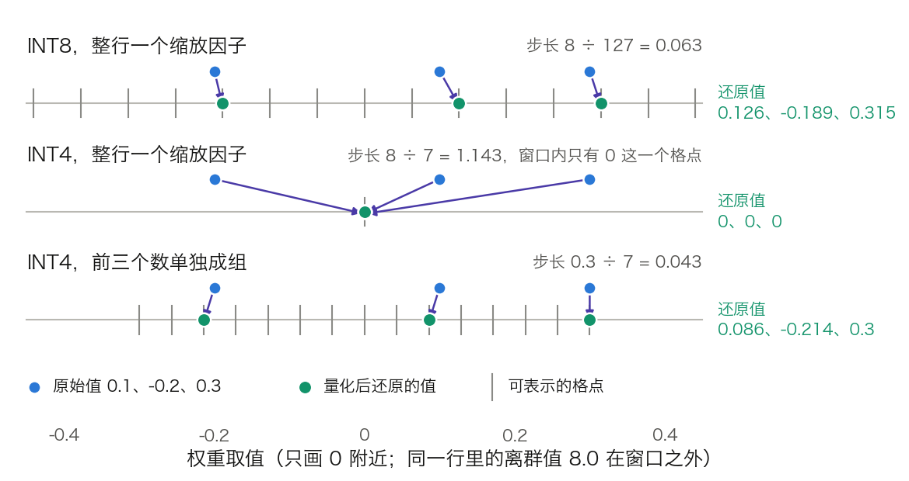

## 10.4 模型量化：用更少的位数表示权重与激活值

**量化**（Quantization）把权重、激活值或 KV 缓存从 16 位浮点换成 8 位、4 位的整数或低位浮点。10.1.2 的账表明，decode 的单步时间约等于每步读取的字节数除以显存带宽；前两节压缩了 KV 和中间结果，占大头的权重字节还没有动。本节回答四个问题：一个数怎样被量化，能省多少、快多少，难点在哪里，怎样对到实现。10.3.4 提到的块级量化针对的是注意力内核里 Q、K、V 激活的小块，与本节的权重分组是同一思想用在不同对象上。

### 10.4.1 量化的基本原理

**一个数怎样被量化。** 最常用的是对称、按最大绝对值定标（absmax）的均匀量化。对一组权重 w，取 b 位有符号整数：

$$
s = \frac{\max|w|}{2^{b-1}-1},\qquad
q = \operatorname{clip}\left(\operatorname{round}\left(\frac{w}{s}\right),\ -(2^{b-1}-1),\ 2^{b-1}-1\right),\qquad
\hat{w} = s \cdot q
$$

$$s$$ 称**缩放因子**（scale），以高精度保存；$$q$$ 是实际存储的整数；$$\hat{w}$$ 是计算时还原出的近似值。非对称量化再加一个**零点**（zero-point）$$z$$，$$\hat{w} = s\,(q - z)$$，适合分布不以 0 为中心的数据。

**手算一行。** 取 `w = [0.1, −0.2, 0.3, 8.0]`，最后一个是离群值。

- INT8：`s = 8 ÷ 127 = 0.063`。`w ÷ s = [1.59, −3.18, 4.76, 127]`，取整得 `q = [2, −3, 5, 127]`，还原为 `[0.126, −0.189, 0.315, 8.0]`。
- INT4：`s = 8 ÷ 7 = 1.143`。`w ÷ s = [0.09, −0.18, 0.26, 7]`，取整得 `q = [0, 0, 0, 7]`，还原为 `[0, 0, 0, 8.0]`。前三个数全部丢失。
- INT4，前三个数单独成组：`s = 0.3 ÷ 7 = 0.043`，`q = [2, −5, 7]`，还原为 `[0.086, −0.214, 0.3]`。

这个例子给出量化的两条基本事实。误差的上界是半个步长 `s/2`，步长由组内最大值决定，所以一个离群值会毁掉同组其他数的精度。把共用缩放因子的范围缩小，是最直接的补救。图 10-9 画出三种方案的格点。

图 10-9：同一行权重在三种量化方案下落到的格点（[生成脚本](https://github.com/yeasy/llm_internals/blob/main/tools/figures/ch10_quant_grid.py)）。只画 0 附近的窗口，离群值 8.0 在窗口之外。

**什么时候量化。** **训练后量化**（Post-Training Quantization，PTQ）在训练完成后直接转换，只需少量校准数据，是 LLM 部署的主流。**量化感知训练**（Quantization-Aware Training，QAT）在训练中模拟量化误差，让模型适应低精度，精度更好，但要付出训练成本。

### 10.4.2 省了多少，快了多少

**有效位宽。** 缩放因子也占空间。每 g 个权重一组、每组一个 FP16 的缩放因子时，有效位宽是 `b + 16/g`。`b = 4`、`g = 128` 时为 `4 + 16 ÷ 128 = 4.125` 位；再带 4 位零点是 4.156 位。表 10-12 按含元数据的口径列出。

| 格式 | 有效位宽 | 相对 16 位的压缩 | 70B 权重 | 精度损失 |
| --- | ---: | ---: | ---: | --- |
| BF16/FP16 | 16 | 1× | 140 GB | 基准 |
| INT8，每输出通道一个缩放因子 | 约 8.0 | 2.0× | 70.0 GB | 极小 |
| MXFP8（32 个数一组，E8M0 缩放） | 8.25 | 1.94× | 72.2 GB | 极小 |
| NVFP4（16 个数一组，E4M3 缩放） | 4.5 | 3.56× | 39.4 GB | 小，依赖硬件与校准 |
| INT4，`g = 128`，FP16 缩放 | 4.125 | 3.88× | 36.1 GB | 小到中等，依方法与规模 |
| INT3/INT2 | 低于 4 | 高于 4× | 低于 35 GB | 中到大 |

表 10-12：不同量化格式的有效位宽与 70B 模型的权重大小。有效位宽 = 数据位宽 + 每组元数据位数 ÷ 组大小；精度损失一列是定性判断，随模型、方法与任务变化。

“INT4 压缩 4 倍”是不计元数据的说法，`g = 128` 时实际是 3.88 倍。

**快了多少，取决于在 Roofline 的哪一段。** 只量化权重（weight-only，如 W4A16）时，矩阵乘仍以 16 位进行，内核先把权重还原再相乘。它减少的是每步读取的字节。

- Decode 在斜线段（10.1.2）。Llama 3 8B 的权重全部按 4.125 位计是 4.14 GB，读一遍 1.24 ms，单请求上限从 209 提到约 809 词元/秒，即 3.88 倍。实际部署中 LM head 常保留 16 位，嵌入表每步只读一行。LM head 与嵌入表各为 `128,256 × 4,096 × 2 B = 1.05 GB`；扣掉嵌入表，BF16 下每步读 `16.06 − 1.05 = 15.01 GB`。线性层按 4.125 位、LM head 留 BF16，每步读 `(15.01 − 1.05) × 4.125 ÷ 16 + 1.05 ≈ 4.65 GB`，约 3.2 倍。
- Prefill 在水平段，瓶颈是算力。W4A16 不减少 FLOPs，还多一步还原，通常不快，甚至略慢。
- 批变大后 decode 也向拐点移动，weight-only 的收益随之缩小：10.1.2 算过，4 位权重的临界批大小降到约 74。[Marlin](https://github.com/IST-DASLab/marlin) 内核的说明是，它能在批大小 16–32 以内保持接近理想的 4 倍加速。

同时量化权重与激活（W8A8、FP8）才用得上低精度的矩阵乘单元，水平段的上界随之抬高：Hopper 的 FP8 Tensor Core 吞吐是 BF16 的 2 倍（10.3.4）。代价是激活难量化，见 10.4.4。

### 10.4.3 实际部署中的量化选择

常见的组合有四种。

- **W8A16 或 W4A16**：只量化权重。部署简单，对单请求或小批的 decode 收益最大；显存受限时用 4 位，配合 GPTQ 或 AWQ 控制损失。
- **W8A8 或 FP8**：权重与激活都量化。Prefill 与大批 decode 都能加速，需要处理激活离群值和校准。FP8 是高端 GPU 上的重要路线。
- **KV 缓存量化**：与权重量化独立，提高并发与上下文容量，见 10.4.6。
- **混合**：权重 4 位，KV 用 FP8，敏感层保留 16 位。

INT8 weight-only 通常几乎无损。W8A8 在未处理激活离群值时会明显掉点，这正是 SmoothQuant 一类方法存在的原因。INT4 的损失与模型规模、方法、任务都有关，小模型与代码、数学、多语种等长尾能力更敏感。评估不能只看困惑度：应同时看目标任务集、长上下文和长尾能力的回归。

### 10.4.4 粒度、离群值与主流方法

共用一个缩放因子的范围称**粒度**。粒度越细，离群值波及的范围越小，元数据越多。

- **张量级**（per-tensor）：整个权重矩阵或整个激活张量共用一个缩放因子。
- **通道级或词元级**：权重 `W[d_in, d_out]` 每个输出通道（每列）一个缩放因子，称 per-channel；激活 `X[T, d_in]` 每个词元（每行）一个缩放因子，称 per-token。
- **组级或块级**（per-group）：在一行或一列内部，每 g 个数一组。GPTQ、AWQ 的 `g = 128`，MXFP8 的 32，NVFP4 的 16，都属于这一类。

**缩放因子要能提到求和号外面。** 低精度矩阵乘要快，内层必须是纯整数的乘加。输出的一格是 $$y_{tj} = \sum_k x_{tk} w_{kj}$$。激活按词元、权重按输出通道量化时，$$x_{tk} \approx s^{x}_{t} q^{x}_{tk}$$，$$w_{kj} \approx s^{w}_{j} q^{w}_{kj}$$，于是：

$$
y_{tj} \approx s^{x}_{t}\, s^{w}_{j} \sum_{k} q^{x}_{tk}\, q^{w}_{kj}
$$

两个缩放因子都不依赖求和下标 k，可以提到外面，求和号里是整数运算。若激活按输入通道量化，缩放因子变成 $$s^{x}_{k}$$，随 k 变化，无法提出，整数矩阵乘就做不成。激活的离群值恰恰集中在少数通道上，最需要的粒度在硬件上用不了。这是 W8A8 的核心矛盾。

#### 激活离群值与 SmoothQuant

[LLM.int8()](https://arxiv.org/abs/2208.07339) 的观察是：幅值可达其他维度 20 倍的特征先出现在约 25% 的层里，随规模增大向其他层扩散；到约 6.7B 参数时发生相变，所有层、75% 的序列位置都受影响。这些离群值高度系统化，在 6.7B 规模上集中在全模型仅 6 个特征维度。该方法把这些维度拆出来用 16 位计算，其余 99.9% 以上的数走 8 位矩阵乘。这种混合精度分解能保住精度，速度收益有限。

[SmoothQuant](https://arxiv.org/abs/2211.10438) 不拆分，而是把量化难度从激活迁到权重。对每个输入通道 j 取平滑系数 $$s_j$$，做数学等价变换：

$$
Y = \left(X \operatorname{diag}(s)^{-1}\right)\left(\operatorname{diag}(s)\, W\right),\qquad
s_j = \frac{\max|X_j|^{\alpha}}{\max|W_j|^{1-\alpha}}
$$

$$\alpha$$ 称迁移强度，论文称 0.5 是把难度均分给两侧的平衡点。$$\operatorname{diag}(s)^{-1}$$ 可以并入前一层的归一化参数，推理时没有额外开销。

**两通道小例。** 激活两个通道的最大幅值为 `[64, 1]`，权重对应两行的最大幅值为 `[1, 1]`。取 `α = 0.5`，`s = [√64, √1] = [8, 1]`。变换后激活为 `[8, 1]`，权重为 `[8, 1]`。按张量做 INT8 量化时，变换前激活的步长是 `64 ÷ 127 ≈ 0.504`，变换后是 `8 ÷ 127 ≈ 0.063`。幅值为 1 的通道能用上的格点数等于幅值除以步长：变换前 `1 ÷ 0.504 ≈ 2` 个，变换后 `1 ÷ 0.063 ≈ 16` 个。权重一侧的动态范围从 1 倍变成 8 倍，但权重是静态的，可以用按通道的缩放因子吸收。

#### GPTQ 与 AWQ

两者都是 weight-only 的训练后量化，常用 4 位、`g = 128`，出发点不同。

[GPTQ](https://arxiv.org/abs/2210.17323) 逐层最小化输出误差 $$\lVert WX - \hat{W}X \rVert_2^2$$，X 是校准数据在该层的输入。它按列依次量化权重；每量化一列，用该目标的 Hessian 逆（由 $$XX^{\top}$$ 得到）把产生的误差补偿到尚未量化的列上。实现上以 128 列为一批更新，并用 Cholesky 分解保证数值稳定。论文报告约 4 个 GPU 小时可把 175B 模型量化到 3 或 4 位。

[AWQ](https://arxiv.org/abs/2306.00978)（Activation-aware Weight Quantization）的观察是：只保护约 1% 的显著权重通道，量化误差就大幅下降，而判断“显著”应看激活幅值，不看权重幅值。它不把这些通道留在 16 位，论文明确指出混合精度对硬件不友好；做法是量化前把显著通道的权重放大 $$s$$ 倍、对应的激活缩小 $$s$$ 倍。放大后的权重相对同一个步长更大，相对误差缩小。$$s$$ 取激活幅值的 $$\alpha$$ 次幂，$$\alpha$$ 在校准集上网格搜索。全部权重仍是同一位宽，不需要反向传播。

两者都依赖校准数据。校准集与目标领域差异大时，GPTQ 的逐层重构更容易过拟合校准集，这是 AWQ 论文给出的对比理由。

#### 数值格式：整数、FP8 与微缩放

**INT8 与 FP8。** INT8 的格点均匀分布，适合幅值集中的数据。FP8 有两种编码：E4M3（4 位指数、3 位尾数，最大值 448）和 E5M2（5 位指数、2 位尾数，最大值 57,344），格点按对数分布，靠近 0 处密、远处疏，对离群值更宽容。[FP8 格式的提案](https://arxiv.org/abs/2209.05433)建议权重与激活用 E4M3，梯度用 E5M2。训练一侧的用法见 [7.6 节](../07_distributed_training/7.6_mixed_precision.md)。

**微缩放**（microscaling）把组级量化做进硬件格式：一小块数共用一个缩放因子，块内每个数用低位浮点。[MX 格式](https://arxiv.org/abs/2310.10537)规定块大小 32、缩放因子为 8 位的 E8M0（只有指数，即 2 的整数次幂），MXFP8 的有效位宽为 `8 + 8 ÷ 32 = 8.25` 位。[NVFP4](https://developer.nvidia.com/blog/introducing-nvfp4-for-efficient-and-accurate-low-precision-inference/) 的块大小为 16，块缩放因子是 E4M3 的 FP8 数，可取非 2 的幂的值，整个张量另有一个 FP32 的二级缩放因子，有效位宽约 `4 + 8 ÷ 16 = 4.5` 位。这些格式与 Blackwell 及之后的硬件、框架和内核支持强相关，不能作为所有推理环境的默认选择；硬件一侧见 [11.12 节](../11_serving/11.12_hardware.md)。

### 10.4.5 组件敏感度层次

模型各部分对量化的敏感度不同，工程上分开配置。

1. **线性层权重**：最不敏感，是 INT4、GPTQ、AWQ 的目标。
2. **线性层的输入激活**：有离群通道，需要 SmoothQuant 一类的处理，或改用动态范围更大的浮点格式。
3. **KV 缓存**：误差会被后续词元反复读取，见 10.4.6。
4. **注意力敏感路径**：logits、Softmax、归一化和输出层通常保留 BF16 或 FP16。

线性层当中，最前面和最后面的层也常保留较高精度，它们直接影响输入表示和词表分布。

### 10.4.6 KV 缓存量化

KV 缓存量化与权重量化相互独立，作用在 10.2.3 公式里的字节数 $$b_{\text{elem}}$$ 上（本节的 $$s$$ 是缩放因子，两者无关）。BF16 换 FP8，每词元 KV 减半，同一个显存池的并发翻倍，每步读取的 KV 字节也减半；容量与带宽的账见 11.4.6。

它的特殊之处有两点。第一，误差长期存在：权重的量化误差只影响当次计算，K/V 的误差写进缓存后被此后每一步读取，上下文越长，累积影响越大。第二，K 与 V 的分布不同。[KIVI](https://arxiv.org/abs/2402.02750) 的统计结论是：Key 的离群值集中在固定的少数通道上，应按通道分组量化；Value 没有这种结构，应按词元分组量化。按通道量化 Key 需要攒够一组词元才能确定缩放因子，最近的若干词元因此要先以高精度保留。

### 10.4.7 对到实现，以及失效情形

**权重怎样存。** 4 位权重打包存放，两个拼成一个字节，或如 AutoGPTQ 的 `qweight` 那样八个拼成一个 32 位整数；缩放因子与零点另存为小张量。Llama 3 8B 的 `down_proj[14336 → 4096]` 用 `g = 128` 时，每个输出通道的 14,336 个输入权重分成 112 组，缩放因子形状为 `[4096, 112]`，FP16 下 0.92 MB；打包后的权重 29.4 MB，BF16 原始大小是 117.4 MB。

**内核。** Weight-only 的收益要靠融合内核兑现：还原与矩阵乘在同一个内核里完成，还原出的 16 位权重不写回显存。先整体还原、再调用普通矩阵乘，读写的字节反而更多。

**框架入口。** Hugging Face Transformers 通过 `from_pretrained` 的 `quantization_config` 参数加载或生成量化模型，如 `GPTQConfig(bits=4, ...)`。vLLM 用 `--quantization` 指定权重量化方法，用 `--kv-cache-dtype` 指定 KV 缓存的存储类型，取值 `auto` 时沿用模型的数据类型，`fp8` 等价于 `fp8_e4m3`。

**失效情形。**

- **批大、上下文短**：工作点接近拐点，weight-only 量化不提速，只省显存。
- **组内有离群值而粒度太粗**：如 10.4.1 的手算，同组的小值全部归零。
- **W8A8 未处理激活离群通道**：精度明显下降，规模越大越明显。
- **校准集与业务分布不一致**：GPTQ、AWQ、SmoothQuant 的参数都从校准数据得出，领域漂移时应重新校准并在业务数据上评估。
- **硬件不支持目标格式**：没有对应的低精度矩阵乘单元时，FP8 或 FP4 只能模拟，既不省时间也未必省显存。

量化改的是每个参数的位宽，参数的数量没有变。直接减少参数是另一条路，见 [10.5 节](10.5_pruning_distillation.md)。
