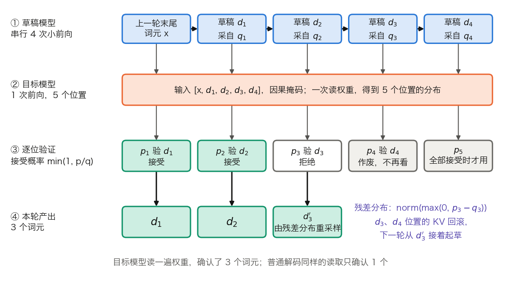

## 10.6 投机解码：为什么“先猜后验”能加速

**投机解码**（Speculative Decoding）让一个便宜的**草稿模型**先猜若干后续词元，再由大的**目标模型**一次前向并行验证。10.4 与 10.5 改的都是模型本身：位宽、参数量，或换一个蒸馏出的小模型。本节的方法不改目标模型的任何权重，改的是每读一遍权重能确认几个词元，即 10.1.3 分类里“让一次读取服务更多词元”的那一类。先给算法和它不改变输出分布的证明，再算能快多少，最后对到实现与工程约束。

### 10.6.1 无损性保证

“先猜后验”不是拿质量换速度。[Leviathan 等](https://arxiv.org/abs/2211.17192)与 [Chen 等](https://arxiv.org/abs/2302.01318)各自提出的 speculative sampling，输出分布与目标模型逐词元采样完全相同。

**一轮的流程。** 记草稿长度为 $$\gamma$$，目标模型在某位置的分布为 $$p$$，草稿模型的为 $$q$$。

1. 草稿模型自回归地跑 $$\gamma$$ 步，逐个采样出 $$d_1, \ldots, d_\gamma$$，并记下每步的分布 $$q_1, \ldots, q_\gamma$$。
2. 目标模型对 `[x, d_1, …, d_γ]` 做一次因果前向，得到 $$\gamma + 1$$ 个位置的分布 $$p_1, \ldots, p_{\gamma+1}$$。
3. 从左到右逐个验证。对草稿词元 $$d_k$$，以概率 $$\min\left(1,\ p_k(d_k)/q_k(d_k)\right)$$ 接受。
4. 第一次拒绝发生在第 k 位时，从残差分布 $$\operatorname{norm}\left(\max(0,\ p_k - q_k)\right)$$ 重新采样一个词元，丢弃其后的全部草稿，本轮结束。
5. $$\gamma$$ 个全部接受时，用 $$p_{\gamma+1}$$ 再采样一个词元，本轮共产出 $$\gamma + 1$$ 个。

每轮至少产出 1 个词元，所以最坏情况与普通解码一样快，只是多付了草稿的开销。图 10-10 画出 `γ = 4`、第 3 个草稿被拒的一轮。

图 10-10：投机解码的一轮，草稿 4 个词元、第 3 个被拒后重采样（[生成脚本](https://github.com/yeasy/llm_internals/blob/main/tools/figures/ch10_spec_round.py)）。

**为什么不改变分布。** 对单个位置，词元 x 被输出有两条路径：被草稿采到并接受，概率为 $$q(x)\min(1, p(x)/q(x)) = \min(p(x), q(x))$$；或草稿被拒后从残差分布采到。总拒绝概率为 $$1 - \sum_x \min(p(x), q(x))$$，它恰好等于 $$\sum_x \max(0, p(x) - q(x))$$，即残差分布的归一化常数。于是：

$$
P(\text{输出 } x) = \min(p(x), q(x)) + \max(0,\ p(x) - q(x)) = p(x)
$$

**三词元手算。** 词表只有 3 个词元，草稿分布 `q = [0.6, 0.3, 0.1]`，目标分布 `p = [0.4, 0.4, 0.2]`。

- 接受概率 `min(1, p/q) = [0.667, 1, 1]`。总接受率 `Σ min(p, q) = 0.4 + 0.3 + 0.1 = 0.8`，拒绝率 0.2。
- 残差 `max(0, p − q) = [0, 0.1, 0.1]`，归一化为 `[0, 0.5, 0.5]`。
- 词元 1：`0.6 × 0.667 = 0.4`。词元 2：`0.3 × 1 + 0.2 × 0.5 = 0.4`。词元 3：`0.1 × 1 + 0.2 × 0.5 = 0.2`。

输出分布为 `[0.4, 0.4, 0.2]`，正是 `p`。草稿把词元 1 估高了，多出的部分以 1/3 的概率被拒，转给了被估低的词元 2 和 3。

**接受率是一个可度量的量。** 单个位置的接受率为 $$\sum_x \min(p(x), q(x)) = 1 - \text{TV}(p, q)$$，TV 是两个分布的全变差距离，上例为 `1 − 0.2 = 0.8`。草稿质量的含义因此很具体：草稿分布离目标分布越近，接受率越高。

**贪心解码是特例。** 温度为 0 时 $$p$$ 是独热分布，规则退化为“草稿词元等于目标模型的 argmax 才接受，否则改用 argmax”，输出与普通贪心解码逐词元相同。并非所有变体都保持同分布：Medusa 提出的 typical acceptance 有意放宽接受条件换取更长的接受长度，输出分布不再与目标模型严格一致。是否无损，要看具体的验证规则。

### 10.6.2 为什么有效

**多数词元容易猜。** 常见词组、语法词、标点、代码里的样板片段，小模型与大模型的分布很接近，这些位置的接受率接近 1。难的位置被拒，由目标模型的分布决定，质量不受影响。

**能快多少。** 假设各位置的接受率独立同分布，均值为 $$\alpha$$。一轮产出的词元数是上限为 $$\gamma + 1$$ 的截断几何分布，期望为：

$$
E[\text{每轮词元数}] = \frac{1 - \alpha^{\gamma+1}}{1 - \alpha}
$$

设草稿模型跑一步的时间是目标模型的 $$c$$ 倍。一轮耗时 $$\gamma c + 1$$ 个目标步，前提是验证 $$\gamma + 1$$ 个位置与普通一步同样快。Leviathan 等的定理 3.8 由此给出期望加速比：

$$
\text{加速比} = \frac{1 - \alpha^{\gamma+1}}{(1 - \alpha)(\gamma c + 1)}
$$

**代入数字。** 表 10-16 取 `c = 0.05`，以 `α = 0.8`、`γ = 4` 为例：`1 − 0.8⁵ = 0.672`，`0.672 ÷ 0.2 = 3.36` 个词元；一轮耗时 `4 × 0.05 + 1 = 1.2` 个目标步；`3.36 ÷ 1.2 = 2.80` 倍。

| $$\alpha$$ | $$\gamma$$ | 每轮期望词元数 | 加速比 |
| ---: | ---: | ---: | ---: |
| 0.6 | 4 | 2.31 | 1.92× |
| 0.8 | 4 | 3.36 | 2.80× |
| 0.8 | 8 | 4.33 | 3.09× |
| 0.9 | 4 | 4.10 | 3.41× |

表 10-16：不同接受率与草稿长度下的期望产出与加速比，取 `c = 0.05`。

从表中读出三点。第一，$$\alpha$$ 比 $$\gamma$$ 重要：$$\alpha$$ 从 0.8 升到 0.9 的收益，超过 $$\gamma$$ 从 4 加到 8。第二，$$\gamma$$ 的收益递减并有最优值：`α = 0.8` 时加速比在 `γ = 8` 附近见顶（3.09 倍），再长反而下降；`α = 0.6` 时最优值在 `γ = 4`。第三，每轮词元数的上界是 $$1/(1-\alpha)$$，`α = 0.8` 时是 5 个，草稿再长也越不过去。原论文在 T5-XXL 上实测到 2–3 倍：英德翻译、T5-small 作草稿、`γ = 7` 时，贪心解码下 `α = 0.75`、加速 3.4 倍，温度 1 下 `α = 0.62`、加速 2.6 倍。

**“验证与一步同样快”何时成立。** 这是 10.1.2 的直接推论。验证 $$\gamma + 1$$ 个位置，相当于把目标模型这一步的算术强度乘以 $$\gamma + 1$$。Llama 3 8B 单请求验证 5 个位置，计算只需 0.08 ms，读权重要 4.79 ms，工作点仍深在斜线段，多出的计算不占时间。批大小为 B 时，一步送入 $$B(\gamma + 1)$$ 个位置。`B = 64`、`γ = 4` 是 320 个位置，已越过 H100 的拐点 295：计算 5.2 ms，超过了读权重的时间，验证不再免费。判据是 $$B(\gamma + 1)$$ 与拐点的比较。投机解码用的是 decode 阶段闲置的算力；批处理已经把这部分算力用掉时，它就没有余量可用。它改善的是单请求的生成速度，不是高并发下的总吞吐。

### 10.6.3 实际部署

**验证一步在实现里的形态。** 目标模型的输入是 `[B, γ+1]` 个词元，与一段短的 prefill 同形：$$\gamma + 1$$ 个新位置之间用因果掩码，每个位置都能读到缓存里的全部历史 K/V，输出 `logits[B, γ+1, n_vocab]`。验证之前，这 $$\gamma + 1$$ 个位置的 K、V 已写入缓存；第 k 位被拒后，第 k 位及其后草稿位置的 K/V 失效，要把缓存长度截回去，分页缓存下则释放多占的块。草稿模型自己的 KV 缓存同步回滚。同一批里各请求的接受长度不同，下一步各自的起点也不同，调度器要按请求记录。

**草稿从哪来。** 几条路线的差别在草稿的来源和形状。

- **独立的小模型**：与目标模型同词表、同系列的小模型，常由蒸馏得到（10.5.2）。实现最直接，要多维护一份权重和一份 KV 缓存。
- **挂在目标模型上的草稿头**：[Medusa](https://arxiv.org/abs/2401.10774) 在最后一层隐状态上加若干解码头，第 k 个头直接预测后面第 k 个位置。[EAGLE](https://arxiv.org/abs/2401.15077) 在倒数第二层的特征空间里做自回归，再经原模型的 LM head 得到词元。两者都不需要独立的草稿模型。
- **多词元预测**（Multi-Token Prediction，MTP）：[DeepSeek-V3](https://arxiv.org/abs/2412.19437) 训练时带一个预测第二个后续词元的 MTP 模块，推理时拿它当自带的草稿头。技术报告给出第二个词元的接受率为 85%–90%，解码速度约为原来的 1.8 倍。这相当于 `γ = 1`：每步期望产出 `1 + α ≈ 1.85–1.9` 个词元。模型结构见 [13.3 节](../13_decoder_models/13.3_deepseek_gemini.md)。
- **无模型的草稿**：从 Prompt 或已生成文本里查找与当前末尾 n-gram 相同的片段，把它后面的词元当草稿。代码编辑、摘要、带引用的问答等输出与输入高度重叠的任务上接受率很高，草稿成本近乎为零。[Lookahead Decoding](https://arxiv.org/abs/2402.02057) 则让目标模型自己并行生成并验证 n-gram 候选。

**树状草稿与树注意力。** 线性草稿在第一次拒绝处作废。Medusa 与 EAGLE 每个位置保留多个候选，组成一棵树，一次前向同时验证树上的所有路径，最后取被接受的最长路径。关键是注意力掩码：每个节点只能看到自己的祖先。设上一轮末尾词元为 r，它的两个候选续写为 a、b，a 之后又有候选 c、d，五个节点按 `[r, a, b, c, d]` 排成一行，掩码如表 10-17。

| 查询＼可见 | r | a | b | c | d |
| --- | :-: | :-: | :-: | :-: | :-: |
| r | 1 | 0 | 0 | 0 | 0 |
| a | 1 | 1 | 0 | 0 | 0 |
| b | 1 | 0 | 1 | 0 | 0 |
| c | 1 | 1 | 0 | 1 | 0 |
| d | 1 | 1 | 0 | 0 | 1 |

表 10-17：五节点候选树的注意力掩码，1 表示可见；各节点另可看到缓存中的全部历史。

b 看不到 a，c 与 d 互相看不到，所以一次前向同时算出了 `r→a→c`、`r→a→d`、`r→b` 三条路径。位置编码按节点在树中的深度取，不按它在这一行里的下标。代价是验证的位置数变多，更早碰到 10.6.2 的拐点判据。

**并行产出整块草稿。** 小草稿模型与 EAGLE 系列的草稿是自回归、逐词产出的，草稿开销随 $$\gamma$$ 近似线性增长，草稿器只能做得很浅；[DFlash](https://arxiv.org/abs/2602.06036)（ICML 2026）的对照实验里，EAGLE-3 的草稿器只有一层 Transformer。DFlash 改用块扩散，让草稿器一次前向并行产出整块草稿，草稿开销不再随长度线性增长。论文对此有两处限定：“在中等 block 规模下”“对 $$\gamma$$ 基本不敏感”，不宜读成与长度完全无关。由此草稿器可以做深：论文报告，五层的 DFlash 草稿器生成 16 个词元，在延迟和接受长度上同时优于生成 8 个词元的 EAGLE-3。开销的瓶颈是串行度而不是计算量时，把它改写成硬件能并行执行的形式，比继续压缩它更有效。

DFlash 的第二个设计点是用目标模型的状态约束草稿器。EAGLE 已在目标模型的特征空间里起草；DFlash 进一步取出目标模型的上下文隐藏状态，经草稿器自己的 KV 投影后写入草稿器每一层的 KV 缓存，论文称 KV injection。换掉的是被投影的那份表示的来源，不是让草稿器直接复用目标模型的 KV。草稿质量在很大程度上取决于草稿器能看到多少目标模型的上下文。

**框架入口。** vLLM、TensorRT-LLM 与 SGLang 都支持投机解码。以 vLLM 为例，通过 `--speculative-config` 传入一个 JSON：`method` 选草稿来源，文档列出的常用取值有 `draft_model`、`ngram`、`suffix`、`mtp`、`eagle3`、`dflash`；`model` 指定草稿模型；`num_speculative_tokens` 即本节的 $$\gamma$$。`ngram` 方法另有 `prompt_lookup_min` 与 `prompt_lookup_max` 控制匹配窗口。

### 10.6.4 性能因素与工程约束

实际加速取决于 10.6.2 公式里的三个量。

1. **草稿成本 $$c$$**：草稿不是免费的。只有平均接受长度足以覆盖草稿开销与验证开销，整体才会加速。`α = 0.8`、`γ = 4` 时，$$c$$ 从 0.05 升到 0.2，加速比从 2.80 倍降到 1.87 倍。
2. **草稿长度 $$\gamma$$**：某个草稿词元被拒，其后全部作废。对逐词产出草稿的方案（小草稿模型、EAGLE、MTP），草稿开销随长度线性上升，应取短而命中率高的草稿；这条经验依赖“草稿是串行产出的”这一前提，对并行块草稿不直接适用。
3. **接受率 $$\alpha$$**：要区分两个量。经典分析假设各位置的条件接受率近似相同，随深度下降的是累计存活概率 $$\alpha^{k}$$，`α = 0.8` 时第 4 位为 0.41，第 8 位为 0.17。在特征空间起草的方案里，草稿器的输入误差逐步累积，条件接受率本身也会随深度下降。

工程上还有三类约束。

- **采样温度**：温度越高，目标分布越平，草稿越难贴近，接受率下降。上文 T5-XXL 的实测里，温度从 0 升到 1，$$\alpha$$ 从 0.75 降到 0.62。创意写作等高温场景收益明显缩水。
- **内容领域**：草稿模型在不同主题上的准确度不同，接受率随之变化。草稿模型的训练数据应贴近业务分布。
- **批大小**：按 10.6.2 的判据，$$B(\gamma + 1)$$ 越过拐点后验证不再免费。

由批大小的约束得出“高并发下应禁用投机解码”是过度简化。DeepSeek 等生产系统更早的做法是退回更短的静态草稿，如 MTP-1（每步只多预测 1 个词元），而不是关掉投机。随负载恶化的是静态的多词元草稿，不是投机本身。[DSpark](https://arxiv.org/abs/2607.05147)（DeepSeek，2026）把这个静态选择换成连续的调节量。草稿器额外输出一个置信度头，估计每个草稿词元通过验证的条件概率，整块的存活概率是它们的累积乘积。再用 Sequential Temperature Scaling 做一次保序的校准，把估计对齐到真实接受率。调度器据此为每个请求、每一步分配验证预算。验证长度随负载平滑下降，不在某个阈值突然关停。有两点要注意：单个请求的预算下界是 0 而不是 1，负载或置信度足够低时可以退化到不验证；负载很轻时裁剪几乎没有收益，这是高并发下才兑现的优化。论文报告，在 DeepSeek-V4 的线上流量中，相同吞吐下单用户生成速度比 MTP-1 基线高 60%–85%。

找到合适的投机配置要在目标流量上实测：草稿来源、$$\gamma$$、树的形状、温度和批大小都影响结果。各项技术之间还相互牵制：量化 KV 缓存缓解了分离式架构里的传输与容量瓶颈，批因此可以开得更大；批越大，可用于投机验证的空闲算力越少。这类取舍不落在任何单项技术内部，要由统一的运行时在每一步裁决，见[第 11 章](../11_serving/README.md)。
