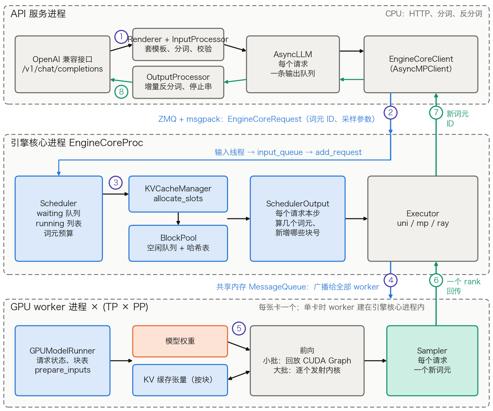
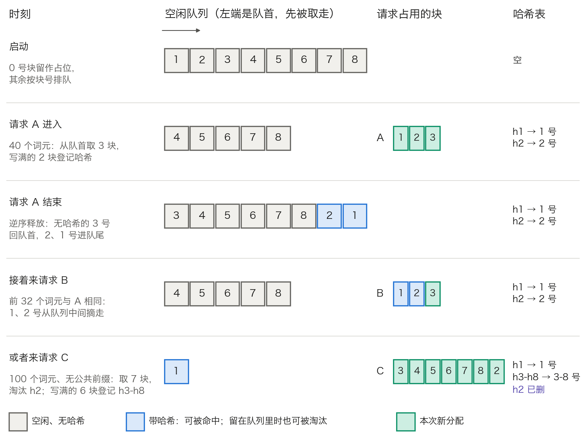

## 11.10 实例剖析：vLLM

11.2 到 11.9 节逐个讲了机制：调度循环、KV 块、前缀复用、多 LoRA、约束解码、多卡并行、分离式部署。本节把它们对到一个真实引擎上，回答三个问题。一个请求从 HTTP 接口到吐出词元要经过哪些组件；每种机制落在哪个模块、哪个数据结构里；启动参数各自调的是哪一个机制。机制本身不再重讲，只给出处。

文中的模块名、参数名和默认值均取自 vLLM v0.29.0（标签对应提交 `98dff2a`）的[源码](https://github.com/vllm-project/vllm/tree/v0.29.0)，指的是其 V1 引擎，即 `vllm/v1/` 目录。vLLM 内部结构变动很快，换一个版本，名字和默认值都可能不同；数据流和取舍则稳定得多，读别的版本时按职责去找对应物即可。算例沿用 3.8 节的 Llama 3 8B（[表 3-11](../03_components/3.8_gpt_inference_flow.md)）：32 层、`d_model = 4,096`、`n_kv = 8`、`d_h = 128`，权重与 KV 缓存均为 BF16。硬件取一张 H100，显存总量按 80 GiB 计，启动参数只加 `--max-model-len 32768`。

### 11.10.1 三类进程：一个请求经过哪里

`vllm serve` 启动的不是一个进程，而是三类：API 服务进程、引擎核心进程、GPU worker 进程。图 11-21 画出它们各自的组件和一个请求的往返路径。

图 11-21：一个请求在 vLLM 三类进程之间的路径（[生成脚本](https://github.com/yeasy/llm_internals/blob/main/tools/figures/ch11_10_vllm_request_path.py)）。蓝色是随请求变化的数据与管理它的结构，橙色是权重，青绿色是本步新产出的词元及其回程；编号对应下文的八步。

1. **输入处理。** API 服务进程收到 HTTP 请求，由 `Renderer`（`vllm/renderers/`，`render_chat`）套聊天模板并分词（见 3.8.2），得到词元 ID 序列。`InputProcessor` 校验采样参数、LoRA 与长度，组装成 `EngineCoreRequest`。
2. **跨进程提交。** `AsyncLLM` 为请求建一条输出队列，`EngineCoreClient` 把 `EngineCoreRequest` 用 msgpack 序列化，经 ZMQ 套接字发给引擎核心进程。过线的是词元 ID、采样参数、可选的 LoRA 与缓存盐，不含文本。
3. **调度。** 引擎核心的输入线程把请求放进 `input_queue`，主线程的忙循环 `run_busy_loop` 取出它交给 `Scheduler.add_request`。此后循环反复执行一步：`schedule()`、`execute_model()`、`update_from_output()`。默认开启异步调度，这一步是 `step_with_batch_queue()`，否则是 `step()`。`schedule()` 向 `KVCacheManager` 申请块，产出一份 `SchedulerOutput`。
4. **下发。** `Executor` 把 `SchedulerOutput` 交给 worker。多卡时默认用 `MultiprocExecutor`，经共享内存消息队列一次广播给全部 worker；单卡时默认用 `UniProcExecutor`，worker 直接建在引擎核心进程内，没有这次传递。
5. **前向与采样。** 每个 worker 的 `GPUModelRunner` 更新本地的请求状态与块表，拼出一批输入，跑前向，为每个请求采样一个新词元（11.10.5）。
6. **回传。** 张量并行的各 rank 结果相同，只有最后一个流水级的 TP rank 0 把 `ModelRunnerOutput` 传回。
7. **更新。** `update_from_output()` 把新词元记到请求上，检查 EOS、停止词元和长度上限，释放已结束请求的块；新词元 ID 经输出线程和 ZMQ 回到 API 服务进程。
8. **反分词与流式输出。** `OutputProcessor` 做增量反分词，匹配停止字符串，把文本放进该请求的输出队列，由 HTTP 层流式返回。

**为什么拆进程。** 分词、反分词和 HTTP 序列化都是 CPU 工作，与 GPU 前向无关。拆出去后，引擎核心的忙循环里只剩调度与收发；官方架构文档给的理由是分离职责、提高吞吐。代价是多一次序列化和进程间传递，所以过线的对象都很小。[官方架构文档](https://github.com/vllm-project/vllm/blob/v0.29.0/docs/design/arch_overview.md)给出的进程数是“API 服务数 + 引擎核心数 + GPU 数”。`-tp 4` 的单机部署为 `1 + 1 + 4 = 6` 个。数据并行时每个 DP rank 一个引擎核心，另加一个协调进程，`-tp 2 -dp 4` 为 `4 + 4 + 8 + 1 = 17` 个。物理核数少于进程数时，吞吐和延迟都会明显变差；引擎核心的忙循环对 CPU 饥饿最敏感（见[优化文档的 CPU 资源一节](https://github.com/vllm-project/vllm/blob/v0.29.0/docs/configuration/optimization.md#cpu-resources-for-gpu-deployments)）。

### 11.10.2 启动时：KV 池有多大

[11.4 节](11.4_kv_memory_management.md)给出显存预算的算法，vLLM 把它做成启动时的一次实测，顺序固定：

1. 加载权重。
2. 用假输入跑一次最大批的前向（`profile_run`，批内有 `max_num_batched_tokens` 个词元），记录显存峰值。
3. 算出能给 KV 的字节数，换成块数。
4. 一次性分配全部块。
5. 捕获 CUDA Graph 并预热。

第 3 步由 `gpu_worker.py` 的 `determine_available_memory` 完成，算的是：

$$
M_{\mathrm{KV}} = u \cdot M_{\mathrm{total}} - M_{\mathrm{weights}} - M_{\mathrm{peak}} - M_{\mathrm{graph}}
$$

其中 u 是 `gpu_memory_utilization`，默认 0.92；后两项是实测的前向峰值和 CUDA Graph 的显存估计。用实测而不用公式，是因为前向峰值取决于具体内核的工作区、编译后的算子融合和采样器的缓冲区，静态估算既难写全，也会随版本失效。实测一次最大批，得到的就是运行时前向峰值的上界。块数再由 `kv_cache_utils.py` 取整：

$$
N_{\mathrm{blocks}} = \left\lfloor \frac{M_{\mathrm{KV}}}{2 \times n_{kv} \times d_h \times \text{每数字节} \times \text{块大小} \times L} \right\rfloor
$$

代入 Llama 3 8B：

- **权重。** 8,030,261,248 个参数（逐项见 [11.4.1](11.4_kv_memory_management.md)），BF16 下 16,060,522,496 字节，即 14.96 GiB。
- **每块字节数。** `2 × 8 × 128 × 2 字节 × 16 词元 × 32 层 = 2,097,152` 字节，即 2 MiB；折合每词元 131,072 字节，正是 3.8.7 算出的 65,536 个数乘 2 字节。
- **KV 池。** 可用上限 `0.92 × 80 = 73.6 GiB`。后两项要看实测，这里示意取 2.64 GiB，则 `73.6 − 14.96 − 2.64 = 56 GiB`，`56 × 1024 ÷ 2 = 28,672` 块，可容纳 `28,672 × 16 = 458,752` 个词元。11.4.1 的 411,525 个词元用的是十进制 80 GB、`u = 0.9`、留 2 GB；这里按 vLLM 日志的口径用 GiB 和默认的 0.92。

启动日志会打印这两个数。一是 `GPU KV cache size: 458,752 tokens`。二是 `Maximum concurrency for 32,768 tokens per request: 14.00x`，即 `28,672 ÷ (32,768 ÷ 16)`。调容量先看这一行。

四点容易看错：

- `gpu_memory_utilization` 是本实例可用显存占总量的比例，权重也算在内，不是 KV 池占比。启动时空闲显存不足这个数，直接报错退出。
- `max_num_batched_tokens` 越大，`profile_run` 的峰值越高，留给 KV 的越少。
- `14.00x` 是所有请求都跑满 32,768 个词元时的下限；实际并发由真实长度决定，并受 `max_num_seqs` 封顶。
- `--kv-cache-dtype fp8` 让每块降到 1 MiB，块数翻倍到 57,344；`--kv-cache-memory-bytes` 可跳过上式直接指定字节数。

### 11.10.3 调度器：没有阶段，只有“还差几个词元”

调度器不分 Prefill 与 Decode 阶段，每个请求只记已算与应算两个词元数，字段名与源码注释见 [11.3.1](11.3_scheduler_loop.md)。

`Scheduler.schedule()` 的顺序就是 11.3.2 的第 2 到第 4 步，抢占谁、怎样恢复见 11.3.5。实现上多出四处细节：

- **要块。** `running` 里每个请求取 `min(差额, 剩余预算)` 个词元，再调 `KVCacheManager.allocate_slots`。返回 `None` 即抢占一个请求后重试，循环到块够用，或被抢占的就是自己为止。
- **接纳 `waiting` 队列。** 除请求数上限 `max_num_seqs` 外，还检查同批 LoRA 数上限 `max_loras`。首次调度的请求先查前缀缓存，命中的词元直接记入已算词元数，不占预算。
- **全量与增量。** `SchedulerOutput` 里，新请求带全量数据 `NewRequestData`（词元 ID、采样参数、块号），老请求只带增量 `CachedRequestData`（新增块号、已算词元数）。
- **词元留在 worker。** 不用流水线并行时，采样出的词元在 worker 上留有一份，调度器不必随 `SchedulerOutput` 把它送回去。

11.3 节的状态机在 `RequestStatus` 里有对应的枚举。排队的状态有四种：

- `WAITING`：普通排队。
- `WAITING_FOR_STRUCTURED_OUTPUT_GRAMMAR`：等语法编译。
- `WAITING_FOR_REMOTE_KVS`：等远端 KV 传完（分离式部署，11.9 节）。
- `WAITING_FOR_STREAMING_REQ`：等流式输入的下一段。

后三种状态的请求被调度器临时跳过，不会挡住排在后面的普通请求。在批里的只有 `RUNNING`，被抢占的是 `PREEMPTED`。其后的取值都表示结束，并记录停止原因：遇到停止词元、达到长度上限、被客户端中止、出错等。

因此同时生效的约束有三个：每步词元预算 `max_num_batched_tokens`、请求数 `max_num_seqs`、空闲块数。vLLM 里没有固定槽位。前两项的默认值按显存分三档（在线服务入口）：

- 不低于 160 GiB：16,384 / 1,024。
- 不低于 70 GiB 且不是 A100：8,192 / 1,024。
- 其余：2,048 / 256。

**算例。** 本节的 GPU 落在中间一档。设 `running` 里有 40 个 Decode 请求，新到一个 20,000 词元的请求，前 4,096 个词元（256 块）命中前缀缓存。

- **准入。** `scheduler_reserve_full_isl` 默认开启，要求整条序列放得下：`⌈20,000 ÷ 16⌉ = 1,250` 块，减去命中的 256 块，需要 994 个空闲块。命中的块若引用计数为 0，也得从空闲队列里摘走，同样计入需求。
- **第 1 步。** 40 个 Decode 用掉 40，预算剩 `8,192 − 40 = 8,152`；新请求差额 `20,000 − 4,096 = 15,904`，取 8,152。分配 `⌈(4,096 + 8,152) ÷ 16⌉ − 256 = 766 − 256 = 510` 块。本批 8,192 个词元、41 个请求。
- **第 2 步。** 剩余 `15,904 − 8,152 = 7,752`，加 40 个 Decode，共 7,792 个词元；Prefill 完成，采出首词元。
- **第 3 步起。** 41 个 Decode，每步 41 个词元。

首词元等 2 步；没有前缀命中则是 `⌈20,000 ÷ 8,152⌉ = 3` 步。代价落在那 40 个老请求上：这两步各是一次约 8,000 词元的前向，它们的词元间隔被拉长到同样的时间。`max_num_batched_tokens` 调大，首词元和吞吐受益，词元间隔的抖动变大；调小则相反。`long_prefill_token_threshold` 可以单独限制一个请求每步最多占多少预算。

**抢占。** 只走重算，原因见 [11.4.5](11.4_kv_memory_management.md)。被抢占请求写满的块带着哈希留在空闲队列尾部；再次调度时按前缀命中拿回，实际重算量常远小于整条序列。`--kv-offloading-size` 走 KV connector，给前缀缓存加一层主机内存，不是抢占路径。

**异步调度。** `async_scheduling` 默认开启，遇到不兼容的配置自动关闭。第 N 步的前向还在 GPU 上跑，调度器就开始排第 N+1 步。做法是给每个 Decode 请求记一个输出占位（`num_output_placeholders`），假定它会再产出一个词元；真实的词元 ID 留在 worker 的 GPU 上供下一步直接使用。收益是消除两步之间 GPU 等 CPU 的空隙。代价是请求若在第 N 步结束，第 N+1 步为它预排的位置作废，其输出被 `update_from_output` 跳过；长度上限可以预知，调度器会跳过这种多余的一步。

约束解码（[11.7 节](11.7_constrained_decoding.md)）也接在这个循环上。每一步先以非阻塞方式发出 `execute_model`；GPU 算前向的同时，引擎核心在 CPU 上算本步的词元掩码（`get_grammar_bitmask`），前向结束后随 `sample_tokens` 一起送到 worker。语法尚未编译完的请求停在 `WAITING_FOR_STRUCTURED_OUTPUT_GRAMMAR` 状态，不进批。

### 11.10.4 KV 块管理：一条队列兼做分配器与 LRU

11.4 节的块表和 [11.5 节](11.5_prefix_reuse.md)的链式哈希，在 vLLM 里落在同一组数据结构上（`vllm/v1/core/block_pool.py` 与 `kv_cache_utils.py`）：

- `KVCacheBlock`：块号 `block_id`、引用计数 `ref_cnt`、块哈希，以及前后两个空闲链表指针。它只是元数据，存在引擎核心进程的 CPU 内存里；KV 张量在 worker 的显存里，两边只靠块号对应。
- `FreeKVCacheBlockQueue`：空闲块的双向链表，指针直接长在块对象上，从中间摘除一块是 O(1)。Python 自带的 deque 做不到这一点，这是自己实现链表的原因。
- `cached_block_hash_to_block`：块哈希到块的映射。
- `null_block`：0 号块，启动时就从队列取走，只作占位，所以可分配的是 `N_blocks − 1` 块。

关键设计是：引用计数归零的缓存块不另行存放，就留在空闲队列里，“空闲”和“已缓存”不互斥。由此，前缀缓存不额外占显存，用的是暂时没人要的块；淘汰也没有单独的流程，分配器从队首取到带哈希的块，把哈希从表里删掉，就完成了淘汰。图 11-22 用 9 个块走一遍。

图 11-22：空闲块队列兼做分配器与前缀缓存的 LRU（[生成脚本](https://github.com/yeasy/llm_internals/blob/main/tools/figures/ch11_10_vllm_free_queue.py)）。块大小 16 个词元；每一行的队列内容由脚本按 `BlockPool` 的规则算出，最后两行是“请求 A 结束”之后的两种走向。

淘汰顺序由三条规则决定，前两条的理由见 [11.5.2](11.5_prefix_reuse.md)：

- **逆序释放。** 链尾先入队；图中 2 号排在 1 号之前，请求 C 淘汰的是 `h2`，公共前缀 `h1` 保住了。
- **入队位置。** 带哈希的块追加到队尾；无哈希的块不可能被命中，插回队首先复用，免得淘汰有用的缓存。
- **命中即 `touch`。** 引用计数加 1，块若还在队列里就从中间摘走；图中请求 B 拿回 1、2 号，只新取 3 号一块。

哈希键由 `hash_block_tokens` 计算，输入是三元组“父块哈希、本块词元、附加键”，首块的父哈希是一个固定种子。哪些因素进附加键、`cache_salt` 怎样隔离租户、默认为何是 `sha256`，见 11.5.7 的表 11-17 与“隔离”一段。这个版本另把 prompt embeds 的哈希放进附加键，并提供更快但不抗碰撞的 `xxhash` 选项。只有写满的块进哈希表，命中上限按块对齐（11.5.2）：图中请求 A 的 40 个词元只能被命中 32 个。请求要 prompt logprobs 时跳过缓存读取，它需要每个位置的 logits。

**worker 侧的块表。** `BlockTables`（`vllm/v1/worker/gpu/block_table.py`）持有两组预分配的张量。一是 `block_tables[max_num_reqs, 每请求最大块数]`（int32），每个 KV 组一张，纯全注意力模型只有 1 组。本例为 `[1024, 2048]`：`max_num_seqs = 1,024`，`⌈32,768 ÷ 16⌉ = 2,048`，占 `1,024 × 2,048 × 4 字节 = 8 MiB`。二是 `slot_mappings[KV 组数, max_num_batched_tokens]`（int64）。每个词元的写入槽位是“块号 × 块大小 + 块内偏移”，由 Triton 内核 `_compute_slot_mappings_kernel` 在 GPU 上算出。设某请求块表行为 `[7, 3, 12]`：位置 37 落在第 `⌊37 ÷ 16⌋ = 2` 个逻辑块（从 0 数起）、块内偏移 `37 − 32 = 5`，槽位为 `12 × 16 + 5 = 197`。新算出的 K、V 按槽位写入，注意力内核按块表读取。

### 11.10.5 worker 的一步与 CUDA Graph

**拼批。** 默认的 model runner 是第二套（`vllm/v1/worker/gpu/model_runner.py`，与引擎的 V1 编号无关，见 11.10.7）。它的 `prepare_inputs` 把全部请求本步的词元摊平成一维：`input_ids[N]`、`positions[N]`、`slot_mapping[N]`，外加 `query_start_loc[请求数 + 1]` 标出每个请求的起止。线性层对 `[N, d_model]` 统一计算；注意力按 `query_start_loc` 和块表分请求计算，这就是 [11.2 节](11.2_continuous_batching.md)说的迭代级批处理。LM head 只取每个请求最后一个词元那一行（`logits_indices`；无投机解码时每请求 1 行，`total_num_logits = num_reqs`）。上文第 1 步的形状是：

- 各层：`hidden[8192, 4096]`
- 取行：`hidden[8192, 4096] → [41, 4096]`
- LM head：`[41, 4096] × W_vocab[4096, 128256] → logits[41, 128256]`

Prefill 尚未完成的请求也占 logits 的一行，采样计数记 0，结果不记入请求，这样批内不必分支。从调度器看，这就是 11.3.2 第 6 步的“不采样”。

**CUDA Graph 解决什么。** Decode 一步的 GPU 计算量很小（3.8.7 表 3-13：GPT-3 Small 每读 1 字节只做约 1 次运算）。一次前向仍要 CPU 逐层逐个发射内核，小批时发射开销占比很高。**CUDA Graph** 把一次前向的内核序列连同参数和显存地址录下来，之后一次调用整体回放，CPU 开销近乎常数。前提是形状和地址固定，由此带来两个做法：

- 输入写进预分配的静态缓冲区，多余位置填占位值。上面的 `input_ids`、`slot_mapping` 都是这种缓冲区。
- 只为有限个批大小各录一张图，实际的批向上取到最近的已录尺寸，填充的行白算。

默认尺寸表是 `[1, 2, 4]`，加 8 到 248 每隔 8 一个，再加 256 起每隔 16 一个，上限为 `min(2 × max_num_seqs, 512)`（数据中心级 Blackwell 上是 1,024）。本例共 `3 + 31 + 17 = 51` 个尺寸；默认模式下纯 Decode 的整图与混合批的分段图各录一套，图的张数约为尺寸数的两倍。41 个 Decode 请求用 48 的图，`7 ÷ 48 ≈ 14.6%` 的行是填充；300 个请求用 304 的图，填充只占 1.3%。超过 512 个词元的批不用图，算例的前两步即是；那时单个内核的运行时间远大于发射开销，录图没有收益。

`cudagraph_mode` 默认为 `FULL_AND_PIECEWISE`：纯 Decode 的批回放整图，注意力也在图内；混合批回放分段图，注意力算子留在图外。原因是注意力的元数据随批的组成变化，不少注意力后端只在纯 Decode 下支持整图（见[官方 CUDA Graphs 设计文档](https://github.com/vllm-project/vllm/blob/v0.29.0/docs/design/cuda_graphs.md)）。代价有两项：每张图占显存，即 11.10.2 公式的末项；捕获会拉长启动时间。`--enforce-eager` 关掉全部图，启动快、省显存，小批 Decode 的延迟变差。

**多卡时调度器看到什么。** 调度器不知道张量并行的存在。每个 worker 各自测出能放多少块，引擎核心取各 rank 的最小值作为统一的块数。此后所有 rank 用同一套块号，各自保存自己那一份 K/V 头（[11.8 节](11.8_multi_gpu_inference.md)）。以 `-tp 2` 为例，每卡只存 4 个 K/V 头，每块降到 `2 × 4 × 128 × 2 × 16 × 32 = 1,048,576` 字节，即 1 MiB；权重也约减半，每卡 7.48 GiB。前向峰值仍示意取 2.64 GiB，则每卡 KV 池为 `73.6 − 7.48 − 2.64 = 63.48 GiB`，合 65,003 块、1,040,048 个词元，是单卡的 2.27 倍。卡数翻倍，KV 容量不止翻倍，因为省下的权重显存也让给了 KV；代价是每层两次 all-reduce，11.8 节有通信量的账。

### 11.10.6 启动参数与机制对照

| 参数 | v0.29.0 默认值 | 调的是什么 | 机制出处 |
| --- | --- | --- | --- |
| `--gpu-memory-utilization` | 0.92 | 本实例可用显存占总量的比例，决定 KV 池大小 | 11.4 节、11.10.2 |
| `--kv-cache-dtype` | `auto`（随模型精度） | KV 每个数的字节数；`fp8` 使块数翻倍 | 11.4 节 |
| `--block-size` | 16 | 每块词元数：内部碎片与前缀命中的粒度 | 11.4 节 |
| `--max-num-batched-tokens` | 按硬件分档，本例 8,192 | 每步词元预算：首词元、吞吐与词元间隔抖动的取舍 | 11.3 节、11.10.3 |
| `--max-num-seqs` | 按硬件分档，本例 1,024 | 每步请求数上限，也决定 CUDA Graph 尺寸上限 | 11.3 节 |
| `--enable-chunked-prefill` | 模型支持即开启 | 关闭后，放不进剩余预算的 Prompt 整条等下一步 | 11.2 节、11.3 节 |
| `--long-prefill-token-threshold` | 0（不限） | 单个请求每步最多占用的预算 | 11.3 节 |
| `--scheduling-policy` | `fcfs` | 排队顺序与抢占对象；`priority` 按请求优先级 | 11.3 节 |
| `--enable-prefix-caching` | 模型支持即开启 | 块哈希表是否启用 | 11.5 节、11.10.4 |
| `--prefix-caching-hash-algo` | `sha256` | 哈希的速度与抗碰撞性 | 11.5 节 |
| `--async-scheduling` | 兼容即开启 | 调度与前向重叠 | 11.10.3 |
| `--compilation-config` 的 `cudagraph_mode` | `FULL_AND_PIECEWISE` | 哪些批回放整图或分段图 | 11.10.5 |
| `--enforce-eager` | 关 | 关掉全部 CUDA Graph | 11.10.5 |
| `--tensor-parallel-size`、`--pipeline-parallel-size`、`--enable-expert-parallel` | 1、1、关 | TP、PP、EP；worker 数为 `TP × PP` | [11.8 节](11.8_multi_gpu_inference.md) |
| `--enable-lora`、`--max-loras`、`--max-lora-rank` | 关、1、16 | 同一批内的适配器数与秩上限 | [11.6 节](11.6_multi_lora_serving.md) |
| `--structured-outputs-config` | 后端 `auto` | 语法掩码由哪个后端计算 | 11.7 节 |
| `--kv-transfer-config` | 无 | KV connector：分离式部署与 KV 卸载共用的通路 | [11.9 节](11.9_disaggregated_serving.md) |
| `--speculative-config` | 无 | 草稿来源与每步草稿数 | [10.6 节](../10_inference_optimization/10.6_speculative_decoding.md) |

表 11-30：vLLM v0.29.0 的主要启动参数、默认值与对应机制。默认值取自 `vllm/config/` 下各配置类与 `vllm/engine/arg_utils.py`；“按硬件分档”的规则见 11.10.3。

### 11.10.7 边界与常见误解

- **并发不是槽位数。** 请求能否进批，取决于词元预算、`max_num_seqs` 和空闲块三者；只调大 `max_num_seqs` 而 KV 池不变，换来的是更频繁的抢占。
- **KV 使用率不含缓存块。** `BlockPool.get_usage()` 按 `1 − 空闲块 ÷ 总块` 计算，躺在空闲队列里的缓存块算空闲。使用率低不代表前缀缓存是空的，使用率高也不代表缓存把池子占满了。
- **抢占是容量信号。** 每次抢占都丢掉一个请求已算的 KV，其中未被缓存保住的部分要重算。持续出现时，该做的是扩大 KV 池（提高 `gpu_memory_utilization`、用 FP8 KV、加张量并行）或压低 `max_num_seqs`；`--watermark` 可以在接纳新请求时预留一部分空闲块，减少刚接纳就抢占的情形。
- **时序。** 前缀缓存不改变输出，但改变时序：命中与未命中的请求首词元延迟差一个 Prefill，按平均首词元延迟做容量规划会失准。
- **职责不变。** 这个版本的默认 model runner 已是第二套（`vllm/v1/worker/gpu/`，设计文档 `docs/design/model_runner_v2.md`）；第一套 `gpu_model_runner.py` 仍在树里，供尚不支持的特性回退。读其他版本时，按“谁排词元、谁管块号、谁持有张量、谁录图”去找对应的模块。
