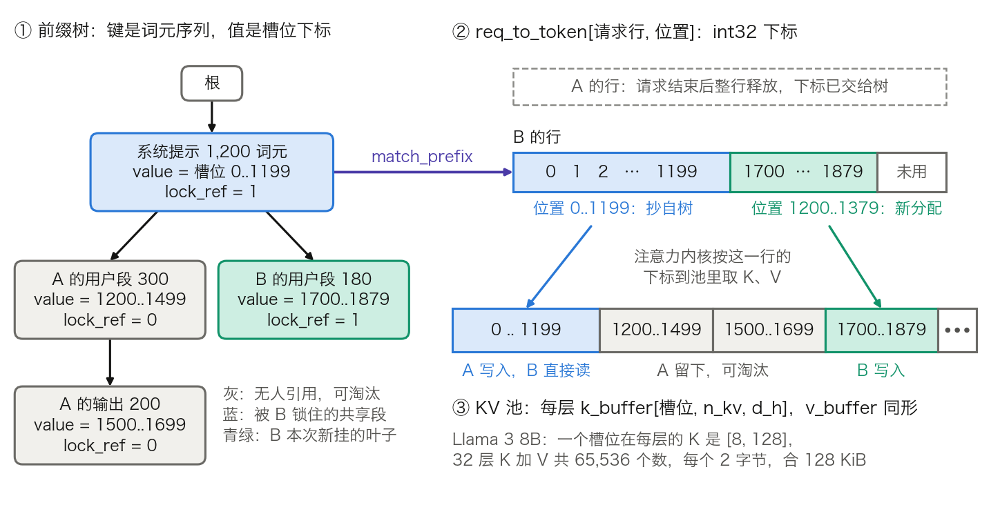
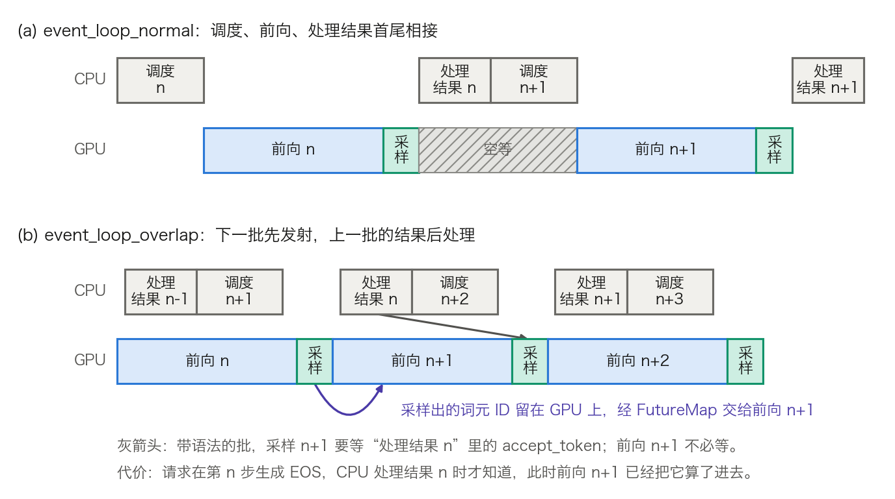

## 11.11 实例剖析：SGLang

[11.10 节](11.10_vllm_internals.md)把本章的机制对到了 vLLM 的模块上，本节对 SGLang 做同样的事。要回答三个问题：[11.5 节](11.5_prefix_reuse.md)的前缀树落到代码里是哪几张表；调度器怎样用这棵树；它与 vLLM 在哪些地方做了不同的取舍。机制本身不再重讲，只讲实现。

凡模块名、参数名和默认值，均取自 [SGLang v0.5.20](https://github.com/sgl-project/sglang/tree/v0.5.20) 的源码和随该版本发布的文档；对比用的 vLLM 取 v0.29.0。SGLang 的目录调整频繁，换一个版本，文件可能已经搬家。读源码时按机制找代码，不要按路径找。

### 11.11.1 两层结构：前端语言与后端运行时

[SGLang 论文](https://arxiv.org/abs/2312.07104)描述的系统分两层：一门嵌在 Python 里的**前端语言**，和一个独立的**后端运行时**（源码目录 `python/sglang/srt`）。

**前端。** 一个 SGLang 程序是加了 `@function` 装饰器的 Python 函数，用几个原语操作“提示状态” `s`。`s += 文本` 追加内容，`gen` 生成一段，`select` 在给定选项里选一个。`fork(n)` 把当前状态复制成 n 份并行推进，`join` 再合并。解释器把每个提示状态当作一条异步流：`gen` 提交后立即返回，Python 代码继续往下走，读取结果时才阻塞。几条分支因此能同时向后端发请求。

**后端。** 后端是一个普通的推理服务，提供原生的 `/generate` 接口和 OpenAI 兼容接口。前端只是它的客户端之一：`RuntimeEndpoint` 把原语翻译成 HTTP 请求。不写前端程序、只把后端当服务用，前缀复用照样生效。

**分工的依据是谁掌握什么信息。** 前端知道程序结构，例如 `fork(3)` 之后必有三个请求共享当前前缀；后端知道缓存里有什么。论文定的原则是前端总是发送完整的 Prompt，匹配与复用全由后端完成；前端走的也是同一个 `/generate` 接口。

例外只有一处，论文称为**前端提示**（frontend hint）。三条分支若同时到达，树里还没有公共前缀，三个请求都未命中，会在同一批里把同一段前缀各算一遍。前端的做法是先把前缀单独提交一次。实现上，`StreamExecutor.fork` 在分支数大于 1 时先提交一条 `SglCommitLazy`。`RuntimeEndpoint` 把它翻译成一个 `max_new_tokens = 0` 的 `/generate` 请求：只做 Prefill，不生成任何词元，唯一的作用是把前缀写进树。设前缀 2,000 个词元、三条分支各追加 50 个：不提示要 Prefill `3 × 2,050 = 6,150` 个词元，提示后是 `2,000 + 3 × 50 = 2,150` 个。论文的消融实验里，关掉前端提示或前端并行，性能都会下降。

后端对同一问题另有一道防线，见 11.11.4 的批内前缀检查。

### 11.11.2 一个请求经过哪些进程

后端由三个组件构成，彼此用 ZMQ 做进程间通信（见 `entrypoints/engine.py` 的说明）。

| 组件 | 所在进程 | 职责 |
| --- | --- | --- |
| `TokenizerManager` | 主进程，与 HTTP 服务同在 | 分词，把词元 ID 发给调度器；收到文本后返回客户端 |
| `Scheduler` | 子进程 | 收请求、组批、执行前向、处理结果；持有前缀树、显存池、语法管理器 |
| `DetokenizerManager` | 子进程 | 把输出词元 ID 增量还原成文本，发回 `TokenizerManager` |

表 11-31：SGLang 后端的三个组件（v0.5.20）。

分词与反分词是纯 CPU 工作。把它们放进独立进程，调度循环就不与它们争用同一个 Python 解释器。调度循环决定 GPU 何时拿到下一批，不能被它们拖住。

`Scheduler` 的主循环每轮做四件事：收请求、决定下一批、执行前向、处理结果。对应的方法依次是 `ingest_requests`、`get_next_batch_to_run`、`run_batch`、`process_batch_result`。状态机与 [11.3 节](11.3_scheduler_loop.md)一致，有两点不同。

第一，一轮要么是 Prefill 批，要么是 Decode 批。`get_next_batch_to_run` 先尝试从等待队列组一个 Prefill 批，组得出来就先跑它，组不出来才让运行中的请求 Decode 一步。源码注释写的是“Run prefill first if possible”。

第二，Prefill 在 SGLang 里叫 **extend**：只为未命中的后缀计算，前缀的 K/V 从缓存读。设请求 B 的 Prompt 有 1,380 个词元，其中 1,200 个命中。以 Llama 3 8B 为例，每头宽度 `d_h = 128`（表 3-16）。每个头的打分是：

```text
Q[180, 128] × Kᵀ[128, 1380] → 分数[180, 1380]
```

Q 只有新算的 180 行，K 有 1,380 行：前 1,200 行读自缓存，后 180 行是本次写入的。它介于 3.8.4 的 Prefill（Q、K 行数相同）与 3.8.5 的 Decode（Q 只有 1 行）之间，两者都是它的特例。

### 11.11.3 RadixAttention 的实现：三张表

先澄清一个名字。源码里的 `RadixAttention` 类（`layers/radix_attention.py`）只是模型定义中的注意力层。它把计算转交给选定的注意力后端，如 FlashInfer、FlashAttention、Triton。RadixAttention 不是一种注意力内核，前缀复用的全部逻辑在 `mem_cache/` 目录下，由三张表配合完成。



图 11-23：三张表怎样接在一起，画的是下文算例第 5 步结束的时刻（[生成脚本](https://github.com/yeasy/llm_internals/blob/main/tools/figures/ch11_11_sglang_three_tables.py)）。蓝色是被请求 B 锁住的共享段，青绿色是 B 本次新写入的部分，灰色无人引用、可以淘汰。

**KV 池。** `MHATokenToKVPool` 为每一层各分配一个 `k_buffer[N + page_size, n_kv, d_h]` 和同形的 `v_buffer`。一行是一个**槽位**，存一个词元在这一层的 K。`N` 是池的容量，多出的 `page_size` 行用作填充：填充的是 0 号槽位所在的一页，真实分配从它之后开始。沿用 [11.4 节](11.4_kv_memory_management.md)的 KV 池，`N = 411,525`。Llama 3 8B 的单层 `k_buffer` 是 `[411,526, 8, 128]`，BF16 下为 `411,526 × 8 × 128 × 2 ≈ 842.8 MB`。32 层、K 与 V 共 64 个缓冲区，合 53.94 GB。另有一个槽位分配器只管哪些行空闲，`alloc(n)` 返回 n 个下标。

**`req_to_token`。** `ReqToTokenPool` 持有一张 `req_to_token[请求数 + 1, 最大上下文]` 的 int32 表：一行对应一个运行中的请求，第 j 列是该请求第 j 个位置的槽位下标。它就是 11.4.3 的块表，只是块大小为 1。注意力内核拿到的是“这一行的前若干格”，据此到池里取 K、V。

**前缀树。** 节点类 `TreeNode` 的关键字段有五个。`key` 是这条边上的词元段。`value` 是一个与 `key` 等长的 int64 张量，存这些词元的槽位下标。`children` 是以子节点首个词元为键的字典。`lock_ref` 是引用计数，`last_access_time` 供淘汰排序。

三张表合起来，“共享前缀”的含义是：同一批整数同时出现在树节点的 `value` 和若干请求的 `req_to_token` 行里。K/V 只有一份，从不复制。

**页大小取 1 的代价。** 每缓存一个词元，树里多 8 字节下标，请求行里多 4 字节。两项合计 12 字节，而它的 K/V 是 131,072 字节，下标开销约为 0.009%。真正占地方的是稠密预分配的 `req_to_token`：256 个请求、131,072 的上下文上限时，它是 `257 × 131,072 × 4 = 134,742,016` 字节，约 134.7 MB。词元级粒度的约束来自内核一侧：部分注意力后端只支持固定的页大小。启用 FlashMLA 时 `page_size` 被强制为 64，TensorRT-LLM 的 MLA 后端只接受 32 或 64。页大于 1 时，`RadixKey.page_aligned` 把键截到页的整数倍，`children` 的键改为一页词元组成的元组。

**算例一：七步走完三张表。** 系统提示 1,200 个词元。请求 A 再带 300 个词元的用户输入，结束时共占 1,700 个槽位；请求 B 带同一段系统提示和另外 180 个词元。表 11-32 的每一行都由一个按 `radix_cache.py` 语义写的小脚本重放得到。槽位编号为示意，从 0 起写只为好算；与 11.5.5 一样，忽略末个输出词元尚无 K/V 的差一。

| 步 | 事件 | 树的变化 | 可淘汰 | 受保护 |
| ---: | --- | --- | ---: | ---: |
| 1 | A 到达，`match_prefix` 命中 0 | 无；分配 1,500 个槽位，Prefill 1,500 个词元 | 0 | 0 |
| 2 | A 的 Prefill 结束，`cache_unfinished_req` | 插入 1,500 的节点，`inc_lock_ref` | 0 | 1,500 |
| 3 | A 结束，`cache_finished_req` | `insert` 返回已有前缀 1,500，新挂 200 的叶子；`dec_lock_ref`，释放 A 的请求行 | 1,700 | 0 |
| 4 | B 到达，`match_prefix` 停在 1,500 节点的第 1,200 个词元 | `_split_node` 拆成 1,200 与 300 两段；返回 1,200 个下标，锁住 1,200 段 | 500 | 1,200 |
| 5 | B 的 Prefill 结束 | 在 1,200 段下新挂 180 的叶子，锁移到叶子 | 500 | 1,380 |
| 6 | 分配器缺 250 个槽位，`evict(250)` | 先淘汰 200 的叶子，其父 300 段变成叶子，再被淘汰 | 0 | 1,380 |
| 7 | A 的下一轮到达，Prompt 为历史 1,700 加新输入 150，共 1,850 | 只命中 1,200，需 Prefill 650 个词元；若无第 6 步，命中 1,700，只需 150 个 | — | — |

表 11-32：算例一的逐步记账。“可淘汰”“受保护”对应源码中的 `evictable_size_` 与 `protected_size_`，单位是词元。

从这张表读出四点。

- 拆分只切下标（见 11.5.3）。`_split_node` 对 `key` 和 `value` 切片，第 4 步前后槽位 0 到 1,699 的内容不变。
- 淘汰以节点为粒度。`evict` 把全部无锁的叶子按策略的优先级建成小顶堆，弹出一个就释放整个节点，累计够数才停。第 6 步要 250，实际释放 500。
- 淘汰是惰性的。分配器够用时树不动；不够时只补差额，调用的是 `evict(所需 − 空闲)`。
- 最先丢的是对话历史。第 6 步里 1,200 的公共段被 B 锁着；即便没锁，它不是叶子，也排在最后。代价落在第 7 步：A 的第二轮要多算 500 个词元。

还有一处细节表里没有体现。两个请求若同时 Prefill 同一段前缀，后完成的那个调用 `insert` 时会发现树里已有这段，返回的 `prefix_len` 大于它自己的 `cache_protected_len`。它随即释放自己重复占用的槽位，并把请求行里的下标改写成树里的那一份，池里不留重复的 K/V。

**淘汰策略与命名空间。** `--radix-eviction-policy` 可取 `lru`（默认）、`lfu`、`slru`、`priority`，差别只在堆的排序键。`lru` 用 `last_access_time`。`lfu` 用 `(hit_count, last_access_time)`。`slru` 把命中次数达到阈值（默认 2）的节点归入保护段，后淘汰。键的隔离靠 `RadixKey.extra_key`：它非空时，`children` 的键变成 `(extra_key, 词元)`，不同命名空间的请求从根开始就走不同的分支。带 LoRA 的请求由 `Req` 的构造函数把适配器 ID 拼进 `extra_key`；多租户隔离另有 `cache_salt`。这对应 11.5.7 的结论：凡是改变 K/V 的因素，都必须进键。

**读源码从哪里入手。** v0.5.20 的默认工厂返回的是 `UnifiedRadixCache`，它把全注意力、滑动窗口和 Mamba 状态三类缓存作为组件挂在同一棵树上。`radix_cache.py` 里的 `RadixCache` 实现同一套 `BasePrefixCache` 接口，只处理全注意力，不到一千行。上文的字段名和方法名均以它为准。`--enable-hierarchical-cache` 把主机内存接成第二级；再配 `--hicache-storage-backend`，外部存储成为第三级。节点的 K/V 可在主机内存留一份备份（`TreeNode.host_value`）。显存里那份被淘汰后节点仍留在树上，命中时再加载回显存。换出与重算的账见 11.4.5。

### 11.11.4 调度器怎样用这棵树：排序、准入与撤回

**排序。** `SchedulePolicy.calc_priority` 每轮给等待队列排序，策略分两类。感知缓存的有 `lpm`（最长前缀优先）、`dfs-weight`、`hrrn`；不感知的有 `fcfs`、`lof`（最长输出优先）、`random`、`routing-key`。

v0.5.20 的 `--schedule-policy` 默认值是 `fcfs`，不是论文里的最长前缀优先。用 `fcfs` 时前缀复用照常生效，因为匹配发生在准入那一刻；只是执行顺序不再为命中率服务。显式选 `lpm` 之后仍有一道保险：等待队列超过 128 个请求时，当轮退回 `fcfs`。两处都指向同一个代价：`lpm` 每轮要为每个等待请求做一次树匹配，并且会让冷门前缀的请求一直排在后面（见 11.5.6）。`hrrn` 是折中：按“入队以来系统已处理的 Prefill 词元数 ÷ 自己未命中的词元数”从大到小排序，命中多的请求优先，等得久的请求也会逐渐升上来。

**批内前缀检查。** `lpm` 与 `hrrn` 在排序前还多做一步。某个等待请求在真树里命中不超过 32 个词元时，调度器把它与一棵只由本轮等待队列构成的临时树比对。若它与排在前面的某个请求共享不少于 32 个词元，就暂时排到队尾：让前一个请求先跑、先把前缀写进树，其余请求下一轮再命中。这正是 11.11.1 里前端提示要解决的问题，后端在不知道程序结构的情况下，用这种办法补救。用默认的 `fcfs` 时，这一步不执行。

**准入。** `PrefillAdder` 逐个决定等待请求能否进入本轮 Prefill。它记三本账：显存一本，计算两本（`--max-prefill-tokens`，默认 16,384；`--chunked-prefill-size`）。显存这本账的余额是：

$$
R = N_{\text{空闲}} + N_{\text{可淘汰}} - \rho \sum_{r\,\in\,\text{运行中}} \min(m_r - o_r,\ 4096)
$$

`m_r` 是请求 r 的 `max_new_tokens`，`o_r` 是它已生成的词元数，4,096 是对超大 `max_new_tokens` 的截断。新请求要记的账是 `未命中的词元数 + min(max_new_tokens, 4096) + page_size`，小于 `R` 才接纳。

这条式子里有两个设计决定。第一，可淘汰的缓存算作空闲，缓存永远不挡新请求的路。第二，运行中的请求还会生成多少词元无从得知，调度器用一个系数 `ρ`（源码中的 `new_token_ratio`）下注。`ρ` 的初值为 `0.7 × schedule_conservativeness`，上限 1。此后每个没有发生撤回的 Decode 步线性下降一次，600 步降到下限，即初值的 0.14 倍。未发生撤回时，估计逐步趋于乐观。

**算例二。** 池里空闲 20,000 个槽位，可淘汰 30,000 个。运行中有 40 个请求，`max_new_tokens` 均为 1,024，各已生成 224 个。

- `ρ = 0.7`：预留 `40 × 800 × 0.7 = 22,400`，`R = 50,000 − 22,400 = 27,600`。
- 一个新请求未命中 2,000 个词元、`max_new_tokens = 1,024`、页大小 1，记账 `2,000 + 1,024 + 1 = 3,025`。只看显存这本账，可连续接纳 9 个，余 375。
- 若按 `max_new_tokens` 足额预留，相当于 `ρ = 1`：`R = 50,000 − 32,000 = 18,000`，只能接纳 5 个。
- `ρ` 降到下限 `0.7 × 0.14 = 0.098` 时：预留 3,136，`R = 46,864`。

**撤回。** 下注会输。某一步 Decode 前 `check_decode_mem` 发现槽位不够，`retract_decode` 就把一部分运行中的请求撤回等待队列。默认的 `--retraction-policy length` 先撤已生成词元最少的；同样少时，先撤输入最长的。撤回之后 `ρ` 按留下的请求重估为 `(已生成词元总数 + 20 × 请求数) ÷ (max_new_tokens 总数 + 1)`，上限同为 1。算例二若撤回 1 个，是 `(39 × 224 + 780) ÷ 39,937 ≈ 0.238`。重估值直接覆盖当前的 `ρ`，不与旧值取大。撤回前 `ρ` 若已降到下限 0.098，此例就是由 0.098 抬回 0.238。频繁撤回时，应调大 `--schedule-conservativeness`。撤回就是 11.3 节的抢占；SGLang 的特点在于用一个自适应系数，主动在“批更大”与“少撤回”之间取平衡。

**重叠调度。** 树匹配、排序、分配槽位、处理结果都是 CPU 上的 Python 代码。若每一轮都等它们做完再发射前向，GPU 每轮都要空等一段。不开流水线并行和分离式部署时，默认的主循环是 `event_loop_overlap`。它让调度器比 GPU 早一批：第 n+1 批的前向先发射，第 n 批的结果后处理，如图 11-24。



图 11-24：调度主循环的两种排法，时间为示意，不按比例（[生成脚本](https://github.com/yeasy/llm_internals/blob/main/tools/figures/ch11_11_sglang_overlap_loop.py)）。灰色是 CPU 上的调度与结果处理，蓝色是 GPU 前向，青绿色是采样。

难点是数据依赖：第 n+1 批的输入正是第 n 批采样出的词元，而 CPU 此时还没拿到它。做法是让这些词元 ID 留在 GPU 上，经 `FutureMap` 按请求行号直接交给下一批，不经 CPU 过手。只要 CPU 一轮的耗时短于 GPU 一步，GPU 就不再空等，前缀树的维护开销也被藏进前向的时间里。[SGLang v0.4 的发布说明](https://www.lmsys.org/blog/2024-12-04-sglang-v0-4/)报告这项改动使吞吐提高到 1.1 倍。

代价是 CPU 看到的状态晚一步。某请求在第 n 步已经生成 EOS，调度器处理第 n 步的结果时才知道，此时第 n+1 步的前向已经把它算了进去，多占一步的算力和一个槽位。`--disable-overlap-schedule` 可关闭重叠。

### 11.11.5 结构化输出的后端

`--grammar-backend` 可取 `xgrammar`、`outlines`、`llguidance`、`none`，不指定时用 `xgrammar`。几个库各自的路线见 11.7.8，这里只看接线。

1. **编译不阻塞调度循环。** 请求带有 `json_schema`、`regex`、`ebnf` 或 `structural_tag` 时，`GrammarManager` 以 `(类型, 语法字符串)` 为键查编译缓存。命中则复制一份匹配器；未命中则把编译任务交给线程池，请求带着一个 Future 进入 `grammar_queue`，不进等待队列。调度循环每轮把已编译完的请求移入等待队列。
2. **每步填掩码。** `SamplingBatchInfo.update_regex_vocab_mask` 分配 11.7.1 所说的位图 `[B, ⌈n_vocab/32⌉]`。每个带语法的请求填自己那一行，其余行保持全 1。位图放在锁页内存里，异步拷到 GPU，由一个 Triton 内核就地改写 logits。
3. **采样后推进状态。** 结果处理阶段对每个请求调用 `grammar.accept_token`。

第 3 步与重叠调度有冲突：第 n+1 批的掩码依赖第 n 批采样出的词元。SGLang 的处理是前向照常提前发射，采样推迟到上一批的结果处理之后（`launch_batch_sample_if_needed`）。被推迟的只有采样这一小步，不是整个前向。这是 11.7.4 里那条数据依赖的具体解法。

**跳跃前进的现状。** 论文的压缩有限状态机（见 11.7.5）在 v0.5.20 里只剩接口。各语法对象仍定义 `try_jump_forward` 与 `jump_and_retokenize`。但在 `python/sglang/srt` 下，`constrained/` 目录之外没有任何调用点。这个版本的约束解码是逐词元加掩码。读到“SGLang 靠跳跃前进加速 JSON 输出”的说法时，应先核对所用版本。

### 11.11.6 与 vLLM 的设计取舍

表 11-33 只列能在两边源码或文档里核实的差异。

| 维度 | SGLang v0.5.20 | vLLM v0.29.0 |
| --- | --- | --- |
| 前缀索引 | 基数树；节点存词元段与槽位下标 | 哈希表；键为 `hash(父块哈希, 本块词元, 额外键)` |
| 粒度 | `page_size` 默认 1，命中精确到词元；部分注意力后端会把它强制改为 64 | `block_size` 默认 16，只缓存写满的块 |
| 淘汰 | 对无锁叶子建堆，整节点释放；`lru`、`lfu`、`slru`、`priority` 可选 | 空闲块双向链表，队首即最久未用；请求释放时各块逆序入队，尾块先被淘汰 |
| 等待队列排序 | 默认 `fcfs`；可选 `lpm`、`dfs-weight`、`hrrn` 等 | `fcfs` 或 `priority` |
| 一步里放什么 | Prefill 批与 Decode 批分开，Prefill 优先；`--enable-mixed-chunk` 才混排 | 不区分阶段，每步按词元预算让各请求的已计算长度追上目标长度 |
| 显存不足时 | 准入时按 `ρ` 预留，Decode 前检查，不够则撤回 | 逐步分配，某步分配失败则抢占优先级最低的运行中请求 |
| 前端语言 | 有 | 无 |

表 11-33：SGLang 与 vLLM 的可核实差异。vLLM 一列取自其[前缀缓存设计文档](https://github.com/vllm-project/vllm/blob/v0.29.0/docs/design/prefix_caching.md)与 v0.29.0 的 `vllm/config/cache.py`、`vllm/v1/core/sched/scheduler.py`。

三点说明。

粒度的差别没有看上去大。1,210 个共享词元，页大小 1 时复用 1,210 个，块大小 16 时复用 1,200 个，页大小 64 时复用 1,152 个。每次匹配最多损失“页大小减 1”个词元。11.5.5 的算例（2,010 个共享词元）里，块大小 16 的 Prefill 计算量是无缓存时的 9.8%，按词元匹配是 9.4%。树的价值不在这十来个词元，而在它向调度器暴露了结构：哪些等待请求落在同一分支上。`dfs-weight` 按子树权重决定先后，批内前缀检查用一棵临时树找出同批请求的公共前缀，都直接用到这一点；按块哈希只能回答“某个请求命中了几块”。

两种淘汰都做到“先丢后缀、后丢前缀”：树靠结构保证，只有叶子可被淘汰；vLLM 靠入队顺序近似。代价不同。vLLM 取队首是 `O(1)`；SGLang 的 `evict` 每次调用都要对全部可淘汰叶子建堆，叶子多时这笔 CPU 开销落在调度循环里。

“Prefill 优先、两类批分开”使新请求的排队时间最短，代价是运行中的请求要停下来等 Prefill 批跑完，TPOT（每输出词元时间）出现抖动。分块 Prefill 限制的是每次停顿的上限。vLLM 的统一预算让每一步都带着 Decode 走，抖动小，但长 Prompt 要分更多步才能算完。两者对应 11.3 节里 TTFT（首词元延迟）与 TPOT 此消彼长的两端。

### 11.11.7 参数与机制对照、边界

| 启动参数 | 默认值 | 对应的机制 |
| --- | --- | --- |
| `--disable-radix-cache` | 关 | 关闭前缀树，请求结束即释放全部槽位 |
| `--page-size` | 1 | KV 池与树的粒度（11.11.3） |
| `--radix-eviction-policy` | `lru` | 淘汰堆的排序键（11.11.3） |
| `--enable-hierarchical-cache` | 关 | 在主机内存保留 K/V 备份；外部存储另需 `--hicache-storage-backend`（11.11.3） |
| `--schedule-policy` | `fcfs` | 等待队列排序（11.11.4） |
| `--schedule-conservativeness` | 1.0 | `ρ` 的初值系数（11.11.4） |
| `--chunked-prefill-size` | 按硬件自动确定 | 分块 Prefill 的块长；−1 为关闭 |
| `--enable-mixed-chunk` | 关 | 分块 Prefill 与 Decode 混排 |
| `--mem-fraction-static` | 按显存自动确定 | 权重与 KV 池占显存的比例（11.4.1 的 `u`） |
| `--disable-overlap-schedule` | 关 | 关闭重叠调度（11.11.4） |
| `--grammar-backend` | `xgrammar` | 约束解码后端（11.11.5） |

表 11-34：SGLang v0.5.20 的主要启动参数与本章机制的对应关系。

几处容易误读的地方：

- **论文与代码不是一回事。** 论文的运行时技术里，前缀树仍是核心；缓存感知排序成了可选项，默认关闭；压缩状态机在 v0.5.20 的调度路径里已不再调用。引用论文的加速比时要同时引用它的条件。
- **6.4 倍不是通用数字。** 论文摘要的“吞吐最高 6.4 倍”出自多调用、高共享的语言模型程序，对比的是论文写作时的 Guidance、vLLM 与 LMQL。同一篇论文也写明：多轮对话里输出较长时，会话之间共享少，时间主要花在 Decode 上，几乎没有加速。前缀复用只省 Prefill（见 11.5.5）。
- **命中不等于留得住。** 原因见 11.5.3 的“共用显存池”。算例一第 6 步那样的淘汰在高负载下频繁发生，多轮对话的历史最先丢。要留住它，靠分层缓存把 K/V 备份在主机内存或 L3 外部存储。缓存感知路由（见 11.5.6）解决的是另一件事：让同一会话回到存有其历史的实例。
- **多实例时每个实例各有一棵树。** 显存里的树和主机内存备份（HiCache 的 L1、L2）是各实例私有的。只有另配 `--hicache-storage-backend` 的 L3 外部存储才跨实例共享。不接 L3 时实例之间不共享缓存，SGLang 的网关用 `cache_aware` 策略维护近似的字符级前缀树来选实例，机制见 11.5.6。各项阈值的默认值随版本变动，以网关源码为准。

两节读下来，vLLM 与 SGLang 对同一批机制给出了两套代码形态：调度器、块表、前缀结构、LoRA 槽位与掩码位图都能在源码里一一对上。这些代码的上限由它跑在什么卡上决定，硬件一侧的账见 [11.12 节](11.12_hardware.md)。
