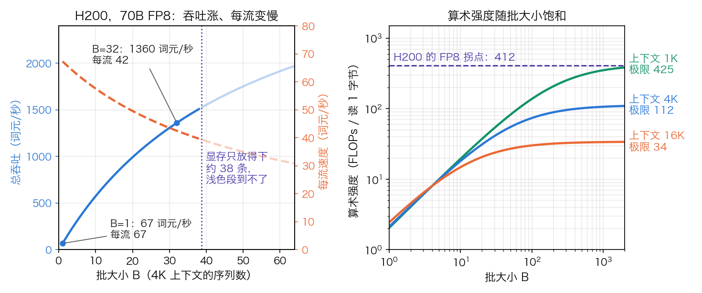

## 11.12 硬件选型：GPU、TPU 与专用加速器

[11.10 节](11.10_vllm_internals.md)和 [11.11 节](11.11_sglang_internals.md)把前面各节的机制对到了两个引擎的代码上，余下的问题是这些代码跑在什么硬件上。[11.9 节](11.9_disaggregated_serving.md)已说明 Prefill 与 Decode 买的不是同一种资源。本节把这句话落到规格表上：给定模型和一张卡，单流最快能跑多快，能同时放下多少请求，每百万词元要花多少钱。三个问题分别由显存带宽、显存容量和“吞吐 ÷ 价格”回答，拿到任何一份数据手册都能照此算一遍。

算例沿用 [3.8.6](../03_components/3.8_gpt_inference_flow.md) 表 3-25 的 Llama 3 70B 与 Llama 3 8B。耗时与吞吐都是上界口径：Decode 的一步只数权重和 KV 缓存的读取，不计激活访存、通信与内核效率，实测值低于这些数字。

### 11.12.1 读懂规格表：哪几行决定推理性能

推理性能主要由三行规格决定：显存容量决定放得下什么，显存带宽决定 Decode 多快，算力决定 Prefill 多快。表 11-35 把 NVIDIA 几代数据中心 GPU 的这三行放在一起，并按 [10.1 节](../10_inference_optimization/10.1_bottleneck.md)的 Roofline 模型算出**拐点** `I_ridge = 峰值算力 ÷ 峰值带宽`：每读 1 字节要配上这么多次浮点运算，算力和带宽才同时用满。

| 型号 | 架构 | 显存 | 显存带宽 | 稠密 FP16/BF16 算力 | 拐点（FLOPs/字节） | 适用场景 |
| --- | --- | ---: | ---: | ---: | ---: | --- |
| A100 80GB | Ampere | 80 GB | 2.04 TB/s | 312 TFLOPS | 153 | 上一代主力，离线批处理 |
| L40S | Ada | 48 GB | 0.864 TB/s | 362 TFLOPS | 419 | 小模型推理 |
| H100 | Hopper | 80 GB | 3.35 TB/s | 990 TFLOPS | 295 | 训练、Prefill |
| H200 | Hopper | 141 GB HBM3e | 4.8 TB/s | 990 TFLOPS | 206 | 大模型 Decode |
| B200 | Blackwell | 180 GB HBM3e | 8 TB/s | 2250 TFLOPS | 281 | 训练与推理 |
| B300 | Blackwell Ultra | 288 GB HBM3e | 8 TB/s | 2250 TFLOPS | 281 | 超大模型推理 |

表 11-35：NVIDIA 主要数据中心 GPU 的推理相关规格，算力统一为稠密口径。数值取自各型号的官方规格页；L40S 取规格页 FP16 Tensor Core 一栏的稠密值 362.05，拐点 `362.05 ÷ 0.864 ≈ 419`；B200 的显存与带宽由 DGX B200 整机的 1,440 GB、64 TB/s 除以 8 得到。B300 的带宽按 GB300 NVL72 规格页的 `576 TB/s ÷ 72 = 8 TB/s`；显存按该页的 `20 TB ÷ 72 ≈ 278 GB` 与 HGX B300 页的 `2.1 TB ÷ 8 ≈ 262 GB` 两种口径均低于沿用的单卡标称 288 GB。

读这类规格表有三个口径陷阱。

- **稀疏与稠密**。H100 规格页的 FP16 Tensor Core 一行写 1,979 TFLOPS，星号注明“With sparsity”；稠密值是它的一半，约 990。HGX B200 页面写 FP16/BF16 为 36 PFLOPS，脚注说明这是稀疏口径、稠密取一半，再除以 8 张卡，单卡稠密 2250。A100 页面则并列写出 `312 | 624`。把 B200 的 2250 与 H100 的 1979 直接相比，会得到 1.14 倍；同为稠密口径是 `2250 ÷ 990 ≈ 2.27` 倍。
- **单卡与整机**。HGX 是 8 卡，GB200 超级芯片是 2 卡，NVL72 是 72 卡。同一页的数字要先除以卡数。
- **单向与双向**。NVLink 的标称带宽是双向合计，H100 的 900 GB/s 单向为 450 GB/s。

拐点一列给出两条结论。第一，A100 到 H100，算力涨了 3.2 倍，带宽只涨 1.6 倍，拐点从 153 升到 295。Decode 的算术强度约等于批大小（10.1 节），要用满 H100 的算力，批得开到近 300。H200 只加带宽，拐点回落到 206。第二，低精度不改变这个临界批。10.1 节的临界批 `B* = 拐点 × 每参数字节 ÷ 2`（BF16 为 295，W4A16 为 74）在此仍适用；权重和计算同降到 FP8 时，峰值算力翻倍使拐点翻到 591，每参数字节却减半，`B*` 仍是 295。FP8 加快的是每一步，不是把算力用满所需的批。

### 11.12.2 从带宽算 Decode 速度上界

**单流上界。** Decode 每生成一个词元，至少要把权重完整读一遍：

$$
\text{词元/秒} \le \frac{\text{显存带宽}}{\text{权重字节}}
$$

以 Llama 3 70B 的 FP8 权重（70 GB）为例，H100 是 `3350 ÷ 70 ≈ 48` 词元/秒，H200 是 `4800 ÷ 70 ≈ 69`。表 11-36 列出三种权重配置的结果。

| 权重配置 | 权重字节 | A100 | L40S | H100 | H200 | B200 |
| --- | ---: | ---: | ---: | ---: | ---: | ---: |
| Llama 3 70B，FP8 | 70 GB | 29 | 装不下 | 48 | 69 | 114 |
| Llama 3 70B，INT4 | 35 GB | 58 | 25 | 96 | 137 | 229 |
| Llama 3 8B，FP16 | 16.06 GB | 127 | 54 | 209 | 299 | 498 |

表 11-36：单流 Decode 速度上界（词元/秒）= 显存带宽 ÷ 权重字节。只比较带宽，未检查 KV 与工作区是否放得下（见 11.12.3）。

同一行里任意两张卡之比就是带宽之比：H200 对 H100 是 `4.8 ÷ 3.35 ≈ 1.43`。NVIDIA 给 H200 标的推理加速是 Llama 2 70B 最高 1.9 倍、GPT-3 175B 约 1.6 倍，都高于带宽比；多出的部分可以由更大的显存放得下更大的批来解释。量化的收益也在这张表里：同一张卡上，INT4 的上界是 FP8 的两倍。

**加上批处理。** 批里有 B 条序列时，权重读一遍，每条序列的 KV 各读一遍：

$$
t_{\text{step}} = \frac{\text{权重字节} + B \times \text{每序列 KV 字节}}{\text{显存带宽}}
$$

H200、70B FP8、每条序列 4K 上下文（FP16 的 KV 为 `4096 × 327,680 ≈ 1.34 GB`）。`B = 1` 时每步读 71.3 GB，14.9 ms，67 词元/秒。`B = 32` 时每步读 `70 + 32 × 1.34 ≈ 112.9 GB`，23.5 ms，每流 42 词元/秒，总吞吐 `32 ÷ 0.0235 ≈ 1360` 词元/秒。吞吐是单流的 20 倍，每流速度降到 0.63 倍。图 11-25 的左图画出了整条曲线。

图 11-25：批处理对 Decode 的作用与极限（[生成脚本](https://github.com/yeasy/llm_internals/blob/main/tools/figures/ch11b_decode_batch_limit.py)）。左：H200 上 70B FP8 的总吞吐与每流速度，竖线是显存容量允许的最大批。右：算术强度随批大小饱和，横线是 H200 的 FP8 拐点。

**批处理推不过的那条线。** 批越大，每步读取里 KV 的占比越高，算术强度不再随批线性增长。计入注意力的运算量（3.8.7：每词元每层约 `4sd`，s 是上下文长度），

$$
I(B) = \frac{B\,(2N + 4 s d L)}{W + B \cdot s \cdot b_{kv}}
\;\xrightarrow{B \to \infty}\;
\frac{2N}{s \cdot b_{kv}} + \frac{2d}{n_{kv}\, d_h\, b}
$$

其中 N 是参数量，W 是权重字节，`b_kv = 2 × L × n_kv × d_h × b` 是每词元 KV 字节，b 是每个 KV 数的字节数。第二项由 `4sdL ÷ (s × b_kv)` 约去 s 与 L 得到。70B、FP16 KV（`b = 2`）、4K 上下文下的极限是 `1.4e11 ÷ (4096 × 327,680) + 2 × 8192 ÷ (8 × 128 × 2) ≈ 104 + 8 = 112`，低于 H200 的 FP8 拐点 412（图 11-25 右）。也就是说，上下文到了 4K，Decode 无论开多大的批都在带宽受限区；按这个公式反推，上下文要短于约 1,060 词元，极限才够得到拐点。第二项是注意力自身的算术强度：FP16 KV 下为 `8192 ÷ (8 × 128) = 8`，KV 用 FP8 则为 16。GQA 让 8 个 KV 头服务 64 个 Query 头，读 1 字节 FP16 的 KV 能换 8 次运算；普通多头注意力只有 1 次。

### 11.12.3 从显存算并发数

**先看权重放不放得下。** 权重显存的十进制 GB 下限是 `参数量（B）× 位宽（bit）÷ 8`。表 11-37 只拿权重与标称显存比较，用来审计数量级；“是”不代表可服务，实际部署还要给 KV 缓存、运行时工作区、通信缓冲、量化缩放因子和碎片留余量。

<!-- numeric-claim: weight-memory -->
| 模型配置 | 参数 B | 位宽 bit | 权重 GB | H100-80GB | H200-141GB | B200-180GB | B300-288GB |
| --- | ---: | ---: | ---: | --- | --- | --- | --- |
| 70B FP8 | 70 | 8 | 70 | 是 | 是 | 是 | 是 |
| 70B INT4 | 70 | 4 | 35 | 是 | 是 | 是 | 是 |
| 405B INT8 | 405 | 8 | 405 | 否 | 否 | 否 | 否 |
| 405B INT4 | 405 | 4 | 202.5 | 否 | 否 | 否 | 是 |

表 11-37：仅权重的十进制 GB 重算与理论单卡容纳关系。边界接近或刚好“是”的组合仍应按服务峰值做实测，并预留安全余量。B300 按每卡 262 GB 计，四行结论不变。

**再看还剩多少给 KV。** 可用于 KV 的显存 = 显存 × 利用率上限 − 权重 − 工作区；除以每条序列的 KV 字节，就是能同时驻留的序列数。取利用率 0.9、工作区 5 GB、70B FP8、每条 4K 上下文的 FP16 KV 为 1.34 GB：

- H100：`80 × 0.9 − 70 − 5 = −3 GB`。表 11-37 里的“是”在这里变成了不可服务。
- H200：`141 × 0.9 − 70 − 5 = 51.9 GB`，约 38 条；KV 改用 FP8 则约 77 条。
- B200：`180 × 0.9 − 70 − 5 = 87 GB`，约 64 条。

这就是 H200 相对 H100 的价值所在。同一颗计算芯片，多出的 61 GB 几乎全部变成 KV 池，70B 的 FP8 部署从“放不下”变成“单卡 38 路并发”，还省掉了多卡张量并行的通信。H100 要服务 70B，只能改用 INT4 权重（剩 `72 − 35 − 5 = 32 GB`，约 23 条），或者上多卡。

更大的模型同理推算。140B 的 FP8 权重是 140 GB，H200 单卡扣掉权重就没有余量，必须多卡。405B 的 INT8 权重 405 GB，超过表中任何单卡；INT4 的 202.5 GB 只有 B300 放得下，且所剩无几。大显存单卡对这类模型的意义不是单卡服务，而是减少张量并行的切分数，把省下的通信换成更大的批和更长的上下文。

### 11.12.4 多卡互连：NVLink 域有多大

单卡放不下时，互连成为选型的第四行规格。H100 规格页给出的两个数字足以说明差距：NVLink 为 900 GB/s，PCIe Gen5 为 128 GB/s，相差 7 倍。

**延迟而非带宽。** 张量并行对互连的要求是延迟。Decode 一步 160 次 all-reduce，批 32 时载荷合计只有约 84 MB，耗时由每次的固定开销决定，张量并行因此一般不跨节点（推导见 [11.8.4](11.8_multi_gpu_inference.md)）。读互连这行规格时，带宽决定 Prefill 侧大消息的通信时间，域的大小决定哪些卡之间能用低延迟的直连。

**NVLink 域的大小。** 它决定并行方式的上限。HGX 这类 8 卡服务器的 NVLink 域是 8 张卡。Blackwell 一代把单卡 NVLink 带宽提到 1.8 TB/s，并把域扩到机柜。**GB200 NVL72** 在一个液冷机柜里放 36 颗 Grace CPU 和 72 颗 Blackwell GPU，用 NVLink Switch 连成一个域，全域带宽 130 TB/s。对推理，域变大的意义是让大规模专家并行可行。[11.9.6](11.9_disaggregated_serving.md) 里 DeepSeek-V3 的 Decode 用 EP320，all-to-all 走 InfiniBand。同样的通信放进 72 卡的 NVLink 域，每次 all-to-all 的延迟低得多。

Blackwell 的其余硬件变化也服务于这个方向。每颗 GPU 由两颗达到光罩尺寸上限的裸片经 10 TB/s 的片间互连封装而成，共 2080 亿晶体管。GB200 超级芯片把一颗 Grace CPU 与两颗 B200 用 NVLink-C2C 相连，CPU 与 GPU 之间的双向带宽为 900 GB/s。KV 换出到主机内存（[11.4 节](11.4_kv_memory_management.md)）的代价随之下降。

NVIDIA 为 GB200 NVL72 标称“万亿参数模型实时推理 30 倍于 H100”“MoE 架构 10 倍”。这两个数要连同脚注一起读：对照组是经 InfiniBand 扩展的 HGX H100；条件是输入 32,768、输出 1,024 词元，首词元 5 秒、每词元 50 ms；并注明为预测性能。NVIDIA 自己给的解释是 FP4 加第五代 NVLink；再加上每卡带宽是 H100 的 2.4 倍，这三项在一个对大 NVLink 域最有利的负载上叠加，不能外推到单卡上的稠密小模型。

### 11.12.5 低精度的硬件支持：NVFP4 的格式与代价

每降一档精度，权重字节和 Decode 每步的读取量同步下降（11.12.2 的表）。Blackwell 的 Tensor Core 原生支持 FP4，NVIDIA 为此定义了 **NVFP4** 格式。它是 [10.4 节](../10_inference_optimization/10.4_quantization.md)块级量化的一个硬件化实例，由三层组成：

1. **元素**：4 比特浮点 E2M1，即 1 位符号、2 位指数、1 位尾数。可表示的幅值只有 8 个：0、0.5、1、1.5、2、3、4、6。
2. **块缩放**：每 16 个元素共用一个 FP8（E4M3）缩放因子。
3. **张量缩放**：整个张量再乘一个 FP32 标量，把数值范围对齐到 E4M3 缩放因子表示得了的区间。

每个元素的有效位宽是 `4 + 8 ÷ 16 = 4.5` 比特，张量级标量可忽略。70B 的权重因此约 39.4 GB，相对 FP16 压缩 `16 ÷ 4.5 ≈ 3.56` 倍，相对 FP8 为 1.78 倍，与 NVIDIA 给出的“约 3.5 倍、1.8 倍”一致。表 11-38 对比三种 4 比特方案。

| 格式 | 元素 | 块大小 | 缩放因子 | 有效位宽 | 70B 权重 |
| --- | --- | ---: | --- | ---: | ---: |
| NVFP4 | E2M1 | 16 | FP8（E4M3），另加张量级 FP32 | 4.5 bit | 39.4 GB |
| MXFP4 | E2M1 | 32 | 2 的整数次幂（E8M0） | 4.25 bit | 37.2 GB |
| INT4 分组量化 | 4 位整数 | 128（常见取值） | FP16 | 4.125 bit | 36.1 GB |

表 11-38：三种 4 比特权重格式的开销。NVFP4 与 MXFP4 的结构取自 NVIDIA 技术博客；INT4 一行按分组 128、FP16 缩放因子、不含零点计算。

取舍在两处。其一，E2M1 的 8 个幅值间隔不均匀，小值处密、大值处疏，比 INT4 的等间隔网格更贴近权重与激活的钟形分布。其二，块越小、缩放因子越精细，量化误差越小，存储开销越大：NVFP4 用更小的块和带小数的缩放因子换精度，比 MXFP4 多花 0.25 比特。NVIDIA 报告的结果是 DeepSeek-R1-0528 在多项评测上由 FP8 转 NVFP4 的精度下降不超过 1%；这是特定模型上的厂商数据，其他模型要自行评测。

算力口径也要对齐：HGX B200 的 FP4 一行写 `144 | 72` PFLOPS（稀疏 | 稠密，8 卡），单卡稠密 9 PFLOPS，是稠密 BF16 的 4 倍。FP4 需要 Blackwell 及之后的硬件；FP8 自 Hopper 与 Ada 起普遍支持；INT4 的权重量化靠软件内核实现，跨平台最成熟。

### 11.12.6 TPU、AMD 与 SRAM 型芯片：不同的取舍

前两小节的算法不依赖厂商，规格表上有显存容量与带宽就能套用。

**Google TPU。** TPU 是 Google 为深度学习设计的加速器，只在 Google Cloud 上提供；Google 自家的 Gemini、PaLM 均在 TPU 上训练。TPU v6e（Trillium）相对 v5e 每芯片峰值算力提升 4.7 倍，HBM 容量、带宽与芯片间互连（ICI）带宽各翻一倍。第八代分成两款：TPU 8t 面向训练，216 GB HBM、6,528 GB/s；TPU 8i 面向推理，288 GB HBM、8,601 GB/s。按 11.12.2 的公式，70B FP8 在 TPU 8i 上的单流上界是 `8601 ÷ 70 ≈ 123` 词元/秒，与 B200 同档。TPU 的取舍在系统层：ICI 把大量芯片直接互连，可以一次申请到数千颗芯片的整片集群；代价是软件栈以 XLA 为中心，可用区域与型号受云厂商供给限制（可用性见[附录 A.5](../appendix/a5_volatile_facts.md)）。

**AMD Instinct。** MI300X 为 192 GB HBM3、5.3 TB/s；新一代 MI355X（第 4 代 CDNA 架构）为 288 GB HBM3E、8 TB/s，并增加了 MXFP6、MXFP4 数据类型。同样的公式给出 70B FP8 的单流上界：MI300X 约 76 词元/秒，MI355X 约 114。规格与同代 NVIDIA 产品相当，差距在软件：vLLM、SGLang 都提供 ROCm 后端，但新内核、新量化格式的支持通常先出现在 CUDA 上。

**SRAM 型推理芯片。** Groq LPU、Cerebras 这一类芯片把权重放在片上 SRAM 里，不经过片外 HBM。按 11.12.2 的公式，带宽高一个量级，单流上界就高一个量级；Groq 自称其片上 SRAM 带宽在 80 TB/s 以上，约为 HBM 的 10 倍。代价在容量：SRAM 的单位面积容量远低于 HBM，一个模型要切到很多颗芯片上，KV 缓存同样要占片上存储。结果是单流延迟很低，而每个模型要占用的芯片数多、每芯片能承载的并发少。它适合为低延迟付溢价的场景，是否划算仍要用 11.12.7 的成本算式判断。

**CPU 推理。** 公式同样适用：主机内存带宽远低于 HBM，只有小模型加 4 比特量化才有可用的速度。llama.cpp 是这条路线上的代表实现，适合低并发、对成本敏感的本地部署；Intel 的 OpenVINO 与 ARM 的专用指令集也在优化 CPU 推理。

### 11.12.7 决策框架与成本算式

选型按下面的顺序做，每一步都对应前面的一个算式。

1. **定模型与精度，算权重字节**（表 11-37）。单卡放不下就要张量并行，互连进入选型（11.12.4）。
2. **定每流速度目标，反推带宽**。需要的带宽 = 目标词元/秒 × 每步读取字节。例：70B FP8、批 16、4K 上下文，每步读 91.5 GB；每流要 50 词元/秒，就要 `91.5 × 50 ≈ 4.6 TB/s`。H200 刚好够，H100 即使放得下也达不到。实时对话这类延迟敏感的场景，TPOT 由 Decode 侧的带宽决定，Decode 不能用低配卡。要再快，靠投机解码（[10.6 节](../10_inference_optimization/10.6_speculative_decoding.md)）让一次权重读取产出多个词元，或加大张量并行把带宽成倍加起来。TTFT 则取决于排队与 Prefill 算力（两个指标的定义见 [11.13.1](11.13_best_practices.md)）。
3. **定并发，算 KV 容量**（11.12.3）。高吞吐的 API 服务要的是大批，显存容量与带宽同样重要。
4. **看输入输出分布**。长输入压 Prefill 的算力与 KV 容量，长输出压 Decode 的带宽与 KV 驻留时间；规模足够时可以分池配卡（[11.9.4](11.9_disaggregated_serving.md)）。离线批处理不要求每流速度，用上一代的卡把批开大即可。
5. **算成本**。比较的对象是每百万词元的成本，不是卡的单价；算式见下。
6. **核对软件生态**。NVIDIA 平台上 vLLM、SGLang、TensorRT-LLM 的支持最完整；ROCm 次之；TPU 只在 Google Cloud 上可用。所选的量化格式与并行方式，要确认目标引擎在目标硬件上有对应的内核。

**成本算式。**

$$
\text{每百万词元成本} = \frac{\text{每卡时价格}}{\text{每秒词元数} \times 3600 \div 10^{6}}
$$

假设某张 H200 的卡时价格为 2 美元（示意值），70B FP8、4K 上下文：批 32 时 1360 词元/秒，成本约 0.41 美元/百万词元；批 1 时 67 词元/秒，约 8.3 美元。同一张卡相差 20 倍，差别只在批大小，代价是每流速度从 67 降到 42 词元/秒。成本优化因此首先是把批开大，其次才是换卡。量化对成本的作用也由此得出：权重从 FP16 降到 FP8 或 4 比特，字节数降到 1/2 或约 1/3.6，同一张卡上的单流上界按同样的倍数上升，省下的显存还能换成更大的批。云上按需与自建的价差随厂商和时间变化，应代入当时的报价来算。

### 11.12.8 下一代平台

Blackwell 之后是 Rubin。按 NVIDIA 规格页，单颗 Rubin GPU 为 288 GB HBM4、19.2 TB/s，稠密 FP16/BF16 算力 4 PFLOPS，互连为第六代 NVLink。用本节的算法读这几行：带宽是 B200 的 2.4 倍，70B FP8 的单流上界升到 `19200 ÷ 70 ≈ 274` 词元/秒；拐点为 `4000 ÷ 19.2 ≈ 208`，低于 B200 的 281，这一代带宽涨得比稠密算力快，对 Decode 有利。发布节奏与各云区域的实际可用性变化很快，见[附录 A.5](../appendix/a5_volatile_facts.md)。

互连的方向与此一致：NVLink 域继续扩大，跨机柜则是 RoCE 以太网、InfiniBand 与光电混合交换并存。某种网络能否支撑目标规模的 all-reduce 或专家并行，取决于拓扑、拥塞控制、作业形态和软件栈，不能只由网络名称判断。
