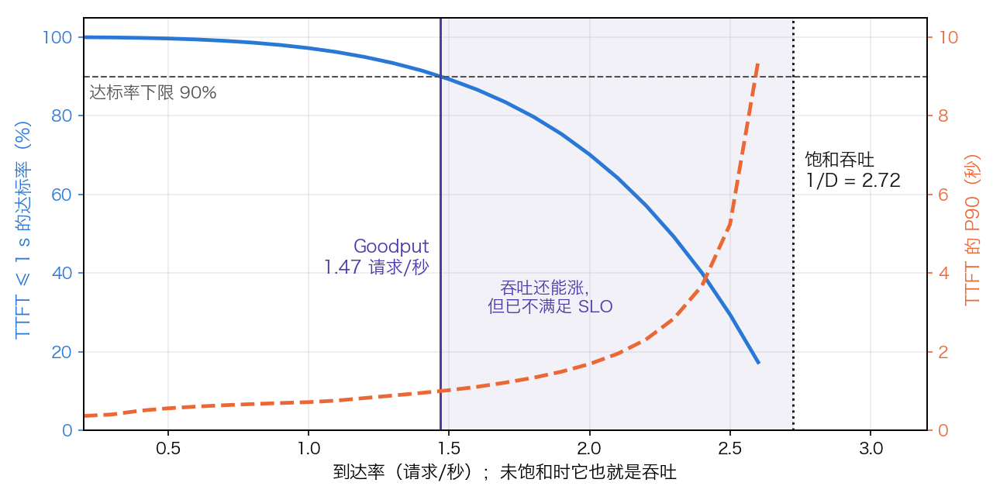

## 11.13 生产部署最佳实践

前面各节给出了引擎的机制和每一步的账。本节把它们变成运维上的判断：性能指标怎样定义、怎样测才算数，给定流量要几个实例，过载时该拒绝谁，看哪个指标判断哪种病。每条做法都回指它所依据的机制。

### 11.13.1 指标：定义、分解与相互关系

**首词延迟**（Time to First Token，TTFT）是从发出请求到收到第一个输出词元的时间。首词元由 Prefill 那一次前向直接选出（3.8.1），不需要再跑一步 Decode。它可以拆成几段：

$$
\text{TTFT} = \text{排队} + \text{套模板与分词} + \text{Prefill（未命中前缀的部分）} + \text{首包的网络时间}
$$

负载高时排队是主项（11.13.2 的图）；前缀缓存命中会直接缩短第三项（[11.5 节](11.5_prefix_reuse.md)）；分离式架构下 KV 传输不计入 TTFT，它推迟的是第二个词元（[11.9.2](11.9_disaggregated_serving.md)）。

**每词元输出时间**（Time Per Output Token，TPOT）是一个请求内除首词元外的平均出词间隔。vLLM 的定义是：

$$
\text{TPOT} = \frac{\text{端到端延迟} - \text{TTFT}}{N - 1}
$$

其中 N 是输出词元数。由此，端到端延迟 = TTFT +（N − 1）× TPOT。例：TTFT 为 0.4 秒，TPOT 为 40 ms，输出 500 词元，端到端是 `0.4 + 499 × 0.04 = 20.36` 秒。对长输出，决定总时长的是 TPOT；对短输出和智能体的多轮工具调用，决定总时长的是 TTFT。

**词元间隔**（Time Between Tokens，TBT；也称 Inter-Token Latency，ITL）是相邻两次输出之间的时间，每个间隔记一个样本。TPOT 是它在请求内的平均，会把偶发的长停顿抹平。设一个请求的 499 个间隔里，498 个是 30 ms，1 个是 1.5 秒（同批进来一个大的 Prefill 块，或请求被抢占后重算，见 [11.3 节](11.3_scheduler_loop.md)）。它的 TPOT 是 `(498 × 0.03 + 1.5) ÷ 499 ≈ 32.9 ms`，看不出异常；这个请求自己的 P99 TBT 也仍是 30 ms，因为 499 个样本里只有 1 个坏点。只有最大 TBT，或跨请求汇总后的高分位，才看得见那次 1.5 秒的卡顿。流畅度的 SLO 因此应当落在 TBT 的高分位上，TPOT 只适合估算总时长。投机解码下一次输出可能带出多个词元，TBT 与 TPOT 的差别更大（[10.6 节](../10_inference_optimization/10.6_speculative_decoding.md)）。

**吞吐量**（Throughput）按请求/秒或词元/秒计。输入词元与输出词元要分开计，两者的单位成本不同（11.13.8）。

**Goodput**（有效吞吐）是满足 SLO 的前提下能承接的最大到达率。DistServe 的定义是：在 SLO 达标率不低于目标值（例如 90%）时，每张 GPU 能服务的最大请求速率。原始吞吐衡量“机器忙不忙”，Goodput 衡量“有多少流量得到了合格的服务”；比较两种架构或两组参数，应比较 Goodput。

SLO 的数值随应用而定。常见的示例是 TTFT 几百毫秒到 1 秒、TPOT 50 ms。50 ms 对应每秒 20 个词元，面向的是人逐字阅读的场景；输出交给程序消费时（智能体、批量抽取），每流速度可以放宽，换更大的批和更低的成本（[11.12.7](11.12_hardware.md)）。

### 11.13.2 Goodput 与压测：怎样测才算数

**测法。** 固定一组 SLO 和达标率目标，从低到高扫到达率，每个到达率下统计 SLO 的达标率，取仍达标的最大到达率。

**一个可复核的例子。** 取 [11.9.4](11.9_disaggregated_serving.md) 的 Prefill 实例：单请求 Prefill 时间 `D = 0.367 s`，先到先服务，近似 M/D/1 队列。SLO 为 TTFT 不超过 1 秒，达标率目标 90%。平均 TTFT 有闭式解 `D + RD² ÷ (2(1 − RD))`，分位数用仿真得到（表 11-39、图 11-26）。

| 到达率（请求/秒） | 利用率 | 平均 TTFT | P90 TTFT | TTFT ≤ 1 s 的达标率 |
| ---: | ---: | ---: | ---: | ---: |
| 0.5 | 0.18 | 0.41 s | 0.56 s | 99.6% |
| 1.0 | 0.37 | 0.47 s | 0.72 s | 97.2% |
| 1.5 | 0.55 | 0.59 s | 1.02 s | 89.3% |
| 2.0 | 0.73 | 0.87 s | 1.69 s | 70.2% |
| 2.5 | 0.92 | 2.41 s | 5.24 s | 29.4% |

表 11-39：M/D/1 队列在不同到达率下的 TTFT，`D = 0.367 s`。平均 TTFT 为闭式解；P90 与达标率为仿真值，取 3 个随机种子各 20 万个请求的平均，达标率 = 样本中 TTFT ≤ 1 s 的比例。利用率 0.92 一行的种子间波动约为 P90 ±0.1 s、达标率 ±0.5%，利用率越高，仿真收敛越慢。

图 11-26：到达率升高时 TTFT 达标率与 P90 的变化（[生成脚本](https://github.com/yeasy/llm_internals/blob/main/tools/figures/ch11b_goodput_curve.py)）。这是排队模型，不是实测。

这台实例的饱和吞吐是 `1 ÷ 0.367 ≈ 2.72` 请求/秒，Goodput 只有 1.47，是前者的 54%。到达率从 1.5 升到 2.5，吞吐照涨，达标率从 89% 掉到 29%。只看吞吐做容量规划，会把工作点定在 SLO 早已失守的区间。

**压测的四个陷阱。**

- **闭环掩盖排队**。固定并发数的压测（闭环）里，上一个请求不返回，下一个就不发出，队列永远堆不起来，尾延迟被系统性低估。测延迟要用开环：按给定速率发请求，不管前面的有没有返回。vLLM 的 `vllm bench serve` 用 `--request-rate` 指定速率，默认按泊松过程到达，`--burstiness` 调突发程度；`--request-rate` 取默认的 `inf` 时所有请求同时到达，测的是最大吞吐，不是负载下的延迟。`--max-concurrency` 则是闭环的并发上限。
- **长度分布要取自真实流量**。表 11-39 的 D 由输入长度决定；KV 占用由输入加输出长度决定。用固定长度压测会同时错估两者。
- **预热与前缀命中**。带相同系统提示的合成请求会得到远高于线上的命中率；冷缓存又会低估稳态性能。压测要复现线上的前缀结构。
- **在客户端测**。TTFT 要含网关与网络。引擎自报的指标不含这两段。

### 11.13.3 容量规划：从到达率到实例数

容量规划把前面几节的账串成一条链：到达率 → 在途请求数 → KV 词元数 → 块数 → 实例数。中间一步靠 **Little 定律**：稳态下，在途请求数 = 到达率 × 平均逗留时间。

**算例。** Llama 3 8B，FP16，单张 H100 一个实例；到达率 10 请求/秒，平均输入 1000 词元、输出 500 词元；SLO 为 TTFT 0.4 秒、TPOT 40 ms。

1. **在途数**。逗留时间按 SLO 上限估：`0.4 + 499 × 0.04 = 20.36` 秒。在途数 `10 × 20.36 ≈ 204` 条。实际 TPOT 低于 SLO 时在途数更少，这是上界。
2. **KV 需求**。一条序列在途期间的平均长度是 `1000 + 500 ÷ 2 = 1250` 词元，合计 `204 × 1250 = 255,000` 词元。每词元 KV 为 128 KiB（[3.8.7](../03_components/3.8_gpt_inference_flow.md) 的 65,536 个数乘 2 字节），每块 16 词元，约 15,900 块，31.1 GiB，合 33.4 GB。
3. **KV 供给**。沿用 [11.4.1](11.4_kv_memory_management.md) 的 KV 池：`80 × 0.9 − 16.06 − 2 = 53.94 GB`，约 411,500 词元、25,700 块。占用率 `255,000 ÷ 411,500 ≈ 62%`。
4. **Decode 时间**。一步读 `16.06 + 33.4 ≈ 49.5 GB`，H100 上 `49.5 ÷ 3.35 ≈ 14.8 ms`（[11.12.2](11.12_hardware.md) 的公式）。TPOT 40 ms 要求每秒 25 步，Decode 占用 `25 × 14.8 ms ÷ 1000 ms ≈ 36.9%` 的时间。
5. **Prefill 时间**。每秒 10,000 个输入词元，计算量 `2 × 8.03e9 × 10,000 ≈ 1.6e14` FLOPs/s；H100 按 40% 利用率可提供 `990e12 × 0.4 = 3.96e14`，占 40.6% 的时间。
6. **结论**。单实例在 10 请求/秒下 KV 用到 62%，时间用到 `36.9% + 40.6% ≈ 77%`；若以 80% 为水位线，时间已贴线。取峰值为均值的 2 倍，需要 2 个实例；再加 1 个冗余以容忍单实例故障，共 3 个。

两点说明。第 4、5 步把 Prefill 与 Decode 的时间简单相加，没有计混批时权重只读一遍的节省，偏保守；全部数字又是不计通信与内核效率的上界，偏乐观。两者不会恰好抵消，规划值必须用 11.13.2 的压测校准。这条链的价值在于指出哪种资源先到顶：本例时间先到顶，KV 紧随其后；输出更长的负载会先耗尽 KV，输入更长的负载会先耗尽 Prefill 的时间。

### 11.13.4 过载、取消与扩缩容

**过载时队列不能无界。** M/D/1 的排队项 `RD² ÷ (2(1 − RD))` 在利用率趋近 1 时发散；到达率超过服务率后，队列与 TTFT 随时间无限增长，排在后面的请求注定超时，却仍要占用 Prefill 算力。应对是准入控制：等待队列设上限，超出即返回过载错误，让客户端退避重试或由网关转去别的集群。

**拒绝要趁早。** 分离式架构下，请求可能在做完 Prefill 之后才被 Decode 侧拒收，已花的算力全部作废。Mooncake 的做法是**早拒绝**（Early Rejection）：请求到达时，调度器取 Prefill 池与 Decode 池中负载较高的一侧来决定是否接收。论文同时报告了副作用。按当前负载早拒绝，会让两个池的负载出现反相振荡，因为 Decode 侧的负载要等 Prefill 做完才体现。改为预测请求到达 Decode 时的负载后，振荡才得到缓解。

**取消必须立即回收 KV。** 客户端断开或超时后，引擎要中止该请求并释放它的块。否则这条序列继续生成到 `max_tokens`，白占 KV 与批内位置。网关层要把断连向后传到引擎，这是线上显存“缓慢泄漏”的常见来源。

**按什么信号扩容。** GPU 利用率不是好信号：它只表示有内核在运行，Decode 受带宽限制时读数同样很高（10.1 节）。可用的信号有三类：等待队列长度或排队时间，反映算力缺口；KV 缓存占用率与抢占次数，反映显存缺口；TTFT 与 TBT 的高分位，直接对应 SLO。扩容还受冷启动限制：新实例要拉取并加载权重、预热内核与 CUDA Graph，耗时以分钟计，来不及应对突发。突发只能靠预留余量和准入控制吸收。

### 11.13.5 AI 网关与词元感知路由

应用很少直接调用推理引擎的 API，两者之间通常有一层 **AI 网关**（如 LiteLLM、Kong 一类产品），承担下面几件事：

- **统一接口**：屏蔽不同供应商与自建集群的 API 差异，对上提供 OpenAI 兼容接口。
- **降级与熔断**：主集群故障或延迟激增时，把请求转到备用模型或云端 API。
- **灰度与 A/B**：按比例把流量切到新版本的模型或引擎。
- **计量与计费**：按输入、输出、缓存命中分别记录词元数，支持多租户计费。
- **安全控制面**：认证、授权、TLS/mTLS、请求校验、租户隔离、审计日志与密钥脱敏。

**负载均衡要感知词元。** 按连接数或 CPU 利用率均衡对 LLM 无效：一个 100 词元的请求与一个 100K 词元的请求，占用的 Prefill 时间和 KV 相差三个数量级。路由要用的是各实例的等待队列长度、KV 占用率，以及请求前缀在各实例上的缓存命中长度。把共享前缀的请求送到同一个实例，可以省掉重复的 Prefill；亲和与均衡相互冲突时怎样取舍，见 [11.5 节](11.5_prefix_reuse.md)。

Mooncake 把这一思路推到集群级。它以 KV 缓存为中心组织调度：全局调度器 Conductor 掌握 KV 块在各节点上的分布，为每个请求选择 Prefill 与 Decode 实例，并在有利时复制热块、换出冷块。[技术报告](https://arxiv.org/abs/2407.00079)给出的结果是：相对 4 个 vLLM 实例组成的基线（文中记为 vLLM-[4M]），在模拟的长上下文场景里，满足 SLO 的吞吐提升 50% 到 525%；在真实负载下，可多处理约 75% 的请求。前一组数字出自 16K 到 128K 词元输入的模拟数据。该实验里基线 vLLM 为避免长输入扰乱 Decode 而逐个处理请求、不合批，结果不能外推到短输入的负载。

### 11.13.6 流式输出

**流式输出**（Streaming）在每个词元生成后立即返回，不等整个回答完成。它不缩短任何一段计算，只是让用户感知的等待从端到端延迟变成 TTFT。引擎通常用 Server-Sent Events（SSE）推送；服务之间的高 QPS、双向流场景可以用 gRPC，面向浏览器的单向文本流用 SSE 更简单。协议本身的每词元开销要在自己的系统上测。

实现上有三个容易出错的地方。

- **增量反分词**。字节级 BPE（[3.1 节](../03_components/3.1_tokenization.md)）的一个词元未必是完整的字符：一个汉字的 UTF-8 编码占 3 字节，可能被切进两个词元。逐词元反分词再直接发出，会发出半个字符的乱码。正确做法是缓冲到字节序列能解码成完整字符再发。
- **停止字符串要回看**。停止条件是字符串时，它可能跨多个词元。引擎要扣住末尾“停止串长度减一”个字符暂不发出，确认没有命中才放行。
- **代理缓冲**。反向代理默认会攒够一块响应再转发，流式输出就变成一段一段地跳。以 nginx 为例，`proxy_buffering` 默认开启，需要在该路径上关闭，或由后端返回 `X-Accel-Buffering: no` 响应头。长 Prompt 或排队期间连接上没有数据，还要把各级代理的空闲超时调到大于最坏情况的 TTFT。

### 11.13.7 可观测性：看哪个指标判断哪种病

引擎把调度器的内部状态以 Prometheus 指标导出。以 vLLM 的 `/metrics` 端点为例，值得长期保留的有：

- 状态量：`vllm:num_requests_running`、`vllm:num_requests_waiting`、`vllm:kv_cache_usage_perc`。
- 计数器：`vllm:num_preemptions`、`vllm:prefix_cache_queries` 与 `vllm:prefix_cache_hits`（两者之比是命中率）、`vllm:prompt_tokens`、`vllm:generation_tokens`。
- 直方图：`vllm:time_to_first_token_seconds`、`vllm:inter_token_latency_seconds`、`vllm:request_time_per_output_token_seconds`、`vllm:request_queue_time_seconds`、`vllm:e2e_request_latency_seconds`。

vLLM 的设计文档对这两类指标的关系有一句概括：服务级指标用来解释请求级指标。表 11-40 把这句话展开成诊断表。

| 现象 | 同时看到 | 判断 | 处置 |
| --- | --- | --- | --- |
| TTFT 高分位上升 | 等待数上升，KV 占用不高 | Prefill 算力不足，请求在排队 | 加实例；提高前缀命中；长输入多时考虑分离 Prefill |
| TTFT 高分位上升 | 等待数上升，KV 占用贴顶 | KV 放不下，新请求无法准入 | 加实例或加大张量并行；KV 量化；限制最大长度 |
| TBT 高分位出现尖峰，TPOT 正常 | 抢占计数上升 | 块用尽后被抢占重算（11.3 节） | 降低并发上限；给 KV 池留余量 |
| TBT 高分位出现尖峰，TPOT 正常 | 抢占计数不变，有长输入到达 | Prefill 块拉长了这一步（11.9.1） | 调小每步词元预算；分离 Prefill |
| TPOT 整体偏高 | 运行数很大 | 批过大，每步读取的 KV 过多（11.12.2） | 限制并发上限；扩容 |
| 吞吐低、延迟也低 | 运行数很小，KV 占用低 | 流量不足或上游限流，批没开起来 | 合并流量；缩容 |
| 前缀命中率骤降 | 刚发布新的提示词模板或模型 | 缓存键变了，旧缓存全部失效 | 灰度发布；预热 |

表 11-40：由指标组合判断瓶颈所在。指标名取自 vLLM，各引擎的名称不同，含义相近。

引擎之外还要监控两类量。一是输入输出长度分布的漂移：11.13.3 的容量结论以长度分布为前提，分布一变，结论随之失效。二是质量与安全事件：拒答率、护栏拦截率、工具调用超时，这类问题在延迟指标上没有任何痕迹。

### 11.13.8 成本

**算式。** 每百万词元成本 = 每卡时价格 ÷（每秒词元数 × 3600 ÷ 10⁶），见 [11.12.7](11.12_hardware.md)。落到单个请求上，输入与输出要分开计价：

$$
\text{每请求成本} = T_{\text{in}} \times (1 - h) \times p_{\text{in}} + T_{\text{out}} \times p_{\text{out}}
$$

其中 h 是前缀缓存命中的比例，`p_in`、`p_out` 是输入、输出词元的单位成本。

**输出为什么比输入贵。** 同一张 H100、Llama 3 8B、卡时价格假设为 2 美元。Prefill 按 40% 利用率可达 `3.96e14 ÷ (2 × 8.03e9) ≈ 24,700` 词元/秒，`p_in = 2 ÷ (24,700 × 3600 ÷ 10⁶) ≈ 0.023` 美元/百万词元。Decode 在批 32、平均长度 1250 时，每步读 `16.06 GB + 32 × 1250 × 131,072 B ≈ 21.3 GB`，耗时 `21.3 ÷ 3.35 ≈ 6.4 ms`，约 5,000 词元/秒，`p_out` 约 0.11 美元，是输入的 4.9 倍。批开到 204 时每步读 49.5 GB、14.8 ms（11.13.3 的第 4 步），约 13,800 词元/秒，`p_out` 降到 0.040 美元，是输入的 1.8 倍。Prefill 能用满算力，Decode 被带宽卡住，这就是 API 定价里输出普遍贵于输入的原因；两者的比值取决于批能开多大。

**命中缓存的输入为什么能打折。** 11.13.3 的请求（输入 1000、输出 500），不命中时每请求约 `1000 × 0.023 + 500 × 0.040 ≈ 43` 微美元；命中率 0.8 时为 `200 × 0.023 + 500 × 0.040 ≈ 25` 微美元。命中部分不再消耗 Prefill 算力，只占 KV 块。

由算式可以直接读出各项优化的作用点：

- **量化**（[10.4 节](../10_inference_optimization/10.4_quantization.md)）：减少每步读取的字节，提高每秒词元数；同时腾出显存给更大的批。
- **选合适的模型**：成本与参数量近似成正比。能用小模型或蒸馏模型达标的任务，不必上大模型。
- **优先级与错峰**：在线流量按峰值配置，低谷时算力闲置。离线任务（批量清洗、评测）以低优先级填进空闲的批位，抬高全天的平均批大小。
- **提高前缀命中率**：稳定的系统提示放在最前，可变内容放在最后（[11.5 节](11.5_prefix_reuse.md)）。
- **语义缓存**：对语义相近的请求直接返回已有的回答，连 Decode 也省掉。缓存键与检索范围必须纳入租户、权限范围、模型与版本、系统提示、工具状态和 PII 标记；含私有文档、工具输出或 PII 的回答，默认禁止跨用户命中。语义向量相近只说明问题相似，不保证在另一个用户的上下文里答案同样正确。

### 11.13.9 安全与合规

生产服务要在引擎之外加**护栏**（Guardrails）。它同样服从本章的延迟账：输入侧的检查计入 TTFT，输出侧的检查若要等整段生成完再判定，就与流式输出冲突。

- **分层检测**。规则层成本最低，适合已知风险，例如 NeMo Guardrails 用 Colang 描述对话约束。分类层用专门的安全分类模型，如 Llama Guard；Llama Guard 3-8B 面向文本，Llama Guard 4-12B 面向多模态，选型要按模态、延迟、成本和误报漏报率评估。高风险输出再交给更强的模型裁决，或拒答后重新生成；这一层最贵，只用于前两层拿不准的样本。
- **流式输出下的折中**。输出侧检查可以按句或按固定词元数分段进行，代价是不合规内容可能已经发出一部分；高风险场景只能关闭流式，或延迟一个检查窗口再发。
- **数据隐私**。对输入里的 PII 做脱敏；日志、前缀缓存与语义缓存都是用户数据的副本，要纳入同一套留存与隔离策略。
- **速率限制**。限流按词元而不是按请求计：一个 100K 词元的请求消耗的资源抵得上上千个短请求。按用户、按密钥监控词元消耗速率。
- **评估闭环**。为越权工具调用、提示注入、数据外泄、误拒与高风险领域输出建立回归集；新模型、新提示词、新工具上线前跑一遍，上线后用真实事故样本持续补充。

### 11.13.10 多模态与长上下文的部署问题

**多模态输入。** 图像经视觉编码器变成一串嵌入向量，与文本词元一样进入 Prefill，一样占 KV 块；块大小与模态无关。部署上新增的问题有三个。第一，前缀缓存的键必须包含图像内容：文本词元相同而图片不同的两个请求不能共享 KV，块哈希要纳入图像内容的哈希（[11.5 节](11.5_prefix_reuse.md)）。第二，同一张图在多轮对话里不必反复处理。vLLM 有两层缓存：前端的多模态处理器缓存，缓存 HF 处理器的预处理结果，`vllm:mm_cache_queries` 与 `vllm:mm_cache_hits` 统计的是它的命中；调度器管理的编码器输出缓存（`EncoderCacheManager`），按输入项的哈希在请求间共享编码器输出。第三，视觉编码是计算密集的，与 LLM 的 Decode 同卡会造成 11.9.1 那样的干扰。图像或视频流量大时，可以把编码器拆成独立的池，把嵌入向量传给 LLM 实例。NVIDIA Dynamo 等系统提供了这种编码器分离的部署形态，它仍属较新的做法，收益取决于图像流量的占比。

**超长上下文。** 128K 到 1M 词元的上下文先耗尽的是 KV 容量：Llama 3 70B 每词元 320 KiB，100 万词元是 `1,000,000 × 327,680 ≈ 328 GB`（305 GiB，同 [14.7.1](../14_future_trends/14.7_long_context.md) 的口径），单个请求就超过任何单卡。可用的手段有三类：KV 量化与换出到主机内存（[11.4 节](11.4_kv_memory_management.md)）；模型侧的 MLA 或混合注意力（[10.2 节](../10_inference_optimization/10.2_kv_cache.md)）；沿序列维把注意力切到多卡的 Ring Attention（[10.3 节](../10_inference_optimization/10.3_flash_attention.md)称之为序列并行，也常称上下文并行）。最后一类能把长序列分到多卡，稠密注意力的计算量仍按长度的平方增长。能否以可接受的延迟支撑 1M 词元的生产流量，取决于模型结构、批大小、网络带宽与 SLO，要按 11.13.2 的方法实测。
