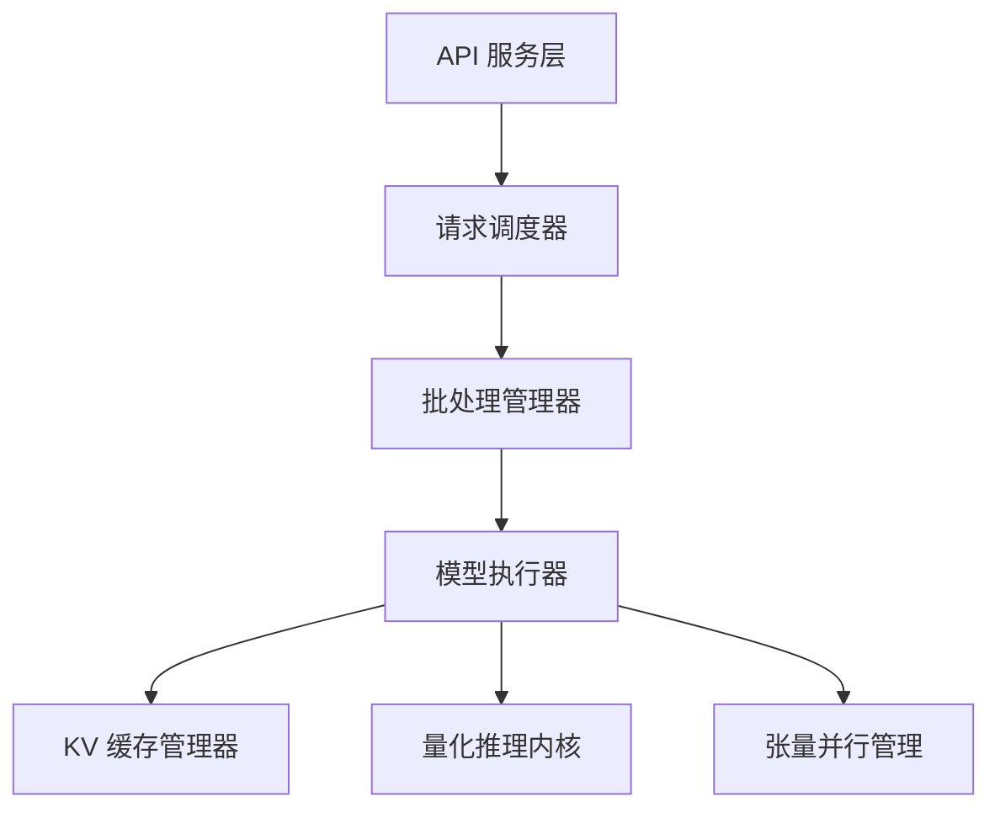

## 11.1 推理引擎架构概览

现代 LLM 推理引擎的核心使命是：**在多用户并发请求下最大化 GPU 的吞吐量和利用率，同时保持可接受的延迟。** 这不仅是一个算法问题，更是一个系统工程问题。

### 11.1.1 为什么需要专用推理引擎

直接使用 PyTorch 的 `model.generate()` 进行推理在生产环境中面临多重瓶颈：

- **无批处理优化**：每个请求独立处理，GPU 利用率极低
- **无 KV 缓存管理**：内存分配低效，无法支持大量并发
- **无调度策略**：长短请求混合时效率低下
- **无量化集成**：缺少开箱即用的模型压缩支持

专用推理引擎解决了所有这些问题，将前一章讨论的各种优化技术整合为一个完整的系统。

### 11.1.2 主流推理引擎

**vLLM**：由加州大学伯克利分校开发，以 PagedAttention 为核心的高吞吐推理引擎。集成了业界最全面的推理优化技术包括：连续批处理、PagedAttention KV 缓存管理、投机解码（Speculative Decoding，见 [10.6 节](../10_inference_optimization/10.6_speculative_decoding.md)）、前缀缓存、张量并行和多种量化格式（INT8/FP8）。vLLM 是目前最广泛使用的开源 LLM 推理引擎，兼顾了性能和易用性，已被 OpenAI、Anthropic 等大规模部署。

**TensorRT-LLM**：NVIDIA 的高性能推理框架，针对 NVIDIA GPU 进行了深度优化。通过算子融合、内核优化和硬件感知的执行计划，实现了极致的单卡性能。适合对延迟要求极高的生产场景。

**SGLang**：注重编程灵活性的推理框架，支持复杂的多轮对话、分支推理和前缀共享。其核心创新是 **Radix Tree-based KV 缓存管理（RadixAttention）**——将 KV 缓存组织为前缀树（Radix Tree）结构，允许任意前缀的共享、分支和复用，而不限于线性前缀。这使得在条件生成、思维链（CoT）分支探索等复杂推理场景中，多个分支路径可共享它们的公共前缀 KV 缓存，显著降低显存占用和重复计算。

**Ollama / llama.cpp**：面向本地部署的轻量级推理方案，支持在 CPU 和消费级 GPU 上运行量化模型，适合个人开发者和边缘部署。

### 11.1.3 推理引擎的核心组件

一个现代推理引擎通常包含以下核心组件：

图 11-1：推理引擎的典型架构

- **API 服务层**：提供 HTTP/gRPC 接口，支持 OpenAI 兼容的 API 格式
- **请求调度器**：管理请求队列，决定哪些请求进入批处理
- **批处理管理器**：实现连续批处理，动态添加和移除请求
- **模型执行器**：执行实际的前向传播计算
- **KV 缓存管理器**：使用 PagedAttention 等技术高效管理显存
