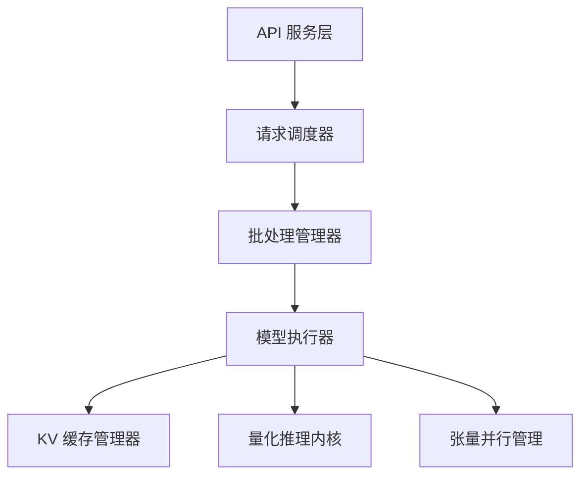

## 11.1 推理引擎架构概览

现代 LLM 推理引擎的核心使命是：**在多用户并发请求下最大化 GPU 的吞吐量和利用率，同时保持可接受的延迟。** 这不仅是一个算法问题，更是一个系统工程问题。

### 11.1.1 为什么需要专用推理引擎

直接使用 PyTorch 的 `model.generate()` 进行推理在生产环境中面临多重瓶颈：

- **无批处理优化**：每个请求独立处理，GPU 利用率极低
- **无 KV 缓存管理**：内存分配低效，无法支持大量并发
- **无调度策略**：长短请求混合时效率低下
- **无量化集成**：缺少开箱即用的模型压缩支持

专用推理引擎解决了所有这些问题，将前一章讨论的各种优化技术整合为一个完整的系统。

### 11.1.2 主流推理引擎

**vLLM**：由加州大学伯克利分校开发，以 PagedAttention 为核心的高吞吐推理引擎。集成了连续批处理、PagedAttention KV 缓存管理、投机解码（Speculative Decoding，见 [10.6 节](../10_inference_optimization/10.6_speculative_decoding.md)）、前缀缓存、张量并行和多种量化格式（INT8/FP8）。vLLM 是目前应用广泛的开源 LLM 推理引擎，兼顾了性能和易用性；大型闭源服务商的内部部署栈通常不完全公开，不应直接推断其生产环境使用 vLLM。

**TensorRT-LLM**：NVIDIA 的高性能推理框架，针对 NVIDIA GPU 进行了深度优化。通过算子融合、内核优化和硬件感知的执行计划，实现了极致的单卡性能。适合对延迟要求极高的生产场景。

**SGLang**：注重编程灵活性的推理框架，支持复杂的多轮对话、分支推理和前缀共享。其核心创新是 **Radix Tree-based KV 缓存管理（RadixAttention）**——将 KV 缓存组织为前缀树（Radix Tree）结构，允许任意前缀的共享、分支和复用，而不限于线性前缀。这使得在条件生成、思维链（CoT）分支探索等复杂推理场景中，多个分支路径可共享它们的公共前缀 KV 缓存，显著降低显存占用和重复计算。

**Ollama / llama.cpp**：面向本地部署的轻量级推理方案，支持在 CPU 和消费级 GPU 上运行量化模型，适合个人开发者和边缘部署。

**TGI（Text Generation Inference）**：由 HuggingFace 发布的 Rust 构建的生产级推理服务器，内置连续批处理、前缀缓存和投机解码，特别强调企业可靠性和可观测性，支持多种量化格式和 GPTQ。

**DeepSpeed-FastGen**：微软 DeepSpeed 团队推出的推理优化库，创新之处是 **Dynamic SplitFuse** 技术——在批处理中同时混合 Prefill 和 Decode 请求时，动态决定何时将短 Prompt 与 Decode 流混合以最大化 GPU 利用率，何时将长 Prompt 单独处理以保证延迟。据官方基准，在混合 Prefill/Decode 的负载下，相比 vLLM 可实现最高 2.3 倍的有效吞吐量（满足延迟 SLO 的吞吐），平均延迟降低约一半，P95 尾延迟最多降低 3.7 倍。

#### 推理框架性能对比

| 框架 | 核心创新 | 吞吐优势 | 延迟控制 | 生态友好度 |
|------|--------|--------|--------|---------|
| vLLM | PagedAttention + 前缀缓存 | 业界标准 | 很好 | 最好（Python）|
| TensorRT-LLM | 硬件感知图融合 | 最高（单卡） | 优秀 | 中等（C++）|
| SGLang | Radix Attention + 压缩 FSM | 在论文/基准场景中显著提升结构化输出吞吐 | 很好 | 很好（Python）|
| TGI | 异步调度 + Rust 性能 | 很好 | 优秀 | 很好（OpenAI 兼容）|
| DeepSpeed-FastGen | Dynamic SplitFuse | 有效吞吐最高 2.3×（vs vLLM，混合负载） | 很好 | 中等 |

表 11-1：主流推理框架性能对比

其中 SGLang 对**智能体和结构化生成**场景特别优化——通过预编译的正则表达式 FSM 约束解码空间，避免无效生成，结合 Radix Attention 的灵活前缀共享，在论文报告的特定基准中相对基线取得显著吞吐提升。实际 Agent 工作负载的收益仍取决于分支共享率、约束复杂度和模型执行瓶颈。

### 11.1.3 推理引擎的核心组件

一个现代推理引擎通常包含以下核心组件：

图 11-1：推理引擎的典型架构

- **API 服务层**：提供 HTTP/gRPC 接口，支持 OpenAI 兼容的 API 格式
- **请求调度器**：管理请求队列，决定哪些请求进入批处理
- **批处理管理器**：实现连续批处理，动态添加和移除请求
- **模型执行器**：执行实际的前向传播计算
- **KV 缓存管理器**：使用 PagedAttention 等技术高效管理显存
