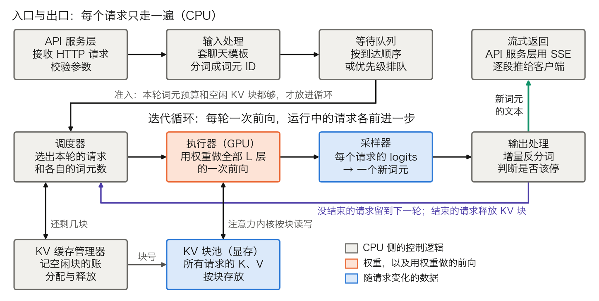

## 11.1 推理引擎架构概览

本节回答三个问题：为什么不能直接拿 `model.generate()` 上线；一个推理引擎由哪些部件组成，请求怎样穿过它们；几款主流引擎各自把力气花在哪里。

第 10 章给出的 KV 缓存、量化、投机解码都是单项技术。10.6.4 末尾留下一对相互牵制的取舍：批越大，可用于投机验证的空闲算力越少。这类取舍不落在任何单项技术内部，只能由一个统一的运行时在每一轮前向之前裁决。本节先给出这个运行时的全貌，机制细节留给后面各节。

### 11.1.1 为什么需要专用推理引擎

3.8 节的三次前向只服务一个请求。线上同时有成百上千个请求，长度各异，随时到达，随时结束。`model.generate()` 能把一批输入一起算，但缺四样东西：

- **迭代级的批处理**：它以“一批请求”为单位执行，整批进、整批出，不能在两次前向之间换入新请求、换出已结束的请求。
- **KV 缓存的生命周期管理**：它会用 KV 缓存，但不负责分页、回收、跨请求共享、租户隔离和碎片治理。
- **调度策略**：长短请求混在一起时，谁先算、每轮算多少词元、显存不够时牺牲谁，都没有决策者。
- **服务层治理**：流式输出、取消与超时、限流、可观测性、失败恢复和安全边界，需要另外集成。

第一样东西值多少，可以直接算出来。沿用 3.8.7 的口径：Decode 每一轮要把权重完整读一遍，再把批内每个请求的 KV 缓存各读一遍，时间下界是“要读的字节数 ÷ 显存带宽”。取 Llama 3 8B（配置见表 3-11）、BF16 权重、H100（带宽 3.35 TB/s），每个请求的上下文已有 1,000 个词元。设定与 [10.1.2](../10_inference_optimization/10.1_bottleneck.md) 的 Decode 工作点表相同，这里多列 B = 8 与 128 两行：

- 权重：参数约 80.3 亿个，每个 2 字节，合 16.06 GB。其中每层约 2.18 亿，32 层合 69.8 亿，外加输入、输出两张各 5.25 亿的嵌入表，逐项分解见 [11.3.4](11.3_scheduler_loop.md)。
- KV 缓存：每词元 `2 × 32 × 8 × 128 = 65,536` 个数，每个 2 字节，合 128 KiB；1,000 个词元约 0.131 GB。
- 批大小为 B 时，每轮要读 `16.06 + 0.131 × B` GB。B = 32 时是 `16.06 + 4.19 = 20.25` GB，除以 3.35 TB/s 得 6.05 ms；这一轮产出 32 个词元，吞吐上界是 `32 ÷ 6.05 ms ≈ 5,290` 词元/秒；表中各行按未舍入的字节数与时间算，B = 32 这一行记 5,293。

| 批大小 B | 每轮要读的字节 | 每轮时间下界 | 吞吐上界（词元/秒） | 每读 1 字节做几次运算 |
| ---: | ---: | ---: | ---: | ---: |
| 1 | 16.19 GB | 4.83 ms | 207 | 1.0 |
| 8 | 17.11 GB | 5.11 ms | 1,566 | 7.8 |
| 32 | 20.25 GB | 6.05 ms | 5,293 | 26 |
| 128 | 32.84 GB | 9.80 ms | 13,058 | 65 |

表 11-1：Llama 3 8B 在 H100 上的 Decode 吞吐上界随批大小的变化。只数了权重与 KV 缓存的读取，未计激活读写、内核启动和 CPU 开销，实测值低于此数；可信的是各行之间的比值。最后一列的计算量与 10.1.2 同口径，取每词元 `2 × 80.3 亿 + 4 × 1,000 × 4,096 × 32 ≈ 165.8 亿` 次；B = 32 时是 `32 × 165.8 亿 ÷ 20.25 GB ≈ 26`。

逐个请求串行是 207 词元/秒。32 个请求合成一批是 5,293 词元/秒，约 25.6 倍，而每轮只慢了 1.2 ms。倍数不到 32，是因为 KV 缓存各读各的，批处理摊薄的只有权重（3.8.7 的瓶颈三）。B = 128 时 KV 缓存的读取量（16.78 GB）已超过权重，每轮时间翻倍；最后一列仍远低于 H100 约 295 的拐点，瓶颈始终在带宽而不在算力。

这张表给出引擎的两项首要任务。其一，让每一轮前向里始终有足够多的请求，请求一结束就补位，这是连续批处理（[11.2 节](11.2_continuous_batching.md)）。其二，批大小受限于显存里放得下多少请求的 KV 缓存，必须把这块显存管到几乎不浪费，这是 PagedAttention（11.2 节、[11.4 节](11.4_kv_memory_management.md)）。批越大单个请求的每一步越慢，吞吐与延迟之间的取舍由调度器掌握（[11.3 节](11.3_scheduler_loop.md)）。

### 11.1.2 引擎的组件与一个请求的路径

图 11-1 是各家引擎共有的骨架。上排每个请求只走一遍，中排的循环每产出一个词元就转一圈，称一轮迭代（iteration）。引擎转一轮，运行中的每个请求前进一步；11.2、11.3 节按步计数时，一步就是这里的一轮。

图 11-1：推理引擎的组件与一个请求的路径（[生成脚本](https://github.com/yeasy/llm_internals/blob/main/tools/figures/ch11a_engine_components.py)）。灰色是 CPU 侧的控制逻辑，橙色是权重和用权重做的前向，蓝色是随请求变化的数据。KV 缓存管理器只记块号的账，不搬动 K、V 本身；块里的数据由注意力内核读写。

一个请求依次经过八步：

1. **API 服务层**接收 HTTP 请求，校验采样参数与长度上限。接口多与 OpenAI 的格式兼容。
2. **输入处理**套用聊天模板并分词，得到词元 ID 序列（3.8.2）。
3. 请求进入**等待队列**，此时还不占显存。
4. **调度器**在每一轮开始时决定两件事：本轮让哪些请求参与，每个请求算几个词元。已在 Decode 的请求各算 1 个；新请求算整个 Prompt 或其中一段。放行新请求要同时满足两个预算：本轮词元总数不超上限，**KV 缓存管理器**手里的空闲块够用。
5. **执行器**把选中的词元拼成一个批，连同各请求的位置与块号送上 GPU，做全部 L 层的一次前向。多卡部署时每张卡一个工作进程，各持一份权重切片，同步执行（[11.8 节](11.8_multi_gpu_inference.md)）。
6. **采样器**取每个请求最后一行的 logits，按该请求自己的温度、top-p 等参数选出一个词元（第 9 章）。约束解码的词元掩码也在这一步施加（[11.7 节](11.7_constrained_decoding.md)）。
7. **输出处理**把新词元增量反分词成文本，并判断是否该停：选中 EOS、达到最大长度，或命中停止字符串。
8. 文本经 API 服务层以 SSE（Server-Sent Events）流回客户端。未结束的请求留到下一轮，回到第 4 步；结束的请求释放全部 KV 块。

准入取决于还剩多少空闲块，所以 KV 缓存管理器是调度器的依据，不在执行器下游；执行器拿到的只是一张块号表。

第 4 到 7 步每产出一个词元就要走一遍，其中只有第 5 步在 GPU 上。一轮迭代的时间因此分成两段：

$$
t_{\text{轮}} = t_{\text{CPU}}(\text{调度、拼批、采样后处理}) + t_{\text{GPU}}(\text{前向})
$$

两段若串行执行，GPU 在 CPU 段里空等，空等占比为 $$t_{\text{CPU}} / (t_{\text{CPU}} + t_{\text{GPU}})$$。表 11-1 中 B = 32 的 GPU 段下界约 6 ms。假设 CPU 段为 2 ms，GPU 就有 `2 ÷ (2 + 6) = 25%` 的时间无事可做。模型越小、卡越快，GPU 段越短，这个比例越高。SGLang 团队的[说法](https://lmsys.org/blog/2024-12-04-sglang-v0-4/)是，未经优化的引擎可能把一半时间花在 CPU 开销上。这与 10.1.4 的 execution-idle 不是一回事：后者按秒采样，要求连续数秒近零活动，量的是请求之间的空档；每轮几毫秒的 CPU 段在那种遥测里看不见。

对策有两类，都不改变上面八步的逻辑顺序。**CUDA Graph** 把一轮前向里逐个内核的启动合并成一次回放，压缩 GPU 段内部的空隙（见 [11.10 节](11.10_vllm_internals.md)）。**重叠调度**让 CPU 在 GPU 计算第 n 轮时提前准备第 n+1 轮的输入，把 CPU 段藏进 GPU 段（见 [11.11 节](11.11_sglang_internals.md)）。

### 11.1.3 主流引擎的定位

连续批处理、分页的 KV 缓存、前缀复用、分块 Prefill、量化与多卡并行，面向 GPU 服务器的几款开源引擎现已全部具备。功能清单分不出高下，差别在三处：KV 复用用什么数据结构，前向怎样执行，覆盖哪些硬件。表 11-2 按这三处对比。

| 引擎 | 出身与定位 | KV 复用的数据结构 | 执行方式 | 硬件范围 |
| --- | --- | --- | --- | --- |
| vLLM | 出自加州大学伯克利分校，是 PagedAttention 论文的实现，后成为社区项目；通用的在线服务 | 按块哈希：块的键由父块哈希、本块词元和额外键算出，只缓存写满的块 | PyTorch 模型默认经 `torch.compile` 编译，加分段与整图的 CUDA/HIP Graph；`--enforce-eager` 才退回即时执行 | NVIDIA、AMD、Intel 的 GPU 与多种 CPU；TPU、Gaudi、昇腾等经插件支持 |
| SGLang | 起于“LLM 程序”的执行：前端语言加运行时，面向多次调用、分支与结构化输出 | 前缀树（RadixAttention）：请求结束后 KV 留在树里，按 LRU 淘汰 | PyTorch 运行时，CPU 调度与 GPU 计算重叠 | NVIDIA、AMD 的 GPU，Intel CPU、TPU、昇腾等 |
| TensorRT-LLM | NVIDIA 官方；围绕自家 GPU 的内核与 FP8、FP4 低精度 | 分页 KV 缓存，带块复用 | 现以 PyTorch 为基础架构；早期路径是先把模型编译成 TensorRT engine | 只支持 NVIDIA GPU |
| llama.cpp | 本地与边缘部署；纯 C/C++ 实现，无外部依赖。Ollama 以它为后端 | 服务端按槽位（slot）处理并发；`cache_prompt` 默认开启，新请求与槽位里上一次的 Prompt 比较，只重算不同的后缀 | GGUF 格式的整数量化权重（1.5 到 8 比特）；CPU 与 GPU 混合推理 | x86 与 ARM CPU、Apple Silicon、各类 GPU |

表 11-2：主流推理引擎的定位与设计取舍。各项均取自项目的论文、README 或设计文档；版本相关的细节见 11.10、11.11 节。

**哈希块表与前缀树。** 两者复用的都是词元级完全一致的前缀，区别在记账方式。vLLM 给每个写满的块算一个哈希，存进一张平坦的表，查找与淘汰都以块为单位。SGLang 把所有请求的词元序列组织成一棵前缀树，分叉点就是树的内部节点，淘汰从叶子开始。树保留了“谁和谁共享到哪里”的结构，调度器可据此优先安排共享前缀长的请求；代价是树的维护落在 CPU 的关键路径上，这也是 SGLang 要做重叠调度的原因之一。数据结构、命中率算例与失效情形见 [11.5 节](11.5_prefix_reuse.md)。

**结构化输出。** [SGLang 论文](https://arxiv.org/abs/2312.07104)的另一项贡献是压缩有限状态机：语法里只有一种合法续写的片段（例如 JSON 的固定键名）一次前向吐完，不必逐词元解码。这条路线今天已不为一家独有，机制见 11.7 节。

**已退居历史的两个名字。** TGI（Text Generation Inference）是 Hugging Face 用 Rust、Python 和 gRPC 写的推理服务器。它内置连续批处理，README 称用于其生产环境。项目现已转入维护模式，[README](https://github.com/huggingface/text-generation-inference) 建议改用 vLLM、SGLang 或 llama.cpp 等本地引擎。DeepSpeed-FastGen 提出 Dynamic SplitFuse（机制见 11.2.5）。其[论文](https://arxiv.org/abs/2401.08671)报告有效吞吐最高 2.3 倍、平均延迟减半、词元级尾延迟最多降到 1/3.7。基线是当时的 vLLM，那一版一次前向要么全做 Prefill、要么全做 Decode。vLLM 此后也加入了分块 Prefill，这组数字不宜外推。

vLLM 是应用很广的开源引擎，但大型闭源服务商的内部部署栈通常不公开，不应据此推断其生产环境用的是哪一款。

### 11.1.4 选型：先看请求形态，再看引擎

选型按四步收窄，顺序不宜颠倒：

1. **硬件定候选集。** 只有 NVIDIA GPU 时四款都可选；AMD、TPU 或昇腾上先查表 11-2 的最后一列；笔记本与边缘设备基本只剩 llama.cpp 一系。
2. **请求形态定侧重点。** 共享前缀多（长系统提示、多轮对话、智能体反复调用）时，前缀复用的命中率决定成本（11.5 节）。长 Prompt 与交互式对话混跑时，看分块 Prefill 与分离式部署（11.2.5、[11.9 节](11.9_disaggregated_serving.md)）。一个基座挂许多适配器，看多 LoRA 的批处理（[11.6 节](11.6_multi_lora_serving.md)）。输出必须合乎 JSON Schema，看约束解码的开销（11.7 节）。
3. **SLO 定指标。** 不只看单卡词元/秒，要同时看并发峰值下的 TTFT（首词元时间）与 TPOT（每输出词元时间）的 P95、P99，以及 KV 缓存的压力、量化的精度损失、可观测性和安全隔离能力。指标的定义与测法见 [11.13 节](11.13_best_practices.md)。
4. **用自己的流量压测。** 公开基准的结论随引擎版本、模型和长度分布而变，只能当起点。

### 11.1.5 本章路线图

表 11-3 把图 11-1 的部件对到后面各节。11.2 节先给出四个核心想法的概念层，11.3 到 11.8 节逐个展开机制，11.9 节讨论跨机器的拆分，11.10、11.11 节把机制对到两款引擎的源码，最后两节落到硬件与运维。

| 图 11-1 的部件 | 要回答的问题 | 小节 |
| --- | --- | --- |
| 调度器 | 每一轮选谁、算多少词元；显存不够时牺牲谁 | [11.2](11.2_continuous_batching.md)、[11.3](11.3_scheduler_loop.md) |
| KV 缓存管理器与块池 | 显存预算怎么分；块表、写时复制、换出与重算 | [11.2](11.2_continuous_batching.md)、[11.4](11.4_kv_memory_management.md) |
| KV 块的跨请求共享 | 哈希块与前缀树怎样找到可复用的前缀 | [11.5](11.5_prefix_reuse.md) |
| 执行器里的权重 | 多个 LoRA 适配器怎样同批计算 | [11.6](11.6_multi_lora_serving.md) |
| 采样器 | 怎样保证输出合乎语法 | [11.7](11.7_constrained_decoding.md) |
| 执行器跨多张卡 | 张量并行、流水线并行、专家并行怎样切 | [11.8](11.8_multi_gpu_inference.md) |
| 整个循环拆到两组机器 | Prefill 与 Decode 分开部署何时划算 | [11.9](11.9_disaggregated_serving.md) |
| 全部部件的真实实现 | 模块、参数与默认值 | [11.10](11.10_vllm_internals.md)、[11.11](11.11_sglang_internals.md) |
| 引擎之下与之上 | 选什么硬件；上线后看哪些指标 | [11.12](11.12_hardware.md)、[11.13](11.13_best_practices.md) |

表 11-3：第 11 章的路线图。
