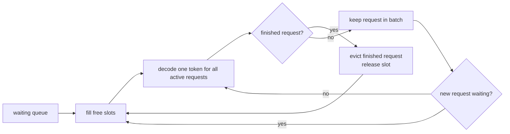
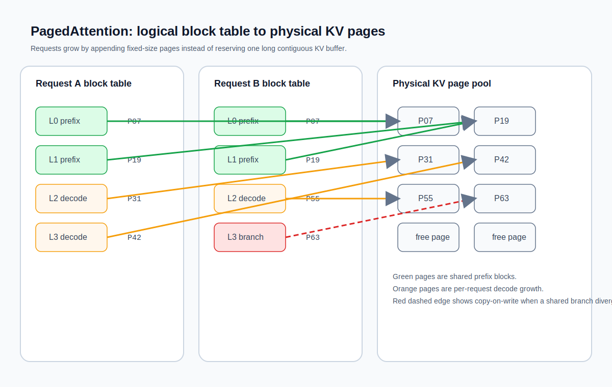

## 11.2 连续批处理与 PagedAttention

连续批处理和 PagedAttention 是现代推理引擎实现高吞吐量的两项核心技术。

### 11.2.1 静态批处理的低效

传统的**静态批处理**（Static Batching）将一批请求打包在一起处理，等待所有请求都完成生成后才处理下一批。

问题在于不同请求的生成长度差异巨大——有些可能只需生成 10 个词元，有些可能需要 2000 个。短请求完成后，其占用的 GPU 计算资源和显存在长请求完成之前一直空闲。这导致 GPU 平均利用率仅为 30-50%。

### 11.2.2 连续批处理的工作原理

**连续批处理**（Continuous Batching，也称 Iteration-level Batching）在**每个解码步**检查批次状态：

1. 如果有请求完成生成（输出了结束标记或达到最大长度），立即将其移出批次
2. 如果有等待中的新请求，立即将其插入空出的位置
3. 执行一步解码，所有活跃请求并行计算

这样 GPU 始终保持满负载运行——**不存在等待**。在请求到达率较高的场景下，连续批处理的吞吐量可以是静态批处理的 **2-10 倍**。

连续批处理的核心不是“批次更大”，而是“批次边解码边换人”。下面的调度图把这个循环展开了。

图 11-2：连续批处理在每个解码步动态换入和换出请求

### 11.2.3 PagedAttention 的设计

即使有了连续批处理，KV 缓存的显存管理仍然是瓶颈。传统做法是为每个请求**预分配**足够容纳最大生成长度的连续显存块。由于实际生成长度通常远小于最大值，这导致了严重的**内存浪费和碎片化**。

**PagedAttention**（Kwon 等人，2023 年）借鉴了操作系统中**虚拟内存**的页式管理思想：

1. 将物理显存划分为固定大小的“页”（通常容纳 16-64 个词元的 KV 缓存）
2. 每个请求维护一个逻辑-物理页面映射表
3. 当请求需要更多 KV 缓存空间时，动态分配新页面
4. 请求完成时，释放其占用的所有页面

关键优势：

- **消除碎片化**：页面可以在物理显存中不连续分布
- **按需分配**：不预分配最大长度，只在实际生成时分配
- **高效共享**：多个请求可以共享相同的前缀页面（如系统提示），通过写时复制（Copy-on-Write）避免重复存储

PagedAttention 将 KV 缓存的显存利用率从 60-80% 提升到 **接近 90%**（理想条件下可达 90-95%），显著增加了可同时服务的并发请求数。

PagedAttention 的关键结构不是“更大的缓存池”，而是每个请求维护一张逻辑块到物理页的映射表。

图 11-3：PagedAttention 的逻辑块表与物理 KV 页映射

### 11.2.4 前缀缓存

**前缀缓存**（Prefix Caching）是 PagedAttention 的自然延伸——如果多个请求有相同的系统提示或共享的对话上下文前缀，它们的 KV 缓存前缀部分完全相同。前缀缓存将这些共享部分的 KV 缓存只存储一份（存放在 PagedAttention 的共享页面中），所有共享该前缀的请求直接通过虚拟内存映射引用这些页面，无需复制。

在生产环境中（如客服机器人，所有对话共享同一个长系统提示），前缀缓存可以将显存占用减少 **50% 以上**。更重要的是，在分离式架构中（11.3 节），Prefill 集群可以预计算常见前缀（如系统提示、热门文档）的 KV 缓存并缓存到高速存储（如 GPU 显存或 NVMe），当 Decode 集群接收新请求时可直接查询，大幅减少 Prefill→Decode 的 KV 缓存转移量。

### 11.2.5 分块 Prefill：防止头部阻塞

虽然连续批处理大幅提升了吞吐，但当一个**超长 Prompt 请求**突然到达时，仍会造成 **Head-of-Line 阻塞**（HOLB）——该请求的 Prefill 可能耗时数秒，期间 Decode 请求被迫等待，导致 TPOT 飙升。

**分块 Prefill**（Chunked Prefill）的策略是将长 Prompt 分解为多个固定大小的块（通常 512-1024 token），与 Decode 请求交错处理：

1. 取一块 Prompt 进行 Prefill（计算量小、耗时短）
2. 处理该块后，余下的 Decode 请求立即执行一步
3. 继续下一块 Prompt 的 Prefill
4. 以此循环，直到整个 Prompt 处理完

这样长 Prompt 不再“一把抓”，而是分段处理。虽然 Prefill 总耗时不变，但**中间穿插的 Decode 步骤保证了 TPOT 的平稳性**，避免了尾部用户的卡顿。实验表明，分块 Prefill 可将 P99 延迟降低 **40-60%**，同时吞吐量仅下降 5-10%。

### 11.2.6 缓存感知路由：前缀亲和性调度

在多实例推理集群中，不是所有请求都应该均匀分散。如果两个请求共享相同的前缀（如同一文档的 QA），应该尽可能路由到同一个推理实例，以最大化前缀缓存命中。

**缓存感知路由**的做法：
- 计算请求 Prompt 的哈希值或语义向量
- 网关根据哈希值的**亲和性**将请求路由到已缓存该前缀的实例
- 如果前缀未被任何实例缓存，选择 KV Cache 占用率最低的实例

这种“粘性”路由避免了前缀在多个实例间分散的浪费，同时减少了 Prefill 重复计算。对于 RAG、文档问答等前缀复用率高的应用，可额外节省 **20-30% 的计算资源**。
