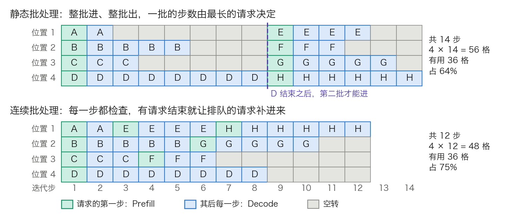
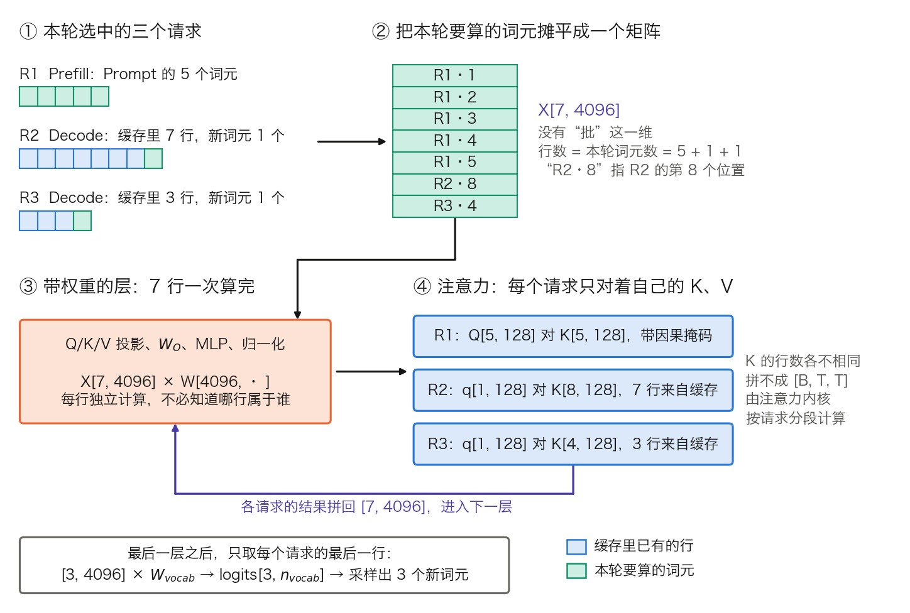
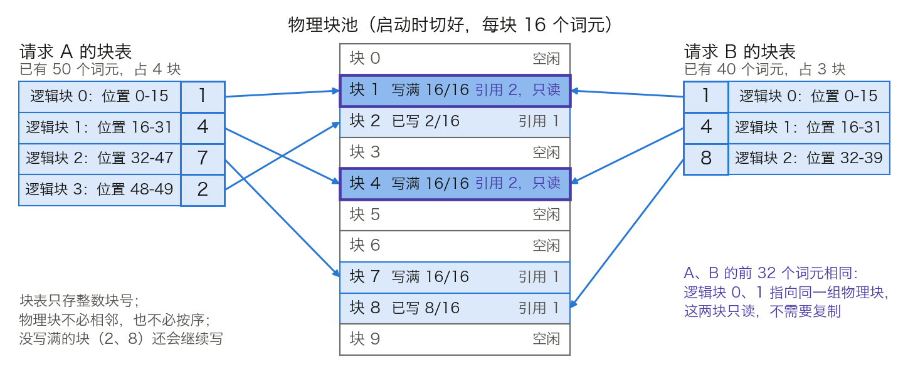
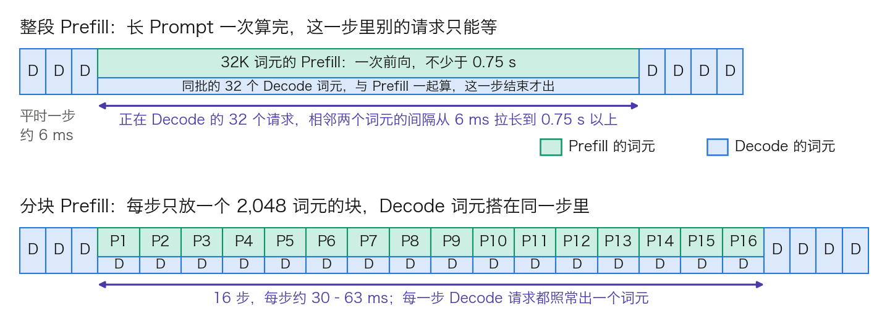

## 11.2 连续批处理与 PagedAttention

11.1.1 的表说明，Decode 的吞吐上界几乎随批大小线性增长。要把批撑大并一直撑住，得先解决三个问题：请求长短不一时，怎样不让短的陪长的空转；KV 缓存怎样分配才不浪费显存；长 Prompt 到来时，怎样不挡住正在出词元的请求。

本节给出对应的四个想法：迭代级调度、分页的 KV 缓存、前缀缓存、分块 Prefill。每个想法只讲到“为什么成立、值多少、代价在哪”；调度器的状态机、块表与换出、哈希块与前缀树的细节分别见 11.3、11.4、11.5 节。

### 11.2.1 静态批处理浪费了多少

**静态批处理**（Static Batching）把一批请求打包送进模型，等这一批全部生成完，才处理下一批。一批要跑多少步，由其中最长的请求决定；先结束的请求占着位置空转。

设一批有 4 个请求，输出长度分别是 10、50、200、2,000 个词元。这一批要跑 2,000 步，共 `4 × 2,000 = 8,000` 个“请求·步”的位置，真正产出词元的只有 `10 + 50 + 200 + 2,000 = 2,260` 个：

$$
\text{有效占比} = \frac{\text{各请求输出长度之和}}{\text{批大小} \times \text{最长输出长度}} = \frac{2{,}260}{8{,}000} = 28.25\%
$$

这个比值就是“平均输出长度 ÷ 最长输出长度”。输出长度的分布越偏，浪费越重；线上对话的输出从几个词元到几千个词元不等，分布通常很偏。

另有两笔代价不在这个比值里。其一是排队：新请求哪怕只晚到一步，也要等整批结束，上例中最多等 2,000 步。其二是输入侧的填充：Prompt 长短不一，要补齐到同一长度才能堆成 `[B, T, d_model]` 的张量，补上去的位置白算。

### 11.2.2 连续批处理：迭代级调度

**连续批处理**（Continuous Batching）把调度的粒度从“一批请求”降到“一次前向”。这个想法出自 [Orca](https://www.usenix.org/conference/osdi22/presentation/yu)，原文称**迭代级调度**（iteration-level scheduling）。调度器每次只让执行器跑一步（11.1.2 的一轮迭代），跑完立刻重新决定下一步的批里有谁。每一步做三件事：

1. 把上一步已经结束的请求（选中 EOS、达到最大长度或命中停止字符串）移出批，释放它的 KV 缓存。
2. 在预算之内放行等待队列里的请求。预算有两项：本步词元总数的上限，和还能分给 KV 缓存的显存。
3. 对选中的全部请求做一次前向。新放行的请求这一步做 Prefill，其余请求各做一步 Decode。

图 11-2 用 8 个请求对比两种做法。静态批处理要 14 步，56 个位置里有用的占 64%，请求 E 到第 9 步才开始；连续批处理只要 12 步，有用的占 75%，E 在第 3 步就开始。后者尾部的空位来自队列已空；只要队列里一直有请求，每个位置一空就被补上，占比趋近 100%。对 11.2.1 的 4 请求例子，这相当于同样步数下多产出 `1 ÷ 0.2825 ≈ 3.5` 倍的词元。

图 11-2：同样 8 个请求，静态批处理与连续批处理各占用多少步（[生成脚本](https://github.com/yeasy/llm_internals/blob/main/tools/figures/ch11a_batching_gantt.py)）。各请求占用的步数为 A2、B5、C3、D8、E4、F3、G5、H6，合计 36 格。图中画成 4 行只为便于比较：真实引擎约束的是每轮词元数和空闲 KV 块数，不是固定的行数。

公开论文里的加速倍数取决于和谁比，不能互相换算。Orca 报告在 GPT-3 175B 上、同等延迟下吞吐是 FasterTransformer 的 36.9 倍；[vLLM 论文](https://arxiv.org/abs/2309.06180)报告相对 Orca 提高 2 到 4 倍，Orca 已有迭代级调度，这部分增益来自 11.2.3 的显存管理；相对 FasterTransformer 最高 22 倍，其中含调度的差异。

**不同阶段的请求怎样放进同一次前向。** 第 3 步里有个形状上的难题。同一步里，R1 在做 Prefill，要算 5 个词元；R2、R3 在做 Decode，各算 1 个词元，缓存里分别已有 7 行和 3 行。三者堆不成 `[B, T, d_model]`。Orca 的解法叫**选择性批处理**（selective batching），主流引擎沿用的仍是这个思路，形状变化见图 11-3：

- **摊平**：把本步要算的全部词元排成一个没有批维度的矩阵，行数是各请求本步词元数之和：`X[5 + 1 + 1, 4096] = X[7, 4096]`（形状按 Llama 3 8B）。
- **带权重的层**：7 行一次算完。线性层、归一化、激活函数都是逐行独立的，不需要知道哪一行属于哪个请求。
  - `X[7, 4096] × W_Q[4096, 4096] → Q[7, 4096]`
  - `X[7, 4096] × W_K[4096, 1024] → K[7, 1024]`
  - MLP 的第一个矩阵：`[7, 4096] × [4096, 14336] → [7, 14336]`
  - 新算出的 K、V 各自追加到所属请求的缓存里。
- **注意力**：各请求对着自己的 K、V。每个头上，R1 是 `Q[5, 128] × Kᵀ[128, 5] → 分数[5, 5]`，带因果掩码；R2 是 `q[1, 128] × Kᵀ[128, 8] → 分数[1, 8]`；R3 是 `q[1, 128] × Kᵀ[128, 4] → 分数[1, 4]`。K 的行数各不相同，只能分开算，结果再拼回 `[7, 4096]`。
- **LM head**：只取每个请求的最后一行，`[3, 4096] × W_vocab[4096, n_vocab] → logits[3, n_vocab]`，采样出 3 个新词元。

图 11-3：一轮迭代里的混合批（[生成脚本](https://github.com/yeasy/llm_internals/blob/main/tools/figures/ch11a_mixed_batch_shapes.py)）。③ 与 ④ 在每一层里交替出现：Q/K/V 投影在注意力之前，`W_O` 与 MLP 在注意力之后，图中合画为一个方框。

注意力不合批并不吃亏。批处理的收益来自“读一遍权重，服务多行数据”，而注意力这一步没有权重，它读的是各请求自己的 K、V，合不合批要读的字节数一样。Orca 论文给的正是这个理由。实现上，这一步交给支持变长输入的注意力内核：一次启动处理全部请求，各请求的边界由一个累计长度数组给出（FlashAttention 变长接口里的 `cu_seqlens`，形状 `[请求数 + 1]`）。

连续批处理不保证任何时刻都满载。到达率低时队列是空的；显存用尽时新请求进不来，甚至要牺牲已在运行的请求（11.3 节）；一个长 Prefill 会让同批的 Decode 全部陪着变慢（11.2.5）。批越大每一步越慢也仍然成立：11.1.1 的表里，B 从 32 升到 128，每步时间下界从 6.05 ms 升到 9.80 ms。

### 11.2.3 PagedAttention：按块分配 KV 缓存

连续批处理让批里的位置不空转，批能开多大则取决于显存里放得下多少请求的 KV 缓存。分页之前的系统为每个请求**预分配**一段连续显存，长度按最大序列长度取。vLLM 论文把由此产生的浪费分成三类：为尚未生成的词元预留的空位，按最大长度超配而最终用不上的内部碎片，以及分配器产生的外部碎片。论文对当时的系统做了剖析，KV 显存里真正存着词元状态的只占 20.4% 到 38.2%。

**同一个 KV 池，两种分法能放多少请求。** 取 Llama 3 8B 和一张 80 GB 的卡。[11.4.1](11.4_kv_memory_management.md) 算出的预算是：显存按九成可用为 72 GB，扣掉 16.06 GB 权重，再留 2 GB 给激活与其他开销，剩 53.94 GB 作 KV 池（未舍入为 53.9395 GB）。每词元 KV 是 131,072 字节（11.1.1），于是：

$$
\text{KV 池容量} = \frac{53.9395 \times 10^{9}}{131{,}072} \approx 411{,}525 \ \text{个词元}
$$

- 预分配到最大长度 8,192：每个请求占 `8,192 × 128 KiB = 1 GiB`，只能同时放 `⌊411,525 ÷ 8,192⌋ = 50` 个。若请求的实际长度平均 1,000 个词元，显存利用率是 `1,000 ÷ 8,192 ≈ 12.2%`。
- 按 16 个词元一块、用多少分多少：每个请求只在最后一块里浪费平均 `(16 − 1) ÷ 2 = 7.5` 个词元（11.4.2），能同时放 `⌊411,525 ÷ (1,000 + 7.5)⌋ = 408` 个，是预分配的 8.2 倍；浪费降到 `7.5 ÷ 1,000 = 0.75%`。

并发数翻 8 倍，吞吐不会跟着翻 8 倍。按 11.1.1 的口径，B = 50 时每步读 22.61 GB，下界 6.75 ms，吞吐上界约 7,407 词元/秒；B = 408 时每步读 69.54 GB，下界 20.76 ms，吞吐上界约 19,655 词元/秒。吞吐是 2.7 倍，每个请求的每一步却慢到 3.1 倍。分页提供的是“能把批开到多大”的上限，开到多大仍由延迟目标决定。

**做法。** [PagedAttention](https://arxiv.org/abs/2309.06180) 借用操作系统分页的思路，论文的类比是：块相当于页，词元相当于字节，请求相当于进程。

1. 启动时把留给 KV 缓存的显存一次性切成大小相同的**块**（block），每块容纳固定个数词元的 K、V。
2. 每个请求持有一张**块表**（block table），把“第 0、1、2……个逻辑块”映射到物理块号。物理块不必相邻。
3. 请求每写满一块，才向管理器再要一块。
4. 请求结束，归还全部块。

块大小相同，所以没有外部碎片；按需分配，所以没有预留，内部碎片只剩每个请求最后一块里的空位。vLLM 团队对分页前后浪费比例的测量见 [10.2.6](../10_inference_optimization/10.2_kv_cache.md)，与上面的 0.75% 同一量级。

这只是类比。GPU 上并没有用到硬件的虚拟内存，映射关系是引擎自己维护的一张整数表；注意力内核算到某个请求时，按这张表到各个物理块里取 K、V。图 11-4 给出一个两请求的例子；块表的形状、KV 池的张量布局见 11.4 节。

图 11-4：两个请求的块表指向同一个物理块池（[生成脚本](https://github.com/yeasy/llm_internals/blob/main/tools/figures/ch11a_block_table_mapping.py)）。请求 A 已有 50 个词元，占块 1、4、7、2；B 已有 40 个词元，占块 1、4、8；前两块写满、只读、引用计数 2。

**代价有两笔。** 其一，内核多了一层间接寻址。vLLM 论文实测，查块表、多出的分支和变长处理使注意力内核比 FasterTransformer 高度优化的连续内存版本慢 20% 到 26%；这只影响注意力一个算子，端到端仍因批更大而胜出。其二，块大小两头受限：太小，内核读 KV 时用不满 GPU 的并行度；太大，内部碎片变大，能共享的机会变少。取值的依据与各引擎的差异见 [11.4.2](11.4_kv_memory_management.md)。

**共享。** 块表允许多个逻辑块指向同一个物理块，管理器给每个物理块记引用计数。这带来两种不同的共享，不要混为一谈：

- **同一请求内**的并行采样与束搜索：多条输出序列共享 Prompt 的全部块。只有最后那个没写满的块需要**写时复制**（Copy-on-Write）：某条序列要往引用计数大于 1 的块里写新词元时，先复制这一块，再写。vLLM 博客报告这类场景的显存占用最多可减少 55%。
- **跨请求**共享相同的前缀：共享的是已经写满、不再变化的块，只读加引用计数即可，用不到写时复制。这就是下一小节的前缀缓存。

### 11.2.4 前缀缓存：共享只读的满块

因果注意力下，一个位置的 K、V 只取决于它和它左边的词元。两个请求只要开头一段词元完全相同，这一段的 KV 就逐字节相同，后到的请求可以直接引用，跳过这一段的 Prefill。适用场景与提示词的排布原则见 [10.2.5](../10_inference_optimization/10.2_kv_cache.md)，这里只说它怎样接在分页之上。

分页之后，“一段前缀的 KV”就是若干个写满的块。让这些块可以按内容查找，就得到**前缀缓存**（Prefix Caching）。vLLM 的做法是给每个满块算一个哈希，输入是父块的哈希、本块的词元和一组额外键；请求结束后，它的块不立即清空，而是留在可淘汰的队列里，等新请求命中或被挤掉。SGLang 走另一条路，把词元序列组织成前缀树。两条路线的数据结构与淘汰策略见 [11.5 节](11.5_prefix_reuse.md)。

收益可以直接算。设系统提示加共享文档共 2,010 个词元，用户输入 200 个，块大小 16。只有写满的块才能共享，命中 `⌊2,010 ÷ 16⌋ = 125` 块，即 2,000 个词元；需要 Prefill 的词元从 2,210 个降到 210 个，线性层的计算量降到 9.5%。Prefill 受算力限制，TTFT（首词元时间）里的计算部分近似按同一比例下降。显存也省：125 块在所有命中它的请求之间只存一份。

复用的前提是**词元级完全一致**，差一个词元，其后的块全部失效。哈希键里除了词元，还须纳入一切会改变 KV 或改变可见性的因素：模型与版本、LoRA 适配器、多模态输入的内容哈希，以及区分租户或权限域的盐值。默认不应跨租户、跨权限或跨私有语料复用；命中与否会反映在 TTFT 上，跨边界复用等于把别人的上下文变成可探测的侧信道。

分离式架构里，前缀 KV 还可以下沉到主机内存或 SSD 组成的共享池，供多个实例取用，见 [11.9 节](11.9_disaggregated_serving.md)。

### 11.2.5 分块 Prefill：防止队头阻塞

连续批处理里，新请求的 Prefill 和别人的 Decode 挤在同一次前向里。Prompt 很长时，这一步的时间由 Prefill 决定，同批所有 Decode 请求都要等它算完，这是一种**队头阻塞**（Head-of-Line blocking）。

**挡多久。** 设 32 个请求正在 Decode，平时每步约 6 ms（11.1.1）。这时来了一个 32,768 个词元的 Prompt。按 3.8.7 的算法，Llama 3 8B 的 Prefill 计算量是：

- 与权重相乘：每词元约 `2 × 69.8 亿`（32 层的参数量），乘 32,768，约 `4.574 × 10¹⁴`。
- 打分与读取：每层 `2T²d`，即 `2 × 32,768² × 4,096 × 32`，约 `2.815 × 10¹⁴`。
- 合计约 `7.39 × 10¹⁴` 次。H100 的 BF16 稠密峰值是 990 TFLOPs/s，全部用满也要 0.75 s；按 50% 的利用率是 1.5 s。

这 32 个用户会看到输出停顿 0.75 到 1.5 秒，相当于平时的 125 到 250 步。[Sarathi-Serve](https://arxiv.org/abs/2403.02310) 在当时的 vLLM 上实测到持续数秒的生成停顿。这种停顿在 TPOT（每输出词元时间，请求内的平均值）里会被摊薄，要看相邻两个词元的间隔，即 TBT（time-between-tokens）的高分位；两个指标的定义见 [11.13 节](11.13_best_practices.md)。

**做法。** **分块 Prefill**（Chunked Prefill）把长 Prompt 切成若干块，每一步只放进一块，并让正在 Decode 的请求搭在同一次前向里。用的就是 11.2.2 的混合批。Decode 没有暂停，每一步照常出词元；Prompt 的最后一块算完，这个请求才产出首词元。每一步的词元总数有一个上限，称**词元预算**（token budget）：先装下全部 Decode 词元，剩下的留给 Prefill 块。图 11-5 对比两种时间线。

图 11-5：整段 Prefill 与分块 Prefill 的时间线（[生成脚本](https://github.com/yeasy/llm_internals/blob/main/tools/figures/ch11a_chunked_prefill_timeline.py)）。时间轴为示意，未按比例；毫秒数取自正文算例，按峰值算力估算。上排的 32 个 Decode 词元与整段 Prefill 同在一步里，只在这一步结束时才各出一个。

同一个例子按每块 2,048 个词元切，要 `32,768 ÷ 2,048 = 16` 步，每步 30 到 63 ms。第 k 块的注意力要对着前面已算的 `past` 个词元打分，计算量为 `2 × d × L × ((past + C)² − past²)`，C 是块长；线性部分每块固定为 `2 × 69.8 亿 × 2,048 ≈ 2.86 × 10¹³`。第 1 块 `past = 0`，注意力 `2 × 4,096 × 32 × 2,048² ≈ 1.1 × 10¹²`，整块约 `2.97 × 10¹³`，峰值算力下约 30 ms；第 16 块 `past = 30,720`，注意力 `2 × 4,096 × 32 × (32,768² − 30,720²) ≈ 3.41 × 10¹³`，整块约 `6.27 × 10¹³`，约 63 ms。同批 Decode 请求的词元间隔因此被限制在几十毫秒，而不是一次停顿 0.75 秒。搭载的 32 个 Decode 词元只给 2,048 行的矩阵多添 1.6% 的行，权重反正要读一遍，它们几乎不花额外时间。11.3.4 把 Decode 词元也计入预算，预算 2,048 时块为 2,016 个词元，同一个 Prompt 要 17 步；逐块的账见表 11-7。

**代价。** 三条都由预算的大小决定，算例见 [11.3.4](11.3_scheduler_loop.md)。

- 长请求自己的 TTFT 变长：各块的计算量之和与整段相同，但要分多步走完，每一步还捎带别人的 Decode。
- 后面的块比前面的贵，前面各块的 KV 被反复读出；块越小，重读越多，矩阵乘法的效率也越低。
- 预算是一个旋钮：调小，TBT 更稳，TTFT 与效率变差；调大则相反。

Sarathi-Serve 报告的收益以“满足 P99 TBT 目标的前提下可承载的负载”计。Mistral-7B 单张 A100 为 2.6 倍，Yi-34B 两张 A100 最高 3.7 倍，均相对当时的 vLLM。Falcon-180B 加流水线并行的 5.6 倍是相对 Orca 的数字；相对 vLLM 的同一混合并行配置，严格 SLO 下为 3.6 倍，宽松 SLO 下为 1.48 倍。三组数字对应三种部署，最后一组还包含流水线气泡减少的收益，不宜读成一个连续的区间。DeepSpeed-FastGen 的 [Dynamic SplitFuse](https://github.com/deepspeedai/DeepSpeed/tree/master/blogs/deepspeed-fastgen) 是同一思路：长 Prompt 拆到多步；短 Prompt 拼起来凑满预算；每一步前向的词元数因此大致恒定。

分块缓解了阻塞，没有消除争用：Prefill 块和 Decode 词元仍共用同一张卡的算力与带宽。把两者放到两组机器上，是 11.9 节的分离式架构。

### 11.2.6 缓存感知路由

前缀缓存是每个实例各管各的。集群里有多个实例时，路由方式直接决定命中率。以多轮对话为例：上一轮的 KV 留在某一个实例上，若下一轮随机路由，8 个实例时落回原实例的概率只有 `1 ÷ 8 = 12.5%`，其余情况要把整段历史重新 Prefill。

**缓存感知路由**让网关按前缀的亲和性分发：

- 对可复用的前缀计算词元级哈希。语义向量只适合做结果缓存或负载聚类，不能证明 KV 前缀可复用。
- 把请求发给已缓存该前缀的实例。
- 没有任何实例缓存该前缀时，选 KV 缓存占用率最低的实例。

两种情形下它会失效。一是亲和性与负载均衡冲突：热点前缀把流量压向同一个实例，排队时间吃掉省下的 Prefill，路由必须在命中与负载之间折中。二是网关的索引与实例里的真实缓存不一致：前缀已被实例淘汰，请求仍被送过去，既没命中又没均衡。路由算法与实例侧的缓存感知调度见 11.5 节。

### 11.2.7 四个想法的边界与后续入口

表 11-4 汇总本节的四个想法，各自留下的问题由后面的小节接手。

| 想法 | 消掉的浪费 | 代价与失效情形 | 展开于 |
| --- | --- | --- | --- |
| 迭代级调度 | 短请求陪长请求空转；新请求等整批结束 | 每步都有 CPU 调度开销（11.1.2）；队列空或显存满时仍不满载；批越大每步越慢 | [11.3](11.3_scheduler_loop.md) |
| 分页的 KV 缓存 | 按最大长度预留，内外碎片 | 注意力内核多一层间接寻址；块大小两头受限；块用完时只能抢占，被抢占的请求要么丢弃 KV 之后重算，要么换出到主机内存，两者都表现为 TBT 的毛刺 | [11.3](11.3_scheduler_loop.md)、[11.4](11.4_kv_memory_management.md) |
| 前缀缓存 | 相同前缀的重复 Prefill 与重复存储 | 只认词元级一致的前缀；键必须含隔离因素；缓存占着的块要和新请求争显存 | [11.5](11.5_prefix_reuse.md) |
| 分块 Prefill | 长 Prompt 造成的队头阻塞 | 长请求自己的 TTFT 变长；块太小则效率下降；同卡争用仍在 | [11.3](11.3_scheduler_loop.md)、[11.9](11.9_disaggregated_serving.md) |

表 11-4：连续批处理、分页、前缀缓存与分块 Prefill 各自的收益、代价与后续小节。

还有一个前提贯穿全节：每一层都保留全部词元的 K、V，所以所有层可以共用同一张块表。滑动窗口或混合注意力的模型（[10.2.8](../10_inference_optimization/10.2_kv_cache.md)）各层需要的缓存长度不同，这个前提不再成立，块要按层的类型分组管理。
