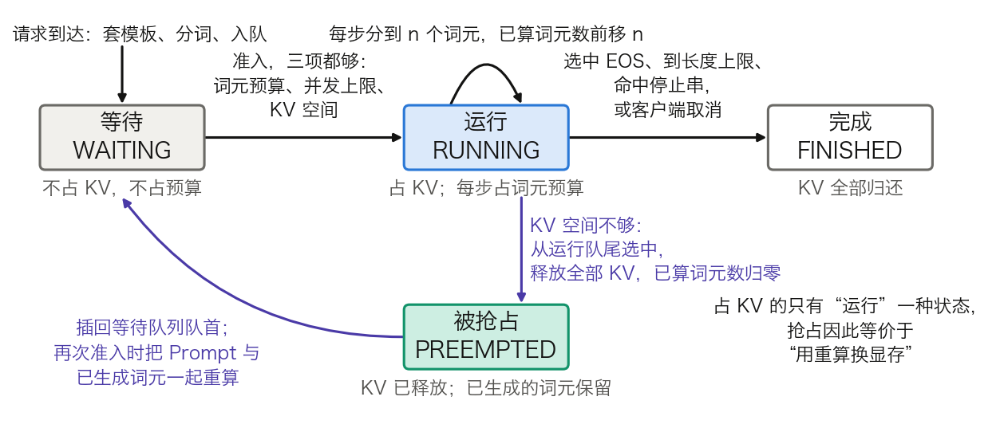
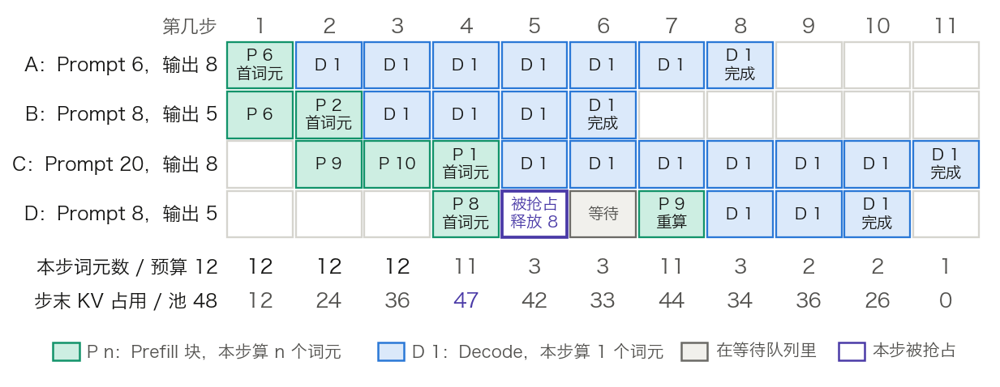
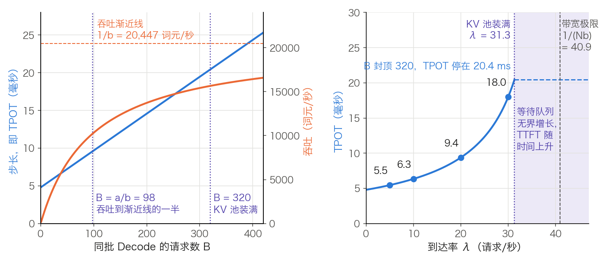

## 11.3 调度循环与抢占：一个请求在引擎里的全过程

[11.2 节](11.2_continuous_batching.md)给出了四个想法：迭代级调度、KV 缓存分页、前缀缓存、分块 Prefill。前缀缓存留给 [11.5 节](11.5_prefix_reuse.md)，其余三个都靠同一个部件落地：**调度器**（scheduler）。它在每次前向之前决定哪些请求参加、各算几个词元。本节回答四个问题：一个请求经过哪些状态；每一步调度器按什么顺序做决定；显存不够时牺牲谁、怎样恢复；到达率、批大小与延迟之间是什么数量关系。

算例沿用 3.8 节的口径：模型取 Llama 3 8B（[表 3-24](../03_components/3.8_gpt_inference_flow.md)），权重与 KV 缓存按 BF16 存放；硬件取 [10.1 节](../10_inference_optimization/10.1_bottleneck.md)的 H100，稠密 BF16 峰值算力约 990 TFLOPs/s，显存带宽 3.35 TB/s。KV 块怎样分配与回收归 [11.4 节](11.4_kv_memory_management.md)，本节只把 KV 空间当作一个按词元计数的池子。

### 11.3.1 请求的四个状态

从调度器看，一个请求只有四种状态，图 11-6 画出了它们之间的全部转移。

图 11-6：一个请求在调度器里的状态机（[生成脚本](https://github.com/yeasy/llm_internals/blob/main/tools/figures/ch11_3_request_states.py)）。方框下方的灰字是该状态占用的资源；紫色是显存不足时才走的路径。

- **等待**（waiting）：已分词，排在等待队列里。不占 KV 空间，也不占每步的计算量。
- **运行**（running）：已被准入。它的 KV 留在显存里，每步至少分到一个词元的计算量。
- **被抢占**（preempted）：原本在运行，因 KV 空间不够被调度器中止。KV 全部释放，已生成的词元保留，请求插回等待队列的队首。
- **完成**（finished）：选中 EOS、到达长度上限、命中停止串，或客户端取消。KV 全部归还，结果流回用户。

调度器并不区分“Prefill 阶段”和“Decode 阶段”。每个请求只记两个数：应算词元数（Prompt 加已生成的词元）和已算词元数（KV 已写入缓存的词元）。每一步的任务是让后者追上前者。差距是整条 Prompt 时，这一步就是 Prefill；差距是 1 时，就是 Decode；差距大于本步能分到的量时，就是分块 Prefill。vLLM 调度器源码的注释写的正是这一点。调度器里没有 decoding phase，也没有 prefill phase，只有 `num_computed_tokens` 追赶 `num_tokens_with_spec`。前缀缓存命中（[11.5 节](11.5_prefix_reuse.md)）相当于已算词元数的初值不为 0，投机解码相当于差距大于 1，同一套记账都能容纳。

### 11.3.2 一步迭代：调度器做的六件事

[Orca](https://www.usenix.org/conference/osdi22/presentation/yu) 把调度粒度从“一个请求”改成“一次迭代”：调度器选出本步要跑的请求，执行一次前向，收回结果，再选下一步。现代引擎沿用这个循环，每一步依次做六件事。

1. **回收**。上一步完成或被取消的请求移出运行队列，KV 归还池子。
2. **先排运行中的请求**。按队列顺序，给每个请求分配“应算减已算”个词元，但不超过剩余的**词元预算**（token budget，一步最多处理的词元总数）。Decode 请求各拿 1 个；Prefill 未完成的请求拿走尽量大的一块。
3. **为这些词元申请 KV 空间**。申请失败就触发抢占（11.3.5），腾出空间后重试。
4. **准入等待队列里的请求**。前提是本步没有发生抢占。每准入一个都要同时满足三项：词元预算还有剩余，运行中的请求数未到并发上限，KV 空间放得下。队首不满足就停止，不跳过它去看后面的请求。
5. **执行前向**。所有被选中的词元摊平成一个一维序列，一起过线性层；注意力按各请求自己的长度分别计算。这就是 Orca 的 selective batching。
6. **采样与状态更新**。已算词元数追平应算词元数的请求各采样一个词元，其余请求（Prompt 还没算完）不采样。检查停止条件，更新计数，进入下一步。

设一步里有 32 个 Decode 请求，外加某个新请求的 2,016 个 Prompt 词元，摊平后是 `n = 32 + 2,016 = 2,048` 行。各层的形状见 [11.2.2](11.2_continuous_batching.md) 与图 11-3：线性层对 `X[2048, 4096]` 一次算完，注意力按请求分开。LM head 只取要采样的行：32 个 Decode 各一行，那条 Prompt 若在本步算完再加 1 行。线性层的计算量只与 `n` 有关，与这 `n` 个词元来自几个请求无关。词元预算约束的因此是“一步多长”，并发上限与 KV 空间约束的是“显存里同时放几条序列”，三者各管一件事。

第 2 步与第 4 步的先后是一个设计选择。表 11-5 对比三种排法。

| 排法 | 每步怎样组批 | 首词元延迟 | Decode 的词元间隔 |
| --- | --- | --- | --- |
| 请求级批处理 | 一批全部结束才换下一批 | 要等整批结束 | 稳定，但批越跑越空 |
| Prefill 优先 | 有新请求就先做完整 Prefill，Decode 暂停 | 短 | 每来一个长 Prompt 就停顿一次 |
| Decode 优先加分块 Prefill | 先排全部 Decode，再排未完成的 Prefill，最后用剩余预算准入新请求 | 长 Prompt 要分几步 | 有上界，由词元预算决定 |

表 11-5：三种组批顺序的取舍。第三行是 [Sarathi-Serve](https://arxiv.org/abs/2403.02310) 提出的 stall-free batching，第二行是该文记录的 vLLM 早期做法，它造成的停顿被称为 generation stall。

本节后文都按第三种排法。它把“新请求要不要打断老请求”这个矛盾，换成了一个可调的数：词元预算。

### 11.3.3 玩具轨迹：11 步走完四个请求

图 11-7 用一组很小的数字把六件事走一遍：词元预算 12，KV 池 48 个词元，并发上限 4。请求 A、B 在第 1 步前到达，C 在第 2 步前到达，D 在第 4 步前到达。Prompt 与输出长度依次为 A 6/8、B 8/5、C 20/8、D 8/5。最后一个采样出的词元不再送回模型，也就不写入 KV。

图 11-7：玩具调度器的 11 步轨迹（[生成脚本](https://github.com/yeasy/llm_internals/blob/main/tools/figures/ch11_3_schedule_trace.py)，脚本内含调度器并打印同一份轨迹）。格内数字是该请求本步分到的词元数；下方两行是本步用掉的预算与步末的 KV 占用。

- **第 1 步**：A 拿 6 个词元，Prompt 算完，采样出首词元。预算剩 6，B 的 Prompt 有 8 个词元，只能先算 6 个，这一步不采样。KV 占用 `6 + 6 = 12`。
- **第 2 步**：先排运行中的请求。A 是 Decode，拿 1 个；B 拿剩下的 2 个并出首词元。预算还剩 `12 − 1 − 2 = 9`，准入 C，它的 20 个词元先算 9 个。
- **第 3、4 步**：C 再算 10 个、1 个，共三步完成 Prefill，其间 A、B 每步照常前进一个词元。第 4 步预算剩 `12 − 3 = 9`，池子空闲 `48 − 39 = 9`，D 的 8 个词元放得下，准入。步末 KV 占用 47。
- **第 5 步**：四个请求各需要 1 个新位置，池子只剩 1 个。A 拿走后，B 申请失败，调度器抢占运行队列的队尾 D，释放 8 个词元，B、C 得以继续。D 回到等待队列队首，它在第 4 步生成的那个词元保留。本步发生了抢占，不再准入。
- **第 6 步**：D 需要 `8 + 1 = 9` 个词元的空间，池子空闲 `48 − 42 − 3 = 3`，仍在等待。B 在步末完成，归还 `8 + 4 = 12` 个词元：第 5 个输出词元未写入 KV。
- **第 7 步**：D 重新准入，把 Prompt 与已生成的 1 个词元合成 9 个词元一次重算，随即采样出第 2 个词元。

D 的首词元在第 4 步就已流出，第二个词元却到第 7 步才出现。正常间隔是 1 步，这里是 3 步，多出的停顿就是抢占在用户侧的表现。第 4 步准入 D 时调度器只检查了“此刻放得下”，没有为 A、B、C 下一步的增长留余量，这是 11.3.5 要讨论的准入口径问题。

### 11.3.4 词元预算：一步放多少词元

问题：一步里多放一些 Prefill 词元，这一步会变长多少？按 [10.1 节](../10_inference_optimization/10.1_bottleneck.md)的 Roofline，一步的耗时有两个下界，取大者：

$$
t_{\text{step}} \ge \max\left(\frac{\text{本步读出的字节}}{B_{\text{peak}}},\ \frac{\text{本步的 FLOPs}}{F_{\text{peak}}}\right)
$$

先备好 Llama 3 8B 的三个常量。

- **权重字节**。一层的矩阵参数为 `4096 × 4096 × 2 + 4096 × 1024 × 2 + 3 × 4096 × 14336 = 218,103,808`。加上词嵌入、LM head 与归一化，共 `32 × 218,103,808 + 2 × 128,256 × 4096 + 65 × 4096 = 8,030,261,248` 个参数：词嵌入与 LM head 各一份、不共享，词表 128,256 行见表 3-16；每层两个归一化加末尾一个，共 65 个，各 4,096 个参数。BF16 下 16.06 GB。读一遍要 `16.06 GB ÷ 3.35 TB/s = 4.79 ms`，记作 `a`。
- **每词元计算量**。Llama 的 MLP 有三个矩阵，3.8.7 的 `24d²` 不再适用，直接按“每个矩阵参数 2 次运算”计：`2 × 32 × 218,103,808 ≈ 1.396 × 10¹⁰` FLOPs，折合 `14.1 µs`。要采样的位置再加 LM head 的 `2 × 4096 × 128,256 ≈ 1.05 × 10⁹`。
- **每词元 KV**。`2 × 8 × 128 × 32 = 65,536` 个数（见 3.8.7），BF16 下 131,072 字节，即 128 KiB。

两个下界相等时，`n × 14.1 µs = 4.79 ms`，得 `n ≈ 340`。一步少于约 340 个词元时，耗时由读权重决定，多加词元几乎不花时间；超过之后，步长随词元数线性增长。Sarathi-Serve 对 A100 给出的理论值是约 200 个词元，并指出张量并行度较高时，实测因固定开销会推迟到 500 至 600 个，量级一致。

[11.2.5](11.2_continuous_batching.md) 已算过 32,768 词元的 Prompt 按 2,048 分块时首块与末块的耗时；这里换成 8,192 词元的 Prompt，补上预算大小与各块耗时的关系。以“32 个 Decode 请求、各有 1,000 个词元上下文”为底，向同一步加入一个 Prefill 块，结果列在表 11-6。先算一格：块大小 2,016。

$$
\begin{aligned}
\text{块的线性部分} &= 2016 \times 1.396\times10^{10} = 2.814\times10^{13} \\
\text{块的注意力} &= 2 \times 4096 \times 32 \times 2016^2 = 1.07\times10^{12} \\
\text{32 个 Decode} &= 32 \times (1.396\times10^{10} + 1.05\times10^{9} + 4\times1000\times4096\times32) = 4.97\times10^{11} \\
t_{\text{cmp}} &= 2.970\times10^{13} \div 9.9\times10^{14} = 30.0\ \text{ms}
\end{aligned}
$$

注意力一项用 3.8.7 的 `2T²d`（逐层、因果折半）；Decode 的打分与读取按每层 `4sd`。访存一侧是 `16.06 GB + 32 × 1000 × 131,072 B = 20.25 GB`，合 6.05 ms，小于 30.0 ms，这一步由算力决定。

| 同步加入的 Prefill 词元 | 访存下界（ms） | 算力下界（ms） | 步长（ms） | 相对纯 Decode |
| ---: | ---: | ---: | ---: | ---: |
| 0 | 6.05 | 0.50 | 6.05 | 1.0 倍 |
| 224 | 6.05 | 3.67 | 6.05 | 1.0 倍 |
| 480 | 6.05 | 7.33 | 7.33 | 1.2 倍 |
| 992 | 6.05 | 14.75 | 14.75 | 2.4 倍 |
| 2,016 | 6.05 | 30.00 | 30.00 | 5.0 倍 |
| 8,192 | 6.05 | 133.78 | 133.78 | 22.1 倍 |

表 11-6：同一步里的 Prefill 词元数怎样拉长步长。Llama 3 8B、H100、理想 Roofline 下界；真实引擎的算力利用率达不到峰值，绝对值更大，倍数关系的形状不变。

最后一行是不分块的后果：一个 8,192 词元的 Prompt 整段进入，同批 32 个用户的下一个词元要等 134 ms，而平时只要 6 ms。这个间隔称为 **TBT**（time between tokens，相邻两个输出词元的间隔）。它在一个请求内的平均值是 TPOT（time per output token，每输出词元时间）。两者的正式定义见 [11.13 节](11.13_best_practices.md)。Sarathi-Serve 在 A100 上实测，不分块的混批使 TBT 最多升到纯 Decode 批的 28.3 倍，与表 11-6 同一量级。

词元预算把最后一行切开。表 11-7 让同一个 8,192 词元的 Prompt 在不同预算下完成 Prefill，每步先扣掉 32 个 Decode 词元。第 k 块的注意力按 `2 × 4096 × 32 × ((已算 + 块)² − 已算²)` 计，已算为前 k − 1 块的词元数；线性部分与 32 个 Decode 的算法同上。分块之后，访存一侧要另加长请求已写入的 KV：第 k 步多读 `已算词元数 × 131,072 B`。预算 256 的第 37 步已算 `36 × 224 = 8,064` 个词元，多读 `8,064 × 131,072 B = 1.06 GB`，访存下界由 6.05 ms 升到 6.36 ms。

| 词元预算 | 每步 Prefill 词元 | 步数 | 最长一步（ms） | 长请求的 Prefill 总时长（ms） |
| ---: | ---: | ---: | ---: | ---: |
| 256 | 224 | 37 | 6.4 | 229.5 |
| 512 | 480 | 18 | 9.3 | 147.6 |
| 1,024 | 992 | 9 | 18.4 | 138.9 |
| 2,048 | 2,016 | 5 | 36.5 | 139.3 |
| 4,096 | 4,064 | 3 | 70.9 | 139.5 |
| 不分块 | 8,192 | 1 | 133.8 | 133.8 |

表 11-7：词元预算对 TBT 上界与长请求 Prefill 时长的影响（口径同表 11-6，另计前面各块的 KV 读取）。预算 2,048 时，`8192 ÷ 2016 = 4.06`，需要 5 步，各步依次为 30.0、32.2、34.3、36.5、6.4 ms；最后一步只剩 128 个词元，由访存决定，同样是 6.36 ms。

从表中读出三点。

- **预算就是 TBT 的上界**。预算在拐点以上时，每减半，最长一步大致减半：表中 4,096 到 512 的三次减半各为 1.9 至 2.0 倍。到 256 只剩 1.45 倍，原因见第三点。同批用户感受到的最大停顿随最长一步一起变短。
- **后面的块比前面的贵**。第 4 块要对前 3 块的 KV 打分，注意力一项为 `2 × 4096 × 32 × (8064² − 6048²) = 7.46 × 10¹²`，是第 1 块的 7 倍，步长因此从 30.0 ms 升到 36.5 ms。前面各块的 KV 还要被反复读出：分成 N 块时，第 1 块的 KV 被读 N − 1 次。
- **预算不能低于拐点**。预算 256 时每步只有 3.67 至 4.60 ms 的计算（第 1 块到第 36 块，后面的块多了对已算 KV 的打分），却要付 6.05 至 6.36 ms 的访存，37 步平均 6.20 ms，Prefill 总时长从 139 ms 涨到 230 ms。预算的合理下限是让一步恰好越过约 340 个词元的拐点。

分块的代价不止于此。Sarathi-Serve 报告过一个内核层面的现象：个别情形下，块大小 257 的 Prefill 时间比 256 高出 32%，原因是矩阵维度不能被 GPU 的分片大小整除。预算取 2 的幂可避开这类情形，具体数值再按 TBT 的目标用一次离线压测确定。

### 11.3.5 显存不足：抢占谁，怎样恢复

问题的根源是输出长度事先未知。准入一个请求时，调度器要为它将来的 KV 留多少空间？设 KV 池为 400,000 个词元，合 `400,000 × 128 KiB ≈ 48.8 GiB`。[11.4 节](11.4_kv_memory_management.md)按显存预算算得约 41 万，这里取整。请求的输入为 1,000 个词元，输出上限 1,000 个。表 11-8 对比三种准入口径。

| 准入口径 | 每请求按多少词元计 | 可并发请求数 | 风险 |
| --- | ---: | ---: | --- |
| 悲观：按输入加输出上限预留 | 2,000 | 200 | 无抢占；实际输出较短时空间闲置 |
| 按稳态平均占用 | 1,500 | 266 | 负载波动时偶发抢占 |
| 乐观：只看 Prompt 放不放得下 | 1,000 | 400 | 各请求继续增长，必然抢占 |

表 11-8：三种准入口径下的并发数。第二行假设各请求的进度均匀错开，平均已生成 500 个词元。

Orca 属于第一种：请求首次被调度时按 `max_tokens` 预留全部槽位，保证此后不会缺空间。[vLLM 论文](https://arxiv.org/abs/2309.06180)选了另一头：KV 按需分配，空间用尽时再抢占。同样的显存，后两种口径能多放 33% 到 100% 的请求，代价是要有一套抢占与恢复的机制。

**何时触发**。运行中的请求每步至少需要一个新的 KV 位置。11.3.2 的第 3 步申请失败，就是触发点。

**牺牲谁**。先到先服务之下，牺牲最晚到达的请求：它已投入的计算最少，也最不该排在别人前面。vLLM 论文的规则是：最早到达的请求最先服务，最晚到达的最先被抢占。实现上取运行队列的队尾；启用优先级时，取优先级最低、同级中到达最晚的那个。

**整条释放**。一条序列的全部 KV 在每一步都会被读到，留下一半没有用处。vLLM 论文称之为 all-or-nothing：要么全留，要么全放。

**怎样恢复**有两条路：**重算**（recomputation）丢弃 KV，再次准入时把 Prompt 与已生成的词元拼成一条新 Prompt，一次 Prefill 算回来；**换出**（swapping）把 KV 拷到主机内存，恢复时拷回。两条路的耗时对比，以及 vLLM 的 V1 引擎为何只保留重算，见 [11.4.5](11.4_kv_memory_management.md)。本节后文按重算讨论：已生成的词元不会丢，用户看到的只是一次停顿。

重算要花多少？设被抢占的请求已生成 600 个词元，需要重算 1,600 个：

$$
1600 \times 1.396\times10^{10} + 2\times4096\times32\times1600^2 = 2.30\times10^{13}\ \text{FLOPs},\quad 2.30\times10^{13} \div 9.9\times10^{14} = 23.2\ \text{ms}
$$

按峰值算力，单次重算约等于 4 个 Decode 步；按 11.4.5 的 0.5 利用率折算，约 46 ms。真正的代价有两项。其一是停顿：被抢占者要等到池子里腾出整条序列的空间才能回来，图 11-7 里 D 空等了第 5、6 两步，线上可以是数秒。其二是预算被挤占：若 10% 的请求各被抢占一次，每个请求平均多占 `0.1 × 1600 = 160` 个词元的预算，相对基线的 2,000 个词元多出 8%；比例升到 30% 时多出 24%，系统在重复劳动中空转。

防止抢占连锁发生，靠四道闸。

- 发生抢占的那一步不准入新请求（11.3.2 第 4 步的前提）。vLLM 论文的换出方案更严：被抢占的序列全部完成之前不再接收新请求。
- 准入时检查整条 Prompt 放得下，而不是只看第一块。
- 准入时保留一段**水位线**（watermark）：空闲 KV 低于总量的某个比例就停止准入，把余量留给运行中请求的增长。图 11-7 若设 4 个词元的水位线，第 4 步 D 就不会被准入，也就没有第 5 步的抢占和第 7 步的重算；代价是 D 的首词元从第 4 步推迟到第 7 步，完成从第 10 步推迟到第 11 步。
- 压低并发上限，从源头减少同时增长的序列数。

这个对照也说明抢占不总是坏事：图中重算用掉的是第 7 步原本闲置的预算，乐观准入反而让 D 更早完成。预算每步都被填满时，重算才会挤占别的请求。

判断是否需要动这些闸，看抢占计数。等待队列里有请求而抢占计数长期为 0、KV 占用率又偏低，说明准入偏保守；抢占计数持续上升，说明准入过于乐观。KV 占用率贴顶不等于用足了显存：抢占频繁时，有效吞吐反而下降（11.4.7）。还有一种抢占救不了的情形：单个请求的 Prompt 加输出上限超过整个池子，它永远无法完成，应在入口处按长度直接拒绝。

### 11.3.6 排队论视角：到达率、批大小与延迟

问题：每秒到达 λ 个请求，稳态下同批有多少请求在 Decode，TPOT 是多少？纯 Decode 步由访存决定，步长随批大小线性增长：

$$
t_{\text{step}}(B) = a + bB,\qquad a = \frac{\text{权重字节}}{B_{\text{peak}}},\quad b = \frac{\text{每请求的 KV 字节}}{B_{\text{peak}}}
$$

这里 `B` 是同批的请求数，`B_peak` 是显存带宽。设输入 1,000、输出 `N = 500` 个词元，Decode 期间平均上下文为 `1000 + 250 = 1,250`，则 `b = 1250 × 131,072 B ÷ 3.35 TB/s = 0.0489 ms`，`a = 4.79 ms`。

**批大小与吞吐**。吞吐为 `B ÷ (a + bB)`，随 `B` 增大趋于 `1/b ≈ 20,447` 词元/秒，到不了更高：这是 3.8.7 的瓶颈三，批处理摊薄的只有权重。吞吐达到渐近线一半的位置是 `B = a/b ≈ 98`，此时全批的 KV 字节恰好等于权重字节。过了这一点，批再加大，吞吐的增量越来越小，TPOT 却照旧线性上升：`B = 98` 时 9.6 ms，`B = 320` 时 20.4 ms，吞吐只从 10,222 升到 15,652 词元/秒。

**到达率与批大小**。Little 定律说，稳态下在途请求数等于到达率乘以平均驻留时间。一个请求要在 Decode 批里驻留 `N` 步，故

$$
B = \lambda \cdot N \cdot (a + bB)
\quad\Longrightarrow\quad
B = \frac{\lambda N a}{1-\lambda N b},\qquad
\text{TPOT} = a + bB = \frac{a}{1-\lambda N b}
$$

分母 `1 − λNb` 与单服务台排队公式里的 `1 − ρ` 是同一个形状：`ρ = λNb` 可读作“带宽被各请求的 KV 读取占去的比例”。以 `λ = 20` 为例，`ρ = 20 × 500 × 0.0000489 = 0.489`，`B = 20 × 500 × 0.004794 ÷ 0.511 = 93.8`，`TPOT = 4.794 ÷ 0.511 = 9.38 ms`。其余到达率见表 11-9。

| 到达率 λ（请求/秒） | ρ = λNb | 稳态批大小 B | TPOT（ms） | 每步 Prefill 词元 | 算力下界（ms） | KV 占用（词元） |
| ---: | ---: | ---: | ---: | ---: | ---: | ---: |
| 5 | 0.122 | 13.7 | 5.46 | 27 | 0.60 | 17,069 |
| 10 | 0.245 | 31.7 | 6.35 | 63 | 1.40 | 39,663 |
| 20 | 0.489 | 93.8 | 9.38 | 188 | 4.13 | 117,292 |
| 30 | 0.734 | 270.0 | 18.00 | 540 | 11.88 | 337,444 |

表 11-9：到达率怎样决定批大小与 TPOT。每步 Prefill 词元为 `p = λ × 1000 × t_step`；KV 占用为 `B × 1,250`；算力下界为 `((B + p) × 1.396 × 10¹⁰ + B × (1.05 × 10⁹ + 4 × 1250 × 4096 × 32)) ÷ 9.9 × 10¹⁴`，略去了 Prefill 块自身的注意力。`λ = 20` 一行：`B + p = 93.8 + 187.7 = 281.5`，`(281.5 × 1.396 × 10¹⁰ + 93.8 × 1.705 × 10⁹) ÷ 9.9 × 10¹⁴ = 4.13 ms`。

算力下界一列用来核对前提。它按每步平均的 Prefill 词元算，各行都小于 TPOT：平均而言，各步由访存决定。Prefill 实际成块到达。`λ = 20` 时平均每步到达 `20 × 0.00938 ≈ 0.19` 个请求；整段 1,000 词元落进同一步时，把 `p` 换成 1,000，再加块自身的注意力 `2 × 4096 × 32 × 1000² = 2.62 × 10¹¹`，这一步的算力下界约为 15.8 ms，大于 9.38 ms，转由算力决定。TPOT 的均值因此略高于表中值，尖峰有多高由词元预算决定（11.3.4）。

到达率从 20 升到 30，只多了一半，批大小却从 94 涨到 270，TPOT 接近翻倍。图 11-8 画出了这两条关系。

图 11-8：左，步长随批大小线性上升，吞吐趋于饱和；右，TPOT 随到达率按 `a ÷ (1 − λNb)` 上升，KV 池装满后 `B` 封顶 320、TPOT 停在 20.4 ms，多出的请求进入排队区（[生成脚本](https://github.com/yeasy/llm_internals/blob/main/tools/figures/ch11_3_batch_latency.py)）。

**容量墙**。批大小不能无限增长。400,000 个词元的池子按平均 1,250 个词元一条，装得下 `B_max = 320` 条；此时步长 20.44 ms，可承受的到达率为 `320 ÷ (500 × 0.02044) = 31.3` 请求/秒。公式里的带宽极限 `1 ÷ (Nb) = 40.9` 请求/秒并不会先到：先撞上的是显存容量。

**过墙之后**。到达率超过 31.3，多出来的请求只能留在等待队列。`λ = 35` 时队列每秒净增 3.7 个，一分钟后积压 222 个，新到的请求要排 `222 ÷ 31.3 ≈ 7.1` 秒才轮到 Prefill，而且这个数随时间线性增长，没有稳态。TTFT（首词元延迟）因此分两段：容量之内，它约等于“等当前一步结束”加自己的 Prefill 步数，是几十毫秒；容量之外，它由排队主导且无界。过载时要靠入口限流与尽早拒绝把队列截短，见 [11.13 节](11.13_best_practices.md)。

**余量**。到达是随机的。若到达是泊松过程、各请求的驻留时间相互独立，在途请求数服从泊松分布（按 M/G/∞ 模型），`λ = 30` 时均值 270、标准差 `√270 ≈ 16`，均值加两倍标准差为 303，离 320 已经不远；步长随 `B` 变长还会放大这个波动。工作点因此要定在容量墙以下，留多少余量取决于到达的突发程度。

这套算式有三个前提。步长取的是访存下界，真实值更大，但线性形状不变，`a`、`b` 可以由两次不同批大小的压测反解出来。Prefill 被假定为搭载在 Decode 步里而不改变步长，这要求表中“算力下界”一列小于 TPOT，且只在平均意义上成立；输入很长、输出很短的负载不满足这一条，步长转由算力决定，应改用 11.3.4 的算法。各请求的长度取了平均值，长尾分布下容量墙会提前到来。

### 11.3.7 公平性与优先级

等待队列按什么顺序出队，决定了过载时谁受损。

**先到先服务**（FCFS）是默认选择。vLLM 论文给的理由是公平且不会饿死。它的弱点是队首阻塞：11.3.2 第 4 步规定队首放不下就停止准入，一个超长 Prompt 会挡住身后所有短请求，即使池子里的空间够后者用。

**最短作业优先**能把平均延迟压到最低，但输出长度事先未知。[一项排序学习的工作](https://arxiv.org/abs/2408.15792)指出，预测精确长度不可行，预测一批请求之间的相对长短却可行，据此近似最短作业优先。这类策略必须配防饿死机制：该文给每个请求记一个被跳过的次数，超过阈值就临时提升优先级。

**优先级调度**让请求自带一个优先级。等待队列由先进先出队列换成按“优先级、到达时间”排序的堆；抢占时牺牲优先级最低者。它的边界情形是低优先级请求被反复抢占：每次回来都要重算，重算完又被抢占，既拿不到进展，又消耗预算。应对办法是给低优先级流量单独限流，或限制单个请求的被抢占次数。

**多租户公平**针对的是另一个问题：某个租户大量发请求，按请求计数的 FCFS 会让其他租户一起排长队。按请求数限流又会在空闲时浪费容量。[VTC](https://arxiv.org/abs/2401.00588)（Virtual Token Counter）的做法是按词元记账：

- 每个租户一个计数器，记录已获得的服务量，输入词元与输出词元分别加权。该文实验取输入权重 1、输出权重 2，一个“输入 1,000、输出 500”的请求计 `1000 + 2 × 500 = 2,000`，一个“输入 200、输出 100”的请求计 400。
- 准入时，从计数器最小的租户那里取请求；每生成一个词元就更新计数，所以输出长度未知不成问题。
- 某租户从空闲转为活跃时，把它的计数器抬到不低于排队租户中的最小值，防止靠“攒额度”换取之后的独占。

VTC 只改变出队顺序，不拒绝放得下的请求，空闲容量不会被浪费。该文证明，两个持续有积压的租户所获服务量之差有上界，且与时间长度无关。

公平与吞吐并不总是一致。缓存感知的调度（[11.5 节](11.5_prefix_reuse.md)）倾向于让前缀命中的请求插队，这对吞吐有利，对先到的未命中请求不公平。两者怎样折中，是调度策略必须显式决定的事。

### 11.3.8 对到实现：vLLM 调度器的旋钮

词元预算、并发上限、分块开关、单请求块上限、出队策略五项对应的启动参数与默认值见 [11.10 节](11.10_vllm_internals.md)的表 11-30。表 11-10 只列本节独有的机制与状态名、指标名。名称取自 v0.29.0 的 `vllm/config/scheduler.py`、`vllm/v1/core/sched/scheduler.py` 与 `vllm/v1/metrics/loggers.py`。

| 本节的机制 | vLLM 里的名字 | 说明 |
| --- | --- | --- |
| 水位线 | `watermark` | 准入时保持空闲的 KV 块比例 |
| 整条 Prompt 放得下才准入 | `scheduler_reserve_full_isl` | 防止分块 Prefill 下的过度准入 |
| 在途上限 | `max_num_queued_reqs`、`max_num_queued_tokens` | 前者限等待加运行的请求总数，后者限处于 Prefill 阶段的 Prompt 词元总量；超限的新请求直接返回 HTTP 503 |
| 状态机 | `RequestStatus.WAITING`、`RUNNING`、`PREEMPTED`、`FINISHED_*` | 被抢占时 `num_computed_tokens` 置 0 并放回等待队列，FCFS 下插在队首 |
| 观测 | `vllm:num_preemptions`、`vllm:num_requests_waiting`、`vllm:kv_cache_usage_perc` | 分别对应 11.3.5 的抢占计数、11.3.6 的排队区与容量墙 |

表 11-10：本节独有的调度机制与 vLLM 配置项、状态名、指标名的对应。名称随版本变动，使用前以所用版本的源码为准。

读完本节，应能回答下面五个问题。

1. 调度器为什么不需要区分 Prefill 与 Decode 两个阶段？（11.3.1）
2. 一步里先排运行中的请求、后准入新请求，换来了什么，代价是什么？（表 11-5）
3. 词元预算为什么既不能太大、也不能低于约 340 个词元？（11.3.4）
4. 被抢占的请求丢了什么、保留了什么，用户看到的现象是什么？（11.3.5）
5. 到达率只增加一半，TPOT 为什么会接近翻倍；再往上为什么 TTFT 会失去稳态？（11.3.6）
