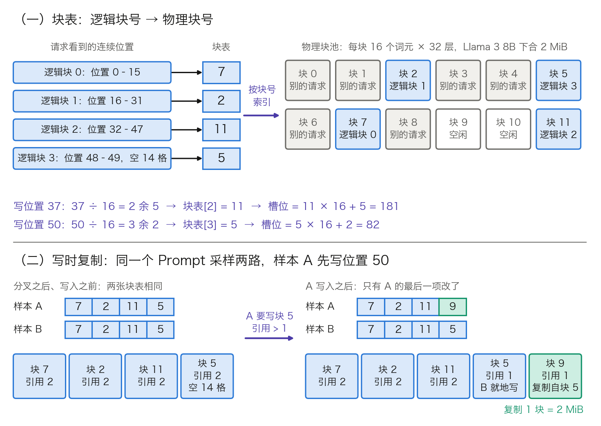
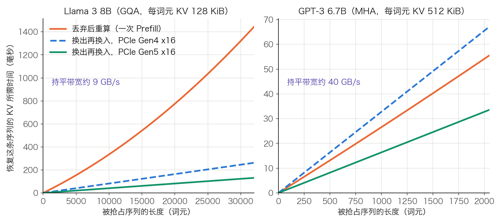

## 11.4 KV 显存管理：块表、换出与重算

[11.3 节](11.3_scheduler_loop.md)的调度器每一步都要问同一个问题：显存里还放得下多少词元的 K/V。本节回答这个数从哪里来，一个词元的 K/V 具体写到显存的哪个位置，以及放不下时被抢占序列的 K/V 怎么处置。[11.2 节](11.2_continuous_batching.md)只给了分页的想法，这里把它落到数据结构和账上；跨请求的前缀复用留给 [11.5 节](11.5_prefix_reuse.md)。

算例沿用 [3.8.6](../03_components/3.8_gpt_inference_flow.md) 表 3-24 的 Llama 3 8B：`L = 32`、`d_model = 4096`、`n_kv = 8`、`d_h = 128`。BF16 每个数 2 字节，硬件是一张 80 GB 显存的 H100。容量用十进制 GB（10⁹ 字节），块的大小用 KiB、MiB（2¹⁰、2²⁰ 字节）。

### 11.4.1 显存预算：KV 池有多大

一张卡的显存分给三类东西：权重、一次前向的临时张量（激活）、KV 缓存。前两项在启动时就确定，剩余部分一次性划成 **KV 池**，服务期间不再增减：

$$
M_{\text{KV 池}} = M_{\text{显存}} \times u - M_{\text{权重}} - M_{\text{激活峰值}} - M_{\text{其他}}
$$

`u` 是允许引擎占用的显存比例，vLLM 的参数名是 `gpu_memory_utilization`；留出的 `1 − u` 给驱动、其他进程和分配器的碎片。

**权重。** 一层的矩阵逐个数：Q、O 投影各 `[4096, 4096]`，K、V 投影各 `[4096, 1024]`，合计 41,943,040 个数；MLP 的三个矩阵各 `[4096, 14336]`，合计 176,160,768 个数。一层共 218,103,808 个，32 层共 6,979,321,856 个。输入嵌入与 LM head 两张 `[128256, 4096]` 的表各 525,336,576 个；归一化向量每层 2 个、末尾 1 个，共 `65 × 4,096 = 266,240` 个。总数是 8,030,261,248，BF16 下占 16.06 GB。

**激活。** 推理不为反向传播保留中间结果，同一时刻只有当前一层的临时张量占着显存。假设一步最多处理 8,192 个词元，最大的一组临时张量是 MLP 的 gate、up 两路输出，各 `[8192, 14336]`，合计约 470 MB；256 条序列的 logits `[256, 128256]` 按 FP32 计约 131 MB。这一项的量级是 1 GB，远小于权重。vLLM 并不靠公式估它：启动时用最大批次的假输入跑一遍前向，实测峰值，再把剩余显存划给 KV 池（见 [11.10 节](11.10_vllm_internals.md)）。

**KV 池。** 取 `u = 0.9`，激活与其他开销（CUDA Graph、通信缓冲）合留 2 GB，这个 2 GB 是算例的假设值：

$$
80 \times 0.9 - 16.06 - 2 = 53.94\ \text{GB}
$$

每个词元的 K/V 按 3.8.7 的算法是 `2 × n_kv × d_h × L` 个数，即 `2 × 8 × 128 × 32 = 65,536` 个。BF16 下合 131,072 字节，即 128 KiB。池的未舍入值是 53.939478 GB，下文的词元数都按它算：`53.939478 GB ÷ 131,072 B ≈ 411,525` 个词元。11.10 节用 vLLM 的默认比例和 GiB 口径重走同一条公式，取值不同，得数也不同。表 11-11 把这笔预算换成并发数。

| 项目 | Llama 3 8B（GQA，`n_kv = 8`） | 同样形状、`n_kv = 32` 的 MHA |
| --- | ---: | ---: |
| 每词元 KV | 131,072 B（128 KiB） | 524,288 B（512 KiB） |
| KV 池可存词元 | 411,525 | 102,881 |
| 每条序列 2,000 词元时的并发 | 205 | 51 |
| 每条序列 8,000 词元时的并发 | 51 | 12 |

表 11-11：53.94 GB 的 KV 池能同时容纳多少条序列。并发数按 16 个词元一块的整块计（11.4.3），每条序列占 125 块或 500 块：GQA 一列共 25,720 块，MHA 一列共 6,430 块。MHA 一列只把 `n_kv` 改回 32，注意力一侧与 GPT-3 6.7B 相同（表 3-24）；权重与池的大小仍按 Llama 3 8B。

从这张表读出两点。第一，KV 池的单位是词元，不是请求：并发数等于池容量除以平均驻留长度，请求越长，能同时服务的越少。第二，凡是缩小权重或每词元 KV 的手段，收益都能用这条公式换算。权重改用 FP8 省下 8.03 GB，池里多出约 61,300 个词元；GQA 把每词元 KV 缩到四分之一，并发直接变成 4 倍。

### 11.4.2 块大小：内部碎片与取舍

分页之前的做法是给每个请求预留一段连续显存，长度取最大序列长度。按 8,192 预留、实际只用到 2,000 个词元时，这段显存的利用率是 `2,000 ÷ 8,192 = 24.4%`。[PagedAttention 论文](https://arxiv.org/abs/2309.06180)对当时几个系统的实测是 20.4% 到 38.2%，其余被预留、内部碎片和外部碎片占掉。

把 KV 池切成等长的**物理块**（physical block）、按需分配之后，外部碎片消失，因为任何空闲块都能满足任何请求。剩下的浪费只有每条序列最后一块里没用上的槽位（slot）。设块大小为 `b` 个词元，序列长度除以 `b` 的余数近似均匀分布时，每条序列平均浪费 `(b − 1) / 2` 个槽位，浪费占比是：

$$
\text{浪费占比} = \frac{(b-1)/2}{\bar{\ell} + (b-1)/2}
$$

其中 $$\bar{\ell}$$ 是序列的平均长度。取 `b = 16`、平均长度 200，得 `7.5 ÷ 207.5 = 3.6%`。表 11-12 列出其余组合。

| 块大小 `b` | 平均浪费槽位 | 平均长度 200 时的浪费 | 平均长度 2,000 时的浪费 | 8,192 词元的块表项数 |
| ---: | ---: | ---: | ---: | ---: |
| 1 | 0 | 0% | 0% | 8,192 |
| 8 | 3.5 | 1.7% | 0.17% | 1,024 |
| 16 | 7.5 | 3.6% | 0.37% | 512 |
| 32 | 15.5 | 7.2% | 0.77% | 256 |
| 128 | 63.5 | 24.1% | 3.08% | 64 |
| 256 | 127.5 | 38.9% | 5.99% | 32 |

表 11-12：块大小与内部碎片。浪费占比按上式计算；最后一列是一条 8,192 词元的序列在块表里占的项数。

块越小浪费越少，跨请求共享的粒度也越细（11.5 节），但块大小不能一路取到 1。原因不在块表本身：512 项、每项按 4 字节整数计只有 2 KiB，256 条序列的块表 `[256, 512]` 也只有 512 KiB。代价在内核和传输上。注意力内核每跨一个块就多一次查表和一次不连续的读取，块太小时 GPU 的并行度用不满；换出时每个块是一次独立的小拷贝（见 11.4.5）。论文的消融实验给出的结论是：块太小不能充分利用 GPU 读取和处理 KV 的并行度，块太大则内部碎片上升、可共享的概率下降；对话数据上 16 到 128 表现最好，序列更短的指令数据上只有 16 和 32 表现好，默认值因此取 16。

块大小由此落在一个窄区间里：下限由内核效率决定，上限由负载里最短的那类序列决定。

### 11.4.3 块表：从逻辑位置到物理槽位

分页管理由四个数据结构组成：

- **物理块池**：每层一个大张量，按物理块号索引。同一个块号在 32 层里各对应一段，所以“一个块”指的是 32 层合起来的那一份。本例一个块在一层里占 `16 × 2 × 8 × 128 × 2 B = 64 KiB`，32 层合计 2 MiB；53.94 GB 的池共 25,720 块。
- **空闲队列**（free queue）：记录当前没人用的物理块号，分配和归还都是队列操作。
- **块表**（block table）：每个请求一张，第 k 项是逻辑块 k 对应的物理块号。
- **引用计数**（reference count）：每个物理块一个整数，记录有几张块表指向它，降到 0 时归还空闲队列。

张量的维度次序因实现而异。以 vLLM 的 FlashAttention 后端为例，一层的缓存张量是 `[块数, n_kv, 块大小, 2 × d_h]`，K 与 V 在最后一维并排。本例为 `[25720, 8, 16, 256]`，占 1.69 GB。其他后端和旧版本的次序不同，按块号索引这一点是共同的。

下面跟踪一个 50 词元的请求，位置从 0 开始编号，图 11-9 的上半幅画的就是它。

**第 1 步：Prefill 前分配。** 50 个词元需要 `⌈50 ÷ 16⌉ = 4` 块。调度器从空闲队列取出 4 个块号，假设是 7、2、11、5，块表即 `[7, 2, 11, 5]`，四个块的引用计数各为 1。块号的大小和顺序没有含义，只取决于当时哪些块空闲。

**第 2 步：写入。** 位置 `i` 的 K/V 写到哪里，由一次整除和一次取余决定：

$$
\text{槽位} = \text{块表}[\lfloor i / b \rfloor] \times b + (i \bmod b)
$$

位置 37 是 `37 ÷ 16 = 2 余 5`，块表第 2 项是 11，槽位为 `11 × 16 + 5 = 181`。引擎在每步前向之前为本步的每个词元算好槽位，排成一个一维数组（vLLM 里叫 `slot_mapping`）交给内核；每层算出 `K_new[50, 8, 128]` 和 `V_new[50, 8, 128]` 后，内核按这个数组把 50 行分散写进本层的池。

**第 3 步：Decode 读取。** 首个输出词元落在位置 50，即 `50 ÷ 16 = 3 余 2`，槽位为 `5 × 16 + 2 = 82`，仍在已有的第 4 块里，不需要分配。这一轮的注意力与 3.8.5 完全相同，每个头是 `q[1, 128] × Kᵀ[128, 51] → 分数[1, 51]`；差别只在 51 行 K 不是一段连续显存，内核按块表依次去块 7、2、11、5 里取，最后一块只取前 3 个槽位。内核为此多收两个输入：`块表[B, 最大块数]` 和每条序列的当前长度 `[B]`。

**第 4 步：块写满后追加。** 位置 51 到 63 继续填第 4 块。到位置 64，`64 ÷ 16 = 4 余 0`，块表没有第 4 项。调度器再取一个空闲块，假设是 9，块表变为 `[7, 2, 11, 5, 9]`。槽位为 `9 × 16 + 0 = 144`。一条序列每 16 步 Decode 才碰一次分配器。

**第 5 步：结束时归还。** 各块引用计数减 1，降到 0 的块号回到空闲队列；块里的数据不必清零，下一个使用者会覆盖。开启前缀缓存时，这些块的内容会留到被复用或被淘汰为止，机制见 11.5 节。

图 11-9：块表寻址与写时复制（[生成脚本](https://github.com/yeasy/llm_internals/blob/main/tools/figures/ch11_4_block_table_cow.py)）。上：50 词元的请求经块表 `[7, 2, 11, 5]` 落到物理块池，位置 37 和位置 50 的槽位按整除与取余算出。下：两路并行采样先共用全部 4 块，样本 A 写位置 50 时把块 5 复制到空闲块 9，只改自己块表的最后一项。

间接寻址的代价落在注意力内核上。论文的微基准里，分页内核比 FasterTransformer 的连续内存实现慢 20% 到 26%，来源是查块表、多出的分支和变长序列的处理；这只影响注意力算子，不影响各个线性层。换来的是 KV 池里的浪费降到接近零，同样的显存装下更多请求；论文报告的端到端吞吐，在延迟相当的条件下是此前系统的 2 到 4 倍。

### 11.4.4 写时复制：并行采样与束搜索

并行采样（同一个 Prompt 采 `n` 个回答）和束搜索的各路序列共用一段前缀。块表让共享不需要任何额外机制：几张块表的前几项写同一组物理块号，引用计数记下共享者的数量。需要处理的只有一种情形，即某一路要往共享块里写。

沿用上面的请求，采样两路，过程见图 11-9 的下半幅：

1. Prefill 只算一遍。样本 A、B 的块表都是 `[7, 2, 11, 5]`，四个块的引用计数都是 2。
2. 样本 A 要写位置 50，目标是块 5。块 5 的引用计数大于 1，不能直接写，否则 B 的位置 50 会被 A 的内容覆盖。
3. 调度器取空闲块 9，把块 5 的内容在显存内复制过去（32 层合计 2 MiB），A 的块表改为 `[7, 2, 11, 9]`，块 5 的引用计数降为 1。
4. 样本 B 写位置 50 时，块 5 的引用计数已是 1，就地写入。

这就是**写时复制**（Copy-on-Write）。每次分叉至多复制 `n − 1` 个块，而且只涉及 Prompt 末尾那个不满的块；Prompt 长度恰好是 16 的倍数时一次也不用复制。

**省多少。** 设 Prompt 长 `p`、每路输出长 `o`。不共享要 `n × ⌈(p + o) / b⌉` 块。共享后是 `⌊p / b⌋ + n × (⌈(p + o) / b⌉ − ⌊p / b⌋)` 块。取 `p = 2,010`、`o = 200`、`n = 4`。每路 `⌈2,210 ÷ 16⌉ = 139` 块，Prompt 占满 125 块，末块有 10 个词元。不共享是 `4 × 139 = 556` 块，合 1,112 MiB；共享后是 `125 + 4 × 14 = 181` 块，合 362 MiB，省 67.4%，代价是 3 次 2 MiB 的复制。输出变长，收益随之变薄：`o = 2,000` 时是 1,004 块对 629 块，省 37.4%。论文实测的并行采样节省量在指令数据上只有 6.1% 到 9.8%，在对话数据上是 16.2% 到 30.5%。论文没有解释这个差别。按上式，能一直共享的只有 Prompt 的满块：指令数据的 Prompt 平均 19 个词元，只有 1 个满块；对话数据平均 161 个词元，有 10 个（均值取自论文图 11）。

束搜索共享得更多。各束不仅共用 Prompt，还共用已生成部分的公共前缀；一个束被淘汰时，它独占的块引用计数归零、立即释放，存活的束分叉时再触发写时复制。论文对束搜索测得 37.6% 到 55.2%（指令数据）和 44.3% 到 66.3%（对话数据）的节省。

**实现上的变化。** 写时复制并不是唯一做法。vLLM 重写后的架构把 `n > 1` 的请求[拆成 n 个 `n = 1` 的子请求](https://github.com/vllm-project/vllm/pull/10980)，Prompt 的共享交给前缀缓存。满块按内容哈希共用，末尾不满的块由各子请求各自重算。上例中每路多算 10 个词元，约 `10 × 2 × 6.98 × 10⁹ ≈ 1.4 × 10¹¹` 次运算。相对 2,010 词元的 Prefill，这可以忽略。引擎则少维护一条分叉与复制的路径。

### 11.4.5 显存不足时：换出还是重算

KV 池用尽而运行中的序列还要写新词元时，调度器必须抢占一部分序列。抢占谁、为什么整条释放、恢复有哪两条路，11.3.5 已经说明；这里补上两条路在显存管理一侧的做法，再算耗时。按论文的设计，同一请求下共享块的几条序列（11.4.4）要一起进出。

- **换出**：块经 PCIe 拷到主机内存，块表改指主机侧的块号，恢复时再拷回来。主机侧需要一个对应的块分配器和一段锁页内存。被换出的块数不会超过 GPU 上的块数，所以主机内存的需求以 KV 池大小为上界。
- **重算**：直接释放这些块。恢复时走一次 Prefill，全部位置的 K/V 在一次前向里得到，不必逐个词元重走 Decode。

两者的耗时都能算。设序列长 `T`，每词元 KV 为 `m` 字节，PCIe 单向带宽为 `W`；各层矩阵参数共 `P` 个，GPU 峰值算力为 `F`，利用率为 `η`：

$$
t_{\text{换出+换入}} = \frac{2\,T\,m}{W},\qquad
t_{\text{重算}} \approx \frac{2PT + 2T^{2} d_{\text{model}} L}{F\,\eta}
$$

重算的分子就是 3.8.7 的 Prefill 计算量：与权重相乘的部分每词元约 `2P` 次运算，打分与读取的部分是每层 `2T²d`。带宽取标称值。PCIe 5.0 每通道每方向 32 GT/s，x16 链路单向是 `32 × 16 ÷ 8 = 64 GB/s`。扣除 128b/130b 编码后约 63 GB/s。NVIDIA 的 [H100 规格页](https://www.nvidia.com/en-us/data-center/h100/)标的 128 GB/s 是两个方向之和。换出、换入各走一个方向，按单向 64 GB/s 计；Gen4 每通道 16 GT/s，减半为 32 GB/s。算力沿用 [10.1 节](../10_inference_optimization/10.1_bottleneck.md)的 H100 BF16 稠密峰值约 990 TFLOPs/s，利用率假设为 0.5。11.3.5 的重算例按峰值算力计，给的是耗时下界；这里要与换出比大小，改按 0.5 折算，同一条序列的耗时是下界的 2 倍。

**Llama 3 8B，`T = 2,000`。** 这条序列的 KV 是 `2,000 × 131,072 B = 262 MB`。换出再换入在 Gen5 下是 `2 × 262 MB ÷ 64 GB/s = 8.2 ms`，Gen4 下是 16.4 ms。重算的权重项是 `2 × 6.98 × 10⁹ × 2,000 = 2.79 × 10¹³`。注意力项是 `2 × 2,000² × 4,096 × 32 = 1.05 × 10¹²`。两项合计 `2.90 × 10¹³` 次，除以 `990 × 10¹² × 0.5`，得 58.5 ms。

| 配置 | 每词元 KV | 序列 KV | 换出+换入，Gen5 | 换出+换入，Gen4 | 重算 | 持平带宽 |
| --- | ---: | ---: | ---: | ---: | ---: | ---: |
| Llama 3 8B，`T = 2,000` | 128 KiB | 262 MB | 8.2 ms | 16.4 ms | 58.5 ms | 9.3 GB/s |
| Llama 3 8B，`T = 32,000` | 128 KiB | 4,194 MB | 131 ms | 262 ms | 1,445 ms | 9.3 GB/s |
| GPT-3 6.7B，`T = 2,000` | 512 KiB | 1,049 MB | 32.8 ms | 65.5 ms | 54.2 ms | 40.3 GB/s |

表 11-13：换出与重算的耗时，按标称带宽和 0.5 的算力利用率计算。持平带宽只计重算的权重项，等于 `m × F × η ÷ P`：实际单向带宽高于它时换出更快，低于它时重算更快。GPT-3 6.7B 每层注意力 `4d²`、MLP `8d²` 个参数，`P = 12 × d² × L = 6.44 × 10⁹`。这对应 3.8.7 的每层 `24Td²` 次运算。

图 11-10 把两种模型的耗时按序列长度展开。

图 11-10：恢复一条被抢占序列的 K/V 要多久（[生成脚本](https://github.com/yeasy/llm_internals/blob/main/tools/figures/ch11_4_swap_vs_recompute.py)）。口径同表 11-13。左：GQA 模型的 KV 小，标称带宽下换出始终更快，重算还随长度按平方上翘。右：MHA 模型的 KV 是 4 倍，重算落在 Gen4 与 Gen5 两条线之间。

从持平带宽的表达式 `m × F × η ÷ P` 可以读出谁更划算取决于什么。

- **每词元 KV。** `m` 越小，换出越划算。GQA 把 `m` 缩到四分之一，Llama 3 8B 的 `P` 又略大（6.98 × 10⁹ 对 6.44 × 10⁹）。持平带宽因此从 40.3 GB/s 降到 9.3 GB/s，低于 Gen4 和 Gen5 的 x16 标称带宽。MHA 模型则相反：GPT-3 6.7B 的形状在 Gen4 上是重算更快，在 Gen5 上才轮到换出。
- **模型规模。** 模型越大，换出越划算。Llama 3 70B（配置见表 3-24）的矩阵参数是 6.85 × 10¹⁰，为 8B 的 9.8 倍；每词元 KV 是 `2 × 8 × 128 × 80 × 2 B = 320 KiB`，只是 2.5 倍。持平带宽降到约 2.4 GB/s。70B 要多卡张量并行才放得下，算力与 PCIe 链路数同比增加，比值不变。
- **序列长度。** 序列越长，重算越吃亏。重算含 `T²` 项，`T = 32,000` 时注意力项已占重算计算量的 37.5%；换出与长度成正比。

按标称数字，换出对当前的 GQA 模型全面占优，vLLM 却默认重算。它的[优化文档](https://docs.vllm.ai/en/v0.29.0/configuration/optimization.html)写明默认的抢占方式是重算，[V1 说明](https://docs.vllm.ai/en/v0.29.0/usage/v1_guide.html)把 GPU 与 CPU 之间的 KV 换出列为已移除的功能。原因在公式之外：

1. **有效带宽。** 它远低于标称值。一条 2,000 词元的序列散在 125 个块里，每块每层是独立的一段，换出要拷 `125 × 32 = 4,000` 片、每片 64 KiB。论文 7.3 节的实测是：块小的时候，大量小传输压低了 PCIe 的有效带宽，换出开销过大；重算的开销与块大小无关；块大小在 16 到 64 之间时，两者的端到端性能相当。
2. **总线共享。** 同一台主机上的多张卡、网卡，以及分离式部署里的 KV 传输（[11.9 节](11.9_disaggregated_serving.md)）都走 PCIe。
3. **路径复用。** 重算不需要新路径：恢复的序列就是一个普通的 Prefill 请求，可以分块、可以与 Decode 混排。开启前缀缓存时，刚释放的块若还没被别的请求覆盖，恢复时可以直接命中，实际重算量小于公式给出的值。
4. **发生频率。** 抢占应当是少数事件，为它维护主机侧分配器、锁页内存和两个方向的拷贝调度，复杂度与收益不相称。

重算也有代价：那 58.5 ms 的算力取自同一张卡，挤占的是 11.3 节所说的每步词元预算；被抢占请求的词元间隔会出现一次明显的尖峰。抢占频繁说明 KV 池配小了或准入放得太宽，应当回到 11.4.1 的预算去调整，而不是指望恢复手段足够快。

主机内存没有因此退出，只是换了角色：不再保存被抢占序列的现场，而是充当前缀缓存的第二级。写满的块另存一份到主机内存，显存里那份被淘汰后仍能命中，经 PCIe 取回，省掉一次 Prefill。取回是否划算，用的还是表 11-13 这笔账。

### 11.4.6 KV 量化：同一个池装下更多词元

KV 池的字节数由 11.4.1 定死，每个数占的字节减少，池里的词元数就按同样的倍数增加。表 11-14 沿用 53.94 GB 的池。

| KV 的存储格式 | 有效位宽 | 每词元 KV | 可存词元 | 2,000 词元序列的并发 |
| --- | ---: | ---: | ---: | ---: |
| BF16 | 16 | 131,072 B | 411,525 | 205 |
| FP8，每张量一个缩放因子 | 8 | 65,536 B | 823,051 | 411 |
| INT4，每 32 个数一组，每组 FP16 的缩放因子与零点 | 5 | 40,960 B | 1,316,881 | 658 |

表 11-14：KV 量化对容量的影响。有效位宽 = 数据位宽 + 每组元数据位数 ÷ 组大小。INT4 一行是 `4 + 32 ÷ 32 = 5`，所以容量是 BF16 的 3.2 倍而不是 4 倍。

**容量之外还有带宽。** 3.8.7 的瓶颈三指出，批处理摊薄的只是权重，KV 仍是每条序列各读各的。批大小 64、每条 2,000 词元时，一步 Decode 要读的 KV 是 `64 × 2,000 × 131,072 B = 16.78 GB`。这已超过 16.06 GB 的权重。按 H100 的 3.35 TB/s 显存带宽，单步的访存下界是 `(16.06 + 16.78) ÷ 3,350 = 9.8 ms`。KV 改用 FP8 后要读 8.39 GB，下界降到 7.3 ms。

**代价。** 误差常驻缓存、K 与 V 的分组方向不同，见 [10.4.6](../10_inference_optimization/10.4_quantization.md)；分组越细元数据越多，有效位宽按表 11-14 表题的算式上升。此外收益要靠内核兑现：注意力内核必须能直接读低精度的 K/V，在内核内部反量化或直接用低精度计算；若要先把整段缓存还原成 BF16 再算，带宽上的好处就没有了。

KV 量化与 [10.2 节](../10_inference_optimization/10.2_kv_cache.md)的结构性压缩作用在不同的因子上：GQA、MLA 由模型结构决定，训练时就定下；量化是部署时的选择。两者的倍数相乘。

### 11.4.7 边界与常见误解

**分页不减需求。** 分页消除的是碎片。一条 128,000 词元的请求要 8,000 块，合 16.78 GB，占掉本例 KV 池的 31.1%，块表对此无能为力。要降低的是每词元的字节数（10.2 节、11.4.6）或驻留的词元数。

**症状是抢占，不是溢出。** 池的大小在启动时定死，运行中 KV 再多也不会越界；KV 不够时表现为排队和抢占。占用率贴顶而抢占频繁时，算力花在重算上，有效吞吐反而下降。监控因此不能只看池的占用率，还要看抢占次数和等待队列长度，判据见 11.3.5。运行期若出现显存溢出，要查的是预留之外的临时张量，可调的是 `u` 和每步词元上限，与 KV 管理无关。

**混合结构。** “每层每词元一样大”只是全注意力模型的性质。滑动窗口层只需保留窗口内的块，窗口之外的可以提前释放；状态空间层和线性注意力层的状态大小与序列长度无关；DeepSeek 的 MLA 每词元每层只存 576 个数（512 维隐向量加 64 维位置键，10.2.7 节）。混合结构的模型因此要把层分组管理，同一条序列在各组里占的块数不同，池的容量不能再用“块数 × 块大小”一个乘积表示。

**多卡。** 块号只由调度器分配一次，随调度结果下发给各卡，每张卡据此维护自己那份块表。张量并行把 `n_kv` 个头分到各卡，每张卡的池按同样的块号存自己那几个头，每词元每卡的字节数除以并行度。切法与限制见 [11.8 节](11.8_multi_gpu_inference.md)。

块表解决了一个请求内部的寻址和一个请求派生的几条序列之间的共享。两个互不相识的请求带着相同的系统提示词到来时，怎样发现它们的块可以共用，是 11.5 节的问题。
