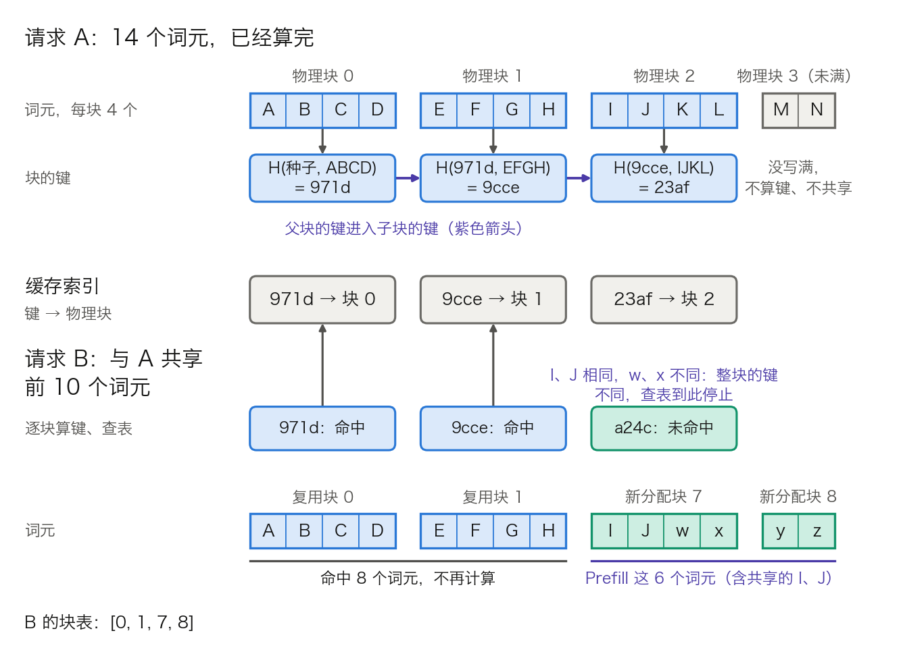
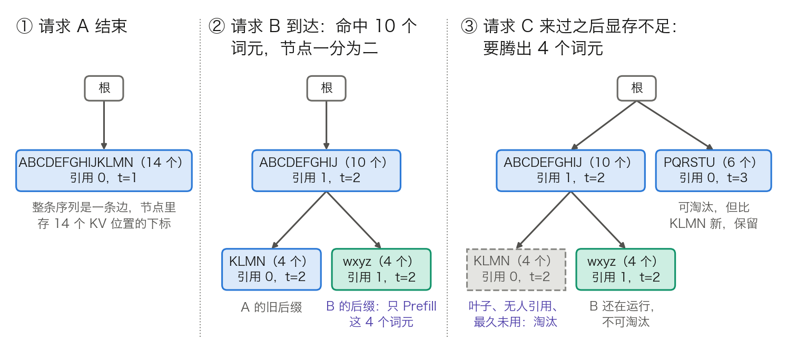

## 11.5 前缀复用：哈希块与前缀树

[11.4 节](11.4_kv_memory_management.md)的块表让两个请求可以指向同一个物理块，却没有回答另一半问题：引擎怎样知道两个请求的某一块内容相同。本节回答这个问题。先说明为什么只有前缀的 K/V 能跨请求复用，再讲两种索引结构，即按块链式哈希与前缀树；然后算命中能省多少 Prefill；最后讲调度、路由，以及哪些因素必须进入缓存的键。

前缀缓存的动机见 [10.2 节](../10_inference_optimization/10.2_kv_cache.md)，本节只讲它怎样实现、怎样算账。

### 11.5.1 能复用的只有前缀

**K/V 由什么决定。** 按 [3.8.4 节](../03_components/3.8_gpt_inference_flow.md)的第 4 步，因果掩码让位置 i 只读位置 1 到 i。第 1 层的 `kᵢ`、`vᵢ` 由第 i 个词元和它的位置算出。第 2 层的 `kᵢ`、`vᵢ` 由第 1 层位置 i 的输出算出，而这个输出已经混入位置 1 到 i 的内容。逐层类推，任何一层位置 i 的 K/V 都只是“前 i 个词元、它们的位置、模型权重”的函数，与位置 i 右边的内容无关。

由此得到复用的条件：两个请求的前 P 个词元逐个相同，这 P 个位置在全部 L 层的 K/V 就相同，可以共用一份。条件里的每一项都不能放松：

- 中间相同不算。同一篇文档出现在两个请求的不同偏移处，位置不同；即使偏移相同，只要左边的内容不同，第 2 层起的 K/V 就不同。
- 文本相同不算，词元相同才算。同一段文字经不同的聊天模板或不同的切分，得到的词元序列可以不同。
- 语义相近不算。向量相似只能用于结果缓存，不能证明 K/V 可复用。

采样参数不在条件里。温度、top-p、随机种子只作用于 logits 之后（见[第九章](../09_decoding/README.md)），不改变任何位置的 K/V。

**命中之后算什么。** 设命中 P 个词元，剩下的后缀有 S 个词元，`T = P + S`。Prefill 只对后缀做，形状介于完整 Prefill 与 Decode 之间。以 Llama 3 8B（表 3-16：`d_model = 4096`，`d_h = 128`）的一个头为例：

- 投影：`X[S, 4096] × W_Q[4096, 128] → Q[S, 128]`。K、V 同理，新算出的 S 行追加在缓存的 P 行之后。
- 打分：`Q[S, 128] × Kᵀ[128, P + S] → 分数[S, P + S]`，K 的前 P 行读自缓存。
- 读取：`权重[S, P + S] × V[P + S, 128] → context[S, 128]`。

`P = 0` 时退回完整 Prefill 的 `[T, T]`，`S = 1` 时退回 Decode 的 `[1, s]`。分块 Prefill 的第二块及以后（见 [11.3 节](11.3_scheduler_loop.md)）也是这个形状：两者都是“带着已有前缀做 Prefill”。

### 11.5.2 路线一：按块链式哈希

分页之后，K/V 以块为单位存放。最直接的做法是给每个写满的块算一个键，用哈希表记录“键 → 物理块”。vLLM 的[自动前缀缓存](https://docs.vllm.ai/en/latest/design/prefix_caching/)走这条路线。

**键怎样构造。** 一个块可以复用，要求块内词元相同，并且它左边的全部词元也相同。若把左边的全部词元直接放进键，第 k 块要哈希 `k × B` 个词元（B 为块大小），整条序列合计 `O(T²/B)`。**链式哈希**（chained hash）改为把父块的键放进子块的键：

$$
h_k = H\big(h_{k-1},\ \text{第 } k \text{ 块的 } B \text{ 个词元},\ \text{额外键}\big),\qquad h_{-1}=\text{固定种子}
$$

块从 0 编号。忽略哈希碰撞，`h_k` 相同等价于第 0 块到第 k 块的词元与额外键全部相同。每块只哈希 B 个词元和一个定长的父键，整条序列合计 `O(T)`。额外键放词元 ID 之外、又会改变 K/V 的因素，11.5.7 展开。

图 11-11：按块链式哈希怎样匹配前缀，教学设定为每块 4 个词元（[生成脚本](https://github.com/yeasy/llm_internals/blob/main/tools/figures/ch11_5_block_hash_chain.py)）。蓝色是已在缓存里的块，青绿色是本次新分配的块；键取 SHA-256 的前 4 位十六进制，仅作示意。

**一次查找的步骤。** 新请求到达后：

1. 把 Prompt 按 B 切块，从第 0 块起逐块算键。
2. 逐块查哈希表。命中则把该物理块的引用计数加 1，写进本请求的块表；遇到第一个未命中即停止，链式构造保证后面的块不可能再命中。
3. 为其余词元分配新块，只对它们做 Prefill。
4. 新块一写满就算键入表，同一批里的其他请求立刻可以复用。Decode 阶段写满的块同样入表，模型的输出因此也能成为后续请求的前缀。

图 11-11 中，请求 B 与 A 共享前 10 个词元。前两块命中 8 个词元；第 3 块里 I、J 相同而 w、x 不同，键不同，整块未命中。B 要 Prefill 6 个词元，其中 2 个本可复用。只有写满的块才有键，A 的最后一块只有 M、N 两个词元，不参与共享。按块哈希的命中长度总是 B 的整数倍，每个请求最多损失 `B − 1` 个词元。

**引用计数与淘汰。** 请求结束时，它的每个块引用计数减 1。减到 0 的块不清空，保留键，挂到空闲队列的尾部。这时它既是可分配的空闲块，又是可命中的缓存块。分配新块时从队首取；取到的块若还带着键，就从哈希表里删掉这个键，这一步就是淘汰。队首是最久未用的块，所以策略是 LRU（least recently used，最近最少使用）。再次命中的块会被移出空闲队列，免于淘汰。

同一请求的块按逆序入队，最后一块排在前面、先被淘汰。vLLM 文档给的理由是：越靠后的块，键里概括的词元越多，被别的请求命中的可能越小。从查找规则还能推出第二个理由：查找遇到第一个未命中就停，父块一旦被淘汰，子块即使还在也够不着，只是占着显存等淘汰。先淘汰尾部，就不会留下这种块。

**两个实现细节。** 其一，Prompt 整条命中时仍要重算最后一个词元。缓存里只有 K/V，没有最后位置的 logits，而首个输出词元要由它选出。vLLM 把可命中长度的上限设为 `T − 1`，再向下对齐到块边界：`T = 2000`、`B = 16` 时，上限 1,999 对齐为 1,984，最后一整块 16 个词元重算。其二，哈希碰撞的后果不在性能而在正确性与隐私：两个不同的前缀得到同一个键，后来者会读到别人的 K/V。vLLM 文档为此把默认哈希函数设为 SHA-256，并提醒换用更快的非密码学哈希会抬高碰撞风险，多租户环境下可能泄露信息。

### 11.5.3 路线二：前缀树（RadixAttention）

[SGLang 论文](https://arxiv.org/abs/2312.07104)提出的 **RadixAttention** 把全部缓存组织成一棵**基数树**（radix tree），即压缩的前缀树。普通前缀树每条边只带一个词元；基数树把没有分叉的一串边合并成一条，一条边可带任意长的词元序列，节点数只随分叉数增长。

**节点里存什么。** 每个节点对应一段词元，存这段词元、它们的 K/V 在显存池里的位置下标、引用计数和最近访问时间。从根走到某个节点，沿途的词元连起来就是一条已缓存的前缀。K/V 本身仍放在分页的显存池里；论文取页大小为 1 个词元，所以树可以在任意词元处分叉。

图 11-12：前缀树的匹配、拆分节点与从叶子淘汰，请求 A、B 与图 11-11 相同（[生成脚本](https://github.com/yeasy/llm_internals/blob/main/tools/figures/ch11_5_radix_tree_ops.py)）。每个节点第一行是这条边上的词元，第二行是引用计数与最近访问时刻 t；青绿色是本次新建的叶子，灰色虚框是被淘汰的节点。② 中 `KLMN` 的 t 也变成 2：匹配经过的节点在拆分前已刷新访问时刻，拆出的下半段沿用它。

**四个操作。** 图 11-12 画出了前三个。

- 匹配：从根出发，按下一个词元找子节点，沿边逐词元比较，走到不一致或 Prompt 用尽为止。走过的长度就是命中长度 P。
- 拆分：匹配若停在一条边的中间，把该节点拆成两段，上半段成为新的父节点，代表公共部分，下半段留作子节点。K/V 不搬动，只是下标数组一分为二。图中请求 B 在第 10 个词元之后与 A 分开，`ABCDEFGHIJKLMN` 被拆成 `ABCDEFGHIJ` 与 `KLMN`，B 命中 10 个词元，比按块哈希多 2 个。
- 插入：分两次。SGLang 的实现在 Prefill 完成后先把 Prompt 插入树，未命中的部分成为新叶子，运行中的请求因此也能被后到者命中。请求结束时再把输出补进同一条路径，多轮对话的下一轮因此能命中上一轮的输出。
- 淘汰：显存不足时，在引用计数为 0 的叶子里选最久未用的一个，释放它的 K/V。父节点若因此变成叶子且无人引用，就加入候选。重复到腾出足够空间。

**为什么从叶子淘汰。** 一个节点的 K/V 只有在祖先全部存在时才有用，先删中间节点会让整棵子树作废。从叶子删起，公共祖先留到最后，而系统提示、few-shot 示例这类公共祖先正是命中最多的部分。

**引用计数保护整条路径。** 运行中的请求要读它命中的全部 K/V，所以加引用时从命中的最深节点一路加到根，释放时同样一路减回去。图中 ③ 的 `wxyz` 与 `ABCDEFGHIJ` 引用计数都是 1，都不可淘汰。

**共用显存池。** 缓存与运行中的请求共用一个显存池，论文没有给缓存划固定配额。空闲时缓存尽量多留；等待的请求足够多时，缓存会被全部淘汰，换取更大的批。前缀缓存因此是拿闲置显存换计算，不挤占运行中请求的空间；代价是高负载时缓存留不住。

树放在 CPU 内存里。论文在没有任何复用机会的 ShareGPT 负载上测过开销：100 个请求共运行 74.3 秒，维护树的时间是 0.2 秒，不到 0.3%。

### 11.5.4 两条路线的取舍

表 11-15 从七个维度对比两条路线。

| 维度 | 按块链式哈希 | 前缀树 |
| --- | --- | --- |
| 索引结构 | 哈希表“键 → 物理块”；块的父子关系只隐含在键里 | 显式的树：父子指针，每个节点一段词元 |
| 命中粒度 | 块大小 B 的整数倍，每请求最多损失 `B − 1` 个词元 | 页大小为 1 时精确到词元；页更大时同样向下对齐 |
| 查找开销 | 逐块算哈希并查表，`O(T)` | 沿树逐词元比较，`O(T)` |
| 分叉 | 无需处理，分叉点所在的块整块未命中 | 拆分节点 |
| 淘汰 | 取空闲队列队首；靠逆序入队近似“先叶子” | 显式地只淘汰叶子 |
| 调度器能看到什么 | 某个请求命中了几块 | 整棵树：各等待请求的命中长度、哪些请求在同一分支上 |
| 跨进程使用 | 键是定长摘要，可直接当作外部索引的键 | 要同步树结构，或维护一棵近似的副本 |

表 11-15：两种前缀索引的对比。

两者不是对立的算法，而是同一件事的两种索引：K/V 都放在分页的显存池里，都靠引用计数防止误删，默认都用 LRU。差别在粒度，以及调度器能拿到多少信息。块哈希实现简单，与块表天然契合。前缀树在分叉多、分叉点不落在块边界的负载上命中更足，例如树状搜索、多层 few-shot、并行采样之后再追问；它还直接给出 11.5.6 的缓存感知调度所需的信息。SGLang 的实现也支持大于 1 的页大小，此时匹配长度向下对齐到页的整数倍，粒度上的差别随之消失。

### 11.5.5 算账：命中率与省下的 Prefill

**命中率**（cache hit rate）按 SGLang 论文的定义，是命中的 Prompt 词元数除以 Prompt 词元总数。它按词元计，不按请求计。

**算例一：共享系统提示。** 沿用 [11.2.4](11.2_continuous_batching.md) 的设定，补上完整的计算量与显存账。模型为 Llama 3 8B，权重与 K/V 均为 FP16。系统提示加共享文档共 2,010 个词元，对所有请求相同；用户输入 200 个词元；块大小 16（vLLM 的默认值，见 [11.4.2](11.4_kv_memory_management.md)）。

先算命中长度。`2010 ÷ 16 = 125` 余 10，前 125 块共 2,000 个词元命中。第 126 块里有 10 个共享词元和 6 个用户词元，键不同，未命中。于是 `P = 2000`，`S = 210`，命中率 `2000 ÷ 2210 = 90.5%`。前缀树按词元匹配，`P = 2010`，`S = 200`。

再算计算量，口径同 [3.8.7 节](../03_components/3.8_gpt_inference_flow.md)：`[a, b] × [b, c]` 记 `2abc` 次。配置取表 3-16：`n_kv = 8`，MLP 中间层 14,336，32 层，发布权重的词表 128,256 行。Llama 3 8B 用 GQA 和三个矩阵的 SwiGLU，每层与权重相乘的部分不再是 `24d²`，要按实际形状重数。每个词元、每层：

- Q 投影与 `W_O`：`[1, 4096] × [4096, 4096]`，各 `2 × 4096 × 4096` 次。
- K、V 投影：`[1, 4096] × [4096, 1024]`，各 `2 × 4096 × 1024` 次，其中 `1024 = 8 × 128`。
- MLP 的三个矩阵：各 `2 × 4096 × 14336` 次。

合计 `2 × 4096 × (4096 + 4096 + 2 × 1024 + 3 × 14336) = 2 × 4096 × 53,248`，约 4.36 亿次；32 层约 139.6 亿次，正是这些矩阵的参数量（约 69.8 亿）的 2 倍。打分与读取一项，后缀的第 i 个位置要对 `P + i` 行 K/V 各算一次。每行约 `4d` 次。打分 `q·k` 每头 `2 × 128` 次，32 个头合计 `2d`；读取同为 `2d`。两项合起来就是 3.8.7 中 Decode 的 `4sd` 每行的份额。S 个位置相加，每层约 `4dPS + 2dS²`。`P = 0` 时它退回 3.8.7 的 `2T²d`。表 11-16 列出三种情形的计算量。

| 项目 | 无缓存：`P = 0`，`S = 2210` | 按块哈希：`P = 2000`，`S = 210` | 前缀树：`P = 2010`，`S = 200` |
| --- | ---: | ---: | ---: |
| 与权重相乘，32 层 | 约 30.85 万亿次 | 约 2.93 万亿次 | 约 2.79 万亿次 |
| 打分与读取，32 层 | 约 1.28 万亿次 | 约 0.232 万亿次 | 约 0.221 万亿次 |
| LM head（只算最后一行） | 约 10.5 亿次 | 约 10.5 亿次 | 约 10.5 亿次 |
| 合计 | 约 32.1 万亿次 | 约 3.16 万亿次 | 约 3.01 万亿次 |
| 相对无缓存 | 100% | 9.8% | 9.4% |

表 11-16：Llama 3 8B 在 2,210 个词元的 Prompt 上，命中与未命中的 Prefill 计算量。第一行是 `139.6 亿 × S`；第二行是 `(4dPS + 2dS²) × 32`，例如中间一列为 `(4 × 4096 × 2000 × 210 + 2 × 4096 × 210²) × 32`；LM head 为 `2 × 4096 × 128,256`。

从表中读出三件事。

第一，与权重相乘的部分严格按 `S ÷ T` 缩小，`210 ÷ 2210 = 9.5%`。

第二，打分与读取只降到 18%。省掉的是前缀自己的 `[P, P]` 那块三角；后缀读前缀的 `4dPS` 一项省不掉，中间一列里它占 0.220 万亿次。令 `4dP` 等于每词元每层与权重相乘的 `2 × 4096 × 53,248`，得 `P = 26,624`。前缀超过约 2.7 万个词元后，后缀每个词元读前缀的开销就超过它过一遍权重的开销。长文档问答的命中收益因此低于按词元比例估计的值。

第三，换算成时间要看瓶颈。Prefill 受算力限制（3.8.7 的瓶颈一），时间近似与计算量成正比。按 [10.1 节](../10_inference_optimization/10.1_bottleneck.md)的 H100 峰值 990 TFLOPs/s，并假设利用率为 40%（示意值），有效算力为 `990 × 0.4 = 396` 万亿次/秒。无缓存约 `32.1 万亿 ÷ 396 万亿/秒 ≈ 81 ms`，命中后约 `3.16 万亿 ÷ 396 万亿/秒 ≈ 8 ms`，省下约 73 ms。这个比例不能继续外推。权重约 16 GB（约 80 亿参数 × 2 字节），命中后每字节只有 `3.16 万亿 ÷ 16 GB ≈ 200` 次运算，已低于 10.1 节 295 的拐点。时间不再随 S 按比例缩短，下界是读一遍权重的 `16 GB ÷ 3.35 TB/s ≈ 5 ms`。实际系统里这 210 个词元会与别的请求合成一批。TTFT（首词元延迟，分解见 [11.13.1](11.13_best_practices.md)）中的排队、分词和网络几项不受影响。

**显存那一笔。** Llama 3 8B 每个词元的 K/V 是 `2 × 8 × 128 × 32 = 65,536` 个数（3.8.7），FP16 下 128 KiB，2,000 个词元的前缀约 250 MiB。100 个并发请求各存一份，合计 `100 × 2210 × 128 KiB`，约 27.0 GiB；共享前缀后是 `(2000 + 100 × 210) × 128 KiB`，约 2.8 GiB。省下的显存可以装更多请求，批变大，Decode 的吞吐随之上升（3.8.7 的瓶颈二）。共享只减少容量占用：标准内核下每轮 Decode 仍要为每个请求各读一遍前缀的 K/V，读取量不变。共享前缀专用的内核能把这部分读取合并，属例外，例如 vLLM 默认关闭的 cascade attention。

**算例二：多轮对话。** 系统提示 1,000 个词元，每轮用户输入 100 个、模型输出 300 个，共 10 轮。忽略模板词元、块对齐，以及每轮末个输出词元（它被采样出来后没有再进模型，尚无 K/V）。第 k 轮的 Prompt 长 `1000 + 400(k − 1) + 100`。无缓存时十轮合计 Prefill `10 × 1100 + 400 × (0 + 1 + … + 9) = 11,000 + 18,000 = 29,000` 个词元，随轮数按平方增长。有缓存且这条会话的 K/V 没被淘汰时，首轮 1,100 个，其后每轮只有新输入的 100 个。合计 `1100 + 9 × 100 = 2,000` 个，命中率 `27,000 ÷ 29,000 = 93.1%`。上一轮的输出不需要 Prefill，它的 K/V 在 Decode 时已经写好。代价是会话空闲期间占着显存：第 10 轮结束时这条会话有 5,000 个词元，约 625 MiB；用户迟迟不回复，它就成为 LRU 的淘汰对象。

**其余场景。** 以下几类都是这两种模式的组合。

- few-shot 与批量评测：1,500 个词元的示例加 100 个词元的题目，1,000 道题。Prefill 从 160 万个词元降到 `1500 + 1000 × 100 = 101,500` 个，命中率 93.7%。SGLang 论文在 MMLU 上复用 5-shot 示例；HellaSwag 上示例是第一层共享，同一道题的多个选项共享题干，是第二层。
- 智能体：每一步把工具返回追加到历史后重新请求，等同于轮数为几十的多轮对话。系统提示与工具定义是各轨迹共享的第一层，单条轨迹的历史是第二层。
- 并行采样与树状搜索：同一个 Prompt 分出多条分支，与 11.4 节的写时复制是同一份共享；有了前缀索引，不同时刻到达的请求也能自动共享。

线上的命中率低于这些理想值。SGLang 论文给出在 Chatbot Arena 部署一个月的数据：LLaVA-Next-34B 的命中率为 52.4%，Vicuna-33B 为 74.1%。后者的首词元延迟平均缩短为原来的 1/1.7。

### 11.5.6 缓存感知调度与路由

**实例内：先跑谁。** 缓存容量有限时，执行顺序决定命中率。两组前缀不同的请求若交替执行，而显存只够留一组的前缀，每次切换都要淘汰再重算，论文称之为缓存抖动（cache thrashing）。SGLang 论文的调度器先让等待队列里的每个请求各做一次匹配，再按命中长度从长到短排序。这个顺序称为最长共享前缀优先（longest-shared-prefix-first）。实现里对应 `lpm` 策略，默认并非此项（见 [11.11.4](11.11_sglang_internals.md)）。论文证明：离线批处理、缓存不小于最长请求时，这个顺序等价于对这批请求构成的前缀树做深度优先遍历，命中率最优。在线场景下它只是近似。论文的各基准上，实际命中率平均为最优值的 96%。代价是公平性：前缀冷门的请求可能一直排在后面，论文把防饥饿留作后续工作。与先来先服务相比，这是拿尾延迟换吞吐；调度策略的一般讨论见 [11.3 节](11.3_scheduler_loop.md)。

**实例间：送到哪。** 缓存是每个实例私有的。N 个副本轮询分发时，会话的下一轮落回同一实例的概率只有 `1/N`，8 个副本时是 12.5%（同 [11.2.6](11.2_continuous_batching.md) 的算例），算例二的 93% 无从谈起。**缓存感知路由**（cache-aware routing）让网关按前缀亲和性选实例。以 SGLang 网关的 `cache_aware` 策略为例：

1. 网关为每个实例维护一棵近似前缀树，只根据自己转发过的请求更新，不查询实例的真实缓存。树里存原始字符而不是词元，省掉分词。
2. 新请求到达，求它与各实例的树的匹配比例。最高比例超过阈值，送往该实例；否则送往树最小的实例，那里空余的缓存最多。
3. 同时监视各实例的待处理请求数。最大值与最小值之差超过绝对阈值，且最大值超过最小值的给定倍数时，判定负载失衡，改按最短队列分发，不再看前缀。
4. 后台定期按 LRU 淘汰近似树的叶子，限制树的大小。

第 3 步针对亲和与均衡的冲突：所有请求共享同一段系统提示时，只看前缀会把流量全压到一个实例上。取舍可以估算：亲和值得，当且仅当省下的 Prefill 时间大于在目标实例上多排的队。算例一省下约 73 ms，目标实例前面多一个长 Prefill 就抵消了。前缀越长，亲和越值得；系统提示这类短而普遍的前缀，每个实例很快各存一份，无需亲和。

近似索引还有第二种失效：网关的树与实例的真实缓存不一致。实例因显存压力淘汰了某段前缀，网关并不知道，请求仍被送来，既未命中又多排了队。SGLang 论文的数据并行方案让实例把淘汰事件异步回报给路由器，属于弱一致；[Preble](https://arxiv.org/abs/2407.00023) 则把 K/V 复用与负载均衡放进同一个调度目标里联合优化。

### 11.5.7 键里放什么：失效与隔离

11.5.1 的结论是：凡影响 K/V 的因素都必须进键，不影响的不应进键。表 11-17 逐项对照。

| 因素 | 是否进键 | 原因与做法 |
| --- | --- | --- |
| 词元 ID 及其顺序 | 是 | K/V 的直接输入；链式哈希与树的路径都保证顺序和位置一致 |
| 采样参数（温度、top-p、种子、最大长度） | 否 | 只作用于 logits 之后；放进键只会无谓地降低命中率 |
| LoRA 适配器 | 是 | 适配器改动它所挂接的投影矩阵（见 [8.4 节](../08_alignment/8.4_peft.md)、[11.6 节](11.6_multi_lora_serving.md)），同样的词元算出不同的 K/V。vLLM 把适配器名放进额外键；SGLang 的树用一个命名空间键把不同适配器的分支隔开 |
| 多模态输入 | 是，用内容哈希 | 图像在词元序列里只是一串相同的占位词元，真正的输入是编码器给出的嵌入。vLLM 把图像哈希放进含占位符的各块的额外键；SGLang 论文同样以图像哈希作树的键 |
| 租户或信任域 | 视部署而定 | 见下文“隔离” |
| 模型、精度与并行切分 | 实例内隐含 | 一个引擎实例只服务一份权重。K/V 一旦存到实例之外（见 [11.9 节](11.9_disaggregated_serving.md)），这些也要进键 |

表 11-17：哪些因素进入前缀缓存的键。

**隔离。** 共享缓存会泄露“某段前缀是否已有人问过”：命中时 TTFT 明显变短，攻击者可以据此逐段试探别人的 Prompt。vLLM 允许请求携带 `cache_salt`，盐进入第 0 块的键；链式构造使其后所有块的键随之改变，只有同盐的请求互相命中。缓存因此可以在一个信任域内共享，在域之间隔离，代价是跨域的公共前缀各存一份。

**常见误解与失效情形。**

- 命中不加速 Decode。省掉的只是 Prefill，每轮 Decode 仍要读全部 K/V，TPOT（每输出词元时间）不变。收益体现在 TTFT，以及共享省下的显存换来的更大批。
- Prompt 开头的可变内容让命中率归零。时间戳、请求 ID、顺序不固定的工具列表若放在最前面，第 0 块的键就变了，其后全部失效。稳定的内容放前面，变化的放后面。
- 重新分词可能破坏多轮命中。客户端把上一轮输出的文本拼回 Prompt 再分词，得到的词元未必等于模型当时生成的词元；从第一个不一致处起，其后全部未命中。
- 需要 Prompt 各位置输出的请求不能命中。例如要求返回 Prompt 的对数概率时，vLLM 跳过缓存查找：缓存里只有 K/V，没有那些位置的 logits。
- 命中率不是单一的优化目标。为命中而重排队列会造成饥饿，为亲和而集中路由会造成热点，高负载时缓存还要让位给运行中的请求。

两个引擎里对应的模块与启动参数见 [11.10 节](11.10_vllm_internals.md)和 [11.11 节](11.11_sglang_internals.md)，Prompt 排布原则见 [10.2.5](../10_inference_optimization/10.2_kv_cache.md)，命中率等监控指标见 [11.13.7](11.13_best_practices.md)。
