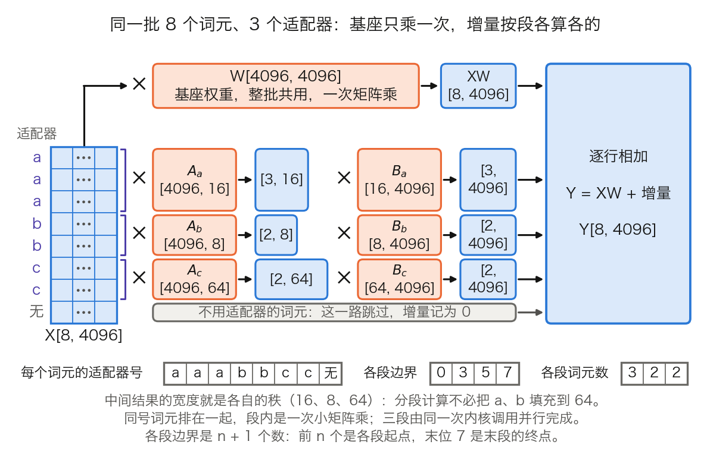
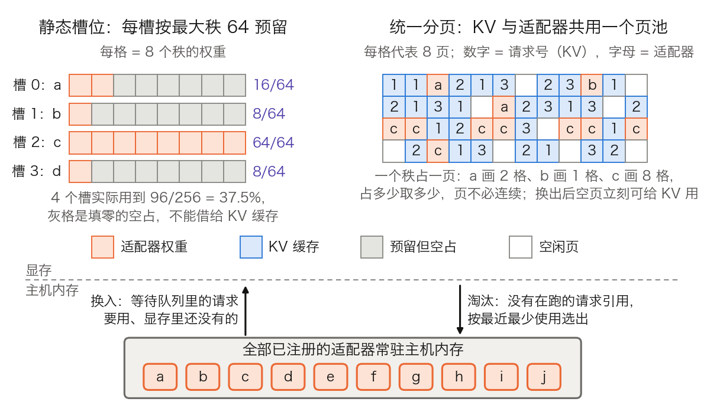

## 11.6 多 LoRA 服务：一份基础权重，许多适配器

11.2 到 11.5 都默认一台引擎只服务一个模型。微调打破了这个前提：同一个基座按租户、任务、语言各训练一个 LoRA 适配器（adapter），上线时面对的是几十到几千个“模型”，其中多数流量稀疏。本节回答三个问题：这些适配器为什么不能像单模型部署那样合并进权重；不合并时每层多算什么，同一批里的不同适配器怎样一起算；适配器本身的显存怎样管理。LoRA 的原理见 [8.4 节](../08_alignment/8.4_peft.md)，这里只用它的形状。

算例沿用 [3.8 节](../03_components/3.8_gpt_inference_flow.md)的口径：Llama 3 8B（`d_model = 4096`，32 层，`n_kv = 8`，MLP 中间层 14,336），FP16 每个数 2 字节，一次 `[a, b] × [b, c]` 的矩阵乘记 `2abc` 次浮点运算。基座共 8,030,261,248 个参数，FP16 下 16.06 GB，推导见 [11.4.1](11.4_kv_memory_management.md)；词表按发布权重的 128,256 行计。

### 11.6.1 适配器有多大，为什么不能合并

**记号。** 本书按行向量书写，线性层是 `x[1, d_in] × W[d_in, d_out] → y[1, d_out]`。LoRA 给 `W` 加一个低秩增量：

$$
y = xW + xAB,\qquad A\in\mathbb{R}^{d_{in}\times r},\quad B\in\mathbb{R}^{r\times d_{out}}
$$

8.4 节按列向量写作 $$W_0 + \frac{\alpha}{r}BA$$，两种写法互为转置，`A` 都是降到 `r` 维的那一个。缩放系数 $$\alpha/r$$ 是常数，加载时可以一次乘进 `B`，推理时不再出现。

**适配器的大小。** 一个投影上的适配器有 `r × (d_in + d_out)` 个数。表 11-18 列出 Llama 3 8B 一层里的七个线性投影。

| 投影 | `W` 的形状 | `d_in + d_out` | 基座每词元 FLOPs | `r = 16` 的增量 FLOPs | 比值 |
| --- | --- | ---: | ---: | ---: | ---: |
| `W_Q`、`W_O` | `[4096, 4096]` | 8,192 | 33,554,432 | 262,144 | 0.78% |
| `W_K`、`W_V` | `[4096, 1024]` | 5,120 | 8,388,608 | 163,840 | 1.95% |
| `W_gate`、`W_up` | `[4096, 14336]` | 18,432 | 117,440,512 | 589,824 | 0.50% |
| `W_down` | `[14336, 4096]` | 18,432 | 117,440,512 | 589,824 | 0.50% |
| 一层合计（七个） | 218,103,808 个数 | 81,920 | 436,207,616 | 2,621,440 | 0.60% |

表 11-18：Llama 3 8B 一层七个线性投影上的 LoRA 开销。`W_Q` 等是各头打包后的形状（见 3.8.6 的表 3-25）；FLOPs 两列在 11.6.2 用到。

七个投影的 `d_in + d_out` 之和是 `2 × 8,192 + 2 × 5,120 + 3 × 18,432 = 81,920`。取 `r = 16` 并覆盖全部七个投影，一层是 `16 × 81,920 = 1,310,720` 个数，32 层共 41,943,040 个，FP16 下 83.9 MB，是基座 80.3 亿参数的 0.52%。同一口径下 `r = 8` 是 41.9 MB，`r = 64` 是 335.5 MB；只加在 `W_Q`、`W_V` 上的 `r = 16` 适配器只有 13.6 MB。

**合并的代价之一：副本。** 合并指离线算出 `W' = W + AB`，得到一个与基座同形状的新权重，推理时没有额外开销。单个适配器这样做最好。N 个适配器各自合并，就是 N 份完整权重。Llama 3 8B 一份 16.06 GB，80 GB 的显存最多放 4 份，合 64.2 GB，剩下不到 16 GB 给 KV 缓存。第 5 个适配器就要另加一张卡。不合并时只存一份基座，N 个适配器另占 `N × 83.9 MB`：100 个共 8.4 GB，连同基座 24.5 GB。

**合并的代价之二：批拆散了。** 3.8.7 指出 Decode 每生成一个词元都要把权重完整读一遍，却只算一行，批处理靠多个请求共用同一遍权重读取来摊薄它。合并之后，不同适配器的请求面对的是不同的 `W'`，`X × W'` 无法共用，批只能按适配器拆开。[LoRA 论文](https://arxiv.org/abs/2106.09685)在局限一段里写明了这一点：把 `A`、`B` 吸收进 `W` 之后，不同任务的输入难以在一次前向里组成一批。

**边用边换也不行。** 论文给过一个折中：只留一份权重，切换任务时减去旧的 `AB`、加上新的。32 层线性权重共 `32 × 218,103,808 × 2 B = 13.96 GB`，每层的参数个数见表 11-18 合计行。切换一次要读一遍再写一遍，访存 27.9 GB。按 [10.1 节](../10_inference_optimization/10.1_bottleneck.md)的 H100 显存带宽 3.35 TB/s，至少 8.3 毫秒。一个投影的 `A[d_in, 16] × B[16, d_out]` 是 `2 × 16 × d_in × d_out` 次运算。七个投影、32 层相加，一个适配器的全部 `AB` 需 `2 × 16 × 218,103,808 × 32 ≈ 2,230 亿`次。新旧各算一次也不到 4,500 亿次，不是主要开销。真正的问题是同一时刻只有一个适配器在位，其余适配器的请求只能排队，批依然凑不大。[S-LoRA](https://arxiv.org/abs/2311.03285) 的消融实验印证了这一点：只有一个适配器时合并更快，超过两个之后因频繁切换而落后于不合并的方案。

由此得到判据：流量集中在一两个适配器上，就合并后独占实例；适配器多而流量分散，就保持不合并，让所有请求共用基座的那一次大矩阵乘。

### 11.6.2 不合并时，一层多出两次小矩阵乘

不合并时从不真正算出 `AB`。`A × B` 的结果是 `[d_in, d_out]` 的满尺寸矩阵，算它等于做了一次合并。实际的顺序是先降维、再升维，中间结果只有 `r` 列：

- 基座：`x[1, 4096] × W_Q[4096, 4096] → [1, 4096]`
- 降维：`x[1, 4096] × A[4096, 16] → v[1, 16]`
- 升维：`v[1, 16] × B[16, 4096] → [1, 4096]`，与基座结果逐格相加

GPT-3 Small 上同理：`x[1, 768] × A[768, 8] → v[1, 8]`，再 `× B[8, 768] → [1, 768]`。

**FLOPs。** 以 `W_Q`、`r = 16` 为例，降维是 `2 × 4,096 × 16 = 131,072` 次，升维同样是 131,072 次，合计 262,144 次。基座是 `2 × 4,096 × 4,096 = 33,554,432` 次，增量占 0.78%。表 11-18 的后三列对七个投影逐一算出：一层合计 2,621,440 次，对基座的 436,207,616 次，占 0.60%。参数量与 FLOPs 都正比于 `r × (d_in + d_out)`，所以这个比例与参数占比同一量级。

**0.6% 不是延迟开销。** FLOPs 低估了实际代价，原因有两条。第一，每个投影多出降维、升维两次内核调用，7 个投影、32 层，一步 Decode 多出 `7 × 32 × 2 = 448` 次内核启动（推算值，非实测），启动开销与矩阵大小无关。把 Q/K/V、gate/up 打包成一次调用的实现能减少这个数，但量级不变。第二，这些小矩阵乘每读 1 字节只做约 1 次运算（11.6.4 给出算式），与 Decode 的大矩阵乘一样卡在显存带宽上。[Punica](https://arxiv.org/abs/2310.18547) 在单张 A100 上做了实测，批大小上限 32。带 `r = 16` 适配器的 Llama 2 7B 在各种负载下都是 1,044 词元/秒；只跑基座的 vLLM 在单适配器负载下是 1,140 词元/秒，相差约 8%。13B 上是 693 对 789，约 12%。两个数出自不同系统，不全是 LoRA 的开销，但量级足以说明：多 LoRA 的代价是百分之几到十几，不是千分之六。

### 11.6.3 同一批里的不同适配器：按段分别算

[11.3 节](11.3_scheduler_loop.md)的调度器每步交出一批词元 `X[B, d_in]`，每行可能属于不同的适配器。基座一路照旧：`X[B, d_in] × W[d_in, d_out]`，一次大矩阵乘，全批共用。难点在增量一路，每行要乘的 `A`、`B` 不同，秩也可能不同。三种直接的做法各有缺陷：

- **逐个适配器循环。** 每个适配器挑出自己的行，单独调用一次矩阵乘。批里有 n 个适配器，内核启动次数就乘以 n；每个适配器一行时退化为 n 次批大小 1。
- **先聚合再批量矩阵乘。** 按行把各自的 `A` 复制进一个 `[B, d_in, r]` 的连续张量，再调用通用的批量矩阵乘（BMM）。Punica 的分析指出，复制与重读使这种做法比直接读原地权重多出 `2 × B × d_in × r` 个数的访存，而这一路本来就卡在访存上。
- **填充到最大秩。** 通用 BMM 要求各行的矩阵同形状，秩不同就得补零到最大秩，11.6.6 给出它的代价。

Punica 的做法是写一个专用内核，称为 **SGMV**（Segmented Gather Matrix-Vector Multiplication，分段聚合矩阵向量乘）。它分三步：

1. **排序。** 把同一适配器的词元排到相邻位置，批被切成若干段，每段对应一个适配器。
2. **建索引。** 记下各段的起点。索引每步只建一次，供全部 32 层、每层 7 个投影复用。
3. **一次启动，各段并行。** 内核按段号找到该段适配器权重的显存地址，原地读取，不做复制；段内是一次 `[段长, d_in] × A[d_in, r]` 的小矩阵乘。降维（shrink）与升维（expand）各启动一次，两者的输入输出宽窄相反，线程划分方式不同。

图 11-13 画出一个 8 个词元的 Decode 批：3 个词元用适配器 a（`r = 16`），2 个用 b（`r = 8`），2 个用 c（`r = 64`），1 个不用适配器。

图 11-13：同一批 8 个词元、3 个适配器的一次线性投影，形状按 Llama 3 8B 的 `W_Q` 标注（[生成脚本](https://github.com/yeasy/llm_internals/blob/main/tools/figures/ch11_6_segmented_lora_batch.py)）。橙色是权重，蓝色是数据；基座一路对整批只乘一次，增量一路按段计算，各段中间结果的列数等于各自的秩。底部的“各段边界”是 n + 1 个数，末位 7 是末段的终点。

图中三段的中间结果分别是 `[3, 16]`、`[2, 8]`、`[2, 64]`，没有任何一段被填充到 64。不用适配器的词元不进入增量一路。

**Prefill 与 Decode 混在一批里。** 分段的单位是词元而不是请求。一个 Decode 请求贡献 1 行；一个正在 Prefill 的请求贡献一整段，段长等于本步分给它的词元数，段内是真正的矩阵乘矩阵。S-LoRA 为此准备了两个内核：Prefill 用 MBGMM（Multi-size Batched Gather Matrix-Matrix Multiplication），Decode 用 MBGMV（矩阵乘向量）。名字里的 Multi-size 指同一批内秩可以不同。

**对到实现。** vLLM v0.29.0 的 [`LoRAKernelMeta`](https://github.com/vllm-project/vllm/blob/v0.29.0/vllm/lora/ops/triton_ops/lora_kernel_metadata.py) 保存的正是图 11-13 底部的几张索引。`token_lora_mapping` 是每个词元的适配器号，`num_tokens_per_lora` 是各段词元数，`lora_token_start_loc` 是它带前导 0 的前缀和，即各段边界。vLLM 不搬动词元，而是用 `token_indices_sorted_by_lora_ids` 记下排序后的行号，内核据此间接取行。降维与升维对应同一目录下的 `lora_shrink_op.py` 与 `lora_expand_op.py`，由 `vllm/lora/punica_wrapper/` 封装后供各线性层调用。

### 11.6.4 批处理的收益为何还在

混批是否划算，用 3.8.7 的方法算：每从显存读 1 字节，做多少次浮点运算。场景是 Llama 3 8B 的一步 Decode，每个请求的上下文里已有 1,000 个词元，适配器取 `r = 16`、覆盖七个投影。

每个词元的计算量有三项。第一项是与权重相乘：32 层线性层 `32 × 436,207,616`（表 11-18 合计行）加 LM head `2 × 4,096 × 128,256`，约 150.1 亿次。Llama 的 MLP 有三个矩阵，这里不能套 3.8.7 的 `24d²`。第二项是打分与读取，`4 × 1,000 × 4,096 × 32`，约 5.2 亿次。第三项是 LoRA 增量，`2 × 41,943,040`，约 0.84 亿次。要读的字节也有三项：权重 16.06 GB，全批一份；KV 缓存每个词元 131,072 字节（3.8.7 的 65,536 个数），每个请求 131 MB；适配器每个 83.9 MB，批里出现几个就读几个。表 11-19 按这两组量列出七种情形。

| 情形 | 计算量 | 要读的字节 | 每字节运算次数 | H100 带宽下界 |
| --- | ---: | ---: | ---: | ---: |
| 批 1，无适配器 | 155 亿 | 16.19 GB | 0.96 | 4.8 ms |
| 批 1，一个适配器 | 156 亿 | 16.28 GB | 0.96 | 4.9 ms |
| 批 32，无适配器 | 4,971 亿 | 20.25 GB | 24.5 | 6.0 ms |
| 批 32，同一个适配器 | 4,998 亿 | 20.34 GB | 24.6 | 6.1 ms |
| 批 32，8 个适配器各 4 条 | 4,998 亿 | 20.93 GB | 23.9 | 6.2 ms |
| 批 32，32 个不同适配器 | 4,998 亿 | 22.94 GB | 21.8 | 6.8 ms |
| 不混批：32 个适配器各跑批 1，共 32 步 | 4,998 亿 | 520.8 GB | 0.96 | 155 ms |

表 11-19：Llama 3 8B 一步 Decode 的访存账。“带宽下界”是要读的字节除以 3.35 TB/s，只反映显存带宽这一项。第六行的 22.94 GB 由权重 16.061 GB、KV 缓存 `32 × 131.072 MB = 4.194 GB`、适配器 `32 × 83.886 MB = 2.684 GB` 相加得到，`16.061 + 4.194 + 2.684 = 22.939`。“每字节运算次数”是计算量除以要读的字节。

最坏的情形是 32 个请求各用各的适配器。此时适配器一共多读 2.68 GB，每字节运算次数从 24.5 降到 21.8，损失约 11%。对照组是最后一行：不能混批时，每个适配器只能以批大小 1 运行，凑齐同样的 32 个词元要把权重读 32 遍，访存是混批的 22.7 倍。批处理的收益来自共用那 16.06 GB 的基座权重，适配器只占其中一小块，所以收益基本保住。

**增量一路自身的算术强度。** Punica 给出了 SGMV 的账。设批里共 `s_n` 个词元、`n` 个不同的适配器，权重形状 `[h_i, h_o]`：

$$
\text{FLOPs} = 2\,s_n h_i h_o,\qquad \text{访存字节} = 2\left[s_n (h_i + h_o) + n\,h_i h_o\right]
$$

方括号里前一项是输入与输出，后一项是读到的权重。代入降维的 `h_i = 4096`、`h_o = 16`、`s_n = 32`：计算量恒为 4,194,304 次。32 个适配器各不相同时访存 4,457,472 字节，每字节 0.94 次；8 个适配器时 3.20 次；全批同一个适配器时 394,240 字节，10.64 次。结论是：适配器越集中，增量一路越接近普通的批量矩阵乘；各不相同时，加大批并不提高这一路的算术强度，但它的绝对访存量小，拖不动全局。

这个式子还给出一个上限。段长趋于无穷时权重一项可以忽略，每字节运算次数趋于 `h_i h_o / (h_i + h_o)`；`r` 远小于 `d` 时约等于 `r`。`r = 16` 的降维上限是 `4096 × 16 ÷ 4112 ≈ 15.9`；代入一段 1,000 个词元的 Prefill，得 15.7。两者都远低于 10.1 节给出的 H100 拐点 295。低秩矩阵乘的输入输出与计算量同阶，增量一路即使在 Prefill 里也卡在访存上。这是它的实际开销高于 FLOPs 占比的根本原因。

### 11.6.5 适配器的显存：槽位、分页与换入换出

适配器数量可以远多于显存装得下的数量，因此分三级存放：全部适配器在磁盘或对象存储里，已注册的常驻主机内存，只有当前批用到的在显存里。S-LoRA 据此指出，可服务的适配器总数受主机内存限制，而不受显存限制。64 GB 主机内存放得下 762 个上述 83.9 MB 的适配器。

**换入很便宜。** PCIe 4.0 x16 的单向带宽按规范标称值是 `16 GT/s × 16 × 128/130 ÷ 8 ≈ 31.5 GB/s`。取 Gen4 是为了与 Punica 的 A100 实测对照；[11.4 节](11.4_kv_memory_management.md)用的 32 GB/s 是未扣编码开销的标称值，H100 的 Gen5 再翻一倍。83.9 MB 的适配器传 2.7 毫秒，不到一步 Decode；`r = 64` 的 335.5 MB 传 10.6 毫秒。Punica 给出的量级相同：PCIe Gen4 x16 上加载一层约 50 微秒，整个适配器约 2 毫秒。相比之下，整份基座 16.06 GB 要传 0.51 秒，还不算从磁盘读出的时间。因此多 LoRA 系统的冷启动只是一次小拷贝。Punica 的做法是：新请求的适配器不在显存里时，发起一次异步的主机到设备拷贝，当前批照常计算，这一步算完时拷贝也已结束，新请求自然并入下一批。S-LoRA 更进一步，在算当前批时按等待队列预测下一批要用的适配器，提前取来。

**显存里怎么放，有两种设计。** 图 11-14 把两者并排画出。

图 11-14：适配器权重在显存里的两种放法（[生成脚本](https://github.com/yeasy/llm_internals/blob/main/tools/figures/ch11_6_adapter_memory.py)）。左：静态槽位按最大秩预留，灰格是填零的空占。右：统一分页，适配器与 KV 缓存从同一个页池取页。下：全部适配器常驻主机内存，按需换入，不被引用时淘汰。为便于画出，右图每格代表 8 页，S-LoRA 实际是一个秩一页。

**静态槽位。** 启动时为每个加了 LoRA 的线性层预分配固定形状的张量，每个槽放一个适配器。vLLM v0.29.0 的 [`create_lora_weights`](https://github.com/vllm-project/vllm/blob/v0.29.0/vllm/lora/layers/base_linear.py) 为每层分配两组全零张量，打包层（`qkv_proj`、`gate_up_proj`）每个切片一份。`lora_a_stacked` 的形状是 `[max_loras, 1, max_lora_rank, d_in]`，`lora_b_stacked` 是 `[max_loras, 1, d_out, max_lora_rank]`。`set_lora` 把适配器的 `A`、`B` 拷进某个槽的左上角。vLLM 按“输出 × 输入”存放，行列与本书相反。这种设计的好处是形状固定：内核只需要“基地址加槽号”，地址和形状不随请求变化，便于配合 CUDA Graph 这类要求静态形状的机制。代价是 11.6.6 要算的空占。

**统一分页。** S-LoRA 注意到适配器权重与 KV 缓存很像：大小各异，随请求到来而分配、离开而释放，并且有一维同为隐藏宽度 `H`。它把 [11.4 节](11.4_kv_memory_management.md)的分页推广为 Unified Paging：除基座权重与临时张量外，剩余显存是一个页池，每页存一个 `H` 维向量。长度为 `S` 的 KV 张量占 `S` 页，秩为 `R` 的 LoRA 矩阵占 `R` 页，两者交错存放、不要求连续。按这个口径算一个例子：`H = 4096` 的多头注意力模型（形状同 GPT-3 6.7B），一页 8,192 字节。`r = 16`、加在 `W_Q`、`W_K`、`W_V`、`W_O` 上的适配器，每层 `4 × 2 × 16 = 128` 页，32 层 4,096 页，合 33.6 MB。同一模型里一个词元的 KV 是每层 K、V 各一页，共 64 页。这个适配器换出后腾出的页，正好够 64 个词元的 KV 用。代价在内核一侧：权重不再连续，内核要按页表逐页取数，这正是 MBGMM、MBGMV 名字里 Gather 的含义。

**调度约束。** 同一批里能出现的适配器个数有上限。vLLM 的[调度器](https://github.com/vllm-project/vllm/blob/v0.29.0/vllm/v1/core/sched/scheduler.py)在接纳等待请求时检查：批里已有 `max_loras` 个不同的适配器、而新请求用的是另一个时，跳过它。后果是冷门适配器的请求可能被热门适配器挡在队列里，首词元延迟变长。调大 `max_loras` 可以缓解，代价是槽位显存：一个 `r = 16`、覆盖七个投影的槽是 83.9 MB，折合 `83,886,080 ÷ 131,072 = 640` 个词元的 KV 缓存。另一条路是在路由层把用同一批适配器的请求送到同一实例，让每个实例面对的适配器集合变小。

**淘汰。** 有正在运行的请求引用的适配器不能换出；其余的按最近最少使用（LRU）淘汰。vLLM 用两级 LRU：`max_loras` 是显存槽位数，`max_cpu_loras` 是主机内存里保留的适配器数，后者不得小于前者。

### 11.6.6 秩不同、目标模块不同：填充的代价

真实负载里的适配器并不整齐：秩从 8 到 64 甚至更大，有的只加在 `W_Q`、`W_V` 上，有的覆盖全部线性层。凡是要求“同形状”的实现，都要为这种不整齐付出填充。

**秩不同。** 设一批 32 个请求，24 个用 `r = 8`，6 个用 `r = 16`，2 个用 `r = 64`。有用的秩总和是 `24 × 8 + 6 × 16 + 2 × 64 = 416`；全部填充到 64 后是 `32 × 64 = 2,048`。有效计算只占 20.3%，实际计算量是有用部分的 4.9 倍。显存一侧按秩算：一个秩在七个投影、32 层上是 `81,920 × 32 × 2 B = 5,242,880 B`，恰为 `5,242,880 ÷ 131,072 = 40` 个词元的 KV 缓存。32 个槽按 `r = 64` 预留，共 2,048 个秩，`2,048 × 5,242,880 B = 10.74 GB`；实际权重是 `416 × 5,242,880 B ≈ 2.18 GB`。空占的秩是 `2,048 − 416 = 1,632`，合 8.56 GB，折合 `1,632 × 40 = 65,280` 个词元的 KV 缓存。按每请求 1,000 个词元计，是 65 个并发请求的容量。

静态槽位的实现同时付这两笔。vLLM 的降维内核从堆叠张量的形状读出秩，即 `max_lora_rank`，所以每个适配器都按最大秩计算，不足的部分乘的是零。它的[文档](https://github.com/vllm-project/vllm/blob/v0.29.0/docs/features/lora.md)因此建议把 `--max-lora-rank` 设为实际用到的最大秩：适配器的秩是 16、32、64 时设 64，而不是 256。分段内核加统一分页的设计两笔都不付，换来的是更复杂的内核和不固定的形状。介于两者之间的工程做法，是按秩把适配器分到不同实例，每个实例内部接近整齐。

**目标模块不同。** 只加在 `W_Q`、`W_V` 上的 `r = 16` 适配器是 13.6 MB，只占全模块槽位的 16.2%。引擎若为七个投影都挂上增量一路，这个适配器在其余五个投影上是全零矩阵：零照样参与计算，结果为零，除非内核按模块跳过。vLLM 提供 `--lora-target-modules`，在部署时把增量一路限制在指定的模块上，例如只保留 `o_proj` 与 `qkv_proj`，未列出的模块不挂增量一路。

### 11.6.7 边界与常见误解

- **“LoRA 推理零开销”只对合并后的单适配器成立。** 多 LoRA 服务必然不合并，代价是 11.6.2 算过的百分之几到十几的吞吐。
- **适配器会使前缀缓存失效。** 适配器改了 `W_K`、`W_V`，同一段前缀算出的 K、V 就不同。即使只改 `W_Q`、`W_O`，第 1 层的输出也变了，第 2 层起的 K、V 随之不同。不同适配器的请求因此不能共享 KV，缓存键里必须带上适配器标识。后果是同一段系统提示词在 N 个适配器上要各 Prefill 一次，缓存里也要各存一份。键的做法见 [11.5.7](11.5_prefix_reuse.md) 的表 11-17。
- **量化基座不能无损合并。** 基座是 4 比特权重、适配器是 FP16 时，`W + AB` 的结果无法无损放回 4 比特的格点。要么反量化后再合并，放弃量化省下的显存；要么走不合并的路径，即使只有一个适配器。
- **统一分页的“整页”前提不总成立。** S-LoRA 的一页是一个 `H` 维向量，隐含 KV 与适配器的那一维都等于 `H`。Llama 3 8B 的 K、V 宽度是 1,024，为 `H/4`；`W_down` 的 `A` 每个秩有 14,336 个数，合 3.5 页。S-LoRA 论文的脚注说明，其 70B 实验没有采用 GQA。对 GQA 模型和 MLP 上的适配器，页的大小要重新设计。
- **多卡下适配器也要切分。** 基座按张量并行切开后，`A`、`B` 的切法决定增量一路多出多少通信。S-LoRA 让增量一路的通信落在 `r` 维的小张量上，并与基座的 all-reduce 融合。vLLM 默认只对增量一路的一半计算做切分，打开 `fully_sharded_loras` 后改用完全切分的层。张量并行本身见 [11.8 节](11.8_multi_gpu_inference.md)。
- **多 LoRA 不是多模型。** 本节的全部收益来自“共用基座”。基座不同的模型之间没有可共用的大矩阵乘，只能分实例部署或分时复用显存。

表 11-20 把上述机制对到 vLLM 的配置项。

| 机制 | 决定它的量 | vLLM v0.29.0 的配置项 |
| --- | --- | --- |
| 同一批里最多几个不同的适配器 | 显存槽位数 | `max_loras`，默认 1 |
| 槽位按多大的秩预留 | 填充开销（11.6.6） | `max_lora_rank`，默认 16 |
| 主机内存里保留几个适配器 | 换入命中率 | `max_cpu_loras`，缺省等于 `max_loras` |
| 哪些线性层挂增量一路 | 内核启动次数与槽位显存 | `target_modules`（命令行 `--lora-target-modules`） |
| 张量并行下适配器怎么切 | 增量一路的通信量 | `fully_sharded_loras`，默认关闭 |

表 11-20：本节各机制在 vLLM v0.29.0 的 [`LoRAConfig`](https://github.com/vllm-project/vllm/blob/v0.29.0/vllm/config/lora.py) 中对应的配置项；启用多 LoRA 的总开关是 `--enable-lora`。引擎的整体结构见 [11.10 节](11.10_vllm_internals.md)。

多 LoRA 服务把“一个基座、许多变体”的成本压到接近单模型，但前提是变体之间只差一个低秩增量，且增量的形状大体整齐。变体改动了词表、用了不同的基座版本，或者秩大到与 `d_model` 同量级时，本节的账不再成立，需要回到分实例部署。
