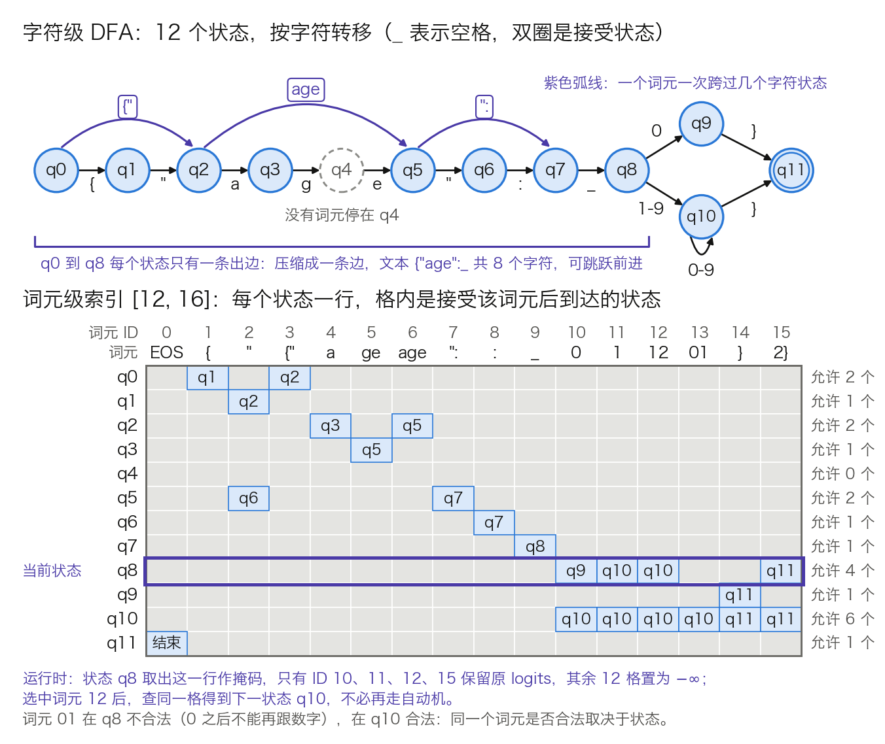
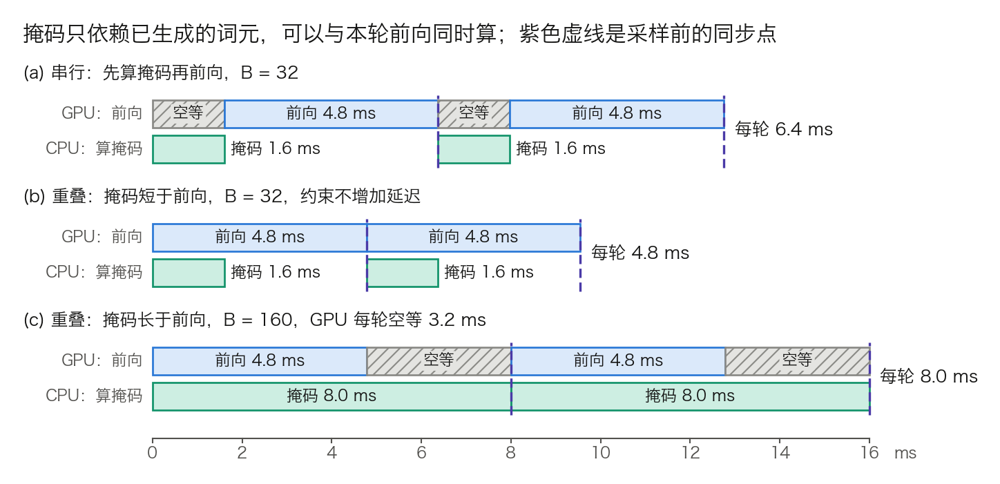

## 11.7 约束解码：让输出必然合乎语法

[9.4 节](../09_decoding/9.4_constrained.md)给出了约束解码的定义：每一步把不合法词元的概率清零，在合法集合上重新归一化。那一节没有回答引擎怎样知道“此刻哪些词元合法”。语法写在字符上，模型吐的是词元，词表有十几万项，判断必须在一轮 Decode 的几毫秒内完成，还要同时服务一整批语法各异的请求。本节先讲语法怎样编译成自动机，字符级自动机怎样变成词元级掩码，每步开销多大、怎样缓存。随后讲确定性片段怎样一次吐出，约束与采样、投机解码、批处理相遇时的次序，以及它对输出质量的代价。

### 11.7.1 约束落在哪一步：logits 上的一行掩码

约束解码不改前向计算。权重、注意力、KV 缓存都照旧，改动只在 LM head 之后、采样之前：给 logits 加一张掩码，合法词元加 0，不合法词元加 −∞。形状按 [3.8.3](../03_components/3.8_gpt_inference_flow.md) 的写法是：

- GPT-3 Small：`logits[B, 50257] + M[B, 50257] → [B, 50257]`
- Llama 3 8B：`logits[B, 128256] + M[B, 128256] → [B, 128256]`

这与 3.8.4 第 4 步的因果掩码是同一种运算，只是那里遮的是位置，这里遮的是词表。Softmax 之后 −∞ 变成概率 0，其余词元自动重新归一化，正是 9.4 节的公式。`M` 的每一行属于一个请求，由该请求自己的语法和自己走到的状态决定，行与行互不相同。

掩码只有“留”和“遮”两种取值，一个词元用 1 比特即可，整行压成一张**位图**（bitmask）。[XGrammar](https://github.com/mlc-ai/xgrammar/blob/main/python/xgrammar/matcher.py) 的约定是 `bitmask[B, ⌈n_vocab/32⌉]`，元素为 int32，由 CPU 填好后拷到 GPU，再由一个内核就地改写 logits。算一行的大小：

- GPT-3 Small：`⌈50,257 / 32⌉ = 1,571` 个 int32，共 `1,571 × 4 = 6,284` 字节。
- Llama 3 8B：`⌈128,256 / 32⌉ = 4,008` 个 int32，共 16,032 字节，约 16 KB。

若用 float32 存整行掩码，Llama 3 8B 是 `128,256 × 4 = 513,024` 字节，是位图的 32 倍。`B = 64` 时，位图每轮的主机到设备拷贝量是 `64 × 16,032 = 1,026,048` 字节，约 1 MB；按 [11.4 节](11.4_kv_memory_management.md)的 PCIe 单向 32 到 64 GB/s，拷贝约 0.02 到 0.03 ms，可以忽略。这里的宽度取嵌入表的 128,256 行，而不是论文口径的 128,000（见 3.8.3 表 3-3 的注）。掩码必须盖住 logits 的每一列，否则多出的 256 个特殊词元不受约束。其中既有保留 ID，也有 `<|end_of_text|>`、`<|eot_id|>` 两个停止词元，漏掉它们，模型就能在半截 JSON 上结束。

GPU 一侧的开销因此很小，难点全在 CPU 一侧：怎样在几十微秒内，为每个请求填好这 4,008 个整数。

### 11.7.2 从字符级自动机到词元级索引

**问题。** 正则表达式和 JSON Schema 定义在字符（字节）上，模型的字母表却是词元。一个词元是一到十几个字节的串，词元边界与语法边界并不对齐。最直接的做法是每一步把词表里的每个词元拿来试走：从自动机的当前状态出发，逐字节转移，中途走进死状态就判为不合法。这要每步做 `n_vocab × 平均词元长度` 次转移，11.7.4 会算出它为什么不可接受。

**想法。** 正则语言对应**确定有限自动机**（Deterministic Finite Automaton，DFA），状态数有限。于是可以在请求开始前，对每个状态、每个词元各试走一次，把结果存成一张表；运行时只按当前状态取一行。这就是 [Outlines 论文](https://arxiv.org/abs/2307.09702)提出的词表索引：建表代价是 `|Q| × n_vocab` 次试走，只付一次；运行时是一次查表，平均 O(1)。

**一个可手算的例子。** 要求输出形如 `{"age": 12}` 的 JSON，整数不许有前导零。对应的正则是：

```text
\{"age": (0|[1-9][0-9]*)\}
```

编译分三步。第一步按 Thompson 构造得到**非确定有限自动机**（Nondeterministic Finite Automaton，NFA）。每个字符或字符类生成 2 个状态和 1 条边，`|` 与 `*` 各再加 2 个状态，用不读字符的 ε 边接线。本例有 12 个字符或字符类（10 个字面字符，加 `[1-9]`、`[0-9]`）、一个 `|`、一个 `*`，共 `12 × 2 + 2 + 2 = 28` 个 NFA 状态。第二步是子集构造：读完某个前缀后 NFA 可能同时处在的状态集合，算作 DFA 的一个状态。本例得 13 个：`q0` 到 `q8` 的链 9 个，读过 `0`、读过 `[1-9]`、循环内读过 `[0-9]`、读过 `}` 各 1 个。第三步合并等价状态：`[1-9]` 之后与 `[0-9]*` 循环之内的两个集合出边完全相同，并成一个，剩 12 个。读不下去时进入的死状态不计在内。

这 12 个状态是：`q0` 到 `q8` 依次吃掉 `{"age": ` 这 8 个字符；`|` 使 `q8` 分叉，读到 `0` 去 `q9`，读到 `1-9` 去 `q10`；`*` 成为 `q10` 上的自环，读到数字留在原地；`q9`、`q10` 读到 `}` 去接受状态 `q11`。教学词表取 16 个词元，见表 11-21，其中特意放了多字符词元、同一字符串的不同切法，以及横跨两个语法成分的词元。

| ID | 0 | 1 | 2 | 3 | 4 | 5 | 6 | 7 | 8 | 9 | 10 | 11 | 12 | 13 | 14 | 15 |
| --- | --- | --- | --- | --- | --- | --- | --- | --- | --- | --- | --- | --- | --- | --- | --- | --- |
| 词元 | EOS | `{` | `"` | `{"` | `a` | `ge` | `age` | `":` | `:` | 空格 | `0` | `1` | `12` | `01` | `}` | `2}` |

表 11-21：教学词表，16 个词元。

建索引就是对 12 个状态、15 个非 EOS 词元各试走一次，共 `12 × 15 = 180` 次；EOS 不走自动机，只在接受状态合法。以状态 `q8` 为例，走三个词元：

- 词元 `01`：`0` 把 `q8` 带到 `q9`；`q9` 没有读 `1` 的出边，走进死状态，不合法。
- 词元 `12`：`1` 到 `q10`，`2` 留在 `q10`，合法，落点 `q10`。
- 词元 `2}`：`2` 到 `q10`，`}` 到 `q11`，合法，落点 `q11`。

同一个 `01` 从 `q10` 出发则两步都留在 `q10`，是合法的。一个词元合不合法取决于状态，这正是掩码必须逐步重算的原因。图 11-15 画出完整的自动机和算出的索引。



图 11-15：正则 `\{"age": (0|[1-9][0-9]*)\}` 的字符级 DFA，以及对 16 个词元预计算出的词元级索引 `[12, 16]`（[生成脚本](https://github.com/yeasy/llm_internals/blob/main/tools/figures/ch11_7_token_index.py)）。蓝格内是接受该词元后的落点状态，灰格不合法；紫框是第 5 步用到的那一行。

从这张索引能读出三件事：

1. **词元跨过状态。** `{"` 从 `q0` 直达 `q2`，`age` 从 `q2` 直达 `q5`。`q4` 没有任何词元停留，词元级自动机实际可达的只有 11 个状态。
2. **同一字符串的各种切法都合法。** `q0` 既允许 `{"`，也允许 `{` 再接 `"`。索引只管字符串是否合乎语法，不偏向分词器的规范切法，11.7.7 会讲这带来的风险。
3. **EOS 只在接受状态合法。** 这一条保证生成不会在半截 JSON 上自行结束。

表 11-22 是生成 `{"age": 12}` 的完整轨迹。每一步做两次查表：按当前状态取一行作掩码，采样后按选中的词元取落点状态。

| 步 | 状态 | 掩码（ID 0 到 15） | 合法词元数 | 选中 | 落点 |
| ---: | --- | --- | ---: | --- | --- |
| 1 | `q0` | `0101000000000000` | 2 | `{"` | `q2` |
| 2 | `q2` | `0000101000000000` | 2 | `age` | `q5` |
| 3 | `q5` | `0010000100000000` | 2 | `":` | `q7` |
| 4 | `q7` | `0000000001000000` | 1 | 空格 | `q8` |
| 5 | `q8` | `0000000000111001` | 4 | `12` | `q10` |
| 6 | `q10` | `0000000000111111` | 6 | `}` | `q11` |
| 7 | `q11` | `1000000000000000` | 1 | EOS | 结束 |

表 11-22：逐步轨迹。7 步里只有第 5、6 步存在语义上的选择，其余各步的候选要么唯一，要么只是同一字符串的不同切法，11.7.5 利用的就是这一点。

**还原到真实规模。** 建表的试走次数是 `|Q| × n_vocab`：一个 100 状态的正则配 Llama 3 的词表，要试走 `100 × 128,256`，约 1,283 万次；每次试走按 `5 字节 × 5 ns = 25 ns` 计（假设值，见 11.7.4），约 0.3 秒。这是一次性开销，但必须缓存。存储上，若每个状态存一张 16 KB 的位图，1,000 个状态就是 16 MB。落点那张表可以不存：选中词元的字节在字符级 DFA 上重走约 5 步即得。若存成稠密的 int32 表，是 `1,000 × 128,256 × 4 ≈ 513 MB`，为位图的 32 倍；outlines-core 的 `Index` 取折中，只为合法词元存落点，大小随合法词元数增长。字节级 BPE 的词表含全部 256 个单字节词元（见 [3.1 节](../03_components/3.1_tokenization.md)），所以任何合法字符串总有一种切法走得通，索引不会出现“语法允许、词表却拼不出”的死路。

### 11.7.3 嵌套结构：下推自动机与上下文独立词元

**为什么 DFA 不够。** 有限状态记不住任意深的嵌套：`[[[1]]]` 要求右括号与左括号数目相等，层数无上限时没有哪个有限状态集能数清。不含递归、嵌套层数固定的 JSON Schema 可以先展开成正则，[outlines-core](https://github.com/dottxt-ai/outlines-core) 即走此路（`build_regex_from_schema`）。自引用的 `$ref` 在这条路上只能按固定深度展开（`max_recursion_depth`，默认 3），正则大小随深度指数增长。Schema 引用自身且深度不设限，或要接受任意 JSON，就需要**上下文无关文法**（Context-Free Grammar，CFG）。对应的机器是**下推自动机**（Pushdown Automaton，PDA），即在有限状态之外加一个栈。进入子规则时把返回位置压栈，子规则结束时弹栈回到上层。

**困难。** PDA 的完整状态是“当前节点加整个栈”，栈深不设上限，状态无法枚举，11.7.2 的整表预计算做不下去。退回每步试走全词表，又太慢。

**XGrammar 的拆分。** [XGrammar 论文](https://arxiv.org/abs/2411.15100)按“只看栈顶能否判定”把词元分成两类。词元从栈顶节点出发逐字节匹配，过程只有三种情形：进入子规则（压栈）、在当前规则内前进、走到当前规则末尾并返回上层（弹栈）。前两种只依赖栈顶节点，称**上下文独立词元**（context-independent token），可以对每个节点预先判好、存入缓存；第三种要看栈里压着什么，称**上下文依赖词元**（context-dependent token），留到运行时带着完整的栈去执行。

举一个例子。当前位于 JSON 字符串内部，候选词元是 `"}`：引号结束字符串，属于弹栈；紧随的 `}` 是否合法，取决于外层是对象还是数组。前缀是 `{"k": "ab` 时合法，前缀是 `["ab` 时不合法。栈顶节点相同，结论不同，它就是上下文依赖词元。同一位置的候选词元 `cd` 只在字符串内部前进，不论外层是什么都合法。

论文对 Llama 3.1 的词表和 JSON 文法给出的数字是：上下文依赖词元 1,134 个，不到 128k 词表的 1%；再用“上下文扩展”预先算出每条规则返回上层后可能接上的字符串，提前排除注定失败的词元，可降到 120 个。运行时要带着栈执行的词元，由整张词表缩到百余个的量级，其余直接取自缓存。缓存的存法也按节点自适应：合法词元少就存合法列表，不合法词元少就存不合法列表，两者相当才存整张位图。该文报告 JSON 文法的缓存由此从 160 MB 降到 0.46 MB。

**栈要能回退。** 检查一个词元要顺着它的字节压栈弹栈，查完须恢复原状再查下一个；投机解码和跳跃前进也要撤销已接受的词元。论文用**持久化栈**（persistent stack）解决：各时刻的栈组织成一棵共享前缀的树，回退只是把指针挪回旧节点，耗时为常数。

**另一条路线是不预计算。** [llguidance](https://github.com/guidance-ai/llguidance) 用 Earley 解析器配一个基于正则导数的词法器，运行时沿词表的前缀树（trie）遍历，共享前缀的词元只走一次；其文档给出的量级是 128k 词表下每张掩码约 50 微秒的单核 CPU 时间，且几乎没有启动开销。两条路线的取舍在于把成本放在编译期还是每一步：语法固定、请求量大时，预计算摊得开；每个请求的 Schema 都不同时（例如工具列表随请求变化），编译缓存命中率低，运行时路线更稳。

### 11.7.4 每步掩码的开销与缓存

约束解码有三笔开销：编译语法（每种语法一次）、生成掩码（每请求每步一次）、施加掩码（GPU 上一次逐元素运算）。第三笔可忽略，前两笔都在 CPU 上。

**每步的预算是多少。** 沿用 [10.1 节](../10_inference_optimization/10.1_bottleneck.md)的口径，Llama 3 8B 的 BF16 权重是约 80 亿参数 × 2 字节 ≈ 16 GB，H100 的显存带宽为 3.35 TB/s，单轮 Decode 的下界是：

$$
t_{\text{fwd}} \approx \frac{16\ \text{GB}}{3.35\ \text{TB/s}} \approx 4.8\ \text{ms}
$$

掩码若要不拖慢生成，整批请求的掩码必须在这 4.8 ms 内算完。

**朴素做法超出多少。** 假设词元平均 5 字节、一次状态转移 5 ns（一次查表的量级，两者均为假设值），每请求每步是 `128,256 × 5 × 5 ns ≈ 3.21 ms`。`B = 32` 时串行算完要 `32 × 3.21 ≈ 103 ms`，是前向的 20 多倍，GPU 绝大部分时间在等 CPU。

**有索引或缓存之后。** 每张掩码降到几十微秒。XGrammar 论文在其测试环境下报告 JSON Schema 与 JSON 文法每词元低于 40 微秒。llguidance 文档给出约 50 微秒。取 50 微秒，`B = 32` 时一轮是 `32 × 50 = 1,600` 微秒，即 1.6 ms。

**重叠。** 本轮掩码只依赖已经生成的词元，本轮前向也只依赖已经生成的词元，两者没有先后关系，可以让 CPU 与 GPU 同时开工，在采样之前同步一次。图 11-16 比较三种排法。



图 11-16：掩码计算与前向的时序，时间按比例（[生成脚本](https://github.com/yeasy/llm_internals/blob/main/tools/figures/ch11_7_mask_overlap.py)）。前向统一取 4.8 ms 的下界，掩码取每请求 50 微秒、单线程。(a) 串行时每轮 `1.6 + 4.8 = 6.4` ms；(b) 重叠后掩码藏在前向之内，每轮 4.8 ms；(c) `B = 160` 时掩码要 8.0 ms，GPU 每轮空等 3.2 ms。

由此得到一条判据：

$$
\frac{B_{\text{约束}} \times t_{\text{mask}}}{\text{线程数}} \le t_{\text{fwd}}
$$

左边小于右边，约束对延迟没有影响；超过，掩码就落在关键路径上，每轮时间由 CPU 决定。代入 50 微秒和 4.8 ms，单线程能容纳约 96 个约束请求。批变大时前向也会变长（KV 读取增加，见 3.8.7 的瓶颈三），所以 96 偏保守；再往上靠多线程并行填各行，XGrammar 的 `BatchGrammarMatcher` 即为此而设。这条数据依赖还有一个推论：掩码必须等上一步的采样结果，凡是让 CPU 提前一轮准备输入的调度优化，遇到约束请求都要在这里多等一次；vLLM 的异步调度见 [11.10 节](11.10_vllm_internals.md)，SGLang 的重叠调度见 [11.11 节](11.11_sglang_internals.md)。

**编译缓存。** 编译结果按“语法加分词器”缓存，同一 Schema 的后续请求直接复用。[SGLang 论文](https://arxiv.org/abs/2312.07104)的消融实验显示，若每个请求都重做预处理，吞吐降为原来的 1/2.4。首个请求的编译时间计入它的 TTFT（首词元延迟），可与 Prefill 重叠来遮掉一部分。

### 11.7.5 跳跃前进：确定性片段不必逐词元解码

表 11-22 的前 4 步没有任何信息量：语法已经规定输出以 `{"age": ` 开头，模型却仍要做 4 轮前向，把这 8 个字符“生成”出来。**跳跃前进**（jump-forward）省掉这些前向。

**机制。** SGLang 论文的压缩有限状态机（compressed FSM）先在字符级自动机上找单出边：源状态只有一个后继，且边上只有一个可接受字符。一条边之后若接着连续的单出边，就与它们合并成一条压缩边，边上的文本是各字符的拼接。图 11-15 里 `q0` 到 `q8` 的 8 条边全是单出边，压成一条，文本为 `{"age": `。运行时走到压缩边的起点，引擎直接把整段文本追加到序列里，用分词器切成词元，交给一次多行的前向补齐 KV，不再经过采样。

压缩必须在字符级做。词元级的 `q0` 有 `{` 和 `{"` 两条出边，看上去并不确定；在字符级它只有一条。

**省了多少。** 不跳跃时，Prefill 给出第 1 个词元，其后 6 个词元各需一轮 Decode。跳跃时，4 个强制词元直接并入 Prefill，模型只需生成 `12` 和 `}`。其后的 EOS 是终态唯一合法的词元，引擎可以直接结束，Decode 由 6 轮降到 1 到 2 轮。按上一小节的口径，省下的 4 轮约 `4 × 4.8 ≈ 19` ms；代价是 Prefill 多算 4 行，而 Prefill 处在算力瓶颈一侧（见 3.8.7），多几行几乎不增加耗时。

强制片段出现在序列中间时同理。设片段长 k 个词元：不跳跃要 `k + 1` 轮单行前向，才能得到片段之后第一个自由词元的 logits；跳跃时是一轮 `k + 1` 行的前向，省 k 轮。llguidance 的[文档](https://github.com/guidance-ai/llguidance/blob/main/docs/fast_forward.md)把它概括为“推测 100% 正确的投机解码”。SGLang 论文在 JSON 解码基准上测得压缩状态机使吞吐提高到 1.6 倍。字段名越长、自由取值越短的 Schema，收益越大。

**代价。** 第一，跳跃的这一轮不再是“每请求一行”的 Decode，而是一次小的 Prefill，调度器要把它当作分块 Prefill 那样混排（见 [11.3 节](11.3_scheduler_loop.md)）。第二，强制文本要重新分词。SGLang 论文的做法是把此前的全部文本连同压缩边的文本一起重新切分，保证序列与模型训练时见到的切法一致（引擎当前是否启用见 11.11.5）；若重切使末尾几个已生成的词元发生合并，这些词元的 KV 要作废重算，语法状态也要同步回退。第三，强制到哪里为止并不显然，见 11.7.7 的词元边界问题。

### 11.7.6 与采样、投机解码、批处理的交互

**采样：掩码先于截断。** Top-k、Top-p、Min-p（见 [9.3 节](../09_decoding/9.3_sampling.md)）都按概率高低丢弃词元。若先截断再加掩码，合法词元可能已被全部丢掉。设某一步只有四个词元有概率：三个不合法，分别为 0.5、0.3、0.15；一个合法，为 0.05。Top-p 取 0.9，按概率从大到小累计是 0.5、0.8、0.95，到第三个才过线，核内三个全不合法。再加掩码，整行都是 −∞，Softmax 得到 NaN。先加掩码则不会：0.05 先归一化为 1，Top-p 再在合法集合内部截断。温度与掩码的先后无关，因为 −∞ 除以任何正数仍是 −∞；贪心解码就是在合法集合里取 argmax。

**批处理：前向共享，状态分管。** 同一批里可以混着不同语法的请求和无约束的请求。前向是同一次，批处理的收益不受影响；每个约束请求各有一个匹配器，保存自己的自动机状态，并对应位图里的一行。无约束的行全填 1，或者像 XGrammar 的 `apply_token_bitmask_inplace` 那样用 `indices` 参数只处理指定的行。连续批处理每一轮都有请求进出，行号与请求的对应关系要每轮重建。KV 缓存与前缀缓存不受影响：掩码作用在 LM head 之后，同一串词元的 K、V 与有无约束无关，前缀复用照常（见 [11.5 节](11.5_prefix_reuse.md)）。

**投机解码：k + 1 张掩码与回退。** 设草稿给出 k 个词元 $$d_1,\dots,d_k$$，目标模型一次前向验证 `k + 1` 个位置（见 [10.6 节](../10_inference_optimization/10.6_speculative_decoding.md)）。每个位置的合法集合不同：第 0 个位置用当前状态的掩码，第 i 个位置用“依次接受 $$d_1,\dots,d_i$$ 之后”的掩码。匹配器因此要沿草稿前进 k 步，产出 `bitmask[k+1, ⌈n_vocab/32⌉]`；验证结束后，按被拒绝的词元数回退。若 $$d_i$$ 本身不在第 $$i-1$$ 张掩码里，它在约束后的目标分布下概率为 0，必被拒绝，其后的草稿一并作废。三个后果：

- CPU 开销乘以 `k + 1`，11.7.4 的判据相应收紧。
- 无损性仍成立，但对象是“加掩码后的目标分布”。
- 草稿一侧最好也加同一张掩码，否则草稿频繁越出语法，接受率下降。

XGrammar 为此提供 `rollback` 和处理树状草稿的 `traverse_draft_tree`。跳跃前进与投机解码省的是同一类词元：确定性片段正是草稿最容易猜对的部分，两者的收益有重叠，不是简单相加。

### 11.7.7 质量风险：分布扭曲与词元边界

9.4.5 已指出逐步掩码会改变分布。本小节把它落到 11.7.2 的例子上，再讲 9.4 没有展开的词元边界问题。

**风险一：分布扭曲。** 沿用上面的正则，词表换成真实词表，`1`、`2`、`.`、`}` 各是一个词元。设模型走到 `q8`，只看两条路径。模型认为答案是 1.5：首选 `1`，概率 0.6，其后想接小数点的概率是 0.9，接 `}` 的概率只有 0.1；次选 `2`，概率 0.4，其后接 `}` 的概率是 0.9。语法只许整数，小数点不合法。按 9.4.5 的记法，选 `1`、选 `2` 之后落在语法内的总概率 F 分别是 0.1 与 0.9。

- 理想结果是原分布限制在合法输出上的条件分布。两条合法路径的联合概率是 `0.6 × 0.1 = 0.06` 和 `0.4 × 0.9 = 0.36`，归一化后输出 `1` 的概率是 `0.06 / 0.42 ≈ 0.14`，输出 `2` 的概率约 0.86。
- 逐步掩码的结果不同。第一步 `1` 和 `2` 都合法，概率仍是 0.6 和 0.4；选了 `1` 之后，第二步小数点被遮掉，`}` 的 0.1 被归一化成 1。输出 `1` 的概率是 0.6，被高估约 4.2 倍。

原因在于掩码只看“这一步能否走通”，没有把 F 乘进去。模型本想写 1.5，被迫截成 1，而不是改选它自己更认可的整数。精确修正为何一般不可行，见 9.4.5 对 Grammar-Aligned Decoding 的介绍。工程上的对策是减少掩码真正出手的次数：

- 让语法贴合模型要说的话，可能出现小数的字段就声明为 `number`。
- 把 Schema 同时写进 Prompt。掩码对模型不可见，llama.cpp 的[文法文档](https://github.com/ggml-org/llama.cpp/blob/master/grammars/README.md)特别提醒，Schema 只用于约束输出，不会自动注入 Prompt。
- 监控未加掩码时的 argmax 被遮掉的比例。比例高，说明 Prompt 与语法在互相冲突。

**风险二：词元边界。** 字符级自动机接受同一字符串的所有切法，模型却只在训练中见过规范切法。三种情形会把模型推到陌生的词元序列上：

- 强制片段的切法不规范。同一份 llguidance 文档的例子：Schema 有 `orderId` 和 `orderName` 两个可选字段，采到 `{"` 之后语法强制 `order`。Llama 3 的词表里 `orderId` 是一个词元，`orderName` 不是。若此时强行填入词元 `order`，模型几乎必选 `Name`，因为训练数据里 `order` 后接 `Id` 的序列极少见。安全的做法是只强制到规范切法确定的位置为止，把悬而未决的尾部留给模型。
- 实现把词元对齐到语法终结符，不允许一个词元横跨两个成分。表 11-21 的 `":` 与 `2}` 这类词元会被误判为不合法，模型只得改用罕见的拆分。[DOMINO](https://arxiv.org/abs/2403.06988) 一文称之为**词元错位**（token misalignment），并实测到下游准确率显著下降。11.7.2 那种按字节试走的索引天然接受这类词元，没有这个问题。
- 语法允许任意多的空白时，模型可能一直输出空白直到长度上限。OpenAI 的[结构化输出文档](https://developers.openai.com/api/docs/guides/structured-outputs)对 JSON 模式有同样的提醒；对策是在语法里收紧空白，并在 Prompt 中明确要求输出 JSON。

**风险三：格式限制拖累推理。** [Let Me Speak Freely?](https://arxiv.org/abs/2408.02442) 一文比较了自由作答与受格式限制的作答，观察到推理类任务在格式限制下明显变差，限制越严下降越多。常见的缓解办法是在 Schema 里把推理字段排在答案字段之前，或先自由作答、再用第二次调用转成结构化输出。

**保证的边界。** 前缀合法不等于输出完整、语法合法不等于语义正确、各实现只支持 JSON Schema 的子集，这三条见 9.4.6。补一个实现细节：llama.cpp 的文档写明不支持的特性会被静默跳过，此时实际约束比预期弱，却不会报错。

### 11.7.8 对到实现

表 11-23 汇总几种公开实现的路线，可据此读各自的源码与文档。

| 实现 | 语法怎样表示 | 掩码怎样得到 | 取舍 |
| --- | --- | --- | --- |
| Outlines（outlines-core） | 正则编译为 DFA；JSON Schema 先转成正则 | 预计算 `Index`：状态到合法词元、词元到下一状态 | 运行时只查表；建表时间与内存随状态数增长；递归只能按固定深度截断 |
| XGrammar | CFG（含 JSON Schema、正则）编译为字节级 PDA | 上下文独立词元预计算，上下文依赖词元运行时执行 | 缓存命中时每步只补判少量词元；编译要对每个节点过一遍词表，依赖编译缓存 |
| llguidance | CFG，Earley 解析器加正则导数词法器 | 运行时沿词表前缀树遍历，不预计算 | 几乎无启动开销，适合 Schema 逐请求变化 |
| llama.cpp（GBNF） | GBNF 文法，显式栈的字符级解析器 | 运行时逐个检查候选词元，不预计算 | 文档提示个别写法（如大量重复的可选项）会使采样极慢；JSON Schema 只支持子集 |

表 11-23：约束解码的几种公开实现。

读 XGrammar 的 Python 接口时，可按本节的顺序对号入座：`GrammarCompiler` 负责编译并自带缓存（`compile_json_schema`、`compile_regex`、`compile_grammar`）；每个请求一个 `GrammarMatcher`，`fill_next_token_bitmask` 对应 11.7.1 的填位图，`accept_token` 对应采样后的状态转移，`find_jump_forward_string` 对应 11.7.5，`rollback` 对应 11.7.6。其匹配器的实现基于 Earley 解析器，与论文的显式栈不同；“按位置预计算掩码、运行时补判其余”的骨架不变。vLLM 与 SGLang 都把这些库当作可替换的后端，接线方式与配置项分别见 [11.10 节](11.10_vllm_internals.md)和 [11.11 节](11.11_sglang_internals.md)。
