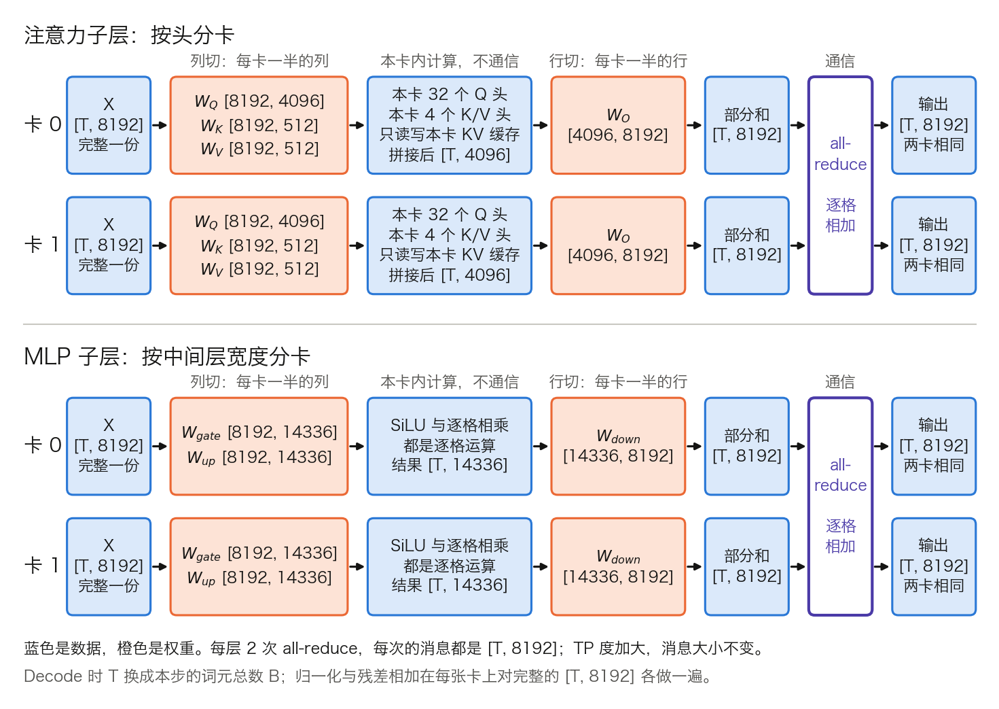
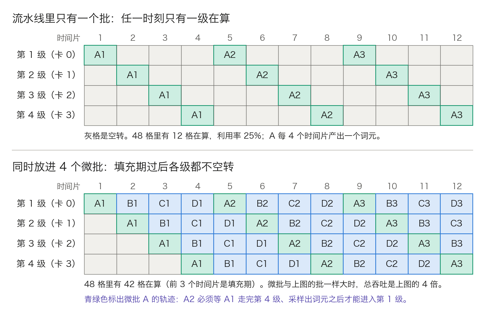
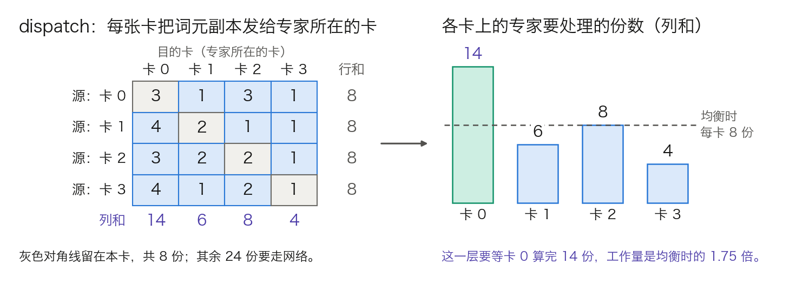

## 11.8 多卡推理：张量并行、流水线并行与专家并行

前面各节都假定模型放得进一张卡。Llama 3 70B 按 BF16 存放要 141 GB，一张 80 GB 的卡装不下，DeepSeek-V3 这类 MoE 模型更要几十上百张卡。本节回答三个问题：模型怎样切到多张卡上，每种切法每个词元要通信多少，KV 缓存跟着怎样切。训练侧的并行见[第七章](../07_distributed_training/README.md)，Prefill 与 Decode 分池部署见 [11.9 节](11.9_disaggregated_serving.md)，这里只讲一个模型副本内部的切分。

算例沿用 [3.8.6](../03_components/3.8_gpt_inference_flow.md) 表 3-25 的 Llama 3 70B：80 层，`d_model = 8192`，64 个 Q 头，8 个 K/V 头，每头 128 维，MLP 中间层 28,672。MoE 部分用 [DeepSeek-V3 技术报告](https://arxiv.org/abs/2412.19437)公开的配置。全部数字可用计算器复核。

### 11.8.1 两个理由：装不下，读得慢

**先算权重。** Llama 3 70B 每层的注意力投影是 `8192 × 8192`（Q）、两个 `8192 × 1024`（K、V）和 `8192 × 8192`（`W_O`），合 1.510 亿；SwiGLU 的三个矩阵各 `8192 × 28672`，合 7.046 亿。每层 8.556 亿，80 层 684.5 亿；嵌入表与 LM head 各 `128256 × 8192`，合 21 亿。总计 705.5 亿个参数，BF16 每个 2 字节，141.1 GB。

**第一个理由是容量。** 141.1 GB 超过 80 GB，何况显存还要留给 KV 缓存。

**第二个理由是速度。** [3.8.7](../03_components/3.8_gpt_inference_flow.md) 算过，Decode 每步至少把权重读一遍。H100 的显存带宽是 3.35 TB/s（见 [10.1 节](../10_inference_optimization/10.1_bottleneck.md)），假如有一张装得下的卡，每步的下界是 `141.1 GB ÷ 3.35 TB/s = 42.1 ms`。嵌入表只查行、不整读，这个数略高估约 1.5%。把权重平分到 8 张卡，每卡只读 17.6 GB，下界降到 5.3 ms。多卡把显存带宽也加了起来，所以单卡装得下的模型，为了压低每词元时延也会切开。

切法有三种。**张量并行**（Tensor Parallelism，TP）在层内切，每张卡拿每个矩阵的一部分。**流水线并行**（Pipeline Parallelism，PP）按层切，每张卡拿连续的若干层。**专家并行**（Expert Parallelism，EP）只用于 MoE，每张卡拿一部分专家。三者之外还有整份复制，即多个副本各自服务不同的请求，副本之间不通信。

与训练相比，推理有三点不同。没有反向传播，不必同步梯度和优化器状态。多了一份随请求增长的状态，即 KV 缓存，它也要切。指标从整体吞吐变成每个词元的时延，通信的固定延迟因此比带宽更要紧，11.8.4 给出算例。

### 11.8.2 张量并行：列切与行切配对

**要解决的问题。** 一次 `X × W` 的矩阵乘法怎样分给 t 张卡，使每张卡只存 `1/t` 的权重，结果在数学上又与单卡相同。切法有两种，两卡手算例见 [7.3.2](../07_distributed_training/7.3_model_tensor_parallel.md)，这里只述结论。**列切**（column parallel）把 `W` 按列分块，每张卡拿完整的 `X`，算出结果的一段列。**行切**（row parallel）把 `W` 按行分块，每张卡只拿输入的对应一段，算出的是完整形状的**部分和**，各卡逐格相加才是结果。把各卡的部分和逐格相加、并让每张卡都拿到总和的操作，叫 **all-reduce**（全归约，第七章写作 AllReduce）。

**为什么先列切、后行切。** MLP 的两个矩阵一列一行配对。第一个列切，中间结果的每一格只属于一张卡，逐格的激活函数各算各的；第二个行切，它需要的输入恰好是本卡手里的那一段。整个 MLP 只在末尾通信一次。反过来先行切，激活之前每张卡拿到的是同一格的一部分，而 `ReLU(a + b) ≠ ReLU(a) + ReLU(b)`，激活之前就得多通信一次，数字反例见 7.3.2。[Megatron-LM 论文](https://arxiv.org/abs/1909.08053)正是据此把两个矩阵配成一列一行，使每个子层的前向只剩一次 all-reduce。

**真实形状。** 图 11-17 按 Llama 3 70B、`t = 2` 画出一层的数据流，`t` 表示 TP 度。下面的清单给出 `t = 8` 时每张卡上的形状，`T` 是本次前向的词元数。

图 11-17：一层 Transformer 在张量并行下的数据流，形状取 Llama 3 70B、TP = 2（[生成脚本](https://github.com/yeasy/llm_internals/blob/main/tools/figures/ch11_8_tp_layer.py)）。蓝色是数据，橙色是权重，紫色竖条是 all-reduce。

- **注意力的 Q/K/V 投影**（列切，等于按头分卡：每卡 8 个 Q 头、1 个 K/V 头）
  - `X[T, 8192] × W_Q[8192, 1024] → Q[T, 1024]`
  - `X[T, 8192] × W_K[8192, 128] → K[T, 128]`，V 同理
- **本卡内的注意力**（只读写本卡的 KV 缓存，不通信）
  - 8 个头各自打分、读取，拼接后是 `[T, 1024]`
- **输出投影**（行切），然后第一次 all-reduce
  - `[T, 1024] × W_O[1024, 8192] → 部分和[T, 8192]`
- **MLP 的 gate 与 up**（列切），SiLU 与逐格相乘在本卡完成
  - `X[T, 8192] × W_gate[8192, 3584] → [T, 3584]`，`W_up` 同理
- **MLP 的 down**（行切），然后第二次 all-reduce
  - `[T, 3584] × W_down[3584, 8192] → 部分和[T, 8192]`

注意力天然适合这样切，因为各头之间本来就不交换数据（3.8.6 表 3-24）。归一化和残差相加的计算量很小，每张卡对完整的 `[T, 8192]` 各做一遍。嵌入表和 LM head 沿词表维切：每卡算出 `128256 ÷ 8 = 16,032` 个词元的 logits，再收集成完整的一行。

**对到实现。** Megatron-LM 把两种切法写成 `ColumnParallelLinear` 和 `RowParallelLinear` 两个模块。vLLM 的 Llama 实现沿用同一思路：

- 列切：`qkv_proj` 是 `QKVParallelLinear`，`gate_up_proj` 是 `MergedColumnParallelLinear`。
- 行切：`o_proj` 和 `down_proj` 是 `RowParallelLinear`，all-reduce 在它的末尾。
- 词表维切：嵌入是 `VocabParallelEmbedding`，输出是 `ParallelLMHead`。

读到这几个类名，就能判断一个矩阵是列切还是行切、all-reduce 发生在哪里。

**边界：相同只到数学为止。** 浮点加法不满足结合律。单卡把一行的各项依次加完，多卡先各自加出部分和再相加，次序不同，末位可能不同。同一个模型换一个 TP 度，logits 会有微小差异；贪心解码下，两个候选分数极近时，个别词元可能因此分叉。

### 11.8.3 每层两次 all-reduce：通信量怎么算

**消息有多大。** 每次 all-reduce 的消息就是部分和 `[T, d_model]`，与 TP 度无关；训练侧每层 4 次的账见 [7.3.5](../07_distributed_training/7.3_model_tensor_parallel.md)，这里算推理侧每层 2 次：

$$
\text{单次消息} = T \times d_{\mathrm{model}} \times \text{每个数的字节数}
$$

Llama 3 70B 按 BF16，每个词元是 `8192 × 2 = 16,384` 字节，即 16 KiB。每层 2 次，一次前向 `2 × 80 = 160` 次，每个词元合计 `160 × 16 KiB = 2.5 MiB`。嵌入与 LM head 处另有各一次集合通信，相对 160 次可忽略。

**每张卡实际收发多少。** 常用的环形算法把 all-reduce 拆成两段。前一段各卡把消息切成 t 份，沿环传 `t − 1` 步，每步传一份并累加，结束时每张卡握有一份的总和。后一段再传 `t − 1` 步，把各份总和传遍所有卡。合计 `2(t − 1)` 步，每步传 `1/t`：

$$
\text{每卡发送量} = \frac{2(t-1)}{t} \times \text{单次消息}
$$

`t = 2` 时系数是 1，`t = 8` 时是 `14 ÷ 8 = 1.75`，t 再大也不超过 2。表 11-24 按 `t = 8` 算两个场景。

| 项目 | Prefill：一条 8,192 词元的 Prompt | Decode：64 个请求各走一步 |
| --- | ---: | ---: |
| 本次前向的词元数 | 8,192 | 64 |
| 单次 all-reduce 的消息 | 128 MiB | 1 MiB |
| 160 次合计 | 21.5 GB | 0.17 GB |
| 每卡发送量（乘 1.75） | 37.6 GB | 0.29 GB |
| 只算带宽的耗时，NVLink 单向 450 GB/s | 84 ms | 0.65 ms |
| 只算带宽的耗时，PCIe Gen5 单向 64 GB/s | 587 ms | 4.6 ms |
| 环形算法的通信步数 | `14 × 160 = 2,240` | 2,240 |

表 11-24：Llama 3 70B、TP = 8、BF16 下一次前向的 all-reduce 通信量。以 Prefill 一列为例：单次消息 `8192 × 16 KiB = 128 MiB`，160 次是 20,480 MiB 即 21.5 GB，乘 1.75 得 37.6 GB，除以 450 GB/s 得 84 ms。NVIDIA 标称 H100 的第四代 NVLink 为[每卡双向 900 GB/s](https://www.nvidia.com/en-us/data-center/technologies/hopper-architecture/)，并称这是 PCIe Gen5 的 7 倍以上；[PCIe Gen5 标称 128 GB/s](https://www.nvidia.com/en-us/data-center/h100/)，`900 ÷ 128 = 7.03`，按此推算，128 GB/s 也是双向口径，表中各按单向一半计。

这笔账可以与公开数字对照。[NVIDIA 的一篇技术博客](https://developer.nvidia.com/blog/nvidia-nvlink-and-nvidia-nvswitch-supercharge-large-language-model-inference/)称，Llama 3.1 70B 处理 8K 输入、256 输出的一个请求，每张卡要传出最多约 20 GB 的 TP 同步数据。按上式取 `t = 2`、共 8,448 个词元：`8448 × 16,384 × 160 = 22.1 GB`，即 20.6 GiB，量级吻合。

**通信占多大比例。** 按 [3.8.7](../03_components/3.8_gpt_inference_flow.md) 的记法，与权重相乘的部分每个词元约 `2 × 参数量` 次运算，注意力的打分与读取每层约 `2T²d` 次。这条 Prompt 的 Prefill 中，前者是 `2 × 684.5 亿 × 8192 = 1.12 × 10¹⁵` 次。后者是 `2 × 8192² × 8192 × 80 = 0.09 × 10¹⁵` 次。两项合 `1.21 × 10¹⁵` 次。8 张 H100 按稠密 BF16 峰值 990 TFLOPs、50% 利用率估，约 0.31 s。NVLink 上通信 84 ms，约为计算的四分之一；PCIe 上 587 ms，是计算的 1.9 倍，多出来的卡大半时间在等数据。TP 通常只在同一个 NVLink 域内使用，原因在此；这个域有多大，取决于硬件（见 [11.12 节](11.12_hardware.md)）。

### 11.8.4 Prefill 看带宽，Decode 看延迟

表 11-24 的 Decode 一列里，带宽项只有 0.65 ms，远小于每步 5.3 ms 的读权重下界。只看带宽，Decode 的通信似乎可以忽略。实际并非如此，因为一次 all-reduce 的耗时有两项：

$$
\text{一次 all-reduce 的耗时} \approx \text{步数} \times \alpha + \frac{\text{每卡发送量}}{\text{带宽}}
$$

α 是每个通信步的固定开销，含内核启动、各卡对齐和链路延迟，与消息大小无关。Prefill 的消息是 128 MiB，第二项占绝对多数。Decode 的消息只有 1 MiB，第二项每次约 4 微秒，剩下的全是第一项。

第一项的关键是次数。环形算法每次 14 步，一个 Decode 步就是 2,240 个串行的通信步，固定开销合计 2,240α。α 取 10 微秒（示意值，实际取决于互连和通信库）时是 22.4 ms，约为读权重下界 5.3 ms 的 4 倍。这些步骤卡在每层的关键路径上，前一层的 all-reduce 没做完，后一层就不能开始，无法靠重叠隐藏。

由此得到三条推论。

- **小消息要换算法。** 环形算法省带宽，步数却随 t 增长。Decode 用的是步数固定的算法：各卡一次把自己的部分和发给所有卡，或借助交换芯片做多播。NVIDIA 在介绍 TensorRT-LLM MultiShot 的[博客](https://developer.nvidia.com/blog/3x-faster-allreduce-with-nvswitch-and-tensorrt-llm-multishot/)中把两者并列：环形是 `2N − 2` 步，MultiShot 恒为 2 步。`t = 8` 时 2,240 步降到 `2 × 160 = 320` 步，固定开销从 2,240α 降到 320α，是原来的七分之一。推理引擎为小消息自带定制的 all-reduce 内核，原因相同；vLLM 的定制内核只接管小于设定上限的消息，更大的仍走通用通信库。
- **TP 度加大，收益递减。** 计算时间按 `1/t` 缩短，all-reduce 的次数却固定为每层 2 次。t 从 4 加到 8，读权重下界从 10.5 ms 降到 5.3 ms，省下 5.2 ms；通信一项不降反升。批越小、模型越小，通信占比越高。
- **跨节点 TP。** Decode 对它最不宽容。跨节点网络的 α 比节点内高，每步再乘上 160 次。Prefill 跨节点损失的是带宽，还能靠大消息摊薄；Decode 损失的是延迟，无处可摊。

同一组卡做 Prefill 和做 Decode，合适的并行度因此不同。两个阶段分池部署后各选各的并行度，见 [11.9 节](11.9_disaggregated_serving.md)。

### 11.8.5 KV 缓存跟着怎样切

**TP 下按 K/V 头切。** 11.8.2 的清单里，每张卡只算自己那几个头的 K 和 V，也就只缓存这几个头。Llama 3 70B 每个词元的 KV 缓存是 `2 × 8 × 128 × 80` 个数，BF16 下 327,680 字节，即 320 KiB。表 11-25 列出不同 TP 度下每张卡分到多少。

| TP 度 | 每卡的 K/V 头数 | 每卡每词元的 KV | 全组每词元合计 |
| ---: | ---: | ---: | ---: |
| 1 | 8 | 320 KiB | 320 KiB |
| 2 | 4 | 160 KiB | 320 KiB |
| 4 | 2 | 80 KiB | 320 KiB |
| 8 | 1 | 40 KiB | 320 KiB |
| 16 | 1（复制） | 40 KiB | 640 KiB |

表 11-25：Llama 3 70B 的 KV 缓存在不同 TP 度下的切分（BF16）。每卡每词元的 KV 等于 `2 × 每卡头数 × 128 × 80 × 2` 字节。

**边界一：头数上限。** 头是最小的切分单位，TP 度超过 K/V 头数就只能复制。`t = 16` 时 8 个 K/V 头不够分，每个头要在两张卡上各存一份，每卡的 KV 不再缩小，全组总量翻倍。vLLM 的注意力层按这条规则处理：K/V 头数不小于 TP 度时整除切分，小于时复制，每卡至少保留 1 个头。GQA 把 K/V 头数压到 8，也就把“KV 随 TP 等比缩小”的上限定在了 8。

**边界二：MLA。** MLA 无法按头切。DeepSeek-V3 的 MLA 每层只缓存一个 512 维的压缩向量和一个 64 维的位置分量（见 [10.2 节](../10_inference_optimization/10.2_kv_cache.md)），61 层合 `576 × 61 × 2 = 70,272` 字节，约 69 KiB。这个向量不分头，TP 组里每张卡都得存完整的一份：`t = 8` 时全组每词元 549 KiB，八分之七是重复的。SGLang 为此给 DeepSeek 模型的注意力部分改用数据并行，[其 v0.4 发布说明](https://lmsys.org/blog/2024-12-04-sglang-v0-4/)的理由正是 TP 会造成 KV 缓存重复。做法是每张卡各管一批请求、各存各的 KV，进 MoE 层之前再把词元汇到一起。

**PP 下按层切。** 每张卡只有自己那些层，也只缓存那些层的 K 和 V。`p = 4` 时每卡 20 层，每词元 80 KiB，与 `t = 4` 相同。

**容量的账。** 多卡不只是把权重摊薄，还把 KV 池合并了。以 8 张 80 GB 的 H100 部署 Llama 3 70B 为例，显存按 90% 可用（每卡 72 GB）、不计激活与工作区；GB 取 10⁹ 字节，KiB 取 1,024 字节：

- 两个 `t = 4` 的副本：每卡权重 35.3 GB，剩 `72 − 35.3 = 36.7 GB`，每词元 80 KiB。每个副本放 `36.7 × 10⁹ ÷ (80 × 1024) ≈ 44.8 万`个词元，两个副本合计 89.6 万。
- 一个 `t = 8` 的副本：每卡权重 17.6 GB，剩 `72 − 17.6 = 54.4 GB`，每词元 40 KiB，可放 `54.4 × 10⁹ ÷ (40 × 1024) ≈ 132.8 万`个词元。

同样 8 张卡，`t = 8` 的 KV 容量是前者的 1.48 倍，因为权重只存了一份。`t = 2` 则不可行：每卡权重 70.6 GB，只剩 1.4 GB。KV 池的块怎样分配见 [11.4 节](11.4_kv_memory_management.md)。

### 11.8.6 流水线并行：通信最少，时延不降

**机制。** 把 80 层平分给 p 张卡，每张卡称为一级。第 1 级算完自己的层，把 `[T, d_model]` 的中间表示发给第 2 级，依此类推；最后一级过 LM head 并采样。一次前向只有 `p − 1` 次点对点发送，没有集合通信。实现里常同时传隐藏状态与残差两个张量（vLLM 的 Llama 实现即如此），通信量翻倍，量级不变。

**通信量。** 每一级对每个词元只发一次 16 KiB；`p = 4` 时全组 3 次，合计 48 KiB。11.8.3 中 `t = 8` 是每卡 `1.75 × 2.5 MiB = 4.4 MiB`，合 `1.75 × 160 = 280` 个 16 KiB，是 PP 每卡发送量的 280 倍。PP 因此可以跨节点，也适合没有 NVLink 的机器。vLLM 的[并行与扩展文档](https://docs.vllm.ai/en/latest/serving/parallelism_scaling/)给出同样的建议：单节点放得下用 TP，放不下再叠加 PP；卡间没有 NVLink 时用 PP 代替 TP。

**代价一：时延。** 单个请求的时延不降：一个词元仍要依次走完全部 80 层，各级只是接力。`p = 4` 时每级读 35.3 GB 权重，下界 10.5 ms，四级合计 42.1 ms（按未舍入值 `4 × 10.53`），与 11.8.1 中单卡的数字相同；同样 4 张卡做 `t = 4`，每步是 10.5 ms 加通信。PP 换来的是容量和吞吐，TP 换来的是时延。

**代价二：气泡。** 流水线里若只有一个批，任一时刻只有一级在算，其余空转，如图 11-18 上半幅。自回归让情况更糟：批 A 的下一步要等上一步走完最后一级、采样出词元才能开始（3.8.1），无法提前进入第 1 级。

图 11-18：4 级流水线做 Decode 时，每个时间片里各级在为哪个微批计算（[生成脚本](https://github.com/yeasy/llm_internals/blob/main/tools/figures/ch11_8_pp_timeline.py)）。“A2”表示微批 A 的第 2 个 Decode 步；灰格是空转。

办法是同时放进多个**微批**（micro-batch）：把正在运行的请求分成 m 组，错开一个时间片依次进入。[7.4 节](../07_distributed_training/7.4_pipeline_hybrid.md)给出一轮 m 个微批的气泡占比：

$$
\text{气泡占比} = \frac{p-1}{m+p-1}
$$

`p = 4` 时，`m = 1` 是 `3 ÷ 4 = 75%`，`m = 4` 是 `3 ÷ 7 = 43%`，`m = 16` 是 `3 ÷ 19 = 16%`。在线服务是连续运行的，图 11-18 下半幅中 4 个微批循环进入，填充期只出现一次，此后各级都不空转。每个微批的一步仍是 4 个时间片。每个微批若与上半幅的批一样大，总吞吐是上半幅的 4 倍；并发数受 KV 池限制时，微批只能取原来的 1/4 大小，Decode 的时间片又几乎不随批变小而缩短，收益相应缩小。

**边界：微批要等长。** 下半幅成立的前提是每格耗时相同。某个微批若混入一段 2,048 词元的 Prefill，它所在的那一格远长于纯 Decode 的格子，后面各级只能等，气泡重新出现。PP 因此依赖 [11.3 节](11.3_scheduler_loop.md)的词元预算和分块 Prefill，把各微批的工作量压到相近。m 个微批同时在途，KV 池要同时容纳它们，这就是上文吞吐收益打折的来源。

### 11.8.7 专家并行：把词元送到专家所在的卡

**机制。** MoE 层的每个词元由路由器选出 k 个专家（见 [14.2 节](../14_future_trends/14.2_moe.md)）。EP 把专家分散到各卡，每张卡持有若干个完整的专家。一个 MoE 层的前向分三步：

1. **分发**（dispatch）：每张卡按路由结果，把词元的隐藏向量发给所选专家所在的卡。
2. **专家计算**：每张卡用本卡的专家处理收到的词元。
3. **合并**（combine）：把专家的输出发回词元原来所在的卡，按路由权重加权求和。

dispatch 和 combine 都是 **all-to-all**（全交换）：每张卡向其余每张卡各发一份内容不同的数据。它与 all-reduce 有两点不同：每一对卡之间的数据量由路由结果决定，事先不知道；各卡收到的总量也不相等。图 11-19 用一个 4 卡的例子画出这两点。

图 11-19：专家并行中一次 dispatch 的收发矩阵与各卡负载（[生成脚本](https://github.com/yeasy/llm_internals/blob/main/tools/figures/ch11_8_ep_all_to_all.py)）。示意设定：4 张卡各有 4 个词元，每个词元选 2 个专家；数值为手工设定。

**通信量。** DeepSeek-V3 的 `d_model = 7168`，61 层里后 58 层是 MoE 层，每层 256 个路由专家，每个词元选 8 个。DeepEP 的说明文档按 FP8 dispatch、BF16 combine 的口径测试，下面沿用。

- dispatch：每个词元最多发 8 份，每份 7,168 字节，合 57,344 字节，即 56 KiB。
- combine：8 份各 `7168 × 2` 字节，合 112 KiB。
- 每层 168 KiB，58 层合 `168 KiB × 58 = 9.5 MiB`。

这是上界：所选专家在本卡的部分不走网络，缩放因子等元数据未计入。与 Llama 3 70B 在 `t = 8` 下每词元 4.4 MiB 同一量级。

**延迟与带宽。** 结论与 11.8.4 相同：Decode 受延迟限制，Prefill 受带宽限制，只是原语换成了 all-to-all。

Decode 一侧，DeepEP 的[旧版说明](https://github.com/deepseek-ai/DeepEP/blob/main/docs/legacy.md)给出一组低延迟内核的实测：H800 加 400 Gb/s InfiniBand，每卡每批 128 个词元。每张卡的 dispatch 消息是 `128 × 56 KiB = 7 MiB`。8 卡 EP 下 dispatch 耗时 77 微秒、combine 114 微秒，256 卡 EP 下是 194 和 360 微秒。通信若不与计算重叠，乘 58 层，每个 Decode 步分别占 `191 微秒 × 58 = 11.1 ms` 和 `554 微秒 × 58 = 32.1 ms`。

Prefill 一侧，取同页常规内核的测试设定，每卡每批 4,096 个词元。dispatch 的消息是 `4096 × 56 KiB = 224 MiB`，combine 是 448 MiB。按该网卡约 50 GB/s 的带宽，每层约 `4.7 + 9.4 = 14.1 ms`，瓶颈回到带宽。DeepSeek-V3 报告的做法是同时处理两个微批，让一个微批的通信与另一个微批的计算重叠。

**为什么专家用 EP 而不用 TP。** DeepSeek-V3 的单个专家是三个 `7168 × 2048` 的矩阵，4,404 万参数，FP8 下 44 MB。用 `t = 8` 去切，中间层只剩 256 维，矩阵太窄，算不满运算单元。EP 保持专家完整，还把更多卡上的词元汇到同一个专家。平均每个专家分到“全组词元总数 × 8 ÷ 256”，即总数的 1/32：全组一步只有 64 个词元时，每个专家平均 2 个，读 44 MB 权重只为算 2 行；全组 8,192 个词元时每个专家 256 个。EP 组越大，全组词元越多，专家的矩阵乘法越接近算力受限。

**访存的账。** EP 还压低 Decode 的访存：每张卡每层要读的专家权重，上限是本卡专家数乘 44 MB。EP8 时每卡 `256 ÷ 8 = 32` 个专家，本卡专家全被选中时每层读 `32 × 44 MB = 1.41 GB`；按 H100 的 3.35 TB/s 是 0.42 ms，58 层合 24.4 ms。EP320 时每卡只放一个专家，每层读 44 MB，58 层合 0.76 ms。道理与 11.8.1 相同：卡数增加，显存带宽也加了起来。该报告在 Decode 用 EP320，每卡只放一个专家。其 3.4.2 指出，此时每个专家的批很小（通常不超过 256 词元），瓶颈在访存而非计算；MoE 部分只需加载一个专家的参数，访存开销极小，因此只给通信分配少量 SM 也不影响整体性能。Prefill 用 EP32，为的是上一段所说的专家批大小。两个部署单元的构成见 [11.9 节](11.9_disaggregated_serving.md)的 11.9.6。

**边界：负载不均。** 图 11-19 中卡 0 收到 14 份，平均只有 8 份。combine 要等所有卡算完，这一层的耗时由最慢的卡决定。专家计算受算力限制时（如 Prefill），耗时与份数成正比，约为均衡时的 `14 ÷ 8 = 1.75` 倍。训练时的负载均衡手段只约束长期平均，管不了某一步的某一批。部署侧的补救是**冗余专家**：把高负载专家多放几份。DeepSeek-V3 报告在两个阶段都设了冗余专家，并按线上统计定期调整，数目见 11.9.6。运行时的均衡手段见 14.2.5。

### 11.8.8 怎样组合：一张对照表与三步判断

表 11-26 把四种方式并列；TP 与 PP 的通信量按每卡发送量计，EP 按每个词元收发的总量计。

| 方式 | 切什么 | 通信 | 每词元每次前向的通信量（算例） | 降低单请求时延 | 主要限制 |
| --- | --- | --- | --- | --- | --- |
| TP | 层内每个矩阵；KV 按头 | 每层 2 次 all-reduce，在关键路径上 | 每卡 4.4 MiB（Llama 3 70B，`t = 8`） | 是，按 `1/t` 缩短计算 | 通信延迟；头数要能被 t 整除；t 超过 K/V 头数后 KV 复制 |
| PP | 按层；KV 按层 | 级间点对点，`p − 1` 次 | 每卡 16 KiB（`p = 4` 时全组合计 48 KiB） | 否 | 气泡；微批要等长 |
| EP | MoE 层的专家 | 每个 MoE 层 2 次 all-to-all | 上界 9.5 MiB（DeepSeek-V3） | 部分：每卡要读的专家权重变少，Decode 每步访存下降；代价是每层两次 all-to-all 的延迟 | 负载不均；Decode 受延迟限制 |
| 副本 | 不切，整份复制 | 无 | 0 | 否 | 每份都要装得下 |

表 11-26：四种多卡方式的对照。通信量取自本节各算例。

确定并行度可按三步走。

1. **先保证装得下。** 每卡显存要容纳“权重 ÷ (t × p)”加上目标并发所需的 KV。用 11.8.5 的方法算出 KV 池能放多少词元，再除以每个请求的平均长度，得到并发数。
2. **再看时延目标。** 每词元时延达不到目标时加大 t，但不超出一个 NVLink 域，也尽量不超过 K/V 头数。需要的卡数超出一个域时，域内用 TP，域间用 PP。MoE 模型的专家层用 EP，注意力层用 TP 或数据并行。
3. **剩下的卡做副本。** 时延已达标后，继续加大 t 只会增加通信。多开副本可线性提高吞吐，故障影响面也更小。

vLLM 的参数与这几种方式一一对应：

- `--tensor-parallel-size`：TP 度。
- `--pipeline-parallel-size`：PP 度。
- `--data-parallel-size`：数据并行度，稠密模型下即副本数。
- `--enable-expert-parallel`：打开后专家层用 EP，EP 度等于 `TP × DP`；不打开时，专家层在同一个 `DP × TP` 组内按张量并行切。

各参数在引擎内部对应的组件见 [11.10 节](11.10_vllm_internals.md)。

四个常见误解：

- “TP 加倍，速度加倍。” 只有计算时间按 `1/t` 缩短；通信次数不变，每次的步数或延迟还可能增加（11.8.4）。
- “PP 能降低每词元时延。” 每个词元仍要走完所有层，PP 只增加容量和吞吐（11.8.6）。
- “通信只看带宽。” Decode 的消息只有 MiB 量级，时间花在次数和固定延迟上；带宽数字只对 Prefill 有意义。
- “一个 TP 组里的卡彼此独立。” 组内各卡每层同步两次，任何一张卡变慢或出故障，整个副本都受影响；TP 组是调度和容错的最小单位。

上下文长到单卡连一个请求的 KV 或注意力计算都放不下时，还要沿序列维再切一刀，见 [10.3 节](../10_inference_optimization/10.3_flash_attention.md)的 10.3.5。

读完本节，应能不看正文回答下面五个问题；括号里是回看的位置。

1. MLP 的第一个矩阵为什么按列切、第二个按行切？反过来会多出什么？（11.8.2）
2. Llama 3 70B 在 `t = 8` 下，64 个请求各走一步 Decode，单次 all-reduce 的消息多大？这一步的通信时间为什么几乎与带宽无关？（表 11-24、11.8.4）
3. t 从 8 加到 16，每卡的 KV 为什么不再缩小？MLA 模型的注意力为什么改用数据并行？（11.8.5）
4. 同样 4 张卡，PP 与 TP 的每词元时延下界各是多少？差别从哪里来？（11.8.6）
5. EP 的一个 MoE 层耗时由哪张卡决定？冗余专家解决的是哪个问题？（11.8.7）

三种切法都在一个模型副本内部做文章，切完之后，Prefill 与 Decode 仍共用同一组卡、同一个并行度。这一层错配要靠把两个阶段分到两组实例上解决，见 [11.9 节](11.9_disaggregated_serving.md)。
