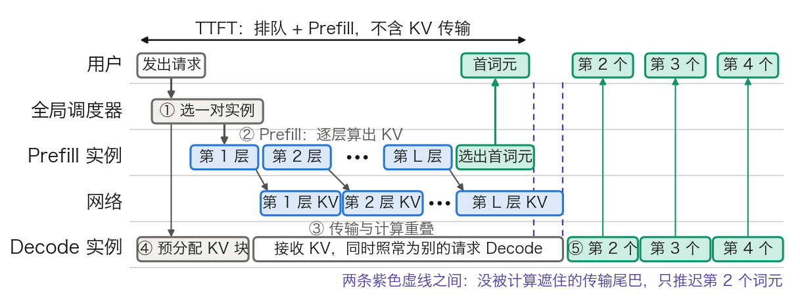

## 11.9 分离式 Prefill-Decode 架构

[11.3 节](11.3_scheduler_loop.md)的分块 Prefill 让长 Prompt 不再独占一次前向，但 Prefill 块与 Decode 词元仍挤在同一张卡的同一步里，争同一份算力和带宽。**分离式推理**（Disaggregated Prefill-Decode）把两个阶段放到两组实例上，中间靠网络搬运 KV 缓存。本节回答三个问题：同卡混跑的代价有多大，搬 KV 要花多久，什么条件下分离才划算。

算例沿用 [3.8.6](../03_components/3.8_gpt_inference_flow.md) 表 3-24 的 Llama 3 70B：80 层、`d_model = 8192`、`n_kv = 8`、`d_h = 128`，权重按 FP16 为 141.1 GB（逐项账见 [11.8.1](11.8_multi_gpu_inference.md)）。一个实例取 4 张 H100 做张量并行（TP4，见 [11.8 节](11.8_multi_gpu_inference.md)），4 卡显存带宽合计 `4 × 3.35 = 13.4 TB/s`。耗时都是上界口径的估算。Decode 按“每步读一遍权重和 KV”计。Prefill 按单卡稠密 BF16 峰值 990 TFLOPS（[10.1 节](../10_inference_optimization/10.1_bottleneck.md)）乘 40% 的利用率假设计，有效算力 `4 × 990e12 × 0.4 ≈ 1.58e15` FLOPs/s。通信与内核效率不计。

### 11.9.1 同卡混跑的代价

单实例架构里，一个请求的 Prefill 和 Decode 在同一组 GPU 上执行，由此带来三个问题：

1. **瓶颈不同**。Prefill 是计算密集型，算力先用满；Decode 是访存密集型，显存带宽先用满（3.8.7 的账）。同一张卡无法同时为两者选最优的批大小与并行度。
2. **延迟互相干扰**。一个 Prefill 块进入某一步，这一步里所有 Decode 请求都要等它算完。
3. **扩容粒度绑死**。长输入压的是 Prefill 算力与 KV 容量，长输出压的是 Decode 带宽与 KV 驻留时间；单实例只能整体加副本，不能只补短板。

**干扰有多大。** 设实例上有 32 条 4K 上下文的序列在 Decode。每个词元的 KV 是 `2 × 80 × 8 × 128 × 2 = 327,680` 字节，即 320 KiB；每条序列 `4096 × 320 KiB ≈ 1.34 GB`。纯 Decode 的一步要读 `141.1 + 32 × 1.34 ≈ 184 GB`，耗时 `184 GB ÷ 13.4 TB/s ≈ 13.7 ms`，其中权重读取 `141.1 ÷ 13.4 ≈ 10.5 ms`，KV 读取 `32 × 1.34 ÷ 13.4 ≈ 3.2 ms`。这就是这 32 个请求的词元间隔（TBT，定义见 [11.13.1](11.13_best_practices.md)）。

现在让一个 2048 词元的 Prefill 块进入同一步。块的计算量约 `2 × 70e9 × 2048 ≈ 2.9e14` FLOPs，耗时 `2.9e14 ÷ 1.58e15 ≈ 181 ms`。这一步的耗时按“块的计算时间加 KV 读取”计：线性层的权重只读一遍，10.5 ms 的读取被 181 ms 的计算遮住；32 条序列的 Decode 注意力要各自读 KV，这 3.2 ms 不与块的矩阵乘法重叠。合计约 184 ms。表 11-27 列出不同块大小的结果。

| 同一步里的 Prefill 块 | 块的计算时间 | 这一步的耗时 | 相对纯 Decode |
| --- | ---: | ---: | ---: |
| 无 | — | 13.7 ms | 1 倍 |
| 512 词元 | 45 ms | 48 ms | 3.5 倍 |
| 2048 词元 | 181 ms | 184 ms | 13.5 倍 |
| 8192 词元 | 724 ms | 727 ms | 53 倍 |
| 32K 词元，不分块 | 3.78 s | 3.78 s | 277 倍 |

表 11-27：Prefill 块与 32 条 4K 序列的 Decode 同批时，一步被拉长多少（Llama 3 70B FP16、4 张 H100、利用率 40% 的上界估算）。“这一步的耗时”= 块的计算时间 + 3.2 ms 的 KV 读取，权重读取被计算遮住；[11.3 节](11.3_scheduler_loop.md)的表 11-6 按 Roofline 取计算与访存的较大值，口径略有不同。512 到 8192 三行只计线性项 `2 × 70e9 × 词元数`，块自身的因果注意力项分别占 0.5%、2%、8%，未计入。32K 一行计入了注意力的平方项：线性部分 `2 × 70e9 × 32768 ≈ 4.59e15`，因果注意力 `2 × 32768² × 8192 × 80 ≈ 1.41e15`，合计约 `6.0e15` FLOPs。

分块 Prefill 只能把干扰切碎，不能消除。若 TBT 上限定为 50 ms，块最大为 `(50 − 3.2) ms × 1.58e15 ÷ 1.4e11 ≈ 530` 词元。一个 32K 的 Prompt 只按线性项要 62 步、约 3.1 秒，比不分块的 2.9 秒多 7%；计入注意力项后块要随前缀变长而缩小，约 81 步、4.05 秒，比不分块的 3.78 秒同样多 7%。分块几乎不拉长 Prefill，代价落在 Decode 上。只要 Prefill 负载不断，每一步都带着块，32 个请求就长期按 50 ms 出词元（每流 20 词元/秒），而不是 13.7 ms（每流 73 词元/秒）。分离式架构要拿回的就是这一段差距。

### 11.9.2 分离后的一次请求：时序与交接

分离式架构把集群划成两个池：Prefill 池只做 Prefill，Decode 池只做 Decode。一个请求依次经过下面五步，图 11-20 给出时间线。

1. **选一对实例**。全局调度器为请求同时选定一个 Prefill 实例和一个 Decode 实例。Mooncake 把这个角色称为 Conductor，选择时兼顾三件事：能复用多少已有的前缀 KV、各实例的负载、TTFT 与 TBT 的 SLO（三个指标的定义见 [11.13.1](11.13_best_practices.md)）。
2. **Prefill**。Prefill 实例对未命中前缀的部分做 Prefill，逐层写出 KV，并由最后一个位置的 logits 选出首词元（3.8.1）。首词元此时即可返回用户。
3. **传输 KV**。KV 从 Prefill 实例搬到 Decode 实例。传输可以与计算重叠：第 ℓ 层的 KV 算完就发出，后面的层继续算。Splitwise 对短 Prompt 整体一次发送，对长 Prompt 逐层发送；Mooncake 则逐层流式写入目的节点。
4. **Decode 侧准入**。Decode 实例先为这个请求分配 KV 块（[11.4 节](11.4_kv_memory_management.md)），KV 收齐后请求进入连续批处理的运行队列。Mooncake 的本地调度器此时会再检查一次 TBT 的 SLO；若负载已变、无法满足，请求被拒绝，已做的 Prefill 作废。
5. **Decode**。此后与单实例无异，每步出一个词元，流式返回。

图 11-20：分离式架构下一个请求的时间线（[生成脚本](https://github.com/yeasy/llm_internals/blob/main/tools/figures/ch11b_disagg_timeline.py)）。逐层传输与 Prefill 计算重叠，用户可见的额外等待只剩“最后几层的 KV 还在路上”这一段，它落在第二个词元上。

两个实现细节决定了这条时间线的形状。

**推还是拉。** Prefill 侧算完就推，Decode 侧可能被突发流量灌满显存。DistServe 改为由 Decode 实例按需拉取，把 Prefill 实例的显存当作排队缓冲；Prefill 实例保留这份 KV 直到被取走，其间照常处理别的 Prefill。

**传输开销落在哪个词元上。** 首词元由 Prefill 侧产生，不受传输影响；第二个词元要等 KV 到齐。Splitwise 的实测是：逐层传输时，未被计算遮住的传输时间在 A100 上约 8 ms、H100 上约 5 ms，第二个词元的延迟增加 16.5%；整体一次发送时增加 64%。

传输失败时 Decode 侧有两种处理。以 vLLM 的 NIXL 连接器为例，`kv_load_failure_policy` 默认取 `fail`，直接让请求报错；取 `recompute` 则由 Decode 实例在本地重算这部分 Prefill。文档对后者给出警告：Decode 实例按低延迟配置，临时插入的 Prefill 会拖慢同批的所有 Decode，等于把 11.9.1 的干扰请了回来。

### 11.9.3 KV 传输要多久，和 Prefill 比贵不贵

**公式。** 传输时间等于 KV 字节数除以链路带宽，KV 字节数等于词元数乘每词元 KV 字节：

$$
t_{\text{传}} = \frac{T \times 2 \times L \times n_{kv} \times d_h \times \text{字节}}{W_{\text{net}}}
$$

**算例。** 32K 词元的 Prompt，Llama 3 70B：`32768 × 327,680 ≈ 10.7 GB`，即 10 GiB（FP16）；KV 用 FP8 存放则为 5 GiB。表 11-28 给出不同链路上的理想线速时间。

| 链路 | 单向带宽 | FP16 KV（10.7 GB） | FP8 KV（5.4 GB） |
| --- | ---: | ---: | ---: |
| 10 GbE | 1.25 GB/s | 8.6 s | 4.3 s |
| 100 GbE | 12.5 GB/s | 0.86 s | 0.43 s |
| 400 Gb/s InfiniBand，1 口 | 50 GB/s | 215 ms | 107 ms |
| 400 Gb/s InfiniBand，4 口并行 | 200 GB/s | 54 ms | 27 ms |
| 节点内 NVLink（H100，单向 450 GB/s） | 450 GB/s | 24 ms | 12 ms |

表 11-28：32K 词元的 KV 在不同链路上的传输时间，按理想线速计，未计协议开销。H100 的 NVLink 标称 900 GB/s 为双向合计，单向取一半。

**与 Prefill 本身比。** 同一个 32K 的 Prompt，Prefill 计算量约 `6.0e15` FLOPs（表 11-27 的注），4 张 H100 约 3.78 秒。单口 400 Gb/s 传 FP16 的 KV 要 215 ms，占 Prefill 的 5.7%；TP4 的四张卡各走一口网卡时是 54 ms，占 1.4%。换成 10 GbE 则是 8.6 秒，超过 Prefill 的两倍，分离的收益被传输吃光。DistServe 在 OPT-175B 上的实测与这个量级一致：KV 传输不到总延迟的 0.1%，95% 以上的请求传输时间低于 30 ms。

**速率判据。** 更通用的判据是比速率，不比单次时间。Prefill 实例每秒产生多少字节的 KV，网络就要每秒搬走多少：

$$
W_{\text{net}} \ge \text{Prefill 吞吐（词元/秒）} \times \text{每词元 KV 字节}
$$

本例 Prefill 吞吐约 `1.58e15 ÷ 1.4e11 ≈ 11,300` 词元/秒，乘 327,680 字节，约 3.7 GB/s，即 30 Gb/s。10 GbE 不够，100 GbE 有 3 倍余量，400 Gb/s 有 13 倍余量。链路速率高于这个值，逐层传输就能跟上计算，用户只会在末尾看到几毫秒的尾巴。DistServe 用同一种算法说明过这一点：OPT-66B 不用 GQA，512 词元的 KV 就有 1.13 GiB，10 请求/秒时要 90 Gbps 才能让传输不可见。

由此也能看出哪些模型结构天然适合分离。每词元 KV 字节越小，对网络的要求越低。Llama 3 70B 靠 GQA 降到 320 KiB。DeepSeek-V3 靠 MLA（[10.2 节](../10_inference_optimization/10.2_kv_cache.md)）每层只存 `512 + 64 = 576` 个数，61 层、BF16 合 `576 × 61 × 2 = 70,272` 字节，约 69 KiB，不到前者的四分之一；32K 词元只有 2.3 GB。

**工程手段。** 生产系统用下面几类做法压低传输开销：

- **RDMA 与 GPU 直通**：用 InfiniBand、RoCE 或节点内 NVLink，让数据从一侧显存直达另一侧显存，不经过 CPU 内存拷贝和内核协议栈。DistServe 在跨节点带宽不足的集群上，要求 Prefill 与 Decode 实例的同一流水段落在同一台机器里，KV 走节点内的 NVLink；上文“95% 低于 30 ms”的实测就出自这种放置。
- **逐层或分块流式传输**：见 11.9.2 的第 3 步，用计算时间遮住传输时间。
- **压缩 KV**：FP8 的 KV 让传输量减半；近期词元保留高精度、较早词元压到低精度的混合方案同理，收益按压缩比折算（KV 量化见 [10.4 节](../10_inference_optimization/10.4_quantization.md)）。
- **前缀 KV 池**：常见前缀的 KV 预先放在可共享的存储里，新请求只算、只传增量。Mooncake 用各节点的 CPU 内存和 SSD 组成全局 KVCache 池，Prefill 实例先从池里把命中的前缀载入显存，再对剩余部分做增量 Prefill。前缀复用的机制见 [11.5 节](11.5_prefix_reuse.md)。

### 11.9.4 两个池各配多少卡

分离之后，两个池的规模要按流量分别算。算错配比，一侧排队、另一侧空转，这是分离式架构最主要的运维代价。

**Prefill 池。** 单个请求占满一个实例，实例近似一个先到先服务的单服务台队列。DistServe 用 M/D/1 队列给出平均 TTFT，其中 D 是单请求的 Prefill 时间，R 是到达率，`RD` 是利用率：

$$
\text{TTFT}_{\text{avg}} = D + \frac{R D^{2}}{2\,(1 - R D)}
$$

第二项是排队时间，利用率趋近 1 时发散。因此 Prefill 实例不能按满负荷规划。

**Decode 池。** 约束是 KV 容量。在途序列数由 Little 定律给出：在途数 = 到达率 × 每请求的 Decode 时长 = 到达率 × 输出长度 × 每步耗时。在途数除以单实例能容纳的序列数，就是实例数。

**算例。** 到达率 10 请求/秒，平均输入 4000 词元、输出 500 词元。

- Prefill：单请求计算量 `2 × 70e9 × 4000 + 2 × 4000² × 8192 × 80 ≈ 5.8e14` FLOPs，`D ≈ 0.367 s`。利用率上限取 0.7，每实例可承接 `0.7 ÷ 0.367 ≈ 1.91` 请求/秒，需要 `⌈10 ÷ 1.91⌉ = 6` 个实例。此时实际利用率 0.61，平均 TTFT 为 `0.367 + 0.61 × 0.367 ÷ (2 × 0.39) ≈ 0.655 s`。
- Decode：KV 池为 `4 × 80 × 0.9 − 141.1 − 20 ≈ 127 GB`（显存利用率 0.9，每卡留 5 GB 工作区）。一条序列在途期间的平均长度是 `4000 + 500 ÷ 2 = 4250` 词元，合 1.39 GB，满池 `127 ÷ 1.39 ≈ 91` 条（向下取整）。满池时一步读 `141.1 + 127 ≈ 268 GB`，约 20 ms，每流 50 词元/秒。在途数 `10 × 500 × 0.020 = 100` 条，需要 `⌈100 ÷ 91⌉ = 2` 个实例。

配比是 6 : 2。把流量换成输入 500、输出 2000，同样的算法得到 Prefill `D ≈ 0.044 s`、1 个实例即可；Decode 每条平均 1500 词元、合 0.49 GB，满池 `127 ÷ 0.49 ≈ 258` 条，在途 `10 × 2000 × 0.020 = 400` 条，需要 2 个实例。配比翻成 1 : 2。

流量形态一变，最优配比就跟着变，固定配比迟早失衡。Mooncake 的公开实验给出了失衡的样子。同样 4 个实例，3 个 Prefill 加 1 个 Decode 的配置在满足 SLO 的前提下吞吐高于 vLLM 基线。2 加 2 的配置 TBT 更低，TTFT 却不如前者，也不如基线，论文给的原因正是两侧负载不均。生产系统因此需要能在运行时增减两侧的实例数；NVIDIA Dynamo 称之为运行时可重配置的 xPyD。

**收益的来源。** DistServe 的图 1 是一个干净的例子：13B 模型、单张 A100，合置时满足 SLO 的最大到达率是 1.6 请求/秒；只做 Prefill 的卡可达 5.6，只做 Decode 的卡可达 10。配 2 张 Prefill 加 1 张 Decode，三张卡共 10 请求/秒，每卡 3.3，是合置的 2.1 倍。这里的收益以 **Goodput**（满足 SLO 的最大到达率，见 [11.13.2](11.13_best_practices.md)）计，不是原始吞吐。

**选卡。** 两个池买的不是同一种资源。Prefill 受算力约束，买的是 FLOPS；Decode 受访存约束，买的是显存带宽与容量。[11.12 节](11.12_hardware.md)的表 11-35 里，H100 与 H200 的稠密算力同为约 990 TFLOPS。H200 的升级全部落在显存上：80 GB、3.35 TB/s 变为 141 GB、4.8 TB/s。这部分溢价对 Prefill 几乎不兑现，对 Decode 直接兑现：把 H200 投给 Decode 池，Prefill 池用算力达标的卡即可。Splitwise 由此更进一步，主张 Decode 不需要最新一代的算力，可以用上一代的卡或限功耗运行，其异构方案用 H100 做 Prefill、A100 做 Decode。

这条法则针对的是同代之内的溢价。B200 相对 H100，稠密算力 2250 对 990 TFLOPS，带宽 8 对 3.35 TB/s，两样同时翻倍有余，两个池都适用；这时要比的是单位成本下各自的算力与带宽（算法见 [11.12.7](11.12_hardware.md)）。L40S 这类卡显存 48 GB、带宽 864 GB/s，只适合较小的模型。

### 11.9.5 什么时候不该分离

分离不是免费的：多一次 KV 传输，多一层调度，而且 Prefill 池的显存不参与 Decode。下面几种情形，合置加分块 Prefill 更好。

- **并发很低**。两个池各自都有空转，合置实例没有传输和池间碎片的开销。
- **要的是吞吐而不是尾延迟**。vLLM 文档对这一点说得很直接：分离式 Prefill 不提升吞吐，它的用处是分别调 TTFT 与词元间隔，并压住词元间隔的尾部。
- **Decode 侧的 KV 容量才是瓶颈**。此时把 GPU 划给 Prefill 池，总服务能力反而下降，除非延迟上的收益抵得过这些 GPU。
- **网络达不到 11.9.3 的速率判据**。

**条件分离。** 同一个集群里，不同请求可以走不同路径。**条件分离**（Conditional Disaggregation）由路由器逐请求决定走哪条。一条是“Prefill 实例 → Decode 实例”；另一条是直接发给 Decode 实例，由它在本地做完 Prefill 再 Decode。NVIDIA Dynamo 的判据可以概括为三条：

- **看有效输入长度**。有效输入长度 = Prompt 长度 − 所选 Decode 实例上已缓存的前缀长度。它低于一个绝对阈值，且占 Prompt 长度的比例低于一个比例阈值时，在 Decode 实例本地做 Prefill（`isl_bounding` 策略）：要算的很少，11.9.1 的干扰很小，还省掉一次传输。多轮对话和智能体负载的前缀大多已在 Decode 实例上，最适合这条路径。
- **看 Prefill 池是否繁忙**。所选 Prefill 实例的负载超过阈值时改走本地（`prefill_load` 策略）；`isl_or_load` 策略把这一条与有效输入长度的条件取或。
- **看 Decode 实例是否繁忙**。所选 Decode 实例的 KV 占用超过阈值时，不再往它身上加本地 Prefill，请求回到远端 Prefill 的常规路径。

阈值必须按自己的流量分布调，文档建议以有效输入长度的分位数为起点。Dynamo 的架构文档同时提醒，Prefill 的饱和点随模型、量化、GPU 和长度分布变化，不应写死成一个通用的词元数。

**判据小结。** 分离划算，需要同时满足四个条件。TBT 的 SLO 紧到分块 Prefill 也压不住（表 11-27）。网络速率高于 Prefill 的 KV 产生速率并留有数倍余量。规模足够大，两个池各自都能保持较高利用率。流量形态稳定，或有能力动态调整配比。

### 11.9.6 两侧用不同的并行度

分离之后，两个池可以各选并行策略，Prefill 与 Decode 的张量并行度不必相同。vLLM 的连接器兼容性文档把这种配置记作 Hetero TP。

**各自偏好什么。** Decode 每步要读完整的权重，加大 TP 等于把带宽和显存成倍加起来，KV 池也更大，能容纳更多在途序列。Prefill 的情形取决于负载。DistServe 用上面的 M/D/1 公式比较了两种 2 路并行。到达率低时，执行时间是主项，层内并行（张量并行）把 D 缩短到 `D/K`（`1 < K < 2`，通信使加速不完美），TTFT 更低。到达率高时，排队是主项，层间并行（流水线并行）把服务率近似翻倍，反而更优。“Prefill 用低 TP、Decode 用高 TP”因此只是常见结果，不是定则。

**KV 要重新分片。** 张量并行按头切分 KV（[11.8.5](11.8_multi_gpu_inference.md) 的表）：Llama 3 70B 在 TP4 下每卡 2 个 KV 头、每词元 80 KiB，TP8 下每卡 1 个头、40 KiB。Prefill 用 TP4、Decode 用 TP8 时，Prefill 侧每张卡上的 KV 要按头拆成两半，分别发往 Decode 侧的两张卡；传输层因此必须知道两侧的切分方式，KV 在块内的维度排列也要允许按头切开。TP 超过 `n_kv` 后 KV 头只能复制，Decode 侧靠加大 TP 扩 KV 池的做法以 `n_kv = 8` 为上限。MLA 的压缩 KV 不分头，每张卡各存一份完整副本，两侧 TP 不同也无须拆头，接收侧只读一份即可。

**专家并行在两个阶段的差别。** MoE 模型还要选专家并行度。两个阶段的路由规则相同，都是逐词元独立选专家；差别在每一步的词元数。按 [11.8.7](11.8_multi_gpu_inference.md) 的账，DeepSeek-V3 每个词元过一遍 58 个 MoE 层要搬约 10 MB。Prefill 一步处理 32K 词元，全组要搬 300 GB 以上，受带宽约束；Decode 一步若只有 256 个词元，总量约 2.6 GB，却分成 116 次 all-to-all，每次消息很小，受延迟约束。

DeepSeek-V3 技术报告公开的部署正是按这一差别分别设计的，见表 11-29：

| 项目 | Prefill | Decode |
| --- | --- | --- |
| 最小部署单元 | 4 节点、32 张 GPU | 40 节点、320 张 GPU |
| 注意力部分 | TP4 加序列并行，DP8 | TP4 加序列并行，DP80 |
| MoE 部分 | EP32 | EP320，每卡只放 1 个专家 |
| 冗余专家 | 32 个，每卡在原有 8 个专家之外多放 1 个 | 64 张卡专门承载冗余专家与共享专家 |
| all-to-all 路径 | 跨节点走 IB，节点内走 NVLink 转发 | 经 IB 点对点直连，并用 IBGDA 压低延迟 |

表 11-29：DeepSeek-V3 技术报告 3.4 节公开的推理部署单元。

第一，EP32 与 EP320 的取舍见 11.8.7 的“访存的账”：Prefill 要让每个专家分到足够大的批，Decode 要让每张卡只读一个专家的权重。第二，两侧的注意力都只用 TP4。Prefill 侧报告给的理由是小 TP 限制通信开销；Decode 侧同样取 TP4，且 MLA 的 KV 在 TP 组内每卡各存一份（11.8.5），加大 TP 也扩不了 KV 池。第三，冗余专家（11.8.7）按线上统计的专家负载定期调整（报告举例为每 10 分钟一次），把高负载专家多放几份，否则最忙的那张卡决定整步的耗时。

### 11.9.7 对到实现

- **vLLM**：分离式 Prefill 的实现是两个 vLLM 实例加一个连接器（connector）。启动参数 `--kv-transfer-config` 里，`kv_connector` 选连接器，`kv_role` 取 `kv_producer`（Prefill 实例）或 `kv_consumer`（Decode 实例）。连接器分成两半：与调度器同进程的一半决定传哪些块，各 worker 进程里的一半执行传输，并与注意力层配合实现逐层存取。请求级的交接信息放在 `kv_transfer_params` 里，如 `do_remote_decode`、`do_remote_prefill`。文档标明该特性仍为实验性质。
- **NVIDIA Dynamo**：路由由 `PrefillRouter` 编排，KV 经 NIXL 在两侧显存之间直传，由它选用 NVLink、InfiniBand 等可用的传输。各后端的交接元数据不同：vLLM 传块 ID 与远端连接信息，SGLang 传用于 RDMA 握手的 `bootstrap_info`。
- **Mooncake**：全局调度器 Conductor、每节点一个负责传输的 Messenger 进程，以及由 CPU 内存和 SSD 组成的 KVCache 池。过载时采用基于预测的早拒绝，见 [11.13.4](11.13_best_practices.md)。

连接器清单、参数名与默认阈值变化很快，以各项目当前文档为准。
