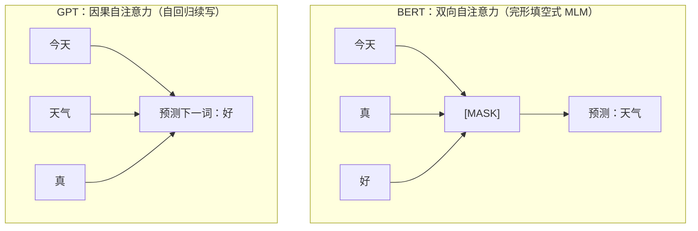
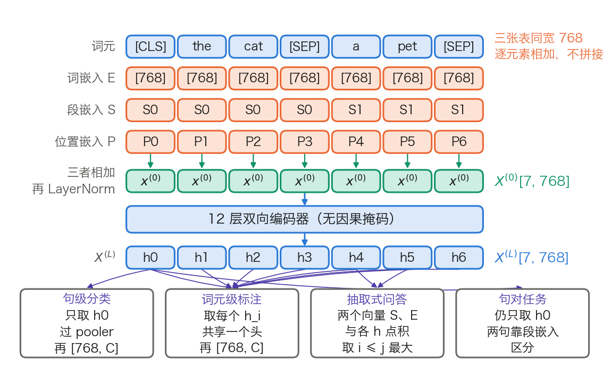

## 12.1 BERT：双向理解的突破

[5.2 节](../05_pretraining/5.2_masked_lm.md)讲清了掩码语言模型的目标与损失，但没有讲承载这个目标的模型长什么样：输入怎样拼、参数量怎样凑到 110M、微调时那个“任务相关的输出层”接在哪一个位置。本节补上这三件事，并给出一组可复核的参数量与计算量。读完应能对着 Hugging Face 的 `BertModel` 逐个模块认出它们，并说明 BERT 为什么不能拿来生成文本。

BERT（Bidirectional Encoder Representations from Transformers）出自 Google 2018 年的[论文](https://arxiv.org/abs/1810.04805)，把 Transformer 编码器与掩码预训练组合成一套可迁移的理解模型。

### 12.1.1 双向与因果：可见范围的差别

BERT 的自注意力不加因果掩码，每个位置都可以读全序列；GPT 的每个位置只能读自己和左边（见 [2.4 节](../02_attention/2.4_self_cross_causal.md)）。图 12-1 用同一句话对比两者的可见范围。

图 12-1：同一句话下，BERT 的被遮位置可同时利用左右上下文，GPT 预测下一词只能利用左侧上下文。

这条差别落到矩阵上只有一处：3.8.4 第 4 步的因果掩码 M 被去掉，`[T, T]` 的分数矩阵不再是下三角而是满阵。代价在 12.1.7 给出：没有因果结构，就没有可复用的 KV 缓存。

### 12.1.2 输入怎样构造：三张嵌入表与两个特殊词元

模型收到的不是一句话，而是一条词元序列加三张查表结果。单句写成 `[CLS] A [SEP]`，句对写成 `[CLS] A [SEP] B [SEP]`。`[CLS]` 固定排在第一位，它那一行的最终隐状态是句级任务的取向量处；`[SEP]` 是分隔符。分词用 WordPiece，论文口径是 30,000 个词元的词表，发布权重的 `vocab_size` 是 30,522。

每个位置查三张表再相加，不是拼接：

- **词嵌入**（token embedding）：按词元 ID 取一行，形状 `[30522, 768]`。
- **段嵌入**（segment embedding）：只有两行，标记该位置属于句 A 还是句 B，形状 `[2, 768]`。
- **位置嵌入**（position embedding）：可学习的绝对位置表，形状 `[512, 768]`，与 3.3 节的正弦方案和第四章的 RoPE 是三条不同路线。

三者逐元素相加，再过一次 LayerNorm，得到进入第 1 层的 `X⁽⁰⁾[T, 768]`。图 12-2 上半幅把这条链画在一条 7 个词元的句对上，下半幅是 12.1.5 要讲的四类任务头。

图 12-2：BERT 的输入怎样构造，以及四类任务头各自从哪些位置取向量（[生成脚本](https://github.com/yeasy/llm_internals/blob/main/tools/figures/ch12_bert_io.py)）。橙色是训练好就固定的权重表，蓝色是随输入变化的数据，青绿是本步新算出的表示；配色沿用 3.8 节。

三张表同宽 768，所以相加后宽度不变。段嵌入只有两行，意味着 BERT 天然只能区分两段；三段以上的输入要么截断，要么改用别的分隔约定。

### 12.1.3 模型规格与参数量：逐项算到 110M

论文给出两档规格。表 12-1 在层数、宽度、头数之外补上前馈宽度、每头宽度、词表与位置上限，并列出 Hugging Face `BertConfig` 里对应的键名，方便对着 `config.json` 读。

| 项目 | 配置键 | BERT-Base | BERT-Large |
| --- | --- | ---: | ---: |
| 层数 L | `num_hidden_layers` | 12 | 24 |
| 隐藏宽度 H | `hidden_size` | 768 | 1,024 |
| 注意力头数 A | `num_attention_heads` | 12 | 16 |
| 每头宽度 H/A | — | 64 | 64 |
| 前馈中间层宽度 | `intermediate_size` | 3,072 | 4,096 |
| 词表 | `vocab_size` | 30,522 | 30,522 |
| 位置表行数 | `max_position_embeddings` | 512 | 512 |
| 段嵌入行数 | `type_vocab_size` | 2 | 2 |
| 论文口径参数量 | — | 110M | 340M |

表 12-1：BERT 两档规格与对应的配置键。层数、宽度、头数与参数量取自 [BERT 论文](https://arxiv.org/abs/1810.04805)第 3 节，该节同时规定前馈宽度为 `4H`，即 `H = 768` 时 3,072、`H = 1024` 时 4,096；词表与位置上限取自 `google-bert/bert-base-uncased` 的 `config.json`。

110M 不必当成一个记住的结论。把表 12-1 代进 Post-LN 编码器的结构，可以逐项加出来。嵌入侧有四项：

$$
30522 \times 768 + 512 \times 768 + 2 \times 768 + 2 \times 768 = 23{,}837{,}184
$$

前两项是词表和位置表，第三项是段嵌入，第四项是嵌入层 LayerNorm 的两组参数。每一层有四项：

$$
\underbrace{4(768^2 + 768)}_{\text{Q/K/V/输出投影}} + \underbrace{768 \times 3072 + 3072}_{\text{前馈上投影}} + \underbrace{3072 \times 768 + 768}_{\text{前馈下投影}} + \underbrace{4 \times 768}_{\text{两个 LayerNorm}} = 7{,}087{,}872
$$

把这三块加起来，再补上 pooler 的 `768² + 768 = 590,592`：

| 组成 | 形状来源 | 参数量 | 占比 |
| --- | --- | ---: | ---: |
| 嵌入侧（词 + 位置 + 段 + LayerNorm） | `[30522, 768]` 等四项 | 23,837,184 | 21.8% |
| 编码器 12 层 | `12 × 7,087,872` | 85,054,464 | 77.7% |
| pooler | `[768, 768]` + 偏置 | 590,592 | 0.5% |
| 合计 | — | 109,482,240 | 100% |

表 12-2：BERT-Base 的参数量逐项。三行都由上面两个式子算出，可用计算器复核。同法把 `H = 1024`、`L = 24`、前馈 4,096 代进去，BERT-Large 得 335,141,888，与论文口径的 340M 差约 5M；论文给的是约数，逐项相加时不必硬凑。

这三个数可以和发布权重对账。`google-bert/bert-base-uncased` 是预训练权重，除本体外还带着两个预训练头，把下一小节的 MLM 头 622,650 与 NSP 头 `2 × 768 + 2 = 1,538` 加上，得 110,106,428，与该仓库张量元数据里的参数总数分毫不差。BERT-Large 同法得 336,226,108，同样对得上。

两条结论从表 12-2 直接读出。其一，嵌入表占了 Base 参数量的 21.8%，而它只是一张查找表、不参与任何矩阵乘法，这正是 [12.2.2 节](12.2_roberta_albert.md)里 ALBERT 要把它分解掉的动机。其二，把同一条每层公式套到 GPT-3 Small 上，`12 × 7,087,872 = 85,054,464` 一字不改，再加上 `50257 × 768 + 2048 × 768 = 40,170,240` 的词表与位置表（2,048 是 GPT-3 的上下文上限，见 [3.8.6 节](../03_components/3.8_gpt_inference_flow.md)），得 125,224,704，正是 GPT-3 论文的 125M。BERT-Base 与 GPT-3 Small 的躯干形状完全相同（对照 3.8.3 的表 3-17），差别只在掩码、位置方案与词表大小。

### 12.1.4 预训练：MLM 头的形状与 NSP 的失效

预训练目标有两个，损失是两项之和。掩码语言模型的比例、80/10/10 的改写与信号密度已在 [5.2 节](../05_pretraining/5.2_masked_lm.md)算过，这里只补模型侧的形状。

**MLM 头。** 编码器交出 `X⁽ᴸ⁾[T, 768]` 后，先过一个同宽的变换，再投回词表。按 3.8.3 的写法，两步是：

- 同宽变换：`X⁽ᴸ⁾[T, 768] × W₁[768, 768] → [T, 768]`，再逐元素过 GELU 与 LayerNorm。
- 投回词表：`[T, 768] × Eᵀ[768, 30522] → logits[T, 30522]`。

第二步的矩阵与词嵌入表共享权重，只额外学一个 `[30522]` 的偏置。于是 MLM 头新增的参数只有

$$
(768^2 + 768) + 2 \times 768 + 30522 = 622{,}650
$$

约为模型本体的 0.6%。在 `transformers` 里这三段分别是 `cls.predictions.transform.dense`、`cls.predictions.transform.LayerNorm` 和 `cls.predictions.decoder`。全部 T 个位置都算出 logits，只有被选中的约 15% 参与损失，其余丢弃。

**NSP 的构造。** 取两段文本 A 与 B，50% 的样本里 B 是 A 在原文中的下一段，标为 `IsNext`；另外 50% 从语料中随机抽一段，标为 `NotNext`。判别用 `[CLS]` 经 pooler 后接一个 `[768, 2]` 的线性层，即 `cls.seq_relationship`。

这个任务太容易。论文自己报告最终模型在 NSP 上达到 97% 到 98% 的准确率：随机抽来的负例多半来自完全不同的主题，靠词面主题就能分辨，模型并不需要学会句间连贯性。RoBERTa 的消融给出了后果：去掉 NSP 损失、改用同一文档内连续采样的 FULL-SENTENCES 之后，MNLI-m 从 84.0 升到 84.7，SQuAD 2.0 从 78.7 升到 79.1，即“持平或略升”，而不是“贡献为零”。[12.2.2 节](12.2_roberta_albert.md)里 ALBERT 的 SOP 是另一种回应：不换掉句间任务，而是把它变难。

**训练量。** 论文的配置是批 256 条序列、每条 512 个词元、训练 100 万步，即每批 128,000 个词元，按全程 512 计约 `1.31 × 10¹¹` 个词元位置，相当于在 33 亿词的语料上过约 40 遍。实际排布并非全程 512：论文附录 A.2 说明前 90% 的步数用的是 128 的长度，只有末 10% 用 512，按此重算只有 `4.26 × 10¹⁰`（见 [5.2.5 节](../05_pretraining/5.2_masked_lm.md)）。两个口径在 12.2.1 对比 RoBERTa 时都要用到。

### 12.1.5 微调：四类任务头各从哪里取向量

微调只做两件事：在 `X⁽ᴸ⁾` 之上接一个很小的输出层，然后让全部参数一起更新。差别全在“从哪一行取向量”，图 12-2 的下半幅画的就是这个。

- **句级分类**（情感、自然语言推理）：取位置 0 的 `h₀`，过 pooler 的 `Dense(768→768) + tanh`，再接 `[768, C]`。C 是类别数，新增参数只有 `768C + C`。
- **词元级标注**（命名实体识别、词性标注）：取每个位置的 `hᵢ`，共用一个 `[768, C]` 的头，不经 pooler。
- **抽取式问答**：新增两个向量 `S, E ∈ R⁷⁶⁸`。答案起点的分布是 `softmax_i(S · hᵢ)`，终点同理用 `E`；预测答案取使 `S · hᵢ + E · hⱼ` 最大且满足 `i ≤ j` 的一对。新增参数只有 `2 × 768 = 1,536`。
- **句对任务**：输入拼成 `[CLS] A [SEP] B [SEP]`，靠段嵌入区分两句，仍从 `h₀` 取向量。两句在第 1 层就开始相互读取，这一点在 [12.3.6 节](12.3_longformer_bigbird.md)会成为“交叉编码器”的定义。

任务头小到可以忽略：四类里最大的一个也不到 100 万参数，占 110M 的不足 1%。真正被更新的是那 109M 个预训练参数。这套做法在发布时刷新了 11 项任务的成绩，覆盖 GLUE 的各子任务、SQuAD v1.1 与 v2.0、SWAG。GLUE 本身是一个含多项任务的基准集，不应与“11 项”并列计数。

### 12.1.6 为什么是深层双向

“双向更好”这句话要放回它当时的对照组里才有意义。表 12-3 把四条路线按上下文、监督密度、能否生成三项并排。

| 路线 | 每个位置看到的上下文 | 每条序列的监督位置 | 能否增量生成 | 主要代价 |
| --- | --- | --- | --- | --- |
| ELMo（两个单向 LSTM 拼接） | 两个方向各自完整，但从不在同一层交互 | 全部位置 | 能（按单向模型用） | 浅层双向，表达力弱于深层双向 |
| GPT-1（单向 Transformer） | 只有左侧 | 全部位置，512 长度下 511 个 | 能，KV 缓存成立 | 理解任务上拿不到右侧上下文 |
| BERT（深层双向编码器） | 左右同时，逐层交互 | 只有被遮的约 15%，512 长度下约 77 个 | 不能 | 监督密度低，且预训练见 `[MASK]`、微调不见 |
| XLNet（置换语言模型） | 按采样出的顺序看到部分上下文 | 约 `1/K` 的位置，论文取 `K = 6`，512 长度下约 85 个 | 能 | 监督密度与 BERT 同量级，额外还要双流注意力 |

表 12-3：四条预训练路线的对照。监督位置数的算法见 [5.2.5 节](../05_pretraining/5.2_masked_lm.md)；ELMo 与深层双向的比较出自 [BERT 论文](https://arxiv.org/abs/1810.04805)第 1 节；XLNet 的 `K` 出自 [XLNet 论文](https://arxiv.org/abs/1906.08237)第 2.3 节与附录 A.4.1 的超参表。

表里只有 GPT-1 真的在全部位置上计损失。XLNet 同样只监督一个子集：为降低置换目标的优化难度，它只预测因式分解顺序里靠后的那部分词元，比例由超参 `K` 定，预训练取 `K = 6`，即约 1/6。论文第 2.6 节把两者并列称为 partial prediction。XLNet 换来的是去掉被遮位置之间的条件独立假设，不是更高的监督密度。

BERT 用监督密度换上下文：每次前向只在约 77 个位置上拿到梯度，自回归同长度能拿到 511 个。论文附录 C.1 的消融给出了这笔交换的实测结果：MLM 的收敛确实比从左到右的模型略慢，但绝对成绩几乎立刻反超。原因不难理解，77 个监督信号里每一个都用到了双向上下文，携带的约束更强。

### 12.1.7 边界与常见误解

**不能生成，根因不是“不是自回归”。** MLM 在被遮的各个位置上做的是条件独立的预测。对 `New [MASK] [MASK]`，两个位置各自最大化自己的边缘概率，模型没有建模它们的联合分布，因此可能一个位置填 `York`、另一个填 `Jersey`。要按自回归的方式逐个填，每填一个就得把整段重算一次。

**没有可复用的 KV 缓存。** 双向注意力下，序列末尾追加一个词元会改变所有位置的 Key 与 Value，缓存里的旧行全部失效。解码器能复用缓存，靠的正是“每个位置从不读右边”（见 [3.8.5 节](../03_components/3.8_gpt_inference_flow.md)）。这是 12.3.7 节里编码器推理特性的来源，也是它不适合逐词生成的工程理由。

**512 是硬上限，不是“效果变差”。** 位置嵌入表只有 512 行，第 513 个位置查不到向量，前向会直接越界。要支持更长的输入，必须先把这张表加长，[12.3 节](12.3_longformer_bigbird.md)的 Longformer 正是这样做的。

**未经微调的 `[CLS]` 不是句向量。** 这是最常见的误用。Sentence-BERT 的实测是：七个语义相似度数据集上，直接取原始 BERT 的 `[CLS]` 向量做余弦相似度，平均相关系数只有 29.19；对所有位置取平均是 54.81；而平均 GloVe 词向量能到 61.32。原因在 12.3.6 展开：`[CLS]` 是为 NSP 这个二分类任务优化的，不是为“相似句子靠得近”优化的。

**预训练与微调的输入分布不一致。** `[MASK]` 只在预训练出现，80/10/10 只是缓解，没有消除。ELECTRA 的消融量化了这笔账：把 `[MASK]` 换成生成器采样的真词后，GLUE 从 82.2 升到 82.4，提升很小（见 [12.2.3 节](12.2_roberta_albert.md)的表 12-6）。

**对到实现。** `BertModel` 的模块树是：`embeddings.{word,position,token_type}_embeddings` 与 `embeddings.LayerNorm`；`encoder.layer[i].attention.self.{query,key,value}`、`encoder.layer[i].attention.output.dense`、`encoder.layer[i].intermediate.dense`、`encoder.layer[i].output.dense`；以及 `pooler.dense`。归一化是 Post-LN（见 [3.6 节](../03_components/3.6_layer_norm.md)），激活是 GELU（见 [3.4 节](../03_components/3.4_feedforward.md)），位置是可学习的绝对位置表。这三项在 [12.3.5 节](12.3_longformer_bigbird.md)会被 ModernBERT 逐条替换掉。
