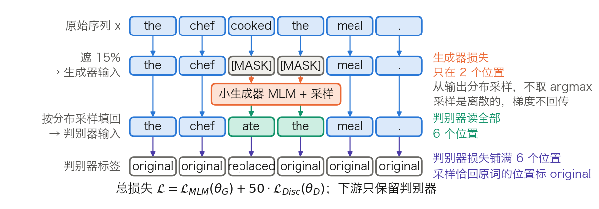

## 12.2 RoBERTa、ALBERT 与 ELECTRA：BERT 的改进之路

12.1 把 BERT 的账留在了台面上：NSP 太容易、MLM 只在约 15% 的位置上计损失、嵌入表占掉两成多参数、序列长度卡在 512。本节处理前三项，512 那一条留给 [12.3 节](12.3_longformer_bigbird.md)。三条改进落在三条互不相干的轴上：RoBERTa 改训练配方，ALBERT 改参数的存放方式，ELECTRA 改预训练目标。读完应能说出每条改动动了哪一笔开销，以及它各自没有解决什么。

### 12.2.1 RoBERTa：把同一个架构训练充分

[RoBERTa](https://arxiv.org/abs/1907.11692)（Liu 等人，2019 年）一个模块都没改，只改训练配方。表 12-4 把两者并排。

| 项目 | BERT | RoBERTa | 改动带来什么 |
| --- | --- | --- | --- |
| 批大小 | 256 条序列 | 8,192 条序列 | 梯度估计更稳，可用更大的学习率 |
| 训练步数 | 1,000,000 | 500,000 | 见下文的词元总量算例 |
| 预训练数据 | 16 GB | 160 GB | 数据不再是重复过 40 遍的同一批 |
| 遮盖 | 静态，预处理时定好 | 动态，每次送进模型时现场生成 | 同一条序列不再反复做同一道填空 |
| 句间任务 | NSP，输入是两个片段 | 无 NSP，输入是连续采样的 FULL-SENTENCES | 去掉一个太容易的任务 |
| 分词 | WordPiece，词表 30K | 字节级 BPE，词表 50K | 不再产生未登录词，代价是参数变多 |

表 12-4：BERT 到 RoBERTa 的配方对照。批大小与步数取自 [RoBERTa 论文](https://arxiv.org/abs/1907.11692)第 5 节的汇总表（最终配置为 160 GB 数据、批 8K、50 万步），数据量与词表取自第 3.2 与 4.4 节。分词一行的两个口径指同一件事：BERT 论文第 3 节称其为 WordPiece，RoBERTa 第 4.4 节把它描述为“字符级 BPE，词表 30K”，都是 12.1.2 那张 30,522 行的表。

**训练词元总量。** 配方的差别用一个数就能收拢：批大小 × 序列长 × 步数。按每条序列 512 个词元估算，

$$
\text{BERT} = 256 \times 512 \times 10^6 = 1.31 \times 10^{11}
$$

$$
\text{RoBERTa} = 8192 \times 512 \times 5 \times 10^5 = 2.10 \times 10^{12}
$$

相差 16 倍。这是按 BERT 全程 512 计的口径。BERT 论文附录 A.2 说明前 90% 的步数实际用的是 128 的长度，按真实排布只有 `4.26 × 10¹⁰`（见 [5.2.5 节](../05_pretraining/5.2_masked_lm.md)）；RoBERTa 第 3.1 节则特意声明不用缩短的序列、全程满长度。按两边各自的真实排布，差距接近 49 倍。论文自己给了等价换算：BERT 的“批 256、100 万步”在计算量上等于“批 8K、3.1 万步”，而 RoBERTa 跑的是 50 万步。所以“训练更充分”不是修辞，是几十倍的计算预算。

**静态与动态遮盖。** 原版 BERT 在预处理阶段一次性生成遮盖并写进文件。为免每一遍都做同一道题，它把数据复制了 10 份、各遮一种，于是 40 遍训练中每种遮盖各被看到 4 次。RoBERTa 改为每次把序列送进模型时现场采样。这项改动是免费的，收益也小：论文表 1 的三列结果是 SQuAD 2.0 从 78.3 升到 78.7、MNLI-m 从 84.3 降到 84.0、SST-2 从 92.5 升到 92.9，论文的措辞是“相当或略好”。真正的理由是数据集更大、步数更多时，静态副本的重复率会变得无法接受。

**词表变大带来的参数量。** 换成 50,265 行的字节级 BPE 词表后，嵌入表从 `30522 × 768` 变成 `50265 × 768`，同时 `type_vocab_size` 从 2 降到 1、`max_position_embeddings` 从 512 变成 514。按 12.1.3 的同一套公式重算：

$$
\text{RoBERTa-base} = 124{,}645{,}632,\qquad \text{RoBERTa-large} = 355{,}359{,}744
$$

相对同形状的 BERT 分别多出 15,163,392 与 20,217,856 个参数，与论文“约多 15M 和 20M”的说法对得上。多出来的全在那张查找表里，与计算量无关：前向的矩阵乘法一次也没有变多。

**对到实现。** `RobertaModel` 与 `BertModel` 的模块树同构，配置上只有三处不同：`vocab_size=50265`、`type_vocab_size=1`、`max_position_embeddings=514`。514 不是笔误，位置编号从 `padding_idx + 1` 起算，头两个编号被占掉了。

### 12.2.2 ALBERT：省参数不等于省计算

[ALBERT](https://arxiv.org/abs/1909.11942)（Lan 等人，2019 年）针对的是另一笔账：同样的下游成绩，能不能少存一些参数。论文提了三项改动，前两项减参数，第三项换句间任务。

**嵌入分解。** 词嵌入是上下文无关的查表结果，隐状态是上下文相关的表示，两者没有理由等宽。ALBERT 把 `[V, H]` 的一张表拆成 `[V, E]` 与 `[E, H]` 两个矩阵，`E ≪ H`。取论文的 `V = 30000, E = 128`：

$$
H = 768:\quad 30000 \times 768 = 23{,}040{,}000 \;\longrightarrow\; 30000 \times 128 + 128 \times 768 = 3{,}938{,}304
$$

缩到 1/5.85。宽度越大收益越大，`H = 4096` 时从 122,880,000 降到 4,364,288，缩到 1/28.2。论文对 `E` 做过扫描，在全共享条件下 128 最好，此后固定用 128。

**跨层参数共享。** 12 层用同一套权重，于是只需存 1 层的 7,087,872 个参数。嵌入侧有一处容易算错：词表、位置表、段嵌入以及其后的 LayerNorm 全部在 `E = 128` 这个宽度上，只有末尾那层 `[128, 768]` 的投影把它抬到 H。把两项合起来算 ALBERT-base：

$$
\underbrace{3{,}840{,}000 + 65{,}536 + 256 + 256 + 99{,}072}_{\text{嵌入侧合 } 4{,}005{,}120\text{，末项是 } E \to H \text{ 投影}} + \underbrace{7{,}087{,}872}_{\text{只存 1 层}} + \underbrace{590{,}592}_{\text{pooler}} = 11{,}683{,}584
$$

与论文表 1 的 12M 吻合。相对 BERT-base 的 108M（论文口径），参数量缩到约 1/9。再加上 MLM 头的 158,688，得 11,842,272，与发布权重 `albert/albert-base-v2` 的张量元数据一致。

**省存储不省计算。** 这是最容易误解的一处：前向仍要依次走 12 次同一层，矩阵乘法一次不少，省下的只有存储与通信。论文表 2 的训练吞吐列把这一点摆得很明白（以 BERT-large 为 1.0）：

| 模型 | 参数量 | 层数 | 隐藏宽度 | 嵌入宽度 E | 训练吞吐（相对 BERT-large） | GLUE 等五项均值 |
| --- | ---: | ---: | ---: | ---: | ---: | ---: |
| BERT-base | 108M | 12 | 768 | 768 | 4.7× | 82.3 |
| BERT-large | 334M | 24 | 1,024 | 1,024 | 1.0× | 85.2 |
| ALBERT-base | 12M | 12 | 768 | 128 | 5.6× | 80.1 |
| ALBERT-large | 18M | 24 | 1,024 | 128 | 1.7× | 82.4 |
| ALBERT-xlarge | 60M | 24 | 2,048 | 128 | 0.6× | 85.5 |
| ALBERT-xxlarge | 235M | 12 | 4,096 | 128 | 0.3× | 88.7 |

表 12-5：ALBERT 与 BERT 的参数量、训练吞吐与下游均值，数值取自 [ALBERT 论文](https://arxiv.org/abs/1909.11942)的表 1 与表 2。均值一列是 SQuAD v1.1、SQuAD v2.0、MNLI、SST-2、RACE 的平均，表 2 的 Avg 列。

最后一行是关键：ALBERT-xxlarge 的参数量（235M）少于 BERT-large（334M），下游均值高出 3.5 分，训练吞吐却只有它的 0.3 倍。原因是它把省下来的参数换成了 4,096 的隐藏宽度，每层的矩阵乘法因此大了 16 倍。“大幅减小模型体积”这句话只在显存与分发的意义上成立，推理时间反而更长。

**共享的代价。** 论文对共享方式做过消融：全共享相对不共享，`E = 128` 时下游均值降 1.5 分，`E = 768` 时降 2.5 分；降幅主要来自共享前馈层，只共享注意力参数在 `E = 128` 下几乎没有损失（+0.1 分）。所以“共享是一种强正则化”这类说法要带上条件，它在给定参数预算下是划算的，在给定层数下是有损的。

**SOP。** 第三项改动是把 NSP 换成句序预测（Sentence Order Prediction）：正例是原顺序的相邻两段，负例是同样两段交换顺序。两个候选来自同一篇文档，主题完全相同，模型只能去学连贯性。论文的观察是 NSP 根本解不了 SOP，在 SOP 上只有随机基线水平；反过来 SOP 能在相当程度上解出 NSP。这正是对 12.1.4 中 NSP 失效原因的直接回应。

**对到实现。** `AlbertModel` 的配置键是 `embedding_size=128`（即 E）、`num_hidden_groups=1`（共享组数）、`inner_group_num=1`；`E → H` 的那层投影叫 `embeddings.embedding_hidden_mapping_in`，`vocab_size` 是 30,000，与 BERT 的 30,522 不同。

### 12.2.3 ELECTRA：把损失铺满每个位置

[ELECTRA](https://arxiv.org/abs/2003.10555)（Clark 等人，2020 年）动的是目标函数。它不再让模型填空，而是让模型判断每个位置的词是不是被换过。图 12-3 是完整的数据流。

图 12-3：ELECTRA 的生成器、采样与判别器数据流（[生成脚本](https://github.com/yeasy/llm_internals/blob/main/tools/figures/ch12_electra_flow.py)）。橙色是生成器一侧，蓝色是判别器读到的序列，青绿是被生成器改写过的位置；两处损失覆盖的位置数不同，这是全节的要点。

拆成六步，每一步都可以对到实现：

1. 随机选约 15% 的位置，换成 `[MASK]`，得到生成器的输入。
2. 一个**小生成器**在这些位置上做普通的 MLM，输出词表分布。
3. 从分布里**采样**填回原位，不取 argmax。采样保证了替换词是似是而非的，而不是永远最像的那个。
4. 采样结果与原词逐位比较：不同的标 `replaced`，相同的标 `original`。位置 4 那种“恰好采样回原词”的情形因此标为 `original`，而不是 `replaced`。
5. **判别器**读这条被改写过的序列，对全部 n 个位置做二分类。
6. 总损失是两项之和，`L = L_MLM(θ_G) + λ · L_Disc(θ_D)`，论文取 `λ = 50`。理由写在脚注里：判别器是二分类，损失天然远小于 3 万类的 MLM，不放大就淹没了。

有两处容易想歪。其一，生成器按最大似然训练，不是对抗训练：采样是离散操作，判别器的梯度回传不到生成器。论文试过用强化学习绕开，效果更差。其二，下游只保留判别器，生成器训练完就丢掉。

**生成器为什么要小。** 论文扫过生成器与判别器的宽度比，结论是生成器取判别器的 1/4 到 1/2 时最好。生成器太强，替换词就难以分辨，判别器不得不把参数花在建模生成器的分布上，而不是建模真实数据。

**“效率提升约 4 倍”是什么意思。** 这个说法来自论文摘要的口径：ELECTRA 在用不到 RoBERTa 与 XLNet 1/4 计算量的情况下达到相当性能，同等计算量下则超过它们。它不是由 `1 / 0.15 ≈ 6.7` 推出来的。论文表 5 的消融把收益拆开了：

| 预训练目标 | 损失覆盖的位置 | 输入里有没有 `[MASK]` | GLUE 分数 |
| --- | --- | --- | ---: |
| BERT | 15% | 有 | 82.2 |
| ELECTRA 15% | 15% | 无 | 82.4 |
| Replace MLM | 15% | 无 | 82.4 |
| All-Tokens MLM | 100% | 无 | 84.3 |
| ELECTRA | 100% | 无 | 85.0 |

表 12-6：ELECTRA 的目标函数消融，数值取自 [ELECTRA 论文](https://arxiv.org/abs/2003.10555)的表 5。ELECTRA 15% 是把判别器损失限制在被遮的位置上；Replace MLM 是把 `[MASK]` 换成生成器采样但仍做 MLM；All-Tokens MLM 是在全部位置上做 MLM。

这张表的读法很直接。消除 `[MASK]` 失配只值 0.2 分（82.2 到 82.4），把损失从 15% 铺到 100% 值 1.9 分（82.4 到 84.3），判别式目标本身再值 0.7 分（84.3 到 85.0）。论文自己的结论就是“大部分收益来自从所有词元学习”。这也解释了为什么收益不是 6.7 倍：每个位置上的二分类信息量，远小于一次 3 万类的预测。

**边界。** 判别器没有词表输出头，不能直接做填空或生成，要当 MLM 用得另接 `ElectraForMaskedLM`。生成器与判别器共享词嵌入，两者的训练进度要一起调度，生成器太弱或太强都会让判别任务退化。

**对到实现。** 在 `transformers` 里，判别器是 `ElectraForPreTraining`（二分类头叫 `discriminator_predictions`），生成器是 `ElectraForMaskedLM`。宽度比可以在发布配置里直接看到：`google/electra-base-discriminator` 的 `hidden_size` 是 768，配套的 `google/electra-base-generator` 是 256，恰是 1/3，落在论文建议的区间内；两者的 `embedding_size` 都是 768，对应“生成器与判别器共享词嵌入”。`google/electra-small-discriminator` 则把 `embedding_size` 设为 128、`hidden_size` 设为 256，用的是 12.2.2 那套嵌入分解。

### 12.2.4 DeBERTa：把内容与位置拆开算

[DeBERTa](https://arxiv.org/abs/2006.03654)（He 等人，2020 年）是这条改进线上更晚的一站，它改的是注意力本身。BERT 把词嵌入与位置嵌入相加成一个向量，位置信息从第 1 层起就和内容混在一起。DeBERTa 给每个词保留两个向量，一个编码内容、一个编码相对位置，分数由内容-内容、内容-位置、位置-内容三项相加得到，展开与略去位置-位置项的理由见 [4.4 节](../04_position_encoding/4.4_alibi_others.md)的 4.4.2。第二项改动叫增强掩码解码器：把绝对位置放到预测被遮词元的那一层再注入，而不是放在输入层。

这条路线与本节前三项正交：它既不改配方，也不改参数存放方式，也不改目标函数，改的是注意力怎样读位置。第四章讨论的各种相对位置方案与它是同一族问题的不同解法。

### 12.2.5 三条轴的横向对照

| 模型 | 改了什么 | 没改什么 | 参数量（base） | 预训练目标 | 计损失的位置 | 主要代价 |
| --- | --- | --- | ---: | --- | --- | --- |
| BERT | — | — | 110M | MLM + NSP | 约 15% | 监督密度低，NSP 太易 |
| RoBERTa | 批、步数、数据、遮盖、词表 | 架构与目标（除去 NSP） | 125M | MLM | 约 15% | 计算预算高出十几倍 |
| ALBERT | 嵌入分解、跨层共享、SOP | 层结构与 MLM | 12M | MLM + SOP | 约 15% | 省存储不省计算，同层数下精度有损 |
| ELECTRA | 预训练目标 | 架构 | 110M | 替换词检测 | 100% | 要同时训练两个模型，判别器不能填空 |

表 12-7：三条改进的横向对照。参数量按 12.1.3 与 12.2.1 的公式算出的近似值；ALBERT 的 12M 见表 12-5。

三条轴可以叠加，但收益不相加。RoBERTa 的配方后来成了默认起点，ELECTRA 的判别式目标被 [DeBERTaV3](https://arxiv.org/abs/2111.09543) 继承并与 DeBERTa 的注意力合并，ALBERT 的跨层共享则基本止步于此：它换来的推理成本，在 12.3.7 节那种高吞吐场景里恰恰最不能接受。
