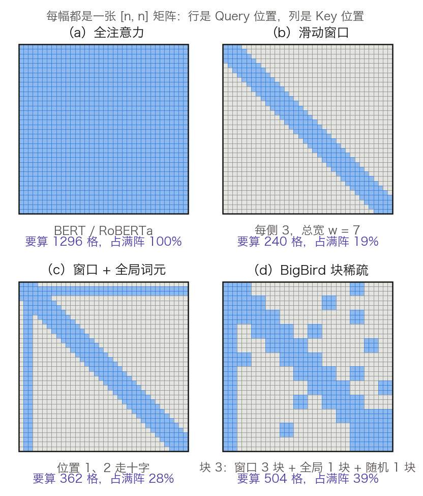
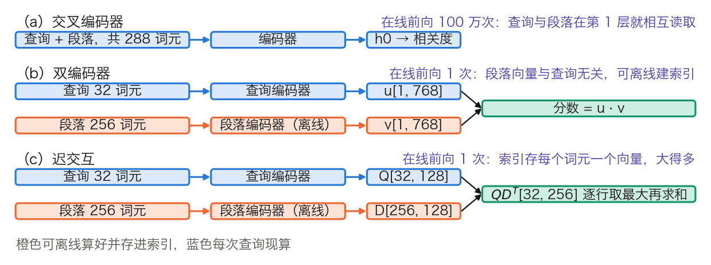

## 12.3 长文本编码器：Longformer 与 BigBird

12.2 的三条改进分别落在训练配方、参数量和预训练目标上：更充分的训练、把参数换个方式存、把损失铺满所有位置。模型一次能看多长的输入，三条都没有碰过。本节先处理这一条，再交代编码器今天真正的用武之地。前半讲稀疏注意力怎样把 512 推到 4,096，代价是什么，以及为什么这条路线没有成为长上下文的主流；后半讲句向量、检索与重排序，并给出编码器相对解码器的成本账。

### 12.3.1 512 的两个来源

BERT 的 512 有两个不同性质的来源，混在一起会得出错误的结论。

硬上限来自位置嵌入表：`max_position_embeddings` 是 512，第 513 个位置根本查不到向量。这是一个越界错误，不是“效果变差”。

当初为什么选 512，才轮到二次开销。按 3.8.7 的记法，一层的计算量约为 `24Td² + kT²d`，其中 T 是词元数、d 是 `d_model`。因果掩码下只需算下三角，`k = 2`；编码器的注意力是满阵，`k = 4`。代入 BERT-Base 的 `d = 768`、12 层、`T = 512`：

$$
\text{权重项} = 24 \times 512 \times 768^2 \times 12 = 87.0\ \text{GFLOPs}
$$

$$
\text{注意力项} = 4 \times 512^2 \times 768 \times 12 = 9.7\ \text{GFLOPs}
$$

一次前向共约 96.6 GFLOPs，注意力只占 10%。把 T 翻到 4,096，权重项线性涨到 8 倍、注意力项按平方涨到 64 倍，两项分别是 696 和 618 GFLOPs，注意力从 10% 升到 47%。后一个数由未取整的 9.664 乘 64 得 618.5，用四舍五入后的 9.7 去乘会差 0.4%。这才是二次项开始咬人的地方，也是 Longformer 与 BigBird 要动它的理由。

### 12.3.2 Longformer：窗口加十字

[Longformer](https://arxiv.org/abs/2004.05150)（Beltagy 等人，2020 年）把满阵的注意力换成两种模式的叠加。图 12-4 把四种模式画在同一张 `[n, n]` 矩阵上，与 [2.4 节](../02_attention/2.4_self_cross_causal.md)的掩码家族图可以对照着看。

图 12-4：四种注意力模式在同一张 `[n, n]` 矩阵上的形状（[生成脚本](https://github.com/yeasy/llm_internals/blob/main/tools/figures/ch12_sparse_patterns.py)）。为了画得出来取 n = 36，窗口宽度与块大小相对序列长度按比例放大；第四幅的全局与随机块为画面清晰各只取 1 块，真实配置是 3 个窗口块加 2 个全局块加 3 个随机块，见 12.3.3。真实配置整体稀疏得多，见表 12-8。蓝色格表示这一对要算分数。

**滑动窗口。** 每个位置只看自己两侧各 `w/2` 个位置。Longformer-base 取 `w = 512`，即每侧 256，配置键是 `attention_window`，它是一个每层一个值的列表，发布权重里 12 层全是 512。

**全局注意力。** 少数位置看所有人，同时被所有人看，在矩阵上是一个十字。要紧的是这个十字对称：全局词元既读全序列，也被全序列读到，信息才能双向汇聚。全局位置按任务选：分类任务给 `[CLS]`，问答任务给全部问题词元。全局注意力另用一套投影 `Q_g / K_g / V_g`，与窗口注意力的 `Q_s / K_s / V_s` 分开学，论文说明这一点对下游成绩关键。

**分数个数怎么算。** 取 `n = 4096`，一个头一层：

| 模式 | 每头的分数个数 | 相对全注意力 | 12 头 fp16 的单层分数矩阵 |
| --- | ---: | ---: | ---: |
| 全注意力 | `4096² = 16,777,216` | 1 | 384.0 MiB |
| 滑动窗口 `w = 512` | `4096 × 513 = 2,101,248` | 1/7.98 | 48.1 MiB |
| BigBird 块稀疏 | `4096 × 512 = 2,097,152` | 1/8.00 | 48.0 MiB |

表 12-8：`n = 4096` 时三种模式要算多少个注意力分数。窗口那一行按每个位置看 `w + 1 = 513` 个键计（含自身，边界位置略少）；BigBird 那一行的 512 来自 12.3.3 的块算例。显存一列是 `分数个数 × 12 头 × 2 字节`，只数分数矩阵本身，按 1 MiB = 1,048,576 字节折算（全注意力那格是 402,653,184 字节）。

8 倍这个数字随处可见，来源就在这里：4,096 的序列上，每个位置从看 4,096 个键降到看约 512 个。

**多层堆叠的感受野。** 单层只看 `w` 个邻居，L 层堆叠后理论感受野是 `L × w`。Longformer-base 是 `12 × 512 = 6144 > 4096`，所以 12 层足以让任意两个位置连通。但连通不等于好用：跨越 4,096 个位置最少要 `4096 / 512 = 8` 跳，每一跳都经过一次加权平均，远距离的精确匹配会被稀释。全局词元正是为绕开多跳而设的一条捷径。论文在自回归语言建模那一组实验里还用了两个补充手段：低层用小窗口、高层用大窗口，并在高层的少数头上加空洞（dilation）。这两项没有用在预训练的编码器上：论文报告在少数头上加空洞反而掉点，推测是与 RoBERTa 的预训练权重不兼容。

**从 RoBERTa 续训。** 这是工程上最有价值的一点。Longformer 不从头训练，而是从 RoBERTa 权重出发：窗口取 512，使每层的计算量与 RoBERTa 相当；位置嵌入表从 512 行扩到 4,096 行，新行不随机初始化，而是把原来的 512 行**复制**若干次。理由是已有分析表明 BERT 的注意力头强烈偏好局部上下文，复制初始化在除分界处之外的所有地方都保住了这种局部结构。之后只需少量 MLM 续训。发布配置里 `max_position_embeddings` 是 4,098，比 4,096 多两行，与 RoBERTa 的位置偏移约定一致。

### 12.3.3 BigBird：块稀疏与随机图

[BigBird](https://arxiv.org/abs/2007.14062)（Zaheer 等人，2020 年）在窗口与全局之外加了第三种模式：每个位置随机看若干个远处位置。三种模式叠起来就是图 12-4 的第四幅。

**为什么要随机。** 论文把自注意力看成一张有向图，稀疏化就是图的稀疏化问题。Erdős–Rényi 随机图只要有 `Θ̃(n)` 条边，任意两点间的最短路径就是节点数的对数量级，谱性质上也逼近完全图。随机注意力的作用是把“任意两点相隔很远”这种情形压掉，让信息混合得快。窗口负责局部性，随机负责短路径，全局负责枢纽。

**块稀疏怎样落到矩阵乘法。** 逐个位置做随机查表，在 GPU 上是最坏的访存模式：碎片化的小跨度读取用不上合并访存。BigBird 的做法是把查表按块对齐，论文称之为 blockify。发布配置 `google/bigbird-roberta-base` 的参数是 `block_size = 64`、`num_random_blocks = 3`，论文表 8 的 BigBird-itc 一列同时给出全局 `g = 2 × b`、窗口 `w = 3 × b`。于是每个查询块看

$$
(\underbrace{3}_{\text{窗口块}} + \underbrace{2}_{\text{全局块}} + \underbrace{3}_{\text{随机块}}) \times 64 = 512 \text{ 个键}
$$

`4096 / 512 = 8`，正是摘要里“可处理 8 倍长度”的来源。对齐之后，稀疏注意力变成一串稠密的小矩阵乘法，能直接喂给张量核。

**理论结果要归对位置。** 论文证明 BigBird 是序列函数的通用逼近器并且图灵完备，但摘要把理论分析的收获点名归给了 `O(1)` 个全局词元（例如 `[CLS]`），不是随机注意力：证明依赖的是含星形结构的稀疏图。

**论文自己给了反例。** 第 3.4 节“Limitations”构造了一个任务：全注意力 `O(1)` 层可解，而在标准复杂度假设下，任何每层只有 `Õ(n)` 条边的稀疏注意力都需要 `Ω̃(n)` 层。所以“表达力等价”只在不限层数时成立；同等深度下，稀疏注意力严格弱于全注意力。把图灵完备读成“没有全注意力能做而 BigBird 不能做的事”，忽略了层数这个代价。

**短序列上会自动退回。** 块稀疏要成立，序列必须长到放得下所有块。`transformers` 的实现里这个门槛是 `(5 + 2 × num_random_blocks) × block_size`，默认值下等于 704；低于它就打印一条警告并把 `attention_type` 切回 `original_full`。这也说明了稀疏注意力的适用区间：短序列上它只有开销，没有收益。

### 12.3.4 稀疏注意力的代价，以及这条路线的去向

稀疏模式省的是理论计算量，不是自动省的墙钟时间。三条代价依次出现。

**要自己写内核。** 用掩码把不需要的格子置 `-∞`，算得一点不少。Longformer 先后给出三种实现：纯 PyTorch 的循环版省显存但慢到只能测试用，分块版支持非空洞的情形、用于预训练与微调，以及一个用 TVM 生成的自定义 CUDA 核，用在语言建模实验上。BigBird 走的是块对齐这条路。两者都说明同一件事：稀疏注意力的收益要靠专门的实现兑现。

**FlashAttention 改变了对照组。** FlashAttention 分块计算注意力，不把 `[T, T]` 的分数矩阵落回显存，显存占用从平方降到线性，计算量仍是平方（见 [10.3 节](../10_inference_optimization/10.3_flash_attention.md)）。它省掉的正是表 12-8 里那 384 MiB。在 8K 以内，全注意力配 FlashAttention 往往比稀疏注意力更快也更简单，因为后者的分支与索引开销不小。Ring Attention（见 [10.3 节](../10_inference_optimization/10.3_flash_attention.md)的 10.3.5）则是另一件事：它把二次开销切开摊到多卡上，改变的是谁来承担，不是总量。

**主流改成了层间交替。** 与其让每一层都稀疏，不如让多数层局部、少数层全局，两者叠加后既有局部分辨率又有全局通路。这正是 12.3.5 的 ModernBERT 的做法，解码器一侧的滑动窗口混合层是同一思路（见 [14.1 节](../14_future_trends/14.1_efficient_attention.md)）。

**对到实现。** `LongformerConfig.attention_window` 是每层一个值的列表，前向另收一个 `global_attention_mask` 指定哪些位置走全局。`BigBirdConfig.attention_type` 取 `"block_sparse"` 或 `"original_full"`，配合 `block_size` 与 `num_random_blocks`；`google/bigbird-roberta-base` 的 `max_position_embeddings` 是 4,096、`vocab_size` 是 50,358。

### 12.3.5 ModernBERT：把解码器时代的部件搬回编码器

[ModernBERT](https://arxiv.org/abs/2412.13663)（Warner 等人，2024 年）把 BERT 的每一处旧部件逐条换掉。表 12-9 逐项对照，第三列是 ModernBERT 发布配置里的实际取值，第四列是对应的配置键。

| 部件 | BERT-Base | ModernBERT-base | 配置键 |
| --- | --- | --- | --- |
| 位置编码 | 可学习绝对位置表，512 行 | RoPE，全局层 θ = 160,000、局部层 θ = 10,000 | `global_rope_theta`、`local_rope_theta` |
| 归一化位置 | Post-LN | Pre-LN，并在嵌入层后补一个 LayerNorm | — |
| 前馈 | GELU，中间层 3,072 | GeGLU，中间层 1,152、GLU 上投影 2,304 | `intermediate_size` |
| 偏置项 | 各线性层都有 | 除最后的解码线性层外全部关闭 | `attention_bias`、`mlp_bias`、`norm_bias` |
| 注意力 | 每层都是全注意力 | 每 3 层一层全局，其余为 128 词元的局部滑动窗口 | `global_attn_every_n_layers`、`local_attention` |
| 层数与宽度 | 12 层 / 768 | 22 层 / 768 | `num_hidden_layers` |
| 词表 | 30,522 | 50,368（64 的倍数，含 83 个预留位） | `vocab_size` |
| 序列长度 | 512 | 8,192 | `max_position_embeddings` |
| 句间任务 | NSP | 无 | — |
| 遮盖率 | 15% | 30% | — |
| 训练词元量 | 约 `1.31 × 10¹¹`（按全程 512 计） | `2 × 10¹²` | — |

表 12-9：ModernBERT-base 相对 BERT-Base 的逐项替换。ModernBERT-base 一列取自 [ModernBERT 论文](https://arxiv.org/abs/2412.13663)第 2 节与表 4，并与 `answerdotai/ModernBERT-base` 的 `config.json` 逐键核对过；BERT-Base 一列见 12.1.3 与 12.1.4，其训练词元量按全程 512 计，按实际排布只有 `4.26 × 10¹⁰`。论文自报 base 149M、large 395M（22 层与 28 层）。

149M 可以复核。一层是四个无偏置的线性层加两个只有权重的 LayerNorm：`Wqkv[768, 2304]`、`Wo[768, 768]`、GeGLU 的上投影 `Wi[768, 2304]`（输出切成两半，一半过激活、一半当门，见 [3.4 节](../03_components/3.4_feedforward.md)）与下投影 `[1152, 768]`，合 5,015,040。

$$
\underbrace{22 \times 5{,}015{,}040 - 768}_{\text{22 层，第 1 层少一个 LayerNorm}} + \underbrace{50368 \times 768 + 768}_{\text{嵌入与其后的 LayerNorm}} + \underbrace{768}_{\text{末尾的 LayerNorm}} = 149{,}014{,}272
$$

减去的那个 768 是实现细节：第 1 层的注意力前置归一化是恒等映射，因为嵌入层后面已经归一化过一次。词嵌入与解码矩阵共享，再加上 MLM 头的 590,592 与解码偏置 50,368，得 149,655,232，与 `answerdotai/ModernBERT-base` 的张量元数据一致。

三条设计值得单独说。其一，遮盖率从 15% 提到 30%，论文的依据是“15% 已被证明并非最优”，引的是 Wettig 等人 2023 年的[遮盖率研究](https://arxiv.org/abs/2202.08005)。其二，去填充（unpadding）把一个批里的变长序列拼成一条连续序列再算，省掉填充位置的全部计算。其三，注意力混用两代内核：全局层用 FlashAttention 3、局部层用 FlashAttention 2，因为当时的 FA3 还不支持滑动窗口。

收益不是全面碾压，要分场景读。论文表 2 给的是 RTX 4090 上的吞吐，单位是千词元每秒。定长短序列上 BERT-base 为 180.4、ModernBERT 为 148.1，BERT 更快。换成变长短序列，BERT 降到 90.2，ModernBERT 只降到 147.3，去填充的收益在这里兑现。长序列一栏 BERT 直接不支持。最大批大小则是 1,096 对 1,604。所以“更快”这句话的准确说法是：在变长输入和长序列上明显更快，在定长短序列上不一定。

### 12.3.6 句向量与检索：编码器今天的主战场

前面五个小节都在讲模型本身。真正让编码器在今天仍然大量部署的，是检索、重排序与分类这一类负载。这一小节交代它们怎样从 `X⁽ᴸ⁾` 得到可比较的向量，以及三种结构的成本差别。

**池化。** 要把 `[T, 768]` 压成一个 `[768]`。最常用的两种做法是取 `[CLS]` 那一行，和对所有非填充位置取平均。[12.1.7 节](12.1_bert.md)已经给出结论：未经针对性微调时，两者都不好用。Sentence-BERT 在七个语义相似度数据集上的平均相关系数是 `[CLS]` 29.19、平均池化 54.81，而平均 GloVe 词向量是 61.32。原因是 `[CLS]` 只被 NSP 这个二分类任务训练过，MLM 从未要求任何一个位置去概括整句。

平均池化有一处必须按掩码来：`u = (Σᵢ mᵢ hᵢ) / Σᵢ mᵢ`，`m` 是注意力掩码。把填充位置一起平均进去，同一句话在不同批次里会因为填充长度不同而得到不同的向量，是这一步最常见的实现错误。`sentence-transformers` 把池化做成独立模块，用 `1_Pooling/config.json` 配置。发布模型 `sentence-transformers/all-MiniLM-L6-v2` 里 `pooling_mode_mean_tokens` 为真、`pooling_mode_cls_token` 为假，后面还串一个 L2 归一化模块，使余弦相似度与内积等价。

微调之后差别会缩小。[Sentence-BERT](https://arxiv.org/abs/1908.10084)（Reimers 与 Gurevych，2019 年）的池化消融是：在 NLI 上训练、STS 基准上评测，平均池化 80.78、`[CLS]` 79.80、最大池化 79.07。差距不到 1 分，平均池化略优，是它的默认配置。ModernBERT 的 `classifier_pooling` 默认值也是 `mean`。[DPR](https://arxiv.org/abs/2004.04906) 则用 `[CLS]` 并取得了当时最好的检索成绩。结论是池化方式远不如“有没有为这个目标训练过”要紧。

**孪生结构与对比学习。** Sentence-BERT 把同一个编码器用两次（权重共享，即孪生网络），各自得到句向量 `u`、`v`，再按可用的标注选目标：分类数据上拼成 `(u, v, |u − v|)` 接 softmax，回归数据上直接优化余弦相似度。两座塔也可以不共享，DPR 用的就是两个独立的 BERT-base，分别编码问题与段落。

更通用的目标是 InfoNCE。落到形状上，一个批就是一次矩阵乘法：`Q[B, 768] × Dᵀ[768, B] → S[B, B]`。`S` 的对角线是正例分数，同一行其余 `B − 1` 个都当负例用，损失对每一行做一次带温度的交叉熵：

$$
\mathcal{L} = -\frac{1}{B}\sum_{i} \log \frac{\exp(S_{ii}/\tau)}{\sum_{j} \exp(S_{ij}/\tau)}
$$

`B = 1024` 时这次乘法只有 1.61 GFLOPs。编码这一批的两侧要贵得多：按表 12-10 的口径，查询侧 32 词元一次前向 5.5 GFLOPs，段落侧 256 词元一次前向约 46.0 GFLOPs，`1024 × (5.5 + 46.0) ≈ 52.7` TFLOPs。打分不到编码开销的万分之一。批内负例因此几乎是白送的。问题出在它们的质量，而这一点可以直接算。取正例余弦 0.9、随机负例 0.1、`τ = 0.05`：1,023 个随机负例给出的损失是 0.0001，正例概率已经 0.9999，梯度基本为零，这一批等于白训。把其中一个负例换成余弦 0.8 的**难负例**（hard negative），损失跳到 0.1270，是前者的 1,100 倍。

温度在同一笔账里。同一组分数改用 `τ = 0.2`，加不加那条难负例，损失只从 2.9825 变到 3.0119：softmax 太平，1,022 条随机负例的合力把难负例的信号淹掉了。`τ` 越小越接近只惩罚最难的那个负例，但前提是批里真有难的。小温度与难负例是配套的，单独调小温度只会让梯度更集中在噪声上。

难负例因此是这类训练的主要工程量。两类常见来源：从 BM25 的高位结果里取，或用上一轮模型自己检出的近邻。[ANCE](https://arxiv.org/abs/2007.00808) 的做法是在训练中周期性地用当前模型重建全库索引再挖负例，代价是每隔若干步把整个语料重编码一遍。[DPR](https://arxiv.org/abs/2004.04906) 的最佳配置是两者的组合：同一批里其他问题的正例当负例，外加一条 BM25 负例；论文同时报告再加第二条 BM25 负例不再有收益。

**三种结构的形状。** 图 12-5 把它们并排，形状按 `N = 1,000,000` 段落、查询 32 词元、段落 256 词元取值。

图 12-5：三种检索结构的形状与在线前向次数（[生成脚本](https://github.com/yeasy/llm_internals/blob/main/tools/figures/ch12_retrieval_shapes.py)）。橙色可以离线算好并存进索引，蓝色每次查询都要现算。

- **交叉编码器**：查询与段落拼成 `[CLS] q [SEP] d [SEP]` 共 288 个词元，一起过编码器得 `[288, 768]`，再由 `h₀[1, 768] × W[768, 1] → 分数`。两侧从第 1 层起就相互读取，段落侧的任何中间结果都依赖于查询，一个也存不下来。
- **双编码器**：`q[32, 768] → 池化 → u[1, 768]`，`d[256, 768] → 池化 → v[1, 768]`，分数是 `u[1, 768] × vᵀ[768, 1]`。段落侧不看查询，可以离线算成 `D[1000000, 768]`；查询时只剩一次 `u[1, 768] × Dᵀ[768, 1000000] → [1, 1000000]`。
- **迟交互**：两侧都不池化，各保留每个词元一个低维向量，`Q[32, 128]` 与 `D[256, 128]`。打分是 `Q[32, 128] × Dᵀ[128, 256] → [32, 256]`，每行取最大值再把 32 行相加，即 MaxSim。交互被推迟到打分这一步，但仍是词元级的。

代价差多少，算一笔就清楚。以 BERT-Base 为骨干，按 `2 × 非嵌入参数 × 词元数` 加上注意力的 `4T²dL` 估算一次前向：

| 结构 | 在线前向次数 | 在线编码 | 在线打分 | 索引大小 | 交互发生在哪里 |
| --- | ---: | ---: | ---: | ---: | --- |
| 交叉编码器 | 1,000,000 | 52.0 PFLOPs | 并入编码 | 不能预计算 | 第 1 层 |
| 双编码器 | 1 | 5.5 GFLOPs | 1.54 GFLOPs | 2.86 GiB（fp32）/ 1.43 GiB（fp16） | 最后一次点积 |
| 迟交互（ColBERT） | 1 | 5.5 GFLOPs | 2.10 TFLOPs | 61 GiB（fp16） | 打分时的 `[32, 256]` 矩阵 |
| 双编码器召回 100 条 + 交叉编码器重排 | 101 | 5.5 GFLOPs + 5.2 TFLOPs | 1.54 GFLOPs | 同双编码器 | 前 100 条上是第 1 层 |

表 12-10：三种检索结构在 100 万段落上的一次查询成本，按 BERT-Base 的 85,054,464 个非嵌入参数估算，`N = 10⁶` 是段落数。打分一列都按暴力全库计：双编码器是 `2 × N × 768`，迟交互是 `2 × N × 256 × 128 × 32`，前面的 2 是一次乘加算两次浮点运算。索引按双编码器每段 768 维、迟交互每段 256 个词元 × 128 维。52.0 PFLOPs 在一张 H100 上按 990 TFLOP/s 峰值、50% 利用率折算约 105 秒。

三行的读法各不相同。交叉编码器的 52.0 PFLOPs 说明它不能直接扫全库，这正是它只出现在重排位的原因。迟交互那一行要看第四列：它的在线编码与双编码器一样便宜，贵在打分，全库暴力算 MaxSim 比双编码器的内积扫描重 1,365 倍。所以 ColBERT 不这样做，而是先在词元向量上做近似最近邻检索，把候选剪到几千条再算 MaxSim；论文报告的“快 170 倍、少 14,000 倍 FLOPs”是重排序场景下相对 BERT 交叉编码器的口径。[Sentence-BERT](https://arxiv.org/abs/1908.10084) 给的是同一笔账的另一种说法：在 1 万个句子里找最相似的一对，交叉编码器要做约 5,000 万次前向、约 65 小时，改成先编码再算余弦相似度约 5 秒。

三者的分工由此确定：双编码器从全库召回，交叉编码器在召回的几十到几百条上重排，迟交互介于两者之间，保留了词元级匹配，代价是索引大一个数量级以上。

**向量检索这一步。** 双编码器把打分变成了内积，但 100 万条 768 维向量的暴力扫描只要约 1.54 GFLOPs，比编码查询本身（5.5 GFLOPs）还便宜。所以近似最近邻索引不是为百万级准备的，而是为十亿级和毫秒级延迟准备的。两类常见做法：倒排加乘积量化先用聚类把候选缩到少数几个桶，再用压缩码算近似距离；HNSW 建一张分层的近邻图，从稀疏层逐层下降做贪心搜索。两者都用召回率衡量质量，即“近似检出的前 k 条里，有多少条也在精确前 k 条里”。这是一个要显式调的旋钮：探查的桶数或搜索宽度越大，召回率越高、延迟越长。把它当成没有代价的加速，是这一步最常见的误解。

**边界。** 检索质量受两处截断限制，与模型无关。其一是召回率：重排序器再准，也只能在召回给的候选里挑。其二是分块：长文档必须切成段落再编码，切点落错地方会把答案切断；ModernBERT 一类的长上下文编码器把这一步的压力减轻了，但没有消除。

### 12.3.7 编码器为什么没有被解码器取代

上下文窗口从 4K 涨到 128K 之后，长文本处理已经不是编码器的专属领地。但嵌入、重排、分类这类负载仍然以编码器为主，理由是经济性，可以直接算。

**成本差距是多少。** 12.3.1 已经算过，BERT-Base 读 512 个词元一次前向是权重项 87.0 加注意力项 9.7，共 96.6 GFLOPs。Llama 3 8B 的前馈是 SwiGLU 三矩阵、注意力是 GQA，套不上 `24Td²` 那个式子，改按 `2 × 非嵌入参数 × 词元数` 算。按 [3.8.6 节](../03_components/3.8_gpt_inference_flow.md)表 3-24 的配置（32 层、`d_model` 4,096、8 组 K/V、中间层 14,336）逐项相加，每层是 `4096² + 2 × 4096 × 1024 + 4096² + 3 × 4096 × 14336 + 2 × 4096 = 218,112,000`。五项依次是 Q 投影、K 与 V 两个投影、输出投影、SwiGLU 的三个矩阵，以及两个 RMSNorm。32 层再加末尾的一个 RMSNorm，得 6,979,588,096 个非嵌入参数。读 512 个词元，权重项 `2 × 6,979,588,096 × 512 = 7,147` GFLOPs，因果掩码下注意力项 `2T²dL = 69` GFLOPs，合计约 7,216 GFLOPs，是前者的 75 倍。这类任务的共同特征是吞吐极高、单次输出极小：每天过上亿篇文档，每次只输出一个向量或一个分数。在这种负载下 75 倍是直接的账单差距，而质量差距远没有这么大。

**编码器的推理特性和解码器不一样。** 表 12-11 把差别列出来，可以与第 10、11 章的解码器服务对照。

| 方面 | 编码器（BERT 类） | 解码器（GPT 类） |
| --- | --- | --- |
| 一次请求的前向次数 | 1 | 1 次 Prefill + 每个输出词元 1 次 Decode |
| KV 缓存 | 没有，双向注意力下追加词元会改变所有位置 | 有，是 Decode 廉价的前提 |
| 瓶颈类型 | 计算受限，形同只有 Prefill | Prefill 计算受限，Decode 带宽受限 |
| 批处理的作用 | 直接提高算力利用率 | 主要用于摊薄权重读取 |
| 变长输入 | 去填充与序列打包收益大 | 连续批处理按请求维度调度 |
| 延迟构成 | 一次前向的时间 | TTFT 加上输出长度乘 TPOT |

表 12-11：编码器与解码器在推理侧的差别。解码器一侧的三个瓶颈见 [3.8.7 节](../03_components/3.8_gpt_inference_flow.md)与 [10.1 节](../10_inference_optimization/10.1_bottleneck.md)，调度与显存管理见 [11.2 节](../11_serving/11.2_continuous_batching.md)和 [11.4 节](../11_serving/11.4_kv_memory_management.md)。

一次前向、没有 Decode 阶段、没有 KV 缓存，意味着编码器服务里 3.8.7 的瓶颈二和瓶颈三都不存在。留下的只有瓶颈一：把算力喂饱。做法也因此简单得多，加大批、去填充、上 FlashAttention 就够了，不需要 PagedAttention 那一整套。

**用解码器做嵌入要补三件事。** 这条路走得通，但要处理三个由架构带来的问题：

- **池化位置。** 解码器是因果的，只有最后一个位置读过整句，所以最朴素的做法是取末位隐状态。代价是这个表示天然偏向句尾，它是为预测下一个词优化的，不是为概括整句优化的。
- **因果掩码带来的不对等。** 前面的位置读不到后面的内容，各位置表示的信息量不对等，直接平均会把这种不对等一起平均进去。一类做法是在续训时解除因果掩码，把解码器改造回双向模型。
- **训练目标不匹配。** 语言建模优化的是下一个词的概率，检索需要的是“相似的文本靠得近”。两者没有必然联系，所以几乎所有把解码器改成嵌入模型的方案都要再接一轮对比学习。

**所以主流为什么倒向解码器。** 答案不在表征质量上，而在三处。其一是监督密度：自回归在全部位置上计损失，MLM 只在约 15% 的位置上计（见 [5.2.5 节](../05_pretraining/5.2_masked_lm.md)）。其二是 KV 缓存：它让增量生成的边际成本接近常数，而双向注意力下每加一个词都要整段重算。其三是任务形式：分类、抽取、问答都能改写成生成，一个模型加一段提示就能覆盖，不必每个任务各训一个头。这三条都与“能不能同时看到左右文”无关。反过来，在只要一个向量或一个分数的高吞吐场景里，这三条优势一条也用不上，成本差距却是照付的。编码器留在这里的理由，就是这个不对称。
