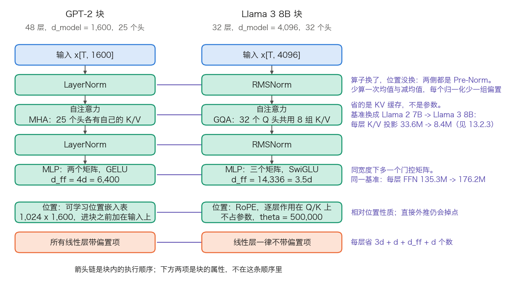
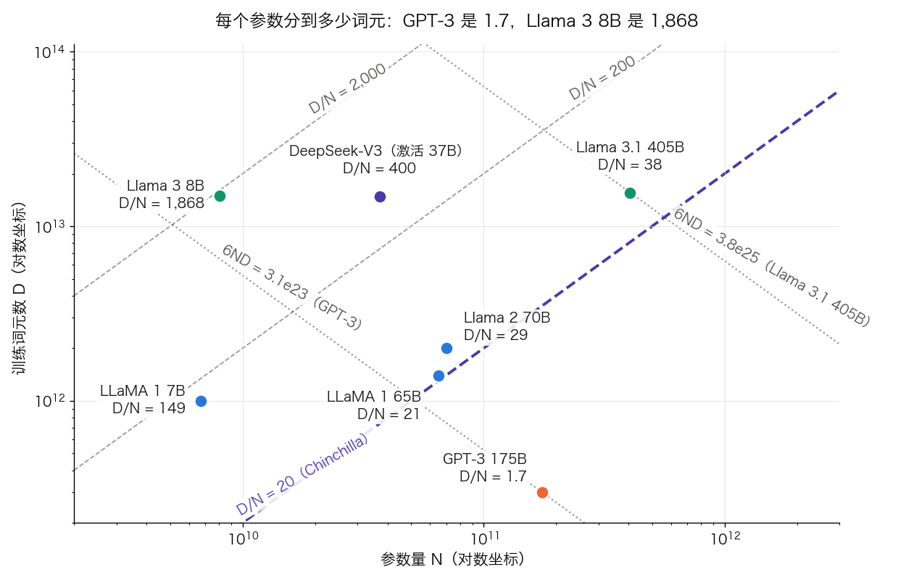

## 13.2 Llama 家族：开放权重如何改变 LLM 格局

13.1 节的账只能算到 GPT-3，再往后配置就不公开了。Llama 把账重新打开：权重、配置、论文都能拿到，参数量、KV 缓存、训练算力可以逐项复算。本节先把一份 `config.json` 读成这三笔账，再看每一代改动换来什么、付出什么，最后解释 Llama 最反直觉的一个选择：把小模型训到远超算力最优。

### 13.2.1 从 GPT-2 块到 Llama 块：五处改动各换来什么

Llama（2023 年）没有发明新结构，它把当时已被验证的五项改进装进同一个块，这套组合后来成为开放模型的共同起点。图 13-1 把两种块并排。

图 13-1：GPT-2 块与 Llama 3 8B 块的逐项对照（[生成脚本](https://github.com/yeasy/llm_internals/blob/main/tools/figures/ch13_block_diff.py)）。青绿标出改动的部件，橙色标出偏置项这一处删减。竖直箭头是块内的执行顺序，两侧相同：归一化在前，再读上下文，再逐位置加工。下方两项是块的属性而非流程步骤：位置嵌入表在进入第一个块之前就加到输入上，偏置项是所有线性层的共同设定。

五处改动的收益与代价列在表 13-3。

| 部件 | GPT-2 的做法 | Llama 的做法 | 换来什么 | 代价与备选 |
| --- | --- | --- | --- | --- |
| 位置 | 可学习位置嵌入表，加在输入上 | RoPE，每层作用在 Q、K 上 | 相对位置性质；不占参数；换上下文长度不必换表 | 直接外推到训练长度数倍会掉点，需位置内插、NTK 或 YaRN（见 [4.3 节](../04_position_encoding/4.3_rope.md)）；备选是 ALiBi |
| 归一化 | LayerNorm，放在子层之前 | RMSNorm，放在子层之前 | 少算一次均值与减均值，每个归一化少一组偏置 | 去掉中心化在部分任务上略有损失 |
| 激活 | 两个矩阵，GELU | 三个矩阵，SwiGLU | 同宽度下门控带来更强的表达 | FFN 从 $$2d \cdot d_{ff}$$ 变成 $$3d \cdot d_{ff}$$，须调小 $$d_{ff}$$ 才能持平（见 [3.4 节](../03_components/3.4_feedforward.md)） |
| 注意力 | MHA，每个头各有 K/V | GQA，若干 Q 头共用一组 K/V | KV 缓存按 $$n_h / n_{kv}$$ 成比例缩小 | K/V 表示变少，容量下降；参数几乎没省，省的是缓存 |
| 偏置项 | 各线性层都带 | 一律不带 | 每层少 $$3d + d + d_{ff} + d$$ 个数，实现更简洁 | 对表达能力的影响在这个规模下可忽略 |

表 13-3：Llama 块相对 GPT-2 块的五处改动。GPT-2 的做法取自 [GPT-2 论文](https://cdn.openai.com/better-language-models/language_models_are_unsupervised_multitask_learners.pdf)与 `openai-community/gpt2-xl` 的配置，Llama 的做法取自 [LLaMA 论文](https://arxiv.org/abs/2302.13971) 2.2 节与 [Llama 3 论文](https://arxiv.org/abs/2407.21783)表 3。

归一化这一行只换了算子，没换位置：Pre-Norm 从 GPT-2 起就是 GPT 系的做法（见 13.1.1），Llama 继承下来，改的是 LayerNorm 到 RMSNorm。把 Pre-Norm 记成 Llama 的收益是一处常见误读。

**SwiGLU 的宽度要重新取。** 三个矩阵而非两个，若仍取 $$d_{ff} = 4d$$，FFN 参数会多出一半。LLaMA 论文的做法是取 $$\frac{2}{3} \times 4d$$：

$$
\frac{8}{3} \times 4{,}096 = 10{,}922.67
$$

向上取到 256 的倍数得 11,008，正是 Llama 1 与 Llama 2 的 7B 在 `config.json` 里的 `intermediate_size`。Llama 3 8B 偏离了这条规则，取 14,336，即 $$3.5d$$，是 $$8/3$$ 规则的 1.31 倍。下一小节会看到这笔加宽的钱从哪来。

### 13.2.2 读懂 config.json：以 Llama 3 8B 为例

一份 `config.json` 里真正决定形状的只有七八个字段。表 13-4 把它们逐个对到 Hugging Face `LlamaDecoderLayer` 的模块名与权重形状，形状写法与 3.8.3 一致。

| 字段 | 取值 | 决定什么 | 对应模块与权重形状 |
| --- | ---: | --- | --- |
| `num_hidden_layers` | 32 | 块重复几次 | `model.layers.0` 到 `.31` |
| `hidden_size` | 4,096 | 残差流宽度 $$d$$ | 每个位置的向量 `x[T, 4096]` |
| `num_attention_heads` | 32 | Q 头数 $$n_h$$，$$d_h = 4096/32 = 128$$ | `self_attn.q_proj.weight[4096, 4096]` |
| `num_key_value_heads` | 8 | K/V 头数 $$n_{kv}$$，决定 KV 缓存 | `self_attn.k_proj.weight[1024, 4096]`、`v_proj` 同形 |
| `intermediate_size` | 14,336 | FFN 中间宽度 $$d_{ff}$$ | `mlp.gate_proj`、`up_proj` 各 `[14336, 4096]`，`down_proj[4096, 14336]` |
| `vocab_size` | 128,256 | 词表行数 | `model.embed_tokens.weight[128256, 4096]` |
| `tie_word_embeddings` | `false` | 输出投影是否复用嵌入表 | 另有 `lm_head.weight[128256, 4096]` |
| `rms_norm_eps` | 1e-05 | 归一化的数值下限 | `input_layernorm`、`post_attention_layernorm` 各 `[4096]` |
| `rope_theta` | 500,000 | RoPE 的基频 | 不占参数，逐层作用在 q、k 上 |
| `max_position_embeddings` | 8,192 | 训练时的上下文上限 | Llama 3.1 起改为 131,072 |

表 13-4：Llama 3 8B 的关键配置字段。取值与 `config.json` 一致，也与 [Llama 3 论文](https://arxiv.org/abs/2407.21783)表 3 的 8B 一列相符（论文的词表写作 128,000，发布权重的嵌入表另含特殊词元，共 128,256 行）。Hugging Face 的权重按 `[输出维, 输入维]` 存放，与本书 `[行, 列]` 的数据流写法互为转置。

注意 `num_attention_heads` 与 `num_key_value_heads` 是两个数。把它们混为一谈，KV 缓存会算大 4 倍，13.2.4 会给出这笔账。

### 13.2.3 参数量逐项对账：8.03B 是怎样加出来的

把表 13-4 的字段代进去。一层里有两块权重。

**注意力。** 四个投影，Q 与输出是方阵，K 与 V 因为只有 8 个头而变窄：

$$
\underbrace{4096 \times 4096}_{q\_proj} + \underbrace{2 \times 4096 \times 1024}_{k\_proj,\ v\_proj} + \underbrace{4096 \times 4096}_{o\_proj} = 41{,}943{,}040
$$

**FFN。** SwiGLU 的三个矩阵同宽：

$$
3 \times 4{,}096 \times 14{,}336 = 176{,}160{,}768
$$

两个 RMSNorm 各 4,096 个数。每层合计 $$41{,}943{,}040 + 176{,}160{,}768 + 8{,}192 = 218{,}112{,}000$$，32 层是 6,979,584,000。嵌入与 LM head 不绑定，各 $$128{,}256 \times 4{,}096$$，合计 1,050,673,152；再加最后一个 RMSNorm 的 4,096。总计：

$$
6{,}979{,}584{,}000 + 1{,}050{,}673{,}152 + 4{,}096 = 8{,}030{,}261{,}248
$$

即标称的 8.03B。这个数与 Hugging Face 检查点的张量总数完全一致，可以逐位复核。同法可得另外两档，列在表 13-5。

| 模型 | 注意力/层 | FFN/层 | 每层合计 | FFN 占比 | 嵌入 + LM head | 总参数 |
| --- | ---: | ---: | ---: | ---: | ---: | ---: |
| Llama 2 7B（MHA，$$d_{ff}=11{,}008$$，$$V=32{,}000$$） | 67.11M | 135.27M | 202.38M | 66.8% | 262.14M | 6,738,415,616 |
| Llama 3 8B（GQA，$$d_{ff}=14{,}336$$，$$V=128{,}256$$） | 41.94M | 176.16M | 218.11M | 80.8% | 1,050.67M | 8,030,261,248 |
| Llama 3.1 405B（126 层，$$d=16{,}384$$，$$d_{ff}=53{,}248$$） | 570.43M | 2,617.25M | 3,187.70M | 82.1% | 4,202.69M | 405,853,388,800 |

表 13-5：三档 Llama 的参数量逐项对账。配置取自各模型的 `config.json` 与 Llama 3 论文表 3，数值由本节算式复算；前两行与 Hugging Face 检查点的张量总数逐位一致。

三条结论从这张表直接读出。

**GQA 省下的参数很少。** 7B 到 8B，K/V 投影从每层 33.55M 降到 8.39M，每层只省 25.17M；同期 FFN 增加 40.89M，净增 15.73M。GQA 的意义不在参数。

**FFN 是每层的大头，且占比还在升。** 从 66.8% 升到 82.1%。两个原因：$$d_{ff}/d$$ 从 2.69 提到 3.5；而 GQA 下 K/V 投影的宽度固定为 $$n_{kv} d_h = 1{,}024$$，不随 $$d$$ 增长，注意力那一项因此相对缩水。13.2.1 那笔“加宽的钱从哪来”的答案就在这里：GQA 省下的参数被挪给了 FFN。

**大词表对小模型是真开销。** 8B 的嵌入与 LM head 占总量 13.1%，405B 只占 1.0%。词表从 32K 扩到 128K 换来更好的压缩率。Llama 3 论文报告英文样本从每词元 3.17 个字符提高到 3.94，相当于同样算力下多读约 24% 的文本。这笔收益由全系共享，代价却由小模型承担得更重。

### 13.2.4 GQA 省的是缓存不是参数：每词元多少字节

KV 缓存每词元要存的数是“K 与 V 两份 × K/V 头数 × 每头宽度 × 层数”，与 3.8.6 的算法一致。按 BF16 每个数 2 字节：

$$
\text{每词元字节} = 2 \times L \times n_{kv} \times d_h \times 2
$$

Llama 3 8B 代入 $$L = 32$$、$$n_{kv} = 8$$、$$d_h = 128$$：

$$
2 \times 32 \times 8 \times 128 \times 2 = 131{,}072 \text{ 字节} = 128 \text{ KiB}
$$

表 13-6 给出四档模型与一个反事实对照。

| 模型 | $$L$$ | $$n_{kv}$$ | 每词元 KV | 128K 上下文单序列 |
| --- | ---: | ---: | ---: | ---: |
| Llama 2 7B（MHA） | 32 | 32 | 512 KiB | 64.0 GiB |
| Llama 3 8B（GQA） | 32 | 8 | 128 KiB | 16.0 GiB |
| Llama 2 70B（GQA） | 80 | 8 | 320 KiB | 40.0 GiB |
| Llama 3.1 405B（GQA） | 126 | 8 | 504 KiB | 63.0 GiB |
| Llama 3.1 405B 若用 MHA | 126 | 128 | 8,064 KiB | 1,008.0 GiB |

表 13-6：每词元 KV 缓存与 128K 上下文下单条序列的占用，BF16 口径，$$d_h = 128$$。最后一行是反事实：把 405B 的 K/V 头数改回 128 会发生什么。405B 一行的 504 KiB 即 516,096 字节，与 [10.2.7 节](../10_inference_optimization/10.2_kv_cache.md)表 10-7 是同一个数，那里直接记作 516,096 B。

最后一行说明了 GQA 为什么必须在训练时就定下来。405B 若用 MHA，一条 128K 的序列要 1,008 GiB 缓存，单机装不下；改成 8 个 K/V 头后降到 63 GiB，仍然可观，但已进入分页管理与多卡切分能处理的范围（见 [11.4 节](../11_serving/11.4_kv_memory_management.md)）。反过来，已发布的 MHA 模型无法事后改成 GQA，只能靠续训转换或 KV 量化。

一个常见的误用：拿 70B 与 405B 的参数比 $$70/405 = 17.3\%$$ 去推断部署成本。这个比值适用于权重显存与每词元 FLOPs，不适用于 KV 缓存：后者之比是 $$320/504 = 63\%$$，因为缓存只随层数走，与宽度无关。

### 13.2.5 为什么把小模型训到远超 Chinchilla 最优

Chinchilla 回答的是：给定训练算力，$$N$$ 与 $$D$$ 怎样分配最省。LLaMA 论文换了一个问题。该文引言写明，Chinchilla 的目标“disregards the inference budget”，而在大规模服务时，首选的模型不是训得最快的那个，而是推理最快的那个；虽然把大模型训到某个水平可能更便宜，“a smaller one trained longer will ultimately be cheaper at inference”。该文举的例子是：Chinchilla 建议 10B 模型配 200B 词元，而他们发现 7B 模型训到 1T 词元后仍在继续变好。

这条论点的量化形式就是 $$D/N$$。图 13-2 把历代模型画在同一张对数图上。

图 13-2：参数量 $$N$$ 与训练词元数 $$D$$ 的对数图，斜虚线是 $$D/N$$ 等值线，点线是等算力线 $$6ND = C$$（[生成脚本](https://github.com/yeasy/llm_internals/blob/main/tools/figures/ch13_tokens_per_param.py)）。各点的数值取自对应论文，脚本文档注释里逐条标注了出处。落在同一条斜虚线上的模型，每个参数分到的词元数相同。

图里每个点背后的两个数与由它们算出的 $$D/N$$、$$6ND$$ 列在表 13-7。

| 模型 | 参数量 $$N$$ | 训练词元 $$D$$ | $$D/N$$ | $$6ND$$ |
| --- | ---: | ---: | ---: | ---: |
| GPT-3 175B | 174.6B | 300B | 1.7 | $$3.14 \times 10^{23}$$ |
| LLaMA 1 7B | 6.7B | 1.0T | 149 | $$4.0 \times 10^{22}$$ |
| LLaMA 1 65B | 65.2B | 1.4T | 21 | $$5.5 \times 10^{23}$$ |
| Llama 2 70B | 70B | 2.0T | 29 | $$8.4 \times 10^{23}$$ |
| Llama 3 8B | 8.03B | 约 15T | 约 1,868 | $$7.2 \times 10^{23}$$ |
| Llama 3.1 405B | 405.9B | 15.6T | 38 | $$3.8 \times 10^{25}$$ |

表 13-7：各代模型的词元/参数比与训练算力。LLaMA 1 的两行取自 [LLaMA 论文](https://arxiv.org/abs/2302.13971)表 2（7B 与 13B 训 1.0T，33B 与 65B 训 1.4T）；Llama 2 的 2T 取自 [Llama 2 论文](https://arxiv.org/abs/2307.09288) 2.1 节；405B 的 15.6T 与 $$3.8 \times 10^{25}$$ 取自 [Llama 3 论文](https://arxiv.org/abs/2407.21783)，该文用 $$6ND$$ 复算得 $$3.79 \times 10^{25}$$；8B 的 15T 按该文“a corpus of about 15T multilingual tokens”的语料口径记为约数。

**代价写在明面上。** Llama 3 8B 的 $$D/N$$ 约 1,868，是 Chinchilla 口径的九十多倍；$$6ND$$ 达到 $$7.2 \times 10^{23}$$，已经和 65B 级别的模型相当。换句话说，这笔训练算力花在了一个远非算力最优的模型上。Llama 3 论文对此有明确表述：他们的规模定律外推到 $$3.8 \times 10^{25}$$ FLOPs 建议训一个 402B 的模型配 16.55T 词元，而小模型被“train for much longer than is compute-optimal”，因为“the resulting models perform better than compute-optimal models at the same inference budget”。判据换成了每次推理的成本，训练那一笔一次性多付。

**这条选择对谁成立。** 只对推理量远大于训练量的场景成立。模型要服务数十亿次请求时，把 8B 训到 15T 换来的每次推理便宜是划算的；只跑几次实验的研究场景则相反，算力最优才是对的目标。

### 13.2.6 版本演进：每一代改的是哪一处

把前面几节的账按时间排开，每一代动的是不同的部件，表 13-8 按这条线索列出七代。

| 版本 | 参数规格 | 训练词元 | 上下文 | 改动的部件 |
| --- | --- | --- | --- | --- |
| Llama 1（2023） | 7B/13B/33B/65B | 7B、13B 为 1.0T；33B、65B 为 1.4T | 2K | 确立 RoPE + Pre-Norm/RMSNorm + SwiGLU 的组合；按推理预算选规模 |
| Llama 2（2023） | 7B/13B/70B | 2T | 4K | RLHF 后训练；70B 引入 GQA |
| Llama 3（2024） | 8B/70B | 约 15T | 8K | 词表 32K → 128K；全系 GQA；`rope_theta` 提到 500,000 |
| Llama 3.1（2024） | 8B/70B/405B | 405B 为 15.6T | 128K | 405B 为稠密 126 层；上下文靠继续预训练分六阶段扩到 128K |
| Llama 3.2（2024） | 1B/3B/11B/90B | — | 128K | 1B、3B 由 8B 一次性结构化剪枝得到，再用 8B/70B 的 logits 蒸馏；11B/90B 加视觉 |
| Llama 3.3（2024） | 70B | — | 128K | 后训练改进，使 70B 在若干基准上接近 3.1 405B |
| Llama 4（2025） | MoE 多档 | — | 因变体而异 | 从稠密转向 MoE |

表 13-8：Llama 系列版本演进，按“这一代改了哪个部件”组织。训练词元与上下文取自对应论文与模型卡；3.2、3.3、4 的词元数官方未给出完整口径，留空。各代的当前可用状态与型号列表属快变事实，见 [A.5 快变事实核验表](../appendix/a5_volatile_facts.md)。

三处值得展开。

**405B 的规模是算出来的，不是拍的。** Llama 3 论文用 IsoFLOP 曲线拟合出 $$N^{\star}(C) = AC^{\alpha}$$，得 $$(\alpha, A) = (0.53, 0.29)$$，外推到 $$3.8 \times 10^{25}$$ FLOPs 的预算建议 402B 参数配 16.55T 词元，实际取 405B 与 15.6T。该文同时指出，算力预算越大，IsoFLOP 曲线在最低点附近越平坦，所以规模选得略有偏差影响不大。

**128K 上下文不是从头训的。** 8K 的标准预训练之后，再用约 800B 词元做继续预训练，分六个阶段逐级加长；每一级的通过判据有两条：短上下文评测完全恢复，且该长度下的“大海捞针”任务全对。这是上下文扩展的工程范式，见 [14.7 节](../14_future_trends/14.7_long_context.md)。

**选稠密而不是 MoE 是一个显式决策。** 该文在“Managing complexity”一节写明，选择标准稠密架构而非 MoE，是为了最大化训练稳定性；后训练也相应地只用 SFT、拒绝采样与 DPO，不用更复杂的算法。Llama 4 转向 MoE，正是这条取舍在新的约束下被重新做了一遍（MoE 的机制与各家配置见 [14.2 节](../14_future_trends/14.2_moe.md)）。

**端侧模型的做法有公开记录。** Meta 的博客写明 1B、3B 由 Llama 3.1 8B 一次性结构化剪枝得到，再把 8B 与 70B 的 logits 作为词元级目标加进预训练阶段做蒸馏，蒸馏在剪枝之后用于恢复性能。这是剪枝与蒸馏组合使用的一个完整公开案例，方法本身见 [10.5 节](../10_inference_optimization/10.5_pruning_distillation.md)。

### 13.2.7 开放生态及其边界

Llama 1 的权重以研究许可发放后，数月内出现了大批微调衍生模型；Llama 2 改为宽松商用许可，把门槛进一步降低。它不是第一个开放的大模型，此前已有 OPT-175B 的研究申请制发放与完全开放的 BLOOM。但它是第一个在开放权重里同时具备强基础能力与宽松许可的系列，生态因此集中到这条线上。代表性工作包括斯坦福用 GPT-3.5 生成的 52K 条指令微调出的 Alpaca、基于用户分享的 ChatGPT 对话微调的 Vicuna，以及面向代码的 Code Llama。

这类工作的边界需要同样写清楚。

**“达到 ChatGPT 九成质量”的口径。** Vicuna 的这个说法来自以 GPT-4 为裁判、80 道题的初步评测，作者自己注明该方法不严谨。模型充当裁判有位置偏好、长度偏好等已知问题，评测方法见 [8.6 节](../08_alignment/8.6_evaluation.md)。

**模仿学到的可能只是风格。** [The False Promise of Imitating Proprietary LLMs](https://arxiv.org/abs/2305.15717) 的结论是，用闭源模型输出做模仿微调，能让输出风格迅速接近目标模型，却不能补上基础能力的差距；人工评分提升而知识密集型基准不动，正是这种情形的信号。

**许可约束随版本变化。** 能否用某个模型的输出训练别的模型，由该版本的许可条款决定，不同版本口径不同，选型时应直接读许可原文。
